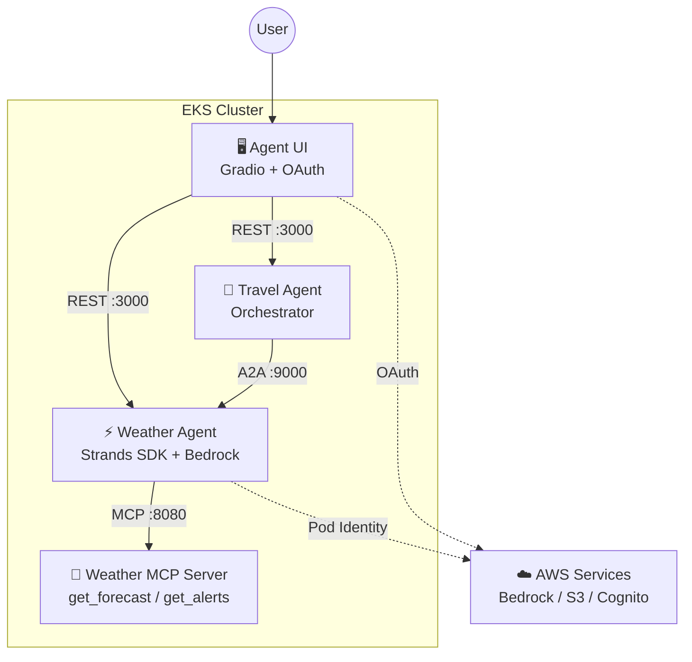
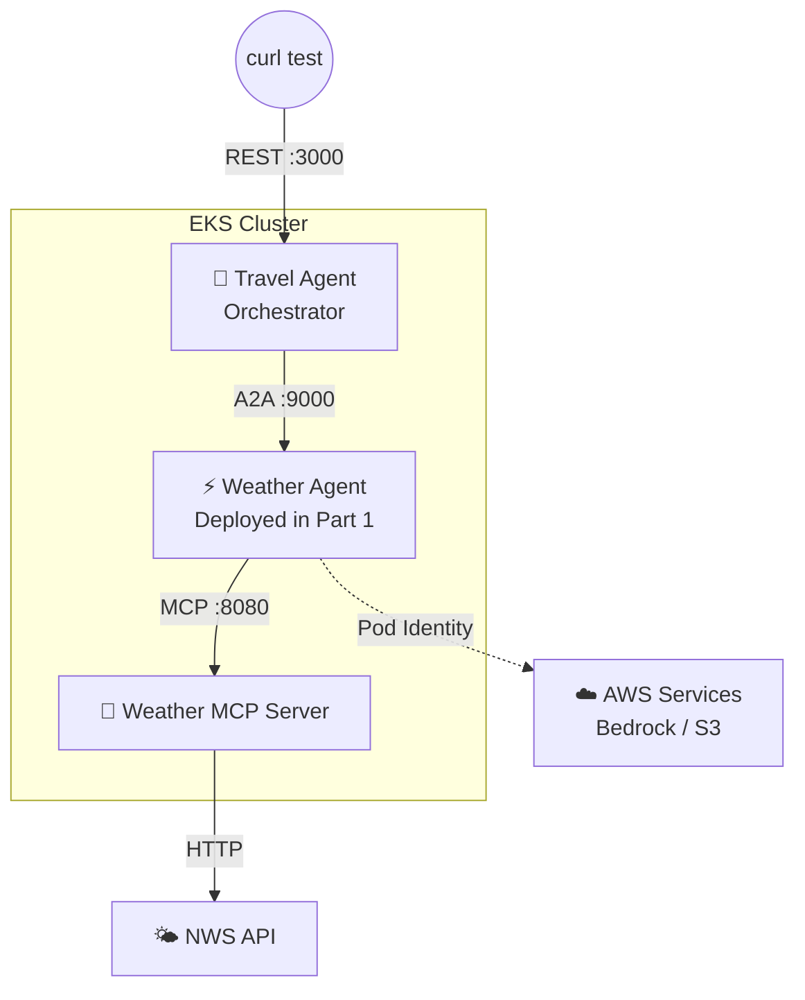

## Introduction

In [Part 1](/en/blog/2026/03/24/agentic-ai-on-eks-workshop), I deployed a Weather Agent and MCP Server on EKS, validating the flow of tool auto-discovery and external API calls.

This post covers A2A (Agent-to-Agent) protocol for multi-agent coordination. A Travel Agent receives travel questions and delegates weather lookups to the Weather Agent. Unlike single-agent setups, this introduced a new class of problems: agent discovery and trust between services.

## Architecture Overview

Here's the full workshop architecture again. Part 1 validated the Weather Agent + MCP Server components.



## Scope of This Validation

This post validates **Travel Agent → Weather Agent A2A coordination**. The Weather Agent + MCP Server deployed in Part 1 are reused as-is.



In Part 1, the test was curl → Weather Agent directly. This time, the validated flow was **curl → Travel Agent → (A2A) → Weather Agent → (MCP) → NWS API** — a two-level delegation chain.

## What is A2A?

A2A is an open protocol proposed by Google for inter-agent communication. While MCP standardizes "agent ↔ tool" connections, A2A standardizes "agent ↔ agent" coordination.

The A2A communication flow works as follows:

1. Travel Agent fetches the Weather Agent's **agent card** (`/.well-known/agent-card.json`)
2. The card reveals available skills (`get_forecast`, `get_alerts`) and the connection URL
3. Travel Agent sends a message via A2A protocol; Weather Agent processes and returns the result

The key difference from MCP: A2A delegates at the **agent level**, not the tool level. The Travel Agent asks "what's the weather like?" in natural language, and the Weather Agent decides internally which tools to use.

## Travel Agent Design

### Comparison with Weather Agent

The Weather Agent from Part 1 calls MCP tools (like `get_forecast`) directly. The Travel Agent takes the opposite approach: it **uses other agents as tools**.

| | Weather Agent | Travel Agent |
|---|---|---|
| Tool source | MCP Server (`mcp.json`) | Other agents (`a2a_agents.json`) |
| Tool types | `get_forecast`, `get_alerts` | `a2a_send_message`, `a2a_list_discovered_agents` |
| Protocol | MCP over HTTP | A2A (JSON-RPC) |
| Delegation granularity | Tool level | Agent level (natural language) |

### a2a_agents.json — Declaring Agent Connections

Just as the Weather Agent declares MCP Server connections in `mcp.json`, the Travel Agent declares A2A connections in `a2a_agents.json`.

```json
{
  "urls": [
    "http://weather-agent.agents:9000/"
  ]
}
```

At startup, `A2AClientToolProvider` fetches the agent card from this URL, auto-discovering the peer's name, skills, and connection endpoint. Adding more agents is as simple as appending URLs to this array.

### A2AClientToolProvider — Abstracting Agent Communication

The Travel Agent code is remarkably simple. `A2AClientToolProvider` abstracts away all A2A communication complexity.

```python
from strands_tools.a2a_client import A2AClientToolProvider

provider = A2AClientToolProvider(
    known_agent_urls=["http://weather-agent.agents:9000/"]
)

agent = Agent(
    model=bedrock_model,
    system_prompt=system_prompt,
    tools=provider.tools
)
```

`provider.tools` returns three tools:

| Tool | Role |
|---|---|
| `a2a_list_discovered_agents` | Returns discovered agents with their URLs |
| `a2a_discover_agent` | Fetches and caches an agent card from a given URL |
| `a2a_send_message` | Sends a natural language message to a target agent |

The LLM first calls `a2a_list_discovered_agents` to get the correct URL, then calls `a2a_send_message` to send the weather question. It can coordinate with the Weather Agent without knowing anything about its implementation — only the card information.

### System Prompt — Defining What the LLM Must NOT Do

The Travel Agent's `agent.md` contains ~100 lines of detailed system prompt. Compare this to the Weather Agent's ~10 lines. This verbosity is characteristic of orchestrator-style agents.

The core of the prompt is about constraints — what the LLM must not do.

```markdown
CORE PRINCIPLES:
1. NEVER invent or fabricate specialized information
   that should come from other agents
2. ALWAYS use the appropriate tool to query specialized agents

WEATHER INFORMATION PROTOCOL:
- Use ONLY the tools from the Weather Agent to obtain weather info
- NEVER attempt to predict, estimate, or generate weather yourself
- Clearly attribute: "According to the Weather Agent, Miami will..."
```

Why such strict prohibitions? The LLM has general knowledge about weather and can generate plausible-sounding answers like "Miami is typically warm..." without any tool calls. But that information would be unreliable and defeats the purpose of agent coordination. **Explicitly telling the LLM "don't answer even if you know"** is the key design principle for orchestrator prompts.

## Gotcha 1: Agent Card URL Problem

The first deployment failed immediately — Travel Agent couldn't reach Weather Agent via A2A.

```text
A2AClientHTTPError: HTTP Error 503: Network communication error
fetching agent card from http://0.0.0.0:9000/.well-known/agent-card.json
```

The root cause was the Weather Agent's agent card. The A2A server binds to `host=0.0.0.0` by default and publishes `http://0.0.0.0:9000/` as its `url` in the card. The initial discovery (fetching the card from the `a2a_agents.json` URL) succeeds, but the LLM reads the `url` field from the card and passes it as `target_agent_url` to `a2a_send_message`, attempting to connect to an unreachable `0.0.0.0` within the cluster.

The fix: set `a2a.http_url` in Helm values to the Kubernetes Service FQDN.

```yaml
# Weather Agent Helm values
a2a:
  http_url: "http://weather-agent.agents:9000/"
```

This overwrites the agent card's `url` to `http://weather-agent.agents:9000/`, making it reachable from other agents in the cluster. When running A2A on Kubernetes, **setting a service-discoverable URL in each agent's card is mandatory**.

## Gotcha 2: S3 Session History Poisoning LLM Context

After fixing the agent card URL, the Travel Agent still tried connecting to `http://0.0.0.0:9000/`.

The culprit was **S3 session history**. The Travel Agent persists per-user conversation history in S3. Messages from earlier failed attempts — containing the old `0.0.0.0` URL — were restored into the LLM's context. The LLM learned the stale URL from its conversation history and kept passing it to the `a2a_send_message` tool's `target_agent_url` parameter.

```bash
# Clear S3 session data
aws s3 rm s3://${TRAVEL_SESSION_BUCKET}/ --recursive
```

After clearing sessions, the Travel Agent fetched the correct URL from the agent card via `a2a_list_discovered_agents` and successfully communicated with the Weather Agent.

This is a problem unique to AI agents. In traditional microservices, config changes take effect immediately. But **AI agents with session state can have their decisions poisoned by stale conversation history**. Clearing sessions after connection changes should be part of the operational runbook.

## Verification

With both issues resolved, a travel question triggered successful A2A delegation to the Weather Agent.

```text
User: "I'm planning a trip to Miami, Florida next week.
       What will the weather be like?"

Travel Agent response (excerpt):

## Miami, Florida - 7-Day Weather Forecast

According to the Weather Agent:

**Monday** - High: 83°F, Showers and thunderstorms possible (50%)
**Tuesday** - High: 71°F, Chance of showers (40%)
...
**Saturday** - High: 77°F, Sunny ☀️ - Excellent for outdoor activities
**Sunday** - High: 78°F, Sunny ☀️ - Ideal weather

Summary: Plan indoor activities for Monday-Thursday,
save beach and water activities for the weekend!
```

The Travel Agent correctly followed its system prompt rules — attributing weather data with "According to the Weather Agent" and never generating weather information itself.

## Takeaways

- **Set agent card URLs to Kubernetes Service FQDNs** — The A2A server defaults to `0.0.0.0`, which is unreachable within the cluster. Configuring `a2a.http_url` is mandatory.
- **Session history poisons LLM decisions** — Unlike traditional services, AI agents make decisions based on conversation context. Stale URLs in session history cause persistent failures even after config fixes. Build session clearing into your operational procedures.
- **A2A delegates at the agent level** — While MCP connects at the tool level, A2A sends natural language requests and lets the receiving agent decide how to handle them. This suits orchestrator-style architectures.
