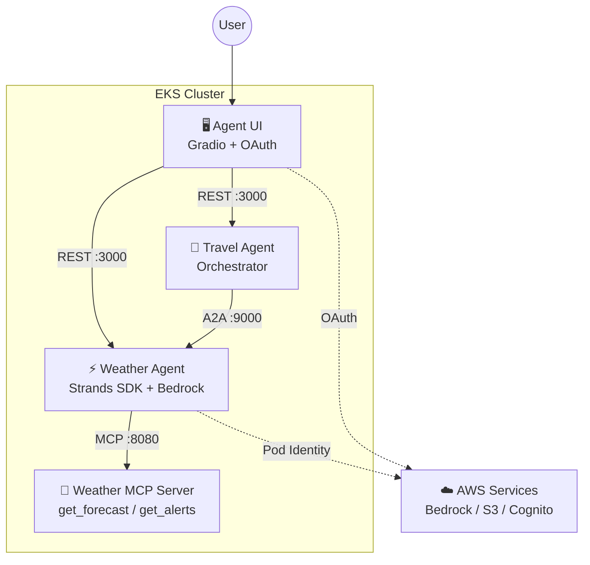

## Introduction

[Part 1](/en/blog/2026/03/23/agentic-ai-on-eks-workshop) covered Weather Agent + MCP Server, and [Part 2](/en/blog/2026/03/23/a2a-multi-agent-on-eks) validated Travel Agent's A2A coordination.

This final post fills in the remaining pieces: a Cognito OAuth-authenticated Web UI and HPA autoscaling. With these in place, all four workshop components are deployed and the agent platform is fully operational.

## Architecture Overview

With the **Agent UI** and **HPA** added in this post, all four workshop components are in place.



## Agent UI Architecture

The Agent UI combines Gradio (a Python-based web UI framework) with FastAPI. Authentication uses Cognito OAuth2's Authorization Code flow.

A notable design feature is **agent mode switching**. Users select between "Single Agent (Weather)" and "Multi-Agent (Travel)" via radio buttons, connecting to different agents from the same chat interface.

```python title="app.py"
# app.py - Agent selection logic
if agent_mode == "Single Agent(Weather)":
    endpoint_url = "http://weather-agent.agents/prompt"
else:  # Multi-Agent(Travel)
    endpoint_url = "http://travel-agent.agents/prompt"
```

Requests from the UI include Cognito JWT tokens in the `Authorization` header. Agents can run in test mode with `DISABLE_AUTH=1`, but production deployments validate JWT tokens.

## Deployment Steps

UI deployment requires Cognito setup. The workshop repository manages this via `eks/infrastructure/terraform/cognito.tf`, but this article sets it up manually.

<details className="my-4 rounded-lg border border-border bg-muted/30 p-4">
<summary className="cursor-pointer font-medium">Cognito user pool setup steps</summary>

```bash title="Terminal"
# Create user pool
POOL_ID=$(aws cognito-idp create-user-pool \
  --pool-name agentic-ai-on-eks \
  --admin-create-user-config AllowAdminCreateUserOnly=true \
  --query 'UserPool.Id' --output text)

# Create app client
CLIENT_OUTPUT=$(aws cognito-idp create-user-pool-client \
  --user-pool-id $POOL_ID \
  --client-name agent-ui \
  --generate-secret \
  --allowed-o-auth-flows code \
  --allowed-o-auth-scopes email openid profile \
  --callback-urls '["http://localhost:8000/callback"]' \
  --logout-urls '["http://localhost:8000/"]' \
  --supported-identity-providers COGNITO \
  --allowed-o-auth-flows-user-pool-client \
  --explicit-auth-flows ALLOW_USER_PASSWORD_AUTH)

CLIENT_ID=$(echo $CLIENT_OUTPUT | jq -r '.UserPoolClient.ClientId')
CLIENT_SECRET=$(echo $CLIENT_OUTPUT | jq -r '.UserPoolClient.ClientSecret')

# Create domain
DOMAIN_PREFIX="agentic-ai-$(echo $RANDOM)"
aws cognito-idp create-user-pool-domain \
  --user-pool-id $POOL_ID --domain $DOMAIN_PREFIX

# Create test users
aws cognito-idp admin-create-user \
  --user-pool-id $POOL_ID --username Alice \
  --message-action SUPPRESS
aws cognito-idp admin-create-user \
  --user-pool-id $POOL_ID --username Bob \
  --message-action SUPPRESS
```

</details>

UI deployment completes in three steps. First, build the Agent UI container image using the same Kaniko workflow from Part 1.

<details className="my-4 rounded-lg border border-border bg-muted/30 p-4">
<summary className="cursor-pointer font-medium">Agent UI build steps</summary>

```bash title="Terminal"
cd ui
tar czf /tmp/agent-ui-context.tar.gz .
aws s3 cp /tmp/agent-ui-context.tar.gz s3://kaniko-build-${ACCOUNT_ID}/build/
cd ..
```

```yaml title="kaniko-job.yaml"
apiVersion: batch/v1
kind: Job
metadata:
  name: kaniko-agent-ui
  namespace: build
spec:
  backoffLimit: 1
  template:
    spec:
      serviceAccountName: kaniko
      containers:
      - name: kaniko
        image: gcr.io/kaniko-project/executor:latest
        args:
        - "--context=s3://kaniko-build-${ACCOUNT_ID}/build/agent-ui-context.tar.gz"
        - "--destination=${ECR_HOST}/agents-on-eks/agent-ui:latest"
      restartPolicy: Never
```

</details>

**1. Set Cognito user passwords**

```bash title="Terminal"
aws cognito-idp admin-set-user-password \
  --user-pool-id $POOL_ID \
  --username Alice --password "Passw0rd@" --permanent
```

**2. Create OAuth secret**

Collect Cognito Client ID/Secret into a `.env` file and register as a Kubernetes Secret. The UI Pod loads it via `envFrom`.

```bash title="Terminal (create ui/.env)"
COGNITO_DOMAIN="https://${DOMAIN_PREFIX}.auth.${AWS_REGION}.amazoncognito.com"
JWKS_URL="https://cognito-idp.${AWS_REGION}.amazonaws.com/${POOL_ID}/.well-known/jwks.json"

cat > ui/.env << EOF
OAUTH_CLIENT_ID=${CLIENT_ID}
OAUTH_CLIENT_SECRET=${CLIENT_SECRET}
OPENID_CONFIGURATION_URL=https://cognito-idp.${AWS_REGION}.amazonaws.com/${POOL_ID}/.well-known/openid-configuration
OAUTH_JWKS_URL=${JWKS_URL}
EOF
```

```bash title="Terminal"
kubectl create ns ui
kubectl create secret generic agent-ui \
  --namespace ui \
  --from-env-file ui/.env
```

**3. Helm deploy**

```bash title="Terminal"
helm upgrade agent-ui manifests/helm/ui \
  --install -n ui --create-namespace \
  --set image.repository=${ECR_HOST}/agents-on-eks/agent-ui \
  --set image.tag=latest
```

After deployment, `kubectl port-forward svc/agent-ui -n ui 8000:80` makes the UI available at `http://localhost:8000`. Users are redirected to Cognito login, and after authentication, the Gradio chat interface appears.

## HPA Autoscaling

The Helm chart includes an HPA template, enabled with `autoscaling.enabled=true`.

```bash title="Terminal"
helm upgrade weather-agent manifests/helm/agent \
  --namespace agents \
  -f manifests/helm/agent/mcp-remote.yaml \
  --set image.repository=${ECR_HOST}/agents-on-eks/weather-agent \
  --set image.tag=latest \
  --set env.DISABLE_AUTH=1 \
  --set env.SESSION_STORE_BUCKET_NAME=weather-agent-session-${ACCOUNT_ID} \
  --set serviceAccount.name=weather-agent \
  --set a2a.http_url=http://weather-agent.agents:9000/ \
  --set autoscaling.enabled=true \
  --set autoscaling.minReplicas=1 \
  --set autoscaling.maxReplicas=3 \
  --set autoscaling.targetCPUUtilizationPercentage=50 \
  --set resources.requests.cpu=100m \
  --set resources.requests.memory=256Mi
```

HPA is working correctly:

```text title="Output"
NAME            TARGETS       MINPODS   MAXPODS   REPLICAS
weather-agent   cpu: 3%/50%   1         3         1
travel-agent    cpu: 1%/50%   1         3         1
```

At idle, both run with 1 replica. When CPU exceeds 50%, they scale up to 3 replicas. Since EKS Auto Mode handles node provisioning automatically, configuring Pod-level HPA is all it takes for end-to-end cluster scaling.

## Resource Consumption Across All Components

Measured values for all four components at idle:

| Component | CPU | Memory | Role |
|---|---|---|---|
| Weather Agent | 3m | 405Mi | LLM calls + MCP tools |
| Travel Agent | 1m | 143Mi | A2A orchestration |
| Weather MCP Server | 1m | 56Mi | NWS API wrapper |
| Agent UI | 3m | 119Mi | Gradio + OAuth |
| **Total** | **8m** | **723Mi** | |

The idle footprint is lightweight at 8m CPU / 723Mi memory total. However, Weather Agent CPU spikes during LLM calls, making CPU-based HPA thresholds important. The MCP Server is the lightest component as a pure API proxy.

## Takeaways

- **Manage OAuth secrets via Kubernetes Secret + envFrom** — Keep Cognito Client Secrets out of Helm values by separating them into Secrets. The distinction between ConfigMaps (public config) and Secrets (credentials) is key to agent platform operations.
- **HPA + EKS Auto Mode for complete scaling** — Pod-level HPA is all you need; Auto Mode handles node provisioning. Agents have bursty load characteristics from LLM calls, making CPU-based HPA a natural fit.
- **723Mi total for 4 components** — The idle footprint is light. In production, session management (S3) and model invocation (Bedrock) costs dominate rather than compute.

Looking back across the series, the key takeaway is that production AI agents introduce three design axes absent from traditional microservices: **protocol design (MCP / A2A), configuration externalization (ConfigMap / Secret), and session state management**. The workshop covers all three through its four-component architecture — a well-crafted learning experience.

## Cleanup

Once you're done with the validation, delete the created resources.

<details className="my-4 rounded-lg border border-border bg-muted/30 p-4">
<summary className="cursor-pointer font-medium">Resource deletion steps</summary>

```bash title="Terminal"
# Delete Helm releases
helm uninstall agent-ui -n ui
helm uninstall travel-agent -n agents
helm uninstall weather-agent -n agents
helm uninstall weather-mcp -n mcp-servers

# Delete Kaniko jobs
kubectl delete jobs --all -n build

# Delete namespaces
kubectl delete ns agents mcp-servers ui build

# Delete Pod Identity Associations
for assoc in $(aws eks list-pod-identity-associations \
  --cluster-name $CLUSTER_NAME --region $AWS_REGION \
  --query 'associations[].associationId' --output text); do
  aws eks delete-pod-identity-association \
    --cluster-name $CLUSTER_NAME --region $AWS_REGION \
    --association-id $assoc
done

# Delete IAM roles
for role in weather-agent-pod-role travel-agent-pod-role kaniko-pod-role; do
  aws iam delete-role-policy --role-name $role --policy-name bedrock-s3 2>/dev/null
  aws iam delete-role-policy --role-name $role --policy-name ecr-s3 2>/dev/null
  aws iam delete-role --role-name $role
done

# Delete ECR repositories
for repo in agents-on-eks/weather-mcp agents-on-eks/weather-agent \
            agents-on-eks/travel-agent agents-on-eks/agent-ui; do
  aws ecr delete-repository --repository-name $repo \
    --region $AWS_REGION --force
done

# Delete S3 buckets
for bucket in weather-agent-session-${ACCOUNT_ID} \
              travel-agent-session-${ACCOUNT_ID} \
              kaniko-build-${ACCOUNT_ID}; do
  aws s3 rb s3://$bucket --force
done

# Delete Cognito user pool (domain must be deleted first)
aws cognito-idp delete-user-pool-domain \
  --user-pool-id $POOL_ID --domain $DOMAIN_PREFIX
aws cognito-idp delete-user-pool --user-pool-id $POOL_ID
```

</details>
