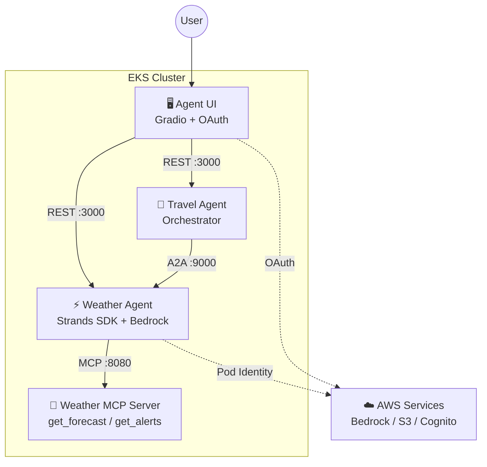
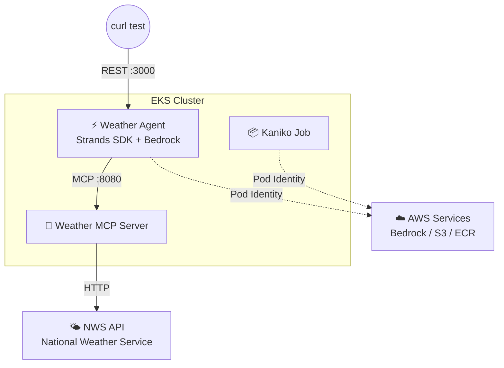

## Introduction

Calling an LLM via API is no longer enough. The real challenge for infrastructure engineers in 2026 is running AI agents in production — agents that use tools, coordinate with other agents, and maintain session state.

The [Agentic AI on EKS](https://catalog.workshops.aws/agentic-ai-on-eks/en-US) workshop by AWS offers one answer to this challenge. It combines Strands Agents SDK, MCP (Model Context Protocol), and A2A (Agent-to-Agent) protocol to build a production-ready agent platform on EKS.

This post shares what I learned from hands-on validation of this workshop. It's the first in a 3-part series that progressively builds MCP tool integration, A2A multi-agent coordination, and an authenticated UI.

## Architecture Overview

The workshop deploys four components onto EKS:



**Each component has a distinct role:**

- **Weather MCP Server** — Wraps the US National Weather Service API, exposing `get_forecast(location)` and `get_alerts(state)` as tools via the MCP protocol. It's a pure tool server with no agent logic.
- **Weather Agent** — An AI agent built with the Strands Agents SDK. Uses Bedrock Claude Haiku 4.5 as its LLM, auto-discovers MCP Server tools, and invokes them to answer weather queries.
- **Travel Agent** — A travel planning orchestrator. It doesn't generate weather data itself; instead, it delegates to the Weather Agent via the A2A (Agent-to-Agent) protocol.
- **Agent UI** — A Gradio-based web chat interface. Authenticates users via Cognito OAuth and calls the agent's REST API.

**The key design feature is that the Weather Agent serves three protocols from a single container.** The UI chats with it via FastAPI (REST, port 3000), external systems can invoke it as a tool via MCP (port 8080), and the Travel Agent coordinates with it via A2A (port 9000). This lets the same agent be reused across different contexts by selecting the appropriate protocol.

## Scope of This Validation

This post covers the core of the workshop: **Weather Agent + MCP Server**. The Travel Agent (A2A multi-agent) and Agent UI (Cognito OAuth) are left for a follow-up.



This setup validated the end-to-end flow: agent auto-discovers tools, calls an external API, and the LLM generates a response.

## Strands Agents SDK Patterns

The Weather Agent implementation reveals the design philosophy behind Strands Agents SDK. Understanding what we're building comes first — the next sections cover how to build and deploy it.

### Separation of Concerns via Three Config Files

The Weather Agent cleanly separates code from configuration:

| File | Role | Change frequency |
|---|---|---|
| `agent.py` | Agent initialization & tool loading logic | Low (code change) |
| `agent.md` | Agent name, description, system prompt | Medium (behavior tuning) |
| `mcp.json` | MCP server connection definitions | Medium (tool add/switch) |

Since `agent.md` and `mcp.json` are mounted as Helm ConfigMaps, **agent behavior and tool configuration can be changed without rebuilding the container image**.

### agent.md — Defining an Agent in Markdown

The agent's persona is defined in a markdown file. The code parses three sections — `## Agent Name`, `## Agent Description`, and `## System Prompt` — via regex and passes them to the `Agent` class.

```markdown
# Weather Assistant Agent Configuration

## Agent Name
Weather Assistant

## Agent Description
Weather Assistant that provides weather forecasts(US City, State) and alerts(US State)

## System Prompt
You are Weather Assistant that helps the user with forecasts or alerts:
- Provide weather forecasts for US cities for the next 3 days if no specific period is mentioned
- When returning forecasts, always include whether the weather is good for outdoor activities for each day
- Provide information about weather alerts for US cities when requested
```

Using markdown instead of YAML or JSON is a deliberate choice — prompts are natural language and often lengthy. Markdown offers better readability and is accessible to non-engineers.

### mcp.json — Declaring Tool Endpoints

MCP server connections are defined in `mcp.json`. Two transport types are supported: stdio (local process) and HTTP (remote server).

```json
{
  "mcpServers": {
    "weather-mcp-http": {
      "url": "http://weather-mcp.mcp-servers:8080/mcp"
    }
  }
}
```

During local development, you can use stdio to spawn a process directly. For EKS deployment, switch to HTTP to connect to a remote MCP Server — just by swapping this single file. Individual servers can also be disabled with a `disabled: true` flag.

### Agent Initialization — Auto-Discovering MCP Tools

The core of `agent.py` is just a few lines. It connects to each server in `mcp.json`, auto-discovers published tools, and passes them to the agent.

```python
from strands import Agent, tool
from strands.models import BedrockModel
from strands.tools.mcp import MCPClient

# Built-in tool (plain Python function as a tool)
@tool(name="get_todays_date", description="Retrieves today's date for accuracy")
def get_todays_date() -> str:
    return datetime.today().strftime('%Y-%m-%d')

# Configure the LLM
bedrock_model = BedrockModel(
    model_id="global.anthropic.claude-haiku-4-5-20251001-v1:0"
)

# Auto-discover tools from MCP server
mcp_client = MCPClient(lambda: streamablehttp_client(url))
mcp_client.start()
mcp_tools = mcp_client.list_tools_sync()  # → [get_forecast, get_alerts]

# Create agent (built-in tools + MCP tools)
agent = Agent(
    model=bedrock_model,
    system_prompt=system_prompt,
    tools=[get_todays_date] + mcp_tools
)
```

`MCPClient` connects to the server via MCP protocol, and `list_tools_sync()` retrieves the list of available tools (name, description, parameter schema). The agent passes this information to the LLM, which **autonomously decides which tool to call based on the user's question**.

Built-in tools (Python functions with `@tool` decorator) and MCP tools are treated uniformly — a notable feature of the Strands SDK.

### Request Processing Flow

Here's the end-to-end flow from when the FastAPI server receives a request to when it returns a response:

1. A `{"text": "What's the weather in NYC?"}` request arrives at `/prompt`
2. Auth check (Cognito JWT validation, or skipped in test mode)
3. An S3 session manager is created keyed by user ID (for conversation history persistence)
4. `create_agent()` generates an agent instance
5. `agent("What's the weather in NYC?")` is called — the LLM decides to invoke `get_forecast("New York City")`
6. The `get_forecast` tool on the Weather MCP Server is executed via MCP
7. Weather data from the NWS API is formatted into natural language by the LLM and returned

In this validation, I set `DISABLE_AUTH=1` and ran in test mode with authentication skipped.

## Building Containers with Kaniko

With the agent implementation understood, the next step is containerizing and deploying to EKS. For container image builds, I used **Kaniko** — a tool developed by Google that **builds container images inside Kubernetes Pods without requiring a Docker daemon**.

Unlike `docker build`, which needs a privileged Docker daemon process, Kaniko interprets and executes Dockerfiles in user space, enabling image builds in unprivileged Pods. It's widely used in CI/CD pipelines and environments where running a Docker daemon isn't practical.

The workflow was: upload the build context (source code) to S3, then run a Kaniko Job on EKS that fetches the context from S3, builds the image, and pushes directly to ECR.

```bash
# Upload build context to S3
tar czf /tmp/context.tar.gz .
aws s3 cp /tmp/context.tar.gz s3://${BUCKET}/build/
```

```yaml
# Kaniko Job: build on EKS → push to ECR
apiVersion: batch/v1
kind: Job
metadata:
  name: kaniko-weather-mcp
  namespace: build
spec:
  template:
    spec:
      serviceAccountName: kaniko
      containers:
      - name: kaniko
        image: gcr.io/kaniko-project/executor:latest
        args:
        - "--context=s3://${BUCKET}/build/context.tar.gz"
        - "--destination=${ECR_URI}:latest"
      restartPolicy: Never
```

The critical piece is granting ECR push permissions via Pod Identity. I attached a policy including `ecr:PutImage` and `ecr:CompleteLayerUpload` to the `kaniko` service account in the `build` namespace. Build times were roughly 70s for the MCP Server and 130s for the Weather Agent.

## Deployment and Verification

With images built by Kaniko and pushed to ECR, the Helm deployment is a two-step process — MCP Server first (since the Weather Agent references it), then the agent.

```bash
# 1. MCP Server (deploy first as Weather Agent depends on it)
helm upgrade weather-mcp manifests/helm/mcp \
  --install -n mcp-servers --create-namespace \
  -f workshop-mcp-weather-values.yaml

# 2. Weather Agent
helm upgrade weather-agent manifests/helm/agent \
  --install -n agents --create-namespace \
  -f workshop-agent-weather-values.yaml
```

A test request for NYC's 3-day forecast returned the following:

```text
Here's the weather forecast for New York City for the next 3 days:

**Today**
- Temperature: 60°F
- Conditions: Cloudy with areas of fog, showers, and thunderstorms
- Wind: 23-28 mph gusting up to 41 mph
- Precipitation: 100% chance with 0.5-0.75 inches of rainfall expected
- Good for outdoor activities: ❌ No - Heavy rain and thunderstorms expected

**Tuesday**
- Temperature: 42°F (falling to 40°F in afternoon)
- Conditions: Sunny
- Wind: 18-23 mph from the west
- Good for outdoor activities: ✅ Yes - Clear skies, though cool and windy

**Wednesday**
- Temperature: 39°F
- Conditions: Mostly sunny
- Wind: 6-12 mph from the southwest
- Good for outdoor activities: ✅ Yes - Pleasant sunny conditions, though cool
```

The system prompt rules — "3-day forecast" and "include outdoor activity suitability" — are correctly reflected. The LLM takes raw NWS API data (temperature, wind speed, precipitation) and formats it into a readable summary.

## Takeaways

- **One agent, three access paths** — Chat with it via REST (port 3000), embed it as a tool via MCP (port 8080), or call it from another agent via A2A (port 9000). Co-locating three protocols in a single container means new integration patterns without reimplementation.
- **ConfigMap-driven agent behavior** — Injecting `agent.md` and `mcp.json` via Helm values means prompt and tool changes don't require image rebuilds.
- **Pod Identity + Kaniko for Docker-free builds** — Kaniko on EKS with S3 build context and Pod Identity creates a container build pipeline that doesn't depend on a Docker daemon.

---

This is Part 1 of the Agentic AI on EKS workshop validation series.

- Part 1: Deploying AI Agents on EKS (this article)
- [Part 2: Multi-Agent Coordination with A2A Protocol](/en/blog/2026/03/25/a2a-multi-agent-on-eks)
- [Part 3: Cognito Auth UI and HPA to Complete the Agent Platform](/en/blog/2026/03/26/agent-ui-and-scaling-on-eks)
