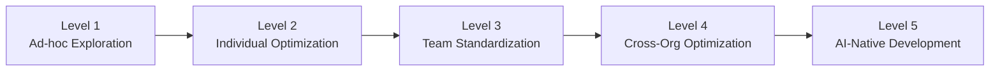

## Challenge

"Is our team actually using AI effectively?" — Few engineering leaders can answer this question with confidence.

Collecting metrics on a dashboard is pointless without a benchmark for where you should be. Sharing skills and rolling out tools across teams is scattershot without a framework for determining which initiative will have the most impact right now. This post defines an AI coding maturity model tailored specifically to software development teams, drawing on existing frameworks from Anthropic and OpenAI while narrowing the focus to coding agent adoption.

## Limitations of Existing Frameworks

Several frameworks for organizational AI adoption already exist.

**Anthropic × Asana "5C Framework"** — Based on a [survey of 5,007 knowledge workers](https://concl.io/blog/5-phases-ai-maturity), it defines five stages from Skepticism to Maturity, cross-cut by five pillars: Comprehension, Concerns, Collaboration, Context, and Calibration. Excellent for a bird's-eye view of organizational AI adoption, but too coarse-grained for the specific question of how to leverage coding agents.

**Anthropic "Building Trusted AI in the Enterprise"** — An [enterprise playbook co-developed with AWS](https://www.aigl.blog/building-trusted-ai-in-the-enterprise/) outlining four stages from AI strategy through deployment. It covers RAG, prompt engineering, and LLMOps, but targets LLM applications broadly — not developer coding workflows specifically.

**Anthropic "AI Fluency Index"** — The [4D AI Fluency Framework](https://www.anthropic.com/research/AI-fluency-index) (Delegation, Description, Discernment, Diligence) defines 24 behavioral indicators, 11 of which were directly observed across 9,830 Claude conversations to quantify individual AI literacy. Pioneering for individual-level measurement, but not a team or organizational maturity model.

**OpenAI "Staying Ahead in the Age of AI"** — A [5-step framework](https://openai.com/business/guides-and-resources/staying-ahead-in-the-age-of-ai/): Align → Activate → Amplify → Accelerate → Govern. The San Antonio Spurs' AI literacy jump from 14% to 85% is a compelling case study. Practical as an adoption guide, but not a yardstick for measuring how far a dev team has progressed with coding agents.

The common limitation across these frameworks is that **they don't account for software development as a specialized domain**. Coding agent adoption is qualitatively different from general AI tool adoption. Code correctness, test consistency, architectural coherence, security — development has unique constraints. Applying generic frameworks directly won't accurately measure where a dev team stands. What's needed is a model focused on development-specific challenges: CLAUDE.md configuration, skills library construction, review guidelines for agent-generated code.

## AI Coding Maturity Model: Five Levels

The model proposed here systematizes practical experience spanning individual optimization, team rollout, and metrics design. Levels aren't mutually exclusive — individuals within a team may be at different levels. Organizational maturity is determined by the level that the majority of members can consistently practice.

### Level 1: Ad-hoc Exploration

**State:** A few developers are experimenting with coding agents on their own. No organizational policies or standards exist; usage is voluntary and sporadic.

**Typical behaviors:**

- Trying code completion and snippet generation with ChatGPT or Copilot
- Expectations at the "lucky if it works" level
- Quality checks on generated code left to individual judgment
- Agent configuration files (CLAUDE.md, etc.) nonexistent or unmaintained

**Organizational characteristics:**

- No AI tool usage policy
- No security review process
- No cost management mechanisms
- A "use it if you want" free-for-all

**The pitfall at this level:** The biggest risk is Shadow AI — developers potentially sending proprietary code to agents via personal accounts. OpenAI's research reports that [roughly half of employees lack sufficient AI tool training](https://openai.com/business/guides-and-resources/staying-ahead-in-the-age-of-ai/). The absence of policy creates both security risk and missed opportunity.

**Key to the next level:** Establish a usage policy and create an approved tools list. The key is stating "you may use these within this scope" rather than imposing a blanket ban. An often-overlooked barrier is psychological resistance — the vague fear of "AI taking my job" and the technical pride of "I don't trust AI-generated code," particularly strong among senior engineers. Frame agents as "amplification" tools, not replacements, and create psychological safety for experimentation.

### Level 2: Individual Optimization

**State:** Developers are intentionally configuring their agents and integrating them into personal workflows. Clear productivity gains are visible at the individual level, but nothing is shared across the team.

**Typical behaviors:**

- Maintaining CLAUDE.md or custom instructions with project-specific context
- Understanding agent strengths and weaknesses, choosing appropriate tasks
- Reviewing generated code with a critical eye
- Crafting prompts deliberately to stabilize output quality

**Organizational characteristics:**

- Usage policy exists, but best practices spread only through word of mouth
- "That person is great with AI" — reputation-based, individual knowledge
- Cost management at individual or team budget level
- Agent adoption outcomes siloed within individuals

For instance, reducing a 355-line CLAUDE.md to 59 lines and structuring it with a skills system, or refining prompt templates for your own workflow — these individual-level optimizations characterize this level.

**The pitfall at this level:** The better individuals get, the wider the gap within the team. Anthropic's [AI Fluency Index](https://www.anthropic.com/research/AI-fluency-index) research found that users who iterate and refine their AI interactions show an average of 2.67 additional fluency behaviors — roughly double the non-iterative rate. They were 5.6x more likely to question the AI's reasoning. Those who use agents well keep getting better, while others fall further behind.

**Key to the next level:** Convert individual tacit knowledge into explicit, shared knowledge. The turning point from "organizing my own CLAUDE.md" to "building the team's skills library." The barrier here is people, not technology. "I don't want to share my methods" and "I don't want someone else's methods forced on me" are common forms of resistance. Start by showcasing effective developers' practices as "here's one approach" rather than attempting to mandate a perfect standard from the outset.

### Level 3: Team Standardization

**State:** Agent usage is standardized at the team level with shared skills and templates. Agent adoption is part of new member onboarding.

**Typical behaviors:**

- A team-shared skills library exists under version control
- Coding conventions and architectural constraints are reflected in agent configuration
- Review guidelines exist for agent-generated code
- New members can use agents from day one
- Basic usage metrics are being collected

Separating force-distributed core skills from team-specific customizations is the central practice at this level.

**The pitfall at this level:** Optimization progresses within teams, but silos form between them. Frontend and backend teams independently building their own skills can lead to inconsistencies at API boundaries.

**Key to the next level:** Cross-team metrics collection and organization-level governance. Building a cross-team dashboard is the foundation for this transition.

### Level 4: Cross-Organization Optimization

**State:** Agent usage metrics are collected and analyzed organization-wide, enabling data-driven decisions. Best practice sharing across teams is institutionalized.

**Typical behaviors:**

- Cross-agent dashboards are operational
- KPIs like cost per PR, adoption rate, and quality indicators are defined with pre-set action thresholds
- Security and compliance playbooks are in place
- Skills and practices are regularly shared across teams
- A dedicated agent team (or platform team role) exists

**The pitfall at this level:** Over-indexing on metrics turns number optimization into the goal itself. "Increase agent usage rate" becomes the target, leading to forced application on tasks where agents aren't effective. It's critical to separate comparable metrics from non-comparable ones — usage rate can be compared across teams, but cost per PR depends on task type and can't be directly compared.

**Key to the next level:** A cultural shift from treating agents as "tools" to treating them as "team members." Moving from technical optimization to redesigning the development process itself.

### Level 5: AI-Native Development

**State:** Development processes are designed with agent involvement as a given. The starting point is "how do we develop with agents?" rather than "how do we develop without them?"

**Typical behaviors:**

- Agents are involved end-to-end from spec writing through code generation, testing, and review
- Codebases and documentation are structured for agent comprehension (rich READMEs, clear module boundaries, strict type definitions)
- Review processes are built around agent output
- Agents themselves propose and improve skills and workflows
- Boundaries between "delegate to agent" and "human decides" are documented
- PR templates include fields for recording agent involvement scope
- Architecture Decision Records (ADRs) account for agent constraints and characteristics

**Organizational characteristics:**

- "AI collaboration skills" are part of hiring criteria
- "Agent involvement points" are considered from the start when designing development processes
- Systems exist to continuously adapt processes as agents evolve

Anthropic's 5C framework reports only 7% of organizations reach the final maturity stage. For coding agents specifically, the percentage is likely even smaller. No organization has fully achieved Level 5 yet, but early signs are emerging — teams structuring module boundaries for agent comprehension, recording agent involvement scope in PR templates, and building "skills that manage skills" where agents run their own self-improvement cycles.

The point of this level isn't "reaching a perfect state" but "maintaining a direction of continuous evolution."

## Level Assessment: Where Is Your Team?

Answer these questions to roughly assess your team's current position.

| Level    | Criteria                                                                                                                                                     |
| -------- | ------------------------------------------------------------------------------------------------------------------------------------------------------------ |
| Level 2+ | □ Security policy for agent usage is established / □ Approved agent list exists                                                                              |
| Level 3+ | □ Team-shared skills library or config templates exist / □ Review guidelines for agent-generated code exist / □ Agent usage is part of new member onboarding |
| Level 4+ | □ Cross-team metrics dashboard is operational / □ Action thresholds based on metrics are defined / □ Practice sharing across teams is institutionalized      |
| Level 5  | □ Development processes are designed assuming agent involvement / □ Systems exist to continuously adapt processes as agents evolve                           |

If all criteria for a level are met, the team has reached that level. Any gap is the next improvement target.

Not every team needs to aim for Level 5. The optimal level depends on team size, product characteristics, and security requirements. A sub-10-person startup might get sufficient value at Level 2–3, while a heavily regulated financial firm might need Level 4 governance.

For organizations unsure where to invest, L1→L2 is the most rational starting point. Policy creation and tool selection are low-cost with immediate returns. Investment grows at higher levels, but AI coding agents are evolving rapidly — organizations that build AI-native development culture early can convert agent improvements directly into competitive advantage.

## Limitations of This Model

To be frank, this model has limitations. It systematizes practical experience at the individual and team level, not a maturity model validated across many organizations. Consider it a hypothesis-stage framework to be refined through application and verification.

First, **coding agents evolve too fast**. Best practices from six months ago may be obsolete today. The model's level definitions need periodic revision rather than static application.

Second, **organizational context dependency is high**. A 20-person startup and a 500-person enterprise will have completely different practices at the same Level 3. This model is a framework for "what to think about," not a recipe for "what to do."

Third, **it relies heavily on qualitative judgment**. "Having review guidelines" could mean anything from a rubber-stamp checklist to genuinely effective guidance. Supplement qualitative assessments with metrics dashboard data.

Fourth, **pursuing high maturity carries its own risks**. Deepening agent dependency can reduce opportunities for junior developers to build foundational coding skills. Business continuity risk emerges when development halts completely during agent outages. Furthermore, the large volumes of agent-generated code may look correct at generation time but lack verified long-term maintainability. Organizations targeting Level 4+ should deliberately build in "ability to develop without agents" as a design constraint.

## Takeaways

- **Don't apply generic frameworks directly** — Anthropic's 5C and OpenAI's 5-step are excellent models, but too coarse for coding agent adoption. A model reflecting development-specific challenges (code quality, review, architectural consistency) is needed.
- **L1→L2 has the highest ROI** — Policy creation and tool selection are low-cost with immediate payoff. If in doubt, start here.
- **Review guidelines are the starting point for team standardization** — Sharing review perspectives for agent-generated code before building a skills library raises the entire team's AI literacy baseline.
- **Maturity is a map, not a destination** — Not every team needs Level 5. Use this framework to identify your optimal level and make rational investment decisions to get there.
