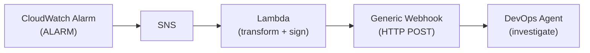

## Introduction

[Part 1](/en/blog/2026/04/01/aws-devops-agent-ga-verification) through [Part 4](/en/blog/2026/04/01/aws-devops-agent-eventbridge-notification) covered DevOps Agent setup, Skills, Prevention, and EventBridge integration. Part 4 focused on "notification after investigation completes" — this article tackles the complementary theme: "automatically starting investigations."

DevOps Agent provides a [Generic Webhook](https://docs.aws.amazon.com/devopsagent/latest/userguide/configuring-capabilities-for-aws-devops-agent-invoking-devops-agent-through-webhook.html) that accepts HTTP POST requests to trigger investigations from external systems. Combined with CloudWatch Alarms, this enables a fully automated pipeline from alarm firing to investigation start with no human intervention.

This article first verifies basic Webhook behavior, then builds a CloudWatch Alarm → SNS → Lambda → Webhook auto-trigger pipeline and measures end-to-end latency.

Prerequisites:

- An Agent Space from [Part 1](/en/blog/2026/04/01/aws-devops-agent-ga-verification) running
- The EventBridge rule from [Part 4](/en/blog/2026/04/01/aws-devops-agent-eventbridge-notification) (`source: aws.aidevops` → CloudWatch Logs) — used for timeline tracking
- AWS CLI v2 with Lambda / SNS / IAM / CloudWatch permissions
- A target EC2 instance (this article reuses web-app-prod-01 from Part 1)

Skip to the [Summary](#summary) for results only.

## Verification 1: Generic Webhook Setup and Manual Trigger

### Generating the Webhook

Generic Webhook generation is console-only. The CLI / API provides only `list_webhooks` for listing existing webhooks — there is no create or delete endpoint.

1. AWS Management Console → DevOps Agent → select your Agent Space
2. "Capabilities" tab → "Webhook" section → "Configure"
3. Click "Generate webhook"

This produces:

- **Webhook URL**: `https://event-ai.{region}.api.aws/webhook/generic/{webhook-id}`
- **HMAC Secret**: The secret key for SHA-256 signing (only visible on this screen)

Generic Webhooks use HMAC authentication exclusively. Bearer token authentication is available only for integration-specific webhooks (Splunk, Datadog, New Relic, ServiceNow, Slack).

### HMAC Signature Implementation

Webhook requests require three headers:

- `Content-Type: application/json`
- `x-amzn-event-timestamp`: ISO 8601 timestamp
- `x-amzn-event-signature`: HMAC-SHA256 signature (Base64-encoded)

The signature input is the concatenation of `{timestamp}:{payload}`.

```bash title="Terminal (HMAC signature generation)"
SIGNATURE=$(echo -n "${TIMESTAMP}:${PAYLOAD}" \
  | openssl dgst -sha256 -hmac "$SECRET" -binary \
  | base64)
```

### Payload Structure

Fields in the Webhook payload, organized from the documentation's request body example and sample code. The documentation does not explicitly specify which fields are required, so the classification below is based on their presence in sample code.

| Field | Usage in Samples | Description |
|---|---|---|
| `eventType` | All samples | Only `"incident"` is used in samples |
| `incidentId` | All samples | Unique identifier. Affects behavior on duplicate submissions (see below) |
| `action` | All samples | Only `"created"` is used in samples |
| `priority` | All samples | `"HIGH"` / `"MEDIUM"` / `"LOW"` — reflected in investigation task priority |
| `title` | All samples | Becomes the investigation task title |
| `description` | All samples | The starting point for the agent's investigation |
| `service` | Sample code | Service name |
| `timestamp` | Sample code | Incident occurrence time |
| `affectedResources` | Request body example | Array of affected resource IDs |
| `data.metadata` | Request body example | Arbitrary metadata (region, environment, etc.) |

`description` and `affectedResources` provide investigation context to the agent. In this verification, the payload included the instance ID in `affectedResources`, and the agent investigated that specific instance.

### Manual Trigger Test

Sent a Webhook request with the fields above via curl to verify that an investigation starts.

<details className="my-4 rounded-lg border border-border bg-muted/30 p-4">
<summary className="cursor-pointer font-medium">Full curl command</summary>

```bash title="Terminal"
WEBHOOK_URL="https://event-ai.ap-northeast-1.api.aws/webhook/generic/(webhook-id)"
SECRET="(your-webhook-secret)"

TIMESTAMP=$(date -u +%Y-%m-%dT%H:%M:%S.000Z)
INCIDENT_ID="test-webhook-$(date +%s)"

PAYLOAD=$(cat <<EOF
{
  "eventType": "incident",
  "incidentId": "$INCIDENT_ID",
  "action": "created",
  "priority": "HIGH",
  "title": "High CPU usage on production server",
  "description": "CPU utilization exceeded 80% on instance i-0123456789abcdef0 in ap-northeast-1",
  "service": "web-app-prod",
  "timestamp": "$TIMESTAMP",
  "affectedResources": ["i-0123456789abcdef0"],
  "data": {
    "metadata": {
      "region": "ap-northeast-1",
      "environment": "production"
    }
  }
}
EOF
)

SIGNATURE=$(echo -n "${TIMESTAMP}:${PAYLOAD}" \
  | openssl dgst -sha256 -hmac "$SECRET" -binary \
  | base64)

curl -s -X POST "$WEBHOOK_URL" \
  -H "Content-Type: application/json" \
  -H "x-amzn-event-timestamp: $TIMESTAMP" \
  -H "x-amzn-event-signature: $SIGNATURE" \
  -d "$PAYLOAD"
```

</details>

The response:

```json title="Webhook response"
{"message": "Webhook received"}
```

HTTP 200 with `Webhook received` confirms successful authentication. Note that 200 means "message queued" — the investigation does not start immediately. Verify task creation via Operator Access or EventBridge logs.

### Manual Trigger Timeline

Tracked the investigation lifecycle via EventBridge logs. This uses the EventBridge rule (`source: aws.aidevops` → CloudWatch Logs) created in [Part 4](/en/blog/2026/04/01/aws-devops-agent-eventbridge-notification). If you don't have this rule, refer to Part 4.

<details className="my-4 rounded-lg border border-border bg-muted/30 p-4">
<summary className="cursor-pointer font-medium">EventBridge log check command</summary>

```bash title="Terminal"
aws logs filter-log-events \
  --log-group-name "/aws/events/devops-agent" \
  --filter-pattern "Investigation" \
  --start-time $(date -d '10 minutes ago' +%s)000 \
  --limit 10 \
  --region ap-northeast-1 \
  --query 'events[*].message' --output json \
  | python3 -c "
import sys, json
for m in json.load(sys.stdin):
    msg = json.loads(m)
    print(f'{msg[\"time\"]}  {msg[\"detail-type\"]}')
"
```

</details>

| Event | Time (UTC) | Elapsed |
|---|---|---|
| curl sent | 10:55:05 | — |
| Investigation Created | 10:56:10 | +65s |
| Investigation In Progress | 10:56:30 | +85s |
| Investigation Completed | 11:00:14 | +5m 9s |

There is a ~65-second delay from Webhook submission to investigation task creation, likely due to message queuing and triage processing.

## Verification 2: CloudWatch Alarm → Auto-Trigger Pipeline

### Architecture

When a CloudWatch Alarm enters ALARM state, SNS delivers the notification to a Lambda function that transforms the alarm data into a Webhook payload with HMAC signature and sends it.



### Lambda Function Implementation

The Lambda function:

1. Parses CloudWatch Alarm information from the SNS message
2. Extracts instance ID from alarm Dimensions into `affectedResources`
3. Generates HMAC-SHA256 signature
4. POSTs to the Webhook endpoint

<details className="my-4 rounded-lg border border-border bg-muted/30 p-4">
<summary className="cursor-pointer font-medium">Lambda function code (lambda_function.py)</summary>

```python title="lambda_function.py"
import json
import hashlib
import hmac
import os
import urllib.request
import base64
from datetime import datetime, timezone

WEBHOOK_URL = os.environ["WEBHOOK_URL"]
WEBHOOK_SECRET = os.environ["WEBHOOK_SECRET"]

def lambda_handler(event, context):
    sns_message = json.loads(event["Records"][0]["Sns"]["Message"])

    alarm_name = sns_message.get("AlarmName", "Unknown Alarm")
    reason = sns_message.get("NewStateReason", "")
    region = sns_message.get("Region", "")

    # Extract instance ID from Dimensions
    resources = []
    trigger = sns_message.get("Trigger", {})
    for dim in trigger.get("Dimensions", []):
        if dim.get("name") == "InstanceId":
            resources.append(dim["value"])

    timestamp = datetime.now(timezone.utc).strftime("%Y-%m-%dT%H:%M:%S.000Z")
    incident_id = f"cw-alarm-{alarm_name}-{int(datetime.now(timezone.utc).timestamp())}"

    payload = {
        "eventType": "incident",
        "incidentId": incident_id,
        "action": "created",
        "priority": "HIGH",
        "title": f"CloudWatch Alarm: {alarm_name}",
        "description": f"{alarm_name}: {reason}",
        "service": "cloudwatch-alarm",
        "timestamp": timestamp,
        "affectedResources": resources,
        "data": {
            "metadata": {
                "region": region,
                "alarmName": alarm_name
            }
        }
    }

    payload_str = json.dumps(payload)

    # HMAC signature
    sign_input = f"{timestamp}:{payload_str}"
    signature = hmac.new(
        WEBHOOK_SECRET.encode("utf-8"),
        sign_input.encode("utf-8"),
        hashlib.sha256
    ).digest()
    signature_b64 = base64.b64encode(signature).decode("utf-8")

    req = urllib.request.Request(
        WEBHOOK_URL,
        data=payload_str.encode("utf-8"),
        headers={
            "Content-Type": "application/json",
            "x-amzn-event-timestamp": timestamp,
            "x-amzn-event-signature": signature_b64
        },
        method="POST"
    )

    with urllib.request.urlopen(req) as resp:
        status = resp.status
        body = resp.read().decode("utf-8")

    print(json.dumps({
        "incident_id": incident_id,
        "webhook_status": status,
        "webhook_response": body,
        "affected_resources": resources
    }))

    return {"statusCode": status, "body": body}
```

</details>

No external libraries required — the function uses only Python standard library modules. Set `WEBHOOK_URL` and `WEBHOOK_SECRET` as environment variables. For production use, store `WEBHOOK_SECRET` in AWS Secrets Manager and retrieve it from the Lambda function. The [best practices guide](https://aws.amazon.com/blogs/devops/best-practices-for-deploying-aws-devops-agent-in-production/) also recommends rotating secrets according to your security policy.

The `incidentId` combines the alarm name with a Unix timestamp to ensure uniqueness across repeated alarm firings. How duplicate `incidentId` values are handled is discussed below.

<details className="my-4 rounded-lg border border-border bg-muted/30 p-4">
<summary className="cursor-pointer font-medium">Deploy steps (IAM role + Lambda + SNS + alarm integration)</summary>

```bash title="Terminal (IAM role)"
cat > /tmp/webhook-lambda-trust.json << 'EOF'
{
  "Version": "2012-10-17",
  "Statement": [{
    "Effect": "Allow",
    "Principal": {"Service": "lambda.amazonaws.com"},
    "Action": "sts:AssumeRole"
  }]
}
EOF

aws iam create-role \
  --role-name DevOpsAgentWebhookLambdaRole \
  --assume-role-policy-document file:///tmp/webhook-lambda-trust.json

aws iam attach-role-policy \
  --role-name DevOpsAgentWebhookLambdaRole \
  --policy-arn arn:aws:iam::aws:policy/service-role/AWSLambdaBasicExecutionRole
```

```bash title="Terminal (Lambda function)"
zip -j /tmp/webhook-lambda.zip lambda_function.py

aws lambda create-function \
  --function-name devops-agent-webhook-trigger \
  --runtime python3.13 \
  --handler lambda_function.lambda_handler \
  --role arn:aws:iam::(account-id):role/DevOpsAgentWebhookLambdaRole \
  --zip-file fileb:///tmp/webhook-lambda.zip \
  --timeout 30 \
  --environment "Variables={WEBHOOK_URL=https://event-ai.ap-northeast-1.api.aws/webhook/generic/(webhook-id),WEBHOOK_SECRET=(your-secret)}" \
  --region ap-northeast-1
```

```bash title="Terminal (SNS topic + Lambda subscription)"
aws sns create-topic --name devops-agent-webhook-trigger --region ap-northeast-1

aws lambda add-permission \
  --function-name devops-agent-webhook-trigger \
  --statement-id sns-trigger \
  --action lambda:InvokeFunction \
  --principal sns.amazonaws.com \
  --source-arn arn:aws:sns:ap-northeast-1:(account-id):devops-agent-webhook-trigger \
  --region ap-northeast-1

aws sns subscribe \
  --topic-arn arn:aws:sns:ap-northeast-1:(account-id):devops-agent-webhook-trigger \
  --protocol lambda \
  --notification-endpoint arn:aws:lambda:ap-northeast-1:(account-id):function:devops-agent-webhook-trigger \
  --region ap-northeast-1
```

```bash title="Terminal (Add SNS action to CloudWatch Alarm)"
aws cloudwatch put-metric-alarm \
  --alarm-name prod-web-high-cpu \
  --namespace AWS/EC2 \
  --metric-name CPUUtilization \
  --statistic Average \
  --period 60 \
  --evaluation-periods 2 \
  --threshold 80 \
  --comparison-operator GreaterThanThreshold \
  --dimensions Name=InstanceId,Value=i-0123456789abcdef0 \
  --alarm-actions arn:aws:sns:ap-northeast-1:(account-id):devops-agent-webhook-trigger \
  --region ap-northeast-1
```

</details>

### Running the Test

Applied CPU stress to the EC2 instance to trigger the alarm.

<details className="my-4 rounded-lg border border-border bg-muted/30 p-4">
<summary className="cursor-pointer font-medium">Installing stress-ng and running the test</summary>

```bash title="Terminal (install stress-ng — Amazon Linux 2023)"
aws ssm send-command \
  --instance-ids i-0123456789abcdef0 \
  --document-name "AWS-RunShellScript" \
  --parameters 'commands=["yum install -y stress-ng"]' \
  --region ap-northeast-1
```

```bash title="Terminal (CPU stress)"
aws ssm send-command \
  --instance-ids i-0123456789abcdef0 \
  --document-name "AWS-RunShellScript" \
  --parameters 'commands=["stress-ng --cpu 2 --cpu-load 99 --timeout 600s"]' \
  --region ap-northeast-1
```

Check alarm state:

```bash title="Terminal (check alarm)"
aws cloudwatch describe-alarms \
  --alarm-names prod-web-high-cpu \
  --query 'MetricAlarms[0].{State:StateValue,Updated:StateUpdatedTimestamp}' \
  --output table --region ap-northeast-1
```

</details>

CPU utilization reached 98%, and the alarm transitioned to ALARM after exceeding the 80% threshold for two consecutive 1-minute evaluation periods.

### Auto-Trigger Timeline

| Event | Time (UTC) | Elapsed |
|---|---|---|
| Alarm → ALARM | 11:18:00 | — |
| Lambda execution complete | 11:18:01 | +1s |
| Investigation Created | 11:19:06 | +66s |
| Investigation In Progress | 11:19:25 | +85s |
| Investigation Completed | 11:25:06 | +7m 6s |

Lambda execution took 569ms (Init Duration 147ms, total latency 716ms) — about 1% of the ~65-second Webhook-to-Created delay. The entire path from alarm → SNS delivery → Lambda cold start → Webhook send completed within 1 second. The ~65-second delay from Webhook to Investigation Created matched the manual trigger test.

Total time from alarm firing to investigation completion was about 7 minutes. Adding the CloudWatch Alarm evaluation period (1 min × 2 periods = roughly 2–4 minutes), the end-to-end time from CPU spike to completed investigation is approximately 10 minutes.

## Verification 3: Duplicate incidentId Behavior

CloudWatch Alarms may send repeated notifications while the alarm state persists. Depending on the Lambda function's `incidentId` generation logic, the same ID could be submitted multiple times. The documentation states "Duplicate messages are deduplicated," but the actual behavior needed verification. Two Webhook requests were sent with the same `incidentId` and realistic incident payloads. At the time of this test, the Investigation from Verification 2 (task `04c8bae2`, same instance CPU spike) had already completed.

<details className="my-4 rounded-lg border border-border bg-muted/30 p-4">
<summary className="cursor-pointer font-medium">Duplicate submission test commands</summary>

```bash title="Terminal"
WEBHOOK_URL="https://event-ai.ap-northeast-1.api.aws/webhook/generic/(webhook-id)"
SECRET="(your-webhook-secret)"
INCIDENT_ID="dedup-test-001"

# Common payload (fixed incidentId)
PAYLOAD=$(cat <<EOF
{
  "eventType": "incident",
  "incidentId": "$INCIDENT_ID",
  "action": "created",
  "priority": "HIGH",
  "title": "High CPU usage on production server",
  "description": "CPU utilization exceeded 80% on instance i-0123456789abcdef0 in ap-northeast-1",
  "service": "web-app-prod",
  "timestamp": "$(date -u +%Y-%m-%dT%H:%M:%S.000Z)",
  "affectedResources": ["i-0123456789abcdef0"]
}
EOF
)

# 1st request
TS1=$(date -u +%Y-%m-%dT%H:%M:%S.000Z)
SIG1=$(echo -n "${TS1}:${PAYLOAD}" | openssl dgst -sha256 -hmac "$SECRET" -binary | base64)
curl -s -X POST "$WEBHOOK_URL" \
  -H "Content-Type: application/json" \
  -H "x-amzn-event-timestamp: $TS1" \
  -H "x-amzn-event-signature: $SIG1" \
  -d "$PAYLOAD"

sleep 5

# 2nd request (same incidentId, new timestamp)
TS2=$(date -u +%Y-%m-%dT%H:%M:%S.000Z)
SIG2=$(echo -n "${TS2}:${PAYLOAD}" | openssl dgst -sha256 -hmac "$SECRET" -binary | base64)
curl -s -X POST "$WEBHOOK_URL" \
  -H "Content-Type: application/json" \
  -H "x-amzn-event-timestamp: $TS2" \
  -H "x-amzn-event-signature: $SIG2" \
  -d "$PAYLOAD"
```

</details>

| Time (UTC) | Event | Task ID |
|---|---|---|
| 11:37:27 | Investigation Created (PENDING_TRIAGE) | `06ec07e8` |
| 11:37:27 | Investigation Created (PENDING_TRIAGE) | `018e4f98` |
| 11:37:56 | **Investigation Linked** (LINKED) | `06ec07e8` |
| 11:37:56 | **Investigation Linked** (LINKED) | `018e4f98` |
| 11:38:00 | Investigation In Progress | `04c8bae2` |
| 11:38:42 | Investigation Completed | `04c8bae2` |

Both requests created separate Investigations, which were then **linked** to an existing related Investigation (`04c8bae2` — the one auto-triggered in Verification 2). The linked Investigation transitioned back to In Progress and reached Completed in 42 seconds. This is significantly faster than a typical investigation (4–7 minutes), though the reason for the speedup is unclear.

`Investigation Linked` is listed as the 9th Investigation event type in the [documentation](https://docs.aws.amazon.com/devopsagent/latest/userguide/integrating-devops-agent-into-event-driven-applications-using-amazon-eventbridge-devops-agent-events-detail-reference.html), but its trigger conditions are not described. This verification confirmed that duplicate `incidentId` submissions trigger it.

In other words, duplicate `incidentId` submissions result in "link and re-investigate" rather than "discard." For alarms that fire repeatedly, decide at design time whether to include a timestamp in `incidentId` for uniqueness or accept the linking behavior.

## Summary

- **Webhook → Investigation Created takes ~65 seconds** — consistent across manual and automated triggers. Likely due to message queuing and triage processing
- **Lambda pipeline takes ~1% of total latency** — 569ms execution (Init Duration 147ms, total 716ms) vs ~65s Webhook-to-Created delay. Implemented with Python standard library only, no external dependencies
- **Duplicate incidentIds are linked, not discarded** — new Investigations are linked to existing related ones, triggering re-investigation. `Investigation Linked` is documented but its trigger conditions are not described; this verification confirmed duplicate `incidentId` as one trigger
- **Webhook generation is console-only** — CLI / API provides only `list_webhooks` (read); creation and deletion require console access

Combining Part 4's EventBridge integration (investigation complete → notification) with this article's Webhook integration (alarm → investigation start) should enable end-to-end automation: alarm fires → investigation auto-starts → completion notification delivered.

## Cleanup

<details className="my-4 rounded-lg border border-border bg-muted/30 p-4">
<summary className="cursor-pointer font-medium">Resource deletion steps</summary>

```bash title="Terminal"
# Delete Lambda function
aws lambda delete-function \
  --function-name devops-agent-webhook-trigger \
  --region ap-northeast-1

# Delete SNS subscription and topic
SUB_ARN=$(aws sns list-subscriptions-by-topic \
  --topic-arn arn:aws:sns:ap-northeast-1:(account-id):devops-agent-webhook-trigger \
  --query 'Subscriptions[0].SubscriptionArn' --output text \
  --region ap-northeast-1)
aws sns unsubscribe --subscription-arn "$SUB_ARN" --region ap-northeast-1
aws sns delete-topic \
  --topic-arn arn:aws:sns:ap-northeast-1:(account-id):devops-agent-webhook-trigger \
  --region ap-northeast-1

# Delete IAM role
aws iam detach-role-policy \
  --role-name DevOpsAgentWebhookLambdaRole \
  --policy-arn arn:aws:iam::aws:policy/service-role/AWSLambdaBasicExecutionRole
aws iam delete-role --role-name DevOpsAgentWebhookLambdaRole

# Remove SNS action from CloudWatch Alarm (keeps the alarm itself)
aws cloudwatch put-metric-alarm \
  --alarm-name prod-web-high-cpu \
  --namespace AWS/EC2 \
  --metric-name CPUUtilization \
  --statistic Average \
  --period 60 \
  --evaluation-periods 2 \
  --threshold 80 \
  --comparison-operator GreaterThanThreshold \
  --dimensions Name=InstanceId,Value=i-0123456789abcdef0 \
  --alarm-actions "" \
  --region ap-northeast-1

# Delete Webhook from console
# Agent Space → Capabilities → Webhook → Remove
```

</details>
