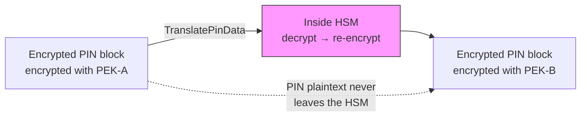

## Introduction

In the [previous issuer edition](/en/blog/2026/03/29/aws-payment-cryptography-issuer), we confirmed how multiple purpose-built keys cooperate within a single API call through CVV generation, PIN processing, and ARQC verification.

This article shifts to the acquirer (merchant acquirer / payment facilitator) perspective, implementing two core cryptographic operations with the Java SDK:

1. **PIN translation (TranslatePinData)** — Re-encryption without exposing plaintext
2. **MAC generation and verification** — Data integrity assurance

The introductory article taught "one key, one purpose." The issuer edition showed "multiple keys cooperating." This acquirer edition's theme is "key relay." In payment networks, PINs are relayed through terminal → acquirer → network → issuer, with different keys at each hop. `TranslatePinData` re-encrypts an encrypted PIN from one key to another without ever exposing the plaintext. This "pass without touching" design is the cornerstone of PCI PIN compliance.

## Prerequisites

- Familiarity with the [issuer edition](/en/blog/2026/03/29/aws-payment-cryptography-issuer)
- Java 17+, AWS SDK for Java v2
- IAM permissions: `payment-cryptography:*` (for testing)
- Test region: us-east-1

## Acquirer Cryptographic Operations Overview

| Operation | API | Required Keys | Purpose |
|---|---|---|---|
| PIN translation | TranslatePinData | incoming PEK + outgoing PEK | Relay PIN by switching keys |
| MAC generation | GenerateMac | MAC key | Guarantee data integrity |
| MAC verification | VerifyMac | MAC key | Detect data tampering |



## Source Code and Build

Here is the full program used in the verifications. If you want to follow along on your machine, place the files below and build. The results are explained in the following sections.

The Maven dependencies (`pom.xml`) are the same as the [introductory article](/en/blog/2026/03/29/aws-payment-cryptography-intro).


<details className="my-4 rounded-lg border border-border bg-muted/30 p-4">
<summary className="cursor-pointer font-medium">AcquirerDemo.java (runnable code covering all scenarios)</summary>

```java title="AcquirerDemo.java"
package demo;

import software.amazon.awssdk.regions.Region;
import software.amazon.awssdk.services.paymentcryptography.PaymentCryptographyClient;
import software.amazon.awssdk.services.paymentcryptography.model.*;
import software.amazon.awssdk.services.paymentcryptographydata.PaymentCryptographyDataClient;
import software.amazon.awssdk.services.paymentcryptographydata.model.*;
import software.amazon.awssdk.services.paymentcryptographydata.model.VerificationFailedException;

public class AcquirerDemo {

    static final Region REGION = Region.US_EAST_1;

    public static void main(String[] args) {
        try (var cp = PaymentCryptographyClient.builder().region(REGION).build();
             var dp = PaymentCryptographyDataClient.builder().region(REGION).build()) {

            var pekA = createKey(cp, "PEK-A", KeyUsage.TR31_P0_PIN_ENCRYPTION_KEY,
                    KeyAlgorithm.TDES_3_KEY,
                    KeyModesOfUse.builder().encrypt(true).decrypt(true)
                            .wrap(true).unwrap(true).build());
            var pekB = createKey(cp, "PEK-B", KeyUsage.TR31_P0_PIN_ENCRYPTION_KEY,
                    KeyAlgorithm.TDES_3_KEY,
                    KeyModesOfUse.builder().encrypt(true).decrypt(true)
                            .wrap(true).unwrap(true).build());
            var pvk = createKey(cp, "PVK", KeyUsage.TR31_V2_VISA_PIN_VERIFICATION_KEY,
                    KeyAlgorithm.TDES_2_KEY,
                    KeyModesOfUse.builder().generate(true).verify(true).build());
            var macKey = createKey(cp, "MAC", KeyUsage.TR31_M6_ISO_9797_5_CMAC_KEY,
                    KeyAlgorithm.AES_256,
                    KeyModesOfUse.builder().generate(true).verify(true).build());

            testPinTranslation(dp, pekA, pekB, pvk);
            testMacGenerateVerify(dp, macKey);

            for (var arn : new String[]{pekA, pekB, pvk, macKey})
                cp.deleteKey(DeleteKeyRequest.builder()
                        .keyIdentifier(arn).deleteKeyInDays(3).build());
        }
    }

    static String createKey(PaymentCryptographyClient cp, String name,
                            KeyUsage usage, KeyAlgorithm algo, KeyModesOfUse modes) {
        var key = cp.createKey(CreateKeyRequest.builder().exportable(true)
                .keyAttributes(KeyAttributes.builder().keyUsage(usage)
                        .keyClass(KeyClass.SYMMETRIC_KEY).keyAlgorithm(algo)
                        .keyModesOfUse(modes).build()).build()).key();
        System.out.printf("[%s] %s %s KCV:%s%n", name,
                key.keyAttributes().keyUsageAsString(),
                key.keyAttributes().keyAlgorithmAsString(), key.keyCheckValue());
        return key.keyArn();
    }

    static void testPinTranslation(PaymentCryptographyDataClient dp,
                                   String pekA, String pekB, String pvk) {
        var pan = "4111111111111111";
        var pin = dp.generatePinData(GeneratePinDataRequest.builder()
                .generationKeyIdentifier(pvk).encryptionKeyIdentifier(pekA)
                .primaryAccountNumber(pan)
                .pinBlockFormat(PinBlockFormatForPinData.ISO_FORMAT_0)
                .generationAttributes(PinGenerationAttributes.builder()
                        .visaPin(VisaPin.builder().pinVerificationKeyIndex(1).build())
                        .build()).build());
        System.out.printf("PIN block(PEK-A): %s, PVV: %s%n",
                pin.encryptedPinBlock(), pin.pinData().verificationValue());

        var tr = dp.translatePinData(TranslatePinDataRequest.builder()
                .encryptedPinBlock(pin.encryptedPinBlock())
                .incomingKeyIdentifier(pekA).outgoingKeyIdentifier(pekB)
                .incomingTranslationAttributes(TranslationIsoFormats.builder()
                        .isoFormat0(TranslationPinDataIsoFormat034.builder()
                                .primaryAccountNumber(pan).build()).build())
                .outgoingTranslationAttributes(TranslationIsoFormats.builder()
                        .isoFormat0(TranslationPinDataIsoFormat034.builder()
                                .primaryAccountNumber(pan).build()).build())
                .build());
        System.out.printf("PIN block(PEK-B): %s%n", tr.pinBlock());

        dp.verifyPinData(VerifyPinDataRequest.builder()
                .verificationKeyIdentifier(pvk).encryptionKeyIdentifier(pekB)
                .primaryAccountNumber(pan)
                .pinBlockFormat(PinBlockFormatForPinData.ISO_FORMAT_0)
                .encryptedPinBlock(tr.pinBlock())
                .verificationAttributes(PinVerificationAttributes.builder()
                        .visaPin(VisaPinVerification.builder()
                                .pinVerificationKeyIndex(1)
                                .verificationValue(pin.pinData().verificationValue())
                                .build()).build()).build());
        System.out.println("PIN verification (PEK-B + PVV): Success\n");
    }

    static void testMacGenerateVerify(PaymentCryptographyDataClient dp, String macKey) {
        var msg = "48656C6C6F576F726C64";
        var mac = dp.generateMac(GenerateMacRequest.builder()
                .keyIdentifier(macKey).messageData(msg)
                .generationAttributes(MacAttributes.builder()
                        .algorithm(MacAlgorithm.CMAC).build()).build());
        System.out.printf("MAC: %s%n", mac.mac());

        dp.verifyMac(VerifyMacRequest.builder()
                .keyIdentifier(macKey).messageData(msg).mac(mac.mac())
                .verificationAttributes(MacAttributes.builder()
                        .algorithm(MacAlgorithm.CMAC).build()).build());
        System.out.println("MAC verification (correct): Success");

        try {
            dp.verifyMac(VerifyMacRequest.builder()
                    .keyIdentifier(macKey).messageData("48656C6C6F576F726C65")
                    .mac(mac.mac()).verificationAttributes(MacAttributes.builder()
                            .algorithm(MacAlgorithm.CMAC).build()).build());
        } catch (VerificationFailedException e) {
            System.out.println("MAC verification (tampered): Failed");
        }
    }
}
```

</details>


<details className="my-4 rounded-lg border border-border bg-muted/30 p-4">
<summary className="cursor-pointer font-medium">Build and run instructions</summary>

Uses the same project structure as the [introductory article](/en/blog/2026/03/29/aws-payment-cryptography-intro). Place `AcquirerDemo.java` in `src/main/java/demo/`.

```bash title="Terminal"
cd payment-crypto-demo

# Place AcquirerDemo.java in src/main/java/demo/

# Build and run
mvn clean compile -q
mvn exec:java -Dexec.mainClass=demo.AcquirerDemo
```

</details>

## Verification 1: PIN Translation with TranslatePinData

### Flow

1. Receive a PIN block encrypted with PEK-A (simulating terminal input)
2. `TranslatePinData` converts PEK-A → PEK-B (no plaintext exposure)
3. Verify the translated PIN block with PEK-B + PVV (confirm PIN content is preserved)

<details className="my-4 rounded-lg border border-border bg-muted/30 p-4">
<summary className="cursor-pointer font-medium">Key creation code</summary>

```java title="Java"
var pekA = createKey(controlPlane, KeyUsage.TR31_P0_PIN_ENCRYPTION_KEY,
        KeyAlgorithm.TDES_3_KEY,
        KeyModesOfUse.builder().encrypt(true).decrypt(true)
                .wrap(true).unwrap(true).build());
var pekB = createKey(controlPlane, KeyUsage.TR31_P0_PIN_ENCRYPTION_KEY,
        KeyAlgorithm.TDES_3_KEY,
        KeyModesOfUse.builder().encrypt(true).decrypt(true)
                .wrap(true).unwrap(true).build());
var pvk = createKey(controlPlane, KeyUsage.TR31_V2_VISA_PIN_VERIFICATION_KEY,
        KeyAlgorithm.TDES_2_KEY,
        KeyModesOfUse.builder().generate(true).verify(true).build());
```

</details>

### Step 1: Generate PIN with PEK-A

```java title="Java"
var pinResp = dataPlane.generatePinData(GeneratePinDataRequest.builder()
        .generationKeyIdentifier(pvkArn)
        .encryptionKeyIdentifier(pekAArn)
        .primaryAccountNumber("4111111111111111")
        .pinBlockFormat(PinBlockFormatForPinData.ISO_FORMAT_0)
        .generationAttributes(PinGenerationAttributes.builder()
                .visaPin(VisaPin.builder().pinVerificationKeyIndex(1).build())
                .build())
        .build());
```

```text title="Output"
Step 1 - PIN generation (PEK-A)
  PIN block: D7608BA7908F181D, PVV: 1563
```

### Step 2: Translate PIN block from PEK-A to PEK-B

This is the core of the article. `TranslatePinData` specifies incoming and outgoing keys and PIN block formats, re-encrypting the PIN without exposing plaintext.

```java title="Java"
var translateResp = dataPlane.translatePinData(TranslatePinDataRequest.builder()
        .encryptedPinBlock(pinResp.encryptedPinBlock())
        .incomingKeyIdentifier(pekAArn)
        .outgoingKeyIdentifier(pekBArn)
        .incomingTranslationAttributes(TranslationIsoFormats.builder()
                .isoFormat0(TranslationPinDataIsoFormat034.builder()
                        .primaryAccountNumber("4111111111111111").build())
                .build())
        .outgoingTranslationAttributes(TranslationIsoFormats.builder()
                .isoFormat0(TranslationPinDataIsoFormat034.builder()
                        .primaryAccountNumber("4111111111111111").build())
                .build())
        .build());
```

```text title="Output"
Step 2 - PIN translation (PEK-A → PEK-B)
  Translated PIN block: F000A8F1F01CE32D
  KCV: F0BBDC
```

The PIN block value changed (`D7608BA7908F181D` → `F000A8F1F01CE32D`) because the encryption key changed — the PIN itself remains the same.

Key points:
- Both `incomingTranslationAttributes` and `outgoingTranslationAttributes` require the PAN. For PCI compliance, incoming and outgoing PANs must match
- Cross-format translation (e.g., ISO Format 4 → ISO Format 0) is also supported

### Step 3: Verify translated PIN block with PEK-B + PVV

```text title="Output"
Step 3 - PIN verification (PEK-B + PVV): Success
  → PIN was translated from PEK-A to PEK-B without ever being exposed as plaintext
```

This confirms that `TranslatePinData` decrypts and re-encrypts internally, but the PIN never leaves the HSM. The application only handles encrypted PIN blocks.

## Verification 2: MAC Generation and Verification

Verification 1 focused on "confidentiality (encryption)." Verification 2 focuses on "integrity (tamper detection)."

We use a CMAC key (`TR31_M6_ISO_9797_5_CMAC_KEY`, AES_256).

<details className="my-4 rounded-lg border border-border bg-muted/30 p-4">
<summary className="cursor-pointer font-medium">About HMAC support in the SDK</summary>

AWS Payment Cryptography supports HMAC_SHA256 keys (`TR31_M7_HMAC_KEY`), but SDK v2.31.9's `KeyAlgorithm` enum doesn't include `HMAC_SHA256`. To use HMAC, create the key via CLI or update the SDK. This article uses CMAC which is fully supported in the SDK.

</details>

```java title="Java"
var messageData = "48656C6C6F576F726C64"; // "HelloWorld" in hex

var macResp = dataPlane.generateMac(GenerateMacRequest.builder()
        .keyIdentifier(macKeyArn)
        .messageData(messageData)
        .generationAttributes(MacAttributes.builder()
                .algorithm(MacAlgorithm.CMAC).build())
        .build());
```

```text title="Output"
MAC generation: 14412ADCE61894D691E13354359FC723
MAC verification (correct message): Success
MAC verification (tampered message): Failed — INVALID_MAC
```

Changing even the last byte of the message causes MAC verification to fail, detecting any tampering during transmission.

## Acquirer Operations: API and Key Map

| Operation | API | Key (KeyUsage) | Main Inputs | Result |
|---|---|---|---|---|
| PIN translation | TranslatePinData | PEK-A (TR31_P0) → PEK-B (TR31_P0) | Encrypted PIN block + PAN | Translated PIN block |
| MAC generation | GenerateMac | CMAC key (TR31_M6, AES_256) | Message data | MAC value |
| MAC verification | VerifyMac | CMAC key (TR31_M6, AES_256) | Message data + MAC | Success / INVALID_MAC |

## Summary

- **PINs can be re-keyed without exposing plaintext** — `TranslatePinData` performs decryption and re-encryption inside the HSM. The PIN never leaves the HSM boundary. The application only handles encrypted PIN blocks. This is the cornerstone of PCI PIN compliance
- **MAC guarantees data integrity** — Even a single byte change is detected. Payment processing requires both encryption (confidentiality) and MAC (integrity), each using different keys

## Series Retrospective

Across three articles, we progressively understood the key management model of AWS Payment Cryptography.

| Part | Theme | Core Insight |
|---|---|---|
| [Part 1 (Intro)](/en/blog/2026/03/29/aws-payment-cryptography-intro) | Key usage separation | Payment keys operate under a different paradigm than KMS. KeyUsage fixes purpose at creation, and the API blocks misuse |
| [Part 2 (Issuer)](/en/blog/2026/03/29/aws-payment-cryptography-issuer) | Multi-key cooperation | A single payment operation (PIN generation) requires PEK and PVK cooperating in one API call |
| Part 3 (Acquirer) | Key relay | PINs can be re-keyed without plaintext exposure. TranslatePinData's "pass without touching" design is the cornerstone of PCI PIN compliance |

These insights apply not just to AWS Payment Cryptography but to payment cryptographic processing in general.

## Cleanup

Cleanup runs automatically when the program executes. All keys are scheduled for deletion after 3 days (`deleteKeyInDays(3)`). Keys in `DELETE_PENDING` state can be restored with `RestoreKey`.
