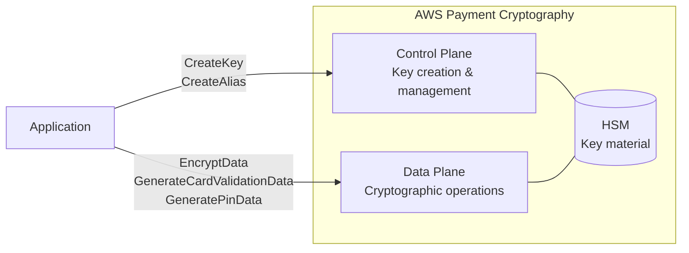

## Introduction

Behind every credit card transaction lies a chain of cryptographic operations — PIN encryption, CVV generation and verification, transaction data encryption, and more. Traditionally, these operations required PCI-certified physical HSMs (Hardware Security Modules), with hardware procurement, installation, and key ceremonies (where multiple people physically gather to inject keys) taking weeks.

[AWS Payment Cryptography](https://docs.aws.amazon.com/payment-cryptography/latest/userguide/what-is.html) delivers these payment cryptographic operations as a managed service. Running on PCI PTS HSM V3 and FIPS 140-2 Level 3 certified hardware, it lets you create keys and perform cryptographic operations entirely through API calls.

This is the first article in a series. Using the Java SDK, we'll create four types of payment keys and run both happy-path and error-path scenarios to understand the key management model hands-on. With AWS KMS, a single symmetric key can encrypt and decrypt data freely. With Payment Cryptography, each key's purpose is strictly fixed at creation. We'll focus on this difference and the gotchas that trip up developers coming from KMS.

## Prerequisites

- AWS account (region where Payment Cryptography is available)
- Java 17+
- AWS SDK for Java v2 (`software.amazon.awssdk:paymentcryptography` + `paymentcryptographydata`)
- IAM permissions: `payment-cryptography:*` (for testing; restrict to least privilege in production)
- Test region: us-east-1

## The Big Picture — How Payment Cryptography Differs from KMS

AWS Payment Cryptography has two API surfaces:

- **Control Plane** — Key creation, management, and alias configuration (`PaymentCryptographyClient`)
- **Data Plane** — Cryptographic operations like encryption, CVV generation, and PIN processing (`PaymentCryptographyDataClient`)

KMS has a similar Control Plane / Data Plane structure, but the critical difference lies in the **key attribute model**.

| Aspect | AWS KMS | AWS Payment Cryptography |
|---|---|---|
| Key usage | `KeyUsage` (`ENCRYPT_DECRYPT` / `SIGN_VERIFY` / `GENERATE_VERIFY_MAC` / `KEY_AGREEMENT` — 4 types) | TR-31 `KeyUsage` (`TR31_C0_CARD_VERIFICATION_KEY`, etc. — dozens of types) |
| Operation modes | Implicitly determined by key type | Explicitly specified via `KeyModesOfUse` (Encrypt, Generate, DeriveKey, etc.) |
| Immutable attribute scope | KeyUsage + KeySpec | KeyUsage + KeyAlgorithm + KeyModesOfUse (operation modes also fixed) |
| Compliance | FIPS 140-2 | PCI PTS HSM V3 + FIPS 140-2 Level 3 |

With KMS, a single symmetric key can encrypt and decrypt data. With Payment Cryptography, a "CVV generation key" cannot encrypt data. This constraint is based on the PCI industry standard [ANSI X9 TR-31](https://docs.aws.amazon.com/payment-cryptography/latest/userguide/concepts.html), reflecting that payment cryptography operates under a fundamentally different paradigm than general-purpose cryptography.



Let's experience this difference through actual code.


## Source Code and Build

Here is the full program used in the verifications. If you want to follow along on your machine, place the files below and build. The results are explained in the following sections.


<details className="my-4 rounded-lg border border-border bg-muted/30 p-4">
<summary className="cursor-pointer font-medium">Maven dependencies (pom.xml)</summary>

```xml title="pom.xml"
<project xmlns="http://maven.apache.org/POM/4.0.0"
         xmlns:xsi="http://www.w3.org/2001/XMLSchema-instance"
         xsi:schemaLocation="http://maven.apache.org/POM/4.0.0
         http://maven.apache.org/xsd/maven-4.0.0.xsd">
    <modelVersion>4.0.0</modelVersion>
    <groupId>demo</groupId>
    <artifactId>payment-crypto-demo</artifactId>
    <version>1.0.0</version>
    <properties>
        <maven.compiler.source>17</maven.compiler.source>
        <maven.compiler.target>17</maven.compiler.target>
        <aws.sdk.version>2.31.9</aws.sdk.version>
    </properties>
    <dependencyManagement>
        <dependencies>
            <dependency>
                <groupId>software.amazon.awssdk</groupId>
                <artifactId>bom</artifactId>
                <version>${aws.sdk.version}</version>
                <type>pom</type>
                <scope>import</scope>
            </dependency>
        </dependencies>
    </dependencyManagement>
    <dependencies>
        <dependency>
            <groupId>software.amazon.awssdk</groupId>
            <artifactId>paymentcryptography</artifactId>
        </dependency>
        <dependency>
            <groupId>software.amazon.awssdk</groupId>
            <artifactId>paymentcryptographydata</artifactId>
        </dependency>
        <dependency>
            <groupId>software.amazon.awssdk</groupId>
            <artifactId>sso</artifactId>
        </dependency>
        <dependency>
            <groupId>software.amazon.awssdk</groupId>
            <artifactId>ssooidc</artifactId>
        </dependency>
    </dependencies>
</project>
```


<details className="my-4 rounded-lg border border-border bg-muted/30 p-4">
<summary className="cursor-pointer font-medium">PaymentCryptoDemo.java (runnable code covering all scenarios)</summary>

```java title="PaymentCryptoDemo.java"
package demo;

import java.util.List;
import software.amazon.awssdk.regions.Region;
import software.amazon.awssdk.services.paymentcryptography.PaymentCryptographyClient;
import software.amazon.awssdk.services.paymentcryptography.model.*;
import software.amazon.awssdk.services.paymentcryptographydata.PaymentCryptographyDataClient;
import software.amazon.awssdk.services.paymentcryptographydata.model.*;
import software.amazon.awssdk.services.paymentcryptographydata.model.VerificationFailedException;

public class PaymentCryptoDemo {

    static final Region REGION = Region.US_EAST_1;
    static final String ALIAS_PREFIX = "alias/blog-demo-";

    public static void main(String[] args) {
        try (var controlPlane = PaymentCryptographyClient.builder().region(REGION).build();
             var dataPlane = PaymentCryptographyDataClient.builder().region(REGION).build()) {

            var cvvKey = createKey(controlPlane, "cvv",
                    KeyUsage.TR31_C0_CARD_VERIFICATION_KEY, KeyAlgorithm.TDES_2_KEY,
                    KeyModesOfUse.builder().generate(true).verify(true).build());
            var dataKey = createKey(controlPlane, "data-encryption",
                    KeyUsage.TR31_D0_SYMMETRIC_DATA_ENCRYPTION_KEY, KeyAlgorithm.AES_256,
                    KeyModesOfUse.builder().encrypt(true).decrypt(true)
                            .wrap(true).unwrap(true).build());
            var pek = createKey(controlPlane, "pek",
                    KeyUsage.TR31_P0_PIN_ENCRYPTION_KEY, KeyAlgorithm.TDES_3_KEY,
                    KeyModesOfUse.builder().encrypt(true).decrypt(true)
                            .wrap(true).unwrap(true).build());
            var bdk = createKey(controlPlane, "bdk",
                    KeyUsage.TR31_B0_BASE_DERIVATION_KEY, KeyAlgorithm.TDES_3_KEY,
                    KeyModesOfUse.builder().deriveKey(true).build());

            testEncryptDecrypt(dataPlane, dataKey);
            testCvvGenerateVerify(dataPlane, cvvKey);
            testWrongKeyUsage(dataPlane, cvvKey, dataKey, pek, bdk);
            cleanup(controlPlane, cvvKey, dataKey, pek, bdk);
        }
    }

    static String createKey(PaymentCryptographyClient client, String name,
                            KeyUsage usage, KeyAlgorithm algorithm, KeyModesOfUse modes) {
        var key = client.createKey(CreateKeyRequest.builder().exportable(true)
                .keyAttributes(KeyAttributes.builder().keyUsage(usage)
                        .keyClass(KeyClass.SYMMETRIC_KEY).keyAlgorithm(algorithm)
                        .keyModesOfUse(modes).build()).build()).key();
        System.out.printf("[%s] %s KCV:%s %s%n", name,
                key.keyAttributes().keyUsageAsString(), key.keyCheckValue(),
                formatModes(key.keyAttributes().keyModesOfUse()));
        client.createAlias(CreateAliasRequest.builder()
                .aliasName(ALIAS_PREFIX + name).keyArn(key.keyArn()).build());
        return key.keyArn();
    }

    static void testEncryptDecrypt(PaymentCryptographyDataClient dp, String keyArn) {
        var plain = "41111111111111110000000000000000";
        var enc = dp.encryptData(EncryptDataRequest.builder().keyIdentifier(keyArn)
                .plainText(plain).encryptionAttributes(EncryptionDecryptionAttributes.builder()
                        .symmetric(SymmetricEncryptionAttributes.builder()
                                .mode(EncryptionMode.ECB).build()).build()).build());
        var dec = dp.decryptData(DecryptDataRequest.builder().keyIdentifier(keyArn)
                .cipherText(enc.cipherText()).decryptionAttributes(
                        EncryptionDecryptionAttributes.builder().symmetric(
                                SymmetricEncryptionAttributes.builder()
                                        .mode(EncryptionMode.ECB).build()).build()).build());
        System.out.printf("Encrypt/Decrypt match: %s%n", plain.equalsIgnoreCase(dec.plainText()));
    }

    static void testCvvGenerateVerify(PaymentCryptographyDataClient dp, String keyArn) {
        var gen = dp.generateCardValidationData(GenerateCardValidationDataRequest.builder()
                .keyIdentifier(keyArn).primaryAccountNumber("4111111111111111")
                .validationDataLength(3).generationAttributes(CardGenerationAttributes.builder()
                        .cardVerificationValue2(CardVerificationValue2.builder()
                                .cardExpiryDate("0328").build()).build()).build());
        System.out.printf("CVV2: %s%n", gen.validationData());
        dp.verifyCardValidationData(VerifyCardValidationDataRequest.builder()
                .keyIdentifier(keyArn).primaryAccountNumber("4111111111111111")
                .validationData(gen.validationData()).verificationAttributes(
                        CardVerificationAttributes.builder().cardVerificationValue2(
                                CardVerificationValue2.builder().cardExpiryDate("0328")
                                        .build()).build()).build());
        try {
            dp.verifyCardValidationData(VerifyCardValidationDataRequest.builder()
                    .keyIdentifier(keyArn).primaryAccountNumber("4111111111111111")
                    .validationData("000").verificationAttributes(
                            CardVerificationAttributes.builder().cardVerificationValue2(
                                    CardVerificationValue2.builder().cardExpiryDate("0328")
                                            .build()).build()).build());
        } catch (VerificationFailedException e) {
            System.out.printf("Wrong CVV2 rejected: %s%n", e.getMessage());
        }
    }

    static void testWrongKeyUsage(PaymentCryptographyDataClient dp,
                                  String cvv, String data, String pek, String bdk) {
        tryOp("CVV→Encrypt", () -> dp.encryptData(EncryptDataRequest.builder()
                .keyIdentifier(cvv).plainText("41111111111111110000000000000000")
                .encryptionAttributes(EncryptionDecryptionAttributes.builder()
                        .symmetric(SymmetricEncryptionAttributes.builder()
                                .mode(EncryptionMode.ECB).build()).build()).build()));
        tryOp("Data→GenCVV", () -> dp.generateCardValidationData(
                GenerateCardValidationDataRequest.builder().keyIdentifier(data)
                        .primaryAccountNumber("4111111111111111").validationDataLength(3)
                        .generationAttributes(CardGenerationAttributes.builder()
                                .cardVerificationValue2(CardVerificationValue2.builder()
                                        .cardExpiryDate("0328").build()).build()).build()));
        tryOp("PEK→GenMAC", () -> dp.generateMac(GenerateMacRequest.builder()
                .keyIdentifier(pek).messageData("48656C6C6F")
                .generationAttributes(MacAttributes.builder()
                        .algorithm(MacAlgorithm.HMAC_SHA256).build()).build()));
        tryOp("BDK→Encrypt", () -> dp.encryptData(EncryptDataRequest.builder()
                .keyIdentifier(bdk).plainText("41111111111111110000000000000000")
                .encryptionAttributes(EncryptionDecryptionAttributes.builder()
                        .symmetric(SymmetricEncryptionAttributes.builder()
                                .mode(EncryptionMode.ECB).build()).build()).build()));
    }

    static void tryOp(String label, Runnable op) {
        try { op.run(); }
        catch (software.amazon.awssdk.services.paymentcryptographydata.model.ValidationException e) {
            System.out.printf("%s → %s%n", label, e.getMessage());
        }
    }

    static void cleanup(PaymentCryptographyClient c, String... arns) {
        for (var n : List.of("cvv", "data-encryption", "pek", "bdk"))
            c.deleteAlias(DeleteAliasRequest.builder().aliasName(ALIAS_PREFIX + n).build());
        for (var a : arns)
            c.deleteKey(DeleteKeyRequest.builder().keyIdentifier(a).deleteKeyInDays(3).build());
    }

    static String formatModes(KeyModesOfUse m) {
        var sb = new StringBuilder();
        if (m.encrypt()) sb.append("Encrypt ");  if (m.decrypt()) sb.append("Decrypt ");
        if (m.wrap()) sb.append("Wrap ");         if (m.unwrap()) sb.append("Unwrap ");
        if (m.generate()) sb.append("Generate "); if (m.verify()) sb.append("Verify ");
        if (m.sign()) sb.append("Sign ");         if (m.deriveKey()) sb.append("DeriveKey ");
        return sb.toString().trim();
    }
}
```

</details>

<details className="my-4 rounded-lg border border-border bg-muted/30 p-4">
<summary className="cursor-pointer font-medium">Build and run instructions</summary>

```bash title="Terminal"
# Create project
mkdir -p payment-crypto-demo/src/main/java/demo
cd payment-crypto-demo

# Place pom.xml in payment-crypto-demo/
# Place PaymentCryptoDemo.java in src/main/java/demo/

# Build and run
mvn clean compile -q
mvn exec:java -Dexec.mainClass=demo.PaymentCryptoDemo
```

</details>

## Verification 1: Create 4 Types of Payment Keys with Java SDK

We'll create four representative payment key types.

| Key Name | KeyUsage | Algorithm | Purpose |
|---|---|---|---|
| CVV Key | `TR31_C0_CARD_VERIFICATION_KEY` | TDES_2KEY | CVV/CVV2 generation and verification |
| Data Encryption Key | `TR31_D0_SYMMETRIC_DATA_ENCRYPTION_KEY` | AES_256 | Card data encryption/decryption |
| PEK (PIN Encryption Key) | `TR31_P0_PIN_ENCRYPTION_KEY` | TDES_3KEY | PIN block encryption |
| BDK (Base Derivation Key) | `TR31_B0_BASE_DERIVATION_KEY` | TDES_3KEY | DUKPT transaction key derivation |
</details>

First, create both the Control Plane and Data Plane clients. Unlike KMS, you need two separate clients.

```java title="Java"
var controlPlane = PaymentCryptographyClient.builder()
        .region(Region.US_EAST_1).build();
var dataPlane = PaymentCryptographyDataClient.builder()
        .region(Region.US_EAST_1).build();
```

Key creation uses `CreateKeyRequest`. Compared to KMS's `CreateKeyRequest`, notice how many more parameters are required.

```java title="Java"
// Create CVV key
var cvvKeyResp = controlPlane.createKey(CreateKeyRequest.builder()
        .exportable(true)
        .keyAttributes(KeyAttributes.builder()
                .keyUsage(KeyUsage.TR31_C0_CARD_VERIFICATION_KEY)
                .keyClass(KeyClass.SYMMETRIC_KEY)
                .keyAlgorithm(KeyAlgorithm.TDES_2_KEY)
                .keyModesOfUse(KeyModesOfUse.builder()
                        .generate(true).verify(true).build())
                .build())
        .build());
```

The remaining three keys follow the same pattern.

<details className="my-4 rounded-lg border border-border bg-muted/30 p-4">
<summary className="cursor-pointer font-medium">Remaining 3 key creation code</summary>

```java title="Java"
// Data Encryption Key (AES-256)
var dataKeyResp = controlPlane.createKey(CreateKeyRequest.builder()
        .exportable(true)
        .keyAttributes(KeyAttributes.builder()
                .keyUsage(KeyUsage.TR31_D0_SYMMETRIC_DATA_ENCRYPTION_KEY)
                .keyClass(KeyClass.SYMMETRIC_KEY)
                .keyAlgorithm(KeyAlgorithm.AES_256)
                .keyModesOfUse(KeyModesOfUse.builder()
                        .encrypt(true).decrypt(true)
                        .wrap(true).unwrap(true).build())
                .build())
        .build());

// PEK (PIN Encryption Key, TDES-3KEY)
var pekResp = controlPlane.createKey(CreateKeyRequest.builder()
        .exportable(true)
        .keyAttributes(KeyAttributes.builder()
                .keyUsage(KeyUsage.TR31_P0_PIN_ENCRYPTION_KEY)
                .keyClass(KeyClass.SYMMETRIC_KEY)
                .keyAlgorithm(KeyAlgorithm.TDES_3_KEY)
                .keyModesOfUse(KeyModesOfUse.builder()
                        .encrypt(true).decrypt(true)
                        .wrap(true).unwrap(true).build())
                .build())
        .build());

// BDK (Base Derivation Key, TDES-3KEY)
var bdkResp = controlPlane.createKey(CreateKeyRequest.builder()
        .exportable(true)
        .keyAttributes(KeyAttributes.builder()
                .keyUsage(KeyUsage.TR31_B0_BASE_DERIVATION_KEY)
                .keyClass(KeyClass.SYMMETRIC_KEY)
                .keyAlgorithm(KeyAlgorithm.TDES_3_KEY)
                .keyModesOfUse(KeyModesOfUse.builder()
                        .deriveKey(true).build())
                .build())
        .build());
```

</details>

### Results

All four keys were created in under a second. The `KeyModesOfUse` for each key lists only the permitted operations.

```text title="Output"
[cvv] KeyUsage: TR31_C0_CARD_VERIFICATION_KEY, Algorithm: TDES_2KEY, KCV: 683ADE (ANSI_X9_24)
  KeyModesOfUse: Generate Verify

[data-encryption] KeyUsage: TR31_D0_SYMMETRIC_DATA_ENCRYPTION_KEY, Algorithm: AES_256, KCV: 864903 (CMAC)
  KeyModesOfUse: Encrypt Decrypt Wrap Unwrap

[pek] KeyUsage: TR31_P0_PIN_ENCRYPTION_KEY, Algorithm: TDES_3KEY, KCV: 38F13B (ANSI_X9_24)
  KeyModesOfUse: Encrypt Decrypt Wrap Unwrap

[bdk] KeyUsage: TR31_B0_BASE_DERIVATION_KEY, Algorithm: TDES_3KEY, KCV: EA74D1 (ANSI_X9_24)
  KeyModesOfUse: DeriveKey
```

Key observations:

- **KCV (Key Check Value)** — A checksum of the key material, used to verify correct key transfer during import/export. AES keys use CMAC while TDES keys use ANSI_X9_24
- **BDK allows DeriveKey only** — Not even Encrypt/Decrypt. A BDK exists solely to derive transaction keys, never to encrypt data directly
- **SDK enum naming** — The CLI uses `TDES_2KEY` but Java SDK v2 uses `TDES_2_KEY` (with underscore). A subtle but common gotcha

## Verification 2: Run CVV Generation and Data Encryption

Let's confirm the keys work correctly. We'll use the Data Plane API for data encryption/decryption and CVV2 generation/verification.

### Data Encryption and Decryption

```java title="Java"
var plainText = "41111111111111110000000000000000"; // 32 hex chars = 16 bytes

var encResp = dataPlane.encryptData(EncryptDataRequest.builder()
        .keyIdentifier(dataKey.keyArn())
        .plainText(plainText)
        .encryptionAttributes(EncryptionDecryptionAttributes.builder()
                .symmetric(SymmetricEncryptionAttributes.builder()
                        .mode(EncryptionMode.ECB).build())
                .build())
        .build());

var decResp = dataPlane.decryptData(DecryptDataRequest.builder()
        .keyIdentifier(dataKey.keyArn())
        .cipherText(encResp.cipherText())
        .decryptionAttributes(EncryptionDecryptionAttributes.builder()
                .symmetric(SymmetricEncryptionAttributes.builder()
                        .mode(EncryptionMode.ECB).build())
                .build())
        .build());
```

```text title="Output"
  Plain text:  41111111111111110000000000000000
  Cipher text: 88798205F30D2FBE1DCA7FF261232B51
  Decrypted:   41111111111111110000000000000000
  Match: true
```

Plaintext data must be passed as a hexBinary string. In ECB mode, the data length must be a multiple of the block size (16 bytes = 32 hex chars for AES). No automatic padding is applied.

### CVV2 Generation and Verification

```java title="Java"
var genResp = dataPlane.generateCardValidationData(
        GenerateCardValidationDataRequest.builder()
                .keyIdentifier(cvvKey.keyArn())
                .primaryAccountNumber("4111111111111111")
                .validationDataLength(3)
                .generationAttributes(CardGenerationAttributes.builder()
                        .cardVerificationValue2(CardVerificationValue2.builder()
                                .cardExpiryDate("0328").build())
                        .build())
                .build());
```

```text title="Output"
  PAN: 4111111111111111, Expiry: 0328
  Generated CVV2: 287
  Verify (correct value 287): Success
  Verify (wrong value 000): Failed — Card validation data verification failed.
    (Status Code: 400, Reason: INVALID_VALIDATION_DATA)
```

CVV2 is deterministically generated from the PAN and expiry date. The same key, PAN, and expiry always produce the same CVV2.

Verification uses `VerifyCardValidationData`:

```java title="Java"
// Verify with correct value (success)
dataPlane.verifyCardValidationData(VerifyCardValidationDataRequest.builder()
        .keyIdentifier(cvvKey.keyArn())
        .primaryAccountNumber("4111111111111111")
        .validationData(genResp.validationData()) // "287"
        .verificationAttributes(CardVerificationAttributes.builder()
                .cardVerificationValue2(CardVerificationValue2.builder()
                        .cardExpiryDate("0328").build())
                .build())
        .build());

// Verify with wrong value (VerificationFailedException)
try {
    dataPlane.verifyCardValidationData(VerifyCardValidationDataRequest.builder()
            .keyIdentifier(cvvKey.keyArn())
            .primaryAccountNumber("4111111111111111")
            .validationData("000")
            .verificationAttributes(CardVerificationAttributes.builder()
                    .cardVerificationValue2(CardVerificationValue2.builder()
                            .cardExpiryDate("0328").build())
                    .build())
            .build());
} catch (VerificationFailedException e) {
    // Card validation data verification failed. (Status Code: 400)
}
```

Failed verification throws `VerificationFailedException` (HTTP 400) with a `Reason` field for diagnosis.

## Verification 3: Attempt Wrong-Key-Usage Operations — Why Payment Cryptography Differs from KMS

This is the core of the article. In Verification 2, we confirmed that "right key × right operation" works. What happens with "wrong key × wrong operation"?

```java title="Java"
// Attempt to encrypt data with a CVV key
try {
    dataPlane.encryptData(EncryptDataRequest.builder()
            .keyIdentifier(cvvKey.keyArn())
            .plainText("41111111111111110000000000000000")
            .encryptionAttributes(EncryptionDecryptionAttributes.builder()
                    .symmetric(SymmetricEncryptionAttributes.builder()
                            .mode(EncryptionMode.ECB).build())
                    .build())
            .build());
} catch (ValidationException e) {
    // KeyUsage of the input key ... is invalid for the operation.
}
```

Note that `ValidationException` exists in both the Control Plane (`paymentcryptography.model`) and Data Plane (`paymentcryptographydata.model`) packages. Here you need to catch the Data Plane version, so use a fully qualified import or import only the Data Plane class. See the complete source code at the end of this article.

Results for all four patterns:

<details className="my-4 rounded-lg border border-border bg-muted/30 p-4">
<summary className="cursor-pointer font-medium">Remaining 3 error test patterns</summary>

```java title="Java"
// Attempt CVV generation with data encryption key
dataPlane.generateCardValidationData(GenerateCardValidationDataRequest.builder()
        .keyIdentifier(dataKey.keyArn())
        .primaryAccountNumber("4111111111111111")
        .validationDataLength(3)
        .generationAttributes(CardGenerationAttributes.builder()
                .cardVerificationValue2(CardVerificationValue2.builder()
                        .cardExpiryDate("0328").build())
                .build())
        .build());

// Attempt MAC generation with PEK
dataPlane.generateMac(GenerateMacRequest.builder()
        .keyIdentifier(pek.keyArn())
        .messageData("48656C6C6F")
        .generationAttributes(MacAttributes.builder()
                .algorithm(MacAlgorithm.HMAC_SHA256).build())
        .build());

// Attempt encryption with BDK
dataPlane.encryptData(EncryptDataRequest.builder()
        .keyIdentifier(bdk.keyArn())
        .plainText("41111111111111110000000000000000")
        .encryptionAttributes(EncryptionDecryptionAttributes.builder()
                .symmetric(SymmetricEncryptionAttributes.builder()
                        .mode(EncryptionMode.ECB).build())
                .build())
        .build());
```

</details>

```text title="Output"
  CVV Key (TR31_C0) → EncryptData
    → KeyUsage of the input key arn:...key/4h3srt6jwsrhncrb is invalid for the operation.

  Data Encryption Key (TR31_D0) → GenerateCardValidationData
    → KeyUsage of the input key arn:...key/ah6o57njo2bsmwlv is invalid for the operation.

  PEK (TR31_P0) → GenerateMac
    → KeyUsage of the input key arn:...key/zf23jwblqqbvlsaa is invalid for the operation.

  BDK (TR31_B0) → EncryptData
    → KeyUsage of the input key arn:...key/naqufyakxhaehzr2 is invalid for the operation.
```

Every pattern returns the same `ValidationException` (HTTP 400). The error message includes the key ARN, making it straightforward to identify the offending key.

### The KMS Contrast

With KMS, a symmetric key can perform `Encrypt`, `Decrypt`, and `GenerateDataKey`. Key "usage" is typically controlled through IAM policies.

With Payment Cryptography, key usage is fixed at creation time and rejected at the API level regardless of IAM policies. This enforces PCI PIN v3.1 Requirement 19 (keys shall only be used for their intended purpose) through system design rather than operational rules.

In short, **KMS is "do-anything key + restrict via policy" while Payment Cryptography is "purpose-built key from the start"**.

## Key Types and Usage Map

| Key Type | KeyUsage | Algorithm | Allowed Operations | Rejected Operation (Verified) | Series Coverage |
|---|---|---|---|---|---|
| CVV Key | TR31_C0 | TDES_2KEY | Generate, Verify | EncryptData | Part 2 (Issuer) |
| Data Encryption Key | TR31_D0 | AES_256 | Encrypt, Decrypt, Wrap, Unwrap | GenerateCardValidationData | Part 3 (Acquirer) |
| PEK | TR31_P0 | TDES_3KEY | Encrypt, Decrypt, Wrap, Unwrap | GenerateMac | Part 2 (Issuer) |
| BDK | TR31_B0 | TDES_3KEY | DeriveKey | EncryptData | Part 3 (Acquirer) |

Many more KeyUsage types exist — PVV keys (`TR31_V2`), MAC keys (`TR31_M1` / `TR31_M7`), ARQC keys (`TR31_E0`), and others. We'll cover them in subsequent articles.

## Summary

- **Payment keys operate under a different paradigm than general-purpose keys** — KMS allows multiple operations with a single key, but Payment Cryptography fixes key usage at creation via TR-31 KeyUsage. Understanding this difference is the first step into payment cryptography
- **API-level guardrails prevent misconfiguration** — Wrong-usage operations are rejected with `ValidationException` regardless of IAM policies. PCI compliance is enforced by design, not by operational rules
- **Be aware of the Control Plane / Data Plane separation** — Key management and cryptographic operations use separate clients and endpoints. In Java SDK, use `PaymentCryptographyClient` and `PaymentCryptographyDataClient` respectively

In the next article (Issuer Edition), we'll use CVV keys and PEKs to implement CVV generation/verification and PIN processing from a card issuer's perspective.

## Cleanup

Cleanup runs automatically when the program executes. All keys are scheduled for deletion after 3 days (`deleteKeyInDays(3)`). Keys in `DELETE_PENDING` state can be restored with `RestoreKey`.
