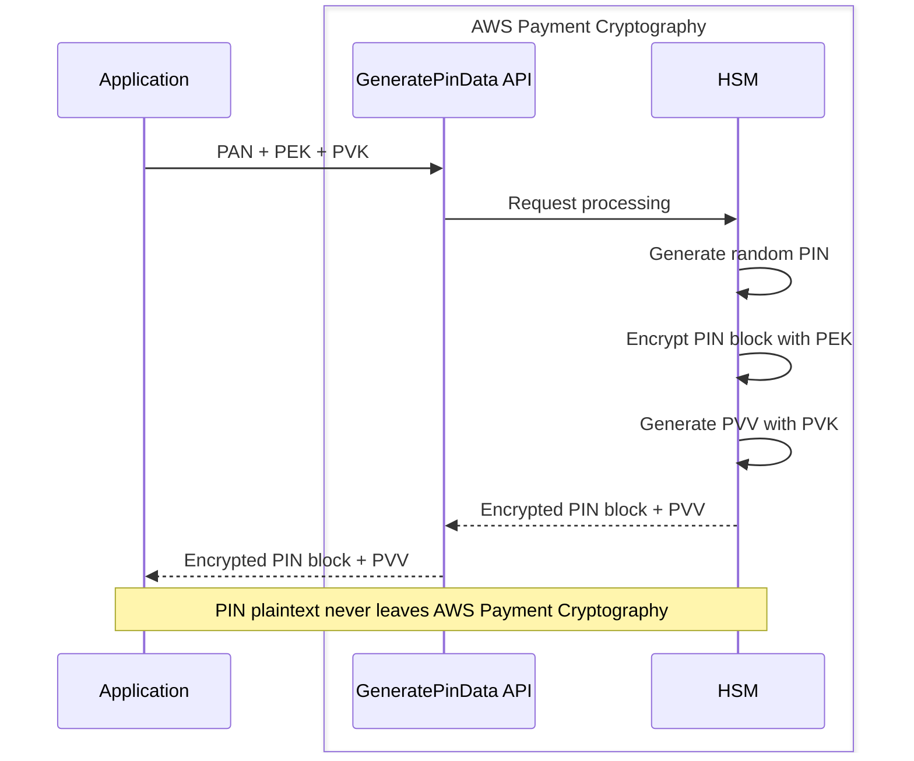

## Introduction

In the [previous introductory article](/en/blog/2026/03/29/aws-payment-cryptography-intro), we explored the key management model of AWS Payment Cryptography and confirmed that TR-31 KeyUsage enforcement blocks wrong-key-usage operations at the API level.

Building on that foundation, this article implements three core cryptographic operations that card issuers perform, using the Java SDK:

1. **CVV / CVV2 generation and verification** — Static card data validation
2. **PIN generation and PVV verification** — Dynamic cardholder authentication
3. **ARQC verification** — EMV chip card transaction authentication

The introductory article taught us that "one key serves one purpose." What becomes clear in this issuer edition is the practical consequence: a single payment operation requires multiple purpose-built keys working in coordination. PIN processing, for example, requires `GeneratePinData` to accept both a PEK (PIN Encryption Key) and a PVK (PIN Verification Key) simultaneously.

## Prerequisites

- Familiarity with the [introductory article](/en/blog/2026/03/29/aws-payment-cryptography-intro)
- Java 17+, AWS SDK for Java v2
- IAM permissions: `payment-cryptography:*` (for testing)
- Test region: us-east-1

## Issuer Cryptographic Operations Overview

| Operation | API | Required Keys | KeyUsage |
|---|---|---|---|
| CVV/CVV2 generation | GenerateCardValidationData | CVK | TR31_C0 |
| CVV/CVV2 verification | VerifyCardValidationData | CVK | TR31_C0 |
| PIN generation | GeneratePinData | PEK + PVK | TR31_P0 + TR31_V2 |
| PIN verification | VerifyPinData | PEK + PVK | TR31_P0 + TR31_V2 |
| ARQC verification | VerifyAuthRequestCryptogram | IMK | TR31_E0 |

Notice that PIN processing is the only operation requiring two keys simultaneously. The PEK handles PIN block encryption while the PVK handles PVV generation/verification. Two purpose-built keys fulfill their respective roles within a single API call.




## Source Code and Build

Here is the full program used in the verifications. If you want to follow along on your machine, place the files below and build. The results are explained in the following sections.

The Maven dependencies (`pom.xml`) are the same as the [introductory article](/en/blog/2026/03/29/aws-payment-cryptography-intro).


<details className="my-4 rounded-lg border border-border bg-muted/30 p-4">
<summary className="cursor-pointer font-medium">IssuerDemo.java (runnable code covering all scenarios)</summary>

```java title="IssuerDemo.java"
package demo;

import software.amazon.awssdk.regions.Region;
import software.amazon.awssdk.services.paymentcryptography.PaymentCryptographyClient;
import software.amazon.awssdk.services.paymentcryptography.model.*;
import software.amazon.awssdk.services.paymentcryptographydata.PaymentCryptographyDataClient;
import software.amazon.awssdk.services.paymentcryptographydata.model.*;
import software.amazon.awssdk.services.paymentcryptographydata.model.VerificationFailedException;

public class IssuerDemo {

    static final Region REGION = Region.US_EAST_1;

    public static void main(String[] args) {
        try (var cp = PaymentCryptographyClient.builder().region(REGION).build();
             var dp = PaymentCryptographyDataClient.builder().region(REGION).build()) {

            var cvk = createKey(cp, "CVK", KeyUsage.TR31_C0_CARD_VERIFICATION_KEY,
                    KeyAlgorithm.TDES_2_KEY,
                    KeyModesOfUse.builder().generate(true).verify(true).build());
            var pek = createKey(cp, "PEK", KeyUsage.TR31_P0_PIN_ENCRYPTION_KEY,
                    KeyAlgorithm.TDES_3_KEY,
                    KeyModesOfUse.builder().encrypt(true).decrypt(true)
                            .wrap(true).unwrap(true).build());
            var pvk = createKey(cp, "PVK", KeyUsage.TR31_V2_VISA_PIN_VERIFICATION_KEY,
                    KeyAlgorithm.TDES_2_KEY,
                    KeyModesOfUse.builder().generate(true).verify(true).build());
            var imk = createKey(cp, "IMK", KeyUsage.TR31_E0_EMV_MKEY_APP_CRYPTOGRAMS,
                    KeyAlgorithm.TDES_2_KEY,
                    KeyModesOfUse.builder().deriveKey(true).build());

            testCvvAndCvv2(dp, cvk);
            testPinGenerateVerify(dp, pek, pvk);
            testArqcVerify(dp, imk);

            for (var arn : new String[]{cvk, pek, pvk, imk})
                cp.deleteKey(DeleteKeyRequest.builder()
                        .keyIdentifier(arn).deleteKeyInDays(3).build());
        }
    }

    static String createKey(PaymentCryptographyClient cp, String name,
                            KeyUsage usage, KeyAlgorithm algo, KeyModesOfUse modes) {
        var key = cp.createKey(CreateKeyRequest.builder().exportable(true)
                .keyAttributes(KeyAttributes.builder().keyUsage(usage)
                        .keyClass(KeyClass.SYMMETRIC_KEY).keyAlgorithm(algo)
                        .keyModesOfUse(modes).build()).build()).key();
        System.out.printf("[%s] %s %s KCV:%s%n", name,
                key.keyAttributes().keyUsageAsString(),
                key.keyAttributes().keyAlgorithmAsString(), key.keyCheckValue());
        return key.keyArn();
    }

    static void testCvvAndCvv2(PaymentCryptographyDataClient dp, String cvk) {
        var pan = "4111111111111111";
        var expiry = "0328";
        var cvv = dp.generateCardValidationData(GenerateCardValidationDataRequest.builder()
                .keyIdentifier(cvk).primaryAccountNumber(pan).validationDataLength(3)
                .generationAttributes(CardGenerationAttributes.builder()
                        .cardVerificationValue1(CardVerificationValue1.builder()
                                .cardExpiryDate(expiry).serviceCode("101").build())
                        .build()).build());
        var cvv2 = dp.generateCardValidationData(GenerateCardValidationDataRequest.builder()
                .keyIdentifier(cvk).primaryAccountNumber(pan).validationDataLength(3)
                .generationAttributes(CardGenerationAttributes.builder()
                        .cardVerificationValue2(CardVerificationValue2.builder()
                                .cardExpiryDate(expiry).build())
                        .build()).build());
        System.out.printf("CVV: %s, CVV2: %s, Different: %s%n",
                cvv.validationData(), cvv2.validationData(),
                !cvv.validationData().equals(cvv2.validationData()));
        dp.verifyCardValidationData(VerifyCardValidationDataRequest.builder()
                .keyIdentifier(cvk).primaryAccountNumber(pan)
                .validationData(cvv.validationData())
                .verificationAttributes(CardVerificationAttributes.builder()
                        .cardVerificationValue1(CardVerificationValue1.builder()
                                .cardExpiryDate(expiry).serviceCode("101").build())
                        .build()).build());
        System.out.println("CVV verification: Success");
        try {
            dp.verifyCardValidationData(VerifyCardValidationDataRequest.builder()
                    .keyIdentifier(cvk).primaryAccountNumber(pan)
                    .validationData(cvv.validationData())
                    .verificationAttributes(CardVerificationAttributes.builder()
                            .cardVerificationValue2(CardVerificationValue2.builder()
                                    .cardExpiryDate(expiry).build())
                            .build()).build());
        } catch (VerificationFailedException e) {
            System.out.printf("Cross-verification (CVV as CVV2): Failed%n%n");
        }
    }

    static void testPinGenerateVerify(PaymentCryptographyDataClient dp,
                                      String pek, String pvk) {
        var pan = "4111111111111111";
        var pin = dp.generatePinData(GeneratePinDataRequest.builder()
                .generationKeyIdentifier(pvk).encryptionKeyIdentifier(pek)
                .primaryAccountNumber(pan)
                .pinBlockFormat(PinBlockFormatForPinData.ISO_FORMAT_0)
                .generationAttributes(PinGenerationAttributes.builder()
                        .visaPin(VisaPin.builder().pinVerificationKeyIndex(1).build())
                        .build()).build());
        System.out.printf("PIN block: %s, PVV: %s%n",
                pin.encryptedPinBlock(), pin.pinData().verificationValue());
        dp.verifyPinData(VerifyPinDataRequest.builder()
                .verificationKeyIdentifier(pvk).encryptionKeyIdentifier(pek)
                .primaryAccountNumber(pan)
                .pinBlockFormat(PinBlockFormatForPinData.ISO_FORMAT_0)
                .encryptedPinBlock(pin.encryptedPinBlock())
                .verificationAttributes(PinVerificationAttributes.builder()
                        .visaPin(VisaPinVerification.builder()
                                .pinVerificationKeyIndex(1)
                                .verificationValue(pin.pinData().verificationValue())
                                .build()).build()).build());
        System.out.println("PIN verification (correct PVV): Success");
        try {
            dp.verifyPinData(VerifyPinDataRequest.builder()
                    .verificationKeyIdentifier(pvk).encryptionKeyIdentifier(pek)
                    .primaryAccountNumber(pan)
                    .pinBlockFormat(PinBlockFormatForPinData.ISO_FORMAT_0)
                    .encryptedPinBlock(pin.encryptedPinBlock())
                    .verificationAttributes(PinVerificationAttributes.builder()
                            .visaPin(VisaPinVerification.builder()
                                    .pinVerificationKeyIndex(1)
                                    .verificationValue("9999").build())
                            .build()).build());
        } catch (VerificationFailedException e) {
            System.out.printf("PIN verification (wrong PVV): Failed%n%n");
        }
    }

    static void testArqcVerify(PaymentCryptographyDataClient dp, String imk) {
        try {
            dp.verifyAuthRequestCryptogram(VerifyAuthRequestCryptogramRequest.builder()
                    .keyIdentifier(imk)
                    .majorKeyDerivationMode(MajorKeyDerivationMode.EMV_OPTION_A)
                    .transactionData("00000000170000000000000008400080008000084016051700000000093800000B1F2201030000000000000000000000000000000000000000000000000000008000000000000000")
                    .authRequestCryptogram("61EDCC708B4C97B4")
                    .sessionKeyDerivationAttributes(SessionKeyDerivation.builder()
                            .emvCommon(SessionKeyEmvCommon.builder()
                                    .applicationTransactionCounter("000B")
                                    .panSequenceNumber("01")
                                    .primaryAccountNumber("9137631040001422").build())
                            .build())
                    .authResponseAttributes(CryptogramAuthResponse.builder()
                            .arpcMethod2(CryptogramVerificationArpcMethod2.builder()
                                    .cardStatusUpdate("12345678").build())
                            .build()).build());
            System.out.println("ARQC verification: Success");
        } catch (VerificationFailedException e) {
            System.out.printf("ARQC verification: Failed (IMK mismatch)%n%n");
        }
    }
}
```

</details>


<details className="my-4 rounded-lg border border-border bg-muted/30 p-4">
<summary className="cursor-pointer font-medium">Build and run instructions</summary>

Uses the same project structure as the [introductory article](/en/blog/2026/03/29/aws-payment-cryptography-intro). Place `IssuerDemo.java` in `src/main/java/demo/`.

```bash title="Terminal"
cd payment-crypto-demo

# Place IssuerDemo.java in src/main/java/demo/

# Build and run
mvn clean compile -q
mvn exec:java -Dexec.mainClass=demo.IssuerDemo
```

</details>

## Verification 1: CVV and CVV2 Generation — The Service Code Difference

The introductory article covered CVV2 only. Here we generate both CVV (magnetic stripe) and CVV2 (card-not-present) to confirm they produce different values from the same key, PAN, and expiry date.

CVV and CVV2 use the same cryptographic algorithm but differ in the service code input. CVV uses the card's magnetic stripe service code (e.g., `101`), while CVV2 internally uses `000`.

```java title="Java"
// CVV generation (magnetic stripe, service code 101)
var cvvResp = dataPlane.generateCardValidationData(
        GenerateCardValidationDataRequest.builder()
                .keyIdentifier(cvkArn).primaryAccountNumber("4111111111111111")
                .validationDataLength(3)
                .generationAttributes(CardGenerationAttributes.builder()
                        .cardVerificationValue1(CardVerificationValue1.builder()
                                .cardExpiryDate("0328").serviceCode("101").build())
                        .build()).build());

// CVV2 generation (card-not-present)
var cvv2Resp = dataPlane.generateCardValidationData(
        GenerateCardValidationDataRequest.builder()
                .keyIdentifier(cvkArn).primaryAccountNumber("4111111111111111")
                .validationDataLength(3)
                .generationAttributes(CardGenerationAttributes.builder()
                        .cardVerificationValue2(CardVerificationValue2.builder()
                                .cardExpiryDate("0328").build())
                        .build()).build());
```

```text title="Output"
CVV  (ServiceCode=101): 721
CVV2 (ServiceCode=000): 648
CVV and CVV2 are different: true
CVV verification (correct value 721): Success
Cross-verification (CVV value 721 as CVV2): Failed — INVALID_VALIDATION_DATA
```

Both can be generated with the same CVK, but the values differ. Using a CVV value for CVV2 verification fails. This design ensures that leaked magnetic stripe data cannot be used to derive CVV2 for online fraud.

Note: This verification uses the same CVK for both CVV and CVV2, but the [documentation](https://docs.aws.amazon.com/payment-cryptography/latest/userguide/use-cases-issuers.generalfunctions.cvv.html) recommends using separate keys for each purpose (CVV, CVV2, and iCVV), distinguished by aliases or tags.

## Verification 2: PIN Generation and PVV Verification — Two Keys in Coordination

This is the core of the article. PIN processing is the canonical example of the "one key, one purpose" principle manifesting as "multiple keys cooperating."

### Key Setup

PIN processing requires two keys:

| Key | KeyUsage | Algorithm | Role |
|---|---|---|---|
| PEK (PIN Encryption Key) | TR31_P0 | TDES_3KEY | PIN block encryption |
| PVK (PIN Verification Key) | TR31_V2 | TDES_2KEY | PVV generation/verification |

<details className="my-4 rounded-lg border border-border bg-muted/30 p-4">
<summary className="cursor-pointer font-medium">PEK and PVK creation code</summary>

```java title="Java"
var pek = createKey(controlPlane, KeyUsage.TR31_P0_PIN_ENCRYPTION_KEY,
        KeyAlgorithm.TDES_3_KEY,
        KeyModesOfUse.builder().encrypt(true).decrypt(true)
                .wrap(true).unwrap(true).build());

var pvk = createKey(controlPlane, KeyUsage.TR31_V2_VISA_PIN_VERIFICATION_KEY,
        KeyAlgorithm.TDES_2_KEY,
        KeyModesOfUse.builder().generate(true).verify(true).build());
```

</details>

Note the PEK algorithm. While the PVV tutorial in the documentation suggests "AES is appropriate for internal use," the `VisaPin` scheme (random PIN generation) in `GeneratePinData` requires TDES_2KEY or TDES_3KEY for the PEK. Specifying AES_128 returns `ValidationException: KeyAlgorithm ... is invalid for the operation`.

There is also a documentation inconsistency for the PVK algorithm. The [PVV tutorial](https://docs.aws.amazon.com/payment-cryptography/latest/userguide/use-cases-issuers.generalfunctions.pvv.html) states "PGK must be a key of algorithm TDES_2KEY," but the [Valid keys page](https://docs.aws.amazon.com/payment-cryptography/latest/userguide/crypto-ops-validkeys-ops.html) lists only TDES_3KEY. Our verification succeeded with TDES_2KEY.

### PIN Generation

`GeneratePinData` generates a random PIN, returns the PEK-encrypted PIN block and the PVK-generated PVV simultaneously.

```java title="Java"
var pinResp = dataPlane.generatePinData(GeneratePinDataRequest.builder()
        .generationKeyIdentifier(pvkArn)   // Key for PVV generation
        .encryptionKeyIdentifier(pekArn)   // Key for PIN encryption
        .primaryAccountNumber("4111111111111111")
        .pinBlockFormat(PinBlockFormatForPinData.ISO_FORMAT_0)
        .generationAttributes(PinGenerationAttributes.builder()
                .visaPin(VisaPin.builder()
                        .pinVerificationKeyIndex(1).build())
                .build())
        .build());
```

```text title="Output"
Encrypted PIN block: 246765C378B874DD
PVV: 3756
GenerationKey KCV: B4B606, EncryptionKey KCV: E90B22
```

The response includes KCVs for both keys, confirming which key encrypted the PIN and which generated the PVV.

Key gotchas:
- `generationKeyIdentifier` takes the PVK, `encryptionKeyIdentifier` takes the PEK. Read "generation = PVV generation" and "encryption = PIN encryption"
- The generation scheme is `VisaPin`. `VisaPinVerificationValue` is for generating PVV from an existing PIN — not for random PIN generation

### PIN Verification

<details className="my-4 rounded-lg border border-border bg-muted/30 p-4">
<summary className="cursor-pointer font-medium">PIN verification code (VerifyPinData)</summary>

```java title="Java"
dataPlane.verifyPinData(VerifyPinDataRequest.builder()
        .verificationKeyIdentifier(pvkArn)
        .encryptionKeyIdentifier(pekArn)
        .primaryAccountNumber("4111111111111111")
        .pinBlockFormat(PinBlockFormatForPinData.ISO_FORMAT_0)
        .encryptedPinBlock(pinResp.encryptedPinBlock())
        .verificationAttributes(PinVerificationAttributes.builder()
                .visaPin(VisaPinVerification.builder()
                        .pinVerificationKeyIndex(1)
                        .verificationValue(pinResp.pinData().verificationValue())
                        .build())
                .build())
        .build());
```

</details>

```text title="Output"
PIN verification (correct PVV 3756): Success
PIN verification (wrong PVV 9999): Failed — INVALID_PIN
```

The verification scheme class is `VisaPinVerification` (not `VisaPin` used for generation). Generation and verification use different class names in the Java SDK.

## Verification 3: ARQC Verification — EMV Chip Card Transaction Authentication

ARQC (Authorization Request Cryptogram) is a cryptographic value generated by an EMV chip card during a transaction. It combines the card's key material, terminal information, and transaction data. The issuer verifies it to confirm card authenticity and transaction integrity.

### Key and API

ARQC verification requires an IMK (Issuer Master Key). Card-specific keys are derived from the IMK internally.

<details className="my-4 rounded-lg border border-border bg-muted/30 p-4">
<summary className="cursor-pointer font-medium">IMK creation code</summary>

```java title="Java"
var imk = createKey(controlPlane, KeyUsage.TR31_E0_EMV_MKEY_APP_CRYPTOGRAMS,
        KeyAlgorithm.TDES_2_KEY,
        KeyModesOfUse.builder().deriveKey(true).build());
```

</details>

Like the BDK from the introductory article, the IMK's `KeyModesOfUse` is `DeriveKey` only — master keys exist solely to derive child keys.

### ARQC Verification Call

```java title="Java"
var resp = dataPlane.verifyAuthRequestCryptogram(
        VerifyAuthRequestCryptogramRequest.builder()
                .keyIdentifier(imkArn)
                .majorKeyDerivationMode(MajorKeyDerivationMode.EMV_OPTION_A)
                .transactionData("000000001700000000000000084000800080000840...")
                .authRequestCryptogram("61EDCC708B4C97B4")
                .sessionKeyDerivationAttributes(SessionKeyDerivation.builder()
                        .emvCommon(SessionKeyEmvCommon.builder()
                                .applicationTransactionCounter("000B")
                                .panSequenceNumber("01")
                                .primaryAccountNumber("9137631040001422")
                                .build())
                        .build())
                .authResponseAttributes(CryptogramAuthResponse.builder()
                        .arpcMethod2(CryptogramVerificationArpcMethod2.builder()
                                .cardStatusUpdate("12345678").build())
                        .build())
                .build());
```

```text title="Output"
ARQC verification: Failed — INVALID_AUTH_REQUEST_CRYPTOGRAM
  → The IMK doesn't match the test data's key, so verification fails
```

This is expected. ARQC is tied to the IMK used during card issuance — a different IMK always fails. With the correct IMK, verification succeeds and returns an ARPC (Authorization Response Cryptogram).

<details className="my-4 rounded-lg border border-border bg-muted/30 p-4">
<summary className="cursor-pointer font-medium">Successful ARQC verification response (from documentation)</summary>

When verification succeeds with the correct IMK:

```json title="Output"
{
    "KeyArn": "arn:aws:payment-cryptography:us-east-2:111122223333:key/pw3s6nl62t5ushfk",
    "KeyCheckValue": "08D7B4",
    "AuthResponseValue": "2263AC85"
}
```

The `AuthResponseValue` is the ARPC, sent back to the card for mutual authentication.

</details>

ARQC verification characteristics:
- **No generation API** — ARQC is generated by the card, so AWS Payment Cryptography only provides verification. This is asymmetric compared to CVV and PIN
- **Session key derivation** — IMK → card master key → session key derivation happens automatically inside the API. Developers only need to provide PAN, PSN, and ATC
- **ARPC generation** — On successful verification, the ARPC enables mutual authentication between card and issuer

## Issuer Operations: API and Key Map

| Operation | API | Key (KeyUsage) | Main Inputs | Result |
|---|---|---|---|---|
| CVV generation | GenerateCardValidationData | CVK (TR31_C0) | PAN + expiry + service code | CVV: 721 |
| CVV2 generation | GenerateCardValidationData | CVK (TR31_C0) | PAN + expiry | CVV2: 648 |
| PIN generation | GeneratePinData | PEK (TR31_P0) + PVK (TR31_V2) | PAN + PIN block format | PIN block + PVV |
| PIN verification | VerifyPinData | PEK (TR31_P0) + PVK (TR31_V2) | PAN + encrypted PIN block + PVV | Success / INVALID_PIN |
| ARQC verification | VerifyAuthRequestCryptogram | IMK (TR31_E0) | PAN + transaction data + ARQC | Success(+ARPC) / INVALID_AUTH_REQUEST_CRYPTOGRAM |

## Summary

- **A single payment operation requires multiple purpose-built keys cooperating** — PIN processing uses PEK and PVK together in one API call. The "one key, one purpose" principle from the introductory article manifests as "multiple keys in coordination" in real issuer processing
- **CVV and CVV2 differ by service code** — Same key, PAN, and expiry produce different values when the service code differs. This prevents magnetic stripe data leaks from enabling online fraud
- **ARQC verification requires IMK match** — Verification always fails without the IMK used during card issuance. Session key derivation is handled automatically inside the API — developers only need to provide PAN, PSN, and ATC

In the next article (Acquirer Edition), we'll implement PIN translation with TranslatePinData and MAC verification with Java.

## Cleanup

Cleanup runs automatically when the program executes. All keys are scheduled for deletion after 3 days (`deleteKeyInDays(3)`). Keys in `DELETE_PENDING` state can be restored with `RestoreKey`.
