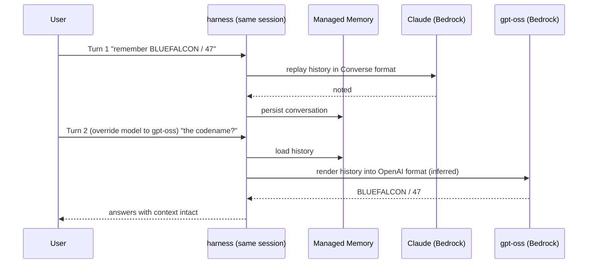

## Introduction

On 2026-06-17, AWS [announced the general availability of Amazon Bedrock AgentCore harness](https://aws.amazon.com/about-aws/whats-new/2026/06/amazon-bedrock-agentcore-harness-generally-available/). The harness provides an agent's orchestration loop — call the model, pick tools, feed results back, manage context, recover from failures, isolate sessions — as managed **configuration** rather than code.

Writing the loop locally is easy; the work explodes in production (concurrency, isolation, state, scaling). Where AgentCore Runtime asks you to write the loop and ship an ECR container, the harness gets an agent running in minutes from just **two API calls** — `CreateHarness` and `InvokeHarness` — with no orchestration code (it runs as a managed abstraction inside Runtime).

**This article shares what I observed when I stood up a harness in us-west-2 with nothing but a name and an execution role: (1) the real idea-to-first-response time, (2) what GA auto-provisions, and (3) the most-emphasized differentiator — that switching model providers mid-session keeps the conversation context.** Spoiler: swapping from Anthropic's Claude to an OpenAI model mid-conversation carried the codename and the number through untouched. See the [AgentCore harness overview](https://docs.aws.amazon.com/bedrock-agentcore/latest/devguide/harness.html) and [Get started](https://docs.aws.amazon.com/bedrock-agentcore/latest/devguide/harness-get-started.html).

## Environment

| Item | Value |
| --- | --- |
| Region | us-west-2 (a harness GA region) |
| Default model | `global.anthropic.claude-sonnet-4-6` |
| Swap target | `openai.gpt-oss-120b-1:0` (native on Bedrock, no API key) |
| SDK | **boto3 1.43.33** |

The first gotcha: the pre-installed AWS CLI 2.34.30 / boto3 1.42.80 had no `create-harness` (`Found invalid choice 'create-harness'`), and the `bedrock-agentcore-control` client lacked the `CreateHarness` API. These are day-of-GA APIs, so **upgrading boto3 to 1.43.x is effectively a prerequisite**. A smaller trap: `harnessName` must match `[a-zA-Z][a-zA-Z0-9_]{0,39}` — no hyphens.

To reproduce a cross-provider swap without API keys, I picked the Bedrock-native OpenAI model `openai.gpt-oss-120b`. Calling OpenAI's direct endpoint or Gemini would instead require an API key stored in AgentCore Identity's token vault (out of scope here).

Two more prerequisites to reproduce this: (1) the calling principal needs the harness APIs (`CreateHarness` / `InvokeHarness`, each of which also requires the matching `InvokeAgentRuntime`-family action) — I ran as admin; (2) enable Bedrock model access for both models (Claude Sonnet 4.6 and gpt-oss-120b) in the target region.

<details className="my-4 rounded-lg border border-border bg-muted/30 p-4">
<summary className="cursor-pointer font-medium">Setup (venv + execution role, reproduce from scratch)</summary>

```bash title="Terminal (venv)"
# Day-of-GA APIs need boto3 1.43.x+ (the system 1.42.x has no create-harness)
python3 -m venv venv && . venv/bin/activate
pip install -q --upgrade boto3   # => 1.43.33
```

The execution role needs a trust policy the harness (`bedrock-agentcore.amazonaws.com`) can assume, plus least-privilege access to Bedrock model invocation, CloudWatch Logs, X-Ray, workload identity, and Memory.

```bash title="Terminal (IAM)"
REGION=us-west-2; ACCOUNT=$(aws sts get-caller-identity --query Account --output text)
ROLE=agentcore-harness-verify-role
cat > trust.json <<JSON
{ "Version":"2012-10-17","Statement":[{"Effect":"Allow",
  "Principal":{"Service":"bedrock-agentcore.amazonaws.com"},"Action":"sts:AssumeRole",
  "Condition":{"StringEquals":{"aws:SourceAccount":"$ACCOUNT"},
    "ArnLike":{"aws:SourceArn":"arn:aws:bedrock-agentcore:$REGION:$ACCOUNT:*"}}}]}
JSON
aws iam create-role --role-name $ROLE --assume-role-policy-document file://trust.json

cat > perms.json <<JSON
{ "Version":"2012-10-17","Statement":[
  {"Sid":"Bedrock","Effect":"Allow",
   "Action":["bedrock:InvokeModel","bedrock:InvokeModelWithResponseStream"],
   "Resource":["arn:aws:bedrock:*::foundation-model/*","arn:aws:bedrock:$REGION:$ACCOUNT:*"]},
  {"Sid":"XRay","Effect":"Allow",
   "Action":["xray:PutTraceSegments","xray:PutTelemetryRecords","xray:GetSamplingRules","xray:GetSamplingTargets"],"Resource":"*"},
  {"Sid":"Logs","Effect":"Allow",
   "Action":["logs:CreateLogGroup","logs:CreateLogStream","logs:PutLogEvents","logs:DescribeLogStreams","logs:DescribeLogGroups"],
   "Resource":"arn:aws:logs:$REGION:$ACCOUNT:log-group:*"},
  {"Sid":"Metrics","Effect":"Allow","Action":"cloudwatch:PutMetricData","Resource":"*",
   "Condition":{"StringEquals":{"cloudwatch:namespace":"bedrock-agentcore"}}},
  {"Sid":"WorkloadIdentity","Effect":"Allow",
   "Action":["bedrock-agentcore:GetWorkloadAccessToken","bedrock-agentcore:GetWorkloadAccessTokenForJWT"],
   "Resource":["arn:aws:bedrock-agentcore:$REGION:$ACCOUNT:workload-identity-directory/default",
     "arn:aws:bedrock-agentcore:$REGION:$ACCOUNT:workload-identity-directory/default/workload-identity/*"]},
  {"Sid":"Memory","Effect":"Allow",
   "Action":["bedrock-agentcore:CreateEvent","bedrock-agentcore:ListEvents","bedrock-agentcore:RetrieveMemoryRecords",
     "bedrock-agentcore:ListMemoryRecords","bedrock-agentcore:GetMemoryRecord","bedrock-agentcore:GetMemory"],
   "Resource":"arn:aws:bedrock-agentcore:$REGION:$ACCOUNT:memory/*"}]}
JSON
aws iam put-role-policy --role-name $ROLE --policy-name harness-verify-perms \
  --policy-document file://perms.json
```

This narrows the official [sample execution role policy](https://docs.aws.amazon.com/bedrock-agentcore/latest/devguide/harness-security.html) to the features this verification uses (Bedrock invocation, logs, tracing, workload identity, managed Memory).

</details>

## Verification 1: two API calls, zero code

I passed `CreateHarness` **only `harnessName` and `executionRoleArn`** — no model, memory, or tools — polled `GetHarness` until `READY`, then streamed a first response from `InvokeHarness`.

```python title="Python (scenario1.py)"
ctrl = boto3.client("bedrock-agentcore-control", "us-west-2")
data = boto3.client("bedrock-agentcore", "us-west-2")

h = ctrl.create_harness(harnessName="verifyZeroCode", executionRoleArn=ROLE_ARN)["harness"]
# poll get_harness until status == "READY" (full version in the collapsible below)

# runtimeSessionId must be at least 33 chars
sid = (uuid.uuid4().hex * 2)[:40]
r = data.invoke_harness(harnessArn=h["arn"], runtimeSessionId=sid,
    messages=[{"role": "user", "content": [{"text": "In one sentence, what model are you and who built you?"}]}])
for ev in r["stream"]:
    if "contentBlockDelta" in ev:
        print(ev["contentBlockDelta"]["delta"].get("text", ""), end="")
```

The measured timings:

| Step | Time |
| --- | --- |
| `CreateHarness` (CREATING → READY) | **~11.1 s** |
| First `InvokeHarness` (to first token) | ~3.2 s |
| First `InvokeHarness` (to completion) | ~3.7 s |

Not "minutes" — **idea to first response in under 15 seconds**. The answer came back `I'm Claude, a large language model built by Anthropic.`, confirming the default model is Claude Sonnet 4.6. The only code I wrote was the API calls; I wrote zero lines of orchestration loop.

The striking part is **what `GetHarness` shows was filled in for things I never specified**:

```text title="Output (auto-provisioned defaults)"
model:        global.anthropic.claude-sonnet-4-6 (apiFormat: converse_stream)
systemPrompt: "You are a helpful assistant."
maxIterations: 75    timeoutSeconds: 3600
truncation:   sliding_window (messagesCount: 150)
memory:       managedMemoryConfiguration -> arn:.../memory/harness_verifyZeroCode_...
```

These are knobs you'd normally tune for production yourself: `maxIterations` caps the tool-use loop iterations, `timeoutSeconds` is the per-invocation budget, and `truncation` keeps the last 150 messages and drops older ones once the conversation outgrows the context window. Say nothing and they all fill in with sane defaults.

As a GA-new behavior, **omitting memory auto-provisioned a real Memory resource**. Querying it with `GetMemory` returns `status: ACTIVE`, strategies `SEMANTIC` (extracts facts from the conversation for retrieval) + `SUMMARIZATION` (keeps a running summary), 30-day event expiry, and namespaces `/actors/{actorId}/facts/` and `/actors/{actorId}/summaries/{sessionId}/`. In preview you had to create a Memory and pass its ARN; at GA it just appears if you forget. And it isn't opaque — it's an ordinary AWS resource with an ARN you can query and audit.

<details className="my-4 rounded-lg border border-border bg-muted/30 p-4">
<summary className="cursor-pointer font-medium">Full Verification 1 script (create, poll, inspect defaults, measure — runnable as-is)</summary>

Run this once `agentcore-harness-verify-role` exists.

```python title="Python (scenario1.py)"
import boto3, time, uuid

REGION = "us-west-2"
ACCOUNT = boto3.client("sts").get_caller_identity()["Account"]
ROLE_ARN = f"arn:aws:iam::{ACCOUNT}:role/agentcore-harness-verify-role"
ctrl = boto3.client("bedrock-agentcore-control", REGION)
data = boto3.client("bedrock-agentcore", REGION)

# CreateHarness: only harnessName and executionRoleArn (no model/memory/tools)
h = ctrl.create_harness(harnessName="verifyZeroCode", executionRoleArn=ROLE_ARN)["harness"]
hid, harness_arn = h["harnessId"], h["arn"]

# Poll GetHarness until READY (create->ready measured from createdAt->updatedAt)
while True:
    g = ctrl.get_harness(harnessId=hid)["harness"]
    if g["status"] in ("READY", "CREATE_FAILED"):
        break
    time.sleep(3)
print("create->ready:", (g["updatedAt"] - g["createdAt"]).total_seconds(), "s")
print("model :", g["model"])         # default: global.anthropic.claude-sonnet-4-6
print("memory:", g["memory"])        # auto-provisioned managedMemoryConfiguration ARN
print("limits:", g["maxIterations"], g["timeoutSeconds"], g["truncation"])

# First InvokeHarness (default model). runtimeSessionId must be >= 33 chars
sid = (uuid.uuid4().hex * 2)[:40]
t = time.time(); first = None; chunks = []
r = data.invoke_harness(harnessArn=harness_arn, runtimeSessionId=sid,
    messages=[{"role": "user", "content": [{"text": "In one sentence, what model are you and who built you?"}]}])
for ev in r["stream"]:
    if "contentBlockDelta" in ev:
        if first is None:
            first = time.time() - t
        chunks.append(ev["contentBlockDelta"]["delta"].get("text", ""))
    elif "metadata" in ev:
        print("usage:", ev["metadata"]["usage"])
print(f"first token {first:.2f}s / full {time.time()-t:.2f}s")
print("".join(chunks))

# Inspect the auto-provisioned Memory resource directly
mem_id = g["memory"]["managedMemoryConfiguration"]["arn"].split("/")[-1]
m = ctrl.get_memory(memoryId=mem_id)["memory"]
print("memory status:", m["status"], "expiry:", m["eventExpiryDuration"],
      "strategies:", [s["type"] for s in m["strategies"]])
```

</details>

## Verification 2: mid-session provider swap keeps context

The differentiator AWS says "customers told us mattered most" is that **switching model providers mid-session keeps the conversation context**. Why is that non-trivial? Different providers use different conversation formats (Anthropic's Converse vs OpenAI's Responses/Chat). Per the docs, the harness reloads conversation history from Memory on every turn and replays it, so you never re-stuff history yourself. When you swap providers, it must render that history into the new model's format — an inference I back up below with the token-count and persona observations.

Here is the two-turn flow, and where Memory sits to carry state across the swap:



I sent two turns on the same `runtimeSessionId`. Turn 1 makes the default Claude memorize facts; turn 2 **overrides** `model` to `openai.gpt-oss-120b` and asks it to use turn 1's information.

```python title="Python (scenario2.py)"
sid = (uuid.uuid4().hex * 2)[:40]  # the invoke() helper is defined in the collapsible below
# Turn 1: default Claude Sonnet 4.6
invoke(sid, "Remember: codename is BLUEFALCON, launch number is 47. Confirm you noted them.")
# Turn 2: same session, switch to OpenAI gpt-oss-120b
invoke(sid, "Repeat my codename and launch number from earlier, and say which company built you.",
       model={"bedrockModelConfig": {"modelId": "openai.gpt-oss-120b-1:0"}})
```

The result was unambiguous:

```text title="Output"
[Turn1 = Claude]       Got it! Project Codename: BLUEFALCON / Launch Number: 47 ...
[Turn2 = gpt-oss-120b] Your project codename is BLUEFALCON and the launch number is 47.
                       I'm a model built by OpenAI.
```

**The codename (BLUEFALCON) and number (47) carried across the provider boundary** (observed). Turn 2 also claimed to be OpenAI-built — but self-identification alone doesn't prove the swap (see below), so I confirmed the override with independent controls.

In a clean session, the default answers `I'm Claude, made by Anthropic.` while the `gpt-oss` override says it was built by OpenAI — the responses clearly diverge. Pass a non-existent modelId and Bedrock's `ConverseStream` rejects it with `The provided model identifier is invalid`. That is the solid proof the override reaches the real model.

And here is why self-identification can't be trusted: in an earlier run I also asked "are you Claude or GPT?" in turn 1. Turn 2's gpt-oss — actually OpenAI under the hood — answered "I'm Claude" (observed). The likely reading (inference) is that it inherited the **persona** from the assistant's earlier "I am Claude" message in history. That is also indirect evidence the harness replays the **entire conversation state**, not just facts, into the new provider's format — in that run, input token counts shifted between turns (969 → 481), consistent with history being rebuilt each turn.

<details className="my-4 rounded-lg border border-border bg-muted/30 p-4">
<summary className="cursor-pointer font-medium">Full Verification 2 + controls script (invoke helper, swap, controls — runnable as-is)</summary>

Reuses the `verifyZeroCode` harness created in Verification 1.

```python title="Python (scenario2.py)"
import boto3, uuid

REGION = "us-west-2"
ctrl = boto3.client("bedrock-agentcore-control", REGION)
data = boto3.client("bedrock-agentcore", REGION)
harness_arn = [x for x in ctrl.list_harnesses()["harnesses"]
               if x["harnessName"] == "verifyZeroCode"][0]["arn"]

def invoke(session_id, text, model=None):
    kw = dict(harnessArn=harness_arn, runtimeSessionId=session_id,
              messages=[{"role": "user", "content": [{"text": text}]}])
    if model:
        kw["model"] = model
    out = []
    for ev in data.invoke_harness(**kw)["stream"]:
        if "contentBlockDelta" in ev:
            out.append(ev["contentBlockDelta"]["delta"].get("text", ""))
    return "".join(out)

# --- Provider swap on the same session ---
sid = (uuid.uuid4().hex * 2)[:40]
print("T1:", invoke(sid, "Remember: codename is BLUEFALCON, launch number is 47. Confirm you noted them."))
print("T2:", invoke(sid, "Repeat my codename and launch number from earlier, and say which company built you.",
                    model={"bedrockModelConfig": {"modelId": "openai.gpt-oss-120b-1:0"}}))

# --- Controls (a fresh session each time) ---
Q = "What model and company made you? One short sentence."
print("default:", invoke((uuid.uuid4().hex * 2)[:40], Q))                  # => Claude / Anthropic
print("gpt-oss:", invoke((uuid.uuid4().hex * 2)[:40], Q,
                         {"bedrockModelConfig": {"modelId": "openai.gpt-oss-120b-1:0"}}))  # => OpenAI
# A non-existent modelId raises a ConverseStream ValidationException
# (EventStreamError) while iterating the stream.
```

</details>

## Comparison: harness vs writing the loop yourself

Mapping what I observed against what a hand-written loop forces you to build:

| Concern | DIY loop | AgentCore harness |
| --- | --- | --- |
| Model client | Wire per-provider SDKs | One config field |
| Mid-session provider swap | Code to **translate + replay** history per format | `model` override on `InvokeHarness` |
| Conversation persistence | Pick a store, implement save/load | Managed Memory auto-provisioned by default |
| Session isolation | Build concurrency/isolation yourself | microVM per session by default |
| Streaming | Implement event shaping | Just read `stream` |

As the [harness vs Runtime](https://docs.aws.amazon.com/bedrock-agentcore/latest/devguide/harness-vs-runtime.html) grid states, these split into "no code (✅)" on the harness and "you implement it (🔵)" on Runtime. Turning the hardest piece — **mid-session swap plus context format translation** — into config is, to me, the core value of the harness.

## Summary

- **Idea to first response in under 15 seconds, with zero code** — `CreateHarness` reached READY in ~11 s and the first response took ~3.7 s. Model (Claude Sonnet 4.6), system prompt, execution limits, and Memory all fill in with sane defaults when you say nothing.
- **GA covers for you when you forget memory** — omitting memory provisions a real `SEMANTIC`+`SUMMARIZATION`, 30-day Memory resource you can address by ARN, not a black box.
- **Context survives a provider swap** — Claude → OpenAI gpt-oss in the same session kept the codename and number (observed). From the persona carryover and the shifting token counts, the conversation state appears to be rebuilt per provider format (inference).
- **Stay on the harness while config is enough; export to code when it isn't** — per the docs, graduation is a config-to-code translation, not an architecture switch ([Export to code](https://docs.aws.amazon.com/bedrock-agentcore/latest/devguide/harness-export.html), not verified in this article). Decide adoption by whether it offloads your loop's hardest parts.

## Cleanup

<details className="my-4 rounded-lg border border-border bg-muted/30 p-4">
<summary className="cursor-pointer font-medium">Resource deletion commands (reverse creation order)</summary>

`DeleteHarness` cascade-deletes the auto-provisioned Memory by default (pass `deleteManagedMemory=false` to keep it). As in the body, I use boto3 for `bedrock-agentcore-control` (the old CLI has no harness subcommands); IAM role deletion works on the old CLI too.

```python title="Python (cleanup.py)"
ctrl = boto3.client("bedrock-agentcore-control", "us-west-2")
iam = boto3.client("iam")
hid = [h["harnessId"] for h in ctrl.list_harnesses()["harnesses"]
       if h["harnessName"] == "verifyZeroCode"][0]
ctrl.delete_harness(harnessId=hid)  # managed memory is cascade-deleted by default
iam.delete_role_policy(RoleName="agentcore-harness-verify-role", PolicyName="harness-verify-perms")
iam.delete_role(RoleName="agentcore-harness-verify-role")
```

</details>
