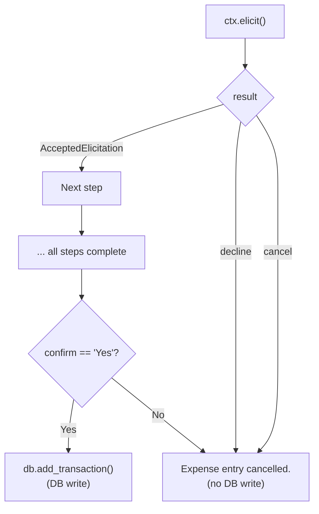

## Introduction

On April 9, 2026, AWS published a [blog post on Stateful MCP client capabilities](https://aws.amazon.com/blogs/machine-learning/introducing-stateful-mcp-client-capabilities-on-amazon-bedrock-agentcore-runtime/), demonstrating Elicitation, Sampling, and Progress Notifications with a DynamoDB-backed expense tracker sample.

In a [previous article](/en/blog/2026/03/11/bedrock-agentcore-runtime-stateful-mcp), I verified that the three capabilities work using a Travel Planner sample. However, happy-path verification alone is insufficient for production use. What happens when a user declines input mid-flow? What happens when Sampling fails? The documentation states that "servers should handle each case appropriately" but doesn't show the actual behavior.

This article builds a DynamoDB-backed Stateful MCP server based on the blog's expense tracker sample, verifies the normal flow, and tests edge cases that the documentation doesn't cover. See the official documentation at [Stateful MCP server features](https://docs.aws.amazon.com/bedrock-agentcore/latest/devguide/mcp-stateful-features.html).

## Prerequisites

- AWS CLI configured (`bedrock-agentcore:*`, `dynamodb:*`, `bedrock:InvokeModel` permissions)
- Python 3.10+, FastMCP 3.2+
- Test region: us-west-2

## Environment Setup

Based on the blog's expense tracker sample, I built an MCP server with three tools, each mapping to one Stateful MCP capability.

| Tool | Stateful MCP Capability | Role |
|---|---|---|
| `add_expense_interactive` | Elicitation | Collect amount, description, category, and confirmation interactively, then write to DynamoDB |
| `analyze_spending` | Sampling | Fetch spending data from DynamoDB and request analysis from the client's LLM |
| `generate_report` | Progress Notifications | Generate a monthly report in 5 stages, notifying progress at each stage |

<details className="my-4 rounded-lg border border-border bg-muted/30 p-4">
<summary className="cursor-pointer font-medium">DynamoDB table creation</summary>

```bash title="Terminal"
# Transactions table
aws dynamodb create-table \
  --table-name mcp-finance-transactions \
  --attribute-definitions \
    AttributeName=user_alias,AttributeType=S \
    AttributeName=transaction_id,AttributeType=S \
  --key-schema \
    AttributeName=user_alias,KeyType=HASH \
    AttributeName=transaction_id,KeyType=RANGE \
  --billing-mode PAY_PER_REQUEST \
  --region us-west-2

# Budgets table
aws dynamodb create-table \
  --table-name mcp-finance-budgets \
  --attribute-definitions \
    AttributeName=user_alias,AttributeType=S \
    AttributeName=category,AttributeType=S \
  --key-schema \
    AttributeName=user_alias,KeyType=HASH \
    AttributeName=category,KeyType=RANGE \
  --billing-mode PAY_PER_REQUEST \
  --region us-west-2
```

</details>

<details className="my-4 rounded-lg border border-border bg-muted/30 p-4">
<summary className="cursor-pointer font-medium">DynamoDB utility (dynamo_utils.py)</summary>

```python title="dynamo_utils.py"
import uuid
from datetime import datetime, timezone
from decimal import Decimal

import boto3
from boto3.dynamodb.conditions import Key


class FinanceDB:
    def __init__(self, region_name: str = "us-west-2"):
        dynamodb = boto3.resource("dynamodb", region_name=region_name)
        self.transactions = dynamodb.Table("mcp-finance-transactions")
        self.budgets = dynamodb.Table("mcp-finance-budgets")

    def add_transaction(self, user_alias, tx_type, amount, description, category):
        tx_id = str(uuid.uuid4())[:8]
        self.transactions.put_item(Item={
            "user_alias": user_alias,
            "transaction_id": tx_id,
            "type": tx_type,
            "amount": Decimal(str(amount)),
            "description": description,
            "category": category,
            "timestamp": datetime.now(timezone.utc).isoformat(),
        })
        return f"Expense of ${abs(amount):.2f} added for {user_alias}"

    def get_transactions(self, user_alias):
        return self.transactions.query(
            KeyConditionExpression=Key("user_alias").eq(user_alias)
        ).get("Items", [])

    def get_budgets(self, user_alias):
        return self.budgets.query(
            KeyConditionExpression=Key("user_alias").eq(user_alias)
        ).get("Items", [])
```

</details>

<details className="my-4 rounded-lg border border-border bg-muted/30 p-4">
<summary className="cursor-pointer font-medium">MCP server code (finance_server.py)</summary>

```python title="finance_server.py"
import os
from pydantic import BaseModel
from fastmcp import FastMCP, Context
from fastmcp.server.elicitation import AcceptedElicitation
from dynamo_utils import FinanceDB

mcp = FastMCP(name="FinanceMCP")
db = FinanceDB(region_name=os.environ.get("AWS_REGION", "us-west-2"))

class AmountInput(BaseModel):
    amount: float

class DescriptionInput(BaseModel):
    description: str

class CategoryInput(BaseModel):
    category: str

class ConfirmInput(BaseModel):
    confirm: str


@mcp.tool()
async def add_expense_interactive(user_alias: str, ctx: Context) -> str:
    """Interactively add a new expense using elicitation."""
    result = await ctx.elicit("How much did you spend?", AmountInput)
    if not isinstance(result, AcceptedElicitation):
        return "Expense entry cancelled."
    amount = result.data.amount

    result = await ctx.elicit("What was it for?", DescriptionInput)
    if not isinstance(result, AcceptedElicitation):
        return "Expense entry cancelled."
    description = result.data.description

    result = await ctx.elicit(
        "Select a category (food, transport, bills, entertainment, other):",
        CategoryInput,
    )
    if not isinstance(result, AcceptedElicitation):
        return "Expense entry cancelled."
    category = result.data.category

    confirm_msg = (
        f"Confirm: add expense of ${amount:.2f} for {description}"
        f" (category: {category})? Reply Yes or No"
    )
    result = await ctx.elicit(confirm_msg, ConfirmInput)
    if not isinstance(result, AcceptedElicitation) or result.data.confirm != "Yes":
        return "Expense entry cancelled."

    return db.add_transaction(user_alias, "expense", -abs(amount), description, category)


@mcp.tool()
async def analyze_spending(user_alias: str, ctx: Context) -> str:
    """Fetch expenses and ask the client's LLM to analyse them."""
    transactions = db.get_transactions(user_alias)
    if not transactions:
        return f"No transactions found for {user_alias}."

    lines = "\n".join(
        f"- {t['description']} (${abs(float(t['amount'])):.2f}, {t['category']})"
        for t in transactions
    )
    prompt = (
        f"Here are the recent expenses:\n{lines}\n\n"
        f"Give 3 concise, actionable recommendations. Under 120 words."
    )

    ai_analysis = "Analysis unavailable."
    try:
        response = await ctx.sample(messages=prompt, max_tokens=300)
        if hasattr(response, "text") and response.text:
            ai_analysis = response.text
    except Exception:
        pass

    return f"Spending Analysis for {user_alias}:\n\n{ai_analysis}"


@mcp.tool()
async def generate_report(user_alias: str, ctx: Context) -> str:
    """Generate a monthly financial report with progress notifications."""
    total = 5

    await ctx.report_progress(progress=1, total=total)
    transactions = db.get_transactions(user_alias)

    await ctx.report_progress(progress=2, total=total)
    by_category = {}
    for t in transactions:
        cat = t["category"]
        by_category[cat] = by_category.get(cat, 0) + abs(float(t["amount"]))

    await ctx.report_progress(progress=3, total=total)
    budgets = {b["category"]: float(b["monthly_limit"]) for b in db.get_budgets(user_alias)}

    await ctx.report_progress(progress=4, total=total)
    lines = []
    for cat, spent in sorted(by_category.items(), key=lambda x: -x[1]):
        limit = budgets.get(cat)
        if limit:
            pct = (spent / limit) * 100
            status = "OVER" if spent > limit else "OK"
            lines.append(f"  {cat:<15} ${spent:>8.2f} / ${limit:.2f}  [{pct:.0f}%] {status}")
        else:
            lines.append(f"  {cat:<15} ${spent:>8.2f}  (no budget set)")

    await ctx.report_progress(progress=5, total=total)
    total_spent = sum(by_category.values())
    return (
        f"Monthly Report for {user_alias}\n"
        f"{'=' * 50}\n"
        f"  {'Category':<15} {'Spent':>10}   {'Budget':>8}  Status\n"
        f"{'-' * 50}\n"
        + "\n".join(lines)
        + f"\n{'-' * 50}\n"
        f"  {'TOTAL':<15} ${total_spent:>8.2f}\n"
    )


if __name__ == "__main__":
    mcp.run(transport="streamable-http", host="0.0.0.0", port=8000, stateless_http=False)
```

</details>

### Key Design Points

First, each Elicitation step checks `isinstance(result, AcceptedElicitation)`. The MCP specification defines three response types for Elicitation: `accept` (data provided), `decline` (explicit rejection), and `cancel` (dismissed without choosing). This server is designed to immediately abort tool execution if anything other than `AcceptedElicitation` is returned.

Second, `analyze_spending` wraps `ctx.sample()` in `try/except`. Since Sampling depends on the client's LLM, the handler may not be registered or may throw an exception. The fallback text `"Analysis unavailable."` ensures the tool returns a valid response regardless.

The following verification tests whether these error handling patterns actually work as expected.

### Setup and Execution

```text title="requirements.txt"
fastmcp>=2.10.0
mcp
boto3
pydantic
```

```bash title="Terminal"
pip install -r requirements.txt
```

Place the three files (`dynamo_utils.py`, `finance_server.py`, `requirements.txt`) in the same directory. FastMCP's `Client` can accept a server object directly, so there's no need to run the server in a separate process. The following test client reproduces both the normal flow and edge cases.

<details className="my-4 rounded-lg border border-border bg-muted/30 p-4">
<summary className="cursor-pointer font-medium">Test client (test_client.py)</summary>

```python title="test_client.py"
"""Test client — normal flow + edge cases."""
import asyncio
import os

os.environ.setdefault("AWS_DEFAULT_REGION", "us-west-2")

from fastmcp import Client
from fastmcp.client.elicitation import ElicitResult
from mcp.types import CreateMessageResult, TextContent
from finance_server import mcp


async def test_normal_flow():
    """Normal: add expenses -> analyze -> report"""
    expenses = [
        [{"amount": 45.50}, {"description": "Lunch at the office"}, {"category": "food"}, {"confirm": "Yes"}],
        [{"amount": 120.00}, {"description": "Electric bill"}, {"category": "bills"}, {"confirm": "Yes"}],
        [{"amount": 15.99}, {"description": "Movie tickets"}, {"category": "entertainment"}, {"confirm": "Yes"}],
        [{"amount": 85.30}, {"description": "Weekly groceries"}, {"category": "food"}, {"confirm": "Yes"}],
    ]
    idx = [0, 0]  # [expense_index, step_index]

    async def elicit_handler(message, response_type, params, context):
        resp = expenses[idx[0]][idx[1]]
        print(f"  Server asks: {message}")
        print(f"  Responding:  {resp}")
        idx[1] += 1
        if idx[1] >= len(expenses[idx[0]]):
            idx[1] = 0
            idx[0] += 1
        return resp

    async def sampling_handler(messages, params, ctx):
        return CreateMessageResult(
            role="assistant",
            content=TextContent(type="text", text="1. Meal prep. 2. Cancel unused subscriptions. 3. Save energy."),
            model="test-model", stopReason="endTurn",
        )

    async def progress_handler(progress, total, message):
        pct = int((progress / total) * 100) if total else 0
        bar = "#" * (pct // 5) + "-" * (20 - pct // 5)
        print(f"  Progress: [{bar}] {pct}% ({int(progress)}/{int(total or 0)})")

    async with Client(mcp, elicitation_handler=elicit_handler,
                      sampling_handler=sampling_handler, progress_handler=progress_handler) as client:
        for i in range(4):
            print(f"\n--- Adding expense {i + 1} ---")
            result = await client.call_tool("add_expense_interactive", {"user_alias": "testuser"})
            print(f"  Result: {result.content[0].text}")

        print("\n--- Analyzing spending ---")
        result = await client.call_tool("analyze_spending", {"user_alias": "testuser"})
        print(f"  Result:\n{result.content[0].text}")

        print("\n--- Generating report ---")
        result = await client.call_tool("generate_report", {"user_alias": "testuser"})
        print(f"  Result:\n{result.content[0].text}")


async def test_decline():
    """Edge case: decline at 2nd question"""
    call_count = [0]

    async def handler(message, response_type, params, context):
        call_count[0] += 1
        print(f"  Server asks: {message}")
        if call_count[0] == 1:
            print("  Responding: {'amount': 99.99}")
            return {"amount": 99.99}
        print("  Responding: DECLINE")
        return ElicitResult(action="decline", content=None)

    async with Client(mcp, elicitation_handler=handler) as client:
        result = await client.call_tool("add_expense_interactive", {"user_alias": "testuser"})
        print(f"  Result: {result.content[0].text}")


async def test_cancel():
    """Edge case: cancel at 1st question"""
    async def handler(message, response_type, params, context):
        print(f"  Server asks: {message}")
        print("  Responding: CANCEL")
        return ElicitResult(action="cancel", content=None)

    async with Client(mcp, elicitation_handler=handler) as client:
        result = await client.call_tool("add_expense_interactive", {"user_alias": "testuser"})
        print(f"  Result: {result.content[0].text}")


async def test_confirm_no():
    """Edge case: answer all, then No at confirmation"""
    responses = iter([{"amount": 50.0}, {"description": "Test"}, {"category": "other"}, {"confirm": "No"}])

    async def handler(message, response_type, params, context):
        resp = next(responses)
        print(f"  Server asks: {message}")
        print(f"  Responding: {resp}")
        return resp

    async with Client(mcp, elicitation_handler=handler) as client:
        result = await client.call_tool("add_expense_interactive", {"user_alias": "testuser"})
        print(f"  Result: {result.content[0].text}")


async def test_sampling_failure():
    """Edge case: sampling handler throws exception"""
    async def handler(messages, params, ctx):
        raise RuntimeError("Simulated LLM failure")

    async with Client(mcp, sampling_handler=handler) as client:
        result = await client.call_tool("analyze_spending", {"user_alias": "testuser"})
        print(f"  Result: {result.content[0].text}")


async def test_no_sampling_handler():
    """Edge case: no sampling handler registered"""
    async with Client(mcp) as client:
        result = await client.call_tool("analyze_spending", {"user_alias": "testuser"})
        print(f"  Result: {result.content[0].text}")


async def main():
    for name, fn in [
        ("Normal Flow", test_normal_flow),
        ("Elicitation Decline", test_decline),
        ("Elicitation Cancel", test_cancel),
        ("Confirm No", test_confirm_no),
        ("Sampling Failure", test_sampling_failure),
        ("No Sampling Handler", test_no_sampling_handler),
    ]:
        print(f"\n{'=' * 50}\n  {name}\n{'=' * 50}")
        await fn()


if __name__ == "__main__":
    asyncio.run(main())
```

</details>

```bash title="Terminal"
AWS_REGION=us-west-2 python test_client.py
```

FastMCP's `Client` accepts the server's `mcp` object directly, so the server and client communicate in-process. For HTTP-based testing, run `finance_server.py` in a separate terminal and use `StreamableHttpTransport(url="http://localhost:8000/mcp")` instead.

## Verification 1: Normal Flow

Starting from empty tables, I executed the full flow: add expenses → analyze spending → generate report.

### Adding Expenses (Elicitation)

Called `add_expense_interactive` four times, each with a 4-step Elicitation sequence.

```text title="Output"
--- Adding expense 1 ---
  Server asks: How much did you spend?
  Responding:  {'amount': 45.5}
  Server asks: What was it for?
  Responding:  {'description': 'Lunch at the office'}
  Server asks: Select a category (food, transport, bills, entertainment, other):
  Responding:  {'category': 'food'}
  Server asks: Confirm: add expense of $45.50 for Lunch at the office (category: food)? Reply Yes or No
  Responding:  {'confirm': 'Yes'}
  Result: Expense of $45.50 added for testuser
```

All four expenses (\$45.50 food, \$120.00 bills, \$15.99 entertainment, \$85.30 food) were written to DynamoDB (the remaining 3 follow the same flow, so output is omitted). At each `ctx.elicit()`, the server sends an `elicitation/create` request to the client, pauses execution, and resumes when the client responds.

### Spending Analysis (Sampling)

`analyze_spending` fetched 4 transactions from DynamoDB, built a prompt, and requested analysis via `ctx.sample()`.

```text title="Output"
--- Analyzing spending ---
  [SAMPLING] Prompt: [SamplingMessage(role='user', content=TextContent(type='text', text='Here are the recent expenses fo...
  Result:
Spending Analysis for testuser:

Total Spending: $266.79

Recommendations:
1. Meal prep at home to reduce food costs by 20-30%.
2. Review entertainment subscriptions and cancel unused services.
3. Use energy-saving measures to lower electricity bills by 10-15%.
```

The Prompt line shows FastMCP's internal object representation, but the content is the prompt string `"Here are the recent expenses...\n- Lunch at the office (\$45.50, food)\n..."`. The server holds no LLM API keys or model selection logic. `ctx.sample()` sends a `sampling/createMessage` request to the client, which generates the response using its own LLM. MCP's separation of tools and models works in practice.

### Monthly Report (Progress Notifications)

`generate_report` executed 5 stages (fetch transactions → group by category → fetch budgets → compare → format), notifying progress at each stage.

```text title="Output"
--- Generating report ---
  Progress: [####----------------] 20% (1/5)
  Progress: [########------------] 40% (2/5)
  Progress: [############--------] 60% (3/5)
  Progress: [################----] 80% (4/5)
  Progress: [####################] 100% (5/5)  Done!

  Result:
Monthly Report for testuser
==================================================
  Category             Spent     Budget  Status
--------------------------------------------------
  food            $  130.80  (no budget set)
  bills           $  120.00  (no budget set)
  entertainment   $   15.99  (no budget set)
--------------------------------------------------
  TOTAL           $  266.79

  Progress notifications received: 5
```

`ctx.report_progress(progress, total)` is fire-and-forget — it doesn't block server execution. All 5 notifications were received by the client's `progress_handler`.

## Verification 2: Edge Case Behavior

This is the main focus. I tested cases where the documentation doesn't specify concrete behavior. The test method involves swapping the client-side `elicitation_handler` or `sampling_handler` to simulate decline, cancel, and exception responses.

The following diagram shows the Elicitation flow in `add_expense_interactive` and where each edge case diverges.



The key point is that the DB write only happens at the single `confirm == "Yes"` path. No matter when the flow is interrupted, data integrity is preserved.

### 2a. Elicitation Decline — Rejecting Input Mid-Flow

Answered the first question (amount) normally, then returned `decline` for the second question (description).

```text title="Output"
  Server asks: How much did you spend?
  Responding: {'amount': 99.99}
  Server asks: What was it for?
  Responding: DECLINE
  Result: Expense entry cancelled.
```

When `decline` is returned, `ctx.elicit()` returns an object that is not `AcceptedElicitation`. The `isinstance` check catches it and the tool returns `"Expense entry cancelled."` immediately.

Critically, **no data was written to DynamoDB**. The server design only calls `db.add_transaction()` after all 4 Elicitation steps complete and the final confirmation returns `"Yes"`. Data collected before the decline (the \$99.99 amount) is discarded.

### 2a-2. Elicitation Cancel — Difference from Decline

Returned `cancel` at the first question.

```text title="Output"
  Server asks: How much did you spend?
  Responding: CANCEL
  Result: Expense entry cancelled.
```

The result is identical to `decline`. In FastMCP's implementation, both `decline` and `cancel` return non-`AcceptedElicitation` objects. When using the `isinstance(result, AcceptedElicitation)` pattern, **decline and cancel follow the same handling path**.

The MCP specification defines a semantic difference: `decline` means "user explicitly rejected" while `cancel` means "user dismissed without choosing." However, FastMCP's `AcceptedElicitation` pattern doesn't distinguish between them. If distinction is needed, check `result.action` directly.

### 2a-3. Rejection at Confirmation — Intermediate Data Handling

Answered all 4 questions, then returned `"No"` at the final confirmation.

```text title="Output"
  Server asks: How much did you spend?
  Responding: {'amount': 50.0}
  Server asks: What was it for?
  Responding: {'description': 'Test item'}
  Server asks: Select a category (food, transport, bills, entertainment, other):
  Responding: {'category': 'other'}
  Server asks: Confirm: add expense of $50.00 for Test item (category: other)? Reply Yes or No
  Responding: {'confirm': 'No'}
  Result: Expense entry cancelled.
```

Even after answering all questions, no data was written to DynamoDB. This follows a different code path from decline/cancel — the Elicitation itself succeeds with `accept`, but the `result.data.confirm != "Yes"` condition catches it.

This pattern serves as a reference for implementing "confirmation dialogs" with Elicitation. Separate data collection from confirmation, and only execute side effects (DB writes) after confirmation.

### 2b. Sampling Failure — Handler Throws Exception

Configured the `sampling_handler` to throw a `RuntimeError`, then called `analyze_spending`.

```text title="Output"
  [SAMPLING] Handler raising exception...
  Result: Spending Analysis for testuser:

Analysis unavailable.
  Contains fallback text: True
```

When `ctx.sample()` receives an exception from the client side, it raises an exception on the server side. The `try/except` in `analyze_spending` catches it and returns the fallback text `"Analysis unavailable."`. **The tool call itself does not error — it returns a normal response.**

This is a critical design pattern for Sampling-based tools. Since Sampling depends on the client's LLM, failure should always be expected. With `try/except` and a fallback, the tool's core functionality (data retrieval in this case) is preserved even when the LLM is unavailable.

### 2b-2. No Sampling Handler Registered

Connected a client without registering a `sampling_handler`, then called `analyze_spending`.

```text title="Output"
  Result: Spending Analysis for testuser:

Analysis unavailable.
```

Same fallback path as 2b. `ctx.sample()` throws an exception, caught by `try/except`.

Per the MCP specification, clients declare supported capabilities during the initialization handshake. According to FastMCP's documentation, a client without a sampling handler doesn't declare sampling capability, so the server shouldn't call `ctx.sample()`. However, this verification confirmed that calling it anyway results in an exception that `try/except` handles safely.

### Edge Case Summary

| Test | Elicitation Result | DB Write | Tool Response |
|---|---|---|---|
| Normal (accept → Yes) | `AcceptedElicitation` | ✅ Yes | Success message |
| Decline mid-flow | Non-`AcceptedElicitation` | ❌ No | Cancellation message |
| Cancel mid-flow | Non-`AcceptedElicitation` | ❌ No | Cancellation message |
| All answered, confirm No | `AcceptedElicitation` (confirm="No") | ❌ No | Cancellation message |

| Test | Sampling Result | Tool Response |
|---|---|---|
| Normal | LLM response text | Analysis result |
| Handler exception | Caught by `try/except` | Fallback text |
| No handler registered | Caught by `try/except` | Fallback text |

## Summary

- **Elicitation decline/cancel preserves data integrity** — The `isinstance(result, AcceptedElicitation)` pattern detects mid-flow exits and aborts before side effects (DB writes). Note that decline and cancel are not distinguished by this pattern; check `result.action` directly if distinction is needed.
- **Always design Sampling with failure in mind** — Since it depends on the client's LLM, both handler exceptions and missing handlers are caught by `try/except`. Design Sampling as an optional enhancement: nice to have, but the tool works without it.
- **Consolidate side effects after confirmation** — When collecting data through multi-step Elicitation, execute side effects (DB writes) only after final confirmation. This eliminates the need for rollback logic on mid-flow exits.
- **Progress Notifications are reliable and low-risk** — All 5/5 notifications arrived without blocking server execution. They're low priority for edge case testing since failures don't affect processing by design.

## Cleanup

```bash title="Terminal"
aws dynamodb delete-table --table-name mcp-finance-transactions --region us-west-2
aws dynamodb delete-table --table-name mcp-finance-budgets --region us-west-2
```
