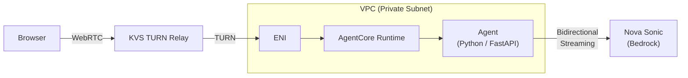

## Introduction

On March 20, 2026, Amazon Bedrock AgentCore Runtime [added WebRTC support](https://aws.amazon.com/about-aws/whats-new/2026/03/amazon-bedrock-webrtc/) for real-time bidirectional streaming. This complements the existing WebSocket protocol with UDP-based, low-latency media transport — ideal for voice agents in browser and mobile applications.

This post walks through building and deploying a WebRTC voice agent using the [official sample](https://github.com/awslabs/amazon-bedrock-agentcore-samples/tree/main/01-tutorials/01-AgentCore-runtime/06-bi-directional-streaming-webrtc), covering both local and AgentCore Runtime environments. The most important finding: **TURN-only mode should be enabled when running on AgentCore Runtime** — without it, audio may fail to reach the agent even though the WebRTC connection appears established.

## WebRTC vs WebSocket

AgentCore Runtime now supports two bidirectional streaming protocols.

| Aspect | WebSocket | WebRTC |
| --- | --- | --- |
| Transport | TCP | UDP (via TURN) |
| Best for | Text + audio streaming | Real-time voice/video |
| Latency | Low | Lower |
| NAT traversal | Not needed | Requires TURN server |
| Browser API | `WebSocket` | `RTCPeerConnection` |

For voice agents where latency matters, WebRTC's UDP-based transport has a clear advantage.

## Architecture



- **Browser client** — Captures microphone audio via WebRTC, plays agent responses
- **KVS TURN relay** — Managed TURN server from Amazon Kinesis Video Streams for NAT traversal
- **AgentCore Runtime** — Hosts the agent in a VPC private subnet
- **Agent** — FastAPI server bridging WebRTC signaling and Nova Sonic audio
- **Nova Sonic** — Amazon's Speech-to-Speech model (`amazon.nova-2-sonic-v1:0`)

A VPC is required because AgentCore Runtime's PUBLIC network mode doesn't support outbound UDP. The agent needs NAT Gateway access to reach KVS TURN servers. See the [official tutorial](https://docs.aws.amazon.com/bedrock-agentcore/latest/devguide/runtime-webrtc-get-started-kvs.html) for details.

## Prerequisites

- Python 3.12+ (required by `aws-sdk-bedrock-runtime`)
- AWS CLI configured
- Nova Sonic model access (`bedrock:InvokeModelWithBidirectionalStream`)

## Local Testing

Start by testing locally. The official sample has the following structure.

```text title="Project structure"
agent/
  bot.py              - FastAPI server, WebRTC signaling
  kvs.py              - KVS signaling channel and TURN credentials
  audio.py            - Audio resampling and WebRTC output track
  nova_sonic.py       - Nova Sonic bidirectional streaming session
  requirements.txt
  Dockerfile
server/
  index.html          - Browser client
  server.py           - Static file server
```

### Setup

```bash title="Terminal (agent)"
git clone https://github.com/awslabs/amazon-bedrock-agentcore-samples.git
cd amazon-bedrock-agentcore-samples/01-tutorials/01-AgentCore-runtime/06-bi-directional-streaming-webrtc

cd agent
python3.12 -m venv venv && source venv/bin/activate
pip install -r requirements.txt
export AWS_REGION=us-west-2
export KVS_CHANNEL_NAME=voice-agent-minimal
python bot.py --host 0.0.0.0 --port 8080
```

In another terminal, start the browser client. The dependencies overlap with the agent's, so reusing the same venv is easiest.

```bash title="Terminal (browser client)"
cd server
source ../agent/venv/bin/activate
python server.py  # http://localhost:7860
```

On startup, a KVS signaling channel is automatically created.

```text title="Output"
Signaling channel: arn:aws:kinesisvideo:us-west-2:123456789012:channel/voice-agent-minimal/...
Uvicorn running on http://0.0.0.0:8080
```

### Verifying It Works

Open `http://localhost:7860` in your browser and click "Connect" with the Agent Runtime ARN field empty. This connects directly to the local agent at `localhost:8080`. Speak into your microphone and Nova Sonic responds with spoken audio.

Note that remote development environments like Codespaces won't work for local testing — their port forwarding only relays HTTP/WebSocket, not WebRTC's UDP media traffic. Local testing requires the browser and agent to be on the same machine.

### How It Works

Now that we've confirmed it works, let's look at the internals.

WebRTC connection establishment happens through multiple requests to the `/invocations` endpoint. Since AgentCore Runtime exposes only a single endpoint, the `action` parameter multiplexes different operations.

```text title="Signaling flow"
1. ice_config    → Fetch KVS TURN/STUN server credentials
2. offer         → Send browser's SDP Offer, agent returns Answer
3. ice_candidate → Exchange ICE candidates (Trickle ICE)
4. Connected     → Bidirectional audio streaming begins
```

The agent also handles audio format conversion. Browser WebRTC typically uses 48kHz, but Nova Sonic expects 16kHz input and produces 24kHz output. `audio.py`'s `convert_to_16khz()` handles input resampling, while the `OutputTrack` class splits output into 20ms WebRTC frames using `av.AudioFifo` for buffering.

| Parameter | Value |
| --- | --- |
| Input sample rate | 16kHz (browser 48kHz → resampled) |
| Output sample rate | 24kHz |
| Format | 16-bit PCM mono |
| Frame size | 20ms (480 samples) |

## Deploying to AgentCore Runtime

With local testing confirmed, let's deploy to AgentCore Runtime.

### 1. VPC Setup

Create a VPC with NAT Gateway.

```bash title="Terminal (VPC setup)"
# Create VPC
VPC_ID=$(aws ec2 create-vpc --cidr-block 10.0.0.0/16 --region us-west-2 \
  --tag-specifications 'ResourceType=vpc,Tags=[{Key=Name,Value=webrtc-bot-example}]' \
  --query 'Vpc.VpcId' --output text)
aws ec2 modify-vpc-attribute --vpc-id $VPC_ID --enable-dns-hostnames '{"Value": true}' --region us-west-2

# Internet Gateway
IGW=$(aws ec2 create-internet-gateway --region us-west-2 --query 'InternetGateway.InternetGatewayId' --output text)
aws ec2 attach-internet-gateway --internet-gateway-id $IGW --vpc-id $VPC_ID --region us-west-2

# Public + Private subnets
PUBLIC_SUBNET=$(aws ec2 create-subnet --vpc-id $VPC_ID --cidr-block 10.0.1.0/24 \
  --availability-zone us-west-2a --region us-west-2 --query 'Subnet.SubnetId' --output text)
PRIVATE_SUBNET=$(aws ec2 create-subnet --vpc-id $VPC_ID --cidr-block 10.0.2.0/24 \
  --availability-zone us-west-2a --region us-west-2 --query 'Subnet.SubnetId' --output text)

# NAT Gateway (takes a few minutes)
EIP_ALLOC=$(aws ec2 allocate-address --domain vpc --region us-west-2 --query 'AllocationId' --output text)
NAT_GW=$(aws ec2 create-nat-gateway --subnet-id $PUBLIC_SUBNET --allocation-id $EIP_ALLOC \
  --region us-west-2 --query 'NatGateway.NatGatewayId' --output text)
aws ec2 wait nat-gateway-available --nat-gateway-ids $NAT_GW --region us-west-2
```

<details className="my-4 rounded-lg border border-border bg-muted/30 p-4">
<summary className="cursor-pointer font-medium">Route table configuration</summary>

```bash title="Terminal"
# Public subnet → IGW
PUBLIC_RT=$(aws ec2 create-route-table --vpc-id $VPC_ID --region us-west-2 --query 'RouteTable.RouteTableId' --output text)
aws ec2 create-route --route-table-id $PUBLIC_RT --destination-cidr-block 0.0.0.0/0 --gateway-id $IGW --region us-west-2
aws ec2 associate-route-table --route-table-id $PUBLIC_RT --subnet-id $PUBLIC_SUBNET --region us-west-2

# Private subnet → NAT Gateway
PRIVATE_RT=$(aws ec2 create-route-table --vpc-id $VPC_ID --region us-west-2 --query 'RouteTable.RouteTableId' --output text)
aws ec2 create-route --route-table-id $PRIVATE_RT --destination-cidr-block 0.0.0.0/0 --nat-gateway-id $NAT_GW --region us-west-2
aws ec2 associate-route-table --route-table-id $PRIVATE_RT --subnet-id $PRIVATE_SUBNET --region us-west-2

# Get default security group
SG_ID=$(aws ec2 describe-security-groups --filters "Name=vpc-id,Values=$VPC_ID" "Name=group-name,Values=default" \
  --region us-west-2 --query 'SecurityGroups[0].GroupId' --output text)
```

</details>

### 2. Deploy

Configure and deploy from the `agent/` directory.

```bash title="Terminal"
cd agent
pip install bedrock-agentcore-starter-toolkit

agentcore configure \
  -e bot.py \
  --deployment-type container \
  --disable-memory \
  --vpc \
  --subnets $PRIVATE_SUBNET \
  --security-groups $SG_ID \
  --region us-west-2 \
  --non-interactive

# Deploy (builds ARM64 container via CodeBuild, takes a few minutes)
agentcore deploy --env KVS_CHANNEL_NAME=voice-agent-minimal --env AWS_REGION=us-west-2
```

The deploy output includes the Agent ARN and role name. No local Docker installation is needed — CodeBuild handles the ARM64 container build automatically.

```text title="Output"
Agent ARN: arn:aws:bedrock-agentcore:us-west-2:123456789012:runtime/bot-XXXXXXXXXX
Execution role: AmazonBedrockAgentCoreSDKRuntime-us-west-2-XXXXXXXXXX
```

### 3. Attach IAM Policies

Add KVS and Bedrock permissions to the auto-created execution role. The sample repository's project root (one level above `agent/`) contains IAM policy files.

```bash title="Terminal"
ROLE_NAME="AmazonBedrockAgentCoreSDKRuntime-us-west-2-XXXXXXXXXX"  # from deploy output

cd ..  # Move to project root (where kvs-iam-policy.json lives)

# Replace ACCOUNT_ID in kvs-iam-policy.json with your account ID
sed -i "s/ACCOUNT_ID/$(aws sts get-caller-identity --query Account --output text)/" kvs-iam-policy.json
```

`bedrock-iam-policy.json` needs special attention. Foundation Model ARNs don't include an account ID, so don't blindly replace the `ACCOUNT_ID` placeholder from the sample.

```bash title="Terminal"
# Fix bedrock-iam-policy.json (empty account ID for Foundation Models)
cat > bedrock-iam-policy.json << 'EOF'
{
    "Version": "2012-10-17",
    "Statement": [
        {
            "Effect": "Allow",
            "Action": "bedrock:InvokeModelWithBidirectionalStream",
            "Resource": "arn:aws:bedrock:us-west-2::foundation-model/amazon.nova-2-sonic-v1:0"
        }
    ]
}
EOF

# Attach policies
aws iam put-role-policy --role-name $ROLE_NAME --policy-name kvs-access \
  --policy-document file://kvs-iam-policy.json
aws iam put-role-policy --role-name $ROLE_NAME --policy-name bedrock-nova-sonic \
  --policy-document file://bedrock-iam-policy.json
```

### 4. Test the Connection

Wait for the endpoint to become ready (takes a few minutes).

```bash title="Terminal"
cd agent
agentcore status
# Wait until Endpoint: DEFAULT (READY)
```

Start the browser client.

```bash title="Terminal (browser client)"
cd ../server
source ../agent/venv/bin/activate
python server.py  # http://localhost:7860
```

Open `http://localhost:7860` in your browser and configure:

1. Enter the Agent Runtime ARN from the deploy output
2. Enter AWS credentials (Access Key ID / Secret Access Key / Session Token)
3. **Enable the "Force TURN only" checkbox**
4. Click "Connect"
5. Allow microphone access and start speaking

Step 3 is critical. The next section explains why.

## Findings

### TURN-Only Mode Is Strongly Recommended on AgentCore Runtime

This was the most important finding from the verification.

| Setting | ICE connection | Voice response |
| --- | --- | --- |
| Default (STUN + TURN) | `connected` ✓ | None ✗ |
| Force TURN only | `connected` ✓ | Works ✓ |

With default settings, the WebRTC connection establishes successfully (ICE state: `completed`), but Nova Sonic never received audio. CloudWatch logs show:

```text title="CloudWatch logs (default setting)"
Receive error: InternalErrorCode=531::Timed out waiting for audio bytes
or interactive content. Please ensure gaps between audio bytes and
interactive content are less than 295 seconds.
```

With TURN-only mode, everything works correctly:

```text title="CloudWatch logs (TURN-only setting)"
User: nice to meet you, i am gina hart.
Nova Sonic: Nice to meet you, Gina Hart! I'm here to chat and assist
with any questions or topics you'd like to discuss.
```

Here's what's happening: with default settings, the browser prefers STUN-discovered direct connection candidates (`srflx`), but the agent runs in a VPC private subnet where direct connections can't deliver media. ICE negotiation succeeds, but the actual media path doesn't work. Agent-side logs also show `STUN transaction failed (403 - Forbidden IP)`.

Strictly speaking, ICE candidate priority depends on the browser and network environment, so the exact behavior may vary. However, since the AgentCore Runtime agent sits in a private subnet, direct connections from the browser are fundamentally unreachable. The only viable path is through the TURN relay, so explicitly setting `iceTransportPolicy: 'relay'` is the reliable approach.

This issue doesn't occur when the browser and agent are on the same machine, since direct connections (`host` candidates) work fine.

### Barge-in Support

Nova Sonic supports barge-in — when the user starts speaking while the agent is responding, the response is interrupted. The `receive_responses` function in `nova_sonic.py` detects `stopReason: INTERRUPTED` and calls `audio_out.clear()` to flush the buffer.

### Disconnect Errors

When the browser disconnects, the agent logs errors:

```text title="CloudWatch logs"
Audio send error:
concurrent.futures._base.InvalidStateError: CANCELLED
Unclosed client session
```

This happens because the Nova Sonic stream send continues after the WebRTC connection closes. The sample handles this in a `finally` block with `stream.close()`, but timing issues can cause the `recv_task` cancellation to lag. Production deployments should implement connection state monitoring and graceful shutdown.

### Supported Regions

WebRTC support is available in 14 regions:

us-east-1, us-east-2, us-west-2, ap-south-1, ca-central-1, ap-northeast-2, ap-southeast-1, ap-southeast-2, ap-northeast-1, eu-central-1, eu-west-1, eu-west-2, eu-west-3, eu-north-1

## Takeaways

- **TURN-only mode is strongly recommended** — With default STUN + TURN, the browser may prefer unreachable direct connection candidates, causing the media path to fail even though ICE negotiation succeeds. Explicitly setting `iceTransportPolicy: 'relay'` is the reliable approach.
- **VPC + NAT Gateway is a prerequisite for WebRTC** — PUBLIC network mode doesn't support outbound UDP, so a private subnet with NAT Gateway is needed for KVS TURN connectivity.
- **CodeBuild handles ARM64 builds without local Docker** — `agentcore deploy` uses CodeBuild by default, automating the entire container build and deployment pipeline.
- **Foundation Model ARNs don't include account IDs** — When specifying Bedrock Foundation Models in IAM policies, the account ID portion of the resource ARN must be empty (`::`). Don't blindly replace the `ACCOUNT_ID` placeholder from the sample.

## Cleanup

After verification, delete the resources to avoid ongoing charges. Remove the AgentCore deployment and KVS signaling channel first, then the VPC resources.

```bash title="Terminal"
# Remove AgentCore deployment
cd agent && agentcore destroy

# Delete KVS signaling channel
aws kinesisvideo delete-signaling-channel \
  --channel-arn arn:aws:kinesisvideo:us-west-2:ACCOUNT_ID:channel/voice-agent-minimal/... \
  --region us-west-2
```

<details className="my-4 rounded-lg border border-border bg-muted/30 p-4">
<summary className="cursor-pointer font-medium">VPC resource cleanup</summary>

Delete in order: NAT Gateway → EIP → Subnets → IGW → Route Tables → VPC.

```bash title="Terminal"
aws ec2 delete-nat-gateway --nat-gateway-id $NAT_GW --region us-west-2
aws ec2 wait nat-gateway-deleted --nat-gateway-ids $NAT_GW --region us-west-2 2>/dev/null || sleep 60

aws ec2 release-address --allocation-id $EIP_ALLOC --region us-west-2
aws ec2 disassociate-route-table --association-id $(aws ec2 describe-route-tables --route-table-ids $PUBLIC_RT --region us-west-2 --query 'RouteTables[0].Associations[?!Main].RouteTableAssociationId' --output text) --region us-west-2
aws ec2 disassociate-route-table --association-id $(aws ec2 describe-route-tables --route-table-ids $PRIVATE_RT --region us-west-2 --query 'RouteTables[0].Associations[?!Main].RouteTableAssociationId' --output text) --region us-west-2
aws ec2 delete-route-table --route-table-id $PUBLIC_RT --region us-west-2
aws ec2 delete-route-table --route-table-id $PRIVATE_RT --region us-west-2
aws ec2 delete-subnet --subnet-id $PUBLIC_SUBNET --region us-west-2
aws ec2 delete-subnet --subnet-id $PRIVATE_SUBNET --region us-west-2
aws ec2 detach-internet-gateway --internet-gateway-id $IGW --vpc-id $VPC_ID --region us-west-2
aws ec2 delete-internet-gateway --internet-gateway-id $IGW --region us-west-2
aws ec2 delete-vpc --vpc-id $VPC_ID --region us-west-2
```

</details>
