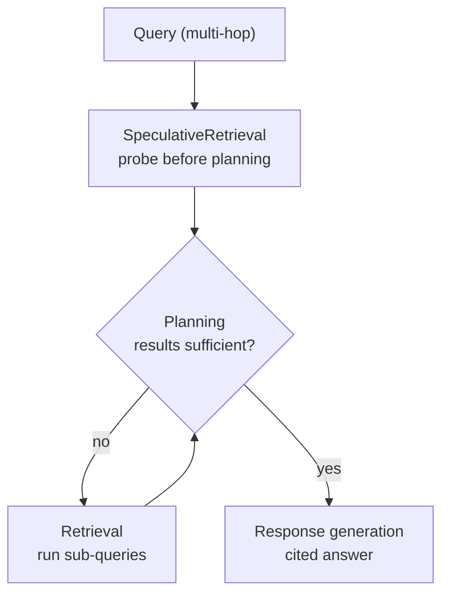

## Introduction

On 2026-06-17, AWS announced the [general availability of Amazon Bedrock Managed Knowledge Base](https://aws.amazon.com/about-aws/whats-new/2026/06/amazon-bedrock-managed-knowledge-base/) — a fully managed way to build production-grade RAG without managing a vector database, ingestion pipeline, or retrieval infrastructure.

Where the older Customer-managed Knowledge Base requires you to provision and operate your own vector store (such as OpenSearch Serverless), Managed KB handles embeddings, re-ranking, and the foundation model with service-managed defaults. Three things stand out: six native connectors (S3, SharePoint, Confluence, Web Crawler, Google Drive, OneDrive), Smart Parsing, and the headline differentiator — the **Agentic Retriever (`AgenticRetrieveStream` API)**. Per the docs, it decomposes a complex query into sub-queries, retrieves iteratively while evaluating sufficiency, and synthesizes an answer (we check the actual behavior in Verification 2).

**This article shares the results of building a Managed KB in the Tokyo region (ap-northeast-1) with zero vector-DB provisioning, then running the same multi-hop question through both single-pass `Retrieve` and agentic retrieval.** The headline finding: the biggest lever on multi-hop accuracy was not query decomposition itself, but **whether the managed reranker was on or off**. See the official docs at [Build a managed knowledge base](https://docs.aws.amazon.com/bedrock/latest/userguide/kb-build-managed.html) and [Use agentic retrieval to query a knowledge base](https://docs.aws.amazon.com/bedrock/latest/userguide/kb-test-agentic-retrieve.html).

## Test environment

| Item | Value |
| --- | --- |
| Region | ap-northeast-1 (Tokyo) |
| KB type | MANAGED (managed embedding, default) |
| Data source | Amazon S3 connector + Smart Parsing |
| SDK | **boto3 1.43.33** |
| Corpus | 3 Japanese plain-text documents |

There is a gotcha up front. The pre-installed AWS CLI 2.34.30 / boto3 1.42.80 did not expose `MANAGED` in the `CreateKnowledgeBase` `type` enum (only `VECTOR / KENDRA / SQL`), and `bedrock-agent-runtime` had no `AgenticRetrieveStream`. Since this is a brand-new GA API, **upgrading the SDK to the 1.43.x line is effectively a prerequisite**. I ran the verification with boto3 1.43.33 in a venv.

The corpus is three synthetic documents designed so the ground truth is known and only resolvable by combining all three:

- `01-org.txt` (org chart): the ML platform team lead is **Hanako Tanaka**
- `02-budget.txt` (budget): the ML platform team's annual budget is **12,000,000 JPY**
- `03-policy.txt` (expense policy): annual prepayment needs the **team lead's approval**, capped at **50% of the budget**

The question "to prepay the ML platform budget annually, whose approval is needed and what is the cap?" only resolves to "Hanako Tanaka's approval, capped at 6,000,000 JPY" by crossing all three documents. If you only want the findings, skip to [Verification 2](#verification-2-single-pass-retrieve-vs-agentic-retrieval).

<details className="my-4 rounded-lg border border-border bg-muted/30 p-4">
<summary className="cursor-pointer font-medium">The three corpus documents (full text, copy to reproduce)</summary>

Place these three files under a `corpus/` directory. The approver, amount, and policy are deliberately split across files to force a multi-hop lookup. The documents are in Japanese (the corpus the KB was built from).

```text title="corpus/01-org.txt"
社内組織ハンドブック（2026年度版）

# 技術部門のチーム編成

## ML プラットフォームチーム
ML プラットフォームチームは、社内の機械学習基盤の構築と運用を担当する。
ML プラットフォームチームの責任者は田中花子（たなか はなこ）である。
田中は予算承認および契約に関する最終決裁権を持つ。

## データ基盤チーム
データ基盤チームの責任者は鈴木一郎（すずき いちろう）である。

各チームの責任者は、自チームの予算の範囲内で契約・支払い方法を承認する権限を持つ。
```

```text title="corpus/02-budget.txt"
2026年度 クラウドインフラ予算計画書

# チーム別 年間予算

| チーム | 2026年度 クラウドインフラ予算（年額） |
| --- | --- |
| ML プラットフォームチーム | 1,200万円 |
| データ基盤チーム | 800万円 |

ML プラットフォームチームの予算1,200万円には、GPU 学習クラスタの利用料および
推論エンドポイントの運用費が含まれる。
```

```text title="corpus/03-policy.txt"
経費規程（支払い・前払いに関する規定）

# 第3章 年間契約の前払い

## 第12条（前払いの承認）
クラウドサービス等の年間契約を前払い（一括前払い）で行う場合は、
当該費用を負担するチームの責任者の承認を得なければならない。

## 第13条（前払いの上限）
年間契約の前払いに充てることができる金額は、当該チームに割り当てられた
年間予算の50%を上限とする。
```

</details>

<details className="my-4 rounded-lg border border-border bg-muted/30 p-4">
<summary className="cursor-pointer font-medium">Full setup (variables, venv, S3, IAM, KB, ingestion — reproduce from scratch)</summary>

```bash title="Terminal (variables and venv)"
REGION=ap-northeast-1
ACCOUNT=$(aws sts get-caller-identity --query Account --output text)
BUCKET=bedrock-mkb-verify-$ACCOUNT
ROLE=bedrock-mkb-verify-role

# A freshly GA'd API needs boto3 1.43.x+ (system 1.42.x lacks MANAGED type / AgenticRetrieveStream)
python3 -m venv kbverify-venv && . kbverify-venv/bin/activate
pip install -q boto3==1.43.33
```

```bash title="Terminal (S3)"
aws s3api create-bucket --bucket $BUCKET \
  --create-bucket-configuration LocationConstraint=$REGION --region $REGION
aws s3 sync ./corpus/ s3://$BUCKET/corpus/
```

The service role lets Bedrock assume it and grants read access to the bucket (scoped with `aws:SourceAccount` / `aws:SourceArn`).

```bash title="Terminal (IAM)"
cat > trust.json <<JSON
{ "Version":"2012-10-17","Statement":[{"Effect":"Allow",
  "Principal":{"Service":"bedrock.amazonaws.com"},"Action":"sts:AssumeRole",
  "Condition":{"StringEquals":{"aws:SourceAccount":"$ACCOUNT"},
    "ArnLike":{"aws:SourceArn":"arn:aws:bedrock:$REGION:$ACCOUNT:knowledge-base/*"}}}]}
JSON
cat > perms.json <<JSON
{ "Version":"2012-10-17","Statement":[
  {"Effect":"Allow","Action":["s3:ListBucket"],"Resource":["arn:aws:s3:::$BUCKET"]},
  {"Effect":"Allow","Action":["s3:GetObject"],"Resource":["arn:aws:s3:::$BUCKET/*"]},
  {"Effect":"Allow","Action":["bedrock:ListFoundationModels","bedrock:InvokeModel"],"Resource":"*"}]}
JSON
aws iam create-role --role-name $ROLE --assume-role-policy-document file://trust.json
aws iam put-role-policy --role-name $ROLE --policy-name mkb-verify-perms \
  --policy-document file://perms.json
```

The above is the KB service role. Separately, the IAM principal that calls `AgenticRetrieveStream` needs `bedrock:AgenticRetrieveStream` / `bedrock:Retrieve` / `bedrock:InvokeModelWithResponseStream` (I ran the verification with admin credentials).

Create the KB, data source, and ingestion with boto3, polling until `ACTIVE` / `COMPLETE`.

```python title="Python (setup.py)"
import boto3, time
REGION = "ap-northeast-1"
ACCOUNT = boto3.client("sts").get_caller_identity()["Account"]
BUCKET = f"bedrock-mkb-verify-{ACCOUNT}"
ROLE_ARN = f"arn:aws:iam::{ACCOUNT}:role/bedrock-mkb-verify-role"
ba = boto3.client("bedrock-agent", REGION)

kb = ba.create_knowledge_base(
    name="mkb-verify-tokyo", roleArn=ROLE_ARN,
    knowledgeBaseConfiguration={
        "type": "MANAGED",
        "managedKnowledgeBaseConfiguration": {"embeddingModelType": "MANAGED"},
    },
)
kb_id = kb["knowledgeBase"]["knowledgeBaseId"]
while ba.get_knowledge_base(knowledgeBaseId=kb_id)["knowledgeBase"]["status"] != "ACTIVE":
    time.sleep(5)

ds = ba.create_data_source(
    name="s3-corpus", knowledgeBaseId=kb_id, dataDeletionPolicy="DELETE",
    dataSourceConfiguration={
        "type": "MANAGED_KNOWLEDGE_BASE_CONNECTOR",
        "managedKnowledgeBaseConnectorConfiguration": {
            "connectorParameters": {
                "type": "S3", "version": "1",
                "connectionConfiguration": {"bucketName": BUCKET, "bucketOwnerAccountId": ACCOUNT},
                "deletionProtectionConfiguration": {"enableDeletionProtection": False},
            }
        },
    },
    vectorIngestionConfiguration={"parsingConfiguration": {"parsingStrategy": "SMART_PARSING"}},
)
ds_id = ds["dataSource"]["dataSourceId"]

job = ba.start_ingestion_job(knowledgeBaseId=kb_id, dataSourceId=ds_id)["ingestionJob"]["ingestionJobId"]
while True:
    j = ba.get_ingestion_job(knowledgeBaseId=kb_id, dataSourceId=ds_id, ingestionJobId=job)["ingestionJob"]
    if j["status"] in ("COMPLETE", "FAILED"):
        print(j["status"], j.get("statistics"))
        break
    time.sleep(5)
print("KB_ID =", kb_id, " DS_ID =", ds_id)
```

</details>

## Verification 1: zero-infra KB build and ingestion

I timed everything from KB creation through ingestion.

| Step | Duration | Result |
| --- | --- | --- |
| KB creation (CREATING → ACTIVE) | **64.4 s** | — |
| Data source creation + ingestion (3 docs) | **160.0 s** | 3 scanned / 3 indexed / 0 failed |

The striking part: there was **no vector-store provisioning step at all**. A Customer-managed KB would require creating an OpenSearch Serverless collection, defining an index, and configuring scaling. With Managed KB you just set `type: MANAGED` — you don't even pick an embedding model (managed default). The only calls I issued were "create KB → create data source → start ingestion," and I never once thought about a vector DB. "Zero infrastructure" is not an exaggeration.

Note that this corpus is plain text, so I deliberately left Smart Parsing's real strength — multimodal parsing (PDF, images, audio, video) — out of scope. This article focuses on **retrieval behavior** after ingestion.

## Verification 2: single-pass Retrieve vs agentic retrieval

Against the same KB, I sent the same multi-hop question — "**to prepay the ML platform budget annually, whose approval is needed and what is the cap?**" — two ways. Answering it requires crossing three documents: the approver (org chart), the budget amount (budget table), and the cap rule (policy). First, single-pass `Retrieve`, comparing the managed reranker on and off.

```python title="Python"
ar = boto3.client("bedrock-agent-runtime", "ap-northeast-1")
r = ar.retrieve(
    knowledgeBaseId=kb_id,
    retrievalQuery={"text": QUERY},
    retrievalConfiguration={"managedSearchConfiguration": {
        "numberOfResults": 10, "rerankingModelType": "NONE",  # or "MANAGED"
    }},
)
```

The contrast was sharp. With `rerankingModelType=NONE`, all six chunks across three documents came back; with `MANAGED`, it **collapsed to the single top chunk (the policy document only)**.

```text title="Output"
rerank=NONE   : 6 chunks  → 01-org.txt, 02-budget.txt, 03-policy.txt
rerank=MANAGED: 1 chunk   → 03-policy.txt only
```

The observed fact is clear-cut: even with `numberOfResults=10`, MANAGED returned one chunk while NONE returned six. The rest is inference — the managed reranker appears to keep only a relevant few, which likely suits pinpoint single-fact lookups but, for multi-hop questions, **drops the supporting documents** (the approver in the org chart, the amount in the budget). What is certain is that `Retrieve` only returns chunks without synthesizing an answer, so with the reranker on there is no way to answer a multi-hop question downstream.

Next, agentic retrieval. `AgenticRetrieveStream` returns an event stream, so you can observe each internal step via traces. I set `maxAgentIteration` to 5 to leave room to explore (too low cuts iterations short and can hurt accuracy on complex questions).

```python title="Python"
resp = ar.agentic_retrieve_stream(
    messages=[{"role": "user", "content": {"text": QUERY}}],
    retrievers=[{"configuration": {"knowledgeBase": {"knowledgeBaseId": kb_id}}}],
    agenticRetrieveConfiguration={
        "foundationModelType": "MANAGED",
        "rerankingModelType": "NONE",   # toggled in the test
        "maxAgentIteration": 5,
    },
    generateResponse=True,
)
for ev in resp["stream"]:
    if "traceEvent" in ev:
        a = ev["traceEvent"]["attributes"]
        print(a["step"], a["status"], a["message"])
    elif "responseEvent" in ev:
        print(ev["responseEvent"]["text"], end="")  # answer streams incrementally
```

The trace messages come back in English. With rerank=NONE it finished on speculative retrieval and planning alone.

```text title="Output (rerank=NONE)"
SpeculativeRetrieval IN_PROGRESS  Starting speculative retrieval for query: ML プラットフォーム...
SpeculativeRetrieval SUCCEEDED    Speculative retrieval completed successfully
Planning             IN_PROGRESS  Agent planning started
Planning             SUCCEEDED    Agent planning completed
```

Traces flow as `SpeculativeRetrieval` (a probe that runs before planning) → `Planning` (decompose the query and evaluate sufficiency) → optional `Retrieval` (run sub-queries) → response generation.



Toggling `rerankingModelType` changed the behavior clearly.

- **rerank=NONE**: the trace showed `Planning=2 / Retrieval=0` and the final results spanned all three documents; the answer was **fully correct** — approver "Hanako Tanaka", budget "12,000,000 JPY", cap "6,000,000 JPY (12M × 50%)" (facts). Reading into it: speculative retrieval alone gathered all three docs, so no extra `Retrieval` was needed (interpretation).
- **rerank=MANAGED**: the trace showed `Planning=4 / Retrieval=2` and the final results spanned two documents (budget, policy); the answer recovered the amounts but **missed the approver's name** (facts). The direct cause is that the org chart was absent from the final results — presumably the reranker kept filtering it out (interpretation).

The value of agentic retrieval is that it **synthesizes a cited, natural-language answer** (not just chunks) and adapts by running more retrieval when the probe falls short. Even so, when the reranker over-narrows the context, it cannot fully recover.

<details className="my-4 rounded-lg border border-border bg-muted/30 p-4">
<summary className="cursor-pointer font-medium">Full measurement script (Retrieve and AgenticRetrieveStream, with trace counting)</summary>

Replace `kb_id` with the value from the setup output. The numbers in the comparison table come from this script's output.

```python title="Python (measure.py)"
import boto3, time
REGION, kb_id = "ap-northeast-1", "<your-kb-id>"
ar = boto3.client("bedrock-agent-runtime", REGION)
QUERY = ("ML プラットフォームチームのクラウドインフラ予算を年間前払いする場合、"
         "誰の承認が必要で、前払いできる上限金額は具体的に何円か？")

# --- single-pass Retrieve (reranker toggled) ---
for rr in ["NONE", "MANAGED"]:
    t = time.time()
    r = ar.retrieve(knowledgeBaseId=kb_id, retrievalQuery={"text": QUERY},
        retrievalConfiguration={"managedSearchConfiguration":
            {"numberOfResults": 10, "rerankingModelType": rr}})
    docs = {x["location"]["s3Location"]["uri"].split("/")[-1] for x in r["retrievalResults"]}
    print(f"Retrieve {rr}: {time.time()-t:.2f}s chunks={len(r['retrievalResults'])} docs={sorted(docs)}")

# --- AgenticRetrieveStream (reranker toggled, trace counting) ---
for rr in ["MANAGED", "NONE"]:
    t = time.time(); steps = []; ans = []; final = None
    resp = ar.agentic_retrieve_stream(
        messages=[{"role": "user", "content": {"text": QUERY}}],
        retrievers=[{"configuration": {"knowledgeBase":
            {"knowledgeBaseId": kb_id, "retrievalOverrides": {"maxNumberOfResults": 10}}}}],
        agenticRetrieveConfiguration={"foundationModelType": "MANAGED",
            "rerankingModelType": rr, "maxAgentIteration": 5}, generateResponse=True)
    for ev in resp["stream"]:
        if "traceEvent" in ev: steps.append(ev["traceEvent"]["attributes"]["step"])
        elif "responseEvent" in ev: ans.append(ev["responseEvent"]["text"])
        elif "result" in ev: final = ev["result"]
    docs = {r["metadata"].get("_document_title") for r in final["results"]} if final else set()
    print(f"Agentic {rr}: {time.time()-t:.2f}s Planning={steps.count('Planning')} "
          f"Retrieval={steps.count('Retrieval')} Speculative={steps.count('SpeculativeRetrieval')} "
          f"docs={sorted(docs)}")
    print("".join(ans))
```

</details>

## Comparison: Retrieve vs AgenticRetrieveStream

Representative values, stable across repeated runs.

| Dimension | Retrieve(NONE) | Retrieve(MANAGED) | Agentic(MANAGED) | Agentic(NONE) |
| --- | --- | --- | --- | --- |
| Latency | ~0.5s | ~0.5s | ~8.5–9.8s | ~7.5–7.9s |
| Docs retrieved | 3 | 1 | 2 | 3 |
| Agent steps (Planning/Retrieval) | none | none | Planning4 / Retrieval2 | Planning2 / Retrieval0 |
| Answer generation | none (chunks) | none | yes (4 citations) | yes (4 citations) |
| Multi-hop correctness | raw material only | impossible | 3/4 (approver missing) | **4/4 fully correct** |

Agentic retrieval is roughly 15× the latency of single-pass `Retrieve` (measured) — it calls the foundation model multiple times for planning, evaluation, and generation. I did not measure cost in dollars, but Managed KB pricing is on-demand across two dimensions (indexed data stored and number of retrievals), and agentic retrieval layers the model-invocation cost of planning, evaluation, and generation on top — so cost should rise with the number of FM invocations. The trade-off is "fast and cheap but no answer assembly" (`Retrieve`) versus "slow and pricier but cited, synthesized answers" (agentic).

## Summary

- **In this verification, the biggest lever on multi-hop accuracy was the reranker on/off** — the managed reranker narrows to a relevant few, so it tends to drop cross-document context on multi-hop questions. For the multi-hop question tested, keeping `rerankingModelType=NONE` gave higher accuracy (its strengths on single-fact lookups would need separate testing).
- **Agentic retrieval is really about synthesis and adaptive follow-up** — `Retrieve` just returns chunks; agentic retrieval generates a cited answer and adds sub-queries when the probe is insufficient. But it cannot fully recover if the reranker over-narrows.
- **Traces give the behavior accountability** — you can see `SpeculativeRetrieval → Planning → Retrieval → generation` and where it stopped early. When an answer is incomplete, you can verify after the fact which document it missed.
- **Zero infrastructure is real, but a current SDK is a prerequisite** — no vector DB at all, and the KB builds in minutes. Yet a freshly GA'd API needs boto3 1.43.x or newer to call.

## Cleanup

<details className="my-4 rounded-lg border border-border bg-muted/30 p-4">
<summary className="cursor-pointer font-medium">Resource deletion commands (reverse creation order)</summary>

```bash title="Terminal"
# KB (deletes its data sources) → S3 → IAM
aws bedrock-agent delete-knowledge-base --knowledge-base-id "$KB_ID" --region ap-northeast-1
aws s3 rm s3://bedrock-mkb-verify-$ACCOUNT/ --recursive
aws s3api delete-bucket --bucket bedrock-mkb-verify-$ACCOUNT --region ap-northeast-1
aws iam delete-role-policy --role-name bedrock-mkb-verify-role --policy-name mkb-verify-perms
aws iam delete-role --role-name bedrock-mkb-verify-role
```

</details>
