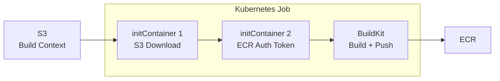

## Introduction

The [main series](/en/blog/2026/03/23/agentic-ai-on-eks-workshop) used Kaniko for container builds on EKS. It was convenient — no Docker daemon needed, runs as a Kubernetes Job, and pushes to ECR via Pod Identity.

But Kaniko was archived in June 2025. Google stopped maintaining it and the repository is now read-only (Chainguard has forked and continues maintenance). The emerging successor is [BuildKit](https://github.com/moby/buildkit), developed by the Docker/Moby project.

This post replaces the Kaniko builds from the main series with BuildKit and shares the results of validating it on EKS Auto Mode. It assumes the [Part 1](/en/blog/2026/03/23/agentic-ai-on-eks-workshop) prerequisites (repository clone, ECR, S3, Pod Identity) are already in place.

## Kaniko vs BuildKit

| | Kaniko | BuildKit |
|---|---|---|
| Maintenance | Archived (June 2025) | Active (Docker/Moby) |
| Build context | Direct S3 fetch | Local filesystem only |
| ECR auth | Auto via Pod Identity | `docker-credential-ecr-login` or manual token |
| Security model | Unprivileged | Rootless (kernel requirements) or privileged |
| Caching | Layer cache (limited) | Registry cache, inline cache |
| Multi-platform | No | Yes |
| Secret management | Limited | `--secret` flag for secure injection |

Kaniko's biggest advantage was its single-container setup: fetch context from S3, authenticate via Pod Identity, build, and push — all in one container. BuildKit requires `initContainers` to replicate this workflow.

## The Rootless Wall on EKS Auto Mode

BuildKit's official documentation [recommends rootless mode](https://crazymax.dev/buildkit/user-guides/rootless-mode/). It runs as a non-root user and works as a Kubernetes Job with `--oci-worker-no-process-sandbox` and `seccompProfile: Unconfined`.

However, running a rootless Job on EKS Auto Mode fails with this error:

```text title="Output"
[rootlesskit:parent] /proc/sys/user/max_user_namespaces needs to be set to non-zero.
[rootlesskit:parent] error: failed to start the child: fork/exec /proc/self/exe: no space left on device
```

Rootless mode uses [RootlessKit](https://github.com/rootless-containers/rootlesskit/) internally, which requires Linux user namespaces. BuildKit's documentation [notes](https://crazymax.dev/buildkit/user-guides/rootless-mode/#rhelcentos-7) that `user.max_user_namespaces` must be configured on certain distributions. EKS Auto Mode nodes are AWS-managed EC2 instances where kernel parameters cannot be modified. With `max_user_namespaces` set to zero, rootless mode doesn't work.

**The solution is privileged mode.** In privileged mode, omit `BUILDKITD_FLAGS` (since `--oci-worker-no-process-sandbox` is rootless-only) and set `securityContext.privileged: true`.

```yaml title="YAML"
securityContext:
  privileged: true
```

While Kaniko runs unprivileged, BuildKit on EKS Auto Mode requires privileged access. This is a security tradeoff to be aware of.

## Prerequisites

The main series created a `kaniko` ServiceAccount in the `build` namespace. BuildKit needs the same setup with a `buildkit` ServiceAccount.

<details className="my-4 rounded-lg border border-border bg-muted/30 p-4">
<summary className="cursor-pointer font-medium">BuildKit prerequisites (ServiceAccount, IAM, Pod Identity)</summary>

Same structure as Part 1's Kaniko setup — just change the ServiceAccount name to `buildkit`. The IAM policy files (`/tmp/pod-identity-trust.json`, `/tmp/kaniko-policy.json`) are from Part 1's prerequisites. Recreate them from Part 1 if your session has expired.

```bash title="Terminal"
# Kubernetes resources
kubectl create ns build
kubectl create serviceaccount buildkit -n build

# IAM role (ECR push + S3 read) — same policy as Kaniko
aws iam create-role --role-name buildkit-pod-role \
  --assume-role-policy-document file:///tmp/pod-identity-trust.json
aws iam put-role-policy --role-name buildkit-pod-role \
  --policy-name ecr-s3 --policy-document file:///tmp/kaniko-policy.json

# Pod Identity Association
BUILDKIT_ROLE_ARN=$(aws iam get-role --role-name buildkit-pod-role \
  --query 'Role.Arn' --output text)
aws eks create-pod-identity-association \
  --cluster-name $CLUSTER_NAME --region $AWS_REGION \
  --namespace build --service-account buildkit \
  --role-arn $BUILDKIT_ROLE_ARN
```

</details>

Uploading build context to S3 is the same as the main series.

```bash title="Terminal"
cd agents/weather/mcp-servers/weather-mcp-server
tar czf /tmp/weather-mcp-context.tar.gz .
aws s3 cp /tmp/weather-mcp-context.tar.gz s3://kaniko-build-${ACCOUNT_ID}/build/
```

## BuildKit Job Architecture

Kaniko's single-container design fetches context from S3 and authenticates to ECR via Pod Identity. BuildKit achieves this with a 3-stage pattern:



1. **initContainer 1 (fetch-context)** — Downloads build context from S3 into a shared Volume
2. **initContainer 2 (ecr-auth)** — Runs `aws ecr get-login-password` and generates `config.json`
3. **Main container (buildkit)** — Runs `buildctl-daemonless.sh` to build and push to ECR

### Full Job YAML

<details className="my-4 rounded-lg border border-border bg-muted/30 p-4">
<summary className="cursor-pointer font-medium">BuildKit Job YAML (Weather MCP Server example)</summary>

```yaml title="buildkit-weather-mcp.yaml"
apiVersion: batch/v1
kind: Job
metadata:
  name: buildkit-weather-mcp
  namespace: build
spec:
  backoffLimit: 1
  template:
    spec:
      serviceAccountName: buildkit
      restartPolicy: Never
      initContainers:
      - name: fetch-context
        image: amazon/aws-cli:latest
        command: ["sh", "-c"]
        args:
        - |
          yum install -y tar gzip >/dev/null 2>&1
          aws s3 cp s3://${S3_BUCKET}/build/weather-mcp-context.tar.gz /workspace/context.tar.gz
          tar xzf /workspace/context.tar.gz -C /workspace
          rm /workspace/context.tar.gz
        volumeMounts:
        - name: workspace
          mountPath: /workspace
      - name: ecr-auth
        image: amazon/aws-cli:latest
        command: ["sh", "-c"]
        args:
        - |
          TOKEN=$(aws ecr get-login-password --region ${AWS_REGION})
          mkdir -p /docker-config
          AUTH=$(echo -n "AWS:${TOKEN}" | base64 -w0)
          echo "{\"auths\":{\"${ECR_HOST}\":{\"auth\":\"${AUTH}\"}}}" > /docker-config/config.json
        volumeMounts:
        - name: docker-config
          mountPath: /docker-config
      containers:
      - name: buildkit
        image: moby/buildkit:latest
        env:
        - name: DOCKER_CONFIG
          value: /home/user/.docker
        command: ["buildctl-daemonless.sh"]
        args:
        - build
        - --frontend=dockerfile.v0
        - --local=context=/workspace
        - --local=dockerfile=/workspace
        - --output=type=image,name=${ECR_HOST}/agents-on-eks/weather-mcp:latest,push=true
        securityContext:
          privileged: true
        volumeMounts:
        - name: workspace
          mountPath: /workspace
          readOnly: true
        - name: docker-config
          mountPath: /home/user/.docker
          readOnly: true
        - name: buildkitd
          mountPath: /home/user/.local/share/buildkit
      volumes:
      - name: workspace
        emptyDir: {}
      - name: docker-config
        emptyDir: {}
      - name: buildkitd
        emptyDir: {}
```

</details>

Apply the YAML and wait for the build to complete.

```bash title="Terminal"
kubectl apply -f buildkit-weather-mcp.yaml
kubectl wait --for=condition=complete \
  job/buildkit-weather-mcp -n build --timeout=600s
```

### Comparing Job YAML with Kaniko

Kaniko's Job YAML is about 20 lines:

```yaml title="Kaniko (reference)"
containers:
- name: kaniko
  image: gcr.io/kaniko-project/executor:latest
  args:
  - "--context=s3://${S3_BUCKET}/build/context.tar.gz"
  - "--destination=${ECR_HOST}/agents-on-eks/weather-mcp:latest"
```

BuildKit with initContainers exceeds 50 lines. The overhead comes from handling S3 fetch and ECR auth manually. However, this architecture is more flexible — you can use git clone for context, inject secrets via `--secret`, or share cache across builds with PersistentVolumes.

### Gotchas

- The `amazon/aws-cli` image doesn't include `tar`. You need `yum install -y tar gzip`
- ECR auth tokens expire after 12 hours. Long-running builds may need token refresh
- The `buildkitd` Volume (`/home/user/.local/share/buildkit`) stores BuildKit cache and worker data. `emptyDir` works fine, but a PersistentVolume enables cache sharing across builds

## Verification

Images built with BuildKit were deployed using the same Helm charts from the main series (Weather MCP Server + Weather Agent).

<details className="my-4 rounded-lg border border-border bg-muted/30 p-4">
<summary className="cursor-pointer font-medium">Deploy steps (same as Part 1)</summary>

```bash title="Terminal"
helm upgrade weather-mcp manifests/helm/mcp \
  --install -n mcp-servers --create-namespace \
  --set image.repository=${ECR_HOST}/agents-on-eks/weather-mcp \
  --set image.tag=latest

helm upgrade weather-agent manifests/helm/agent \
  --install -n agents --create-namespace \
  -f manifests/helm/agent/mcp-remote.yaml \
  --set image.repository=${ECR_HOST}/agents-on-eks/weather-agent \
  --set image.tag=latest \
  --set env.DISABLE_AUTH=1 \
  --set env.SESSION_STORE_BUCKET_NAME=weather-agent-session-${ACCOUNT_ID} \
  --set serviceAccount.name=weather-agent \
  --set a2a.http_url=http://weather-agent.agents:9000/

kubectl rollout status deployment weather-mcp -n mcp-servers --timeout=180s
kubectl rollout status deployment weather-agent -n agents --timeout=180s
```

</details>

A curl test confirmed the weather forecast works correctly.

```text title="Output"
Here's the 3-day weather forecast for New York City:

**Today**
- Temperature: 61°F
- Conditions: Mostly cloudy with a chance of rain and slight chance of thunderstorms after 5pm
- Good for outdoor activities: Not ideal

**Tuesday**
- Temperature: 46°F
- Conditions: Sunny
- Good for outdoor activities: ✅ Good!

**Wednesday**
- Temperature: 53°F
- Conditions: Mostly cloudy
- Good for outdoor activities: ✅ Good
```

BuildKit-built images behave identically to Kaniko-built ones.

## Build Time Comparison

| Component | Kaniko | BuildKit | Difference |
|---|---|---|---|
| Weather MCP Server | ~2 min | 58s | **52% faster** |
| Weather Agent | ~3 min | 2m 14s | **25% faster** |
| Travel Agent | ~3 min | 2m 19s | **23% faster** |

BuildKit was faster across all components. The MCP Server (fewer dependencies) saw the most dramatic improvement at under half the time. BuildKit's concurrent stage execution and efficient layer caching likely contribute to the speedup.

## Takeaways

- **BuildKit rootless doesn't work on EKS Auto Mode** — `max_user_namespaces=0` prevents user namespace creation, requiring privileged mode. This is a security tradeoff compared to Kaniko's unprivileged execution.
- **3-stage initContainers pattern** — S3 download → ECR auth → build is more complex than Kaniko's single container, but enables flexible patterns like git clone and secret injection.
- **25-52% faster builds** — BuildKit's concurrent stage execution delivers measurable speedups. Registry caching could improve this further.

## Cleanup

In addition to the [Part 3 cleanup](/en/blog/2026/03/23/agent-ui-and-scaling-on-eks#cleanup), delete BuildKit-specific resources.

```bash title="Terminal"
# BuildKit-specific resources
kubectl delete jobs --all -n build
kubectl delete ns build

# BuildKit Pod Identity Association and IAM role
aws iam delete-role-policy --role-name buildkit-pod-role --policy-name ecr-s3
aws iam delete-role --role-name buildkit-pod-role
```
