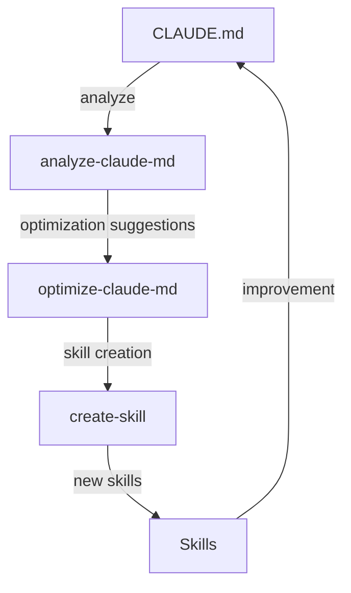

## Challenge

In my previous post, I shared how I [reduced my CLAUDE.md from 355 to 59 lines](/en/blog/2026/03/08/optimizing-claude-code-with-skills). But one challenge remained: How do we make this optimization process **reproducible** and **continuously improving**?

In the previous post, I solved the "CLAUDE.md bloat" problem manually, but as the project grows, the same problem will recur. Reviewing CLAUDE.md and manually extracting skills every time a new feature is added — that's not sustainable. So I decided to automate the optimization process itself. The answer was "**meta-skills**" — skills that manage other skills, enabling Claude Code to self-improve.

## What Are Meta-Skills?

Meta-skills are skills designed to manage and optimize other skills and CLAUDE.md itself. Like metaprogramming in software development, they **operate at a higher level of abstraction**.

While regular skills (`/post-guide`, `/fix-lint`, etc.) "execute specific tasks," meta-skills "create and optimize skills themselves." If metaprogramming is code that writes code, then meta-skills are skills that manage skills.



This cycle enables continuous improvement of Claude Code configuration. The key insight is that this cycle forms a **feedback loop**, not a one-way process. Creating new skills simplifies CLAUDE.md, and analyzing the simplified CLAUDE.md reveals the next improvement opportunities.

## Three Meta-Skills Implementation

I implemented three meta-skills, each with a distinct role. They work together in an "analyze → execute → create" pipeline. In the [previous post](/en/blog/2026/03/08/optimizing-claude-code-with-skills), I categorized skills into two types — "workflow" and "guidance" — based on their invocation behavior. Here, I introduce four purpose-based templates for skill creation.

### 1. `/analyze-claude-md` - Current State Analysis

The first meta-skill is for "understanding the current state." It reads the current CLAUDE.md, analyzes line count, section structure, and redundancies, then outputs optimization suggestions as a report. This skill doesn't have `disable-model-invocation` set — since it's read-only with no side effects, it's safe for Claude to run automatically:

```markdown
---
name: analyze-claude-md
description: Analyze CLAUDE.md and suggest optimizations
---

## Analysis Steps

1. Read current CLAUDE.md
2. Metrics to check
   - Total line count (target: <50-100)
   - Section breakdown
   - Redundancy with code/docs

3. Generate optimization report
   - Recommended extractions to skills
   - Recommended deletions
   - Priority actions
```

This skill outputs "suggestions," not "actions." It provides the data needed to make decisions, but actual changes happen in the next step after human review. This separation is the key to safety.

Execution produces a report like:

```markdown
## CLAUDE.md Analysis Report

### Current State

- Lines: 178
- Sections: 12
- Estimated reduction possible: 65%

### Recommended Extractions to Skills

1. **Testing & Validation** (45 lines)
   - Suggested skill: `/run-tests`
   - Reason: Detailed multi-step procedure

2. **Content Creation** (52 lines)
   - Suggested skill: `/post-guide`
   - Reason: Repeatable workflow
```

### 2. `/optimize-claude-md` - Execute Optimization

The second meta-skill actually modifies files based on analysis results. It extracts detailed procedures from CLAUDE.md, creates them as new skills, and updates CLAUDE.md. This automates the work I did manually in the previous post:

```markdown
---
name: optimize-claude-md
description: Optimize CLAUDE.md by moving detailed procedures to skills
disable-model-invocation: true
---

## Migration Process

1. Identify candidates for skills
   - Procedures with 5+ steps
   - Content taking 10+ lines
   - Tasks repeated 3+ times

2. Create skill structure
3. Extract content to skills
4. Update CLAUDE.md
```

This skill has **side effects** (file modifications), so `disable-model-invocation: true` is set. This is the key difference from `/analyze-claude-md` — analysis is safe to auto-run, but file modifications should only happen after human confirmation.

The thresholds defined here — "5+ steps," "10+ lines," "repeated 3+ times" — are heuristics derived from my previous optimization experience. They're not rigid rules, but they serve as useful starting points for decision-making.

### 3. `/create-skill` - Skill Creation

The third meta-skill creates new skills using standardized templates. When skills are created manually, directory structures and frontmatter conventions vary from person to person. This skill ensures consistent structure across the entire team:

```markdown
---
name: create-skill
description: Create a new Claude Code skill with proper structure
disable-model-invocation: true
---

## Skill Types and Templates

### 1. Workflow Skill (step-by-step procedures)

Examples: /post-guide, /fix-lint, /deploy

### 2. Diagnostic Skill (troubleshooting)

Examples: /debug-build, /analyze-performance

### 3. Knowledge Skill (domain information)

Examples: /api-conventions, /architecture

### 4. Validation Skill (checking and reporting)

Examples: /sync-i18n, /audit-security
```

The four-type classification exists to encourage thinking about "what type is this skill?" during creation. When the type is clear, the skill's scope is well-defined, preventing bloat. For instance, mixing diagnostic logic into a Workflow Skill makes it complex, but separating it as a Diagnostic Skill maintains single responsibility.

## Real-World Usage Examples

Here are concrete scenarios showing when each meta-skill comes into play.

### Case 1: Project Start Optimization

When inheriting a new project or when an existing project's CLAUDE.md has grown unwieldy. Start with analysis to understand the current state, then execute optimization. No need to manually read through 355 lines to make judgments:

```bash
# Analyze current state
/analyze-claude-md

# Output example:
# "Detected 178 lines. Testing section's 45 lines can be extracted to skill"

# Execute optimization
/optimize-claude-md

# Result:
# CLAUDE.md: 178 lines → 59 lines
# New skills created: 6
```

### Case 2: Creating Skills for New Features

When recurring procedures emerge — deployment steps, migration procedures, etc. Using `/create-skill` generates a properly structured skill instantly:

```bash
# Create deployment procedure skill
/create-skill deploy-production

# Skill created at:
# .claude/skills/deploy-production/SKILL.md

# Test execution
/deploy-production staging
```

### Case 3: Regular Maintenance

Left unchecked, CLAUDE.md will inevitably bloat again. Running analysis quarterly to check health and cleaning up unused skills — same philosophy as codebase refactoring:

```bash
# Quarterly optimization check
/analyze-claude-md

# Remove deprecated skills
rm -rf .claude/skills/deprecated-skill/

# Update documentation
/update-skills-readme
```

## Benefits of Meta-Skills

Stepping back, let's clarify the fundamental problem meta-skills solve. This isn't just about "having more convenient commands" — it's a **paradigm shift in CLAUDE.md management**.

### 1. **Standardization**

Teams can use the same process. New members can use `/create-skill` to create properly structured skills. No more "learn by copying a senior's skill files" — that tribal knowledge problem disappears.

### 2. **Automation**

No manual optimization needed. Running `/optimize-claude-md` applies best practices automatically. What took hours in my previous post now completes with a single command.

### 3. **Continuous Improvement**

Regular `/analyze-claude-md` execution prevents CLAUDE.md bloat and maintains optimal state. It's not a one-time optimization — it's a system that evolves alongside the project.

### 4. **Knowledge Accumulation**

Meta-skills themselves improve, accumulating organizational best practices. For example, adding team-specific best practices to `/create-skill`'s templates means all subsequently created skills inherit that knowledge.

## Potential Future Meta-Skills

Once the three core meta-skills are running smoothly, the next level of automation becomes visible. All of the following are designed to reduce the management overhead as skills multiply:

```markdown
/audit-skills         # Detect unused skills
/merge-skills        # Consolidate similar skills
/version-skills      # Skill version control
/share-skills        # Share skills across teams
/benchmark-claude-md # Measure optimization effects
```

## DevOps Parallels

If you're thinking "this is the same idea as DevOps," you're right. This approach applies the Infrastructure as Code philosophy to AI configuration management. Here's how they map:

| DevOps           | Claude Code Meta-Skills     |
| ---------------- | --------------------------- |
| Terraform        | `/optimize-claude-md`       |
| Ansible Playbook | `/create-skill`             |
| Monitoring       | `/analyze-claude-md`        |
| CI/CD            | Automated improvement cycle |

Just as Terraform declaratively defines the "desired state" of infrastructure, `/optimize-claude-md` optimizes toward the desired state of CLAUDE.md. Just as Ansible standardizes procedures through playbooks, `/create-skill` standardizes skill creation. Just as monitoring detects anomalies, `/analyze-claude-md` detects bloat.

## Implementation Tips

Here are four principles to keep in mind when building your own meta-skills. Unlike regular skills, meta-skills affect other files, so they require more careful design.

### Principles for Creating Meta-Skills

1. **Idempotency**: Same result regardless of execution count. Running `/optimize-claude-md` on an already-optimized CLAUDE.md should produce no unnecessary changes
2. **Verifiability**: Measurable effects before/after execution. Quantitative metrics like line count and section count should confirm improvements
3. **Safety**: Confirmation for destructive changes. Never forget the `disable-model-invocation: true` setting
4. **Documentation**: Clear execution records. Changes should be traceable after the fact

### Team Adoption

Meta-skills reach their full potential when shared across a team. Committing them to Git means every team member uses the same optimization process. Individual tweaks are isolated with the `.local/` suffix:

```bash
# Version control team meta-skills
git add .claude/skills/*-claude-md/
git add .claude/skills/create-skill/
git commit -m "feat: Add meta-skills for Claude Code management"

# Personal customization via local skills
mkdir .claude/skills/my-optimizer.local/
```

## Summary

- **Automate the problem-solving process, not just the problem** — Manually fixing CLAUDE.md bloat is a one-time improvement, but automating the process with meta-skills makes the improvement sustainable as the project grows.
- **Separate analysis from execution and control side effects** — `/analyze-claude-md` is read-only and safe to auto-run, while `/optimize-claude-md` uses `disable-model-invocation: true` to require human confirmation before execution. This separation is the key to safety.
- **Defining skill types keeps scope well-defined** — The four-type classification (Workflow / Diagnostic / Knowledge / Validation) clarifies what each skill should do, maintaining single responsibility and preventing bloat.

Next, I plan to write about leveraging these meta-skills team-wide to achieve organization-level productivity gains.

---

_Series articles:_

1. _[Maximizing AI Coding Assistants with CLAUDE.md](/en/blog/2026/03/07/claude-md-ai-coding-assistant-guide)_
2. _[How I Reduced My CLAUDE.md by 83% Using Claude Code's Skills System](/en/blog/2026/03/08/optimizing-claude-code-with-skills)_
3. _[Claude Code Meta-Skills: Creating a Self-Improving System with Skills that Manage Skills](/en/blog/2026/03/09/claude-code-meta-skills)_ (this article)
4. _[Scaling Claude Code Meta-Skills Across Teams: Maximizing AI-Assisted Development Productivity Organization-Wide](/en/blog/2026/03/10/claude-code-team-productivity)_
