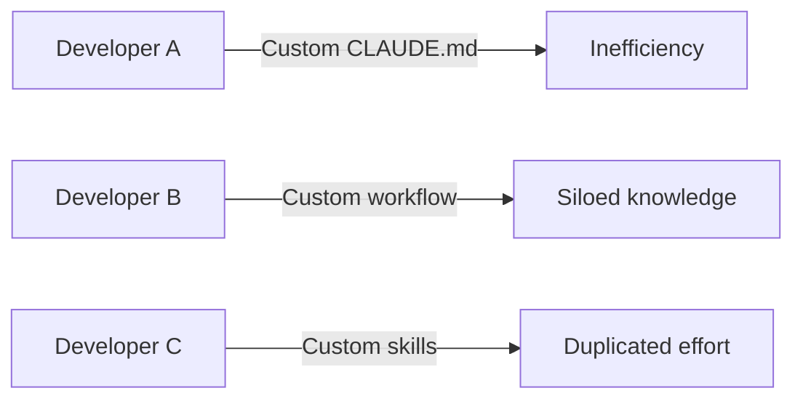
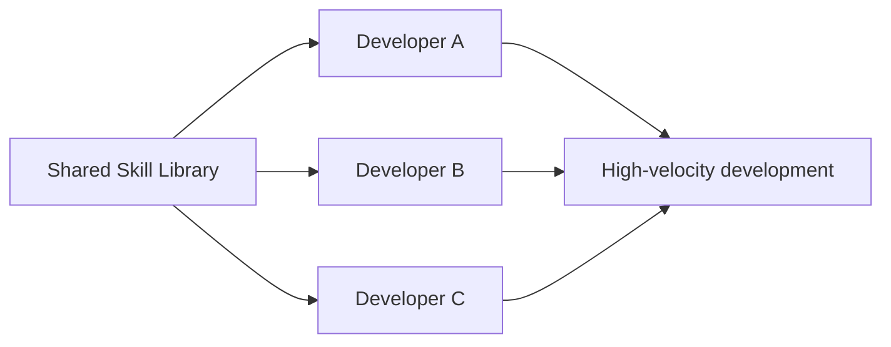
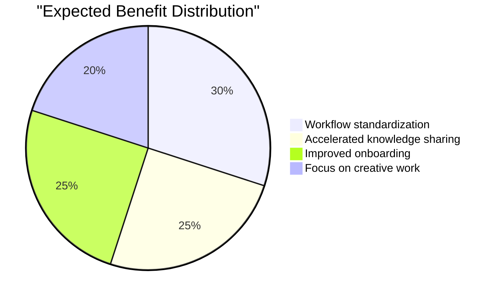
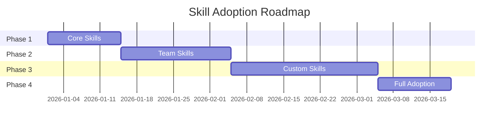

We've covered [optimizing CLAUDE.md](/en/blog/2026/03/08/optimizing-claude-code-with-skills) and [implementing meta-skills](/en/blog/2026/03/09/claude-code-meta-skills). In this final installment, I'll share our plan for leveraging these across an entire team to achieve organization-level productivity gains.

Based on the individual-level improvements we've seen, we're planning a rollout to a 20-person engineering team. Our targets are a **40% increase in development velocity** and a **60% reduction in code review time**.

## Why Team-Wide Deployment Matters

Optimizing Claude Code for an individual and optimizing it for an entire team are fundamentally different challenges. Individual optimization is as simple as "clean up your own CLAUDE.md." Team deployment, however, requires building a system where 20 people can all work at the same quality level.

In the [previous post](/en/blog/2026/03/09/claude-code-meta-skills), I drew parallels between meta-skills and DevOps' Infrastructure as Code. At the team level, this philosophy becomes even more critical. Instead of each person manually managing their own CLAUDE.md, managing and sharing skills as code elevates the entire team's baseline productivity.

## Challenges in Team Development

### Before: Without Meta-Skills



Currently, each developer has their own configuration and workflow, with no knowledge sharing:

- **CLAUDE.md duplication**: Everyone writing the same content independently
- **Reinventing the wheel**: Similar skills created in isolation
- **No best practices**: Efficient methods never shared
- **Slow onboarding**: New members left to figure things out alone

### After: Standardization Through Meta-Skills



By organizing meta-skills into a shared library, every developer starts from the same foundation. The key insight is that this isn't a "constraint"—it's a "platform." By layering team and individual customizations on top of a common set of core skills, we can achieve both standardization and flexibility.

## Three Steps to Organization-Wide Deployment

### Step 1: Build a Shared Skill Library

First, we'll build a skill library for use across the entire organization. The key design decision is separating `_core` (shared across all teams) from team-specific directories. Like scoped npm packages, organizing skills into namespaced categories prevents naming conflicts while improving discoverability:

```bash
# Monorepo structure
organization-skills/
├── .claude/
│   ├── skills/
│   │   ├── _core/           # Required skills for all teams
│   │   │   ├── optimize-claude-md/
│   │   │   ├── create-skill/
│   │   │   └── analyze-claude-md/
│   │   ├── frontend/        # Frontend team
│   │   ├── backend/         # Backend team
│   │   ├── devops/          # DevOps team
│   │   └── qa/              # QA team
│   └── templates/           # Skill templates
└── docs/                     # Documentation
```

### Step 2: Team-Specific Customization

Each team customizes skills for their specific needs. What's important here is that skills serve as a way to transform "tribal knowledge into documented knowledge." For example, a frontend team's component creation process typically lives only in a senior engineer's head. By codifying it as a skill, every team member can work at the same quality level:

#### Frontend Team

```markdown
# .claude/skills/frontend/create-component/SKILL.md

---

name: create-component
description: Create React component with team standards
disable-model-invocation: true

---

1. Component structure following team conventions
2. TypeScript interface definition
3. Storybook story creation
4. Unit test with Testing Library
5. Accessibility audit
```

#### Backend Team

```markdown
# .claude/skills/backend/create-api/SKILL.md

---

name: create-api
description: Create REST API endpoint with standards
disable-model-invocation: true

---

1. OpenAPI specification update
2. Controller implementation
3. Service layer logic
4. Database migration
5. Integration tests
6. Performance benchmarks
```

### Step 3: Continuous Improvement Process

Skills aren't "set and forget." Like code, they require ongoing maintenance. Unused skills, duplicate skills, and outdated skills accumulate over time and can cause more confusion than they solve. That's why we plan to establish a weekly process for improving and sharing skills:

```bash
# Weekly Friday improvement cycle
/analyze-team-skills        # Analyze skill usage across the team
/identify-duplicates        # Identify duplicate skills
/merge-similar-skills       # Consolidate similar skills
/share-best-practices       # Share best practices
```

## Implementation: Skill Sharing System

Sharing skills across teams requires a technical infrastructure. Here, we're designing a Git repository-based sharing system. The advantage is that it leverages existing Git workflows (PRs, reviews, merges), so there's no learning curve for a new tool.

### 1. Central Repository

```bash
# Set up central skill repository
git clone https://github.com/org/claude-skills-library
cd claude-skills-library

# Team branch strategy
git checkout -b team/frontend
git checkout -b team/backend
git checkout -b team/devops
```

### 2. Skill Sync Script

This script distributes skills from the central repository to individual projects. Core skills (`_core`) are force-distributed to all projects, while team-specific skills are selectively distributed based on the `$TEAM` environment variable. This ensures each project receives only the skills it needs:

```bash
#!/bin/bash
# sync-skills.sh

# Sync core skills to all projects
rsync -av organization-skills/.claude/skills/_core/ \
    ~/projects/*/.claude/skills/

# Selectively sync team-specific skills
if [ "$TEAM" = "frontend" ]; then
    rsync -av organization-skills/.claude/skills/frontend/ \
        ~/projects/*/.claude/skills/
fi
```

### 3. Skill Proposal System

A bottom-up growth mechanism is equally important. If skills are only pushed top-down, they risk missing real-world needs. The following workflow lets individuals propose skills to the organization, modeled after the open-source contribution process:

```markdown
# .claude/skills/propose-skill/SKILL.md

---

name: propose-skill
description: Propose a new skill to the organization
disable-model-invocation: true

---

1. Create skill in personal branch
2. Test skill with real scenarios
3. Document use cases and benefits
4. Submit PR to organization repository
5. Team review and feedback
6. Merge to appropriate category
```

## Measuring Results: KPIs and Impact

The most important aspect of team deployment is the ability to measure outcomes. If the benefit is just a vague feeling of "it seems useful," you can't make informed investment decisions for the organization. Below, we've set target values for team deployment based on individual-level results.

### Quantitative Targets (Hypotheses)

The figures below are **hypothetical targets based on individual experience, not measured data**. Only the CLAUDE.md line count reduction has been proven at the individual level — all other metrics can only be validated after team deployment. We plan to compare actual results against these targets post-rollout:

| Metric                        | Current        | Target         | Expected Improvement | Confidence |
| ----------------------------- | -------------- | -------------- | -------------------- | ---------- |
| Average CLAUDE.md line count  | 250 lines      | 45 lines       | **82% reduction**    | Proven     |
| New feature development speed | 5 days/feature | 3 days/feature | **40% faster**       | Hypothesis |
| Code review time              | 2 hours/PR     | 48 min/PR      | **60% reduction**    | Hypothesis |
| Bug rate                      | 12/week        | 5/week         | **58% reduction**    | Hypothesis |
| Onboarding period             | 3 weeks        | 1 week         | **66% shorter**      | Hypothesis |

### Expected Qualitative Benefits



Expected benefits:

- Repetitive tasks are automated, freeing developers to focus on creative work
- Best practices shared across teams, accelerating learning
- New hires become productive almost immediately

## Planned Case: Large-Scale Migration

Meta-skills truly shine in scenarios that involve "repeating the same task at scale." Large-scale migrations are the textbook example—this is where skill standardization should deliver the greatest impact.

### Background

We have an upcoming major upgrade from React 17 to 18 (200+ components) where we plan to leverage meta-skills. Historically, migrations like this suffered from inconsistent approaches across developers, leading to uneven quality.

### Approach

We'll create a migration-specific skill so all developers follow the same procedure. Because each step is explicitly documented, even developers who aren't deeply familiar with React's internal changes can safely execute the migration:

```markdown
# .claude/skills/react18-migration/SKILL.md

---

name: react18-migration
description: Migrate components from React 17 to 18
disable-model-invocation: true

---

1. Analyze component for React 18 compatibility
2. Update Suspense boundaries
3. Migrate to new APIs (startTransition, etc.)
4. Update tests for concurrent features
5. Performance profiling
6. Document breaking changes
```

### Expected Outcomes

- **Timeline**: Traditional estimate 6 weeks → Target 2 weeks
- **Quality**: Expecting significant bug reduction through skill standardization
- **Efficiency**: 20 developers working in parallel, unified approach through skills

In traditional migrations, each developer reads the documentation, interprets it their own way, and works accordingly. Skills reduce the "room for interpretation," ensuring consistent quality. This is particularly effective when team members have varying levels of experience.

## Best Practices for Team Adoption

Here, we'll outline the key considerations for adoption. Technical infrastructure alone isn't enough—organizational processes and governance are equally important.

### 1. Phased Rollout

Introducing all skills at once creates confusion. The plan is to start with core skills (meta-level skills like CLAUDE.md optimization and skill creation), let the team get comfortable with using skills themselves, and then gradually add domain-specific skills:



### 2. Governance Structure

As skills proliferate, questions arise: "Who's responsible for this?" and "What if someone changes it without notice?" Just like code reviews, skills need a review process to maintain quality:

```yaml
# skill-governance.yml
roles:
  skill-owner:
    - Review and approve new skills
    - Maintain quality standards
    - Resolve conflicts

  skill-contributor:
    - Propose new skills
    - Update existing skills
    - Share use cases

process:
  proposal: Pull Request
  review: 2+ approvals required
  merge: Skill owner approval
  deprecation: 30-day notice period
```

### 3. Training Program

Deploying a tool without teaching people how to use it is pointless. We're designing tiered training so everyone can progressively adopt skills. Level 1 is mandatory for all team members—building a shared understanding of "what skills are" is the top priority:

```markdown
## Claude Code Skills Training

### Level 1: Basic (Required for all)

- How to use /optimize-claude-md
- Running basic skills
- Understanding CLAUDE.md

### Level 2: Intermediate (Developers)

- Creating skills with /create-skill
- Customizing team skills
- Leveraging meta-skills

### Level 3: Advanced (Lead developers)

- Skill architecture design
- Performance optimization
- Organization-wide deployment
```

## Pitfalls and Solutions

Every system encounters unexpected problems during operation. The following are challenges we anticipate based on individual experience and common patterns in team development. By thinking through these in advance, we can respond quickly when issues arise.

### Problem 1: Skill Sprawl

The flip side of enabling bottom-up skill creation is the risk of similar skills proliferating. It's the same problem as npm package sprawl.

**Solution**: Regular auditing and consolidation

```bash
# Quarterly skill audit
/audit-all-skills
/find-duplicate-skills
/merge-redundant-skills
/deprecate-unused-skills
```

### Problem 2: Version Management Complexity

Since skill updates affect the entire team, it's essential to track "when and what changed."

**Solution**: Semantic versioning

```markdown
# Skill version management

skills/
├── create-api@1.0.0/ # Stable release
├── create-api@2.0.0-beta/ # Beta release
└── create-api@deprecated/ # Scheduled for removal
```

### Problem 3: Cross-Team Inconsistency

When skill versions drift between projects, you end up with the same skill name producing different behavior—a recipe for confusion.

**Solution**: Enforced core skills with regular syncing

```bash
# Daily sync job
0 9 * * * /usr/local/bin/sync-core-skills.sh
```

## Future Outlook

### The Future of AI-Native Development

Beyond a successful team deployment, there's potential for even more advanced automation. The next-generation features we're envisioning would delegate skill management itself to AI:

```markdown
/skill-ai-suggest # AI suggests needed skills based on context
/skill-auto-create # Automatically generate skills from repeated patterns
/skill-performance # Performance analysis of skill execution
/skill-marketplace # Share skills beyond organizational boundaries
```

### Metrics-Driven Improvement

Longer-term, we envision programmatically analyzing skill usage to automate the improvement cycle. Knowing quantitatively which skills are most used and how much time they save enables more accurate ROI assessments:

```python
# skill_analytics.py
def analyze_skill_usage():
    """Analyze skill usage patterns"""
    return {
        "most_used": get_top_skills(10),
        "time_saved": calculate_time_savings(),
        "error_reduction": measure_error_rates(),
        "roi": calculate_return_on_investment()
    }
```

## Summary: Key Success Factors for Organizational AI Adoption

Looking back at this entire plan, it becomes clear that it's really just an extension of good software development practices. Code reviews, CI/CD, documentation—we're simply applying those same principles to managing AI configuration.

Key success factors to prioritize when deploying Claude Code meta-skills across teams:

1. **Balance standardization with flexibility**
   - Standardize through core skills
   - Allow flexibility through team skills

2. **Foster a culture of continuous improvement**
   - Weekly improvement cycles
   - Data-driven decision making

3. **Build knowledge-sharing mechanisms**
   - Central repository
   - Documented best practices

4. **Adopt incrementally**
   - Start small and scale gradually
   - Share success stories

5. **Measure and visualize**
   - Set and track KPIs
   - Share results regularly

By combining these elements, we believe individual productivity gains can be transformed into organization-wide competitive advantages.

AI-assisted development is no longer just a personal tool—it has the potential to become a strategic organizational asset. A systematic approach using meta-skills can maximize its value. We'll share the actual results once the rollout is underway.

---

_Series articles:_

1. _[Maximizing AI Coding Assistants with CLAUDE.md](/en/blog/2026/03/07/claude-md-ai-coding-assistant-guide)_
2. _[How I Reduced My CLAUDE.md by 83% Using Claude Code's Skills System](/en/blog/2026/03/08/optimizing-claude-code-with-skills)_
3. _[Claude Code Meta-Skills: Creating a Self-Improving System with Skills that Manage Skills](/en/blog/2026/03/09/claude-code-meta-skills)_
4. _[Scaling Claude Code Meta-Skills Across Teams: Maximizing AI-Assisted Development Productivity Organization-Wide](/en/blog/2026/03/10/claude-code-team-productivity)_ (this article)
