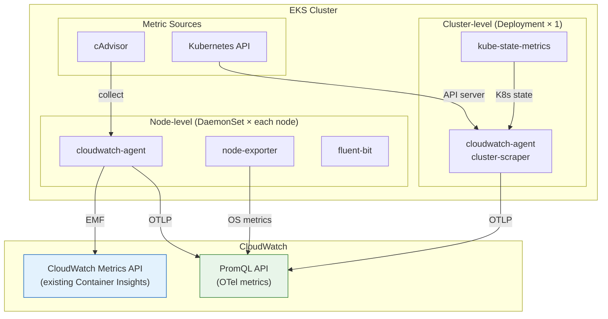

## Introduction

On April 2, 2026, AWS [announced Container Insights with OpenTelemetry metrics for Amazon EKS (Preview)](https://aws.amazon.com/about-aws/whats-new/2026/04/cloudwatch-otel-container-insights-eks/).

Existing Container Insights (enhanced) provides pre-aggregated metrics in CloudWatch's proprietary format with 4-5 fixed dimensions. OTel Container Insights sends open-source metrics from cAdvisor, Node Exporter, and Kube State Metrics via OTLP, enriching each metric with up to 150 labels and enabling query-time aggregation through PromQL.

| Aspect | Container Insights (enhanced) | OTel Container Insights |
|---|---|---|
| Metric names | CloudWatch-specific (`pod_cpu_utilization`) | Open-source native (`container_cpu_usage_seconds_total`) |
| Labels/Dimensions | 4-5 | Up to 150 |
| Aggregation | Pre-aggregated (cluster/namespace/pod) | Query-time (PromQL) |
| Query language | CloudWatch Metrics API | PromQL |
| Custom K8s labels | None | Pod/node labels auto-attached |
| Ingestion protocol | CloudWatch Logs (EMF) | OTLP (open standard) |

This article verifies the add-on v6.0.1 installation, parallel operation with existing Container Insights, PromQL query capabilities, and PromQL alarm creation, providing measured data for migration decisions. See the official documentation at [Container Insights with OpenTelemetry metrics for Amazon EKS](https://docs.aws.amazon.com/AmazonCloudWatch/latest/monitoring/container-insights-otel-metrics.html).

**This article is based on the public preview as of April 2026. Behavior may change at GA.**

Prerequisites:

- AWS CLI v2, eksctl
- Python 3 + boto3 (used for PromQL API calls)
- `eks:*`, `cloudwatch:*`, `iam:*`, `observabilityadmin:*` permissions
- Test region: us-east-1 (Preview region. Tokyo is not supported)
- Preview regions: us-east-1, us-west-2, eu-west-1, ap-southeast-1, ap-southeast-2

Skip to [Verification 1](#verification-1-add-on-v601-installation-and-otel-metrics-collection) if you only want the results.

## Environment Setup

<details className="my-4 rounded-lg border border-border bg-muted/30 p-4">
<summary className="cursor-pointer font-medium">EKS cluster creation, add-on installation, and sample workload deployment</summary>

### EKS Auto Mode Cluster

```bash title="Terminal"
eksctl create cluster \
  --name otel-ci-test \
  --region us-east-1 \
  --version 1.35 \
  --enable-auto-mode
```

Auto Mode eliminates node group management, making it the fastest path to a test environment. The add-on v6.0.1 `computeTypes` includes `auto`.

### Enable OTel Enrichment

Two account-level settings are required per the [official blog post](https://aws.amazon.com/jp/blogs/mt/introducing-opentelemetry-promql-support-in-amazon-cloudwatch/) for PromQL queries on OTel Container Insights metrics.

```bash title="Terminal"
# 1. Enable resource tag propagation (makes AWS resource tags available as PromQL labels)
aws observabilityadmin start-telemetry-enrichment --region us-east-1

# 2. Enable OTLP metrics ingestion and OTel enrichment
aws cloudwatch start-o-tel-enrichment --region us-east-1
```

### Install CloudWatch Observability Add-on v6.0.1

Create an IAM role for Pod Identity and install the add-on.

```bash title="Terminal"
cat <<'EOF' > /tmp/cw-trust-policy.json
{
  "Version": "2012-10-17",
  "Statement": [
    {
      "Effect": "Allow",
      "Principal": {
        "Service": "pods.eks.amazonaws.com"
      },
      "Action": ["sts:AssumeRole", "sts:TagSession"]
    }
  ]
}
EOF

aws iam create-role \
  --role-name otel-ci-test-cw-agent \
  --assume-role-policy-document file:///tmp/cw-trust-policy.json

aws iam attach-role-policy \
  --role-name otel-ci-test-cw-agent \
  --policy-arn arn:aws:iam::aws:policy/CloudWatchAgentServerPolicy
```

```bash title="Terminal"
ACCOUNT_ID=$(aws sts get-caller-identity --query Account --output text)

aws eks create-addon \
  --addon-name amazon-cloudwatch-observability \
  --addon-version v6.0.1-eksbuild.1 \
  --cluster-name otel-ci-test \
  --region us-east-1 \
  --pod-identity-associations \
    "serviceAccount=cloudwatch-agent,roleArn=arn:aws:iam::${ACCOUNT_ID}:role/otel-ci-test-cw-agent"
```

### Deploy Sample Workload

Deploy an nginx Deployment with custom Pod labels (`app`, `team`, `environment`) to verify automatic label attachment.

```bash title="Terminal"
kubectl create namespace sample-app

cat <<'EOF' | kubectl apply -f -
apiVersion: apps/v1
kind: Deployment
metadata:
  name: nginx
  namespace: sample-app
  labels:
    app: nginx
    team: platform
    environment: test
spec:
  replicas: 2
  selector:
    matchLabels:
      app: nginx
  template:
    metadata:
      labels:
        app: nginx
        team: platform
        environment: test
    spec:
      containers:
      - name: nginx
        image: nginx:1.27
        ports:
        - containerPort: 80
        resources:
          requests:
            cpu: 100m
            memory: 128Mi
          limits:
            cpu: 200m
            memory: 256Mi
EOF

kubectl expose deployment nginx -n sample-app --port=80 --target-port=80
```

</details>

## Verification 1: Add-on v6.0.1 Installation and OTel Metrics Collection

After the add-on reaches ACTIVE status, check the Pod layout in the `amazon-cloudwatch` namespace.

```bash title="Terminal"
kubectl get pods -n amazon-cloudwatch
```

```text title="Output"
NAME                                                              READY   STATUS
amazon-cloudwatch-observability-controller-manager-69f7556hhh7r   1/1     Running
cloudwatch-agent-cluster-scraper-59d757d8f4-4l8hm                 1/1     Running
cloudwatch-agent-d67d2                                            1/1     Running
cloudwatch-agent-fmnp6                                            1/1     Running
cloudwatch-agent-h24k8                                            1/1     Running
fluent-bit-62txs                                                  1/1     Running
fluent-bit-d4glb                                                  1/1     Running
fluent-bit-z5q2w                                                  1/1     Running
kube-state-metrics-55bc855b4d-mqmmb                               1/1     Running
node-exporter-cjv4d                                               1/1     Running
node-exporter-n5l4p                                               1/1     Running
node-exporter-vl777                                               1/1     Running
```

v6.0 automatically deploys the following Pods:



- **`cloudwatch-agent` DaemonSet** (3 pods) — collects cAdvisor metrics per node. Sends both OTel metrics (OTLP) and existing Container Insights metrics (EMF)
- **`cloudwatch-agent-cluster-scraper` Deployment** (1 pod) — collects Kube State Metrics and API server metrics
- **`node-exporter` DaemonSet** (3 pods) — collects OS-level metrics per node
- **`kube-state-metrics` Deployment** (1 pod) — collects Kubernetes object state metrics
- **`fluent-bit` DaemonSet** (3 pods) — collects container logs. Not related to OTel metrics and not covered in this article

The key change is that `cloudwatch-agent` is automatically split into a DaemonSet (node-level) and a Deployment (cluster-level). In previous versions (v5.x), a single DaemonSet collected all metrics, and the [documentation](https://docs.aws.amazon.com/AmazonCloudWatch/latest/monitoring/install-CloudWatch-Observability-EKS-addon.html#install-CloudWatch-Observability-EKS-addon-large-clusters) reports that the leader Pod could OOM on large clusters. v6.0 performs this separation by default. Additionally, `kube-state-metrics` and `node-exporter` are bundled with the add-on — OTel Container Insights requires these metric sources, but no separate installation is needed.

### Confirming OTel Metrics Arrival

OTel metrics are queried through CloudWatch's PromQL-compatible API at `https://monitoring.<region>.amazonaws.com/api/v1/query` with SigV4 authentication (service name: `monitoring`). The AWS CLI doesn't yet include PromQL API commands, so we use Python (boto3).

<details className="my-4 rounded-lg border border-border bg-muted/30 p-4">
<summary className="cursor-pointer font-medium">PromQL API helper function in Python (reused in later verifications)</summary>

```python title="promql_helper.py"
import boto3, json
from botocore.auth import SigV4Auth
from botocore.awsrequest import AWSRequest
from urllib.request import urlopen, Request
from urllib.parse import urlencode

REGION = 'us-east-1'

def promql_query(query):
    """Send a query to the CloudWatch PromQL API and return the result."""
    session = boto3.Session(region_name=REGION)
    credentials = session.get_credentials().get_frozen_credentials()
    url = f"https://monitoring.{REGION}.amazonaws.com/api/v1/query"
    body = urlencode({"query": query})
    req = AWSRequest(method='POST', url=url, data=body,
                     headers={'Content-Type': 'application/x-www-form-urlencoded'})
    SigV4Auth(credentials, 'monitoring', REGION).add_auth(req)
    http_req = Request(url, data=body.encode(), headers=dict(req.headers), method='POST')
    return json.loads(urlopen(http_req).read().decode())
```

</details>

Using this helper function, confirm OTel metrics arrival:

```python title="Python"
data = promql_query('{"container_cpu_usage_seconds_total"}')
print(f"Time series: {len(data['data']['result'])}")
```

```text title="Output"
Time series: 45
```

Within about 90 seconds of add-on installation, 45 time series arrived at the PromQL API. A total of 871 metric names are available, though the majority are AWS vended metrics (EC2 CPUUtilization, Lambda Invocations, etc.) made queryable via PromQL through OTel enrichment. OTel Container Insights-specific metrics (from cAdvisor, Node Exporter, and Kube State Metrics) are a subset of that total.

## Verification 2: Parallel Operation with Existing Container Insights — Measured Metric and Label Comparison

With v6.0.1 installed, both existing Container Insights (enhanced) and OTel Container Insights send metrics simultaneously. I confirmed that existing metrics in the `ContainerInsights` namespace remain available via the CloudWatch Metrics API while OTel metrics are simultaneously queryable via the PromQL API. Here's the metric structure comparison for the same nginx workload.

### Existing Container Insights (enhanced)

```json title="Output"
{
  "MetricName": "container_cpu_utilization",
  "Dimensions": [
    {"Name": "PodName", "Value": "nginx"},
    {"Name": "ContainerName", "Value": "nginx"},
    {"Name": "FullPodName", "Value": "nginx-6744976c6c-ggzsf"},
    {"Name": "ClusterName", "Value": "otel-ci-test"},
    {"Name": "Namespace", "Value": "sample-app"}
  ]
}
```

5 dimensions. No custom Pod labels. Note that the same metric exists with multiple Dimension sets (namespace-level, pod-level, etc.) due to pre-aggregation — the above shows the most detailed 5-dimension set.

### OTel Container Insights

The same nginx Pod's `container_cpu_usage_seconds_total` carries **72 labels**. Key highlights:

<details className="my-4 rounded-lg border border-border bg-muted/30 p-4">
<summary className="cursor-pointer font-medium">Python code to retrieve all labels</summary>

```python title="Python"
data = promql_query(
    '{"container_cpu_usage_seconds_total", '
    '"@resource.k8s.namespace.name"="sample-app", '
    '"@resource.k8s.container.name"="nginx"}'
)
results = data['data']['result']
labels = results[0]['metric']
print(f"Label count: {len(labels)}")
for k, v in sorted(labels.items()):
    print(f"  {k}: {v}")
```

</details>

```text title="Output (excerpt from 72 labels)"
@resource.k8s.pod.label.app: nginx
@resource.k8s.pod.label.environment: test
@resource.k8s.pod.label.team: platform
@resource.k8s.deployment.name: nginx
@resource.k8s.workload.type: Deployment
@resource.k8s.node.label.karpenter.sh/capacity-type: on-demand
@resource.k8s.node.label.eks.amazonaws.com/compute-type: auto
@resource.host.type: c6a.large
```

Three categories stand out:

1. **Custom Pod labels** — `app`, `team`, `environment` from the Pod's `metadata.labels` (set in the Deployment's `template.metadata.labels`) are automatically attached
2. **Node labels** — Karpenter capacity type, EKS compute type, instance family — enabling filtering by node attributes
3. **Workload info** — `deployment.name` and `workload.type` — not available in existing Container Insights

### Measured Comparison

| Aspect | Container Insights (enhanced) | OTel Container Insights |
|---|---|---|
| Metric name | `container_cpu_utilization` | `container_cpu_usage_seconds_total` |
| Labels/Dimensions | 5 | 72 |
| Custom Pod labels | None | `@resource.k8s.pod.label.*` auto-attached |
| Node labels | None | `@resource.k8s.node.label.*` auto-attached |
| Workload info | None | `deployment.name`, `workload.type` |
| Instance type | None | `@resource.host.type` |
| Parallel operation | — | No data loss or conflicts |

## Verification 3: PromQL Query Practice — 3 Queries Impossible with Existing Container Insights

The following queries can be run in [CloudWatch Query Studio](https://docs.aws.amazon.com/AmazonCloudWatch/latest/monitoring/CloudWatch-PromQL-QueryStudio.html) (PromQL mode) or by passing them to the `promql_query()` function from Verification 1.

### Query 1: Per-namespace CPU Rate with rate()

Existing Container Insights provides pre-aggregated `pod_cpu_utilization`. You can't apply PromQL's `rate()` to recalculate over arbitrary time windows. OTel metrics are raw counters.

```text title="PromQL"
sum by ("@resource.k8s.namespace.name")(
  rate({"container_cpu_usage_seconds_total",
        "@resource.k8s.cluster.name"="otel-ci-test"}[5m])
)
```

```text title="Output"
amazon-cloudwatch => 0.095 cores
amazon-guardduty  => 0.021 cores
kube-system       => 0.008 cores
sample-app        => 0.000 cores
```

One query returns CPU usage across all 4 namespaces. Change `[5m]` to `[1m]` or `[15m]` to adjust spike detection sensitivity.

### Query 2: Filter and Aggregate by Custom K8s Labels

Existing Container Insights has no custom Pod labels in its dimensions — filtering by `team=platform` is impossible. OTel metrics support direct filtering via `@resource.k8s.pod.label.*`.

```text title="PromQL"
sum by ("@resource.k8s.pod.label.app", "@resource.k8s.pod.label.team")(
  rate({"container_cpu_usage_seconds_total",
        "@resource.k8s.pod.label.team"="platform"}[5m])
)
```

```text title="Output"
app=nginx, team=platform => 0.000 cores
```

In multi-tenant environments, per-team resource usage queries work without additional instrumentation. The CPU rate is near zero because nginx is idle — I confirmed values increase under load.

### Query 3: Kube State Metrics — Pod Status Visibility

Existing Container Insights doesn't collect Kube State Metrics. OTel Container Insights auto-collects `kube_pod_status_phase` and more.

```text title="PromQL"
sum by ("@resource.k8s.namespace.name", phase)(
  {"kube_pod_status_phase",
   "@resource.k8s.cluster.name"="otel-ci-test"}
)
```

```text title="Output (excerpt)"
sample-app,       Running   => 2
amazon-cloudwatch, Running  => 12
amazon-guardduty,  Running  => 2
kube-system,       Running  => 2
```

20 time series across namespace × phase. Deployment replica counts are also available:

```text title="Output"
sample-app/nginx: 2 replicas
amazon-cloudwatch/kube-state-metrics: 1 replicas
kube-system/metrics-server: 2 replicas
```

## Verification 4: PromQL Alarms — Custom Label-Based Monitoring

PromQL queries can create CloudWatch Alarms. I tested whether custom-label-based alarms — impossible with existing CloudWatch Alarms — actually work. In the tests below, `PendingPeriod` is set to 0 for immediate ALARM transition. In production, set an appropriate value (e.g., 120-300 seconds) to prevent flapping.

### Working Case: Kube State Metrics

```bash title="Terminal"
aws cloudwatch put-metric-alarm \
  --alarm-name "otel-ci-test-ksm-namespace" \
  --evaluation-criteria '{
    "PromQLCriteria": {
      "Query": "{\"kube_pod_status_phase\", \"@resource.k8s.namespace.name\"=\"sample-app\", phase=\"Running\"} > 0",
      "PendingPeriod": 0,
      "RecoveryPeriod": 60
    }
  }' \
  --evaluation-interval 60 \
  --region us-east-1
```

```text title="Output (after a few minutes)"
State: ALARM
Reason: 3 time series evaluated to ALARM
```

The PromQL alarm with `@resource.k8s.namespace.name` filter transitioned to ALARM as expected.

### Non-working Case: cAdvisor / Node Exporter Metrics

The same syntax with cAdvisor metrics created the alarm successfully, but it stayed OK despite the PromQL API returning matching time series.

| Metric Source | Pipeline | Alarm Works |
|---|---|---|
| Kube State Metrics | kube-state-metrics | ✅ Works |
| cAdvisor | cadvisor | ❌ Stays OK |
| Node Exporter | node-exporter | ❌ Stays OK |

Kube State Metrics are collected by `cloudwatch-agent-cluster-scraper` (Deployment), while cAdvisor and Node Exporter are collected by `cloudwatch-agent` (DaemonSet).

What I confirmed as fact:

- PromQL queries work correctly for all metric sources
- Alarm evaluation only worked for cluster-scraper metrics, not for DaemonSet-sourced metrics

The root cause is unclear. It may be that DaemonSet-sourced metrics don't yet support alarm evaluation, or this may be a temporary Preview limitation.

## Summary — 4 Decision Axes for Migration Timing

- **PromQL + 150 labels is the real value** — Custom Pod labels (team, app, environment) and node labels (capacity-type, instance-family) enable flexible query-time aggregation. Existing Container Insights limits you to 4-5 fixed dimensions; OTel provides 72 labels per metric
- **Parallel operation with existing Container Insights is safe** — Installing add-on v6.0.1 enables both metric streams simultaneously with no data loss or conflicts, allowing gradual migration
- **PromQL alarms work differently by metric source** — Kube State Metrics alarms work with custom labels, but cAdvisor/Node Exporter alarms didn't fire during testing. Wait for GA or recheck if you need CPU/memory-based PromQL alarms
- **Start with test environments, understanding Preview constraints** — Only 5 regions supported, alarm limitations exist. Production use is safer after GA, but the current Preview is sufficient for evaluating PromQL query value in dev/test environments

| Decision Axis | OTel Version Fits | Enhanced Version Sufficient |
|---|---|---|
| Query flexibility | Need dynamic aggregation by custom labels | Fixed dimensions (namespace/pod) are enough |
| Tool compatibility | Have existing Prometheus/Grafana PromQL assets | Comfortable with CloudWatch Metrics API |
| Metric source coverage | Need Kube State Metrics, API server metrics | cAdvisor-based CPU/Memory/Network is enough |
| Alarm requirements | Kube State Metrics-based alarms are sufficient | CPU/Memory alarms are essential |

## Cleanup

<details className="my-4 rounded-lg border border-border bg-muted/30 p-4">
<summary className="cursor-pointer font-medium">Resource deletion steps</summary>

```bash title="Terminal"
# Delete alarms
aws cloudwatch delete-alarms \
  --alarm-names "otel-ci-test-ksm-namespace" "otel-ci-test-cadvisor-alarm" \
  --region us-east-1

# Delete add-on
aws eks delete-addon \
  --addon-name amazon-cloudwatch-observability \
  --cluster-name otel-ci-test \
  --region us-east-1

# Disable OTel enrichment (if no longer needed)
aws cloudwatch stop-o-tel-enrichment --region us-east-1
aws observabilityadmin stop-telemetry-enrichment --region us-east-1

# Delete IAM role
aws iam detach-role-policy \
  --role-name otel-ci-test-cw-agent \
  --policy-arn arn:aws:iam::aws:policy/CloudWatchAgentServerPolicy
aws iam delete-role --role-name otel-ci-test-cw-agent

# Delete EKS cluster
eksctl delete cluster --name otel-ci-test --region us-east-1
```

</details>
