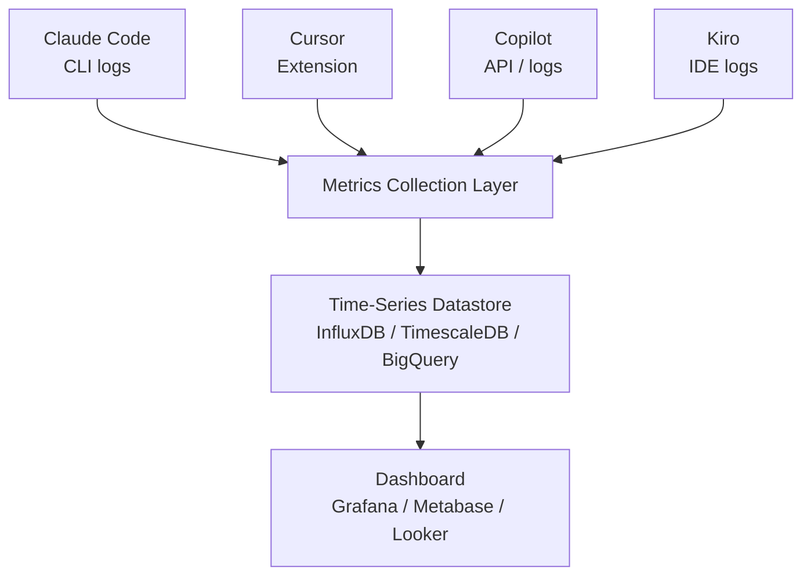

## The Problem

Team A uses Claude Code, Team B swears by Cursor, Team C has adopted Kiro. License costs keep climbing, but nobody can answer how much impact each tool is actually delivering. "Should we standardize on one tool?" someone asks — and the teams push back: "Don't force a tool that doesn't fit our workflow."

This post walks through a design pattern for a unified metrics dashboard that lets teams keep choosing their own tools while giving the organization the visibility it needs for investment decisions. It covers common schema definition, metric comparability, dashboard view structure, and operational criteria for turning numbers into action.

## Premise: Let Teams Choose Their Tools

A frontend team might love Cursor's multi-file editing while an infrastructure team prefers Claude Code's CLI integration. A team that values spec-driven development might gravitate toward Kiro's Spec workflow. The optimal tool varies by team, so selection should be delegated — within organizational constraints (security policy compliance, cost ceilings, CI/CD integration requirements).

A practical guideline is to cap the organization at three concurrent agents. Beyond that, the overhead of security reviews, license management, and fragmented knowledge sharing starts to erode the productivity gains from freedom of choice. When introducing a new agent, treat it as a replacement for an existing one by default, with a time-boxed evaluation period for parallel operation.

## Four Metric Domains to Track

**Usage** — Active users per agent, sessions per team per day, feature utilization rate (completion/chat/generation). High usage isn't always good. Watch for over-reliance as well as under-adoption.

**Cost** — Monthly token consumption per agent, cost per team, average token cost per PR. The most valuable metric is cost per PR — not absolute cost, but cost relative to output. A \$5,000 monthly bill might be cheap if PR cost is \$1.50.

**Productivity** — PR creation frequency change, time to first review request, suggestion acceptance rate. Measuring by lines of code is a trap. Ten precise lines of logic can outweigh a hundred lines of boilerplate. Acceptance rate is a more reliable quality signal.

**Quality** — Review change rate on agent-generated code, build success rate change, bug rate trend. Quality metrics are most useful as before/after comparisons. If bug rates stay flat after adoption, the productivity gains are pure upside.

Note that cost isn't limited to token consumption and license fees. Running multiple agents introduces indirect costs: maintaining onboarding materials per tool, staffing internal support, and conducting security reviews for each vendor. Track direct costs in the dashboard and evaluate indirect costs qualitatively in quarterly reviews.

## What You Can Compare Across Agents — and What You Can't

The most dangerous thing a cross-agent dashboard can do is invite naive comparisons.

**Comparable metrics:** Cost efficiency (cost per PR), post-adoption quality changes (bug rate trends), team satisfaction scores. These measure "outcomes of adoption," not "which agent is better," so cross-agent views are meaningful.

**Not comparable:** Lines of code generated, session duration, absolute token consumption. A Claude Code session and a Cursor session are fundamentally different. CLI-based Claude Code tends toward long autonomous runs; IDE-based Cursor is a stream of short interactions. The same word "session" means different things.

Kiro is even more distinct. Its spec-driven flow (Spec creation → task decomposition → implementation) makes "spec completion rate" and "task achievement rate" the relevant productivity signals — metrics that have no equivalent in other agents.

In dashboard design, place only comparable metrics in cross-agent panels. Isolate agent-specific metrics in team detail views.


## Technical Design: Metrics Collection

Each agent exposes metrics differently, so the collection and normalization layer is critical.



The collection layer has three responsibilities: fetch data from each agent's logs and APIs, normalize to a common schema, and attach timestamp/team/project metadata.

### Common Schema

A shared schema is essential for unified querying.

```json
{
  "timestamp": "2026-03-09T10:30:00Z",
  "agent": "claude-code",
  "agent_version": "1.2.0",
  "team": "frontend",
  "user_id": "user-123",
  "project": "web-app",
  "branch": "feat/user-profile",
  "event_type": "autonomous",
  "metrics": {
    "tokens_input": 1500,
    "tokens_output": 800,
    "latency_ms": 2300,
    "accepted": true
  },
  "metadata": {
    "cli_command": "implement user profile page",
    "tools_used": ["Read", "Edit", "Bash"]
  }
}
```

Three design points. First, agent-specific fields go into `metadata` while common `metrics` fields enable filtering and aggregation — Claude Code stores CLI commands and tool call history, Cursor stores completion trigger context, Kiro stores the associated Spec ID. Second, the `branch` field enables PR attribution later. Third, unify `event_type`: Cursor's tab completion and Copilot's inline completion are similar, but Claude Code's autonomous file editing is fundamentally different. A practical classification: `completion` for inline suggestions, `chat` for conversational interactions, `autonomous` for agent-driven execution.

### Cost Attribution: How to Compute "Cost per PR"

Of the four metric domains, cost attribution is the hardest to design. Computing "cost per PR" requires linking agent sessions to pull requests. The most practical approach is **branch-name matching** — agent session logs typically include branch information, which you can match against PR source branches. It's not pixel-perfect, but aggregated at the team level it produces a reliable approximation.

The harder case is when a single developer uses multiple agents on the same PR — and this is increasingly common. A developer might use Copilot for inline completions while delegating complex refactoring to Claude Code. In this scenario, sum costs at the PR level but retain the per-agent breakdown: "This PR cost \$0.80 in Copilot and \$2.50 in Claude Code, totaling \$3.30." The breakdown is essential for evaluating individual agent efficiency; the total is what matters for organizational investment decisions.

### Collection Methods — and What's Actually Available

```text
Claude Code  → CLI logs (~/.claude/logs) + API usage dashboard
Cursor       → VS Code extension telemetry + Cursor dashboard API
Copilot      → GitHub Copilot Metrics API (Organization-level)
Kiro         → IDE logs + Spec/task execution logs
Cline        → VS Code extension logs + token usage logs
```

A crucial reality: data accessibility varies enormously across agents. GitHub Copilot has the most mature metrics API, delivering structured JSON with active user counts, per-language usage rates, and suggestion acceptance rates at the organization level. This is the easiest starting point for dashboard construction.

Claude Code, by contrast, requires parsing local log files that contain session content, token counts, and tool call history — useful data, but not delivered via a structured API. You'll need to build a custom parser. Cursor has similarly limited official metrics APIs, with some data available through its dashboard but not always programmatically accessible.

This means "start with what's available" in Phase 1 isn't a compromise — it's a strategy. Begin with Copilot's structured API, then incrementally expand coverage to other agents as you build parsers and integrations.


## Security and Data Governance

The metrics collection pipeline doesn't just handle usage statistics. Running multiple agents in parallel means you need visibility into which code each agent sends to which external service — and that makes security management significantly more complex than single-tool setups.

At minimum, unify three policies across all agents:

1. **Transmission scope control** — Define what code is sent to each agent. Does the entire repository enter the context, or only open files? Establish shared exclusion rules for sensitive directories (`.env`, credentials, customer data) across all agents
2. **Data retention policy review** — Each agent vendor has different data retention periods and training data usage policies. Create a comparison table and share it with the compliance team
3. **Centralized access management** — Maintain a single source of truth for which developers can use which agents. API key provisioning and revocation must be manageable by IT

These policies are prerequisites for the dashboard itself. Before collecting metrics, verify that each agent meets the organization's security baseline.

## Dashboard View Structure

The dashboard should have two layers.

**Executive view** — Organization-wide KPIs (monthly active users, total cost, cost per PR, acceptance rate) as cards, plus an agent usage distribution chart and team productivity score trends. This is what leadership uses for monthly investment decisions.

**Team detail view** — Each team sees their active agents, member usage rates, weekly token consumption, and quality indicators (review change rate, build success rate). This layer also includes agent-specific metrics: Kiro's spec completion rate, Claude Code's autonomous execution success rate, and so on. For teams using multiple agents, show usage ratios and purpose breakdowns (e.g., "Copilot for completions, Claude Code for autonomous tasks") so that multi-agent usage patterns become visible.

Critical rule: never put individual-level data in the executive view. If developers feel individually monitored, they'll avoid the tools, and the data becomes unreliable.

## Implementation Path

The platform or DevOps team is the natural owner for this initiative. It's a cross-organizational data infrastructure project, not a team-level productivity effort. The owning team interviews each development team about their agent usage, then defines dashboard requirements. Since both leadership and individual teams consume the dashboard, gather input from both sides during requirements definition.

**Phase 1 (2 weeks):** Inventory available metrics from each agent, define the common schema, and build the ingestion pipeline. Start with structured data sources like the Copilot Metrics API. Log parsers for Claude Code and Cursor can come in the next phase.

**Phase 2 (1 week):** Build the executive view first. Early leadership buy-in is essential for sustaining the initiative. Add team detail views next.

**Phase 3 (ongoing):** Auto-generate monthly reports, cross-pollinate best practices between teams, and optimize licensing based on ROI analysis. Run quarterly qualitative surveys to capture effects the dashboard can't show — learning acceleration, design quality improvements, developer experience.

## From Metrics to Action

A dashboard exists to support decisions, not to be admired. Define in advance what metric changes mean and what actions they should trigger. The items below are ordered by how early they typically surface.

**Extreme adoption disparity** — When a clear split emerges between team members who use agents and those who don't, the root cause is usually insufficient onboarding rather than tool quality. Pair programming sessions focused on agent usage are effective.

**Persistently low utilization** — When weekly active usage stays below 30% one month after introduction, the tool likely doesn't fit the team's workflow. This is when switching to a different agent becomes rational. Don't let sunk cost bias drive the decision — the dashboard data provides the objective backing to make the call.

**Cost efficiency degradation** — When an agent's cost per PR exceeds twice the team average or org-wide average, investigate usage patterns. The cause is usually unnecessary context bloat, autonomous execution spinning on errors, or the agent being a poor fit for the task type. More often a usage problem than a tool problem — start by sharing practices within the team.

**Quality metric decline** — When review change rates or bug rates trend upward after adoption, revisit the review process for agent-generated code. The common pattern is merging agent output without sufficient review. Counter the "the agent wrote it so it must be correct" bias by introducing a review checklist for generated code.

## Takeaways

- **Delegate tool selection, centralize visibility** — Let teams choose tools that fit their context. The organization's role is to collect data across all agents and surface insights for better decisions.
- **Separate comparable metrics from incomparable ones** — Cost per PR and quality trends work for cross-agent views. Session duration and code generation volume don't — they mean different things for different agents.
- **Evaluate by cost per deliverable, and tie action criteria to metrics** — Link sessions to PRs via branch names, and predefine who acts, when, and how for cost spikes, adoption gaps, and quality declines. A dashboard without decision triggers becomes shelfware.
- **Start with what's available** — Begin with structured APIs like Copilot Metrics, then incrementally add parsers for agents with less accessible data. Waiting for perfect coverage means the dashboard never ships.