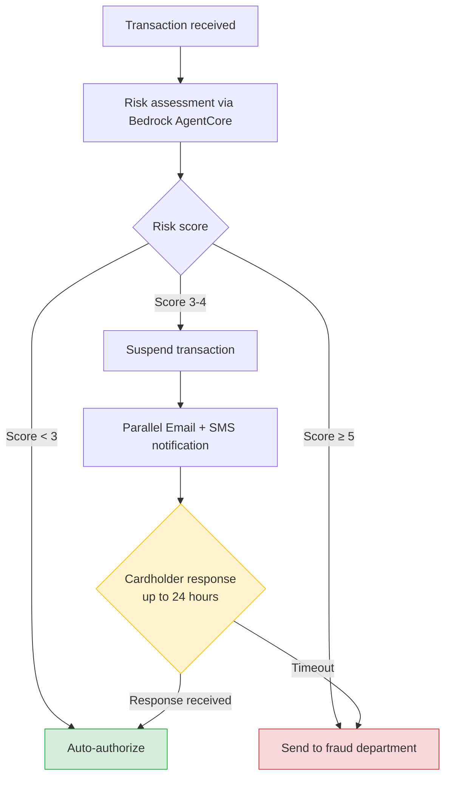

## Introduction

How can Lambda Durable Functions be used in financial workflows? I deployed the [official fraud detection demo](https://github.com/aws-samples/sample-lambda-durable-functions/tree/main/Industry%20Solutions/Financial%20Services%20(FSI)/FraudDetection) published by AWS and verified it hands-on. This demo is also the subject of the [AWS Compute Blog best practices article](https://aws.amazon.com/blogs/compute/best-practices-for-lambda-durable-functions-using-a-fraud-detection-example/) (published March 23, 2026).

This is Part 1 of a 3-part series.

- **Part 1 (this article)**: Demo overview and basic behavior across 3 risk patterns
- **[Part 2](/en/blog/2026/03/26/lambda-durable-fraud-detection-best-practices)**: Hands-on verification of 6 best practices
- **[Part 3](/en/blog/2026/03/26/lambda-durable-fraud-detection-operations)**: Deploy, test, and operations insights

For Durable Functions basics (Step, Wait, Callback, Parallel), see my [previous article](/en/blog/2026/03/10/lambda-durable-functions-hands-on). This series focuses on a practical use case.

Prerequisites:

- AWS CLI v2, SAM CLI, Docker, Node.js 24.x
- Test region: us-east-2 (Ohio)

## Workflow Overview

This demo implements credit card fraud detection with Durable Functions. A Bedrock AgentCore agent calculates a risk score, and the workflow branches into three paths.



The Medium Risk path (score 3-4) is where Durable Functions shine. During the 24-hour callback wait, Lambda compute charges are zero. What previously required SQS + DynamoDB + polling Lambda is now a single `waitForCallback` line.

## Deployment

The SAM template creates the following resources:

- Lambda function (Node.js 24.x with Durable config)
- Lambda Layer (dependency packages)
- Bedrock AgentCore Runtime (risk scoring agent)
- IAM roles (for Lambda and AgentCore)
- S3 bucket (deployment artifacts)
- ECR repository (agent container)

<details className="my-4 rounded-lg border border-border bg-muted/30 p-4">
<summary className="cursor-pointer font-medium">Deployment steps</summary>

Clone the repository and run the deployment script.

```bash title="Terminal"
git clone https://github.com/aws-samples/sample-lambda-durable-functions.git
cd "sample-lambda-durable-functions/Industry Solutions/Financial Services (FSI)/FraudDetection"
chmod +x deploy-sam.sh invoke-function.sh send-callback.sh
```

`deploy-sam.sh` handles Docker image building, Lambda packaging, S3 upload, and SAM deployment in one go. However, if `tsc` isn't globally installed, the build fails. In that case, manual building in the `FraudDetection-Lambda/` directory is needed.

```bash title="Terminal (manual build if needed)"
cd FraudDetection-Lambda
npm install
npx tsc  # deploy-sam.sh calls tsc directly, which may fail
```

After deployment, verify the Lambda function configuration.

```json title="Output (Lambda config)"
{
  "FunctionName": "fn-Fraud-Detection",
  "Runtime": "nodejs24.x",
  "Timeout": 120,
  "MemorySize": 128,
  "DurableConfig": {
    "RetentionPeriodInDays": 7,
    "ExecutionTimeout": 90000
  }
}
```

`ExecutionTimeout: 90000` (25 hours) is intentionally set slightly above the 24-hour callback timeout. The design rationale is covered in [Part 2](/en/blog/2026/03/26/lambda-durable-fraud-detection-best-practices).

</details>

If you just want the results, skip to [Test 1](#test-1-low-risk-auto-authorize).

## Source Code Key Points

The core logic lives in `FraudDetection-Lambda/src/index.ts`. The handler is wrapped with `withDurableExecution`, creating checkpoints via `context.step()`. Two key points for the verification:

1. **Score-based branching**: `score < 3` → auto-authorize, `score >= 5` → fraud department, `score 3-4` → parallel callback wait
2. **Agent is a mock**: The Bedrock AgentCore agent doesn't use an LLM — it returns scores via weighted random based on amount. \$6,500 always returns score 3, making it reliable for testing the Medium Risk path

## Test 1: Low Risk (Auto-Authorize)

Send a \$500 transaction. Durable Function invocation requires a qualified ARN (with `$LATEST`).

```bash title="Terminal"
aws lambda invoke \
  --function-name "fn-Fraud-Detection:\$LATEST" \
  --invocation-type Event \
  --durable-execution-name "tx-low-risk-001" \
  --cli-binary-format raw-in-base64-out \
  --payload '{"id": 1, "amount": 500, "location": "Tokyo", "vendor": "Amazon.co.jp"}' \
  --region us-east-2 \
  response.json
```

Since this is an async invocation, the result isn't in the response. Note the `DurableExecutionArn` from the response, wait about 10 seconds, then check with `get-durable-execution`.

```bash title="Terminal (check result)"
aws lambda get-durable-execution \
  --durable-execution-arn "<DurableExecutionArn>" \
  --region us-east-2
```

```json title="Output (execution result)"
{
  "DurableExecutionName": "tx-low-risk-001",
  "Status": "SUCCEEDED",
  "Result": {
    "statusCode": 200,
    "body": {
      "transaction_id": 1,
      "amount": 500,
      "fraud_score": 1,
      "result": "authorized"
    }
  }
}
```

Score 1, immediately `authorized`. About 3 seconds from start to finish. Only two steps: `fraudCheck` → `authorize-1`.

## Test 2: High Risk (Fraud Department)

\$10,000 transaction. The agent always returns score 5.

```bash title="Terminal"
aws lambda invoke \
  --function-name "fn-Fraud-Detection:\$LATEST" \
  --invocation-type Event \
  --durable-execution-name "tx-high-risk-001" \
  --cli-binary-format raw-in-base64-out \
  --payload '{"id": 2, "amount": 10000, "location": "Unknown", "vendor": "Suspicious Store"}' \
  --region us-east-2 \
  response.json
```

Check the result with `get-durable-execution` as before.

```json title="Output (execution result)"
{
  "DurableExecutionName": "tx-high-risk-001",
  "Status": "SUCCEEDED",
  "Result": {
    "statusCode": 200,
    "body": {
      "transaction_id": 2,
      "amount": 10000,
      "fraud_score": 5,
      "result": "SentToFraudDept"
    }
  }
}
```

Score 5, `SentToFraudDept`. Completed in under 1 second. Like Low Risk, a single step after the branch.

## Test 3: Medium Risk (Human-in-the-Loop)

\$6,500 transaction. Returns score 3, entering callback wait.

```bash title="Terminal (send transaction)"
aws lambda invoke \
  --function-name "fn-Fraud-Detection:\$LATEST" \
  --invocation-type Event \
  --durable-execution-name "tx-medium-risk-001" \
  --cli-binary-format raw-in-base64-out \
  --payload '{"id": 3, "amount": 6500, "location": "Los Angeles", "vendor": "Electronics Store"}' \
  --region us-east-2 \
  response.json
```

Wait about 10 seconds, then check the execution status. Use the `DurableExecutionArn` from the invoke response.

```bash title="Terminal (check status)"
aws lambda get-durable-execution \
  --durable-execution-arn "<DurableExecutionArn>" \
  --region us-east-2
```

Once the status shows `RUNNING` (Durable Functions show `RUNNING` even during suspension/callback wait), retrieve the execution history to find callback IDs.

```bash title="Terminal (get execution history)"
aws lambda get-durable-execution-history \
  --durable-execution-arn "<DurableExecutionArn>" \
  --region us-east-2 \
  --include-execution-data
```

The execution history shows detailed workflow progression.

```text title="Execution history (summary)"
EventId  EventType         Name                    Details
──────────────────────────────────────────────────────────────────
1        ExecutionStarted  tx-medium-risk-001      ExecutionTimeout: 90000
2        StepStarted       fraudCheck
3        StepSucceeded     fraudCheck              Result: 3
4        StepStarted       suspend-3
5        StepSucceeded     suspend-3               Result: true
6        ContextStarted    human-verification      (Parallel)
7        ContextStarted    parallel-branch-0       (ParallelBranch)
8        ContextStarted    SendVerificationEmail   (WaitForCallback)
9        CallbackStarted   (Email callback)        Timeout: 86400s
10       ContextStarted    parallel-branch-1       (ParallelBranch)
11       ContextStarted    SendVerificationSMS     (WaitForCallback)
12       CallbackStarted   (SMS callback)          Timeout: 86400s
17       InvocationCompleted                       Duration: ~730ms
```

`fraudCheck` (score 3) → `suspend-3` → `human-verification` (Parallel) with two callback branches. Active processing time was about 730ms. After this, the function suspends with zero compute charges.

Callback IDs are available in the `CallbackStartedDetails.CallbackId` field of the execution history. Send the email callback to resume.

```bash title="Terminal (send callback)"
aws lambda send-durable-execution-callback-success \
  --callback-id "<EMAIL_CALLBACK_ID>" \
  --result '{"status":"approved","channel":"email"}' \
  --cli-binary-format raw-in-base64-out \
  --region us-east-2
```

```json title="Output (final result)"
{
  "DurableExecutionName": "tx-medium-risk-001",
  "Status": "SUCCEEDED",
  "Result": {
    "statusCode": 200,
    "body": {
      "transaction_id": 3,
      "amount": 6500,
      "fraud_score": 3,
      "result": "authorized",
      "customerVerificationResult": "TransactionApproved"
    }
  }
}
```

A single email callback was enough for `SUCCEEDED`. The SMS callback wasn't needed. This is the first-response-wins pattern from `minSuccessful: 1`.

## Comparing the Three Patterns

| Pattern | Amount | Score | Result | Duration |
|---|---|---|---|---|
| Low Risk | \$500 | 1 | authorized | ~3 seconds |
| High Risk | \$10,000 | 5 | SentToFraudDept | Under 1 second |
| Medium Risk | \$6,500 | 3 | authorized (after callback) | Suspend time + seconds |

Low and High Risk complete in seconds as simple branches. Medium Risk is where Durable Functions deliver real value — zero compute charges during suspension, resuming within seconds after callback.

## Takeaways

- **Zero compute charges during suspension is the key value** — The Medium Risk path involves a 24-hour callback wait with zero Lambda charges. What previously required SQS + DynamoDB + polling Lambda is now a single `waitForCallback` line.
- **Execution history enables full step tracking** — `get-durable-execution-history` shows each step's start, completion, and result in chronological order. Useful for debugging and auditing.
- **The mock agent implementation works well for demos** — Using weighted random instead of actual LLM calls ensures reproducible testing. \$6,500 reliably triggers the Medium Risk path.

Next up: [Part 2](/en/blog/2026/03/26/lambda-durable-fraud-detection-best-practices) verifies the six best practices from the blog post using this demo.
