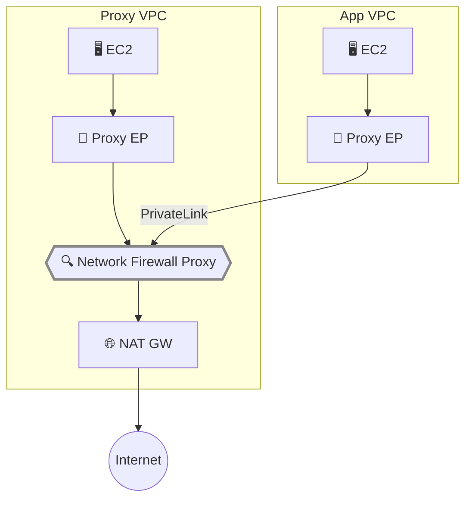

## Introduction

[Part 1](/en/blog/2026/03/26/nfw-proxy-setup-domain-filtering) covered domain filtering in a single VPC, and [Part 2](/en/blog/2026/03/26/nfw-proxy-tls-interception) added TLS intercept for HTTP-layer inspection. In practice, organizations often need to centrally manage egress traffic from multiple VPCs through a single proxy.

This article verifies the centralized proxy architecture — accessing the proxy from a separate application VPC via PrivateLink endpoints. We test whether per-VPC policies work and document the source identification constraints.

**Network Firewall Proxy is in Public Preview and its behavior may change before GA. This article is based on behavior observed in March 2026.**

Prerequisites:

- Proxy environment from [Part 1](/en/blog/2026/03/26/nfw-proxy-setup-domain-filtering)
- Permissions to create additional VPCs

## Architecture

The [official documentation](https://docs.aws.amazon.com/network-firewall/latest/developerguide/proxy-architecture-overview.html) describes three architecture models.

| Model | Setup | When to Use |
|---|---|---|
| **Dedicated VPC** | Proxy + NAT Gateway per VPC | Fully independent policies per VPC |
| **Centralized (Endpoints)** | 1 Proxy VPC + PrivateLink endpoints in each VPC | No routing changes needed, simplest |
| **Centralized (Transit Gateway)** | Route via TGW to central Proxy | Existing TGW/Cloud WAN infrastructure |

We verify the **Centralized (Endpoints) model** — the simplest to adopt since it requires no route table changes.



## Application VPC Setup

<details className="my-4 rounded-lg border border-border bg-muted/30 p-4">
<summary className="cursor-pointer font-medium">Create application VPC (VPC + subnet + EC2)</summary>

```bash title="Terminal"
APP_VPC_ID=$(aws ec2 create-vpc --cidr-block 10.2.0.0/16 \
  --tag-specifications 'ResourceType=vpc,Tags=[{Key=Name,Value=nfw-proxy-app-vpc}]' \
  --region us-east-2 --query 'Vpc.VpcId' --output text)

aws ec2 modify-vpc-attribute --vpc-id "$APP_VPC_ID" --enable-dns-support '{"Value": true}' --region us-east-2
aws ec2 modify-vpc-attribute --vpc-id "$APP_VPC_ID" --enable-dns-hostnames '{"Value": true}' --region us-east-2

# Private subnet (no NAT Gateway — internet access only via proxy)
APP_SUBNET=$(aws ec2 create-subnet --vpc-id "$APP_VPC_ID" --cidr-block 10.2.1.0/24 \
  --availability-zone us-east-2a \
  --region us-east-2 --query 'Subnet.SubnetId' --output text)

# SSM endpoints for management
APP_SSM_SG=$(aws ec2 create-security-group --group-name nfw-proxy-app-ssm-sg \
  --description "SSM endpoints for app VPC" --vpc-id "$APP_VPC_ID" \
  --region us-east-2 --query 'GroupId' --output text)
aws ec2 authorize-security-group-ingress --group-id "$APP_SSM_SG" \
  --ip-permissions "[{\"IpProtocol\":\"tcp\",\"FromPort\":443,\"ToPort\":443,\"IpRanges\":[{\"CidrIp\":\"10.2.0.0/16\"}]}]" \
  --region us-east-2 > /dev/null

for svc in ssm ssmmessages ec2messages; do
  aws ec2 create-vpc-endpoint --vpc-id "$APP_VPC_ID" \
    --service-name com.amazonaws.us-east-2.$svc \
    --vpc-endpoint-type Interface --subnet-ids "$APP_SUBNET" \
    --security-group-ids "$APP_SSM_SG" --private-dns-enabled \
    --region us-east-2 > /dev/null
done

# Test EC2 instance
APP_EC2_SG=$(aws ec2 create-security-group --group-name nfw-proxy-app-ec2-sg \
  --description "App VPC test instance" --vpc-id "$APP_VPC_ID" \
  --region us-east-2 --query 'GroupId' --output text)

APP_INSTANCE=$(aws ec2 run-instances --image-id ami-0b0b78dcacbab728f \
  --instance-type t3.micro --subnet-id "$APP_SUBNET" \
  --security-group-ids "$APP_EC2_SG" \
  --iam-instance-profile Name=nfw-proxy-test-profile \
  --region us-east-2 --query 'Instances[0].InstanceId' --output text)

echo "App VPC: $APP_VPC_ID, Subnet: $APP_SUBNET, EC2: $APP_INSTANCE"
```

This application VPC has no NAT Gateway. Internet access is only possible through the proxy.

</details>

## Creating the Proxy Endpoint

To access the proxy from the application VPC, create a PrivateLink endpoint. The endpoint in the Proxy VPC is auto-created when the proxy is set up, but **endpoints in other VPCs must be created manually**.

```bash title="Terminal"
# Get the Proxy's VPC Endpoint Service name
VPCE_SERVICE=$(aws network-firewall describe-proxy --proxy-name nfw-proxy-test \
  --region us-east-2 --query 'Proxy.VpcEndpointServiceName' --output text)
echo "Service: $VPCE_SERVICE"
```

<details className="my-4 rounded-lg border border-border bg-muted/30 p-4">
<summary className="cursor-pointer font-medium">Create proxy endpoint in application VPC</summary>

```bash title="Terminal"
# Security group for proxy ports
PROXY_EP_SG=$(aws ec2 create-security-group --group-name nfw-proxy-app-proxy-ep-sg \
  --description "Proxy endpoint in app VPC" --vpc-id "$APP_VPC_ID" \
  --region us-east-2 --query 'GroupId' --output text)

aws ec2 authorize-security-group-ingress --group-id "$PROXY_EP_SG" \
  --ip-permissions '[
    {"IpProtocol":"tcp","FromPort":1080,"ToPort":1080,"IpRanges":[{"CidrIp":"10.2.0.0/16"}]},
    {"IpProtocol":"tcp","FromPort":443,"ToPort":443,"IpRanges":[{"CidrIp":"10.2.0.0/16"}]}
  ]' --region us-east-2 > /dev/null

# Create VPC endpoint with Private DNS enabled
aws ec2 create-vpc-endpoint \
  --vpc-id "$APP_VPC_ID" \
  --service-name "$VPCE_SERVICE" \
  --vpc-endpoint-type Interface \
  --subnet-ids "$APP_SUBNET" \
  --security-group-ids "$PROXY_EP_SG" \
  --private-dns-enabled \
  --region us-east-2
```

With Private DNS enabled, the proxy's FQDN resolves to a local endpoint IP within the application VPC. The same DNS name works across all VPCs.

</details>

Wait about 2 minutes for the endpoint to become `available`.

## Verification 1: Cross-VPC Access

Access the internet from the application VPC EC2 through the proxy in the Proxy VPC.

```bash title="Terminal"
export http_proxy=http://<proxy-dns>:1080
export https_proxy=http://<proxy-dns>:1080
export no_proxy=169.254.169.254

# DNS resolves to local VPC IP
dig +short <proxy-dns>
# → 10.2.1.203 (IP within the application VPC)

# Allowed domain
curl -s -o /dev/null -w "%{http_code}\n" --max-time 15 http://example.com/

# Denied domain
curl -s -o /dev/null -w "%{http_code}\n" --max-time 15 http://google.com/
```

| Test | Expected | Result |
|---|---|---|
| DNS resolution | App VPC local IP | ✅ `10.2.1.203` |
| `http://example.com/` | ALLOW | ✅ **200** |
| `http://google.com/` | DENY | ✅ **403** |

The application VPC has no NAT Gateway, yet it can access the internet through the proxy endpoint via the Proxy VPC's NAT Gateway. No route table changes required.

## Verification 2: Per-VPC Policy with SourceVpc

Test whether different access policies can be applied per VPC using `request:SourceVpc`.

<details className="my-4 rounded-lg border border-border bg-muted/30 p-4">
<summary className="cursor-pointer font-medium">Create SourceVpc rules</summary>

```bash title="Terminal"
aws network-firewall create-proxy-rule-group \
  --proxy-rule-group-name multi-vpc-rules \
  --description "Multi-VPC source-based rules" \
  --region us-east-2

aws network-firewall create-proxy-rules \
  --proxy-rule-group-name multi-vpc-rules \
  --rules '{
    "PreDNS": [
      {
        "ProxyRuleName": "allow-from-app-vpc",
        "Description": "Allow httpbin.org from app VPC only",
        "Action": "ALLOW",
        "InsertPosition": 0,
        "Conditions": [
          {"ConditionKey":"request:SourceVpc","ConditionOperator":"StringEquals","ConditionValues":["<app-vpc-id>"]},
          {"ConditionKey":"request:DestinationDomain","ConditionOperator":"StringEquals","ConditionValues":["httpbin.org"]}
        ]
      },
      {
        "ProxyRuleName": "allow-example-all",
        "Description": "Allow example.com from any source",
        "Action": "ALLOW",
        "InsertPosition": 1,
        "Conditions": [
          {"ConditionKey":"request:DestinationDomain","ConditionOperator":"StringEquals","ConditionValues":["example.com"]}
        ]
      }
    ]
  }' --region us-east-2
```

Replace `<app-vpc-id>` with your application VPC ID.

Swap the rule group in the Proxy Configuration (same procedure as Part 1).

```bash title="Terminal"
# Detach existing rule group
TOKEN=$(aws network-firewall describe-proxy-configuration \
  --proxy-configuration-name domain-allowlist-config \
  --query UpdateToken --output text --region us-east-2)

aws network-firewall detach-rule-groups-from-proxy-configuration \
  --proxy-configuration-name domain-allowlist-config \
  --rule-group-names domain-allowlist \
  --update-token "$TOKEN" --region us-east-2

# Attach multi-vpc-rules
TOKEN=$(aws network-firewall describe-proxy-configuration \
  --proxy-configuration-name domain-allowlist-config \
  --query UpdateToken --output text --region us-east-2)

aws network-firewall attach-rule-groups-to-proxy-configuration \
  --proxy-configuration-name domain-allowlist-config \
  --rule-groups '[{"InsertPosition":0,"ProxyRuleGroupName":"multi-vpc-rules"}]' \
  --update-token "$TOKEN" --region us-east-2
```

</details>

```bash title="Terminal (App VPC EC2)"
curl -s -o /dev/null -w "%{http_code}\n" --max-time 15 http://httpbin.org/get
curl -s -o /dev/null -w "%{http_code}\n" --max-time 15 http://example.com/
```

```bash title="Terminal (Proxy VPC EC2)"
curl -s -o /dev/null -w "%{http_code}\n" --max-time 15 http://httpbin.org/get
curl -s -o /dev/null -w "%{http_code}\n" --max-time 15 http://example.com/
```

| Test | Source | Domain | Expected | Result |
|---|---|---|---|---|
| App VPC → httpbin.org | App VPC ✅ | httpbin.org ✅ | ALLOW | ✅ **200** |
| App VPC → example.com | any | example.com ✅ | ALLOW | ✅ **200** |
| Proxy VPC → httpbin.org | Proxy VPC ❌ | httpbin.org ✅ | DENY | ✅ **403** |
| Proxy VPC → example.com | any | example.com ✅ | ALLOW | ✅ **200** |

`request:SourceVpc` correctly identifies the originating VPC even through PrivateLink endpoints. Per-VPC domain policies work.

## Verification 3: SourceIp NAT Constraint

With PrivateLink endpoints, source IP is NATed to the endpoint's ENI IP. The [official blog](https://aws.amazon.com/blogs/networking-and-content-delivery/securing-egress-architectures-with-network-firewall-proxy/) documents this for VPC Lattice / NLB integrations, and we confirmed the same applies to direct PrivateLink endpoint access.

Add a SourceIp rule targeting the App VPC EC2's IP to verify.

<details className="my-4 rounded-lg border border-border bg-muted/30 p-4">
<summary className="cursor-pointer font-medium">Add SourceIp rule</summary>

```bash title="Terminal"
aws network-firewall create-proxy-rules \
  --proxy-rule-group-name multi-vpc-rules \
  --rules '{
    "PreDNS": [{
      "ProxyRuleName": "allow-from-app-ip",
      "Description": "Allow google.com from app EC2 IP",
      "Action": "ALLOW",
      "InsertPosition": 2,
      "Conditions": [
        {"ConditionKey":"request:SourceIp","ConditionOperator":"IpAddress","ConditionValues":["<app-ec2-ip>/32"]},
        {"ConditionKey":"request:DestinationDomain","ConditionOperator":"StringEquals","ConditionValues":["google.com"]}
      ]
    }]
  }' --region us-east-2
```

Replace `<app-ec2-ip>` with the App VPC EC2's private IP.

</details>

```bash title="Terminal (App VPC EC2)"
# Check own IP
hostname -I
# → 10.2.1.52

# Should match SourceIp rule, but...
curl -s -o /dev/null -w "%{http_code}\n" --max-time 15 http://google.com/
# → 403 (SourceIp not matched — NATed by PrivateLink)
```

| Condition Key | Cross-VPC (PrivateLink) | Same VPC |
|---|---|---|
| `request:SourceVpc` | ✅ Correctly identified (verified) | ✅ |
| `request:SourceVpce` | ✅ Endpoint ID available (not verified) | ✅ |
| `request:SourceIp` | ❌ NATed, original IP not visible (verified) | ✅ |
| `request:SourceAccount` | ✅ Account ID available (not verified) | ✅ |

For cross-VPC source identification, use `SourceVpc` or `SourceVpce`. `SourceIp` only works within the same VPC.

## Summary

- **PrivateLink endpoints are all you need for cross-VPC** — No NAT Gateway or route table changes in the application VPC. Create an endpoint, set `http_proxy`, and centralized egress filtering is ready
- **SourceVpc enables per-VPC policies** — VPC ID is correctly identified through PrivateLink. Apply different domain policies for dev vs prod VPCs
- **SourceIp doesn't work cross-VPC** — PrivateLink NATs the source IP to the endpoint's ENI. Use `SourceVpc` or `SourceVpce` instead for cross-VPC source identification

## Cleanup

<details className="my-4 rounded-lg border border-border bg-muted/30 p-4">
<summary className="cursor-pointer font-medium">Full series resource deletion commands</summary>

```bash title="Terminal"
# === Proxy resources ===
aws network-firewall delete-proxy --proxy-name nfw-proxy-test \
  --nat-gateway-id nat-xxx --region us-east-2

aws network-firewall delete-proxy-configuration \
  --proxy-configuration-name domain-allowlist-config --region us-east-2

for rg in domain-allowlist domain-denylist source-based-control tls-intercept-rules multi-vpc-rules; do
  aws network-firewall delete-proxy-rule-group \
    --proxy-rule-group-name "$rg" --region us-east-2 2>/dev/null
done

# === ACM PCA ===
aws acm-pca delete-policy --resource-arn <ROOT_PCA_ARN> --region us-east-2

for share_arn in $(aws ram get-resource-shares --resource-owner SELF --region us-east-2 \
  --query 'resourceShares[?status==`ACTIVE`].resourceShareArn' --output text); do
  aws ram delete-resource-share --resource-share-arn "$share_arn" --region us-east-2
done

aws acm-pca update-certificate-authority \
  --certificate-authority-arn <ROOT_PCA_ARN> --status DISABLED --region us-east-2
aws acm-pca delete-certificate-authority \
  --certificate-authority-arn <ROOT_PCA_ARN> \
  --permanent-deletion-time-in-days 7 --region us-east-2

# === Application VPC ===
aws ec2 terminate-instances --instance-ids <app-instance-id> --region us-east-2
aws ec2 delete-vpc-endpoints --vpc-endpoint-ids vpce-xxx vpce-xxx vpce-xxx vpce-xxx \
  --region us-east-2
aws ec2 delete-subnet --subnet-id subnet-xxx --region us-east-2
aws ec2 delete-vpc --vpc-id vpc-xxx --region us-east-2

# === Proxy VPC ===
aws ec2 terminate-instances --instance-ids <proxy-instance-id> --region us-east-2
aws ec2 delete-vpc-endpoints --vpc-endpoint-ids vpce-xxx vpce-xxx vpce-xxx vpce-xxx \
  --region us-east-2
aws ec2 delete-nat-gateway --nat-gateway-id nat-xxx --region us-east-2
# Wait for NAT Gateway deletion (a few minutes)
aws ec2 release-address --allocation-id eipalloc-xxx --region us-east-2
aws ec2 detach-internet-gateway --internet-gateway-id igw-xxx --vpc-id vpc-xxx --region us-east-2
aws ec2 delete-internet-gateway --internet-gateway-id igw-xxx --region us-east-2
aws ec2 delete-subnet --subnet-id subnet-xxx --region us-east-2
aws ec2 delete-subnet --subnet-id subnet-xxx --region us-east-2
aws ec2 delete-route-table --route-table-id rtb-xxx --region us-east-2
aws ec2 delete-route-table --route-table-id rtb-xxx --region us-east-2
aws ec2 delete-vpc --vpc-id vpc-xxx --region us-east-2

# === IAM ===
aws iam remove-role-from-instance-profile \
  --instance-profile-name nfw-proxy-test-profile --role-name nfw-proxy-test-role
aws iam delete-instance-profile --instance-profile-name nfw-proxy-test-profile
aws iam detach-role-policy --role-name nfw-proxy-test-role \
  --policy-arn arn:aws:iam::aws:policy/AmazonSSMManagedInstanceCore
aws iam delete-role --role-name nfw-proxy-test-role
```

Proxy deletion takes a few minutes. Wait for NAT Gateway deletion before releasing the EIP. PCA has a 7-day grace period after `delete-certificate-authority`.

</details>
