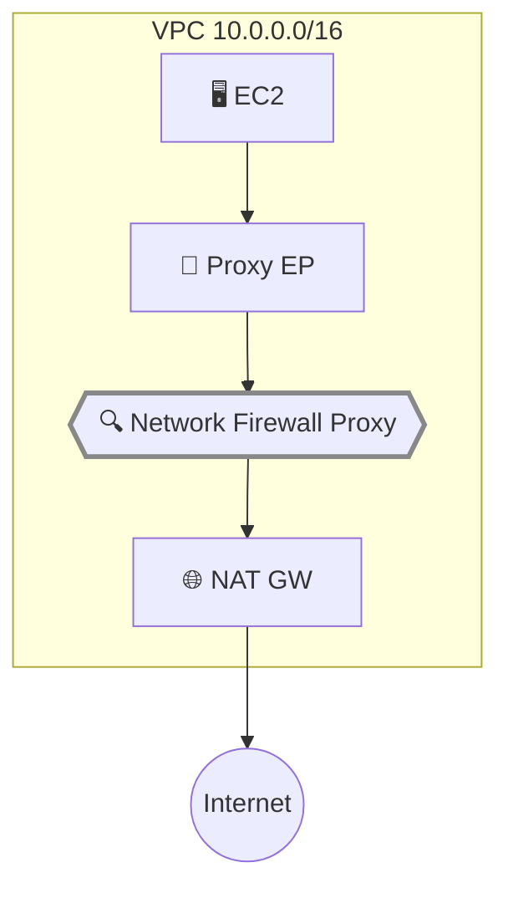

## Introduction

In November 2025, AWS [announced the Public Preview of Network Firewall Proxy](https://aws.amazon.com/about-aws/whats-new/2025/11/aws-network-firewall-proxy-preview/). Previously, controlling egress traffic at the domain level from a VPC required self-managed proxy fleets running Squid or similar software on EC2 or containers. Network Firewall Proxy offloads this operational burden to AWS, providing managed domain filtering integrated directly with NAT Gateway.

This article walks through setting up Network Firewall Proxy in us-east-2 and verifying domain-based egress filtering. See the [official documentation](https://docs.aws.amazon.com/network-firewall/latest/developerguide/network-firewall-proxy-developer-guide.html) for reference.

**Network Firewall Proxy is in Public Preview and its behavior may change before GA. This article is based on behavior observed in March 2026. During Preview, it is available only in us-east-2 (Ohio) at no charge. Wait for GA before using in production workloads.**

Prerequisites:

- AWS CLI configured (Network Firewall, EC2, IAM, SSM permissions)
- Test region: us-east-2 (Ohio)

Skip to [Verification Results](#verification-1-domain-allowlist) if you only want the findings.

## How Network Firewall Proxy Works

Unlike the routing-based transparent firewall of traditional Network Firewall, Network Firewall Proxy operates as an **explicit proxy**. Clients set `HTTP_PROXY` / `HTTPS_PROXY` environment variables. For HTTPS, clients send HTTP CONNECT requests to establish a tunnel; for HTTP, they send absolute-form requests (e.g., `GET http://example.com/ HTTP/1.1`).

Traffic is inspected at three phases:

| Phase | Timing | Inspectable Attributes |
|---|---|---|
| **PreDNS** | Before DNS resolution | Destination domain, source IP/VPC/account |
| **PreRequest** | Before HTTP request | Destination IP/port, HTTP method, URI path, headers (with TLS intercept) |
| **PostResponse** | After HTTP response | Status code, Content-Type, response headers (with TLS intercept) |

A DENY match at any phase immediately blocks traffic — subsequent phases are not evaluated. An ALLOW match ends evaluation in the current phase but continues to subsequent phases.

Key limitation: **Preview only supports HTTP/1.1**. HTTP/2 and HTTP/3 traffic will be dropped or time out.

This article tests the PreDNS phase without TLS intercept. PreRequest and PostResponse phase filtering requires TLS intercept, which will be covered in the next article.



## Environment Setup

<details className="my-4 rounded-lg border border-border bg-muted/30 p-4">
<summary className="cursor-pointer font-medium">Setup steps (VPC + NAT Gateway + EC2)</summary>

### VPC and Subnets

```bash title="Terminal"
# Create VPC (enable DNS support and hostnames)
aws ec2 create-vpc --cidr-block 10.0.0.0/16 \
  --tag-specifications 'ResourceType=vpc,Tags=[{Key=Name,Value=nfw-proxy-test}]' \
  --region us-east-2

aws ec2 modify-vpc-attribute --vpc-id vpc-xxx \
  --enable-dns-support '{"Value": true}' --region us-east-2
aws ec2 modify-vpc-attribute --vpc-id vpc-xxx \
  --enable-dns-hostnames '{"Value": true}' --region us-east-2

# Public subnet (for NAT Gateway)
aws ec2 create-subnet --vpc-id vpc-xxx --cidr-block 10.0.1.0/24 \
  --availability-zone us-east-2a --region us-east-2

# Private subnet (for test EC2)
aws ec2 create-subnet --vpc-id vpc-xxx --cidr-block 10.0.2.0/24 \
  --availability-zone us-east-2a --region us-east-2
```

### Internet Gateway and NAT Gateway

```bash title="Terminal"
aws ec2 create-internet-gateway --region us-east-2
aws ec2 attach-internet-gateway --internet-gateway-id igw-xxx \
  --vpc-id vpc-xxx --region us-east-2

aws ec2 allocate-address --domain vpc --region us-east-2
aws ec2 create-nat-gateway --subnet-id subnet-public-xxx \
  --allocation-id eipalloc-xxx --region us-east-2
```

### Route Tables

```bash title="Terminal"
# Public: 0.0.0.0/0 → IGW
aws ec2 create-route --route-table-id rtb-public-xxx \
  --destination-cidr-block 0.0.0.0/0 --gateway-id igw-xxx --region us-east-2

# Private: 0.0.0.0/0 → NAT Gateway
aws ec2 create-route --route-table-id rtb-private-xxx \
  --destination-cidr-block 0.0.0.0/0 --nat-gateway-id nat-xxx --region us-east-2
```

### EC2 Test Instance (SSM Access)

```bash title="Terminal"
# IAM role for SSM
aws iam create-role --role-name nfw-proxy-test-role \
  --assume-role-policy-document '{"Version":"2012-10-17","Statement":[{"Effect":"Allow","Principal":{"Service":"ec2.amazonaws.com"},"Action":"sts:AssumeRole"}]}'
aws iam attach-role-policy --role-name nfw-proxy-test-role \
  --policy-arn arn:aws:iam::aws:policy/AmazonSSMManagedInstanceCore

# SSM VPC endpoints for private subnet
for svc in ssm ssmmessages ec2messages; do
  aws ec2 create-vpc-endpoint --vpc-id vpc-xxx \
    --service-name com.amazonaws.us-east-2.$svc \
    --vpc-endpoint-type Interface --subnet-ids subnet-private-xxx \
    --security-group-ids sg-ssm-xxx --private-dns-enabled \
    --region us-east-2
done

# Launch EC2
aws ec2 run-instances --image-id ami-xxx --instance-type t3.micro \
  --subnet-id subnet-private-xxx --security-group-ids sg-xxx \
  --iam-instance-profile Name=nfw-proxy-test-profile --region us-east-2
```

</details>

## Proxy Setup

Setting up the proxy involves three steps: Rule Group → Proxy Configuration → Proxy creation.

<details className="my-4 rounded-lg border border-border bg-muted/30 p-4">
<summary className="cursor-pointer font-medium">Step 1: Create Rule Group (define allowed domains)</summary>

```bash title="Terminal"
aws network-firewall create-proxy-rule-group \
  --proxy-rule-group-name domain-allowlist \
  --description "Allow specific domains in PreDNS phase" \
  --region us-east-2

aws network-firewall create-proxy-rules \
  --proxy-rule-group-name domain-allowlist \
  --rules '{
    "PreDNS": [
      {
        "ProxyRuleName": "allow-aws-services",
        "Action": "ALLOW",
        "InsertPosition": 0,
        "Conditions": [{
          "ConditionKey": "request:DestinationDomain",
          "ConditionOperator": "StringLike",
          "ConditionValues": ["*.amazonaws.com"]
        }]
      },
      {
        "ProxyRuleName": "allow-example-com",
        "Action": "ALLOW",
        "InsertPosition": 1,
        "Conditions": [{
          "ConditionKey": "request:DestinationDomain",
          "ConditionOperator": "StringEquals",
          "ConditionValues": ["example.com"]
        }]
      }
    ]
  }' --region us-east-2
```

`InsertPosition` must be zero-based and continuous. Starting from 1 causes an `Insertion position must be continuous` error.

</details>

<details className="my-4 rounded-lg border border-border bg-muted/30 p-4">
<summary className="cursor-pointer font-medium">Step 2: Create Proxy Configuration (default actions + attach rule group)</summary>

Set PreDNS default action to `DENY` for an allowlist approach — all domains not matching a rule are blocked.

```bash title="Terminal"
aws network-firewall create-proxy-configuration \
  --proxy-configuration-name domain-allowlist-config \
  --default-rule-phase-actions '{"PreDNS":"DENY","PreREQUEST":"ALLOW","PostRESPONSE":"ALLOW"}' \
  --region us-east-2

# Get UpdateToken and attach the rule group
aws network-firewall attach-rule-groups-to-proxy-configuration \
  --proxy-configuration-name domain-allowlist-config \
  --rule-groups '[{"InsertPosition":0,"ProxyRuleGroupName":"domain-allowlist"}]' \
  --update-token "$(aws network-firewall describe-proxy-configuration \
    --proxy-configuration-name domain-allowlist-config \
    --query UpdateToken --output text --region us-east-2)" \
  --region us-east-2
```

</details>

<details className="my-4 rounded-lg border border-border bg-muted/30 p-4">
<summary className="cursor-pointer font-medium">Step 3: Create Proxy (attach to NAT Gateway)</summary>

```bash title="Terminal"
aws network-firewall create-proxy \
  --proxy-name nfw-proxy-test \
  --nat-gateway-id nat-02760b0725a13ddd4 \
  --proxy-configuration-name domain-allowlist-config \
  --tls-intercept-properties '{"TlsInterceptMode":"DISABLED"}' \
  --region us-east-2
```

Replace `--nat-gateway-id` with your own NAT Gateway ID.

</details>

The proxy took about 10 minutes to transition from `ATTACHING` to `ATTACHED`.

```bash title="Terminal"
# Check status (repeat until ATTACHED)
aws network-firewall describe-proxy --proxy-name nfw-proxy-test \
  --region us-east-2 --query 'Proxy.{State:ProxyState,DNS:PrivateDNSName,Listeners:ListenerProperties}'
```

```json title="Output"
{
  "State": "ATTACHED",
  "DNS": "0212b6c3ff944a0ce.proxy.nfw.us-east-2.amazonaws.com",
  "Listeners": [
    { "Port": 1080, "Type": "HTTP" },
    { "Port": 443, "Type": "HTTPS" }
  ]
}
```

Once attached, a **PrivateLink endpoint is automatically created** in the same subnet as the NAT Gateway. The DNS name and ports above become the proxy access point.

### The Security Group Gotcha

The auto-created VPC endpoint uses the **VPC's default Security Group**, which only allows inbound traffic from the same SG. EC2 instances with a different SG cannot reach the proxy ports (1080/443) and will time out.

You must add inbound rules for ports 1080 and 443 to the default SG.

```bash title="Terminal"
# Get default SG ID
DEFAULT_SG=$(aws ec2 describe-security-groups \
  --filters Name=vpc-id,Values=vpc-xxx Name=group-name,Values=default \
  --query 'SecurityGroups[0].GroupId' --output text --region us-east-2)

# Allow proxy ports from VPC CIDR
aws ec2 authorize-security-group-ingress --group-id "$DEFAULT_SG" \
  --ip-permissions '[
    {"IpProtocol":"tcp","FromPort":1080,"ToPort":1080,"IpRanges":[{"CidrIp":"10.0.0.0/16"}]},
    {"IpProtocol":"tcp","FromPort":443,"ToPort":443,"IpRanges":[{"CidrIp":"10.0.0.0/16"}]}
  ]' --region us-east-2
```

## Verification 1: Domain Allowlist

Set proxy environment variables on the EC2 instance and test with curl.

```bash title="Terminal"
export http_proxy=http://0212b6c3ff944a0ce.proxy.nfw.us-east-2.amazonaws.com:1080
export https_proxy=http://0212b6c3ff944a0ce.proxy.nfw.us-east-2.amazonaws.com:1080
export no_proxy=169.254.169.254
```

All subsequent verifications use these environment variables.

```bash title="Terminal"
# Allowed domain (HTTP)
curl -s -o /dev/null -w "%{http_code}\n" --max-time 15 http://example.com/

# Blocked domain (HTTP)
curl -s -o /dev/null -w "%{http_code}\n" --max-time 15 http://google.com/

# Allowed domain (HTTPS)
curl -s -o /dev/null -w "%{http_code}\n" --max-time 15 https://example.com/

# Blocked domain (HTTPS)
curl -s -o /dev/null -w "%{http_code}\n" --max-time 15 https://google.com/
```

| Test | URL | Expected | Result |
|---|---|---|---|
| Allowed domain (HTTP) | `http://example.com/` | ALLOW | ✅ **200 OK** |
| Blocked domain (HTTP) | `http://google.com/` | DENY | ✅ **403 Forbidden** |
| Allowed domain (HTTPS) | `https://example.com/` | ALLOW | ✅ **CONNECT 200** (tunnel established) |
| Blocked domain (HTTPS) | `https://google.com/` | DENY | ✅ **403 Forbidden** (CONNECT rejected) |

For HTTP, the proxy receives `GET http://example.com/ HTTP/1.1` and evaluates the domain in the PreDNS phase. For HTTPS, it receives `CONNECT example.com:443` and evaluates similarly before establishing the tunnel. With TLS intercept disabled, the proxy only relays the CONNECT tunnel — the TLS handshake occurs directly between the client and the destination server.

The deny response is `403 Forbidden` with a plain text body of `Forbidden` (10 bytes).

## Verification 2: Domain Denylist

Next, test a denylist approach — default ALLOW with specific domains blocked. This requires switching the Proxy Configuration's default action and rule group.

<details className="my-4 rounded-lg border border-border bg-muted/30 p-4">
<summary className="cursor-pointer font-medium">Switching to denylist (create rule group → update configuration)</summary>

```bash title="Terminal"
# Create denylist rule group
aws network-firewall create-proxy-rule-group \
  --proxy-rule-group-name domain-denylist \
  --description "Deny specific domains in PreDNS phase" \
  --region us-east-2

aws network-firewall create-proxy-rules \
  --proxy-rule-group-name domain-denylist \
  --rules '{
    "PreDNS": [{
      "ProxyRuleName": "block-social-media",
      "Action": "DENY",
      "InsertPosition": 0,
      "Conditions": [{
        "ConditionKey": "request:DestinationDomain",
        "ConditionOperator": "StringLike",
        "ConditionValues": ["*.facebook.com","facebook.com","*.x.com","x.com"]
      }]
    }]
  }' --region us-east-2

# Detach allowlist → change default to ALLOW → attach denylist
TOKEN=$(aws network-firewall describe-proxy-configuration \
  --proxy-configuration-name domain-allowlist-config \
  --query UpdateToken --output text --region us-east-2)

aws network-firewall detach-rule-groups-from-proxy-configuration \
  --proxy-configuration-name domain-allowlist-config \
  --rule-group-names domain-allowlist \
  --update-token "$TOKEN" --region us-east-2

TOKEN=$(aws network-firewall describe-proxy-configuration \
  --proxy-configuration-name domain-allowlist-config \
  --query UpdateToken --output text --region us-east-2)

aws network-firewall update-proxy-configuration \
  --proxy-configuration-name domain-allowlist-config \
  --default-rule-phase-actions '{"PreDNS":"ALLOW","PreREQUEST":"ALLOW","PostRESPONSE":"ALLOW"}' \
  --update-token "$TOKEN" --region us-east-2

TOKEN=$(aws network-firewall describe-proxy-configuration \
  --proxy-configuration-name domain-allowlist-config \
  --query UpdateToken --output text --region us-east-2)

aws network-firewall attach-rule-groups-to-proxy-configuration \
  --proxy-configuration-name domain-allowlist-config \
  --rule-groups '[{"InsertPosition":0,"ProxyRuleGroupName":"domain-denylist"}]' \
  --update-token "$TOKEN" --region us-east-2
```

Rule group swaps require optimistic locking via UpdateToken. Fetch the latest token before each operation.

</details>

Changes took effect within about 30 seconds.

```bash title="Terminal"
curl -s -o /dev/null -w "%{http_code}\n" --max-time 15 http://example.com/
curl -s -o /dev/null -w "%{http_code}\n" --max-time 15 http://google.com/
curl -s -o /dev/null -w "%{http_code}\n" --max-time 15 http://facebook.com/
curl -s -o /dev/null -w "%{http_code}\n" --max-time 15 https://x.com/
curl -s -o /dev/null -w "%{http_code}\n" --max-time 15 http://www.facebook.com/
```

| Test | URL | Expected | Result |
|---|---|---|---|
| Normal domain | `http://example.com/` | ALLOW | ✅ **200 OK** |
| Normal domain | `http://google.com/` | ALLOW | ✅ **301** (redirect) |
| Blocked | `http://facebook.com/` | DENY | ✅ **403 Forbidden** |
| Blocked (HTTPS) | `https://x.com/` | DENY | ✅ **CONNECT rejected** |
| Wildcard match | `http://www.facebook.com/` | DENY | ✅ **403 Forbidden** |

The `StringLike` operator with wildcards (`*.facebook.com`) correctly matches subdomains.

## Verification 3: Source-Based Access Control

Network Firewall Proxy supports filtering by source IP, VPC ID, and account ID. Multiple conditions are evaluated as AND.

<details className="my-4 rounded-lg border border-border bg-muted/30 p-4">
<summary className="cursor-pointer font-medium">Switching to source-based control</summary>

```bash title="Terminal"
# Create source-based rule group
aws network-firewall create-proxy-rule-group \
  --proxy-rule-group-name source-based-control \
  --description "Source-based access control rules" \
  --region us-east-2

aws network-firewall create-proxy-rules \
  --proxy-rule-group-name source-based-control \
  --rules '{
    "PreDNS": [
      {
        "ProxyRuleName": "allow-from-specific-ip",
        "Action": "ALLOW",
        "InsertPosition": 0,
        "Conditions": [
          {"ConditionKey":"request:SourceIp","ConditionOperator":"IpAddress","ConditionValues":["10.0.2.179/32"]},
          {"ConditionKey":"request:DestinationDomain","ConditionOperator":"StringEquals","ConditionValues":["example.com"]}
        ]
      },
      {
        "ProxyRuleName": "allow-aws-from-vpc",
        "Action": "ALLOW",
        "InsertPosition": 1,
        "Conditions": [
          {"ConditionKey":"request:SourceVpc","ConditionOperator":"StringEquals","ConditionValues":["vpc-08f040ce5dd95110c"]},
          {"ConditionKey":"request:DestinationDomain","ConditionOperator":"StringLike","ConditionValues":["*.amazonaws.com"]}
        ]
      }
    ]
  }' --region us-east-2

# Detach denylist → change default to DENY → attach source-based-control
TOKEN=$(aws network-firewall describe-proxy-configuration \
  --proxy-configuration-name domain-allowlist-config \
  --query UpdateToken --output text --region us-east-2)

aws network-firewall detach-rule-groups-from-proxy-configuration \
  --proxy-configuration-name domain-allowlist-config \
  --rule-group-names domain-denylist \
  --update-token "$TOKEN" --region us-east-2

TOKEN=$(aws network-firewall describe-proxy-configuration \
  --proxy-configuration-name domain-allowlist-config \
  --query UpdateToken --output text --region us-east-2)

aws network-firewall update-proxy-configuration \
  --proxy-configuration-name domain-allowlist-config \
  --default-rule-phase-actions '{"PreDNS":"DENY","PreREQUEST":"ALLOW","PostRESPONSE":"ALLOW"}' \
  --update-token "$TOKEN" --region us-east-2

TOKEN=$(aws network-firewall describe-proxy-configuration \
  --proxy-configuration-name domain-allowlist-config \
  --query UpdateToken --output text --region us-east-2)

aws network-firewall attach-rule-groups-to-proxy-configuration \
  --proxy-configuration-name domain-allowlist-config \
  --rule-groups '[{"InsertPosition":0,"ProxyRuleGroupName":"source-based-control"}]' \
  --update-token "$TOKEN" --region us-east-2
```

Replace the IP address and VPC ID in `ConditionValues` with your own environment values.

</details>

```bash title="Terminal"
curl -s -o /dev/null -w "%{http_code}\n" --max-time 15 http://example.com/
curl -s -o /dev/null -w "%{http_code}\n" --max-time 15 http://google.com/
curl -s -o /dev/null -w "%{http_code}\n" --max-time 15 http://sts.us-east-2.amazonaws.com/
```

| Test | Condition Match | Expected | Result |
|---|---|---|---|
| `http://example.com/` | SourceIp ✅ + Domain ✅ | ALLOW | ✅ **200 OK** |
| `http://google.com/` | SourceIp ✅ + Domain ❌ | DENY | ✅ **403 Forbidden** |
| `http://sts.us-east-2.amazonaws.com/` | SourceVpc ✅ + Domain ✅ | ALLOW | ✅ **502** (DNS resolved, STS doesn't support HTTP) |

Conditions use AND evaluation — even if SourceIp matches, a domain mismatch results in a block. The design mirrors IAM policy conditions.

## Verification 4: DNS Spoofing Resistance

Since Network Firewall Proxy is an explicit proxy, DNS resolution is performed by the proxy itself. Tampering with `/etc/hosts` on the client has no effect.

```bash title="Terminal"
# Tamper with client's /etc/hosts
sudo sh -c 'echo "1.2.3.4 example.com" >> /etc/hosts'

# Local resolution returns the fake entry
getent hosts example.com
# → 1.2.3.4  example.com (returns /etc/hosts entry)

# Proxy access still works correctly
curl -s -o /dev/null -w "%{http_code}" --max-time 15 http://example.com/
# → 200
```

The proxy resolves `example.com` using its own VPC DNS resolver, ignoring the client's tampered hosts file.

This is a fundamental advantage over transparent firewalls. With transparent inspection, the client performs DNS resolution and sets the TLS SNI. An attacker could spoof the SNI to bypass the firewall. With an explicit proxy, the client has no opportunity to bypass DNS resolution — spoofing resistance is architectural.

## Summary

- **A practical replacement for self-managed proxies** — Domain-based egress filtering that previously required Squid or similar can now be set up as a managed service in a few steps. Rule changes take effect in about 30 seconds
- **Don't forget the Security Group** — The auto-created VPC endpoint uses the default SG. Add inbound rules for proxy ports (1080/443) or connections will time out. This was the first gotcha
- **Explicit proxies are structurally resistant to DNS spoofing** — The proxy handles DNS resolution, so client-side `/etc/hosts` tampering is ignored. An architectural advantage over transparent firewalls
- **Rule design feels like IAM policies** — Condition keys, operators, and values combine for fine-grained source + destination control with AND logic. Intuitive if you're familiar with IAM

Next up: enabling TLS intercept with ACM Private CA to filter HTTP headers and response Content-Type in the PreRequest and PostResponse phases. The environment built in this article will be reused in subsequent articles, so cleanup will be covered in the final article of the series.
