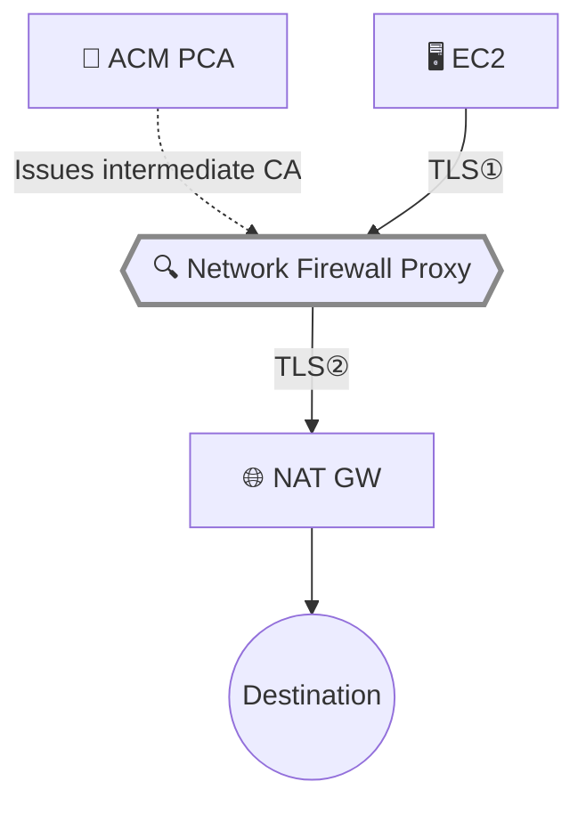

## Introduction

In the [previous article](/en/blog/2026/03/26/nfw-proxy-setup-domain-filtering), we set up Network Firewall Proxy without TLS intercept and verified PreDNS phase domain filtering. While PreDNS alone provides domain-based egress control, inspecting the contents of HTTPS traffic — HTTP methods, URI paths, response Content-Type — requires the proxy to terminate and decrypt TLS.

This article covers enabling TLS intercept with ACM Private CA, verifying PreRequest / PostResponse phase rules for HTTPS inspection, and documenting the troubleshooting experience with PCA configuration.

**Network Firewall Proxy is in Public Preview and its behavior may change before GA. This article is based on behavior observed in March 2026.**

Prerequisites:

- Environment from the [previous article](/en/blog/2026/03/26/nfw-proxy-setup-domain-filtering) (VPC, NAT Gateway, Proxy, EC2)
- ACM Private CA permissions
- RAM permissions

## How TLS Intercept Works

Without TLS intercept, the proxy only relays the CONNECT tunnel — the TLS handshake occurs directly between client and destination. The proxy cannot inspect encrypted payloads, and PreRequest / PostResponse rules only match IP-based conditions.

With TLS intercept enabled, the proxy terminates the client's TLS session and establishes a new one with the destination. It generates a certificate for the destination domain, signed by ACM Private CA. Clients must trust the Root CA certificate in their trust store.



- **TLS①**: Client ↔ Proxy (proxy-generated certificate)
- **TLS②**: Proxy ↔ Destination (real server certificate)

## ACM Private CA Setup

The following commands use `ROOT_PCA_ARN` and `PROXY_ARN` variables throughout. Set up `PROXY_ARN` first.

```bash title="Terminal"
# Get Proxy ARN (created in previous article)
PROXY_ARN=$(aws network-firewall describe-proxy --proxy-name nfw-proxy-test \
  --region us-east-2 --query 'Proxy.ProxyArn' --output text)
echo "PROXY_ARN: $PROXY_ARN"
```

<details className="my-4 rounded-lg border border-border bg-muted/30 p-4">
<summary className="cursor-pointer font-medium">Step 1: Create Root CA and install self-signed certificate</summary>

```bash title="Terminal"
# Create Root CA
ROOT_PCA_ARN=$(aws acm-pca create-certificate-authority \
  --certificate-authority-configuration '{
    "KeyAlgorithm": "RSA_2048",
    "SigningAlgorithm": "SHA256WITHRSA",
    "Subject": {"CommonName": "NFW Proxy Test Root CA", "Organization": "Test", "Country": "US"}
  }' \
  --certificate-authority-type ROOT \
  --region us-east-2 \
  --query CertificateAuthorityArn --output text)

# Get CSR → issue self-signed cert → import
aws acm-pca get-certificate-authority-csr \
  --certificate-authority-arn "$ROOT_PCA_ARN" \
  --output text --region us-east-2 > /tmp/root-ca.csr

CERT_ARN=$(aws acm-pca issue-certificate \
  --certificate-authority-arn "$ROOT_PCA_ARN" \
  --csr fileb:///tmp/root-ca.csr \
  --signing-algorithm SHA256WITHRSA \
  --template-arn arn:aws:acm-pca:::template/RootCACertificate/V1 \
  --validity Value=3650,Type=DAYS \
  --region us-east-2 \
  --query CertificateArn --output text)

sleep 5

aws acm-pca get-certificate \
  --certificate-authority-arn "$ROOT_PCA_ARN" \
  --certificate-arn "$CERT_ARN" \
  --output text --region us-east-2 > /tmp/root-ca-cert.pem

aws acm-pca import-certificate-authority-certificate \
  --certificate-authority-arn "$ROOT_PCA_ARN" \
  --certificate fileb:///tmp/root-ca-cert.pem \
  --region us-east-2

echo "ROOT_PCA_ARN: $ROOT_PCA_ARN"
```

Subsequent steps use `$ROOT_PCA_ARN`.

</details>

### RAM Resource Share Configuration

The proxy needs RAM resource sharing to issue certificates via PCA.

<details className="my-4 rounded-lg border border-border bg-muted/30 p-4">
<summary className="cursor-pointer font-medium">Step 2: Create RAM resource share</summary>

```bash title="Terminal"

aws ram create-resource-share \
  --name nfw-proxy-pca-share \
  --resource-arns "$ROOT_PCA_ARN" \
  --principals proxy.network-firewall.amazonaws.com \
  --permission-arns "arn:aws:ram::aws:permission/AWSRAMSubordinateCACertificatePathLen0IssuanceCertificateAuthority" \
  --sources "$PROXY_ARN" \
  --region us-east-2
```

RAM automatically generates a resource policy on the PCA. However, during Preview this alone was not sufficient.

</details>

### The PCA Policy Gotcha (Preview-Specific)

This was the biggest stumbling block. With only the RAM share using `proxy.network-firewall.amazonaws.com`, TLS intercept enablement fails with `Access denied while generating intermediate CA certificate`.

Investigation revealed that the [security documentation](https://docs.aws.amazon.com/network-firewall/latest/developerguide/proxy-security.html#proxy-pca-configuration) uses **`preprod.proxy.network-firewall.amazonaws.com`** as the service principal. During Preview, **both** the RAM share (non-preprod) and PCA policy (preprod) are required. The service principal will likely be unified at GA.

<details className="my-4 rounded-lg border border-border bg-muted/30 p-4">
<summary className="cursor-pointer font-medium">PCA policy configuration (RAM auto-generated + preprod principal)</summary>

```bash title="Terminal"
cat > /tmp/pca-policy.json << 'EOF'
{
  "Version": "2012-10-17",
  "Statement": [
    {
      "Sid": "ram-read",
      "Effect": "Allow",
      "Principal": {"Service": "proxy.network-firewall.amazonaws.com"},
      "Action": ["acm-pca:DescribeCertificateAuthority","acm-pca:GetCertificate",
                  "acm-pca:GetCertificateAuthorityCertificate","acm-pca:ListPermissions","acm-pca:ListTags"],
      "Resource": "<ROOT_PCA_ARN>",
      "Condition": {"ArnEquals": {"aws:SourceArn": "<PROXY_ARN>"}}
    },
    {
      "Sid": "ram-issue",
      "Effect": "Allow",
      "Principal": {"Service": "proxy.network-firewall.amazonaws.com"},
      "Action": "acm-pca:IssueCertificate",
      "Resource": "<ROOT_PCA_ARN>",
      "Condition": {
        "StringEquals": {"acm-pca:TemplateArn": "arn:aws:acm-pca:::template/SubordinateCACertificate_PathLen0/V1"},
        "ArnEquals": {"aws:SourceArn": "<PROXY_ARN>"}
      }
    },
    {
      "Sid": "preprod-all",
      "Effect": "Allow",
      "Principal": {"Service": "preprod.proxy.network-firewall.amazonaws.com"},
      "Action": ["acm-pca:DescribeCertificateAuthority","acm-pca:GetCertificate",
                  "acm-pca:GetCertificateAuthorityCertificate","acm-pca:IssueCertificate",
                  "acm-pca:ListPermissions","acm-pca:ListTags"],
      "Resource": "<ROOT_PCA_ARN>",
      "Condition": {"ArnEquals": {"aws:SourceArn": "<PROXY_ARN>"}}
    }
  ]
}
EOF

aws acm-pca put-policy \
  --resource-arn "$ROOT_PCA_ARN" \
  --policy file:///tmp/pca-policy.json \
  --region us-east-2
```

Replace `<ROOT_PCA_ARN>` and `<PROXY_ARN>` with your environment values.

</details>

With this configuration, TLS intercept enablement succeeded.

### Enabling TLS Intercept on the Proxy

<details className="my-4 rounded-lg border border-border bg-muted/30 p-4">
<summary className="cursor-pointer font-medium">Proxy update command</summary>

```bash title="Terminal"
UPDATE_TOKEN=$(aws network-firewall describe-proxy --proxy-name nfw-proxy-test \
  --region us-east-2 --query UpdateToken --output text)

aws network-firewall update-proxy \
  --proxy-name nfw-proxy-test \
  --nat-gateway-id nat-xxx \
  --tls-intercept-properties "PcaArn=$ROOT_PCA_ARN,TlsInterceptMode=ENABLED" \
  --update-token "$UPDATE_TOKEN" \
  --region us-east-2
```

Transition from `MODIFYING` to `COMPLETED` took about 5 minutes.

```json title="Output"
{
  "State": "ATTACHED",
  "ModifyState": "COMPLETED",
  "TLS": {
    "PcaArn": "arn:aws:acm-pca:us-east-2:<account-id>:certificate-authority/<ca-id>",
    "TlsInterceptMode": "ENABLED"
  }
}
```

</details>

### Installing the CA Certificate on Clients

Clients need the Root CA certificate in their trust store to trust proxy-generated certificates. Since the EC2 instance is in a private subnet, write the certificate via SSM.

```bash title="Terminal"
# Base64-encode the Root CA cert and write to EC2 via SSM
ROOT_CERT_B64=$(aws acm-pca get-certificate-authority-certificate \
  --certificate-authority-arn "$ROOT_PCA_ARN" \
  --region us-east-2 --query Certificate --output text | base64 -w0)

aws ssm send-command \
  --instance-ids <instance-id> \
  --document-name "AWS-RunShellScript" \
  --parameters "commands=[
    \"echo '$ROOT_CERT_B64' | base64 -d | sudo tee /etc/pki/ca-trust/source/anchors/nfw-proxy-root-ca.pem > /dev/null\",
    \"sudo update-ca-trust\",
    \"echo 'CA cert installed'\"
  ]" --region us-east-2
```

## Verification 1: HTTP Method Blocking (PreRequest Phase)

Verify that HTTP methods can be filtered with TLS intercept enabled. We use httpbin.org for testing, so first add it to the PreDNS allowlist.

<details className="my-4 rounded-lg border border-border bg-muted/30 p-4">
<summary className="cursor-pointer font-medium">Add httpbin.org to allowlist + create PreRequest rules</summary>

```bash title="Terminal"
# Add httpbin.org to PreDNS allowlist
aws network-firewall create-proxy-rules \
  --proxy-rule-group-name domain-allowlist \
  --rules '{
    "PreDNS": [{
      "ProxyRuleName": "allow-httpbin",
      "Action": "ALLOW",
      "InsertPosition": 2,
      "Conditions": [{"ConditionKey":"request:DestinationDomain","ConditionOperator":"StringEquals","ConditionValues":["httpbin.org"]}]
    }]
  }' --region us-east-2

# Create PreRequest rule group
aws network-firewall create-proxy-rule-group \
  --proxy-rule-group-name tls-intercept-rules \
  --description "PreRequest and PostResponse rules" \
  --region us-east-2

aws network-firewall create-proxy-rules \
  --proxy-rule-group-name tls-intercept-rules \
  --rules '{
    "PreREQUEST": [{
      "ProxyRuleName": "block-post-method",
      "Description": "Block HTTP POST requests",
      "Action": "DENY",
      "InsertPosition": 0,
      "Conditions": [{
        "ConditionKey": "request:Http:Method",
        "ConditionOperator": "StringEquals",
        "ConditionValues": ["POST"]
      }]
    }]
  }' --region us-east-2

TOKEN=$(aws network-firewall describe-proxy-configuration \
  --proxy-configuration-name domain-allowlist-config \
  --query UpdateToken --output text --region us-east-2)

aws network-firewall attach-rule-groups-to-proxy-configuration \
  --proxy-configuration-name domain-allowlist-config \
  --rule-groups '[{"InsertPosition":1,"ProxyRuleGroupName":"tls-intercept-rules"}]' \
  --update-token "$TOKEN" --region us-east-2
```

</details>

```bash title="Terminal"
# GET request (allowed)
curl -s -o /dev/null -w "%{http_code}\n" --max-time 15 https://httpbin.org/get

# POST request (blocked)
curl -s -o /dev/null -w "%{http_code}\n" --max-time 15 -X POST -d 'test=data' https://httpbin.org/post
```

| Test | Method | Expected | Result |
|---|---|---|---|
| `https://httpbin.org/get` | GET | ALLOW | ✅ **200** |
| `https://httpbin.org/post` | POST | DENY | ✅ **403** |

Notably, **HTTP (non-TLS) POST requests are also blocked**. Since HTTP uses absolute-form requests, the proxy can inspect HTTP headers without TLS intercept.

```bash title="Terminal"
# HTTP POST (blocked even without TLS)
curl -s -o /dev/null -w "%{http_code}\n" --max-time 15 -X POST -d 'test=data' http://httpbin.org/post
# → 403
```

## Verification 2: Content-Type Filtering (PostResponse Phase)

Filter responses based on Content-Type from the destination server.

<details className="my-4 rounded-lg border border-border bg-muted/30 p-4">
<summary className="cursor-pointer font-medium">Add PostResponse rules</summary>

```bash title="Terminal"
aws network-firewall create-proxy-rules \
  --proxy-rule-group-name tls-intercept-rules \
  --rules '{
    "PostRESPONSE": [{
      "ProxyRuleName": "block-binary-content",
      "Description": "Block binary content responses",
      "Action": "DENY",
      "InsertPosition": 0,
      "Conditions": [{
        "ConditionKey": "response:Http:ContentType",
        "ConditionOperator": "StringLike",
        "ConditionValues": ["application/octet-stream*"]
      }]
    }]
  }' --region us-east-2
```

</details>

```bash title="Terminal"
# JSON response (allowed)
curl -s -o /dev/null -w "%{http_code}\n" --max-time 15 https://httpbin.org/get

# Binary response (blocked)
curl -s -o /dev/null -w "%{http_code}\n" --max-time 15 https://httpbin.org/bytes/100
```

| Test | Content-Type | Expected | Result |
|---|---|---|---|
| `https://httpbin.org/get` | application/json | ALLOW | ✅ **200** |
| `https://httpbin.org/bytes/100` | application/octet-stream | DENY | ✅ **403** |

PostResponse phase inspects the actual response from the destination before forwarding to the client. Useful for blocking executable downloads at the organization level.

## Verification 3: Certificate Inspection

Confirm what certificate the proxy presents during TLS intercept.

```bash title="Terminal"
curl -v -s -o /dev/null --max-time 15 https://httpbin.org/get 2>&1 | grep -E 'subject:|issuer:'
```

```text title="Output"
*   subject: C=US; O=AWS; OU=Network Firewall Proxy; CN=httpbin.org
*   issuer: CN=AWS Network Firewall Proxy
```

The proxy dynamically generates a certificate with the destination domain (`httpbin.org`) as CN, signed by an intermediate CA (`AWS Network Firewall Proxy`) that was automatically issued from the Root CA specified during setup.

## Limitations Discovered

### 502 Bad Gateway with Some Sites

Accessing Cloudflare-fronted `example.com` with TLS intercept enabled returned 502 Bad Gateway after a successful CONNECT tunnel and TLS handshake. The same domain worked fine over HTTP (non-TLS). `httpbin.org` worked without issues. This appears to be a Preview-stage compatibility limitation with certain CDN or server configurations.

### URI Path Matching Behavior

`request:Http:Uri` with `StringLike` matches from the **beginning of the full path**. The pattern `/admin*` matches paths starting with `/admin` (like `/admin` or `/admin/secret`), but did NOT match `/anything/admin/secret`. To match patterns anywhere in the path, prefix with a wildcard: `*/admin*`.

## Summary

- **PCA setup is the biggest Preview gotcha** — Both RAM share (`proxy.network-firewall.amazonaws.com`) and PCA policy (`preprod.proxy.network-firewall.amazonaws.com`) are required. Documentation is inconsistent between pages, requiring trial and error
- **PreRequest phase works for HTTP too** — HTTP absolute-form requests expose headers to the proxy without TLS intercept. TLS intercept is only required for HTTPS inspection
- **PostResponse blocks executable downloads** — Filtering `response:Http:ContentType` for `application/octet-stream` enables organization-level binary download prevention
- **Certificates are auto-generated** — The proxy dynamically generates per-domain certificates signed by an intermediate CA. Clients only need the Root CA certificate installed

Next up: multi-VPC architecture with PrivateLink. The environment built in this series will be reused, so cleanup will be covered in the final article.
