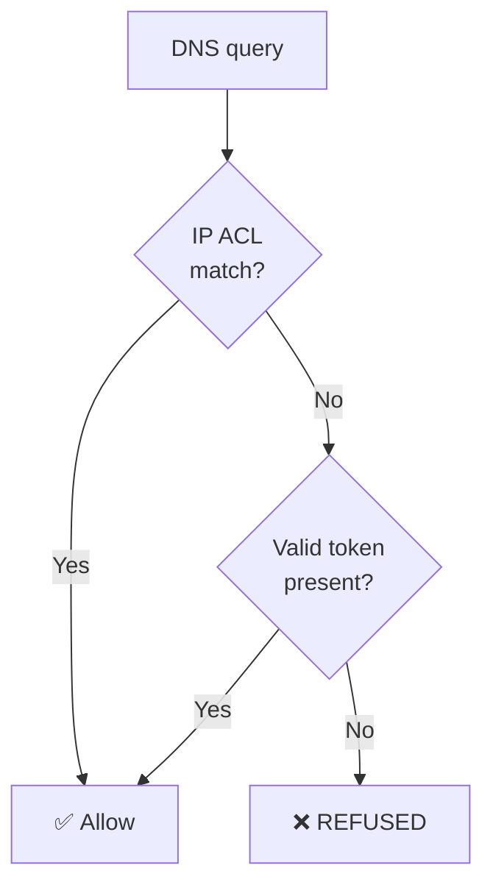

## Introduction

On March 9, 2026, AWS announced the [general availability of Amazon Route 53 Global Resolver](https://aws.amazon.com/about-aws/whats-new/2026/03/amazon-route-53-global-resolver/). Previewed at re:Invent 2025, the service is now available across 30 AWS Regions.

Global Resolver is an internet-reachable anycast DNS resolver. While the existing VPC Resolver (formerly Route 53 Resolver) is limited to VPC-internal access or connections via VPN/Direct Connect, Global Resolver can be used directly from on-premises, branch offices, and remote clients. It includes DNS filtering (malware, phishing, DGA detection) and encrypted DNS (DoH/DoT), enabling centralized DNS security management for distributed environments.

However, the minimum configuration (2 Regions + DNS filtering) costs approximately **\$3,650/month** (\$5.00/hour × 730 hours). Compared to a single VPC Resolver endpoint (~\$183/month), that's roughly 20x the cost — though this is a rough comparison since achieving equivalent functionality (multi-region + DNS filtering) with VPC Resolver would require multiple endpoints plus DNS Firewall, adding to the cost. A 30-day free trial (2 Regions + filtering + 1 billion queries) is available, and this verification was completed within the trial period.

This article walks through creating a Global Resolver, configuring IP ACL authentication (Do53), DNS filtering, and token authentication (DoH) via CLI, measuring propagation times at each step. By the end, you'll have enough data to complete a PoC and decide whether Global Resolver fits your environment. Private hosted zone resolution is out of scope — the focus is on public domain resolution and filtering.

See the official documentation at [What is Route 53 Global Resolver?](https://docs.aws.amazon.com/Route53/latest/DeveloperGuide/gr-what-is-global-resolver.html).

Prerequisites:

- AWS CLI v2 configured (`route53globalresolver:*`, `s3:*`, `logs:*` permissions)
- `jq` command available (to extract resource IDs from CLI output)
- Test Regions: us-east-1 + ap-northeast-1 (API operations require us-east-2)
- `dig` and `curl` available

Skip to [Setup](#setup) for the setup steps, or [Verification 1](#verification-1-basic-dns-resolution-with-do53--ip-acl) for results.

## Setup

<details className="my-4 rounded-lg border border-border bg-muted/30 p-4">
<summary className="cursor-pointer font-medium">Global Resolver, DNS View, and Access Source creation steps</summary>

The following commands store each resource ID in a variable for use in subsequent steps. Your environment will return different IDs, so use the values from your own output.

### Creating the Global Resolver

All Global Resolver API operations must be performed in **us-east-2 (Ohio)**. This is a service requirement, independent of the Regions where the resolver is deployed.

```bash title="Terminal (Create Global Resolver)"
REGION="us-east-2"

GR_OUTPUT=$(aws route53globalresolver create-global-resolver \
  --region $REGION \
  --name "gr-verify-blog" \
  --ip-address-type IPV4 \
  --regions us-east-1 ap-northeast-1 \
  --observability-region ap-northeast-1 \
  --tags '{"Project":"blog-verification"}')

GR_ID=$(echo $GR_OUTPUT | jq -r '.id')
DNS_NAME=$(echo $GR_OUTPUT | jq -r '.dnsName' | sed 's/\.$//')
ANYCAST_IP1=$(echo $GR_OUTPUT | jq -r '.ipv4Addresses[0]')
ANYCAST_IP2=$(echo $GR_OUTPUT | jq -r '.ipv4Addresses[1]')

echo "GR_ID: $GR_ID"
echo "DNS_NAME: $DNS_NAME"
echo "Anycast IPs: $ANYCAST_IP1, $ANYCAST_IP2"
```

```text title="Output (author's environment)"
GR_ID: gr-2a300beae2d4689
DNS_NAME: 2a300beae2d4689.route53globalresolver.global.on.aws
Anycast IPs: 166.117.74.46, 99.83.153.248
```

The initial status is `CREATING`. Poll until it becomes `OPERATIONAL`.

```bash title="Terminal (Check status)"
while true; do
  STATUS=$(aws route53globalresolver get-global-resolver \
    --region $REGION --global-resolver-id $GR_ID \
    --query 'status' --output text)
  echo "$(date +%T) - $STATUS"
  [ "$STATUS" = "OPERATIONAL" ] && break
  sleep 15
done
```

**Result: approximately 11 minutes from creation to OPERATIONAL.**

### Creating a DNS View

A DNS View is a configuration unit for applying different DNS policies (authentication methods, filtering rules, private hosted zone associations) to different client groups. You can create multiple DNS Views per Global Resolver to implement split-horizon DNS. For this verification, we create just one.

```bash title="Terminal (Create DNS View)"
DNSV_ID=$(aws route53globalresolver create-dns-view \
  --region $REGION \
  --global-resolver-id $GR_ID \
  --name "view-verify" \
  --query 'id' --output text)

echo "DNSV_ID: $DNSV_ID"
```

**Approximately 1 minute to OPERATIONAL.** DNS Views are enabled by default upon creation (`enable-dns-view` is not needed).

### Creating an Access Source (IP ACL)

Allow your global IP address for the Do53 protocol.

```bash title="Terminal (Create Access Source)"
MY_IP=$(curl -s https://checkip.amazonaws.com)

aws route53globalresolver create-access-source \
  --region $REGION \
  --dns-view-id $DNSV_ID \
  --cidr "${MY_IP}/32" \
  --ip-address-type IPV4 \
  --protocol DO53
```

**Approximately 1 minute to OPERATIONAL.**

</details>

## Verification 1: Basic DNS Resolution with Do53 + IP ACL

Query public domains against the anycast IP addresses returned by Global Resolver using `dig`. Anycast means the same IP address is shared across multiple Regions, and queries are automatically routed to the nearest one. The following commands use variables (`$ANYCAST_IP1`, `$ANYCAST_IP2`, `$DNS_NAME`, etc.) set during setup.

```bash title="Terminal"
dig @$ANYCAST_IP1 example.com A +noall +answer +stats
```

```text title="Output (author's environment)"
example.com.        187     IN  A   104.18.26.120
example.com.        187     IN  A   104.18.27.120
;; Query time: 12 msec
;; SERVER: 166.117.74.46#53(166.117.74.46) (UDP)
```

A 12ms response. The second anycast IP works identically.

```bash title="Terminal"
dig @$ANYCAST_IP2 example.com A +short
```

```text title="Output"
104.18.26.120
104.18.27.120
```

Multiple domains also resolve correctly.

```bash title="Terminal"
dig @$ANYCAST_IP1 aws.amazon.com A +short
dig @$ANYCAST_IP1 google.com A +short
dig @$ANYCAST_IP1 github.com A +short
```

```text title="Output"
# aws.amazon.com
tp.8e49140c2-frontier.amazon.com.
dr49lng3n1n2s.cloudfront.net.
18.65.168.18
...

# google.com
142.251.23.102
...

# github.com
20.27.177.113
```

All resolved successfully. Total time from Global Resolver creation to first successful query: **approximately 13 minutes** (Global Resolver 11 min + DNS View 1 min + Access Source 1 min).

## Verification 2: DNS Filtering (BLOCK and ALERT Rules)

Global Resolver's DNS filtering uses the same mechanism as Route 53 Resolver DNS Firewall. You add rules to a DNS View, each specifying a domain list (custom or AWS-managed) and an action (ALLOW / BLOCK / ALERT). Rules are evaluated in ascending priority order, and the first matching rule's action is applied.

### BLOCK with Custom Domain Lists

Since individual domains in Managed Domain Lists are not publicly visible, a custom domain list ensures reproducible blocking.

<details className="my-4 rounded-lg border border-border bg-muted/30 p-4">
<summary className="cursor-pointer font-medium">Custom domain list creation steps (BLOCK + ALERT)</summary>

Domain list creation and domain import require uploading a file via S3.

```bash title="Terminal (Create S3 bucket)"
BUCKET_NAME="gr-verify-domains-$(date +%s)"
aws s3 mb s3://$BUCKET_NAME --region us-east-2
```

**BLOCK domain list**

```bash title="Terminal (Create BLOCK domain list)"
FDL_BLOCK_ID=$(aws route53globalresolver create-firewall-domain-list \
  --region $REGION \
  --global-resolver-id $GR_ID \
  --name "test-block-list" \
  --query 'id' --output text)

echo "FDL_BLOCK_ID: $FDL_BLOCK_ID"

# Wait for OPERATIONAL (~1 minute)
```

```bash title="Terminal (Import domains via S3)"
echo -e "blocked-test.example.com\nanother-blocked.example.net" > /tmp/block-domains.txt
aws s3 cp /tmp/block-domains.txt s3://$BUCKET_NAME/block-domains.txt

aws route53globalresolver import-firewall-domains \
  --region $REGION \
  --firewall-domain-list-id $FDL_BLOCK_ID \
  --domain-file-url "s3://${BUCKET_NAME}/block-domains.txt" \
  --operation REPLACE
```

**ALERT domain list**

```bash title="Terminal (Create ALERT domain list)"
FDL_ALERT_ID=$(aws route53globalresolver create-firewall-domain-list \
  --region $REGION \
  --global-resolver-id $GR_ID \
  --name "test-alert-list" \
  --query 'id' --output text)

echo "FDL_ALERT_ID: $FDL_ALERT_ID"

# Wait for OPERATIONAL (~1 minute)
```

```bash title="Terminal (Import domains via S3)"
echo "alert-test.example.org" > /tmp/alert-domains.txt
aws s3 cp /tmp/alert-domains.txt s3://$BUCKET_NAME/alert-domains.txt

aws route53globalresolver import-firewall-domains \
  --region $REGION \
  --firewall-domain-list-id $FDL_ALERT_ID \
  --domain-file-url "s3://${BUCKET_NAME}/alert-domains.txt" \
  --operation REPLACE
```

</details>

Create a BLOCK rule.

```bash title="Terminal (Create BLOCK rule)"
aws route53globalresolver create-firewall-rule \
  --region $REGION \
  --dns-view-id $DNSV_ID \
  --name "block-custom-domains" \
  --firewall-domain-list-id $FDL_BLOCK_ID \
  --action BLOCK \
  --block-response NXDOMAIN \
  --priority 50
```

A note here: the [Firewall rule configuration guide](https://docs.aws.amazon.com/Route53/latest/DeveloperGuide/gr-configure-manage-firewall-rules.html) recommends priority values of 100-999, but **the actual maximum is 100**. Specifying 1000 results in a `ServiceQuotaExceededException` (`Priority value 1000 exceeds the maximum allowed value of 100`). This may be due to documentation not yet being updated post-GA — as of April 2026, the documented recommendations and actual constraints do not match.

Propagation timing from rule creation to effective blocking:

```text title="Output (Propagation measurement)"
08:56:44 - Immediately after creation → No response (empty)
08:56:59 - 15 seconds later           → NXDOMAIN ✓
08:57:14 - 30 seconds later           → NXDOMAIN ✓
```

**Blocking took effect within approximately 15 seconds of rule creation.** Filtering propagation is very fast.

Non-blocked domains continue to resolve normally.

```bash title="Terminal"
# Not blocked
dig @$ANYCAST_IP1 example.com A +short
# → 104.18.26.120, 104.18.27.120 (normal)

# Blocked
dig @$ANYCAST_IP1 another-blocked.example.net A +noall +comments
# → status: NXDOMAIN (blocked)
```

### BLOCK with Managed Domain Lists

AWS-managed threat domain lists are also available.

```bash title="Terminal"
aws route53globalresolver list-managed-firewall-domain-lists \
  --region $REGION \
  --managed-firewall-domain-list-type THREAT
```

```text title="Output (summarized, actual output is JSON)"
Malware                          (aws-managed-fdl-11)
Botnet/Command and Control       (aws-managed-fdl-12)
Aggregate Threat List            (aws-managed-fdl-14)
Amazon GuardDuty Threat List     (aws-managed-fdl-15)
Phishing                         (aws-managed-fdl-16)
Spam                             (aws-managed-fdl-17)
```

```bash title="Terminal"
aws route53globalresolver create-firewall-rule \
  --region $REGION \
  --dns-view-id $DNSV_ID \
  --name "block-aggregate-threats" \
  --firewall-domain-list-id aws-managed-fdl-14 \
  --action BLOCK \
  --block-response NXDOMAIN \
  --priority 40
```

Since individual domains in Managed Domain Lists are not visible, use custom domain lists for reliable block verification.

### ALERT Rules

ALERT rules allow queries through while logging them for monitoring.

```bash title="Terminal"
aws route53globalresolver create-firewall-rule \
  --region $REGION \
  --dns-view-id $DNSV_ID \
  --name "alert-test-domains" \
  --firewall-domain-list-id $FDL_ALERT_ID \
  --action ALERT \
  --priority 60
```

Queries to ALERT-targeted domains resolve normally.

```bash title="Terminal"
dig @$ANYCAST_IP1 alert-test.example.org A +noall +comments
```

```text title="Output"
;; ->>HEADER<<- opcode: QUERY, status: NOERROR, id: 40497
```

`NOERROR` (normal response) — not blocked. Viewing the logs requires configuring query log delivery, but **the CLI currently has no commands for log configuration — it's only available through the console**. This is a limitation for CLI-only workflows.

So far, all verification has used Do53 (plaintext DNS). Since Do53 transmits query content in cleartext, remote clients face the risk of DNS query interception. The next verification switches to encrypted DNS (DoH) and confirms that filtering works identically over encrypted connections.

## Verification 3: DoH + Token Authentication

### Creating an Access Token

To use token authentication with DoH, create an Access Token.

```bash title="Terminal"
TOKEN_OUTPUT=$(aws route53globalresolver create-access-token \
  --region $REGION \
  --dns-view-id $DNSV_ID \
  --name "verify-token")

TOKEN=$(echo $TOKEN_OUTPUT | jq -r '.value')
echo "Token: $TOKEN"
```

```text title="Output (author's environment)"
Token: AaCf58VoiqQPPYDgYcukS-w31bmqv9nELag6mipESeC0ZAN5Ckqa5wU1zN68sURw
```

**Approximately 1.5 minutes to OPERATIONAL.** Default token expiration is 1 year.

### Executing DoH Queries

DoH queries use `curl` to send RFC 8484 GET requests. **Tokens are passed as a URL parameter `?token=<value>`, not as an Authorization header.** This is documented but differs from typical OAuth/Bearer token conventions, so take note.

DoH requires sending DNS queries in [wire format](https://datatracker.ietf.org/doc/html/rfc1035#section-4.1). The following helper functions let you run DoH queries for any domain.

<details className="my-4 rounded-lg border border-border bg-muted/30 p-4">
<summary className="cursor-pointer font-medium">DoH helper function definitions</summary>

```bash title="Terminal (Helper function definitions)"
# Convert a domain name to DNS wire format
dns_wire_encode() {
  local domain=$1
  local hex=""
  IFS='.' read -ra labels <<< "$domain"
  for label in "${labels[@]}"; do
    hex+=$(printf '%02x' ${#label})
    hex+=$(echo -n "$label" | xxd -p)
  done
  hex+="00"  # root label
  echo "$hex"
}

# Execute a DoH GET query
doh_query() {
  local domain=$1
  local token_param=$2
  local encoded=$(dns_wire_encode "$domain")
  # DNS header (12 bytes) + Question (domain + type A + class IN)
  local query_hex="000001000001000000000000${encoded}00010001"
  local dns_b64=$(echo "$query_hex" | xxd -r -p | base64 -w0 | tr '+/' '-_' | tr -d '=')

  if [ -n "$token_param" ]; then
    curl -s -H "Accept: application/dns-message" \
      "https://${DNS_NAME}/dns-query?token=${token_param}&dns=${dns_b64}" \
      -w "\nHTTP Status: %{http_code}"
  else
    curl -s -H "Accept: application/dns-message" \
      "https://${DNS_NAME}/dns-query?dns=${dns_b64}" \
      -w "\nHTTP Status: %{http_code}"
  fi
}
```

</details>

To accurately verify token authentication, test without a DoH IP ACL Access Source. The Access Source created during setup is Do53-only and does not affect DoH. No additional steps are needed to test token authentication (the issue of IP ACLs bypassing token auth is discussed below).

```bash title="Terminal (DoH query)"
doh_query "example.com" "$TOKEN" -o response.bin
```

```text title="Output"
HTTP Status: 200
```

HTTP 200 with a valid DNS response. The binary response contains `8180` (NOERROR) with A records for example.com.

### Invalid Token Rejection

```bash title="Terminal"
# Invalid token
doh_query "example.com" "INVALID_TOKEN" -o bad.bin

# No token
doh_query "example.com" "" -o none.bin
```

Both return HTTP 200, but the DNS response flags are `8105` (**REFUSED**). The HTTP-level 200 with DNS-level REFUSED behavior may require attention when implementing DoH client error handling.

| Request | HTTP Status | DNS Flags | Result |
| --- | --- | --- | --- |
| Valid token | 200 | `8180` (NOERROR) | Resolution succeeded |
| Invalid token | 200 | `8105` (REFUSED) | Rejected |
| No token | 200 | `8105` (REFUSED) | Rejected |

### DNS Filtering over DoH

Confirm that BLOCK rules from Verification 2 work over DoH.

```bash title="Terminal"
doh_query "blocked-test.example.com" "$TOKEN" -o blocked.bin
```

The DNS response flags are `8503` (**NXDOMAIN**). DNS filtering works correctly over DoH.

| Domain | Protocol | DNS Flags | Result |
| --- | --- | --- | --- |
| example.com | DoH + token | `8180` (NOERROR) | Resolved |
| blocked-test.example.com | DoH + token | `8503` (NXDOMAIN) | Blocked |
| google.com | DoH + token | `8180` (NOERROR) | Resolved |

### IP ACL and Token Authentication Relationship

An important behavior discovered during verification: **IP ACL and token authentication are evaluated as OR conditions.** If a DoH IP ACL Access Source exists on the same DNS View alongside token authentication, DoH queries pass through without a token as long as the source IP matches the ACL.



To enforce strict token authentication, either don't create a DoH IP ACL Access Source, or restrict it to intended IP ranges only.

## Summary

### Verification Results Comparison

| Aspect | Do53 + IP ACL | DoH + Token |
| --- | --- | --- |
| Authentication | IP/CIDR-based | Token (URL parameter) |
| Encryption | None | TLS (HTTPS) |
| Port | 53 (UDP) | 443 (HTTPS) |
| Setup steps | 3 (GR + View + Access Source) | 4 (+ Token creation) |
| Time to first query | ~13 minutes | ~14.5 minutes (+1.5 min for Token) |
| Remote client suitability | Requires static IP | Works with dynamic IPs |
| Firewall traversal | Requires UDP/53 open | Passes as regular HTTPS |
| Filtering behavior | Immediate NXDOMAIN block | Same NXDOMAIN block |

### Cost-Effectiveness Assessment

Global Resolver pricing:

| Configuration | Hourly Rate | Monthly Estimate |
| --- | --- | --- |
| 2 Regions + filtering | \$5.00/h | **\$3,650** |
| 2 Regions (no filtering) | \$4.50/h | \$3,285 |
| 5 Regions + filtering | \$9.50/h | \$6,935 |
| VPC Resolver endpoint, 1 endpoint with 2 ENIs (reference) | \$0.25/h | \$183 |

Global Resolver is a good fit when:
- You need unified DNS security policies across multiple remote client locations
- VPN infrastructure operational costs (including personnel) exceed Global Resolver costs
- You need DNS filtering for remote workers without static IPs

VPC Resolver is sufficient when:
- Few locations with existing VPN/Direct Connect infrastructure
- DNS filtering is limited to VPC-hosted workloads
- Cost optimization is the top priority

The 30-day free trial (2 Regions + filtering + 1 billion queries) makes it practical to assess your query volume and filtering requirements before committing.

### Key Insights

- **Propagation is fast, initial setup is slow** — Firewall rules take effect within 15 seconds, but Global Resolver creation takes about 11 minutes. Since rule changes propagate immediately after initial setup, ongoing operational overhead is likely low.
- **Tokens go in the URL parameter** — DoH token authentication uses `?token=<value>`, not an Authorization header. Watch for this when configuring DoH clients.
- **No CLI support for log configuration** — Query log delivery setup is console-only. IaC environments will need CloudFormation or Terraform support for this.
- **Priority cap is 100** — The Firewall rule configuration guide recommends 100-999, but the actual maximum is 100. This may be a documentation gap post-GA — follow the actual limit when designing rules.

## Cleanup

<details className="my-4 rounded-lg border border-border bg-muted/30 p-4">
<summary className="cursor-pointer font-medium">Resource deletion commands</summary>

Delete in reverse creation order. The following commands use variables set during setup. Use `list-*` commands to look up resource IDs.

```bash title="Terminal (Look up resource IDs)"
# Firewall rules
aws route53globalresolver list-firewall-rules \
  --region $REGION --dns-view-id $DNSV_ID

# Access tokens
aws route53globalresolver list-access-tokens \
  --region $REGION --dns-view-id $DNSV_ID

# Access sources
aws route53globalresolver list-access-sources \
  --region $REGION --dns-view-id $DNSV_ID
```

```bash title="Terminal (Cleanup)"
# Delete firewall rules (use IDs from list-firewall-rules)
aws route53globalresolver delete-firewall-rule --region $REGION \
  --firewall-rule-id <BLOCK_RULE_ID> --dns-view-id $DNSV_ID
aws route53globalresolver delete-firewall-rule --region $REGION \
  --firewall-rule-id <MANAGED_BLOCK_RULE_ID> --dns-view-id $DNSV_ID
aws route53globalresolver delete-firewall-rule --region $REGION \
  --firewall-rule-id <ALERT_RULE_ID> --dns-view-id $DNSV_ID

# Delete access token
aws route53globalresolver delete-access-token --region $REGION \
  --access-token-id <TOKEN_ID>

# Delete access source
aws route53globalresolver delete-access-source --region $REGION \
  --access-source-id <ACCESS_SOURCE_ID>

# Delete domain lists
aws route53globalresolver delete-firewall-domain-list --region $REGION \
  --firewall-domain-list-id $FDL_BLOCK_ID
aws route53globalresolver delete-firewall-domain-list --region $REGION \
  --firewall-domain-list-id $FDL_ALERT_ID

# Delete DNS View
aws route53globalresolver delete-dns-view --region $REGION \
  --dns-view-id $DNSV_ID

# Delete Global Resolver
aws route53globalresolver delete-global-resolver --region $REGION \
  --global-resolver-id $GR_ID

# Delete S3 bucket
aws s3 rb s3://$BUCKET_NAME --force --region us-east-2
```

</details>
