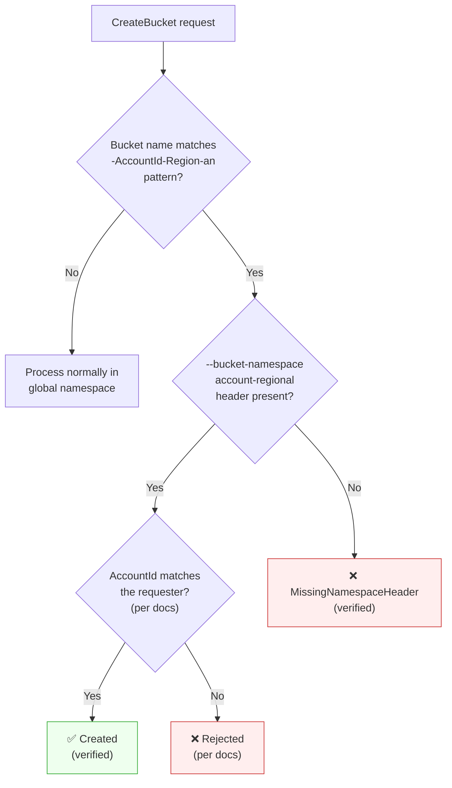

## Introduction

On March 12, 2026, AWS [announced account regional namespaces for Amazon S3 general purpose buckets](https://aws.amazon.com/about-aws/whats-new/2026/03/amazon-s3-account-regional-namespaces/).

S3 general purpose bucket names must be globally unique within a partition. This means your preferred name might already be taken by another account, and deleted bucket names can be re-created by anyone. The new feature lets you create buckets in your own account regional namespace by appending an account-specific suffix to the bucket name. Any attempt by another account to use your suffix is automatically rejected.

This article verifies account regional bucket creation, naming constraints, and IAM-based organizational enforcement via CLI, providing the data you need to decide whether to adopt this feature. See the official documentation at [Namespaces for general purpose buckets](https://docs.aws.amazon.com/AmazonS3/latest/userguide/gpbucketnamespaces.html).

This feature is available in all AWS Regions except Middle East (Bahrain) and Middle East (UAE), at no additional cost. Existing global buckets cannot be renamed to account regional namespace names, but you can adopt the new namespace incrementally for new buckets.

Prerequisites:

- AWS CLI v2 (`s3:*`, `iam:*`, `sts:*` permissions)
- jq (JSON parser, used in verification 3 for `assume-role`)
- Test regions: us-east-1, ap-southeast-1

The following commands use these environment variables. Set them for your own environment:

```bash title="Terminal (environment setup)"
export ACCOUNT_ID=$(aws sts get-caller-identity --query Account --output text)
export REGION="us-east-1"
echo "Account ID: $ACCOUNT_ID"
```

## Verification 1: Creating an Account Regional Bucket

Account regional namespace bucket names follow this format:

```text title="Naming convention"
{prefix}-{AccountId}-{Region}-an
```

`prefix` is the user-defined portion, and `-an` stands for account-regional namespace. The documentation states that these buckets "support all the S3 features" that global namespace buckets support. Let's verify.

### Bucket creation

Specify `--bucket-namespace account-regional` when creating. In `us-east-1`, no `LocationConstraint` is needed, making it the simplest pattern.

```bash title="Terminal"
aws s3api create-bucket \
  --bucket "my-ns-test-${ACCOUNT_ID}-${REGION}-an" \
  --bucket-namespace account-regional \
  --region "$REGION"
```

```json title="Output"
{
    "Location": "/my-ns-test-<account-id>-us-east-1-an",
    "BucketArn": "arn:aws:s3:::my-ns-test-<account-id>-us-east-1-an"
}
```

Created successfully.

### Object operations

PUT, GET, and DELETE all work as expected.

<details className="my-4 rounded-lg border border-border bg-muted/30 p-4">
<summary className="cursor-pointer font-medium">Object operation commands (PUT / GET / DELETE)</summary>

```bash title="Terminal"
BUCKET="my-ns-test-${ACCOUNT_ID}-${REGION}-an"

# Create a test file
echo "hello from account-regional namespace" > /tmp/s3-ns-test.txt

# PUT
aws s3api put-object \
  --bucket "$BUCKET" \
  --key test.txt \
  --body /tmp/s3-ns-test.txt \
  --region "$REGION"

# GET
aws s3api get-object \
  --bucket "$BUCKET" \
  --key test.txt \
  /tmp/s3-ns-get.txt \
  --region "$REGION"
cat /tmp/s3-ns-get.txt

# DELETE
aws s3api delete-object \
  --bucket "$BUCKET" \
  --key test.txt \
  --region "$REGION"
```

</details>

No differences from global buckets in day-to-day operations.

### Metadata inspection

`head-bucket` returns `BucketArn` and `BucketRegion`, but no namespace-specific field.

```bash title="Terminal"
aws s3api head-bucket \
  --bucket "my-ns-test-${ACCOUNT_ID}-${REGION}-an" \
  --region "$REGION"
```

```json title="Output"
{
    "BucketArn": "arn:aws:s3:::my-ns-test-<account-id>-us-east-1-an",
    "BucketRegion": "us-east-1",
    "AccessPointAlias": false
}
```

`ListBuckets` is the same — there is no `BucketNamespace` field. As of now, the only way to identify account regional buckets in API responses is by the `-an` suffix in the name.

The bucket name turned out quite long. How many characters can we actually use for the prefix? Let's find out.

## Verification 2: How Many Characters Can You Use? Per-Region Comparison

### Suffix length calculation

The suffix format is `-{AccountId(12 digits)}-{Region}-an`, giving a length of `17 + len(Region)` characters. With the 63-character bucket name limit, the maximum prefix length is `46 - len(Region)`.

Here's a comparison across representative regions:

| Region | Region length | Suffix length | Max prefix length |
|---|---|---|---|
| us-east-1 | 9 | 26 | 37 |
| us-west-2 | 9 | 26 | 37 |
| eu-west-1 | 9 | 26 | 37 |
| ap-south-1 | 10 | 27 | 36 |
| eu-central-1 | 12 | 29 | 34 |
| ap-northeast-1 | 14 | 31 | 32 |
| ap-southeast-1 | 14 | 31 | 32 |

Longer region names mean shorter prefixes. `us-east-1` allows 37 characters, while `ap-northeast-1` (Tokyo) only allows 32 — a 5-character difference that can matter for naming conventions like `my-app-prod-data`.

### Boundary testing

Creating a bucket at exactly 63 characters (prefix = 37 in us-east-1):

```bash title="Terminal (prefix 37 chars = 63 total → success)"
PREFIX=$(printf 'a%.0s' {1..37})
aws s3api create-bucket \
  --bucket "${PREFIX}-${ACCOUNT_ID}-${REGION}-an" \
  --bucket-namespace account-regional \
  --region "$REGION"
```

Success. At 64 characters (prefix = 38):

```bash title="Terminal (prefix 38 chars = 64 total → failure)"
PREFIX=$(printf 'a%.0s' {1..38})
aws s3api create-bucket \
  --bucket "${PREFIX}-${ACCOUNT_ID}-${REGION}-an" \
  --bucket-namespace account-regional \
  --region "$REGION"
```

```text title="Output"
An error occurred (InvalidBucketName) when calling the CreateBucket operation:
The specified bucket is not valid.
```

The 63-character limit is strictly enforced. I also confirmed the same result in `ap-southeast-1`.

<details className="my-4 rounded-lg border border-border bg-muted/30 p-4">
<summary className="cursor-pointer font-medium">Boundary test in ap-southeast-1 (prefix 32 chars = 63 total)</summary>

```bash title="Terminal"
PREFIX=$(printf 'a%.0s' {1..32})
aws s3api create-bucket \
  --bucket "${PREFIX}-${ACCOUNT_ID}-ap-southeast-1-an" \
  --bucket-namespace account-regional \
  --region ap-southeast-1 \
  --create-bucket-configuration LocationConstraint=ap-southeast-1
```

Note: regions other than `us-east-1` require `--create-bucket-configuration LocationConstraint=<region>`.

</details>

For multi-region deployments, design your prefix length around the region with the longest name.

Now that we understand the naming rules, how do we ensure the entire organization follows them?

## Verification 3: Enforcing Account Regional Namespaces Across Your Organization

The `s3:x-amz-bucket-namespace` condition key lets you deny global namespace bucket creation via IAM policy.

### IAM policy

This Deny policy rejects any `CreateBucket` request where the `x-amz-bucket-namespace` header is not set to `account-regional`.

```json title="S3RequireAccountRegionalNamespace policy"
{
  "Version": "2012-10-17",
  "Statement": [
    {
      "Sid": "RequireAccountRegionalBucketCreation",
      "Effect": "Deny",
      "Action": "s3:CreateBucket",
      "Resource": "*",
      "Condition": {
        "StringNotEquals": {
          "s3:x-amz-bucket-namespace": "account-regional"
        }
      }
    }
  ]
}
```

I attached this policy along with `AmazonS3FullAccess` to a test IAM role. In IAM's evaluation logic, an explicit Deny always overrides an Allow, so combining S3FullAccess (Allow) with the Deny policy above blocks only global bucket creation.

I used a dedicated test role with `assume-role` rather than attaching the Deny policy to my own role. This avoids the risk of forgetting to detach the policy after testing.

<details className="my-4 rounded-lg border border-border bg-muted/30 p-4">
<summary className="cursor-pointer font-medium">Test IAM role setup</summary>

```bash title="Terminal"
# Create the Deny policy file
cat > /tmp/s3-ns-deny-policy.json << 'EOF'
{
  "Version": "2012-10-17",
  "Statement": [
    {
      "Sid": "RequireAccountRegionalBucketCreation",
      "Effect": "Deny",
      "Action": "s3:CreateBucket",
      "Resource": "*",
      "Condition": {
        "StringNotEquals": {
          "s3:x-amz-bucket-namespace": "account-regional"
        }
      }
    }
  ]
}
EOF

# Create the trust policy
cat > /tmp/s3-ns-trust-policy.json << EOF
{
  "Version": "2012-10-17",
  "Statement": [
    {
      "Effect": "Allow",
      "Principal": {
        "AWS": "arn:aws:iam::${ACCOUNT_ID}:root"
      },
      "Action": "sts:AssumeRole"
    }
  ]
}
EOF

# Create role
aws iam create-role \
  --role-name S3NamespaceTestRole \
  --assume-role-policy-document file:///tmp/s3-ns-trust-policy.json

# Attach S3 full access
aws iam attach-role-policy \
  --role-name S3NamespaceTestRole \
  --policy-arn arn:aws:iam::aws:policy/AmazonS3FullAccess

# Create and attach the Deny policy
aws iam create-policy \
  --policy-name S3RequireAccountRegionalNamespace \
  --policy-document file:///tmp/s3-ns-deny-policy.json

aws iam attach-role-policy \
  --role-name S3NamespaceTestRole \
  --policy-arn "arn:aws:iam::${ACCOUNT_ID}:policy/S3RequireAccountRegionalNamespace"

# Wait for IAM propagation
echo "Waiting for IAM policy propagation (10s)..."
sleep 10
```

</details>

### Test: Global namespace bucket creation

After assuming the test role, attempting to create a global namespace bucket:

```bash title="Terminal"
# Assume the test role
CREDS=$(aws sts assume-role \
  --role-arn "arn:aws:iam::${ACCOUNT_ID}:role/S3NamespaceTestRole" \
  --role-session-name ns-test)

export AWS_ACCESS_KEY_ID=$(echo "$CREDS" | jq -r '.Credentials.AccessKeyId')
export AWS_SECRET_ACCESS_KEY=$(echo "$CREDS" | jq -r '.Credentials.SecretAccessKey')
export AWS_SESSION_TOKEN=$(echo "$CREDS" | jq -r '.Credentials.SessionToken')

# Attempt global namespace bucket creation
aws s3api create-bucket \
  --bucket "my-global-test-$(date +%s)" \
  --region us-east-1
```

```text title="Output"
An error occurred (AccessDenied) when calling the CreateBucket operation:
User: arn:aws:sts::<account-id>:assumed-role/S3NamespaceTestRole/ns-test
is not authorized to perform: s3:CreateBucket on resource:
"arn:aws:s3:::my-global-test-1776004582"
with an explicit deny in an identity-based policy
```

Denied with `AccessDenied`. The error message clearly states `explicit deny in an identity-based policy`, making root cause identification straightforward.

### Test: Account regional namespace bucket creation

With the same role:

```bash title="Terminal"
aws s3api create-bucket \
  --bucket "my-ar-test-${ACCOUNT_ID}-us-east-1-an" \
  --bucket-namespace account-regional \
  --region us-east-1
```

```json title="Output"
{
    "Location": "/my-ar-test-<account-id>-us-east-1-an",
    "BucketArn": "arn:aws:s3:::my-ar-test-<account-id>-us-east-1-an"
}
```

Account regional namespace creation succeeds. A single Deny policy is all it takes to block global bucket creation while allowing account regional buckets.

The same condition key works with SCPs (Service Control Policies) and RCPs (Resource Control Policies). For organization-wide enforcement, SCPs are the better fit.

```bash title="Terminal (clear assumed role credentials)"
unset AWS_ACCESS_KEY_ID AWS_SECRET_ACCESS_KEY AWS_SESSION_TOKEN
```

We now know IAM policies can enforce organizational compliance. But is the account regional naming pattern itself protected in the global namespace?

## Discovery: Built-in Name Protection in the Global Namespace

The verifications so far confirmed that only your account can create buckets in your account regional namespace. But one question remains: can someone create a bucket in the global namespace with a name that matches the account regional pattern (`-{AccountId}-{Region}-an`) without the `--bucket-namespace` header? If so, a third party could preemptively claim the name in the global namespace and block your account regional bucket creation.



Branches marked "per docs" are based on documentation. This verification did not test with another account's AccountId.

Let's test this.

```bash title="Terminal"
aws s3api create-bucket \
  --bucket "my-ns-test-${ACCOUNT_ID}-${REGION}-an" \
  --region "$REGION"
```

```text title="Output"
An error occurred (MissingNamespaceHeader) when calling the CreateBucket operation:
The requested bucket is an account-regional namespace bucket,
but your request is missing the required x-amz-bucket-namespace header.
```

A dedicated `MissingNamespaceHeader` error. S3 detects the naming pattern and prevents account regional names from being created in the global namespace.

Using a different prefix yields the same result:

```bash title="Terminal"
aws s3api create-bucket \
  --bucket "different-prefix-${ACCOUNT_ID}-${REGION}-an" \
  --region "$REGION"
```

```text title="Output"
An error occurred (MissingNamespaceHeader) when calling the CreateBucket operation:
The requested bucket is an account-regional namespace bucket,
but your request is missing the required x-amz-bucket-namespace header.
```

Any name containing our own AccountId in the `-{AccountId}-{Region}-an` pattern was blocked without the `--bucket-namespace` header. According to the documentation, names with other accounts' AccountIds are similarly rejected. Based on the documentation and our test results, the risk of account regional names being "hijacked" is eliminated at the S3 level.

## Summary

- **Zero cost, full compatibility** — Account regional buckets support all S3 features. The only difference is adding `--bucket-namespace account-regional` at creation time. The adoption barrier is low.
- **Design prefixes around the longest region name** — Usable prefix length ranges from 32 to 37 characters depending on the region. For multi-region deployments, design around the region with the longest name.
- **Enforce with a single IAM condition key** — The `s3:x-amz-bucket-namespace` condition key lets you block global bucket creation with one Deny policy. Apply it via SCP for organization-wide governance.
- **Name protection is built into S3** — Names matching the account regional pattern cannot be created in the global namespace without the `--bucket-namespace` header. Based on the documentation and our verification, hijacking risk is eliminated at the S3 level.

<details className="my-4 rounded-lg border border-border bg-muted/30 p-4">
<summary className="cursor-pointer font-medium">Cleanup</summary>

Delete resources in reverse creation order.

```bash title="Terminal"
# Delete buckets from verification 3
aws s3api delete-bucket \
  --bucket "my-ar-test-${ACCOUNT_ID}-us-east-1-an" \
  --region us-east-1

# Delete buckets from verification 2
PREFIX37=$(printf 'a%.0s' {1..37})
aws s3api delete-bucket \
  --bucket "${PREFIX37}-${ACCOUNT_ID}-us-east-1-an" \
  --region us-east-1

PREFIX32=$(printf 'a%.0s' {1..32})
aws s3api delete-bucket \
  --bucket "${PREFIX32}-${ACCOUNT_ID}-ap-southeast-1-an" \
  --region ap-southeast-1

# Delete bucket from verification 1
aws s3api delete-bucket \
  --bucket "my-ns-test-${ACCOUNT_ID}-us-east-1-an" \
  --region us-east-1

# Delete IAM resources
aws iam detach-role-policy --role-name S3NamespaceTestRole \
  --policy-arn arn:aws:iam::aws:policy/AmazonS3FullAccess
aws iam detach-role-policy --role-name S3NamespaceTestRole \
  --policy-arn "arn:aws:iam::${ACCOUNT_ID}:policy/S3RequireAccountRegionalNamespace"
aws iam delete-role --role-name S3NamespaceTestRole
aws iam delete-policy \
  --policy-arn "arn:aws:iam::${ACCOUNT_ID}:policy/S3RequireAccountRegionalNamespace"
```

</details>
