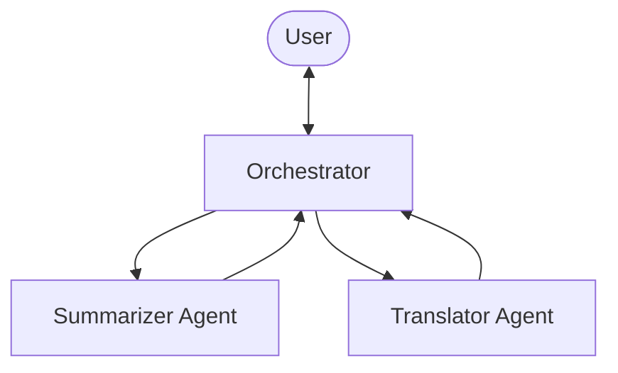

## Introduction

In the [previous article](/en/blog/2026/03/03/strands-agents-conversation), we learned about conversation memory and context management. At this point, we've covered nearly everything a single agent can do.

But real-world tasks sometimes exceed what one agent can handle. "Summarize this text, then translate it to Japanese" is more efficiently handled by multiple agents with different specialties working together.

Strands Agents SDK enables this with the **Agents as Tools** pattern. Just wrap an agent with `@tool` and pass it as a tool to another agent.

See the official docs at [Agents as Tools](https://strandsagents.com/docs/user-guide/concepts/multi-agent/agents-as-tools/) for the full reference.

## What Is Agents as Tools?

"Agents as Tools" is a pattern where specialized agents are wrapped as tool functions and called by an orchestrator (coordinator) agent.



Think of it like a human team: a manager (orchestrator) delegates work to specialists (summarizer, translator). The "separate tool responsibilities" principle from article 2 extends naturally to the agent level.

## Setup

Use the same environment from the [previous article](/en/blog/2026/03/03/strands-agents-conversation).

```python title="Python (shared config)"
from strands import Agent, tool
from strands.models import BedrockModel

bedrock_model = BedrockModel(
    model_id="us.anthropic.claude-sonnet-4-20250514-v1:0",
    region_name="us-east-1",
)
```

## Defining Specialized Agents as Tools

Wrap two specialized agents — summarizer and translator — with `@tool`.

```python title="Python (specialized agents)"
@tool
def summarizer(text: str) -> str:
    """Summarize the given text into 2-3 concise sentences.

    Args:
        text: The text to summarize

    Returns:
        A concise summary
    """
    summary_agent = Agent(
        model=bedrock_model,
        system_prompt="You are a summarization specialist. "
        "Summarize the given text into 2-3 concise sentences. Be factual and precise.",
        callback_handler=None,
    )
    result = summary_agent(f"Summarize this: {text}")
    return result.message['content'][0]['text']

@tool
def translator(text: str, target_language: str) -> str:
    """Translate the given text into the specified language.

    Args:
        text: The text to translate
        target_language: The target language (e.g. Japanese, Spanish, French)

    Returns:
        The translated text
    """
    translation_agent = Agent(
        model=bedrock_model,
        system_prompt="You are a professional translator. "
        "Translate the given text accurately into the target language. "
        "Return only the translation, no explanations.",
        callback_handler=None,
    )
    result = translation_agent(f"Translate the following into {target_language}: {text}")
    return result.message['content'][0]['text']
```

The key point is that each tool function creates an `Agent` internally. From the outside, it's just a `@tool` function. But inside, it's a specialized agent with its own system prompt. The orchestrator doesn't know about this internal structure — it just reads the docstring and uses it as "a tool that summarizes" or "a tool that translates."

## Creating the Orchestrator

Pass the specialized agents as tools to the orchestrator.

```python title="Python (orchestrator)"
orchestrator = Agent(
    model=bedrock_model,
    system_prompt="You are an assistant that coordinates specialized agents. "
    "Use the summarizer tool for summarization tasks and the translator tool "
    "for translation tasks. You can chain them: summarize first, then translate the summary.",
    tools=[summarizer, translator],
    callback_handler=None,
)

text = (
    "Amazon Bedrock is a fully managed service that offers a choice of "
    "high-performing foundation models from leading AI companies like "
    "AI21 Labs, Anthropic, Cohere, Meta, Mistral AI, Stability AI, and "
    "Amazon through a single API, along with a broad set of capabilities "
    "you need to build generative AI applications with security, privacy, "
    "and responsible AI."
)

result = orchestrator(
    f"Summarize the following text, then translate the summary into Japanese:\n\n{text}"
)
```

`tools=[summarizer, translator]` — the same way we passed `calculator` or `word_count` throughout this series. No special API needed to use agents as tools. Just wrap with `@tool`.

### Execution Results

```text title="Output"
**Summary:** Amazon Bedrock is a fully managed service that provides access to
high-performing foundation models from leading AI companies including AI21 Labs,
Anthropic, Cohere, Meta, Mistral AI, Stability AI, and Amazon through a single
API. The service offers comprehensive capabilities for building generative AI
applications while maintaining security, privacy, and responsible AI practices.

**Japanese Translation:** Amazon Bedrockは、AI21 Labs、Anthropic、Cohere、Meta、
Mistral AI、Stability AI、およびAmazonを含む主要なAI企業の高性能基盤モデルに
単一のAPIを通じてアクセスを提供する完全管理サービスです。このサービスは、
セキュリティ、プライバシー、および責任あるAI慣行を維持しながら、生成AI
アプリケーションを構築するための包括的な機能を提供します。
```

```text title="Output (metrics)"
Cycles: 3
Tools used: ['summarizer', 'translator']
Tokens: 3294
```

The orchestrator completed in 3 cycles.

- **Cycle 1**: The orchestrator reasons and calls `summarizer`. Internally, the summarization agent runs
- **Cycle 2**: Receives the summary, then calls `translator`. Internally, the translation agent runs
- **Cycle 3**: Receives the translation and generates the final answer

This is the same multi-step pattern from article 2 (exchange rate → conversion). The difference is that each tool is itself an agent with its own system prompt.

## Series Recap

Over 5 articles, we've covered the fundamentals of Strands Agents SDK.

| # | Topic | What We Learned |
|---|---|---|
| [1](/en/blog/2026/03/03/strands-agents-quickstart) | Quickstart | Agent loop, `@tool`, metrics |
| [2](/en/blog/2026/03/03/strands-agents-custom-tools) | Custom Tools | Multi-step, error handling, system prompts |
| [3](/en/blog/2026/03/03/strands-agents-mcp-tools) | MCP | External tool connection, mixing with custom tools |
| [4](/en/blog/2026/03/03/strands-agents-conversation) | Conversation | Multi-turn, SlidingWindow |
| 5 (this article) | Multi-Agent | Agents as Tools, orchestrator |

From here, you can explore more advanced topics like [Swarm](https://strandsagents.com/docs/user-guide/concepts/multi-agent/swarm/), [Graph](https://strandsagents.com/docs/user-guide/concepts/multi-agent/graph/) patterns, [Session Management](https://strandsagents.com/docs/user-guide/concepts/agents/session-management/), and [Observability](https://strandsagents.com/docs/user-guide/observability-evaluation/observability/).

## Summary

- **Just wrap an agent with `@tool` for multi-agent** — No special API needed. Everything you learned about `@tool` applies directly.
- **The orchestrator autonomously selects specialists** — Based on system prompts and docstrings, the orchestrator calls the right specialized agent. No need to hardcode call order.
- **Specialized agents have their own system prompts** — The summarizer gets "be concise," the translator gets "return only the translation." Each specialist is optimized for its task.
- **Knowledge from the entire series compounds** — Tool design (article 2), error handling (article 2), system prompts (article 2), multi-step behavior (article 2), and metrics (article 1) all apply in multi-agent scenarios.
