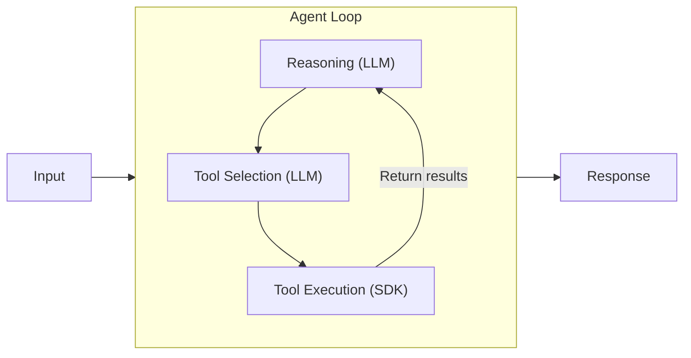

## Introduction

Among the growing number of AI agent frameworks, the open-source [Strands Agents SDK](https://strandsagents.com/) from AWS stands out for its simplicity: give a model some tools and let it figure out the rest. It supports both Python and TypeScript, defaults to Amazon Bedrock (Claude 4), and also works with OpenAI, Ollama, and many other providers.

This article walks through the [Python Quickstart](https://strandsagents.com/docs/user-guide/quickstart/python/) hands-on, explaining what the code does and how the agent works internally.

## What Is Strands Agents SDK?

Strands Agents SDK is a framework that gives LLMs (Large Language Models) tools and lets them autonomously complete tasks. At its core is the **agent loop**.



1. Pass user input to the LLM
2. The LLM decides which tools are needed to answer the question
3. Execute the selected tools and return results to the LLM
4. If more tools are needed, go back to step 2. Otherwise, generate the final response

This loop enables multi-step reasoning and action, going far beyond simple Q&A.

## Setup

Prerequisites:

- Python 3.10+
- AWS CLI configured with permissions to access Bedrock Claude models

```bash title="Terminal (installation)"
mkdir my_agent && cd my_agent
python -m venv .venv
source .venv/bin/activate
pip install strands-agents strands-agents-tools
```

`strands-agents` is the core SDK. `strands-agents-tools` is a community-driven collection of tools (calculator, current time, etc.). The version installed in this walkthrough was `strands-agents==1.32.0`.

## Building the Agent

The official Quickstart uses `Agent(tools=[...])` with the default Bedrock provider (Claude 4 Sonnet, defaulting to `us-west-2` if no region is configured). I modified it slightly to explicitly specify the region and model ID.

Create `agent.py`. The code is explained in three parts below, but everything goes into a single file. A copy-paste-ready full source is provided in a collapsible block at the end.

### Defining a Custom Tool

A Python function decorated with `@tool` becomes a tool the agent can use.

```python title="agent.py (1/3: custom tool)"
from strands import Agent, tool
from strands.models import BedrockModel
from strands_tools import calculator, current_time

@tool
def letter_counter(word: str, letter: str) -> int:
    """
    Count occurrences of a specific letter in a word.

    Args:
        word (str): The input word to search in
        letter (str): The specific letter to count

    Returns:
        int: The number of occurrences of the letter in the word
    """
    if not isinstance(word, str) or not isinstance(letter, str):
        return 0
    if len(letter) != 1:
        raise ValueError("The 'letter' parameter must be a single character")
    return word.lower().count(letter.lower())
```

The key here is the **docstring**. The LLM reads this description to understand what the tool does and what parameters to pass. Type hints (`str`, `int`) also help the LLM pass parameters correctly. In other words, the docstring and type hints serve as the tool's "user manual" for the LLM.

### Configuring the Model and Agent

```python title="agent.py (2/3: model config)"
bedrock_model = BedrockModel(
    model_id="us.anthropic.claude-sonnet-4-20250514-v1:0",
    region_name="us-east-1",
)

agent = Agent(model=bedrock_model, tools=[calculator, current_time, letter_counter])
```

Just pass a model and a list of tools to `Agent` and the agent is ready. In the original Quickstart code, you can simply write `Agent(tools=[...])` without `BedrockModel`.

### Sending a Prompt

```python title="agent.py (3/3: execution)"
message = """
I have 3 requests:

1. What is the time right now?
2. Calculate 3111696 / 74088
3. Tell me how many letter R's are in the word "strawberry"
"""
result = agent(message)

# Print metrics to understand what the agent did
import json
print(json.dumps(result.metrics.get_summary(), indent=2, default=str))
```

Call `agent(message)` like a function and the agent loop starts running.

<details className="my-4 rounded-lg border border-border bg-muted/30 p-4">
<summary className="cursor-pointer font-medium">Full agent.py source (copy-paste ready)</summary>

```python title="agent.py"
from strands import Agent, tool
from strands.models import BedrockModel
from strands_tools import calculator, current_time
import json

@tool
def letter_counter(word: str, letter: str) -> int:
    """
    Count occurrences of a specific letter in a word.

    Args:
        word (str): The input word to search in
        letter (str): The specific letter to count

    Returns:
        int: The number of occurrences of the letter in the word
    """
    if not isinstance(word, str) or not isinstance(letter, str):
        return 0
    if len(letter) != 1:
        raise ValueError("The 'letter' parameter must be a single character")
    return word.lower().count(letter.lower())

bedrock_model = BedrockModel(
    model_id="us.anthropic.claude-sonnet-4-20250514-v1:0",
    region_name="us-east-1",
)

agent = Agent(model=bedrock_model, tools=[calculator, current_time, letter_counter])

message = """
I have 3 requests:

1. What is the time right now?
2. Calculate 3111696 / 74088
3. Tell me how many letter R's are in the word "strawberry"
"""
result = agent(message)

print("\n\n--- Metrics Summary ---")
print(json.dumps(result.metrics.get_summary(), indent=2, default=str))
```

</details>

## Execution Results

```bash title="Terminal"
python -u agent.py
```

```text title="Output"
I'll help you with all three requests. Let me use the available tools.
Tool #1: current_time
Tool #2: calculator
Tool #3: letter_counter

1. Current time: March 22, 2026 at 10:08:35 AM UTC
2. Calculation: 3,111,696 ÷ 74,088 = 42
3. Letter count: The word "strawberry" contains 3 letter R's
```

Notice that the agent called all three tools **in parallel**. The LLM determined that each question needed a different tool and requested all three tool calls in a single reasoning cycle.

## Understanding Internals Through Metrics

The code above prints `result.metrics.get_summary()` at the end. This output reveals exactly what the agent did internally.

<details className="my-4 rounded-lg border border-border bg-muted/30 p-4">
<summary className="cursor-pointer font-medium">Metrics output (excerpt)</summary>

```json title="Output"
{
  "total_cycles": 2,
  "total_duration": 6.28,
  "accumulated_usage": {
    "inputTokens": 4289,
    "outputTokens": 265,
    "totalTokens": 4554
  },
  "tool_usage": {
    "calculator": {
      "execution_stats": {
        "call_count": 1,
        "success_count": 1,
        "error_count": 0,
        "total_time": 0.004,
        "average_time": 0.004,
        "success_rate": 1.0
      }
    },
    "current_time": {
      "execution_stats": {
        "call_count": 1,
        "success_count": 1,
        "error_count": 0,
        "total_time": 0.005,
        "average_time": 0.005,
        "success_rate": 1.0
      }
    },
    "letter_counter": {
      "execution_stats": {
        "call_count": 1,
        "success_count": 1,
        "error_count": 0,
        "total_time": 0.001,
        "average_time": 0.001,
        "success_rate": 1.0
      }
    }
  }
}
```

</details>

The key number is **2 cycles**.

- **Cycle 1**: The LLM reasons and calls three tools. Tool results are appended to the conversation history
- **Cycle 2**: The LLM receives the tool results and generates the final answer

This is the agent loop in action. "Reasoning → tool execution → reasoning" completed in two cycles. It consumed 4,554 tokens total and took about 6.3 seconds.

## Gotchas

Issues I ran into during the hands-on.

### Model ID Prefix

When using on-demand throughput (direct invocation without a provisioned inference profile) with Bedrock, the model ID needs a `us.` (cross-region inference profile) prefix. Cross-region inference profiles automatically route requests across multiple regions, and newer models like Claude 4 require this approach. Using `anthropic.claude-sonnet-4-20250514-v1:0` directly throws the following error.

```text title="Output"
ValidationException: Invocation of model ID anthropic.claude-sonnet-4-20250514-v1:0
with on-demand throughput isn't supported.
Retry your request with the ID or ARN of an inference profile that contains this model.
```

The fix is to use `us.anthropic.claude-sonnet-4-20250514-v1:0` with the prefix. The Strands error message also includes a [link to the solution](https://strandsagents.com/docs/user-guide/concepts/model-providers/amazon-bedrock/#on-demand-throughput-isnt-supported).

## Summary

- **An agent in a few dozen lines** — `Agent` + `@tool` + model config is all you need for an AI agent that autonomously selects and uses tools. The learning curve is minimal.
- **The agent loop is the core** — The "reasoning → tool selection → execution → reasoning" cycle runs automatically. Developers just focus on implementing tools.
- **Rich built-in metrics** — Cycle count, token usage, per-tool success rate and execution time come out of the box. Invaluable for debugging and optimization in production.
- **Watch the Bedrock model ID** — Forgetting the cross-region inference profile prefix (`us.` etc.) will break things. Check the [Bedrock provider docs](https://strandsagents.com/docs/user-guide/concepts/model-providers/amazon-bedrock/) beforehand.
