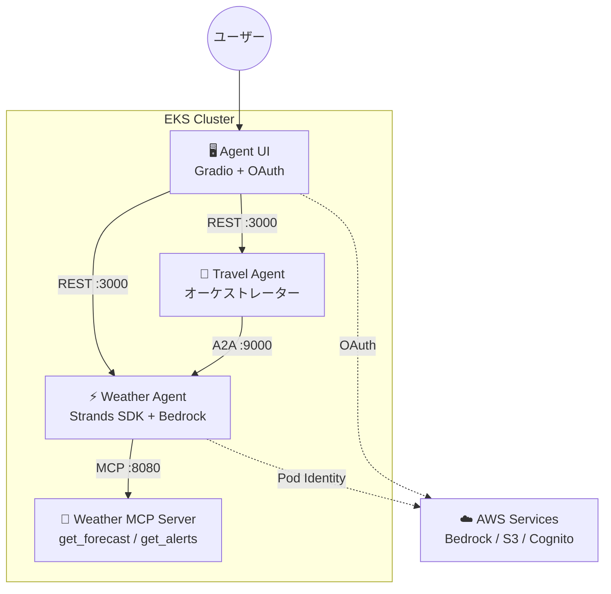
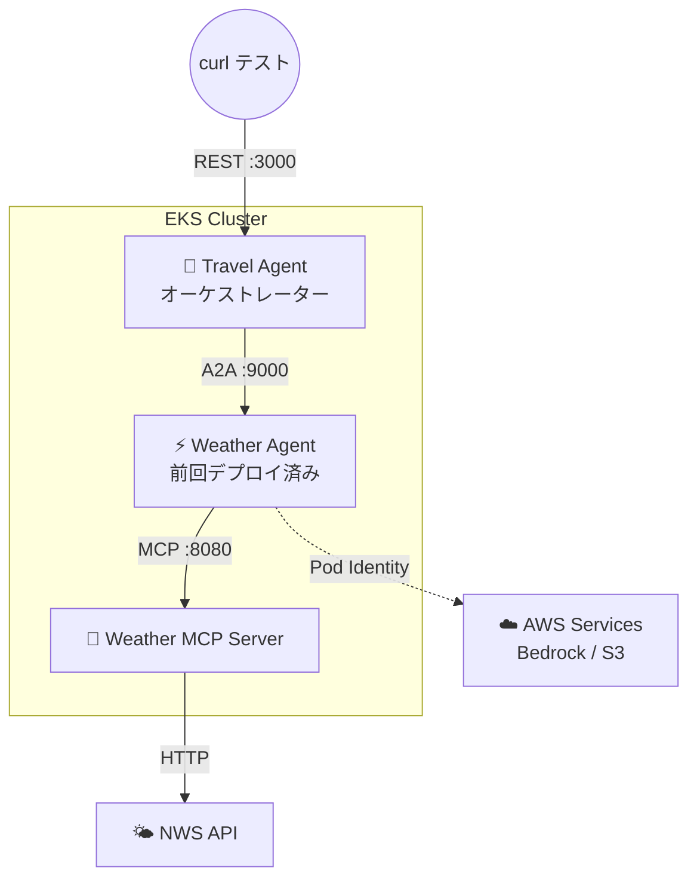

## はじめに

[前回の記事](/ja/blog/2026/03/24/agentic-ai-on-eks-workshop)では、EKS 上に Weather Agent と MCP Server をデプロイし、エージェントがツールを自動発見して外部 API を呼び出すフローを検証した。

今回は A2A（Agent-to-Agent）プロトコルによるマルチエージェント連携を検証する。Travel Agent が旅行の質問を受け、天気情報の取得を Weather Agent に自動委譲する構成だ。単体エージェントとは異なる「エージェント間の信頼と発見」という新しい課題に直面した。

## アーキテクチャの全体像

ワークショップ全体のアーキテクチャを再掲する。前回（Part 1）は Weather Agent + MCP Server の 2 コンポーネントを検証した。



## 今回の検証範囲

本記事では **Travel Agent → Weather Agent の A2A 連携**を検証した。前回デプロイ済みの Weather Agent + MCP Server はそのまま利用する。



前回は curl → Weather Agent の直接呼び出しだったが、今回は **curl → Travel Agent → (A2A) → Weather Agent → (MCP) → NWS API** という 2 段階の委譲フローを確認した。

## A2A プロトコルとは

A2A は Google が提唱するエージェント間通信のオープンプロトコルだ。MCP が「エージェント ↔ ツール」の接続規格であるのに対し、A2A は「エージェント ↔ エージェント」の協調を標準化する。

A2A の通信フローは以下のように進む。

1. Travel Agent が Weather Agent の **エージェントカード**（`/.well-known/agent-card.json`）を取得
2. カードからスキル一覧（`get_forecast`, `get_alerts`）と接続先 URL を確認
3. A2A プロトコルでメッセージを送信し、Weather Agent が処理結果を返却

MCP との大きな違いは、A2A ではツール単位ではなく**エージェント単位**で委譲すること。Travel Agent は「天気情報を教えて」と自然言語でリクエストし、Weather Agent が内部でどのツールを使うかは Weather Agent 自身が判断する。

## Travel Agent の設計

### Weather Agent との構成比較

前回の Weather Agent は MCP ツール（`get_forecast` 等）を直接呼び出す構成だった。Travel Agent はこれと対照的に、**他のエージェントを「ツール」として利用する**構成を取る。

| | Weather Agent | Travel Agent |
|---|---|---|
| ツール取得元 | MCP Server（`mcp.json`） | 他のエージェント（`a2a_agents.json`） |
| ツールの種類 | `get_forecast`, `get_alerts` | `a2a_send_message`, `a2a_list_discovered_agents` |
| 通信プロトコル | MCP over HTTP | A2A (JSON-RPC) |
| 委譲の粒度 | ツール単位 | エージェント単位（自然言語） |

### a2a_agents.json — 接続先エージェントの定義

Weather Agent が `mcp.json` で MCP Server の接続先を宣言するのと同様に、Travel Agent は `a2a_agents.json` で A2A 接続先を宣言する。

```json
{
  "urls": [
    "http://weather-agent.agents:9000/"
  ]
}
```

起動時に `A2AClientToolProvider` がこの URL のエージェントカードを取得し、相手の名前・スキル・接続先を自動発見する。接続先を増やす場合は、この配列に URL を追加するだけだ。

### A2AClientToolProvider — エージェント間通信の抽象化

Travel Agent のコードは驚くほどシンプルだ。`A2AClientToolProvider` が A2A 通信の複雑さをすべて抽象化している。

```python
from strands_tools.a2a_client import A2AClientToolProvider

provider = A2AClientToolProvider(
    known_agent_urls=["http://weather-agent.agents:9000/"]
)

agent = Agent(
    model=bedrock_model,
    system_prompt=system_prompt,
    tools=provider.tools
)
```

`provider.tools` が返すのは以下の 3 つのツールだ。

| ツール | 役割 |
|---|---|
| `a2a_list_discovered_agents` | 発見済みエージェントの一覧と URL を返す |
| `a2a_discover_agent` | 指定 URL のエージェントカードを取得・キャッシュ |
| `a2a_send_message` | 指定エージェントに自然言語でメッセージを送信 |

LLM はまず `a2a_list_discovered_agents` で接続先の URL を取得し、次に `a2a_send_message` で天気の質問を送る。Weather Agent のコードを一切知らなくても、カードの情報だけで連携できる設計だ。

### システムプロンプト — LLM の「やってはいけないこと」を定義する

Travel Agent の `agent.md` は約 100 行にわたる詳細なシステムプロンプトを含む。Weather Agent の 10 行程度のプロンプトと比べると圧倒的に長い。これはオーケストレーター型エージェントに特有の設計だ。

プロンプトの中核は「何をすべきでないか」の制約にある。

```markdown
CORE PRINCIPLES:
1. NEVER invent or fabricate specialized information
   that should come from other agents
2. ALWAYS use the appropriate tool to query specialized agents

WEATHER INFORMATION PROTOCOL:
- Use ONLY the tools from the Weather Agent to obtain weather info
- NEVER attempt to predict, estimate, or generate weather yourself
- Clearly attribute: "According to the Weather Agent, Miami will..."
```

なぜここまで厳密に禁止する必要があるのか。LLM は天気に関する一般知識を持っており、ツール呼び出しなしでも「マイアミは温暖で...」と回答できてしまう。しかしそれは不正確な情報であり、エージェント連携の意味がなくなる。**LLM が「知っていても答えるな」という制約を明示的に書く**のが、オーケストレーターのプロンプト設計の要点だ。

## ハマりどころ 1: エージェントカードの URL 問題

最初にデプロイしたとき、Travel Agent は Weather Agent への A2A 通信に失敗した。

```text
A2AClientHTTPError: HTTP Error 503: Network communication error
fetching agent card from http://0.0.0.0:9000/.well-known/agent-card.json
```

原因は Weather Agent のエージェントカードだ。A2A サーバーはデフォルトで `host=0.0.0.0` にバインドし、カードの `url` フィールドにもそのまま `http://0.0.0.0:9000/` を記載する。Travel Agent の初回ディスカバリー（`a2a_agents.json` の URL でのカード取得）自体は成功するが、LLM がカード内の `url` フィールドを読んで `a2a_send_message` の `target_agent_url` に渡すため、クラスター内で到達不能な `0.0.0.0` への接続を試みて失敗する。

解決策は Helm values で `a2a.http_url` を Kubernetes Service の FQDN に設定すること。

```yaml
# Weather Agent の Helm values
a2a:
  http_url: "http://weather-agent.agents:9000/"
```

これにより、エージェントカードの `url` が `http://weather-agent.agents:9000/` に書き換わり、クラスター内の他のエージェントから正しく到達できるようになる。Kubernetes 上で A2A を使う場合、**各エージェントのカードにサービスディスカバリ可能な URL を設定する**のが必須だ。

## ハマりどころ 2: S3 セッション履歴によるコンテキスト汚染

エージェントカードの URL を修正した後も、Travel Agent は依然として `http://0.0.0.0:9000/` に接続しようとした。

原因は **S3 セッション履歴**だった。Travel Agent は S3 にユーザーごとの会話履歴を保持しており、古い URL を含む過去のメッセージが LLM のコンテキストに復元されていた。LLM はそのコンテキストから `0.0.0.0` という URL を学習し、`a2a_send_message` ツールの `target_agent_url` パラメータにそのまま渡していたのだ。

```bash
# S3 セッションデータをクリア
aws s3 rm s3://${TRAVEL_SESSION_BUCKET}/ --recursive
```

セッションクリア後、Travel Agent は `a2a_list_discovered_agents` でエージェントカードから正しい URL を取得し、Weather Agent への A2A 通信に成功した。

これは AI エージェント特有の問題だ。従来のマイクロサービスなら設定変更は即座に反映されるが、**セッション状態を持つ AI エージェントでは、過去の会話履歴が LLM の判断を汚染する**可能性がある。エージェントの接続先を変更した際はセッションのクリアも忘れてはならない。

## 動作確認

すべての問題を解決した後、Travel Agent に旅行の相談を送ると、Weather Agent への A2A 委譲が正常に動作した。

```text
User: "I'm planning a trip to Miami, Florida next week.
       What will the weather be like?"

Travel Agent の応答（抜粋）:

## Miami, Florida - 7-Day Weather Forecast

According to the Weather Agent:

**Monday** - High: 83°F, Showers and thunderstorms possible (50%)
**Tuesday** - High: 71°F, Chance of showers (40%)
...
**Saturday** - High: 77°F, Sunny ☀️ - Excellent for outdoor activities
**Sunday** - High: 78°F, Sunny ☀️ - Ideal weather

Summary: Plan indoor activities for Monday-Thursday,
save beach and water activities for the weekend!
```

Travel Agent がシステムプロンプトのルール通り「According to the Weather Agent」と出典を明記し、天気データを自分で生成せずに Weather Agent から取得していることが確認できた。

## まとめ

- **エージェントカードの URL は Kubernetes Service の FQDN に設定する** — A2A サーバーのデフォルト `0.0.0.0` ではクラスター内通信が不可能。`a2a.http_url` の設定が必須だ。
- **セッション履歴は LLM の判断を汚染する** — 従来のサービスと異なり、AI エージェントは過去の会話コンテキストに基づいて判断する。設定変更後のセッションクリアを運用手順に組み込む必要がある。
- **A2A はエージェント単位の委譲** — MCP がツール単位で接続するのに対し、A2A では自然言語でリクエストを送り、受け手のエージェントが内部で判断する。オーケストレーター型の設計に適している。

---

本記事は Agentic AI on EKS ワークショップ検証シリーズの Part 2 である。

- [Part 1: EKS上でAIエージェントをデプロイする](/ja/blog/2026/03/24/agentic-ai-on-eks-workshop)
- Part 2: A2Aプロトコルで実現するマルチエージェント連携（本記事）
- [Part 3: Cognito認証UIとHPAで仕上げるエージェント基盤](/ja/blog/2026/03/26/agent-ui-and-scaling-on-eks)
