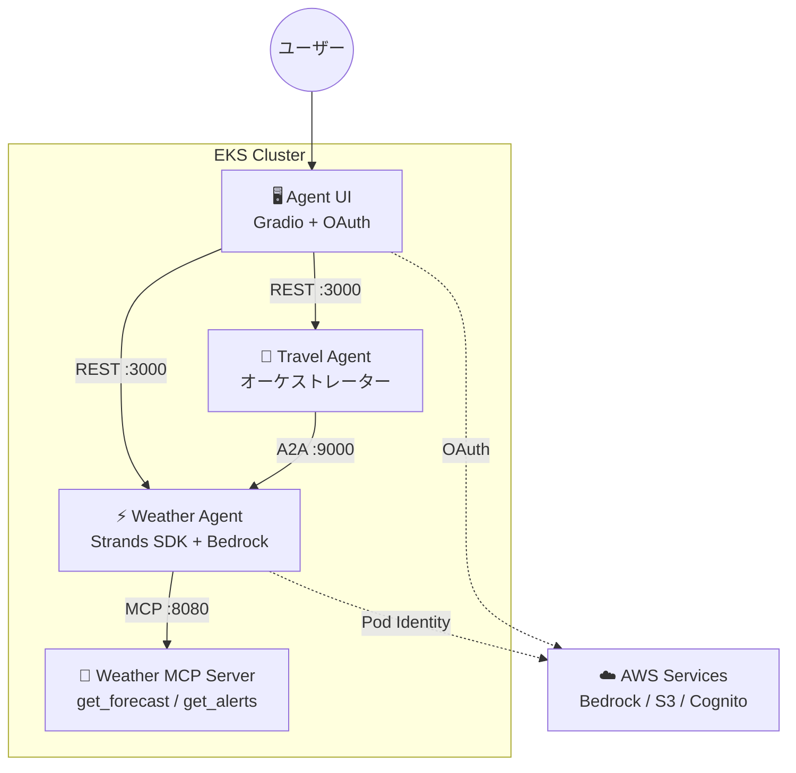

## はじめに

[Part 1](/ja/blog/2026/03/24/agentic-ai-on-eks-workshop) では Weather Agent + MCP Server、[Part 2](/ja/blog/2026/03/25/a2a-multi-agent-on-eks) では Travel Agent の A2A 連携を検証した。

最終回となる本記事では、残りの 2 つのピースを埋める。Cognito OAuth 認証付きの Web UI と、HPA によるオートスケーリングだ。これでワークショップの全 4 コンポーネントが揃い、エージェント基盤として一通り動作する状態になる。

## アーキテクチャの全体像

本記事で **Agent UI** と **HPA** を追加し、ワークショップの全 4 コンポーネントが揃った最終状態になる。



## Agent UI の構成

Agent UI は Gradio（Python ベースの Web UI フレームワーク）と FastAPI を組み合わせた構成だ。認証は Cognito OAuth2 の Authorization Code フローを使う。

UI の特徴的な設計は **エージェントモードの切り替え**だ。ユーザーは画面上のラジオボタンで「Single Agent（Weather）」と「Multi-Agent（Travel）」を選択でき、同じチャット画面から異なるエージェントに接続できる。

```python
# app.py - エージェント選択ロジック
if agent_mode == "Single Agent(Weather)":
    endpoint_url = "http://weather-agent.agents/prompt"
else:  # Multi-Agent(Travel)
    endpoint_url = "http://travel-agent.agents/prompt"
```

UI からエージェントへのリクエストには Cognito の JWT トークンが `Authorization` ヘッダーに付与される。エージェント側は `DISABLE_AUTH=1` でテストモードにもできるが、本番では JWT 検証が有効になる。

## デプロイ手順

UI のデプロイは 3 ステップで完了する。

**1. Cognito ユーザーのパスワード設定**

Terraform で作成した Alice / Bob ユーザーにパスワードを設定する。

```bash
aws cognito-idp admin-set-user-password \
  --user-pool-id $COGNITO_POOL_ID \
  --username Alice --password "Passw0rd@" --permanent
```

**2. OAuth シークレットの作成**

Cognito の Client ID / Secret を Kubernetes Secret として登録する。UI の Pod はこの Secret を `envFrom` で読み込む。

```bash
kubectl create secret generic agent-ui \
  --namespace ui \
  --from-env-file ui/.env
```

**3. Helm デプロイ**

```bash
helm upgrade agent-ui manifests/helm/ui \
  --install -n ui --create-namespace \
  -f workshop-ui-values.yaml
```

デプロイ後、`kubectl port-forward svc/agent-ui -n ui 8000:80` で `http://localhost:8000` にアクセスすると、Cognito のログイン画面にリダイレクトされ、認証後に Gradio チャット画面が表示される。

## HPA によるオートスケーリング

Helm チャートには HPA テンプレートが組み込まれており、`autoscaling.enabled=true` で有効化できる。

```bash
helm upgrade weather-agent manifests/helm/agent \
  --namespace agents \
  -f workshop-agent-weather-values.yaml \
  --set autoscaling.enabled=true \
  --set autoscaling.minReplicas=1 \
  --set autoscaling.maxReplicas=3 \
  --set autoscaling.targetCPUUtilizationPercentage=50 \
  --set resources.requests.cpu=100m \
  --set resources.requests.memory=256Mi
```

HPA が正常に動作していることを確認した。

```text
NAME            TARGETS       MINPODS   MAXPODS   REPLICAS
weather-agent   cpu: 3%/50%   1         3         1
travel-agent    cpu: 1%/50%   1         3         1
```

アイドル時は 1 レプリカだが、CPU 使用率が 50% を超えると最大 3 レプリカまでスケールする。EKS Auto Mode がノードのプロビジョニングも自動で行うため、Pod レベルの HPA だけ設定すればクラスター全体のスケーリングが完結する。

## 全コンポーネントのリソース消費

全 4 コンポーネントの実測値を以下に示す。

| コンポーネント | CPU | メモリ | 役割 |
|---|---|---|---|
| Weather Agent | 3m | 405Mi | LLM 呼び出し + MCP ツール |
| Travel Agent | 1m | 143Mi | A2A オーケストレーション |
| Weather MCP Server | 1m | 56Mi | NWS API ラッパー |
| Agent UI | 3m | 119Mi | Gradio + OAuth |
| **合計** | **8m** | **723Mi** | |

アイドル時の合計は CPU 8m / メモリ 723Mi と軽量だ。ただし LLM 呼び出し中は Weather Agent の CPU が跳ねるため、HPA の閾値設定が重要になる。MCP Server は純粋な API プロキシのため最も軽い。

## まとめ

- **OAuth シークレットは Kubernetes Secret + envFrom で管理** — Cognito の Client Secret を Helm values にハードコードせず、Secret として分離することで安全に管理できる。ConfigMap（公開設定）と Secret（認証情報）の使い分けがエージェント基盤の運用設計では重要だ。
- **HPA + EKS Auto Mode でスケーリングが完結** — Pod レベルの HPA を設定するだけで、ノードプロビジョニングは Auto Mode が自動処理する。エージェントは LLM 呼び出し時に CPU が跳ねるバースト型の負荷特性を持つため、CPU ベースの HPA が適している。
- **4 コンポーネント合計 723Mi** — アイドル時のフットプリントは軽量。ただし LLM 呼び出しを含む実運用では、セッション管理（S3）とモデル呼び出し（Bedrock）のコストが支配的になる。

シリーズ全体を通じて見えてきたのは、AI エージェントの本番運用では**プロトコル設計（MCP / A2A）、設定の外部化（ConfigMap / Secret）、セッション状態管理**の 3 つが従来のマイクロサービスにはない新しい設計軸になるということだ。ワークショップはこの 3 軸を 4 コンポーネントの構成で体験できる、よくできた教材だった。

---

本記事は Agentic AI on EKS ワークショップ検証シリーズの Part 3（最終回）である。

- [Part 1: EKS上でAIエージェントをデプロイする](/ja/blog/2026/03/24/agentic-ai-on-eks-workshop)
- [Part 2: A2Aプロトコルで実現するマルチエージェント連携](/ja/blog/2026/03/25/a2a-multi-agent-on-eks)
- Part 3: Cognito認証UIとHPAで仕上げるエージェント基盤（本記事）
