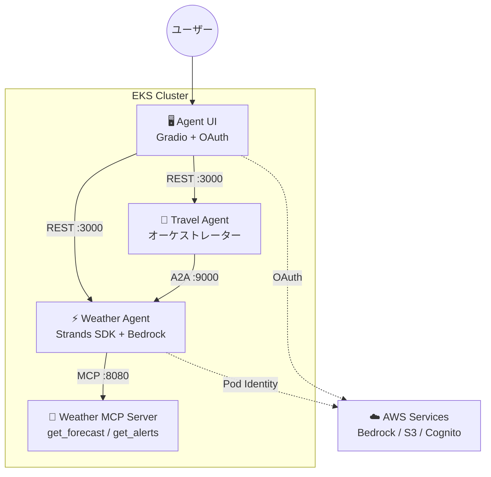

## はじめに

[Part 1](/ja/blog/2026/03/23/agentic-ai-on-eks-workshop) では Weather Agent + MCP Server、[Part 2](/ja/blog/2026/03/23/a2a-multi-agent-on-eks) では Travel Agent の A2A 連携を検証した。

最終回となる本記事では、残りの 2 つのピースを埋める。Cognito OAuth 認証付きの Web UI と、HPA によるオートスケーリングだ。これでワークショップの全 4 コンポーネントが揃い、エージェント基盤として一通り動作する状態になる。

## アーキテクチャの全体像

本記事で **Agent UI** と **HPA** を追加し、ワークショップの全 4 コンポーネントが揃った最終状態になる。



## Agent UI の構成

Agent UI は Gradio（Python ベースの Web UI フレームワーク）と FastAPI を組み合わせた構成だ。認証は Cognito OAuth2 の Authorization Code フローを使う。

UI の特徴的な設計は **エージェントモードの切り替え**だ。ユーザーは画面上のラジオボタンで「Single Agent（Weather）」と「Multi-Agent（Travel）」を選択でき、同じチャット画面から異なるエージェントに接続できる。

```python title="app.py"
# app.py - エージェント選択ロジック
if agent_mode == "Single Agent(Weather)":
    endpoint_url = "http://weather-agent.agents/prompt"
else:  # Multi-Agent(Travel)
    endpoint_url = "http://travel-agent.agents/prompt"
```

UI からエージェントへのリクエストには Cognito の JWT トークンが `Authorization` ヘッダーに付与される。エージェント側は `DISABLE_AUTH=1` でテストモードにもできるが、本番では JWT 検証が有効になる。

## デプロイ手順

UI のデプロイには Cognito のセットアップが必要だ。ワークショップのリポジトリでは `eks/infrastructure/terraform/cognito.tf` で Terraform 管理されているが、本記事では手動で構築する。

<details className="my-4 rounded-lg border border-border bg-muted/30 p-4">
<summary className="cursor-pointer font-medium">Cognito ユーザープールの構築手順</summary>

```bash title="Terminal"
# ユーザープールの作成
POOL_ID=$(aws cognito-idp create-user-pool \
  --pool-name agentic-ai-on-eks \
  --admin-create-user-config AllowAdminCreateUserOnly=true \
  --query 'UserPool.Id' --output text)

# アプリクライアントの作成
CLIENT_OUTPUT=$(aws cognito-idp create-user-pool-client \
  --user-pool-id $POOL_ID \
  --client-name agent-ui \
  --generate-secret \
  --allowed-o-auth-flows code \
  --allowed-o-auth-scopes email openid profile \
  --callback-urls '["http://localhost:8000/callback"]' \
  --logout-urls '["http://localhost:8000/"]' \
  --supported-identity-providers COGNITO \
  --allowed-o-auth-flows-user-pool-client \
  --explicit-auth-flows ALLOW_USER_PASSWORD_AUTH)

CLIENT_ID=$(echo $CLIENT_OUTPUT | jq -r '.UserPoolClient.ClientId')
CLIENT_SECRET=$(echo $CLIENT_OUTPUT | jq -r '.UserPoolClient.ClientSecret')

# ドメインの作成
DOMAIN_PREFIX="agentic-ai-$(echo $RANDOM)"
aws cognito-idp create-user-pool-domain \
  --user-pool-id $POOL_ID --domain $DOMAIN_PREFIX

# テストユーザーの作成
aws cognito-idp admin-create-user \
  --user-pool-id $POOL_ID --username Alice \
  --message-action SUPPRESS
aws cognito-idp admin-create-user \
  --user-pool-id $POOL_ID --username Bob \
  --message-action SUPPRESS
```

</details>

UI のデプロイは 3 ステップで完了する。まず Agent UI のコンテナイメージを Part 1 と同じ Kaniko 手順でビルドしておく。

<details className="my-4 rounded-lg border border-border bg-muted/30 p-4">
<summary className="cursor-pointer font-medium">Agent UI のビルド手順</summary>

```bash title="Terminal"
# Agent UI 用 ECR リポジトリ
aws ecr create-repository --repository-name agents-on-eks/agent-ui --region $AWS_REGION

cd ui
tar czf /tmp/agent-ui-context.tar.gz .
aws s3 cp /tmp/agent-ui-context.tar.gz s3://kaniko-build-${ACCOUNT_ID}/build/
cd ..
```

```yaml title="kaniko-ui.yaml"
apiVersion: batch/v1
kind: Job
metadata:
  name: kaniko-agent-ui
  namespace: build
spec:
  backoffLimit: 1
  template:
    spec:
      serviceAccountName: kaniko
      containers:
      - name: kaniko
        image: gcr.io/kaniko-project/executor:latest
        args:
        - "--context=s3://kaniko-build-${ACCOUNT_ID}/build/agent-ui-context.tar.gz"
        - "--destination=${ECR_HOST}/agents-on-eks/agent-ui:latest"
      restartPolicy: Never
```

```bash title="Terminal"
kubectl apply -f kaniko-ui.yaml
kubectl wait --for=condition=complete \
  job/kaniko-agent-ui -n build --timeout=600s
```

</details>

**1. Cognito ユーザーのパスワード設定**

```bash title="Terminal"
aws cognito-idp admin-set-user-password \
  --user-pool-id $POOL_ID \
  --username Alice --password "Passw0rd@" --permanent
```

**2. OAuth シークレットの作成**

Cognito の Client ID / Secret を `.env` ファイルにまとめ、Kubernetes Secret として登録する。UI の Pod はこの Secret を `envFrom` で読み込む。

```bash title="Terminal (ui/.env の作成)"
COGNITO_DOMAIN="https://${DOMAIN_PREFIX}.auth.${AWS_REGION}.amazoncognito.com"
JWKS_URL="https://cognito-idp.${AWS_REGION}.amazonaws.com/${POOL_ID}/.well-known/jwks.json"

cat > ui/.env << EOF
OAUTH_CLIENT_ID=${CLIENT_ID}
OAUTH_CLIENT_SECRET=${CLIENT_SECRET}
OPENID_CONFIGURATION_URL=https://cognito-idp.${AWS_REGION}.amazonaws.com/${POOL_ID}/.well-known/openid-configuration
OAUTH_JWKS_URL=${JWKS_URL}
EOF
```

```bash title="Terminal"
kubectl create ns ui
kubectl create secret generic agent-ui \
  --namespace ui \
  --from-env-file ui/.env
```

**3. Helm デプロイ**

```bash title="Terminal"
helm upgrade agent-ui manifests/helm/ui \
  --install -n ui --create-namespace \
  --set image.repository=${ECR_HOST}/agents-on-eks/agent-ui \
  --set image.tag=latest

kubectl rollout status deployment agent-ui -n ui --timeout=180s
```

デプロイ後、`kubectl port-forward svc/agent-ui -n ui 8000:80` で `http://localhost:8000` にアクセスすると、Cognito のログイン画面にリダイレクトされ、認証後に Gradio チャット画面が表示される。

## HPA によるオートスケーリング

Helm チャートには HPA テンプレートが組み込まれており、`autoscaling.enabled=true` で有効化できる。

```bash title="Terminal"
helm upgrade weather-agent manifests/helm/agent \
  --namespace agents \
  -f manifests/helm/agent/mcp-remote.yaml \
  --set image.repository=${ECR_HOST}/agents-on-eks/weather-agent \
  --set image.tag=latest \
  --set env.DISABLE_AUTH=1 \
  --set env.SESSION_STORE_BUCKET_NAME=weather-agent-session-${ACCOUNT_ID} \
  --set serviceAccount.name=weather-agent \
  --set a2a.http_url=http://weather-agent.agents:9000/ \
  --set autoscaling.enabled=true \
  --set autoscaling.minReplicas=1 \
  --set autoscaling.maxReplicas=3 \
  --set autoscaling.targetCPUUtilizationPercentage=50 \
  --set resources.requests.cpu=100m \
  --set resources.requests.memory=256Mi
```

デプロイ完了を待ち、HPA の状態を確認する。

```bash title="Terminal"
kubectl rollout status deployment weather-agent -n agents --timeout=120s
kubectl get hpa -n agents
```

```text title="Output"
NAME            TARGETS       MINPODS   MAXPODS   REPLICAS
weather-agent   cpu: 3%/50%   1         3         1
travel-agent    cpu: 1%/50%   1         3         1
```

アイドル時は 1 レプリカだが、CPU 使用率が 50% を超えると最大 3 レプリカまでスケールする。EKS Auto Mode がノードのプロビジョニングも自動で行うため、Pod レベルの HPA だけ設定すればクラスター全体のスケーリングが完結する。

## 全コンポーネントのリソース消費

全 4 コンポーネントの実測値を以下に示す。

| コンポーネント | CPU | メモリ | 役割 |
|---|---|---|---|
| Weather Agent | 3m | 405Mi | LLM 呼び出し + MCP ツール |
| Travel Agent | 1m | 143Mi | A2A オーケストレーション |
| Weather MCP Server | 1m | 56Mi | NWS API ラッパー |
| Agent UI | 3m | 119Mi | Gradio + OAuth |
| **合計** | **8m** | **723Mi** | |

アイドル時の合計は CPU 8m / メモリ 723Mi と軽量だ。ただし LLM 呼び出し中は Weather Agent の CPU が跳ねるため、HPA の閾値設定が重要になる。MCP Server は純粋な API プロキシのため最も軽い。

## まとめ

- **OAuth シークレットは Kubernetes Secret + envFrom で管理** — Cognito の Client Secret を Helm values にハードコードせず、Secret として分離することで安全に管理できる。ConfigMap（公開設定）と Secret（認証情報）の使い分けがエージェント基盤の運用設計では重要だ。
- **HPA + EKS Auto Mode でスケーリングが完結** — Pod レベルの HPA を設定するだけで、ノードプロビジョニングは Auto Mode が自動処理する。エージェントは LLM 呼び出し時に CPU が跳ねるバースト型の負荷特性を持つため、CPU ベースの HPA が適している。
- **4 コンポーネント合計 723Mi** — アイドル時のフットプリントは軽量。ただし LLM 呼び出しを含む実運用では、セッション管理（S3）とモデル呼び出し（Bedrock）のコストが支配的になる。

シリーズ全体を通じて見えてきたのは、AI エージェントの本番運用では**プロトコル設計（MCP / A2A）、設定の外部化（ConfigMap / Secret）、セッション状態管理**の 3 つが従来のマイクロサービスにはない新しい設計軸になるということだ。ワークショップはこの 3 軸を 4 コンポーネントの構成で体験できる、よくできた教材だった。

## クリーンアップ

検証が終わったら、作成したリソースを削除する。

<details className="my-4 rounded-lg border border-border bg-muted/30 p-4">
<summary className="cursor-pointer font-medium">リソース削除手順</summary>

```bash title="Terminal"
# Helm releases の削除
helm uninstall agent-ui -n ui
helm uninstall travel-agent -n agents
helm uninstall weather-agent -n agents
helm uninstall weather-mcp -n mcp-servers

# Kaniko jobs の削除
kubectl delete jobs --all -n build

# Namespace の削除
kubectl delete ns agents mcp-servers ui build

# Pod Identity Association の削除
for assoc in $(aws eks list-pod-identity-associations \
  --cluster-name $CLUSTER_NAME --region $AWS_REGION \
  --query 'associations[].associationId' --output text); do
  aws eks delete-pod-identity-association \
    --cluster-name $CLUSTER_NAME --region $AWS_REGION \
    --association-id $assoc
done

# IAM ロールの削除
for role in weather-agent-pod-role travel-agent-pod-role kaniko-pod-role; do
  aws iam delete-role-policy --role-name $role --policy-name bedrock-s3 2>/dev/null
  aws iam delete-role-policy --role-name $role --policy-name ecr-s3 2>/dev/null
  aws iam delete-role --role-name $role
done

# ECR リポジトリの削除
for repo in agents-on-eks/weather-mcp agents-on-eks/weather-agent \
            agents-on-eks/travel-agent agents-on-eks/agent-ui; do
  aws ecr delete-repository --repository-name $repo \
    --region $AWS_REGION --force
done

# S3 バケットの削除
for bucket in weather-agent-session-${ACCOUNT_ID} \
              travel-agent-session-${ACCOUNT_ID} \
              kaniko-build-${ACCOUNT_ID}; do
  aws s3 rb s3://$bucket --force
done

# Cognito ユーザープールの削除（ドメインを先に削除する必要がある）
aws cognito-idp delete-user-pool-domain \
  --user-pool-id $POOL_ID --domain $DOMAIN_PREFIX
aws cognito-idp delete-user-pool --user-pool-id $POOL_ID
```

</details>
