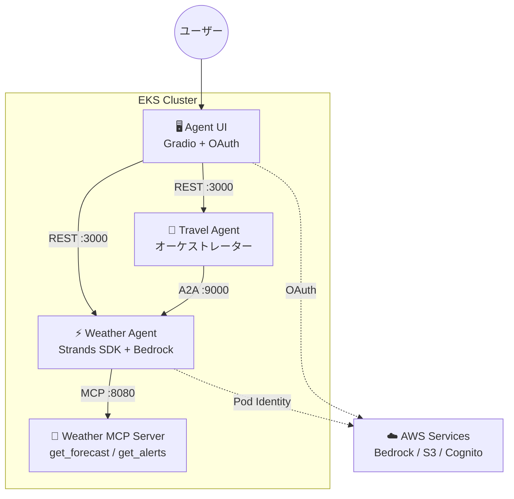
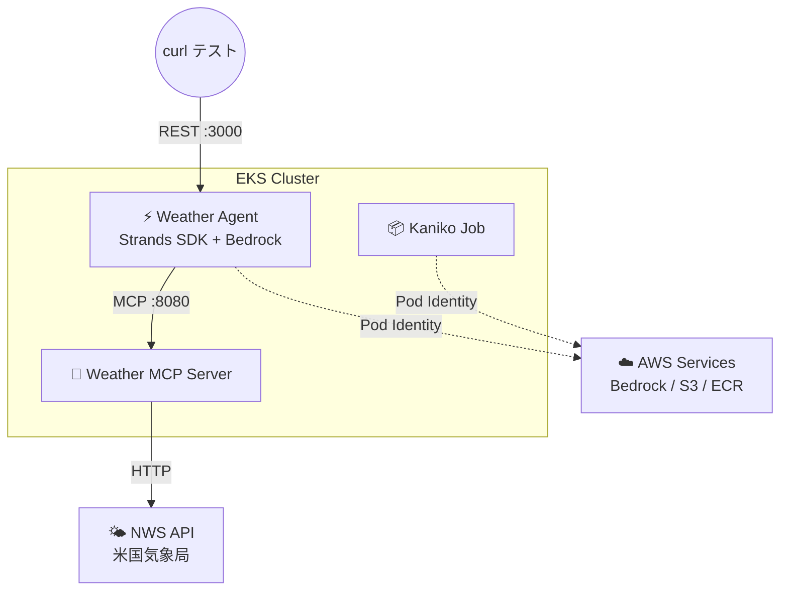

## はじめに

LLM を API 経由で呼ぶだけの時代は終わりつつある。ツールを使い、他のエージェントと協調し、セッション状態を保持する「AI エージェント」をどうやって本番運用するか — これが 2026 年のインフラエンジニアに突きつけられている問いだ。

AWS が公開した[Agentic AI on EKS](https://catalog.workshops.aws/agentic-ai-on-eks/en-US)ワークショップは、この問いに対する一つの回答を示している。Strands Agents SDK、MCP（Model Context Protocol）、A2A（Agent-to-Agent）プロトコルを組み合わせ、EKS 上に本番対応のエージェントプラットフォームを構築するハンズオンだ。

本記事では、このワークショップを実際に検証した際の知見を共有する。全 3 回のシリーズで、MCP によるツール連携、A2A によるマルチエージェント協調、認証 UI まで段階的に構築していく。

## アーキテクチャの全体像

このワークショップでは、EKS 上に 4 つのコンポーネントをデプロイする。



**4 つのコンポーネントの役割は以下のとおりだ。**

- **Weather MCP Server** — 米国気象局（NWS）の API をラップし、`get_forecast(location)` と `get_alerts(state)` の 2 つのツールを MCP プロトコルで公開する。エージェント自体は持たず、純粋なツールサーバーとして動作する。
- **Weather Agent** — Strands Agents SDK で構築された AI エージェント。Bedrock Claude Haiku 4.5 を LLM として使い、MCP Server のツールを自動発見・呼び出しして天気情報を回答する。
- **Travel Agent** — 旅行計画のオーケストレーター。自分では天気情報を生成せず、A2A（Agent-to-Agent）プロトコルで Weather Agent に処理を委譲する。
- **Agent UI** — Gradio ベースの Web チャット画面。Cognito OAuth でユーザー認証し、エージェントの REST API を呼び出す。

**設計上の特長は、Weather Agent が 3 つのプロトコルを 1 コンテナで同時にサーブすること**だ。UI からは FastAPI（REST, port 3000）で会話し、外部システムからは MCP（port 8080）でツールとして呼び出し、Travel Agent からは A2A（port 9000）でエージェント間連携する。用途に応じたプロトコルを選択でき、同一のエージェントを異なる文脈で再利用できる。

## 今回の検証範囲

本記事では、ワークショップの中核である **Weather Agent + MCP Server** の構成を検証した。Travel Agent（A2A マルチエージェント）と Agent UI（Cognito OAuth 認証）は次回以降の検証対象とする。



この構成で、エージェントがツールを自動発見して外部 API を呼び出し、LLM が応答を生成するまでの一連のフローを確認した。

## Strands Agents SDK の実装パターン

Weather Agent の実装を通じて、Strands Agents SDK の設計思想が見えてくる。まず「何をビルドするのか」を理解した上で、次のセクションでビルド・デプロイの手順を解説する。

### 3 つの設定ファイルによる関心の分離

Weather Agent は、コードと設定を明確に分離する構成を取っている。

| ファイル | 役割 | 変更頻度 |
|---|---|---|
| `agent.py` | エージェントの初期化・ツール読み込みロジック | 低（コード変更） |
| `agent.md` | エージェント名・説明・システムプロンプト | 中（振る舞い調整） |
| `mcp.json` | MCP サーバーの接続先定義 | 中（ツール追加・切替） |

`agent.md` と `mcp.json` は Helm の ConfigMap としてマウントされるため、**コンテナイメージを再ビルドせずにエージェントの振る舞いやツール構成を変更できる**。

### agent.md — マークダウンでエージェントを定義

エージェントの人格はマークダウンファイルで定義される。`## Agent Name`、`## Agent Description`、`## System Prompt` の 3 セクションを正規表現でパースし、`Agent` クラスに渡す仕組みだ。

```markdown
# Weather Assistant Agent Configuration

## Agent Name
Weather Assistant

## Agent Description
Weather Assistant that provides weather forecasts(US City, State) and alerts(US State)

## System Prompt
You are Weather Assistant that helps the user with forecasts or alerts:
- Provide weather forecasts for US cities for the next 3 days if no specific period is mentioned
- When returning forecasts, always include whether the weather is good for outdoor activities for each day
- Provide information about weather alerts for US cities when requested
```

YAML やJSON ではなくマークダウンを採用したのは、プロンプトが自然言語で長文になりがちだからだろう。可読性が高く、非エンジニアでも編集しやすい。

### mcp.json — ツール接続先の宣言

MCP サーバーへの接続方式は `mcp.json` で定義する。stdio（ローカルプロセス）と HTTP（リモートサーバー）の 2 種類をサポートしている。

```json
{
  "mcpServers": {
    "weather-mcp-http": {
      "url": "http://weather-mcp.mcp-servers:8080/mcp"
    }
  }
}
```

ローカル開発時は stdio でプロセス直接起動、EKS デプロイ時は HTTP でリモート MCP Server に切り替えるという使い分けが、この 1 ファイルの差し替えだけで実現できる。`disabled: true` フラグで個別のサーバーを無効化することも可能だ。

### エージェント初期化 — MCP ツールの自動発見

`agent.py` のコア部分はわずか数行だ。`mcp.json` の各サーバーに接続し、公開されているツールを自動取得してエージェントに渡す。

```python
from strands import Agent, tool
from strands.models import BedrockModel
from strands.tools.mcp import MCPClient

# ビルトインツール（Python 関数をそのままツール化）
@tool(name="get_todays_date", description="Retrieves today's date for accuracy")
def get_todays_date() -> str:
    return datetime.today().strftime('%Y-%m-%d')

# LLM の設定
bedrock_model = BedrockModel(
    model_id="global.anthropic.claude-haiku-4-5-20251001-v1:0"
)

# MCP サーバーからツールを自動取得
mcp_client = MCPClient(lambda: streamablehttp_client(url))
mcp_client.start()
mcp_tools = mcp_client.list_tools_sync()  # → [get_forecast, get_alerts]

# エージェント生成（ビルトインツール + MCP ツール）
agent = Agent(
    model=bedrock_model,
    system_prompt=system_prompt,
    tools=[get_todays_date] + mcp_tools
)
```

`MCPClient` は MCP プロトコルでサーバーに接続し、`list_tools_sync()` で利用可能なツールの一覧（名前・説明・パラメータスキーマ）を取得する。エージェントはこの情報を LLM に渡し、**ユーザーの質問に応じてどのツールを呼ぶかは LLM が自律的に判断する**。

`@tool` デコレータで定義したビルトインツール（Python 関数）と MCP ツールを同列に扱えるのも Strands SDK の特長だ。

### リクエスト処理の流れ

FastAPI サーバーがリクエストを受けてからレスポンスを返すまでの流れは以下のとおりだ。

1. `/prompt` エンドポイントに `{"text": "NYCの天気は？"}` が届く
2. 認証チェック（Cognito JWT 検証、またはテストモードではスキップ）
3. ユーザー ID をキーに S3 セッションマネージャーを生成（会話履歴の保持）
4. `create_agent()` でエージェントインスタンスを生成
5. `agent("NYCの天気は？")` を呼び出し — LLM が `get_forecast("New York City")` の呼び出しを決定
6. MCP 経由で Weather MCP Server の `get_forecast` ツールが実行される
7. NWS API から取得した天気データを LLM が自然言語に整形して返却

今回の検証では `DISABLE_AUTH=1` を設定し、認証をスキップしたテストモードで動作確認を行った。

## Kaniko によるコンテナビルド

エージェントの実装を理解したところで、これをコンテナ化して EKS にデプロイする。今回のコンテナイメージビルドには **Kaniko** を採用した。

Kaniko は Google が開発したコンテナイメージビルドツールで、**Docker デーモンに依存せず、Kubernetes Pod 内でコンテナイメージをビルドできる**のが最大の特長だ。通常の `docker build` は Docker デーモン（特権プロセス）が必要だが、Kaniko はユーザー空間で Dockerfile を解釈・実行するため、特権なしの Pod でもイメージビルドが可能になる。CI/CD パイプラインや、Docker デーモンを動かせない環境でのビルド手段として広く使われている。

今回の構成では、ビルドコンテキスト（ソースコード一式）を S3 にアップロードし、EKS 上の Kaniko Job が S3 からコンテキストを取得してビルド、完成したイメージを ECR に直接 push する流れを取った。

```bash
# ビルドコンテキストをS3にアップロード
tar czf /tmp/weather-mcp-context.tar.gz .
aws s3 cp /tmp/weather-mcp-context.tar.gz s3://${BUCKET}/build/
```

```yaml
# Kaniko Job で EKS 上ビルド → ECR push
apiVersion: batch/v1
kind: Job
metadata:
  name: kaniko-weather-mcp
  namespace: build
spec:
  template:
    spec:
      serviceAccountName: kaniko
      containers:
      - name: kaniko
        image: gcr.io/kaniko-project/executor:latest
        args:
        - "--context=s3://${BUCKET}/build/weather-mcp-context.tar.gz"
        - "--destination=${ECR_URI}:latest"
      restartPolicy: Never
```

ポイントは Pod Identity で ECR push 権限を付与すること。`ecr:PutImage` と `ecr:CompleteLayerUpload` を含むポリシーを `build` namespace の `kaniko` サービスアカウントに紐づけた。ビルド時間は MCP Server が約 70 秒、Weather Agent が約 130 秒だった。

## デプロイと動作確認

Kaniko でビルドしたイメージを使い、Helm で EKS にデプロイする。MCP Server → Weather Agent の順に 2 ステップで完了する。

```bash
# 1. MCP Server（Weather Agent が参照するため先にデプロイ）
helm upgrade weather-mcp manifests/helm/mcp \
  --install -n mcp-servers --create-namespace \
  -f workshop-mcp-weather-values.yaml

# 2. Weather Agent
helm upgrade weather-agent manifests/helm/agent \
  --install -n agents --create-namespace \
  -f workshop-agent-weather-values.yaml
```

動作確認では、NYC の 3 日間天気予報を正常に取得できた。

```bash
curl -X POST http://weather-agent.agents/prompt \
  -H "Content-Type: application/json" \
  -d '{"text":"What is the weather forecast for New York City?"}'
```

実際に返却されたレスポンスの一部を以下に示す。

```text
Here's the weather forecast for New York City for the next 3 days:

**Today**
- Temperature: 60°F
- Conditions: Cloudy with areas of fog, showers, and thunderstorms
- Wind: 23-28 mph gusting up to 41 mph
- Precipitation: 100% chance with 0.5-0.75 inches of rainfall expected
- Good for outdoor activities: ❌ No - Heavy rain and thunderstorms expected

**Tuesday**
- Temperature: 42°F (falling to 40°F in afternoon)
- Conditions: Sunny
- Wind: 18-23 mph from the west
- Good for outdoor activities: ✅ Yes - Clear skies, though cool and windy

**Wednesday**
- Temperature: 39°F
- Conditions: Mostly sunny
- Wind: 6-12 mph from the southwest
- Good for outdoor activities: ✅ Yes - Pleasant sunny conditions, though cool
```

システムプロンプトで指示した「3 日間の予報」「屋外活動の適性を含める」というルールが正しく反映されている。NWS API から取得した生データ（気温・風速・降水確率）を、LLM が読みやすい形式にまとめて返却していることがわかる。

## まとめ

- **1 つのエージェントに 3 つのアクセス経路** — UI からは REST（port 3000）で会話し、MCP（port 8080）でツールとして組み込み、A2A（port 9000）で他のエージェントから呼び出せる。同じコンテナに 3 プロトコルを同居させることで、再実装なしに利用形態を広げられる設計だ。
- **ConfigMap でエージェントの振る舞いを制御** — `agent.md` と `mcp.json` を Helm values で注入する設計により、イメージ再ビルドなしでプロンプトやツール接続先を変更できる。
- **Pod Identity + Kaniko で Docker 不要のビルドパイプライン** — EKS 上の Kaniko + S3 ビルドコンテキスト + Pod Identity で、Docker デーモンに依存しないコンテナビルドが完結する。
