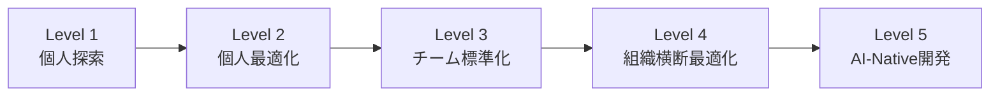

## 課題

「うちのチームはAIをうまく使えているのか？」— この問いに答えられる開発リーダーは少ない。

メトリクスダッシュボードで数値を集めても「どこを目指すべきか」の基準がなければ、データは意思決定に変換されない。スキルの共有やチーム展開を進めても、「今のチームにはどの施策が最も効果的か」を判断するフレームワークがなければ、場当たり的な取り組みに終わる。

この記事では、ソフトウェア開発チームに特化したAIコーディング成熟度モデルを定義する。既存のフレームワーク（Anthropicの5CモデルやOpenAIの5ステップ）を参照しつつ、コーディングエージェントの活用という文脈に絞り込んだ独自のモデルを提案する。

## 既存フレームワークの限界

AIの組織導入に関するフレームワークはすでに複数存在する。

**Anthropic × Asana「5Cフレームワーク」** — [5,007人のナレッジワーカー調査](https://concl.io/blog/5-phases-ai-maturity)に基づき、Skepticism → Activation → Experimentation → Scaling → Maturityの5段階を定義。横断する5つの柱としてComprehension、Concerns、Collaboration、Context、Calibrationを提示している。組織全体のAI活用を俯瞰するには優れたモデルだが、「コーディングエージェントをどう使いこなすか」という具体的な問いには粒度が粗い。

**Anthropic「Building Trusted AI in the Enterprise」** — [AWS共同のエンタープライズ向けプレイブック](https://www.aigl.blog/building-trusted-ai-in-the-enterprise/)で、AI戦略策定 → ビジネス価値創出 → プロダクション構築 → デプロイメントの4段階を示す。各段階でRAGやプロンプトエンジニアリングなどの技術要素が言及されているが、対象はLLMアプリケーション全般であり、開発者のコーディングワークフローに特化していない。

**Anthropic「AI Fluency Index」** — [4D AI Fluency Framework](https://www.anthropic.com/research/AI-fluency-index)（Delegation, Description, Discernment, Diligence）に基づく24の行動指標を定義し、うち11をClaudeの会話データ（9,830件）から直接観察することで個人のAIリテラシーを定量化する試み。個人レベルの測定としては先進的だが、チームや組織の成熟度モデルではない。

**OpenAI「Staying Ahead in the Age of AI」** — [Align → Activate → Amplify → Accelerate → Govern](https://openai.com/business/guides-and-resources/staying-ahead-in-the-age-of-ai/)の5ステップ。San Antonio SpursのAIリテラシー14%→85%の事例が象徴的だ。導入プロセスのガイドとしては実用的だが、「開発チームがコーディングエージェントをどの段階まで活用できているか」を測る尺度にはならない。

これらのフレームワークに共通する限界は、**ソフトウェア開発という特殊なドメインを考慮していない**ことだ。コーディングエージェントの活用は、一般的なAIツール活用とは質的に異なる。コードの正確性、テストとの整合性、アーキテクチャの一貫性、セキュリティ — 開発特有の制約がある。汎用フレームワークをそのまま適用しても、開発チームの現在地を正確に測ることはできない。CLAUDE.mdの整備、スキルライブラリの構築、エージェント生成コードのレビューガイドライン — こうした開発チーム固有の課題に焦点を絞ったモデルが必要だ。

## AIコーディング成熟度モデル：5つのレベル

以下に提案するモデルは、個人最適化からチーム展開、メトリクス設計までの実践経験を体系化したものだ。各レベルは排他的ではなく、チーム内でも個人によってレベルが異なることがある。組織としての成熟度は「最も多くのメンバーが安定して実践できているレベル」で判断する。

### Level 1：個人探索（Ad-hoc Exploration）

**状態：** 一部の開発者がコーディングエージェントを個人的に試している段階。組織としてのポリシーや標準はなく、利用は自発的かつ散発的。

**典型的な行動パターン：**

- ChatGPTやCopilotでコード補完やスニペット生成を試す
- 「動くコードが出てきたらラッキー」程度の期待値
- 生成コードの品質チェックは個人の判断に依存
- エージェントの設定ファイル（CLAUDE.mdなど）は未整備か存在しない

**組織の特徴：**

- AIツールの利用ポリシーが未策定
- セキュリティレビューが行われていない
- コスト管理の仕組みがない
- 「使いたい人は勝手に使っている」状態

**このレベルの落とし穴：** 最大のリスクは「Shadow AI」だ。開発者が個人アカウントで機密コードをエージェントに送信している可能性がある。OpenAIの調査では、[従業員の約半数がAIツールの十分なトレーニングを受けていない](https://openai.com/business/guides-and-resources/staying-ahead-in-the-age-of-ai/)と報告されている。ポリシーの不在は、セキュリティリスクと機会損失の両方を生む。

**次のレベルへの鍵：** まず利用ポリシーを策定し、承認されたツールのリストを作る。全面禁止ではなく「この範囲で使ってよい」を明示することが重要だ。同時に見落としがちなのが、開発者の心理的な抵抗だ。「AIに仕事を奪われる」という漠然とした不安や、「AI生成コードの品質を信用できない」という技術的プライドは、特にシニアエンジニアほど強い。ポリシーの策定と並行して、エージェントは「代替」ではなく「増幅」のツールであるという位置づけを明確にし、試す心理的安全性を確保する必要がある。

### Level 2：個人最適化（Individual Optimization）

**状態：** 開発者がエージェントの設定を意識的に整備し、自分のワークフローに組み込んでいる段階。個人レベルでは明確な生産性向上が見られるが、チーム間での共有はまだない。

**典型的な行動パターン：**

- CLAUDE.mdやカスタムインストラクションを整備し、プロジェクト固有のコンテキストを与えている
- エージェントの得意・不得意を理解し、タスクの使い分けができる
- 生成コードに対してレビューの観点を持っている
- プロンプトの書き方を工夫し、出力品質を安定させている

**組織の特徴：**

- 利用ポリシーは存在するが、ベストプラクティスの共有は個人間の口コミ
- 「あの人はAIをうまく使っている」という属人的な評判がある
- コスト管理は個人またはチーム単位の予算枠
- エージェント活用の成果が個人の中に閉じている

たとえば、355行のCLAUDE.mdを59行に削減しスキルシステムで構造化する、プロンプトのテンプレートを自分のワークフローに合わせて磨き込む — こうした個人レベルの最適化がこのレベルの実践だ。

**このレベルの落とし穴：** 個人最適化が進むほど、チーム内の格差が広がる。Anthropicの[AI Fluency Index](https://www.anthropic.com/research/AI-fluency-index)の研究では、AIとの対話で「反復と改善」を行うユーザーは平均2.67の追加的な流暢性行動を示し、非反復ユーザーの約2倍にのぼることがわかっている。推論を疑問視する確率は5.6倍だ。つまり、うまく使える人はどんどんうまくなり、そうでない人との差が開く一方だ。

**次のレベルへの鍵：** 個人の暗黙知を形式知に変換する仕組みが必要だ。「自分のCLAUDE.mdを整理する」から「チームのスキルライブラリを構築する」への転換点である。ここでの障壁は技術よりも人間関係だ。「自分のやり方を共有したくない」「他人のやり方を押しつけられたくない」という抵抗が生じやすい。最初から完璧な標準を作ろうとせず、うまく使えている開発者のプラクティスを「こういうやり方もある」と紹介する形で始めるのが効果的だ。

### Level 3：チーム標準化（Team Standardization）

**状態：** チーム単位でエージェントの利用方法が標準化され、共有スキルやテンプレートが整備されている段階。新メンバーのオンボーディングにもエージェント活用が組み込まれている。

**典型的な行動パターン：**

- チーム共通のスキルライブラリが存在し、バージョン管理されている
- コーディング規約やアーキテクチャの制約がエージェントの設定に反映されている
- エージェント生成コードのレビューガイドラインがある
- 新メンバーが初日からエージェントを活用できる環境が整っている
- 利用状況の基本的なメトリクスを収集している

共通スキルの強制配布とチーム別カスタマイズの分離は、このレベルの中核的な施策だ。

**このレベルの落とし穴：** チーム内では最適化が進むが、チーム間のサイロ化が起きやすい。フロントエンドチームとバックエンドチームが独立にスキルを整備した結果、API境界での不整合が生じる、といったケースだ。

**次のレベルへの鍵：** チーム横断のメトリクス収集と、組織レベルのガバナンス体制の構築。横断ダッシュボードの整備が、この移行を支える基盤になる。

### Level 4：組織横断最適化（Cross-Organization Optimization）

**状態：** 組織全体でエージェント活用のメトリクスが収集・分析され、データに基づく意思決定が行われている段階。チーム間でのベストプラクティス共有が制度化されている。

**典型的な行動パターン：**

- 複数エージェントの横断ダッシュボードが運用されている
- 1PRあたりコスト、採用率、品質指標などのKPIが定義され、アクション基準が事前に定義されている
- セキュリティ・コンプライアンスのプレイブックが整備されている
- チーム間でスキルやプラクティスの横展開が定期的に行われている
- エージェント活用の専任チーム（またはプラットフォームチーム内の担当）がいる

**このレベルの落とし穴：** メトリクス駆動が行き過ぎると、数値の最適化が目的化する。「エージェント利用率を上げる」ことが目標になり、エージェントが不向きなタスクにまで無理に適用するケースが出てくる。「比較可能なメトリクスと不可能なメトリクスの分離」— たとえば利用率はチーム間で比較できるが、1PRあたりコストはタスクの性質に依存するため単純比較できない — を意識することが重要だ。

**次のレベルへの鍵：** エージェントを「ツール」ではなく「チームメンバー」として扱う文化的転換。技術的な最適化から、開発プロセス自体の再設計へ。

### Level 5：AI-Native開発（AI-Native Development）

**状態：** エージェントの存在を前提として開発プロセスが設計されている段階。「エージェントなしでどう開発するか」ではなく「エージェントと共にどう開発するか」が出発点になっている。

**典型的な行動パターン：**

- 仕様記述からコード生成、テスト、レビューまでエージェントが一貫して関与する
- エージェントが理解しやすいようにコードベースやドキュメントが構造化されている（READMEの充実、モジュール境界の明確化、型定義の厳密化）
- エージェントの出力を前提としたレビュープロセスが確立されている
- エージェント自身がスキルやワークフローを提案・改善する仕組みがある
- 「このタスクはエージェントに任せる」「ここは人間が判断する」の境界が明文化されている
- PRテンプレートにエージェント利用の有無・関与範囲を記録するフィールドがある
- アーキテクチャ決定記録（ADR）にエージェントの制約や特性を考慮した記述が含まれている

**組織の特徴：**

- 採用基準に「AIとの協働スキル」が含まれている
- 開発プロセスの設計時に「エージェントの関与ポイント」が最初から考慮される
- エージェントの進化に合わせてプロセスを継続的に適応させる体制がある

Anthropicの5Cフレームワークの最終段階では、到達している組織は全体の7%に過ぎないとされている。コーディングエージェントに限定すれば、この割合はさらに小さいだろう。現時点でLevel 5を完全に実現している組織は確認できていないが、萌芽的な動きはある。たとえば、エージェントが理解しやすいようにモジュール境界を明確化しREADMEを機械可読に構造化するプラクティスや、PRテンプレートにエージェント関与範囲を記録するワークフローは、一部の先進的なチームですでに試行されている。「スキルを管理するスキル」のように、エージェント自身が自己改善サイクルを回す仕組みも、このレベルへの移行を示す兆候だ。

このレベルを目指す意味は「完璧な状態に到達すること」ではなく、「進化し続ける方向性を持つこと」にある。

## レベル判定：あなたのチームはどこにいるか

以下の質問に答えることで、チームの現在地を大まかに判定できる。

| レベル      | 判定基準                                                                                                                                                                               |
| ----------- | -------------------------------------------------------------------------------------------------------------------------------------------------------------------------------------- |
| Level 2以上 | □ エージェント利用のセキュリティポリシーが策定されている / □ 承認されたエージェントのリストが存在する                                                                                  |
| Level 3以上 | □ チーム共通のスキルライブラリまたは設定テンプレートが存在する / □ エージェント生成コードのレビューガイドラインがある / □ 新メンバーのオンボーディングにエージェント活用が含まれている |
| Level 4以上 | □ チーム横断のメトリクスダッシュボードが運用されている / □ メトリクスに基づくアクション基準が定義されている / □ チーム間でのプラクティス共有が制度化されている                         |
| Level 5     | □ 開発プロセスがエージェントの存在を前提に設計されている / □ エージェントの進化に合わせてプロセスを継続的に適応させる体制がある                                                        |

各レベルの基準をすべて満たしていれば、そのレベルに到達していると判断できる。一つでも欠けていれば、そこが次の改善ポイントだ。

重要なのは、すべてのチームがLevel 5を目指す必要はないということだ。チームの規模、プロダクトの性質、セキュリティ要件によって、最適なレベルは異なる。10人以下のスタートアップならLevel 2〜3で十分な効果が得られるかもしれないし、規制の厳しい金融系ではLevel 4のガバナンス体制が必須かもしれない。

どこに投資すべきか迷っている組織は、L1→L2から始めるのが合理的だ。ポリシー策定とツール選定は比較的低コストで実施でき、個人レベルの生産性向上は即座に現れる。レベルが上がるほど投資規模は大きくなるが、AIコーディングエージェントの能力は急速に進化しており、早期にAI-Nativeな開発文化を構築した組織は、エージェントの進化をそのまま競争優位に変換できる。

## このモデルの限界

率直に言えば、このモデルにも限界がある。このモデルは個人およびチームレベルでの実践経験を体系化したものであり、多数の組織で検証された成熟度モデルではない。現時点では仮説段階のフレームワークとして位置づけ、適用と検証を通じて改善していく前提で読んでほしい。

第一に、**コーディングエージェントの進化速度が速すぎる**。半年前のベストプラクティスが今日は陳腐化している可能性がある。モデル自体を固定的に運用するのではなく、各レベルの定義を定期的に見直す必要がある。

第二に、**組織の文脈依存性が高い**。20人のスタートアップと500人のエンタープライズでは、同じLevel 3でも具体的な施策がまったく異なる。このモデルは「何を考えるべきか」のフレームワークであり、「何をすべきか」のレシピではない。

第三に、**定性的な判断に依存する部分が大きい**。「レビューガイドラインがある」と言っても、形骸化したチェックリストと実効性のあるガイドラインでは天と地の差がある。メトリクスダッシュボードのデータと組み合わせて、定性評価の精度を補完することが重要だ。

第四に、**高成熟度の追求自体にリスクがある**。エージェントへの依存が深まると、ジュニア開発者が基礎的なコーディングスキルを身につける機会が減る。エージェントの障害時に開発が完全に止まる事業継続性リスクも生じる。さらに、エージェントが生成した大量のコードは、生成時には正しく見えても、長期的な保守性が検証されていない。Level 4以上を目指す組織は、「エージェントなしでも開発できる能力の維持」を意識的に設計に組み込む必要がある。

## まとめ

- **汎用フレームワークをそのまま適用しない** — Anthropicの5CやOpenAIの5ステップは優れたモデルだが、コーディングエージェントの活用という文脈では粒度が粗い。開発チーム固有の課題（コード品質、レビュー、アーキテクチャ一貫性）を反映したモデルが必要だ。
- **L1→L2の投資対効果が最も高い** — ポリシー策定とツール選定は低コストで実施でき、効果は即座に現れる。迷っているなら、まずここから始める。
- **レビューガイドラインがチーム標準化の起点になる** — スキルライブラリより先に、エージェント生成コードのレビュー観点を共有することで、チーム全体のAIリテラシーが底上げされる。
- **成熟度は「到達すべきゴール」ではなく「現在地を知る地図」である** — すべてのチームがLevel 5を目指す必要はない。自チームに最適なレベルを見極め、そこに向けた投資を合理的に判断するためのフレームワークとして使う。
