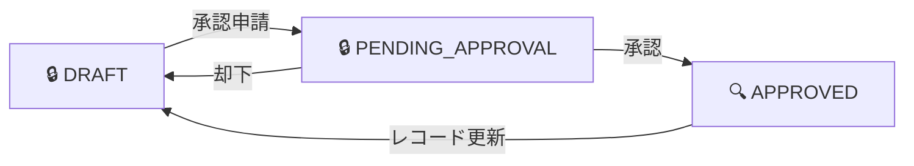

## はじめに

2026年4月9日、AWS は [AWS Agent Registry のプレビュー提供](https://aws.amazon.com/about-aws/whats-new/2026/04/aws-agent-registry-in-agentcore-preview/)を発表した。Amazon Bedrock AgentCore を通じて利用できる、組織内の AI エージェント・ツール・MCP サーバー・スキルを一元的にカタログ化・発見・ガバナンスするマネージドサービスである。

エージェントの数が増えると「何が存在するか分からない」「同じものを再構築してしまう」という課題が生じる。Agent Registry はこれを、承認ワークフロー付きのカタログとセマンティック/キーワードのハイブリッド検索で解決する。さらに、レジストリ自体が MCP サーバーとして機能し、IDE やエージェントから直接検索できる点が特徴的である。

本記事では、Agent Registry の基本ワークフローを CLI で一通り実行した上で、ハイブリッド検索の精度（日本語クエリを含む）と MCP エンドポイントの実用性を実測データで評価する。公式ドキュメントは [AWS Agent Registry](https://docs.aws.amazon.com/bedrock-agentcore/latest/devguide/registry.html) を参照。

前提条件:

- AWS CLI v2.34.28+（`bedrock-agentcore:*` の権限）
- 検証リージョン: ap-northeast-1（東京）

セットアップだけ見たい場合は[検証環境のセットアップ](#検証環境のセットアップ)、結果だけ見たい場合は[検証 1](#検証-1-承認ワークフローとステータス遷移)に進んでほしい。

## 検証環境のセットアップ

<details className="my-4 rounded-lg border border-border bg-muted/30 p-4">
<summary className="cursor-pointer font-medium">IAM ポリシー・レジストリ作成・レコード登録・承認の全手順</summary>

### IAM ポリシー

Administrator ペルソナ（レジストリ管理 + レコード管理 + 承認）と Consumer ペルソナ（検索 + MCP 呼び出し）の両方の権限が必要である。

```json title="IAM Policy"
{
  "Version": "2012-10-17",
  "Statement": [
    {
      "Effect": "Allow",
      "Action": [
        "bedrock-agentcore:CreateRegistry",
        "bedrock-agentcore:GetRegistry",
        "bedrock-agentcore:DeleteRegistry",
        "bedrock-agentcore:ListRegistries"
      ],
      "Resource": "arn:aws:bedrock-agentcore:*:<account-id>:*"
    },
    {
      "Effect": "Allow",
      "Action": [
        "bedrock-agentcore:CreateRegistryRecord",
        "bedrock-agentcore:GetRegistryRecord",
        "bedrock-agentcore:UpdateRegistryRecord",
        "bedrock-agentcore:DeleteRegistryRecord",
        "bedrock-agentcore:ListRegistryRecords",
        "bedrock-agentcore:SubmitRegistryRecordForApproval",
        "bedrock-agentcore:UpdateRegistryRecordStatus"
      ],
      "Resource": "arn:aws:bedrock-agentcore:*:<account-id>:registry/*"
    },
    {
      "Effect": "Allow",
      "Action": [
        "bedrock-agentcore:SearchRegistryRecords",
        "bedrock-agentcore:InvokeRegistryMcp"
      ],
      "Resource": "arn:aws:bedrock-agentcore:*:<account-id>:registry/*"
    }
  ]
}
```

### レジストリ作成

IAM 認証・手動承認でレジストリを作成する。

```bash title="Terminal"
aws bedrock-agentcore-control create-registry \
  --name "agent-registry-verification" \
  --description "Registry for verifying Agent Registry features" \
  --region ap-northeast-1
```

```text title="Output"
{
    "registryArn": "arn:aws:bedrock-agentcore:ap-northeast-1:<account-id>:registry/<registry-id>"
}
```

ステータスが `CREATING` から `READY` に変わるまで約90秒かかった。

```bash title="Terminal"
aws bedrock-agentcore-control get-registry \
  --registry-id "<registry-id>" \
  --region ap-northeast-1
```

```text title="Output"
{
    "name": "agent-registry-verification",
    "authorizerType": "AWS_IAM",
    "approvalConfiguration": { "autoApproval": false },
    "status": "READY"
}
```

デフォルトで IAM 認証・手動承認（`autoApproval: false`）が設定される。

### レコード登録

検索精度の検証に使う 4 つのレコードを登録する。

| レコード名 | タイプ | 説明 | 検証での役割 |
|---|---|---|---|
| weather-api | MCP | 天気データ・予報サービス | キーワード検索のターゲット |
| travel-booking-agent | A2A | 出張の航空券・ホテル予約エージェント | セマンティック検索のターゲット |
| data-analysis-skill | AGENT_SKILLS | CSV/JSON データ分析スキル | フィルタ検索のターゲット |
| notification-service | MCP | メール・Slack・SMS 通知サービス | タイプフィルタの検証用 |

**MCP サーバーレコードの作成:**

MCP サーバーの `server` 定義では、`name` フィールドに reverse-DNS 形式（`io.example/weather-api`）が必要であり、`description` は 100 文字以内という制約がある。これらはドキュメントには明記されておらず、[MCP Registry の server.json スキーマ](https://static.modelcontextprotocol.io/schemas/2025-07-09/server.schema.json)を確認して判明した。

```bash title="Terminal"
aws bedrock-agentcore-control create-registry-record \
  --registry-id "<registry-id>" \
  --name "weather-api" \
  --description "Weather data and forecast service via OpenWeatherMap API" \
  --record-version "1.0.0" \
  --descriptor-type MCP \
  --descriptors '{
    "mcp": {
      "server": {
        "schemaVersion": "2025-07-09",
        "inlineContent": "{\"name\": \"io.example/weather-api\", \"description\": \"Weather data and forecast service via OpenWeatherMap API\", \"version\": \"1.0.0\"}"
      },
      "tools": {
        "protocolVersion": "2024-11-05",
        "inlineContent": "{\"tools\": [{\"name\": \"get_weather\", \"description\": \"Get current weather conditions for a specified location\", \"inputSchema\": {\"type\": \"object\", \"properties\": {\"location\": {\"type\": \"string\", \"description\": \"City name or coordinates\"}}, \"required\": [\"location\"]}}, {\"name\": \"get_forecast\", \"description\": \"Get weather forecast for the next 7 days\", \"inputSchema\": {\"type\": \"object\", \"properties\": {\"location\": {\"type\": \"string\", \"description\": \"City name or coordinates\"}, \"days\": {\"type\": \"integer\", \"description\": \"Number of forecast days\"}}, \"required\": [\"location\"]}}]}"
      }
    }
  }' \
  --region ap-northeast-1
```

notification-service も同様の構造で作成する。

**A2A エージェントレコードの作成:**

A2A レコードでは `agentCard` に A2A プロトコル仕様に準拠した JSON を指定する。`protocolVersion`、`url`、`capabilities`、`defaultInputModes`、`defaultOutputModes`、`skills` が必須である。

```bash title="Terminal"
aws bedrock-agentcore-control create-registry-record \
  --registry-id "<registry-id>" \
  --name "travel-booking-agent" \
  --description "Books flights and hotels for business trips and manages itineraries" \
  --record-version "1.0.0" \
  --descriptor-type A2A \
  --descriptors '{
    "a2a": {
      "agentCard": {
        "schemaVersion": "0.3",
        "inlineContent": "{\"name\": \"travel-booking-agent\", \"description\": \"Books flights and hotels for business trips\", \"version\": \"1.0.0\", \"protocolVersion\": \"0.3.0\", \"url\": \"https://example.com/agents/travel-booking\", \"capabilities\": {}, \"defaultInputModes\": [\"text/plain\"], \"defaultOutputModes\": [\"text/plain\"], \"skills\": [{\"id\": \"book-flight\", \"name\": \"Book Flight\", \"description\": \"Search and book flights\", \"tags\": [\"travel\"]}, {\"id\": \"book-hotel\", \"name\": \"Book Hotel\", \"description\": \"Search and book hotels\", \"tags\": [\"travel\"]}]}"
      }
    }
  }' \
  --region ap-northeast-1
```

**AGENT_SKILLS レコードの作成:**

AGENT_SKILLS タイプでは `skillMd`（マークダウン）と `skillDefinition`（構造化定義）を指定する。CLI のパラメータ名は `skillMd`（ドキュメントの REST API では `skillMarkdown`）であり、`inlineContent` でラップする必要がある点に注意。

```bash title="Terminal"
aws bedrock-agentcore-control create-registry-record \
  --cli-input-json '{
    "registryId": "<registry-id>",
    "name": "data-analysis-skill",
    "description": "Analyzes CSV and JSON datasets and generates summary reports",
    "recordVersion": "1.0.0",
    "descriptorType": "AGENT_SKILLS",
    "descriptors": {
      "agentSkills": {
        "skillMd": {
          "inlineContent": "---\nname: data-analysis-skill\ndescription: Analyzes CSV and JSON datasets and generates summary reports\n---\n\n# Data Analysis Skill\n\nAnalyzes structured data files (CSV, JSON) and produces summary statistics and reports."
        },
        "skillDefinition": {
          "schemaVersion": "0.1.0",
          "inlineContent": "{\"websiteUrl\": \"https://example.com/data-analysis-skill\", \"repository\": {\"url\": \"https://github.com/example/data-analysis-skill\", \"source\": \"github\"}}"
        }
      }
    }
  }' \
  --region ap-northeast-1
```

### 承認ワークフロー

4 レコードすべてを承認申請 → 承認する。

```bash title="Terminal"
# 承認申請
aws bedrock-agentcore-control submit-registry-record-for-approval \
  --registry-id "<registry-id>" \
  --record-id "<record-id>" \
  --region ap-northeast-1

# 承認
aws bedrock-agentcore-control update-registry-record-status \
  --registry-id "<registry-id>" \
  --record-id "<record-id>" \
  --status APPROVED \
  --status-reason "Reviewed and approved for verification" \
  --region ap-northeast-1
```

</details>

## 検証 1: 承認ワークフローとステータス遷移

Agent Registry のレコードは Draft → Pending Approval → Approved のライフサイクルを持つ。承認されたレコードのみが検索結果に表示される。



### ステータス遷移の確認

レジストリ作成後、4 つのレコードを登録した。初期ステータスは `DRAFT` である。

```bash title="Terminal"
aws bedrock-agentcore-control list-registry-records \
  --registry-id "<registry-id>" \
  --region ap-northeast-1 \
  --query 'registryRecords[].{name:name, type:descriptorType, status:status}' \
  --output table
```

```text title="Output"
----------------------------------------------------------------------
|                         ListRegistryRecords                        |
+------------------------+---------+----------------+----------------+
|          name          | status  |     type       |                |
+------------------------+---------+----------------+----------------+
|  weather-api           |  DRAFT  |  MCP           |                |
|  notification-service  |  DRAFT  |  MCP           |                |
|  data-analysis-skill   |  DRAFT  |  AGENT_SKILLS  |                |
|  travel-booking-agent  |  DRAFT  |  A2A           |                |
+------------------------+---------+----------------+----------------+
```

### 未承認レコードの検索不可を確認

DRAFT 状態で検索を実行すると、結果は空である。なお、検索 API（data plane）では `--registry-ids` に ARN を指定する。レジストリ管理（control plane）の `--registry-id` とは異なる点に注意。

```bash title="Terminal"
aws bedrock-agentcore search-registry-records \
  --search-query "weather" \
  --registry-ids "<registry-arn>" \
  --region ap-northeast-1
```

```json title="Output"
{ "registryRecords": [] }
```

承認申請（`submit-registry-record-for-approval`）で `PENDING_APPROVAL` に遷移した後も、検索結果は空のままである。

```json title="Output (PENDING_APPROVAL)"
{ "registryRecords": [] }
```

`update-registry-record-status` で `APPROVED` に遷移させると、約60秒後に検索結果に表示されるようになった。

**ポイント:** DRAFT でも PENDING_APPROVAL でも検索結果には出ない。承認ワークフローがガバナンスとして機能していることを確認できた。これで 4 レコードすべてが検索可能な状態になったので、次に検索精度を検証する。

## 検証 2: ハイブリッド検索の精度

Agent Registry の検索はハイブリッド方式で、すべてのクエリに対してキーワード検索（テキスト一致）とセマンティック検索（意味的な類似性）が同時に実行され、両方のスコアを統合してランキングされる。

検証 1 で承認した 4 つのレコードに対して、検索精度を検証する。

| レコード名 | タイプ | 説明 |
|---|---|---|
| weather-api | MCP | 天気データ・予報サービス |
| travel-booking-agent | A2A | 出張の航空券・ホテル予約エージェント |
| data-analysis-skill | AGENT_SKILLS | CSV/JSON データ分析スキル |
| notification-service | MCP | メール・Slack・SMS 通知サービス |

### 2-1: キーワード検索 vs セマンティック検索

検索コマンドの基本形は以下の通り。`--search-query` と `--filters` を変えて 3 パターンを試す。

**キーワード検索: 正確な名前で検索**

```bash title="Terminal"
aws bedrock-agentcore search-registry-records \
  --search-query "weather-api" \
  --registry-ids "<registry-arn>" \
  --region ap-northeast-1
```

結果: `weather-api` のみがヒット。名前の完全一致で正確に絞り込まれる。

**セマンティック検索: 自然言語で検索**

`--search-query` を `"automate business trip arrangements"` に変更して実行。

結果: `travel-booking-agent` がヒット。レコードの名前や説明に "arrangements" という単語は含まれていないが、概念的に関連するレコードが正しく返された。

**フィルタ付き検索: タイプで絞り込み**

`--search-query "weather"` に加え、`--filters '{"descriptorType": {"$eq": "MCP"}}'` を指定して実行。

結果: `weather-api` のみ。フィルタで MCP サーバーに限定できた。

上記 3 パターンに加え、さらに 2 つのセマンティック検索クエリも試した。全 5 クエリの結果を以下にまとめる。

| クエリ | タイプ | 結果 |
|---|---|---|
| `weather-api` | キーワード | weather-api |
| `a tool that fetches weather forecasts` | セマンティック | weather-api, notification-service |
| `automate business trip arrangements` | セマンティック | travel-booking-agent |
| `find a tool that sends notifications` | セマンティック | notification-service, weather-api |
| `weather` + filter:MCP | フィルタ | weather-api |

セマンティック検索では、クエリに直接含まれない単語のレコードも概念的な関連性でヒットする。一方で、意図したターゲット以外のレコードも返る場合がある（例: weather 関連クエリで notification-service がヒット）。精度を高めるにはフィルタとの併用が実用上重要である。

### 2-2: 日本語クエリ vs 英語クエリ

レコードのメタデータはすべて英語で登録している。日本語のクエリでも正しくヒットするか検証する。

| 日本語クエリ | 英語クエリ | 日本語結果 | 英語結果 |
|---|---|---|---|
| 天気予報を取得するツール | a tool that fetches weather forecasts | weather-api | weather-api, notification-service |
| 出張の手配を自動化したい | automate business trip arrangements | **(0件)** | travel-booking-agent |
| データを分析してレポートを作成 | analyze data and generate reports | data-analysis-skill | 全4件（data-analysis-skill が1位） |

**重要な発見: 日本語クエリ「出張の手配を自動化したい」で結果が 0 件だった。** 英語の同等クエリでは `travel-booking-agent` が正しくヒットする。

この結果から、英語メタデータに対する日本語クエリのセマンティック検索には限界があることが分かる。今回の検証では、「天気予報」→ weather-api はヒットしたが、「出張の手配」→ travel-booking-agent はヒットしなかった。3 クエリのみの検証であるため一般化はできないが、日本語クエリの精度は英語クエリより低い傾向が見られた。

**対策の検証:** `travel-booking-agent` の description を「Books flights and hotels for business trips / 出張の航空券・ホテル予約エージェント」に更新し、再承認した上で同じ日本語クエリを実行した。

```bash title="Terminal"
aws bedrock-agentcore-control update-registry-record \
  --cli-input-json '{
    "registryId": "<registry-id>",
    "recordId": "<record-id>",
    "description": {
      "optionalValue": "Books flights and hotels for business trips / 出張の航空券・ホテル予約エージェント"
    }
  }' \
  --region ap-northeast-1
```

なお、レコードを更新するとステータスが DRAFT に戻るため、再度承認申請 → 承認が必要である。

| 日本語クエリ | 更新前 | 更新後 |
|---|---|---|
| 出張の手配を自動化したい | 0件 | **travel-booking-agent** ✓ |
| 航空券の予約 | （未検証） | **travel-booking-agent** ✓ |

**description に日本語を併記することで、日本語クエリのセマンティック検索が機能するようになった。** 日本語話者が多い組織では、レコード登録時に英語と日本語の両方を description に含めることを推奨する。

### 2-3: クエリの書き方による結果の違い

ドキュメントでは「フィルタ的な制約をクエリテキストに混ぜず、メタデータフィルタを使うべき」と推奨されている。実際にどの程度結果が変わるか検証した。

```bash title="Terminal (悪い例: 制約をクエリに混ぜる)"
aws bedrock-agentcore search-registry-records \
  --search-query "find all MCP servers for weather forecasts" \
  --registry-ids "<registry-arn>" \
  --region ap-northeast-1
```

```bash title="Terminal (良い例: フィルタを分離)"
aws bedrock-agentcore search-registry-records \
  --search-query "weather forecasts" \
  --registry-ids "<registry-arn>" \
  --filters '{"descriptorType": {"$eq": "MCP"}}' \
  --region ap-northeast-1
```

| クエリ方式 | 結果 |
|---|---|
| `"find all MCP servers for weather forecasts"`（制約混在） | weather-api, travel-booking-agent, notification-service, data-analysis-skill（**4件全部**） |
| `"weather forecasts"` + filter:MCP（フィルタ分離） | weather-api（**1件のみ**） |

制約をクエリに混ぜると 4 件全部が返り、フィルタを分離すると 1 件のみになった。[ドキュメント](https://docs.aws.amazon.com/bedrock-agentcore/latest/devguide/registry-search-records.html)でも、長いクエリはセマンティック検索寄りになり、属性制約が意図通りに機能しなくなると説明されている。今回の検証結果はこの推奨を裏付けるものである。

### 2-4: MCP エンドポイントでの検索

Agent Registry は各レジストリに MCP エンドポイントを公開する。MCP 互換クライアントから直接検索できる。

MCP エンドポイントの呼び出しには SigV4 署名が必要である。以下のように一時認証情報を環境変数にエクスポートしてから curl を実行する。

```bash title="Terminal (認証情報のエクスポート)"
eval $(aws configure export-credentials --format env)
```

**ツール一覧の取得:**

```bash title="Terminal"
curl -s -X POST \
  "https://bedrock-agentcore.ap-northeast-1.amazonaws.com/registry/<registry-id>/mcp" \
  -H "Content-Type: application/json" \
  -H "X-Amz-Security-Token: ${AWS_SESSION_TOKEN}" \
  --aws-sigv4 "aws:amz:ap-northeast-1:bedrock-agentcore" \
  --user "${AWS_ACCESS_KEY_ID}:${AWS_SECRET_ACCESS_KEY}" \
  -d '{"jsonrpc":"2.0","id":1,"method":"tools/list"}'
```

`search_registry_records` という 1 つのツールが返される。引数は `searchQuery`（必須）、`maxResults`、`filter`（オプション）。

**MCP 経由の検索:**

curl コマンドは同じ構造で、`-d` の JSON ボディのみが異なる。フィルタ付き検索の場合は `arguments` 内に `"filter": {"descriptorType": {"$eq": "MCP"}}` を追加する。

```bash title="Terminal"
curl -s -X POST \
  "https://bedrock-agentcore.ap-northeast-1.amazonaws.com/registry/<registry-id>/mcp" \
  -H "Content-Type: application/json" \
  -H "X-Amz-Security-Token: ${AWS_SESSION_TOKEN}" \
  --aws-sigv4 "aws:amz:ap-northeast-1:bedrock-agentcore" \
  --user "${AWS_ACCESS_KEY_ID}:${AWS_SECRET_ACCESS_KEY}" \
  -d '{"jsonrpc":"2.0","id":2,"method":"tools/call","params":{"name":"search_registry_records","arguments":{"searchQuery":"weather-api"}}}'
```

**API と MCP の結果比較:**

| クエリ | API 結果 | MCP 結果 | 一致 |
|---|---|---|---|
| weather-api | weather-api | weather-api | ✓ |
| automate business trip arrangements | travel-booking-agent | travel-booking-agent | ✓ |
| weather + filter:MCP | weather-api | weather-api | ✓ |

API 経由と MCP エンドポイント経由で同一の結果が返された。検証した 3 クエリすべてで結果が一致しており、MCP エンドポイントは一貫した動作をしている。

MCP エンドポイントの URL は `https://bedrock-agentcore.<region>.amazonaws.com/registry/<registryId>/mcp` であり、IAM 認証の場合は SigV4 署名が必要である。Kiro や Claude Code などの MCP 互換クライアントからは、[mcp-proxy-for-aws](https://github.com/aws/mcp-proxy-for-aws) を使って接続できる。

## まとめ

Agent Registry の基本ワークフローと検索機能を検証した結果をまとめる。

**承認ワークフローはガバナンスとして機能する** — DRAFT・PENDING_APPROVAL のレコードは検索結果に一切表示されない。組織内で「承認されたリソースのみが発見可能」という制御が確実に効く。

**セマンティック検索は英語クエリで実用的な精度を持つ** — レコード名や説明に含まれない表現でも、概念的に関連するレコードを返せる。ただし、意図したターゲット以外のレコードも返る場合があるため、`descriptorType` フィルタとの併用が推奨される。

**日本語クエリのセマンティック検索には限界がある** — 英語メタデータに対する日本語クエリでは、ヒットするケースとしないケースがあった（3 クエリ中 1 件が 0 件）。ただし、description に日本語を併記することで改善できることを実証した。日本語話者が多い組織では、レコード登録時に日英両方の説明を含めるべきである。

**検索クエリにフィルタ的な制約を混ぜてはいけない** — 「find all MCP servers for weather forecasts」のようにタイプ制約をクエリに含めると、4 件全部が返ってしまった。ドキュメントの推奨通り、タイプや名前での絞り込みにはメタデータフィルタを使うべきである。

**MCP エンドポイントは API と同等の品質で動作する** — 検索結果は API 経由と完全に一致した。IDE やエージェントからの直接検索が実用的に機能する。

### レコード作成時の注意点

セットアップ中に遭遇した、ドキュメントだけでは分かりにくい点:

- MCP サーバーの `name` は reverse-DNS 形式（例: `io.example/weather-api`）が必須。MCP Registry の server.json スキーマに準拠する必要がある
- MCP サーバーの `description` は 100 文字以内（スキーマバージョン `2025-07-09` の場合）
- AGENT_SKILLS の CLI パラメータ名は `skillMd`（REST API の `skillMarkdown` とは異なる）で、`{inlineContent: "..."}` 構造でラップする
- `schemaVersion` の指定が必須。省略するとバリデーションエラーになる
- レコードを更新（`update-registry-record`）するとステータスが DRAFT に戻る。再度承認申請 → 承認が必要

### Agent Registry が有効な場面

- エージェント・ツールが複数チームにまたがり、「何が存在するか」の可視性が低い
- 承認ワークフローによるガバナンスが必要（セキュリティ・コンプライアンス要件）
- IDE やエージェントからプログラマティックにリソースを発見したい（MCP エンドポイント）

### 現時点での留意点

- プレビュー段階であり、GA までに仕様が変更される可能性がある
- 日本語クエリのセマンティック検索精度に課題がある（英語メタデータの場合）
- CLI のコマンドは AWS CLI v2.34.28 以降で利用可能
- 利用可能リージョンは 5 つ（us-east-1, us-west-2, ap-northeast-1, ap-southeast-2, eu-west-1）

## クリーンアップ

<details className="my-4 rounded-lg border border-border bg-muted/30 p-4">
<summary className="cursor-pointer font-medium">リソースの削除手順</summary>

レコードを先に削除し、その後レジストリを削除する。

```bash title="Terminal"
# レコードの削除
aws bedrock-agentcore-control delete-registry-record \
  --registry-id "<registry-id>" \
  --record-id "<record-id>" \
  --region ap-northeast-1

# レジストリの削除
aws bedrock-agentcore-control delete-registry \
  --registry-id "<registry-id>" \
  --region ap-northeast-1
```

</details>
