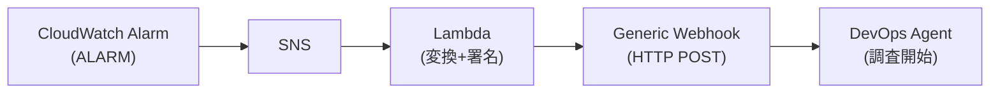

## はじめに

[第1回](/ja/blog/2026/04/01/aws-devops-agent-ga-verification)〜[第4回](/ja/blog/2026/04/01/aws-devops-agent-eventbridge-notification)では、DevOps Agent のセットアップ、スキル、予防、EventBridge 連携を検証した。第4回は「調査完了後の通知」だったが、本記事はその対になるテーマ — 「調査開始の自動化」を扱う。

DevOps Agent は [Generic Webhook](https://docs.aws.amazon.com/devopsagent/latest/userguide/configuring-capabilities-for-aws-devops-agent-invoking-devops-agent-through-webhook.html) を提供しており、外部システムから HTTP POST で調査を起動できる。これを CloudWatch アラームと組み合わせれば、アラーム発火から調査開始まで人手を介さないパイプラインが構築できる。

本記事では、Webhook の基本動作を確認した後、CloudWatch アラーム → SNS → Lambda → Webhook の自動トリガーパイプラインを構築し、エンドツーエンドの所要時間を計測する。

前提条件:

- [第1回](/ja/blog/2026/04/01/aws-devops-agent-ga-verification)で作成したエージェントスペースが稼働中であること
- [第4回](/ja/blog/2026/04/01/aws-devops-agent-eventbridge-notification)で作成した EventBridge ルール（`source: aws.aidevops` → CloudWatch Logs）— タイムライン追跡に使用
- AWS CLI v2、Lambda / SNS / IAM / CloudWatch の操作権限
- 調査対象の EC2 インスタンス（本記事では第1回で作成した web-app-prod-01 を再利用）

結果だけ見たい場合は[まとめ](#まとめ)に進んでほしい。

## 検証 1: Generic Webhook のセットアップと動作確認

### Webhook の生成

Generic Webhook の生成は AWS マネジメントコンソールから行う。CLI / API には生成用のエンドポイントが存在しない（`list_webhooks` による一覧取得のみ可能）。

1. AWS マネジメントコンソール → DevOps Agent → エージェントスペースを選択
2. 「Capabilities」タブ → 「Webhook」セクション → 「Configure」
3. 「Generate webhook」をクリック

生成されると、以下の情報が表示される。

- **Webhook URL**: `https://event-ai.{region}.api.aws/webhook/generic/{webhook-id}`
- **HMAC Secret**: SHA-256 署名に使用する秘密鍵（この画面でしか確認できない）

Generic Webhook の認証方式は HMAC のみである。Bearer トークンは Splunk / Datadog / New Relic / ServiceNow / Slack のインテグレーション専用 Webhook で使用される。

### HMAC 署名の実装

Webhook リクエストには以下の3つのヘッダーが必要である。

- `Content-Type: application/json`
- `x-amzn-event-timestamp`: ISO 8601 形式のタイムスタンプ
- `x-amzn-event-signature`: HMAC-SHA256 署名（Base64 エンコード）

署名の入力は `{timestamp}:{payload}` を連結した文字列である。

```bash title="Terminal (HMAC 署名生成)"
SIGNATURE=$(echo -n "${TIMESTAMP}:${PAYLOAD}" \
  | openssl dgst -sha256 -hmac "$SECRET" -binary \
  | base64)
```

### ペイロードの構造

Webhook に送信するペイロードのフィールドを整理する。ドキュメントには各フィールドの必須/任意が明示されていないため、サンプルコードでの使用状況をもとに分類した。

| フィールド | サンプルコードでの使用 | 説明 |
|---|---|---|
| `eventType` | 全サンプルに含まれる | サンプルでは `"incident"` のみ使用されている |
| `incidentId` | 全サンプルに含まれる | 一意の識別子。重複送信時の動作に影響する（後述） |
| `action` | 全サンプルに含まれる | サンプルでは `"created"` のみ使用されている |
| `priority` | 全サンプルに含まれる | `"HIGH"` / `"MEDIUM"` / `"LOW"` — 調査タスクの優先度に反映される |
| `title` | 全サンプルに含まれる | 調査タスクのタイトルになる |
| `description` | 全サンプルに含まれる | エージェントが調査の起点とする説明文 |
| `service` | サンプルコードに含まれる | サービス名 |
| `timestamp` | サンプルコードに含まれる | インシデント発生時刻 |
| `affectedResources` | Request body 例に含まれる | 影響を受けるリソースの ID 配列 |
| `data.metadata` | Request body 例に含まれる | 任意のメタデータ（region、environment など） |

`description` と `affectedResources` はエージェントに調査の文脈を与えるフィールドである。今回の検証では `affectedResources` にインスタンス ID を含めたペイロードで送信し、エージェントが該当インスタンスを調査対象としたことを確認した。

### 手動トリガーテスト

上記のフィールドを含むペイロードを curl で送信し、調査が起動するか確認した。

<details className="my-4 rounded-lg border border-border bg-muted/30 p-4">
<summary className="cursor-pointer font-medium">curl コマンド全体</summary>

```bash title="Terminal"
WEBHOOK_URL="https://event-ai.ap-northeast-1.api.aws/webhook/generic/(webhook-id)"
SECRET="(your-webhook-secret)"

TIMESTAMP=$(date -u +%Y-%m-%dT%H:%M:%S.000Z)
INCIDENT_ID="test-webhook-$(date +%s)"

PAYLOAD=$(cat <<EOF
{
  "eventType": "incident",
  "incidentId": "$INCIDENT_ID",
  "action": "created",
  "priority": "HIGH",
  "title": "High CPU usage on production server",
  "description": "CPU utilization exceeded 80% on instance i-0123456789abcdef0 in ap-northeast-1",
  "service": "web-app-prod",
  "timestamp": "$TIMESTAMP",
  "affectedResources": ["i-0123456789abcdef0"],
  "data": {
    "metadata": {
      "region": "ap-northeast-1",
      "environment": "production"
    }
  }
}
EOF
)

SIGNATURE=$(echo -n "${TIMESTAMP}:${PAYLOAD}" \
  | openssl dgst -sha256 -hmac "$SECRET" -binary \
  | base64)

curl -s -X POST "$WEBHOOK_URL" \
  -H "Content-Type: application/json" \
  -H "x-amzn-event-timestamp: $TIMESTAMP" \
  -H "x-amzn-event-signature: $SIGNATURE" \
  -d "$PAYLOAD"
```

</details>

レスポンスは以下の通りである。

```json title="Webhook レスポンス"
{"message": "Webhook received"}
```

HTTP 200 と `Webhook received` が返れば、認証は成功している。ただし 200 は「メッセージがキューに入った」ことを意味し、調査が即座に開始されるわけではない。調査タスクの作成はオペレーターアクセスの画面、または EventBridge ログで確認できる。

### 手動トリガーのタイムライン

EventBridge のログで調査のライフサイクルを追跡した。本シリーズの[第4回](/ja/blog/2026/04/01/aws-devops-agent-eventbridge-notification)で作成した EventBridge ルール（`source: aws.aidevops` → CloudWatch Logs）を使用している。ルールがない場合は第4回を参照してほしい。

<details className="my-4 rounded-lg border border-border bg-muted/30 p-4">
<summary className="cursor-pointer font-medium">EventBridge ログの確認コマンド</summary>

```bash title="Terminal"
aws logs filter-log-events \
  --log-group-name "/aws/events/devops-agent" \
  --filter-pattern "Investigation" \
  --start-time $(date -d '10 minutes ago' +%s)000 \
  --limit 10 \
  --region ap-northeast-1 \
  --query 'events[*].message' --output json \
  | python3 -c "
import sys, json
for m in json.load(sys.stdin):
    msg = json.loads(m)
    print(f'{msg[\"time\"]}  {msg[\"detail-type\"]}')
"
```

</details>

| イベント | 時刻 (UTC) | 経過 |
|---|---|---|
| curl 送信 | 10:55:05 | — |
| Investigation Created | 10:56:10 | +65秒 |
| Investigation In Progress | 10:56:30 | +85秒 |
| Investigation Completed | 11:00:14 | +5分9秒 |

Webhook 送信から調査タスク作成まで約65秒の遅延がある。これは Webhook メッセージのキューイングとトリアージ処理によるものと考えられる。

## 検証 2: CloudWatch アラーム → 調査自動起動パイプライン

### アーキテクチャ

CloudWatch アラームが ALARM 状態になると SNS に通知が送られ、Lambda 関数がアラーム情報を Webhook ペイロードに変換して HMAC 署名付きで送信する。



### Lambda 関数の実装

Lambda 関数は以下の処理を行う。

1. SNS メッセージから CloudWatch アラーム情報をパース
2. アラームの Dimensions からインスタンス ID を抽出し `affectedResources` に設定
3. HMAC-SHA256 署名を生成
4. Webhook エンドポイントに POST

<details className="my-4 rounded-lg border border-border bg-muted/30 p-4">
<summary className="cursor-pointer font-medium">Lambda 関数コード (lambda_function.py)</summary>

```python title="lambda_function.py"
import json
import hashlib
import hmac
import os
import urllib.request
import base64
from datetime import datetime, timezone

WEBHOOK_URL = os.environ["WEBHOOK_URL"]
WEBHOOK_SECRET = os.environ["WEBHOOK_SECRET"]

def lambda_handler(event, context):
    sns_message = json.loads(event["Records"][0]["Sns"]["Message"])

    alarm_name = sns_message.get("AlarmName", "Unknown Alarm")
    reason = sns_message.get("NewStateReason", "")
    region = sns_message.get("Region", "")

    # Dimensions からインスタンス ID を抽出
    resources = []
    trigger = sns_message.get("Trigger", {})
    for dim in trigger.get("Dimensions", []):
        if dim.get("name") == "InstanceId":
            resources.append(dim["value"])

    timestamp = datetime.now(timezone.utc).strftime("%Y-%m-%dT%H:%M:%S.000Z")
    incident_id = f"cw-alarm-{alarm_name}-{int(datetime.now(timezone.utc).timestamp())}"

    payload = {
        "eventType": "incident",
        "incidentId": incident_id,
        "action": "created",
        "priority": "HIGH",
        "title": f"CloudWatch Alarm: {alarm_name}",
        "description": f"{alarm_name}: {reason}",
        "service": "cloudwatch-alarm",
        "timestamp": timestamp,
        "affectedResources": resources,
        "data": {
            "metadata": {
                "region": region,
                "alarmName": alarm_name
            }
        }
    }

    payload_str = json.dumps(payload)

    # HMAC 署名
    sign_input = f"{timestamp}:{payload_str}"
    signature = hmac.new(
        WEBHOOK_SECRET.encode("utf-8"),
        sign_input.encode("utf-8"),
        hashlib.sha256
    ).digest()
    signature_b64 = base64.b64encode(signature).decode("utf-8")

    req = urllib.request.Request(
        WEBHOOK_URL,
        data=payload_str.encode("utf-8"),
        headers={
            "Content-Type": "application/json",
            "x-amzn-event-timestamp": timestamp,
            "x-amzn-event-signature": signature_b64
        },
        method="POST"
    )

    with urllib.request.urlopen(req) as resp:
        status = resp.status
        body = resp.read().decode("utf-8")

    print(json.dumps({
        "incident_id": incident_id,
        "webhook_status": status,
        "webhook_response": body,
        "affected_resources": resources
    }))

    return {"statusCode": status, "body": body}
```

</details>

外部ライブラリは不要で、Python 標準ライブラリのみで実装できる。環境変数 `WEBHOOK_URL` と `WEBHOOK_SECRET` に Webhook の URL と HMAC Secret を設定する。本番運用では `WEBHOOK_SECRET` を AWS Secrets Manager に格納し、Lambda から取得する構成が望ましい。[ベストプラクティスガイド](https://aws.amazon.com/jp/blogs/news/best-practices-for-deploying-aws-devops-agent-in-production/)でもセキュリティポリシーに従ったローテーションが推奨されている。

`incidentId` にはアラーム名とタイムスタンプを組み合わせた値を使用している。これにより、同一アラームの繰り返し発火でも一意の ID が生成される。`incidentId` の重複がどう扱われるかは後述する。

<details className="my-4 rounded-lg border border-border bg-muted/30 p-4">
<summary className="cursor-pointer font-medium">デプロイ手順 (IAM ロール + Lambda + SNS + アラーム連携)</summary>

```bash title="Terminal (IAM ロール作成)"
cat > /tmp/webhook-lambda-trust.json << 'EOF'
{
  "Version": "2012-10-17",
  "Statement": [{
    "Effect": "Allow",
    "Principal": {"Service": "lambda.amazonaws.com"},
    "Action": "sts:AssumeRole"
  }]
}
EOF

aws iam create-role \
  --role-name DevOpsAgentWebhookLambdaRole \
  --assume-role-policy-document file:///tmp/webhook-lambda-trust.json

aws iam attach-role-policy \
  --role-name DevOpsAgentWebhookLambdaRole \
  --policy-arn arn:aws:iam::aws:policy/service-role/AWSLambdaBasicExecutionRole
```

```bash title="Terminal (Lambda 関数作成)"
zip -j /tmp/webhook-lambda.zip lambda_function.py

aws lambda create-function \
  --function-name devops-agent-webhook-trigger \
  --runtime python3.13 \
  --handler lambda_function.lambda_handler \
  --role arn:aws:iam::(account-id):role/DevOpsAgentWebhookLambdaRole \
  --zip-file fileb:///tmp/webhook-lambda.zip \
  --timeout 30 \
  --environment "Variables={WEBHOOK_URL=https://event-ai.ap-northeast-1.api.aws/webhook/generic/(webhook-id),WEBHOOK_SECRET=(your-secret)}" \
  --region ap-northeast-1
```

```bash title="Terminal (SNS トピック + Lambda サブスクリプション)"
aws sns create-topic --name devops-agent-webhook-trigger --region ap-northeast-1

aws lambda add-permission \
  --function-name devops-agent-webhook-trigger \
  --statement-id sns-trigger \
  --action lambda:InvokeFunction \
  --principal sns.amazonaws.com \
  --source-arn arn:aws:sns:ap-northeast-1:(account-id):devops-agent-webhook-trigger \
  --region ap-northeast-1

aws sns subscribe \
  --topic-arn arn:aws:sns:ap-northeast-1:(account-id):devops-agent-webhook-trigger \
  --protocol lambda \
  --notification-endpoint arn:aws:lambda:ap-northeast-1:(account-id):function:devops-agent-webhook-trigger \
  --region ap-northeast-1
```

```bash title="Terminal (CloudWatch アラームに SNS アクションを追加)"
aws cloudwatch put-metric-alarm \
  --alarm-name prod-web-high-cpu \
  --namespace AWS/EC2 \
  --metric-name CPUUtilization \
  --statistic Average \
  --period 60 \
  --evaluation-periods 2 \
  --threshold 80 \
  --comparison-operator GreaterThanThreshold \
  --dimensions Name=InstanceId,Value=i-0123456789abcdef0 \
  --alarm-actions arn:aws:sns:ap-northeast-1:(account-id):devops-agent-webhook-trigger \
  --region ap-northeast-1
```

</details>

### 動作確認

EC2 インスタンスに stress-ng で CPU 負荷をかけ、アラームを発火させた。

<details className="my-4 rounded-lg border border-border bg-muted/30 p-4">
<summary className="cursor-pointer font-medium">stress-ng のインストールと実行</summary>

```bash title="Terminal (stress-ng インストール — Amazon Linux 2023)"
aws ssm send-command \
  --instance-ids i-0123456789abcdef0 \
  --document-name "AWS-RunShellScript" \
  --parameters 'commands=["yum install -y stress-ng"]' \
  --region ap-northeast-1
```

```bash title="Terminal (CPU 負荷)"
aws ssm send-command \
  --instance-ids i-0123456789abcdef0 \
  --document-name "AWS-RunShellScript" \
  --parameters 'commands=["stress-ng --cpu 2 --cpu-load 99 --timeout 600s"]' \
  --region ap-northeast-1
```

アラーム状態の確認:

```bash title="Terminal (アラーム状態確認)"
aws cloudwatch describe-alarms \
  --alarm-names prod-web-high-cpu \
  --query 'MetricAlarms[0].{State:StateValue,Updated:StateUpdatedTimestamp}' \
  --output table --region ap-northeast-1
```

</details>

CPU 使用率が 98% に達し、2分間の評価期間を2回超過した時点でアラームが ALARM 状態に遷移した。

### 自動トリガーのタイムライン

| イベント | 時刻 (UTC) | 経過 |
|---|---|---|
| アラーム ALARM 状態 | 11:18:00 | — |
| Lambda 実行完了 | 11:18:01 | +1秒 |
| Investigation Created | 11:19:06 | +66秒 |
| Investigation In Progress | 11:19:25 | +85秒 |
| Investigation Completed | 11:25:06 | +7分6秒 |

Lambda の実行時間は 569ms（Init Duration 147ms を含む合計レイテンシ 716ms）であり、Webhook → Investigation Created の約65秒と比較するとパイプライン部分の所要時間は約1%である。アラーム → SNS 配信 → Lambda コールドスタート → Webhook 送信完了までが1秒以内に収まっている。Webhook 送信から Investigation Created までの遅延は約65秒で、手動トリガー時と一致した。

アラーム発火から調査完了まで約7分。CloudWatch アラームの評価期間（1分 × 2回 = 2〜4分程度）を加えると、CPU 高騰の発生から調査完了まで概ね10分前後になる。

## 検証 3: 同一 incidentId の送信動作

CloudWatch アラームは状態が継続する限り繰り返し通知を送る場合がある。Lambda 関数の `incidentId` 生成ロジック次第では、同じ ID が複数回送信される可能性がある。ドキュメントには「Duplicate messages are deduplicated」と記載されているが、実際にどう処理されるのか確認した。同じ `incidentId` と実際のインシデント情報を含むペイロードで2回 Webhook を送信した。なお、このテスト時点では検証 2 で自動起動された Investigation（task `04c8bae2`、同じインスタンスの CPU 高負荷）が既に完了済みの状態で存在していた。

<details className="my-4 rounded-lg border border-border bg-muted/30 p-4">
<summary className="cursor-pointer font-medium">重複送信テストの curl コマンド</summary>

```bash title="Terminal"
WEBHOOK_URL="https://event-ai.ap-northeast-1.api.aws/webhook/generic/(webhook-id)"
SECRET="(your-webhook-secret)"
INCIDENT_ID="dedup-test-001"

# 共通ペイロード（incidentId を固定）
PAYLOAD=$(cat <<EOF
{
  "eventType": "incident",
  "incidentId": "$INCIDENT_ID",
  "action": "created",
  "priority": "HIGH",
  "title": "High CPU usage on production server",
  "description": "CPU utilization exceeded 80% on instance i-0123456789abcdef0 in ap-northeast-1",
  "service": "web-app-prod",
  "timestamp": "$(date -u +%Y-%m-%dT%H:%M:%S.000Z)",
  "affectedResources": ["i-0123456789abcdef0"]
}
EOF
)

# 1回目
TS1=$(date -u +%Y-%m-%dT%H:%M:%S.000Z)
SIG1=$(echo -n "${TS1}:${PAYLOAD}" | openssl dgst -sha256 -hmac "$SECRET" -binary | base64)
curl -s -X POST "$WEBHOOK_URL" \
  -H "Content-Type: application/json" \
  -H "x-amzn-event-timestamp: $TS1" \
  -H "x-amzn-event-signature: $SIG1" \
  -d "$PAYLOAD"

sleep 5

# 2回目（同じ incidentId、新しいタイムスタンプ）
TS2=$(date -u +%Y-%m-%dT%H:%M:%S.000Z)
SIG2=$(echo -n "${TS2}:${PAYLOAD}" | openssl dgst -sha256 -hmac "$SECRET" -binary | base64)
curl -s -X POST "$WEBHOOK_URL" \
  -H "Content-Type: application/json" \
  -H "x-amzn-event-timestamp: $TS2" \
  -H "x-amzn-event-signature: $SIG2" \
  -d "$PAYLOAD"
```

</details>

| 時刻 (UTC) | イベント | task ID |
|---|---|---|
| 11:37:27 | Investigation Created (PENDING_TRIAGE) | `06ec07e8` |
| 11:37:27 | Investigation Created (PENDING_TRIAGE) | `018e4f98` |
| 11:37:56 | **Investigation Linked** (LINKED) | `06ec07e8` |
| 11:37:56 | **Investigation Linked** (LINKED) | `018e4f98` |
| 11:38:00 | Investigation In Progress | `04c8bae2` |
| 11:38:42 | Investigation Completed | `04c8bae2` |

同じ `incidentId` で送信した2つのリクエストは、それぞれ別の Investigation として作成された後、既存の関連 Investigation（`04c8bae2` — 検証 2 で自動起動されたもの）に **リンク** された。リンク先の Investigation が再び In Progress に遷移し、42秒で Completed になった。通常の調査（4〜7分）と比較して大幅に短いが、短縮の理由は不明である。

`Investigation Linked` は[ドキュメントの Investigation イベント一覧](https://docs.aws.amazon.com/devopsagent/latest/userguide/integrating-devops-agent-into-event-driven-applications-using-amazon-eventbridge-devops-agent-events-detail-reference.html)に9種類目として記載されているが、具体的な発火条件の説明はない。今回の検証で、同一 `incidentId` の重複送信がトリガーになることを確認した。

つまり、同一 `incidentId` の重複送信は「破棄」ではなく「リンクして再調査」という動作になる。アラームが繰り返し発火する運用では、`incidentId` にタイムスタンプを含めて毎回一意にするか、リンク動作を許容するかを設計時に判断する必要がある。

## まとめ

- **Webhook → 調査作成まで約65秒** — 手動・自動とも一貫した遅延。Webhook メッセージのキューイングとトリアージ処理によるものと考えられる
- **Lambda パイプラインの所要時間は約1%** — 実行時間 569ms（Init Duration 147ms を含む合計 716ms）。Webhook → Created の約65秒と比較して無視できる水準。Python 標準ライブラリのみで実装でき、外部依存なし
- **同一 incidentId はリンクされる** — 「破棄」ではなく、既存の関連 Investigation にリンクされて再調査がトリガーされる。`Investigation Linked` はドキュメントに記載されているが発火条件の説明はなく、今回の検証で重複 `incidentId` がトリガーになることを確認した
- **Webhook 生成はコンソールのみ** — CLI / API には `list_webhooks`（一覧取得）のみ存在し、生成・削除はコンソール操作が必要

第4回の EventBridge 連携（調査完了 → 通知）と本記事の Webhook 連携（アラーム → 調査開始）を組み合わせれば、「アラーム発火 → 調査自動起動 → 完了通知」のエンドツーエンド自動化が構成上は可能である。

## クリーンアップ

<details className="my-4 rounded-lg border border-border bg-muted/30 p-4">
<summary className="cursor-pointer font-medium">リソース削除手順</summary>

```bash title="Terminal"
# Lambda 関数削除
aws lambda delete-function \
  --function-name devops-agent-webhook-trigger \
  --region ap-northeast-1

# SNS サブスクリプション・トピック削除
SUB_ARN=$(aws sns list-subscriptions-by-topic \
  --topic-arn arn:aws:sns:ap-northeast-1:(account-id):devops-agent-webhook-trigger \
  --query 'Subscriptions[0].SubscriptionArn' --output text \
  --region ap-northeast-1)
aws sns unsubscribe --subscription-arn "$SUB_ARN" --region ap-northeast-1
aws sns delete-topic \
  --topic-arn arn:aws:sns:ap-northeast-1:(account-id):devops-agent-webhook-trigger \
  --region ap-northeast-1

# IAM ロール削除
aws iam detach-role-policy \
  --role-name DevOpsAgentWebhookLambdaRole \
  --policy-arn arn:aws:iam::aws:policy/service-role/AWSLambdaBasicExecutionRole
aws iam delete-role --role-name DevOpsAgentWebhookLambdaRole

# CloudWatch アラームから SNS アクションを削除（アラーム自体は残す場合）
aws cloudwatch put-metric-alarm \
  --alarm-name prod-web-high-cpu \
  --namespace AWS/EC2 \
  --metric-name CPUUtilization \
  --statistic Average \
  --period 60 \
  --evaluation-periods 2 \
  --threshold 80 \
  --comparison-operator GreaterThanThreshold \
  --dimensions Name=InstanceId,Value=i-0123456789abcdef0 \
  --alarm-actions "" \
  --region ap-northeast-1

# Webhook はコンソールから削除
# エージェントスペース → Capabilities → Webhook → Remove
```

</details>
