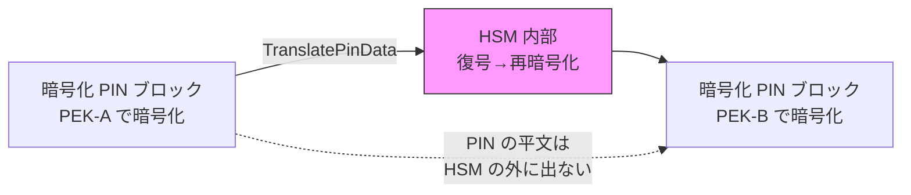

## はじめに

[前回のイシュア編](/ja/blog/2026/03/29/aws-payment-cryptography-issuer)では、CVV 生成・PIN 処理・ARQC 検証を通じて、複数の専用鍵が 1 つの API 呼び出しで協調する仕組みを確認した。

本記事ではアクワイアラ（加盟店契約会社・決済代行）の視点に移り、2 つの主要な暗号処理を Java SDK で実装する。

1. **PIN の鍵間変換（TranslatePinData）** — 平文を経由しない再暗号化
2. **MAC の生成と検証** — データの完全性保証

入門編では「1 鍵 1 用途」、イシュア編では「複数鍵の協調」を学んだ。アクワイアラ編のテーマは「鍵の中継」である。決済ネットワークでは、端末→アクワイアラ→ネットワーク→イシュアと PIN が中継されるが、各区間で異なる鍵が使われる。`TranslatePinData` は暗号化された PIN を一度も平文に戻さずに、ある鍵から別の鍵へ再暗号化する。この"触れずに渡す"設計が PCI PIN 準拠の要である。

## 前提条件

- [イシュア編](/ja/blog/2026/03/29/aws-payment-cryptography-issuer)の内容を理解していること
- Java 17 以上、AWS SDK for Java v2
- IAM 権限：`payment-cryptography:*`（検証用）
- 検証リージョン：us-east-1

## アクワイアラの暗号処理の全体像

| 処理 | API | 必要な鍵 | 目的 |
|---|---|---|---|
| PIN 変換 | TranslatePinData | incoming PEK + outgoing PEK | 鍵を切り替えて PIN を中継 |
| MAC 生成 | GenerateMac | MAC 鍵 | データの完全性を保証 |
| MAC 検証 | VerifyMac | MAC 鍵 | データの改ざんを検知 |

イシュア編の PIN 処理では PEK と PVK の「協調」が主題だった。アクワイアラ編では PEK-A と PEK-B の「中継」が主題になる。




## ソースコードとビルド

検証で使用するプログラムの全体像を先に示す。手元で動かしながら読み進めたい場合は、以下のファイルを配置してビルド・実行する。結果の解説は次のセクション以降で行う。

Maven の依存関係（`pom.xml`）は[入門編](/ja/blog/2026/03/29/aws-payment-cryptography-intro)と同じものを使用する。


<details className="my-4 rounded-lg border border-border bg-muted/30 p-4">
<summary className="cursor-pointer font-medium">AcquirerDemo.java（全シナリオを含む実行可能なコード）</summary>

```java title="AcquirerDemo.java"
package demo;

import software.amazon.awssdk.regions.Region;
import software.amazon.awssdk.services.paymentcryptography.PaymentCryptographyClient;
import software.amazon.awssdk.services.paymentcryptography.model.*;
import software.amazon.awssdk.services.paymentcryptographydata.PaymentCryptographyDataClient;
import software.amazon.awssdk.services.paymentcryptographydata.model.*;
import software.amazon.awssdk.services.paymentcryptographydata.model.VerificationFailedException;

public class AcquirerDemo {

    static final Region REGION = Region.US_EAST_1;

    public static void main(String[] args) {
        try (var cp = PaymentCryptographyClient.builder().region(REGION).build();
             var dp = PaymentCryptographyDataClient.builder().region(REGION).build()) {

            var pekA = createKey(cp, "PEK-A", KeyUsage.TR31_P0_PIN_ENCRYPTION_KEY,
                    KeyAlgorithm.TDES_3_KEY,
                    KeyModesOfUse.builder().encrypt(true).decrypt(true)
                            .wrap(true).unwrap(true).build());
            var pekB = createKey(cp, "PEK-B", KeyUsage.TR31_P0_PIN_ENCRYPTION_KEY,
                    KeyAlgorithm.TDES_3_KEY,
                    KeyModesOfUse.builder().encrypt(true).decrypt(true)
                            .wrap(true).unwrap(true).build());
            var pvk = createKey(cp, "PVK", KeyUsage.TR31_V2_VISA_PIN_VERIFICATION_KEY,
                    KeyAlgorithm.TDES_2_KEY,
                    KeyModesOfUse.builder().generate(true).verify(true).build());
            var macKey = createKey(cp, "MAC", KeyUsage.TR31_M6_ISO_9797_5_CMAC_KEY,
                    KeyAlgorithm.AES_256,
                    KeyModesOfUse.builder().generate(true).verify(true).build());

            testPinTranslation(dp, pekA, pekB, pvk);
            testMacGenerateVerify(dp, macKey);

            for (var arn : new String[]{pekA, pekB, pvk, macKey})
                cp.deleteKey(DeleteKeyRequest.builder()
                        .keyIdentifier(arn).deleteKeyInDays(3).build());
        }
    }

    static String createKey(PaymentCryptographyClient cp, String name,
                            KeyUsage usage, KeyAlgorithm algo, KeyModesOfUse modes) {
        var key = cp.createKey(CreateKeyRequest.builder().exportable(true)
                .keyAttributes(KeyAttributes.builder().keyUsage(usage)
                        .keyClass(KeyClass.SYMMETRIC_KEY).keyAlgorithm(algo)
                        .keyModesOfUse(modes).build()).build()).key();
        System.out.printf("[%s] %s %s KCV:%s%n", name,
                key.keyAttributes().keyUsageAsString(),
                key.keyAttributes().keyAlgorithmAsString(), key.keyCheckValue());
        return key.keyArn();
    }

    static void testPinTranslation(PaymentCryptographyDataClient dp,
                                   String pekA, String pekB, String pvk) {
        var pan = "4111111111111111";
        var pin = dp.generatePinData(GeneratePinDataRequest.builder()
                .generationKeyIdentifier(pvk).encryptionKeyIdentifier(pekA)
                .primaryAccountNumber(pan)
                .pinBlockFormat(PinBlockFormatForPinData.ISO_FORMAT_0)
                .generationAttributes(PinGenerationAttributes.builder()
                        .visaPin(VisaPin.builder().pinVerificationKeyIndex(1).build())
                        .build()).build());
        System.out.printf("PIN ブロック(PEK-A): %s, PVV: %s%n",
                pin.encryptedPinBlock(), pin.pinData().verificationValue());

        var tr = dp.translatePinData(TranslatePinDataRequest.builder()
                .encryptedPinBlock(pin.encryptedPinBlock())
                .incomingKeyIdentifier(pekA).outgoingKeyIdentifier(pekB)
                .incomingTranslationAttributes(TranslationIsoFormats.builder()
                        .isoFormat0(TranslationPinDataIsoFormat034.builder()
                                .primaryAccountNumber(pan).build()).build())
                .outgoingTranslationAttributes(TranslationIsoFormats.builder()
                        .isoFormat0(TranslationPinDataIsoFormat034.builder()
                                .primaryAccountNumber(pan).build()).build())
                .build());
        System.out.printf("PIN ブロック(PEK-B): %s%n", tr.pinBlock());

        dp.verifyPinData(VerifyPinDataRequest.builder()
                .verificationKeyIdentifier(pvk).encryptionKeyIdentifier(pekB)
                .primaryAccountNumber(pan)
                .pinBlockFormat(PinBlockFormatForPinData.ISO_FORMAT_0)
                .encryptedPinBlock(tr.pinBlock())
                .verificationAttributes(PinVerificationAttributes.builder()
                        .visaPin(VisaPinVerification.builder()
                                .pinVerificationKeyIndex(1)
                                .verificationValue(pin.pinData().verificationValue())
                                .build()).build()).build());
        System.out.println("PIN 検証（PEK-B + PVV）: 成功\n");
    }

    static void testMacGenerateVerify(PaymentCryptographyDataClient dp, String macKey) {
        var msg = "48656C6C6F576F726C64";
        var mac = dp.generateMac(GenerateMacRequest.builder()
                .keyIdentifier(macKey).messageData(msg)
                .generationAttributes(MacAttributes.builder()
                        .algorithm(MacAlgorithm.CMAC).build()).build());
        System.out.printf("MAC: %s%n", mac.mac());

        dp.verifyMac(VerifyMacRequest.builder()
                .keyIdentifier(macKey).messageData(msg).mac(mac.mac())
                .verificationAttributes(MacAttributes.builder()
                        .algorithm(MacAlgorithm.CMAC).build()).build());
        System.out.println("MAC 検証（正しいメッセージ）: 成功");

        try {
            dp.verifyMac(VerifyMacRequest.builder()
                    .keyIdentifier(macKey).messageData("48656C6C6F576F726C65")
                    .mac(mac.mac()).verificationAttributes(MacAttributes.builder()
                            .algorithm(MacAlgorithm.CMAC).build()).build());
        } catch (VerificationFailedException e) {
            System.out.println("MAC 検証（改ざんメッセージ）: 失敗");
        }
    }
}
```

</details>


<details className="my-4 rounded-lg border border-border bg-muted/30 p-4">
<summary className="cursor-pointer font-medium">ビルドと実行手順</summary>

[入門編](/ja/blog/2026/03/29/aws-payment-cryptography-intro)と同じプロジェクト構成を使用する。`AcquirerDemo.java` を `src/main/java/demo/` に配置する。

```bash title="Terminal"
cd payment-crypto-demo

# AcquirerDemo.java を src/main/java/demo/ に配置

# ビルドと実行
mvn clean compile -q
mvn exec:java -Dexec.mainClass=demo.AcquirerDemo
```

</details>

## 検証 1：TranslatePinData による PIN の鍵間変換

### フロー

1. PEK-A で暗号化された PIN ブロックを受け取る（端末からの入力を想定）
2. `TranslatePinData` で PEK-A → PEK-B に変換（平文を経由しない）
3. 変換後の PIN ブロックを PEK-B + PVV で検証（PIN の内容が保持されていることを確認）

### 鍵の準備

PEK-A（端末側の鍵）、PEK-B（ネットワーク側の鍵）、PVK（検証用）の 3 つを作成する。

<details className="my-4 rounded-lg border border-border bg-muted/30 p-4">
<summary className="cursor-pointer font-medium">鍵の作成コード</summary>

```java title="Java"
var pekA = createKey(controlPlane, KeyUsage.TR31_P0_PIN_ENCRYPTION_KEY,
        KeyAlgorithm.TDES_3_KEY,
        KeyModesOfUse.builder().encrypt(true).decrypt(true)
                .wrap(true).unwrap(true).build());

var pekB = createKey(controlPlane, KeyUsage.TR31_P0_PIN_ENCRYPTION_KEY,
        KeyAlgorithm.TDES_3_KEY,
        KeyModesOfUse.builder().encrypt(true).decrypt(true)
                .wrap(true).unwrap(true).build());

var pvk = createKey(controlPlane, KeyUsage.TR31_V2_VISA_PIN_VERIFICATION_KEY,
        KeyAlgorithm.TDES_2_KEY,
        KeyModesOfUse.builder().generate(true).verify(true).build());
```

</details>

### Step 1：PEK-A で PIN を生成

イシュア編と同じ `GeneratePinData` で PIN を生成する。この PIN ブロックは PEK-A で暗号化されている。

```java title="Java"
var pinResp = dataPlane.generatePinData(GeneratePinDataRequest.builder()
        .generationKeyIdentifier(pvkArn)
        .encryptionKeyIdentifier(pekAArn)
        .primaryAccountNumber("4111111111111111")
        .pinBlockFormat(PinBlockFormatForPinData.ISO_FORMAT_0)
        .generationAttributes(PinGenerationAttributes.builder()
                .visaPin(VisaPin.builder().pinVerificationKeyIndex(1).build())
                .build())
        .build());
```

```text title="Output"
Step 1 - PIN 生成（PEK-A）
  PIN ブロック: D7608BA7908F181D, PVV: 1563
```

### Step 2：PEK-A → PEK-B に PIN ブロックを変換

ここが本記事の核心。`TranslatePinData` は incoming（入力側）と outgoing（出力側）の鍵と PIN ブロック形式を指定し、PIN を平文に戻さずに再暗号化する。

```java title="Java"
var translateResp = dataPlane.translatePinData(TranslatePinDataRequest.builder()
        .encryptedPinBlock(pinResp.encryptedPinBlock())
        .incomingKeyIdentifier(pekAArn)
        .outgoingKeyIdentifier(pekBArn)
        .incomingTranslationAttributes(TranslationIsoFormats.builder()
                .isoFormat0(TranslationPinDataIsoFormat034.builder()
                        .primaryAccountNumber("4111111111111111").build())
                .build())
        .outgoingTranslationAttributes(TranslationIsoFormats.builder()
                .isoFormat0(TranslationPinDataIsoFormat034.builder()
                        .primaryAccountNumber("4111111111111111").build())
                .build())
        .build());
```

```text title="Output"
Step 2 - PIN 変換（PEK-A → PEK-B）
  変換後 PIN ブロック: F000A8F1F01CE32D
  KCV: F0BBDC
```

PIN ブロックの値が変わっている（`D7608BA7908F181D` → `F000A8F1F01CE32D`）。これは暗号化に使う鍵が変わったためであり、中身の PIN 自体は同じである。

注意点：
- `incomingTranslationAttributes` と `outgoingTranslationAttributes` で PAN を指定する必要がある。PCI 準拠のため、incoming と outgoing の PAN は一致しなければならない
- ISO Format 0 → ISO Format 0 の変換だけでなく、ISO Format 4 → ISO Format 0 など異なる形式間の変換も可能

### Step 3：変換後の PIN ブロックを PEK-B + PVV で検証

変換後の PIN ブロックが PEK-B で正しく復号でき、元の PIN と同じ PVV で検証できることを確認する。

```text title="Output"
Step 3 - PIN 検証（PEK-B + PVV）: 成功
  → PIN は平文に戻されることなく PEK-A → PEK-B に変換された
```

この結果が意味するのは、`TranslatePinData` が内部で PIN を復号→再暗号化しているが、その過程で PIN が HSM の外に出ることはないということである。アプリケーション側は暗号化された PIN ブロックしか扱わない。

## 検証 2：MAC の生成と検証 — データの完全性保証

検証 1 が「機密性（暗号化）」に焦点を当てたのに対し、検証 2 は「完全性（改ざん検知）」に焦点を当てる。

MAC（Message Authentication Code）は、メッセージが送信中に改ざんされていないことを検証するための暗号値である。決済処理では、端末からのトランザクションデータに MAC を付与し、受信側で検証する。

### 鍵の準備

CMAC 鍵（`TR31_M6_ISO_9797_5_CMAC_KEY`, AES_256）を使用する。

<details className="my-4 rounded-lg border border-border bg-muted/30 p-4">
<summary className="cursor-pointer font-medium">SDK の HMAC サポートについて</summary>

AWS Payment Cryptography は HMAC_SHA256 鍵（`TR31_M7_HMAC_KEY`）もサポートしているが、SDK v2.31.9 の `KeyAlgorithm` enum に `HMAC_SHA256` が定義されていないため、Java SDK から直接作成できない。HMAC を使う場合は CLI で鍵を作成するか、SDK を更新する必要がある。本記事では SDK で完結する CMAC を使用する。

</details>

### MAC の生成と検証

```java title="Java"
var messageData = "48656C6C6F576F726C64"; // "HelloWorld" in hex

// MAC 生成
var macResp = dataPlane.generateMac(GenerateMacRequest.builder()
        .keyIdentifier(macKeyArn)
        .messageData(messageData)
        .generationAttributes(MacAttributes.builder()
                .algorithm(MacAlgorithm.CMAC).build())
        .build());
```

```text title="Output"
MAC 生成: 14412ADCE61894D691E13354359FC723
MAC 検証（正しいメッセージ）: 成功
MAC 検証（改ざんメッセージ）: 失敗 — INVALID_MAC
```

メッセージの最後の 1 バイトを変更しただけで MAC 検証が失敗する。これにより、トランザクションデータが送信中に 1 ビットでも改ざんされた場合に検知できる。

## アクワイアラ処理の API と鍵の見取り図

| 処理 | API | 鍵 (KeyUsage) | 主な入力 | 検証結果 |
|---|---|---|---|---|
| PIN 変換 | TranslatePinData | PEK-A (TR31_P0) → PEK-B (TR31_P0) | 暗号化 PIN ブロック + PAN | 変換後 PIN ブロック |
| MAC 生成 | GenerateMac | CMAC 鍵 (TR31_M6, AES_256) | メッセージデータ | MAC 値 |
| MAC 検証 | VerifyMac | CMAC 鍵 (TR31_M6, AES_256) | メッセージデータ + MAC | 成功 / INVALID_MAC |

## まとめ

- **PIN は平文に戻さずに鍵を切り替えられる** — `TranslatePinData` は HSM 内部で復号→再暗号化を行い、PIN が HSM の外に出ることはない。アプリケーション側は暗号化された PIN ブロックしか扱わない。これが PCI PIN 準拠の要である
- **MAC はデータの完全性を保証する** — 1 バイトの改ざんでも検知できる。決済処理では暗号化（機密性）と MAC（完全性）の両方が必要であり、それぞれ異なる鍵で実現する

## シリーズ全体の振り返り

3 回のシリーズを通じて、AWS Payment Cryptography の鍵管理モデルを段階的に理解してきた。

| 回 | テーマ | 核心のインサイト |
|---|---|---|
| [第 1 回（入門編）](/ja/blog/2026/03/29/aws-payment-cryptography-intro) | 鍵の用途分離 | 決済暗号の鍵は汎用暗号（KMS）とはパラダイムが異なる。KeyUsage で用途が固定され、API レベルで誤用が防止される |
| [第 2 回（イシュア編）](/ja/blog/2026/03/29/aws-payment-cryptography-issuer) | 複数鍵の協調 | 1 つの決済処理（PIN 生成）が PEK と PVK の 2 つの専用鍵の協調で成立する |
| 第 3 回（アクワイアラ編） | 鍵の中継 | PIN は平文に戻さずに鍵を切り替えられる。TranslatePinData による"触れずに渡す"設計が PCI PIN 準拠の要 |

これらの知見は AWS Payment Cryptography に限らず、決済暗号処理全般に通じる設計原則である。

## クリーンアップ

プログラムの実行時にクリーンアップが自動で行われる。全ての鍵は 3 日後に完全削除される（`deleteKeyInDays(3)`）。削除予約中の鍵は `RestoreKey` で復元可能。
