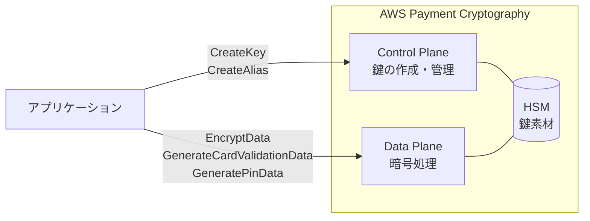

## はじめに

クレジットカード決済の裏側では、PIN の暗号化、CVV の生成・検証、トランザクションデータの暗号化など、多くの暗号処理が行われている。従来、これらの処理には PCI 認定を受けた物理的な HSM（Hardware Security Module）が必要で、ハードウェアの調達・設置・鍵セレモニー（複数人が物理的に集まって鍵を注入する儀式）に数週間を要していた。

[AWS Payment Cryptography](https://docs.aws.amazon.com/payment-cryptography/latest/userguide/what-is.html) は、この決済暗号処理をマネージドサービスとして提供する。PCI PTS HSM V3 および FIPS 140-2 Level 3 認定のハードウェア上で動作し、API 呼び出しだけで鍵の作成から暗号処理まで完結する。

本記事はシリーズ第 1 回として、Java SDK を使って 4 種類の決済用鍵を作成し、正常系・異常系の両方を実行することで、AWS Payment Cryptography の鍵管理モデルを体験的に理解する。AWS KMS では 1 つの対称鍵で暗号化も復号もできるが、Payment Cryptography では鍵ごとに用途が厳密に固定されている。この違いに焦点を当て、KMS に慣れた開発者が最初に戸惑うポイントを整理する。

## 前提条件

- AWS アカウント（Payment Cryptography が利用可能なリージョン）
- Java 17 以上
- AWS SDK for Java v2（`software.amazon.awssdk:paymentcryptography` + `paymentcryptographydata`）
- IAM 権限：`payment-cryptography:*`（検証用。本番環境では最小権限に絞ること）
- 検証リージョン：us-east-1

## AWS Payment Cryptography の全体像 — KMS との違い

AWS Payment Cryptography は 2 つの API 面を持つ。

- **Control Plane** — 鍵の作成・管理・エイリアス設定（`PaymentCryptographyClient`）
- **Data Plane** — 暗号化・復号・CVV 生成・PIN 処理などの暗号処理（`PaymentCryptographyDataClient`）

KMS も同様に Control Plane / Data Plane の構造を持つが、決定的な違いは**鍵の属性モデル**にある。

| 観点 | AWS KMS | AWS Payment Cryptography |
|---|---|---|
| 鍵の用途指定 | `KeyUsage`（`ENCRYPT_DECRYPT` / `SIGN_VERIFY` / `GENERATE_VERIFY_MAC` / `KEY_AGREEMENT` の 4 種類） | TR-31 `KeyUsage`（`TR31_C0_CARD_VERIFICATION_KEY` 等、数十種類） |
| 操作モード | 鍵の種類で暗黙的に決まる | `KeyModesOfUse` で明示的に指定（Encrypt, Generate, DeriveKey 等） |
| 不変属性の範囲 | KeyUsage + KeySpec | KeyUsage + KeyAlgorithm + KeyModesOfUse（操作モードまで固定） |
| 準拠規格 | FIPS 140-2 | PCI PTS HSM V3 + FIPS 140-2 Level 3 |

KMS では 1 つの対称鍵で暗号化も復号もできるが、Payment Cryptography では「CVV 生成用の鍵」でデータの暗号化はできない。この制約は PCI 業界標準 [ANSI X9 TR-31](https://docs.aws.amazon.com/payment-cryptography/latest/userguide/concepts.html) に基づいており、決済暗号処理が汎用暗号とは異なるパラダイムで動いていることを示している。



以降の検証で、この違いを実際のコードで体験する。

## ソースコードとビルド

検証で使用するプログラムの全体像を先に示す。手元で動かしながら読み進めたい場合は、以下のファイルを配置してビルド・実行する。結果の解説は次のセクション以降で行う。

<details className="my-4 rounded-lg border border-border bg-muted/30 p-4">
<summary className="cursor-pointer font-medium">pom.xml</summary>

```xml title="pom.xml"
<project xmlns="http://maven.apache.org/POM/4.0.0"
         xmlns:xsi="http://www.w3.org/2001/XMLSchema-instance"
         xsi:schemaLocation="http://maven.apache.org/POM/4.0.0
         http://maven.apache.org/xsd/maven-4.0.0.xsd">
    <modelVersion>4.0.0</modelVersion>
    <groupId>demo</groupId>
    <artifactId>payment-crypto-demo</artifactId>
    <version>1.0.0</version>
    <properties>
        <maven.compiler.source>17</maven.compiler.source>
        <maven.compiler.target>17</maven.compiler.target>
        <aws.sdk.version>2.31.9</aws.sdk.version>
    </properties>
    <dependencyManagement>
        <dependencies>
            <dependency>
                <groupId>software.amazon.awssdk</groupId>
                <artifactId>bom</artifactId>
                <version>${aws.sdk.version}</version>
                <type>pom</type>
                <scope>import</scope>
            </dependency>
        </dependencies>
    </dependencyManagement>
    <dependencies>
        <dependency>
            <groupId>software.amazon.awssdk</groupId>
            <artifactId>paymentcryptography</artifactId>
        </dependency>
        <dependency>
            <groupId>software.amazon.awssdk</groupId>
            <artifactId>paymentcryptographydata</artifactId>
        </dependency>
        <dependency>
            <groupId>software.amazon.awssdk</groupId>
            <artifactId>sso</artifactId>
        </dependency>
        <dependency>
            <groupId>software.amazon.awssdk</groupId>
            <artifactId>ssooidc</artifactId>
        </dependency>
    </dependencies>
</project>
```

</details>

<details className="my-4 rounded-lg border border-border bg-muted/30 p-4">
<summary className="cursor-pointer font-medium">PaymentCryptoDemo.java（全シナリオを含む実行可能なコード）</summary>

```java title="PaymentCryptoDemo.java"
package demo;

import java.util.List;
import software.amazon.awssdk.regions.Region;
import software.amazon.awssdk.services.paymentcryptography.PaymentCryptographyClient;
import software.amazon.awssdk.services.paymentcryptography.model.*;
import software.amazon.awssdk.services.paymentcryptographydata.PaymentCryptographyDataClient;
import software.amazon.awssdk.services.paymentcryptographydata.model.*;
import software.amazon.awssdk.services.paymentcryptographydata.model.VerificationFailedException;

public class PaymentCryptoDemo {

    static final Region REGION = Region.US_EAST_1;
    static final String ALIAS_PREFIX = "alias/blog-demo-";

    public static void main(String[] args) {
        try (var controlPlane = PaymentCryptographyClient.builder().region(REGION).build();
             var dataPlane = PaymentCryptographyDataClient.builder().region(REGION).build()) {

            var cvvKey = createKey(controlPlane, "cvv",
                    KeyUsage.TR31_C0_CARD_VERIFICATION_KEY, KeyAlgorithm.TDES_2_KEY,
                    KeyModesOfUse.builder().generate(true).verify(true).build());
            var dataKey = createKey(controlPlane, "data-encryption",
                    KeyUsage.TR31_D0_SYMMETRIC_DATA_ENCRYPTION_KEY, KeyAlgorithm.AES_256,
                    KeyModesOfUse.builder().encrypt(true).decrypt(true)
                            .wrap(true).unwrap(true).build());
            var pek = createKey(controlPlane, "pek",
                    KeyUsage.TR31_P0_PIN_ENCRYPTION_KEY, KeyAlgorithm.TDES_3_KEY,
                    KeyModesOfUse.builder().encrypt(true).decrypt(true)
                            .wrap(true).unwrap(true).build());
            var bdk = createKey(controlPlane, "bdk",
                    KeyUsage.TR31_B0_BASE_DERIVATION_KEY, KeyAlgorithm.TDES_3_KEY,
                    KeyModesOfUse.builder().deriveKey(true).build());

            testEncryptDecrypt(dataPlane, dataKey);
            testCvvGenerateVerify(dataPlane, cvvKey);
            testWrongKeyUsage(dataPlane, cvvKey, dataKey, pek, bdk);
            cleanup(controlPlane, cvvKey, dataKey, pek, bdk);
        }
    }

    static String createKey(PaymentCryptographyClient client, String name,
                            KeyUsage usage, KeyAlgorithm algorithm, KeyModesOfUse modes) {
        var key = client.createKey(CreateKeyRequest.builder().exportable(true)
                .keyAttributes(KeyAttributes.builder().keyUsage(usage)
                        .keyClass(KeyClass.SYMMETRIC_KEY).keyAlgorithm(algorithm)
                        .keyModesOfUse(modes).build()).build()).key();
        System.out.printf("[%s] %s %s KCV:%s (%s)%n  KeyModesOfUse: %s%n%n",
                name, key.keyAttributes().keyUsageAsString(),
                key.keyAttributes().keyAlgorithmAsString(), key.keyCheckValue(),
                key.keyCheckValueAlgorithmAsString(), formatModes(key.keyAttributes().keyModesOfUse()));
        client.createAlias(CreateAliasRequest.builder()
                .aliasName(ALIAS_PREFIX + name).keyArn(key.keyArn()).build());
        return key.keyArn();
    }

    static void testEncryptDecrypt(PaymentCryptographyDataClient dp, String keyArn) {
        var plain = "41111111111111110000000000000000";
        var enc = dp.encryptData(EncryptDataRequest.builder().keyIdentifier(keyArn)
                .plainText(plain).encryptionAttributes(EncryptionDecryptionAttributes.builder()
                        .symmetric(SymmetricEncryptionAttributes.builder()
                                .mode(EncryptionMode.ECB).build()).build()).build());
        var dec = dp.decryptData(DecryptDataRequest.builder().keyIdentifier(keyArn)
                .cipherText(enc.cipherText()).decryptionAttributes(
                        EncryptionDecryptionAttributes.builder().symmetric(
                                SymmetricEncryptionAttributes.builder()
                                        .mode(EncryptionMode.ECB).build()).build()).build());
        System.out.printf("Encrypt/Decrypt match: %s%n%n", plain.equalsIgnoreCase(dec.plainText()));
    }

    static void testCvvGenerateVerify(PaymentCryptographyDataClient dp, String keyArn) {
        var gen = dp.generateCardValidationData(GenerateCardValidationDataRequest.builder()
                .keyIdentifier(keyArn).primaryAccountNumber("4111111111111111")
                .validationDataLength(3).generationAttributes(CardGenerationAttributes.builder()
                        .cardVerificationValue2(CardVerificationValue2.builder()
                                .cardExpiryDate("0328").build()).build()).build());
        System.out.printf("CVV2: %s%n", gen.validationData());
        dp.verifyCardValidationData(VerifyCardValidationDataRequest.builder()
                .keyIdentifier(keyArn).primaryAccountNumber("4111111111111111")
                .validationData(gen.validationData()).verificationAttributes(
                        CardVerificationAttributes.builder().cardVerificationValue2(
                                CardVerificationValue2.builder().cardExpiryDate("0328")
                                        .build()).build()).build());
        try {
            dp.verifyCardValidationData(VerifyCardValidationDataRequest.builder()
                    .keyIdentifier(keyArn).primaryAccountNumber("4111111111111111")
                    .validationData("000").verificationAttributes(
                            CardVerificationAttributes.builder().cardVerificationValue2(
                                    CardVerificationValue2.builder().cardExpiryDate("0328")
                                            .build()).build()).build());
        } catch (VerificationFailedException e) {
            System.out.printf("Wrong CVV2 rejected%n%n");
        }
    }

    static void testWrongKeyUsage(PaymentCryptographyDataClient dp,
                                  String cvv, String data, String pek, String bdk) {
        tryOp("CVV→Encrypt", () -> dp.encryptData(EncryptDataRequest.builder()
                .keyIdentifier(cvv).plainText("41111111111111110000000000000000")
                .encryptionAttributes(EncryptionDecryptionAttributes.builder()
                        .symmetric(SymmetricEncryptionAttributes.builder()
                                .mode(EncryptionMode.ECB).build()).build()).build()));
        tryOp("Data→GenCVV", () -> dp.generateCardValidationData(
                GenerateCardValidationDataRequest.builder().keyIdentifier(data)
                        .primaryAccountNumber("4111111111111111").validationDataLength(3)
                        .generationAttributes(CardGenerationAttributes.builder()
                                .cardVerificationValue2(CardVerificationValue2.builder()
                                        .cardExpiryDate("0328").build()).build()).build()));
        tryOp("PEK→GenMAC", () -> dp.generateMac(GenerateMacRequest.builder()
                .keyIdentifier(pek).messageData("48656C6C6F")
                .generationAttributes(MacAttributes.builder()
                        .algorithm(MacAlgorithm.HMAC_SHA256).build()).build()));
        tryOp("BDK→Encrypt", () -> dp.encryptData(EncryptDataRequest.builder()
                .keyIdentifier(bdk).plainText("41111111111111110000000000000000")
                .encryptionAttributes(EncryptionDecryptionAttributes.builder()
                        .symmetric(SymmetricEncryptionAttributes.builder()
                                .mode(EncryptionMode.ECB).build()).build()).build()));
    }

    static void tryOp(String label, Runnable op) {
        try { op.run(); }
        catch (software.amazon.awssdk.services.paymentcryptographydata.model.ValidationException e) {
            System.out.printf("%s → %s%n", label, e.getMessage());
        }
    }

    static void cleanup(PaymentCryptographyClient c, String... arns) {
        for (var n : List.of("cvv", "data-encryption", "pek", "bdk"))
            c.deleteAlias(DeleteAliasRequest.builder().aliasName(ALIAS_PREFIX + n).build());
        for (var a : arns)
            c.deleteKey(DeleteKeyRequest.builder().keyIdentifier(a).deleteKeyInDays(3).build());
    }

    static String formatModes(KeyModesOfUse m) {
        var sb = new StringBuilder();
        if (m.encrypt()) sb.append("Encrypt ");  if (m.decrypt()) sb.append("Decrypt ");
        if (m.wrap()) sb.append("Wrap ");         if (m.unwrap()) sb.append("Unwrap ");
        if (m.generate()) sb.append("Generate "); if (m.verify()) sb.append("Verify ");
        if (m.sign()) sb.append("Sign ");         if (m.deriveKey()) sb.append("DeriveKey ");
        return sb.toString().trim();
    }
}
```

</details>

<details className="my-4 rounded-lg border border-border bg-muted/30 p-4">
<summary className="cursor-pointer font-medium">ビルドと実行</summary>

```bash title="Terminal"
# プロジェクト作成
mkdir -p payment-crypto-demo/src/main/java/demo
cd payment-crypto-demo

# pom.xml を payment-crypto-demo/ に配置
# PaymentCryptoDemo.java を src/main/java/demo/ に配置

# ビルドと実行
mvn clean compile -q
mvn exec:java -Dexec.mainClass=demo.PaymentCryptoDemo
```

</details>

## 検証 1：Java SDK で 4 種類の決済用鍵を作成する

決済処理で使われる代表的な 4 種類の鍵を作成する。

| 鍵の名前 | KeyUsage | Algorithm | 用途 |
|---|---|---|---|
| CVV 鍵 | `TR31_C0_CARD_VERIFICATION_KEY` | TDES_2KEY | CVV/CVV2 の生成・検証 |
| データ暗号化鍵 | `TR31_D0_SYMMETRIC_DATA_ENCRYPTION_KEY` | AES_256 | カード情報の暗号化・復号 |
| PEK（PIN 暗号化鍵） | `TR31_P0_PIN_ENCRYPTION_KEY` | TDES_3KEY | PIN ブロックの暗号化 |
| BDK（DUKPT 基底鍵） | `TR31_B0_BASE_DERIVATION_KEY` | TDES_3KEY | DUKPT トランザクション鍵の導出 |

まず、Control Plane クライアントと Data Plane クライアントを作成する。KMS と異なり、2 つの別々のクライアントが必要な点に注意。

```java title="Java"
var controlPlane = PaymentCryptographyClient.builder()
        .region(Region.US_EAST_1).build();
var dataPlane = PaymentCryptographyDataClient.builder()
        .region(Region.US_EAST_1).build();
```

鍵の作成は `CreateKeyRequest` で行う。KMS の `CreateKeyRequest` と比較すると、指定するパラメータの多さに気づくはずである。

```java title="Java"
// CVV 鍵の作成
var cvvKeyResp = controlPlane.createKey(CreateKeyRequest.builder()
        .exportable(true)
        .keyAttributes(KeyAttributes.builder()
                .keyUsage(KeyUsage.TR31_C0_CARD_VERIFICATION_KEY)
                .keyClass(KeyClass.SYMMETRIC_KEY)
                .keyAlgorithm(KeyAlgorithm.TDES_2_KEY)
                .keyModesOfUse(KeyModesOfUse.builder()
                        .generate(true).verify(true).build())
                .build())
        .build());
var cvvKey = cvvKeyResp.key();
```

同様に残り 3 つの鍵も作成する。

<details className="my-4 rounded-lg border border-border bg-muted/30 p-4">
<summary className="cursor-pointer font-medium">残り 3 つの鍵の作成コード</summary>

```java title="Java"
// データ暗号化鍵（AES-256）
var dataKeyResp = controlPlane.createKey(CreateKeyRequest.builder()
        .exportable(true)
        .keyAttributes(KeyAttributes.builder()
                .keyUsage(KeyUsage.TR31_D0_SYMMETRIC_DATA_ENCRYPTION_KEY)
                .keyClass(KeyClass.SYMMETRIC_KEY)
                .keyAlgorithm(KeyAlgorithm.AES_256)
                .keyModesOfUse(KeyModesOfUse.builder()
                        .encrypt(true).decrypt(true)
                        .wrap(true).unwrap(true).build())
                .build())
        .build());

// PEK（PIN 暗号化鍵、TDES-3KEY）
var pekResp = controlPlane.createKey(CreateKeyRequest.builder()
        .exportable(true)
        .keyAttributes(KeyAttributes.builder()
                .keyUsage(KeyUsage.TR31_P0_PIN_ENCRYPTION_KEY)
                .keyClass(KeyClass.SYMMETRIC_KEY)
                .keyAlgorithm(KeyAlgorithm.TDES_3_KEY)
                .keyModesOfUse(KeyModesOfUse.builder()
                        .encrypt(true).decrypt(true)
                        .wrap(true).unwrap(true).build())
                .build())
        .build());

// BDK（DUKPT 基底鍵、TDES-3KEY）
var bdkResp = controlPlane.createKey(CreateKeyRequest.builder()
        .exportable(true)
        .keyAttributes(KeyAttributes.builder()
                .keyUsage(KeyUsage.TR31_B0_BASE_DERIVATION_KEY)
                .keyClass(KeyClass.SYMMETRIC_KEY)
                .keyAlgorithm(KeyAlgorithm.TDES_3_KEY)
                .keyModesOfUse(KeyModesOfUse.builder()
                        .deriveKey(true).build())
                .build())
        .build());
```

</details>

### 作成結果

4 つの鍵が全て 1 秒未満で作成された。各鍵の `KeyModesOfUse` を見ると、指定した操作のみが有効になっていることが分かる。

```text title="Output"
[cvv] KeyArn: arn:aws:payment-cryptography:us-east-1:***:key/4h3srt6jwsrhncrb
  KeyUsage: TR31_C0_CARD_VERIFICATION_KEY, Algorithm: TDES_2KEY, KCV: 683ADE (ANSI_X9_24)
  KeyModesOfUse: Generate Verify

[data-encryption] KeyArn: arn:aws:payment-cryptography:us-east-1:***:key/ah6o57njo2bsmwlv
  KeyUsage: TR31_D0_SYMMETRIC_DATA_ENCRYPTION_KEY, Algorithm: AES_256, KCV: 864903 (CMAC)
  KeyModesOfUse: Encrypt Decrypt Wrap Unwrap

[pek] KeyArn: arn:aws:payment-cryptography:us-east-1:***:key/zf23jwblqqbvlsaa
  KeyUsage: TR31_P0_PIN_ENCRYPTION_KEY, Algorithm: TDES_3KEY, KCV: 38F13B (ANSI_X9_24)
  KeyModesOfUse: Encrypt Decrypt Wrap Unwrap

[bdk] KeyArn: arn:aws:payment-cryptography:us-east-1:***:key/naqufyakxhaehzr2
  KeyUsage: TR31_B0_BASE_DERIVATION_KEY, Algorithm: TDES_3KEY, KCV: EA74D1 (ANSI_X9_24)
  KeyModesOfUse: DeriveKey
```

注目すべきポイント：

- **KCV（Key Check Value）** — 鍵素材のチェックサム。鍵のインポート/エクスポート時に、鍵素材が正しく転送されたかを確認するために使う。AES 鍵は CMAC、TDES 鍵は ANSI_X9_24 と、アルゴリズムによって KCV の計算方式が異なる
- **BDK は DeriveKey のみ** — Encrypt/Decrypt すら許可されていない。BDK はトランザクション鍵を導出するためだけに存在し、直接データを暗号化することはない
- **SDK の enum 名** — CLI では `TDES_2KEY` だが、Java SDK v2 では `TDES_2_KEY`（アンダースコアあり）。地味だがハマりやすいポイント

## 検証 2：作成した鍵で CVV 生成とデータ暗号化を実行する

鍵が正しく動作することを確認する。Data Plane API を使って、データ暗号化鍵による暗号化・復号と、CVV 鍵による CVV2 の生成・検証を行う。

### データの暗号化・復号

```java title="Java"
var plainText = "41111111111111110000000000000000"; // 32 hex chars = 16 bytes

var encResp = dataPlane.encryptData(EncryptDataRequest.builder()
        .keyIdentifier(dataKey.keyArn())
        .plainText(plainText)
        .encryptionAttributes(EncryptionDecryptionAttributes.builder()
                .symmetric(SymmetricEncryptionAttributes.builder()
                        .mode(EncryptionMode.ECB).build())
                .build())
        .build());

var decResp = dataPlane.decryptData(DecryptDataRequest.builder()
        .keyIdentifier(dataKey.keyArn())
        .cipherText(encResp.cipherText())
        .decryptionAttributes(EncryptionDecryptionAttributes.builder()
                .symmetric(SymmetricEncryptionAttributes.builder()
                        .mode(EncryptionMode.ECB).build())
                .build())
        .build());
```

```text title="Output"
  平文:   41111111111111110000000000000000
  暗号文: 88798205F30D2FBE1DCA7FF261232B51
  復号文: 41111111111111110000000000000000
  一致: true
```

平文データは hexBinary 文字列で渡す必要がある。文字列 `"4111111111111111"` をそのまま渡すのではなく、16 進数エンコードされたバイト列として扱う。また、ECB モードではブロックサイズ（AES の場合 16 bytes = 32 hex chars）の倍数が必須で、パディングは自動では行われない。

### CVV2 の生成・検証

```java title="Java"
var genResp = dataPlane.generateCardValidationData(
        GenerateCardValidationDataRequest.builder()
                .keyIdentifier(cvvKey.keyArn())
                .primaryAccountNumber("4111111111111111")
                .validationDataLength(3)
                .generationAttributes(CardGenerationAttributes.builder()
                        .cardVerificationValue2(CardVerificationValue2.builder()
                                .cardExpiryDate("0328").build())
                        .build())
                .build());
// genResp.validationData() → "287"
```

```text title="Output"
  PAN: 4111111111111111, 有効期限: 0328
  生成された CVV2: 287
  検証（正しい値 287）: 成功
  検証（間違った値 000）: 失敗 — Card validation data verification failed.
    (Status Code: 400, Reason: INVALID_VALIDATION_DATA)
```

CVV2 は PAN（カード番号）と有効期限から決定論的に生成される。同じ鍵・同じ PAN・同じ有効期限であれば、常に同じ CVV2 が生成される。

生成した CVV2 の検証は `VerifyCardValidationData` で行う。

```java title="Java"
// 正しい値で検証（成功）
dataPlane.verifyCardValidationData(VerifyCardValidationDataRequest.builder()
        .keyIdentifier(cvvKey.keyArn())
        .primaryAccountNumber("4111111111111111")
        .validationData(genResp.validationData()) // "287"
        .verificationAttributes(CardVerificationAttributes.builder()
                .cardVerificationValue2(CardVerificationValue2.builder()
                        .cardExpiryDate("0328").build())
                .build())
        .build());

// 間違った値で検証（VerificationFailedException）
try {
    dataPlane.verifyCardValidationData(VerifyCardValidationDataRequest.builder()
            .keyIdentifier(cvvKey.keyArn())
            .primaryAccountNumber("4111111111111111")
            .validationData("000")
            .verificationAttributes(CardVerificationAttributes.builder()
                    .cardVerificationValue2(CardVerificationValue2.builder()
                            .cardExpiryDate("0328").build())
                    .build())
            .build());
} catch (VerificationFailedException e) {
    // Card validation data verification failed. (Status Code: 400)
}
```

検証に失敗した場合は `VerificationFailedException`（HTTP 400）が返り、`Reason` フィールドで原因が特定できる。

## 検証 3：用途外の操作を試みる — なぜ Payment Cryptography は KMS と違うのか

ここが本記事の核心である。検証 2 で「正しい鍵 × 正しい操作」が通ることを確認した。では、「間違った鍵 × 間違った操作」ではどうなるか。

```java title="Java"
// CVV 鍵でデータ暗号化を試みる
try {
    dataPlane.encryptData(EncryptDataRequest.builder()
            .keyIdentifier(cvvKey.keyArn())
            .plainText("41111111111111110000000000000000")
            .encryptionAttributes(EncryptionDecryptionAttributes.builder()
                    .symmetric(SymmetricEncryptionAttributes.builder()
                            .mode(EncryptionMode.ECB).build())
                    .build())
            .build());
} catch (ValidationException e) {
    // KeyUsage of the input key ... is invalid for the operation.
}
```

なお、`ValidationException` は Control Plane（`paymentcryptography.model`）と Data Plane（`paymentcryptographydata.model`）の両方に存在する。ここでは Data Plane 側の例外を catch する必要があるため、完全修飾名での import か、Data Plane 側のみを import する必要がある。完全なソースコードでの対処方法は記事末尾を参照。

4 パターン全てを試した結果：

<details className="my-4 rounded-lg border border-border bg-muted/30 p-4">
<summary className="cursor-pointer font-medium">残り 3 パターンのコード</summary>

```java title="Java"
// データ暗号化鍵で CVV 生成を試みる
dataPlane.generateCardValidationData(GenerateCardValidationDataRequest.builder()
        .keyIdentifier(dataKey.keyArn())
        .primaryAccountNumber("4111111111111111")
        .validationDataLength(3)
        .generationAttributes(CardGenerationAttributes.builder()
                .cardVerificationValue2(CardVerificationValue2.builder()
                        .cardExpiryDate("0328").build())
                .build())
        .build());

// PEK で MAC 生成を試みる
dataPlane.generateMac(GenerateMacRequest.builder()
        .keyIdentifier(pek.keyArn())
        .messageData("48656C6C6F")
        .generationAttributes(MacAttributes.builder()
                .algorithm(MacAlgorithm.HMAC_SHA256).build())
        .build());

// BDK でデータ暗号化を試みる
dataPlane.encryptData(EncryptDataRequest.builder()
        .keyIdentifier(bdk.keyArn())
        .plainText("41111111111111110000000000000000")
        .encryptionAttributes(EncryptionDecryptionAttributes.builder()
                .symmetric(SymmetricEncryptionAttributes.builder()
                        .mode(EncryptionMode.ECB).build())
                .build())
        .build());
```

</details>

```text title="Output"
  CVV鍵(TR31_C0) → EncryptData
    → KeyUsage of the input key arn:...key/4h3srt6jwsrhncrb is invalid for the operation.

  データ暗号化鍵(TR31_D0) → GenerateCardValidationData
    → KeyUsage of the input key arn:...key/ah6o57njo2bsmwlv is invalid for the operation.

  PEK(TR31_P0) → GenerateMac
    → KeyUsage of the input key arn:...key/zf23jwblqqbvlsaa is invalid for the operation.

  BDK(TR31_B0) → EncryptData
    → KeyUsage of the input key arn:...key/naqufyakxhaehzr2 is invalid for the operation.
```

全パターンで同一の `ValidationException`（HTTP 400）が返る。エラーメッセージには鍵の ARN が含まれるため、どの鍵が原因かは即座に特定できる。

### KMS との対比

KMS で対称鍵を作成した場合、その鍵で `Encrypt` も `Decrypt` も `GenerateDataKey` も実行できる。鍵の「用途」は IAM ポリシーで制御するのが一般的である。

一方、Payment Cryptography では鍵の作成時点で用途が固定され、IAM ポリシーに関係なく API レベルで拒否される。これは PCI PIN v3.1 Requirement 19（鍵は意図された目的にのみ使用すること）を、運用ルールではなくシステム設計で強制する仕組みである。

つまり、**KMS は「何でもできる鍵 + ポリシーで制限」、Payment Cryptography は「最初から用途が決まった鍵」** という設計思想の違いがある。

## 鍵の種類と用途の見取り図

検証結果を踏まえ、4 種類の鍵の許可操作を比較表にまとめる。

| 鍵の種類 | KeyUsage | Algorithm | 許可される操作 | 検証で拒否された操作 | 後続記事での登場 |
|---|---|---|---|---|---|
| CVV 鍵 | TR31_C0 | TDES_2KEY | Generate, Verify | EncryptData | 第 2 回（イシュア編） |
| データ暗号化鍵 | TR31_D0 | AES_256 | Encrypt, Decrypt, Wrap, Unwrap | GenerateCardValidationData | 第 3 回（アクワイアラ編） |
| PEK | TR31_P0 | TDES_3KEY | Encrypt, Decrypt, Wrap, Unwrap | GenerateMac | 第 2 回（イシュア編） |
| BDK | TR31_B0 | TDES_3KEY | DeriveKey | EncryptData | 第 3 回（アクワイアラ編） |

この他にも、PVV 鍵（`TR31_V2`）、MAC 鍵（`TR31_M1` / `TR31_M7`）、ARQC 鍵（`TR31_E0`）など多くの KeyUsage が存在する。後続の記事で順次扱っていく。

## まとめ

- **決済暗号の鍵は汎用暗号の鍵とはパラダイムが異なる** — KMS では 1 つの鍵で複数の操作が可能だが、Payment Cryptography では TR-31 KeyUsage によって鍵の用途が作成時に固定される。この違いを理解することが、決済暗号処理の第一歩である
- **API レベルのガードレールが設定ミスを防ぐ** — 用途外の操作は IAM ポリシーに関係なく `ValidationException` で拒否される。運用ルールではなく、システム設計で PCI 準拠を担保する仕組みになっている
- **Control Plane と Data Plane の分離を意識する** — 鍵の管理と暗号処理は別のクライアント・別のエンドポイントで行う。Java SDK では `PaymentCryptographyClient` と `PaymentCryptographyDataClient` を使い分ける

次回のイシュア編では、CVV 鍵と PEK を使って、カード発行者の視点から CVV の生成・検証と PIN 処理を Java で実装する。

## クリーンアップ

プログラムの実行時にクリーンアップが自動で行われる。全ての鍵は 3 日後に完全削除される（`deleteKeyInDays(3)`）。削除予約中の鍵は `RestoreKey` で復元可能。
