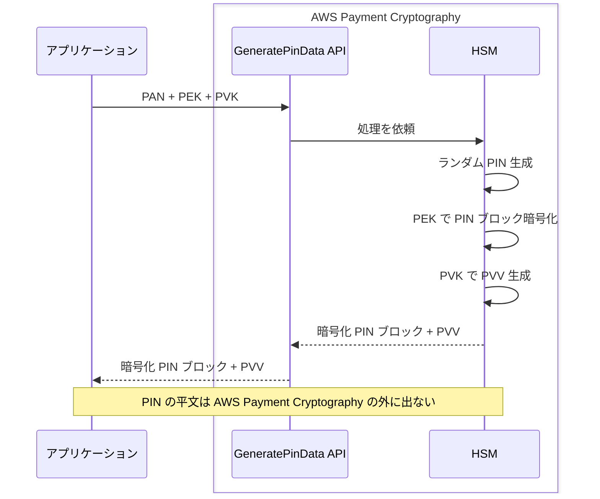

## はじめに

[前回の入門編](/ja/blog/2026/03/29/aws-payment-cryptography-intro)では、AWS Payment Cryptography の鍵管理モデルを体験し、TR-31 KeyUsage による用途分離が API レベルで強制されることを確認した。

本記事ではその知識を前提に、カード発行者（イシュア）が行う 3 つの主要な暗号処理を Java SDK で実装する。

1. **CVV / CVV2 の生成・検証** — カードデータの静的な検証
2. **PIN の生成と PVV による検証** — カード保有者の動的な認証
3. **ARQC の検証** — EMV チップカードのトランザクション認証

入門編では「1 つの鍵は 1 つの用途にしか使えない」ことを学んだ。イシュア編で見えてくるのは、その帰結として「1 つの決済処理が複数の専用鍵の協調で成立する」という実態である。特に PIN 処理では、`GeneratePinData` が PEK（PIN 暗号化鍵）と PVK（PIN 検証鍵）の 2 つの鍵を同時に要求する。

## 前提条件

- [入門編](/ja/blog/2026/03/29/aws-payment-cryptography-intro)の内容を理解していること
- Java 17 以上、AWS SDK for Java v2
- IAM 権限：`payment-cryptography:*`（検証用）
- 検証リージョン：us-east-1

## イシュアの暗号処理の全体像

イシュアが扱う鍵と API の関係を整理する。

| 処理 | API | 必要な鍵 | 鍵の KeyUsage |
|---|---|---|---|
| CVV/CVV2 生成 | GenerateCardValidationData | CVK | TR31_C0 |
| CVV/CVV2 検証 | VerifyCardValidationData | CVK | TR31_C0 |
| PIN 生成 | GeneratePinData | PEK + PVK | TR31_P0 + TR31_V2 |
| PIN 検証 | VerifyPinData | PEK + PVK | TR31_P0 + TR31_V2 |
| ARQC 検証 | VerifyAuthRequestCryptogram | IMK | TR31_E0 |

注目すべきは、PIN 処理だけが 2 つの鍵を同時に要求する点である。PEK は PIN ブロックの暗号化を担い、PVK は PIN 検証値（PVV）の生成・検証を担う。1 つの API 呼び出しの中で、2 つの専用鍵がそれぞれの役割を果たす。




## ソースコードとビルド

検証で使用するプログラムの全体像を先に示す。手元で動かしながら読み進めたい場合は、以下のファイルを配置してビルド・実行する。結果の解説は次のセクション以降で行う。

Maven の依存関係（`pom.xml`）は[入門編](/ja/blog/2026/03/29/aws-payment-cryptography-intro)と同じものを使用する。


<details className="my-4 rounded-lg border border-border bg-muted/30 p-4">
<summary className="cursor-pointer font-medium">IssuerDemo.java（全シナリオを含む実行可能なコード）</summary>

```java title="IssuerDemo.java"
package demo;

import software.amazon.awssdk.regions.Region;
import software.amazon.awssdk.services.paymentcryptography.PaymentCryptographyClient;
import software.amazon.awssdk.services.paymentcryptography.model.*;
import software.amazon.awssdk.services.paymentcryptographydata.PaymentCryptographyDataClient;
import software.amazon.awssdk.services.paymentcryptographydata.model.*;
import software.amazon.awssdk.services.paymentcryptographydata.model.VerificationFailedException;

public class IssuerDemo {

    static final Region REGION = Region.US_EAST_1;

    public static void main(String[] args) {
        try (var cp = PaymentCryptographyClient.builder().region(REGION).build();
             var dp = PaymentCryptographyDataClient.builder().region(REGION).build()) {

            var cvk = createKey(cp, "CVK", KeyUsage.TR31_C0_CARD_VERIFICATION_KEY,
                    KeyAlgorithm.TDES_2_KEY,
                    KeyModesOfUse.builder().generate(true).verify(true).build());
            var pek = createKey(cp, "PEK", KeyUsage.TR31_P0_PIN_ENCRYPTION_KEY,
                    KeyAlgorithm.TDES_3_KEY,
                    KeyModesOfUse.builder().encrypt(true).decrypt(true)
                            .wrap(true).unwrap(true).build());
            var pvk = createKey(cp, "PVK", KeyUsage.TR31_V2_VISA_PIN_VERIFICATION_KEY,
                    KeyAlgorithm.TDES_2_KEY,
                    KeyModesOfUse.builder().generate(true).verify(true).build());
            var imk = createKey(cp, "IMK", KeyUsage.TR31_E0_EMV_MKEY_APP_CRYPTOGRAMS,
                    KeyAlgorithm.TDES_2_KEY,
                    KeyModesOfUse.builder().deriveKey(true).build());

            testCvvAndCvv2(dp, cvk);
            testPinGenerateVerify(dp, pek, pvk);
            testArqcVerify(dp, imk);

            // クリーンアップ
            for (var arn : new String[]{cvk, pek, pvk, imk})
                cp.deleteKey(DeleteKeyRequest.builder()
                        .keyIdentifier(arn).deleteKeyInDays(3).build());
        }
    }

    static String createKey(PaymentCryptographyClient cp, String name,
                            KeyUsage usage, KeyAlgorithm algo, KeyModesOfUse modes) {
        var key = cp.createKey(CreateKeyRequest.builder().exportable(true)
                .keyAttributes(KeyAttributes.builder().keyUsage(usage)
                        .keyClass(KeyClass.SYMMETRIC_KEY).keyAlgorithm(algo)
                        .keyModesOfUse(modes).build()).build()).key();
        System.out.printf("[%s] %s %s KCV:%s%n", name,
                key.keyAttributes().keyUsageAsString(),
                key.keyAttributes().keyAlgorithmAsString(), key.keyCheckValue());
        return key.keyArn();
    }

    static void testCvvAndCvv2(PaymentCryptographyDataClient dp, String cvk) {
        var pan = "4111111111111111";
        var expiry = "0328";

        var cvv = dp.generateCardValidationData(GenerateCardValidationDataRequest.builder()
                .keyIdentifier(cvk).primaryAccountNumber(pan).validationDataLength(3)
                .generationAttributes(CardGenerationAttributes.builder()
                        .cardVerificationValue1(CardVerificationValue1.builder()
                                .cardExpiryDate(expiry).serviceCode("101").build())
                        .build()).build());
        var cvv2 = dp.generateCardValidationData(GenerateCardValidationDataRequest.builder()
                .keyIdentifier(cvk).primaryAccountNumber(pan).validationDataLength(3)
                .generationAttributes(CardGenerationAttributes.builder()
                        .cardVerificationValue2(CardVerificationValue2.builder()
                                .cardExpiryDate(expiry).build())
                        .build()).build());
        System.out.printf("CVV: %s, CVV2: %s, 異なる値: %s%n",
                cvv.validationData(), cvv2.validationData(),
                !cvv.validationData().equals(cvv2.validationData()));

        // CVV 検証
        dp.verifyCardValidationData(VerifyCardValidationDataRequest.builder()
                .keyIdentifier(cvk).primaryAccountNumber(pan)
                .validationData(cvv.validationData())
                .verificationAttributes(CardVerificationAttributes.builder()
                        .cardVerificationValue1(CardVerificationValue1.builder()
                                .cardExpiryDate(expiry).serviceCode("101").build())
                        .build()).build());
        System.out.printf("CVV 検証: 成功%n");

        // クロス検証
        try {
            dp.verifyCardValidationData(VerifyCardValidationDataRequest.builder()
                    .keyIdentifier(cvk).primaryAccountNumber(pan)
                    .validationData(cvv.validationData())
                    .verificationAttributes(CardVerificationAttributes.builder()
                            .cardVerificationValue2(CardVerificationValue2.builder()
                                    .cardExpiryDate(expiry).build())
                            .build()).build());
        } catch (VerificationFailedException e) {
            System.out.printf("クロス検証（CVV→CVV2）: 失敗%n%n");
        }
    }

    static void testPinGenerateVerify(PaymentCryptographyDataClient dp,
                                      String pek, String pvk) {
        var pan = "4111111111111111";
        var pin = dp.generatePinData(GeneratePinDataRequest.builder()
                .generationKeyIdentifier(pvk).encryptionKeyIdentifier(pek)
                .primaryAccountNumber(pan)
                .pinBlockFormat(PinBlockFormatForPinData.ISO_FORMAT_0)
                .generationAttributes(PinGenerationAttributes.builder()
                        .visaPin(VisaPin.builder().pinVerificationKeyIndex(1).build())
                        .build()).build());
        System.out.printf("PIN ブロック: %s, PVV: %s%n",
                pin.encryptedPinBlock(), pin.pinData().verificationValue());

        // 正しい PVV で検証
        dp.verifyPinData(VerifyPinDataRequest.builder()
                .verificationKeyIdentifier(pvk).encryptionKeyIdentifier(pek)
                .primaryAccountNumber(pan)
                .pinBlockFormat(PinBlockFormatForPinData.ISO_FORMAT_0)
                .encryptedPinBlock(pin.encryptedPinBlock())
                .verificationAttributes(PinVerificationAttributes.builder()
                        .visaPin(VisaPinVerification.builder()
                                .pinVerificationKeyIndex(1)
                                .verificationValue(pin.pinData().verificationValue())
                                .build()).build()).build());
        System.out.printf("PIN 検証（正しい PVV）: 成功%n");

        // 間違った PVV で検証
        try {
            dp.verifyPinData(VerifyPinDataRequest.builder()
                    .verificationKeyIdentifier(pvk).encryptionKeyIdentifier(pek)
                    .primaryAccountNumber(pan)
                    .pinBlockFormat(PinBlockFormatForPinData.ISO_FORMAT_0)
                    .encryptedPinBlock(pin.encryptedPinBlock())
                    .verificationAttributes(PinVerificationAttributes.builder()
                            .visaPin(VisaPinVerification.builder()
                                    .pinVerificationKeyIndex(1)
                                    .verificationValue("9999").build())
                            .build()).build());
        } catch (VerificationFailedException e) {
            System.out.printf("PIN 検証（間違った PVV）: 失敗%n%n");
        }
    }

    static void testArqcVerify(PaymentCryptographyDataClient dp, String imk) {
        try {
            dp.verifyAuthRequestCryptogram(VerifyAuthRequestCryptogramRequest.builder()
                    .keyIdentifier(imk)
                    .majorKeyDerivationMode(MajorKeyDerivationMode.EMV_OPTION_A)
                    .transactionData("00000000170000000000000008400080008000084016051700000000093800000B1F2201030000000000000000000000000000000000000000000000000000008000000000000000")
                    .authRequestCryptogram("61EDCC708B4C97B4")
                    .sessionKeyDerivationAttributes(SessionKeyDerivation.builder()
                            .emvCommon(SessionKeyEmvCommon.builder()
                                    .applicationTransactionCounter("000B")
                                    .panSequenceNumber("01")
                                    .primaryAccountNumber("9137631040001422").build())
                            .build())
                    .authResponseAttributes(CryptogramAuthResponse.builder()
                            .arpcMethod2(CryptogramVerificationArpcMethod2.builder()
                                    .cardStatusUpdate("12345678").build())
                            .build()).build());
            System.out.println("ARQC 検証: 成功");
        } catch (VerificationFailedException e) {
            System.out.printf("ARQC 検証: 失敗（IMK 不一致）%n%n");
        }
    }
}
```

</details>


<details className="my-4 rounded-lg border border-border bg-muted/30 p-4">
<summary className="cursor-pointer font-medium">ビルドと実行手順</summary>

[入門編](/ja/blog/2026/03/29/aws-payment-cryptography-intro)と同じプロジェクト構成を使用する。`IssuerDemo.java` を `src/main/java/demo/` に配置する。

```bash title="Terminal"
cd payment-crypto-demo

# IssuerDemo.java を src/main/java/demo/ に配置

# ビルドと実行
mvn clean compile -q
mvn exec:java -Dexec.mainClass=demo.IssuerDemo
```

</details>

## 検証 1：CVV と CVV2 の生成・検証 — サービスコードが生む違い

入門編では CVV2 のみ扱った。ここでは CVV（磁気ストライプ用）と CVV2（カード裏面印字用）の両方を生成し、同じ鍵・同じ PAN・同じ有効期限でも値が異なることを確認する。

CVV と CVV2 は暗号アルゴリズムは同一だが、入力のサービスコードが異なる。CVV はカードの磁気ストライプに埋め込まれるサービスコード（例：`101`）を使い、CVV2 は内部的にサービスコード `000` を使う。

```java title="Java"
// CVV 生成（磁気ストライプ用、サービスコード 101）
var cvvResp = dataPlane.generateCardValidationData(
        GenerateCardValidationDataRequest.builder()
                .keyIdentifier(cvkArn).primaryAccountNumber("4111111111111111")
                .validationDataLength(3)
                .generationAttributes(CardGenerationAttributes.builder()
                        .cardVerificationValue1(CardVerificationValue1.builder()
                                .cardExpiryDate("0328").serviceCode("101").build())
                        .build()).build());

// CVV2 生成（カード裏面印字用）
var cvv2Resp = dataPlane.generateCardValidationData(
        GenerateCardValidationDataRequest.builder()
                .keyIdentifier(cvkArn).primaryAccountNumber("4111111111111111")
                .validationDataLength(3)
                .generationAttributes(CardGenerationAttributes.builder()
                        .cardVerificationValue2(CardVerificationValue2.builder()
                                .cardExpiryDate("0328").build())
                        .build()).build());
```

```text title="Output"
CVV  (ServiceCode=101): 721
CVV2 (ServiceCode=000): 648
CVV と CVV2 は異なる値: true
CVV 検証（正しい値 721）: 成功
クロス検証（CVV値 721 を CVV2 として検証）: 失敗 — INVALID_VALIDATION_DATA
```

同じ CVK で両方を生成できるが、値は異なる。CVV の値を CVV2 として検証すると失敗する。この仕組みにより、磁気ストライプのデータが漏洩しても、そこから CVV2 を逆算してオンライン決済に悪用することはできない。

なお、本検証では同じ CVK で CVV と CVV2 を生成したが、[ドキュメント](https://docs.aws.amazon.com/payment-cryptography/latest/userguide/use-cases-issuers.generalfunctions.cvv.html)では CVV・CVV2・iCVV それぞれに別の鍵を使うことが推奨されている。エイリアスやタグで用途を区別するのがベストプラクティスである。

## 検証 2：PIN の生成と PVV による検証 — 2 つの鍵の協調

ここが本記事の核心である。PIN 処理は、入門編で学んだ「1 鍵 1 用途」の原則が「複数の鍵の協調」として現れる典型例である。

### 鍵の準備

PIN 処理には 2 つの鍵が必要。

| 鍵 | KeyUsage | Algorithm | 役割 |
|---|---|---|---|
| PEK（PIN 暗号化鍵） | TR31_P0 | TDES_3KEY | PIN ブロックの暗号化 |
| PVK（PIN 検証鍵） | TR31_V2 | TDES_2KEY | PVV の生成・検証 |

<details className="my-4 rounded-lg border border-border bg-muted/30 p-4">
<summary className="cursor-pointer font-medium">PEK と PVK の作成コード</summary>

```java title="Java"
var pek = createKey(controlPlane, KeyUsage.TR31_P0_PIN_ENCRYPTION_KEY,
        KeyAlgorithm.TDES_3_KEY,
        KeyModesOfUse.builder().encrypt(true).decrypt(true)
                .wrap(true).unwrap(true).build());

var pvk = createKey(controlPlane, KeyUsage.TR31_V2_VISA_PIN_VERIFICATION_KEY,
        KeyAlgorithm.TDES_2_KEY,
        KeyModesOfUse.builder().generate(true).verify(true).build());
```

</details>

PEK のアルゴリズムに注意。ドキュメントの PVV チュートリアルでは「内部利用なら AES が適切」と記載されているが、`VisaPin` スキーム（ランダム PIN 生成）の `GeneratePinData` では PEK に TDES_2KEY または TDES_3KEY が必須である。AES_128 を指定すると `ValidationException: KeyAlgorithm ... is invalid for the operation` が返る。

PVK のアルゴリズムにもドキュメント間の不整合がある。[PVV チュートリアル](https://docs.aws.amazon.com/payment-cryptography/latest/userguide/use-cases-issuers.generalfunctions.pvv.html)では「PGK must be a key of algorithm TDES_2KEY」と記載されているが、[Valid keys ページ](https://docs.aws.amazon.com/payment-cryptography/latest/userguide/crypto-ops-validkeys-ops.html)では TDES_3KEY のみが記載されている。本検証では TDES_2KEY で正常に動作した。

### PIN の生成

`GeneratePinData` は、ランダムな PIN を生成し、PEK で暗号化した PIN ブロックと PVK で生成した PVV を同時に返す。

```java title="Java"
var pinResp = dataPlane.generatePinData(GeneratePinDataRequest.builder()
        .generationKeyIdentifier(pvkArn)   // PVV 生成に使う鍵
        .encryptionKeyIdentifier(pekArn)   // PIN 暗号化に使う鍵
        .primaryAccountNumber("4111111111111111")
        .pinBlockFormat(PinBlockFormatForPinData.ISO_FORMAT_0)
        .generationAttributes(PinGenerationAttributes.builder()
                .visaPin(VisaPin.builder()
                        .pinVerificationKeyIndex(1).build())
                .build())
        .build());
```

```text title="Output"
暗号化 PIN ブロック: 246765C378B874DD
PVV: 3756
GenerationKey KCV: B4B606, EncryptionKey KCV: E90B22
```

レスポンスには 2 つの鍵の KCV が含まれる。これにより、どの鍵が PIN の暗号化に使われ、どの鍵が PVV の生成に使われたかを確認できる。

注意点：
- `generationKeyIdentifier` には PVK を、`encryptionKeyIdentifier` には PEK を指定する。パラメータ名から直感的に分かりにくいが、「generation = PVV の生成」「encryption = PIN の暗号化」と読む
- 生成スキームは `VisaPin`。`VisaPinVerificationValue` は既存 PIN の PVV 生成用で、ランダム PIN 生成には使えない

### PIN の検証

イシュアは、カード保有者が入力した PIN（暗号化された PIN ブロックとして受け取る）を、保存済みの PVV と照合して検証する。

<details className="my-4 rounded-lg border border-border bg-muted/30 p-4">
<summary className="cursor-pointer font-medium">PIN 検証コード（VerifyPinData）</summary>

```java title="Java"
dataPlane.verifyPinData(VerifyPinDataRequest.builder()
        .verificationKeyIdentifier(pvkArn)
        .encryptionKeyIdentifier(pekArn)
        .primaryAccountNumber("4111111111111111")
        .pinBlockFormat(PinBlockFormatForPinData.ISO_FORMAT_0)
        .encryptedPinBlock(pinResp.encryptedPinBlock())
        .verificationAttributes(PinVerificationAttributes.builder()
                .visaPin(VisaPinVerification.builder()
                        .pinVerificationKeyIndex(1)
                        .verificationValue(pinResp.pinData().verificationValue())
                        .build())
                .build())
        .build());
```

</details>

```text title="Output"
PIN 検証（正しい PVV 3756）: 成功
PIN 検証（間違った PVV 9999）: 失敗 — INVALID_PIN
```

検証時のスキームは `VisaPinVerification`（生成時の `VisaPin` とは異なるクラス）。Java SDK では生成と検証でクラス名が異なるため注意が必要。

## 検証 3：ARQC の検証 — EMV チップカードのトランザクション認証

ARQC（Authorization Request Cryptogram）は、EMV チップカードがトランザクション時に生成する暗号値である。カードの鍵素材、端末情報、取引データを組み合わせて生成され、イシュアがこれを検証することでカードの真正性とトランザクションの完全性を確認する。

### 鍵と API の関係

ARQC 検証には IMK（Issuer Master Key）が必要。IMK からカードごとの鍵が導出され、その鍵で ARQC が検証される。

<details className="my-4 rounded-lg border border-border bg-muted/30 p-4">
<summary className="cursor-pointer font-medium">IMK の作成コード</summary>

```java title="Java"
var imk = createKey(controlPlane, KeyUsage.TR31_E0_EMV_MKEY_APP_CRYPTOGRAMS,
        KeyAlgorithm.TDES_2_KEY,
        KeyModesOfUse.builder().deriveKey(true).build());
```

</details>

IMK の `KeyModesOfUse` は `DeriveKey` のみ。入門編で見た BDK と同様、マスター鍵は直接暗号処理に使うのではなく、派生鍵を導出するためだけに存在する。

### ARQC 検証の呼び出し

```java title="Java"
var resp = dataPlane.verifyAuthRequestCryptogram(
        VerifyAuthRequestCryptogramRequest.builder()
                .keyIdentifier(imkArn)
                .majorKeyDerivationMode(MajorKeyDerivationMode.EMV_OPTION_A)
                .transactionData("000000001700000000000000084000800080000840...")
                .authRequestCryptogram("61EDCC708B4C97B4")
                .sessionKeyDerivationAttributes(SessionKeyDerivation.builder()
                        .emvCommon(SessionKeyEmvCommon.builder()
                                .applicationTransactionCounter("000B")
                                .panSequenceNumber("01")
                                .primaryAccountNumber("9137631040001422")
                                .build())
                        .build())
                .authResponseAttributes(CryptogramAuthResponse.builder()
                        .arpcMethod2(CryptogramVerificationArpcMethod2.builder()
                                .cardStatusUpdate("12345678").build())
                        .build())
                .build());
```

```text title="Output"
ARQC 検証: 失敗 — INVALID_AUTH_REQUEST_CRYPTOGRAM
  → IMK がテストデータの鍵と異なるため、検証は失敗する
```

この結果は想定通りである。ARQC はカード発行時に使った IMK と紐づいているため、異なる IMK では検証が必ず失敗する。正しい IMK を持っている場合、検証成功とともに ARPC（Authorization Response Cryptogram）が返却される。

<details className="my-4 rounded-lg border border-border bg-muted/30 p-4">
<summary className="cursor-pointer font-medium">ARQC 検証成功時のレスポンス例（ドキュメントより）</summary>

正しい IMK で検証が成功した場合、以下のようなレスポンスが返る。

```json title="Output"
{
    "KeyArn": "arn:aws:payment-cryptography:us-east-2:111122223333:key/pw3s6nl62t5ushfk",
    "KeyCheckValue": "08D7B4",
    "AuthResponseValue": "2263AC85"
}
```

`AuthResponseValue` が ARPC であり、これをカードに返すことでカード側でもイシュアの認証が行われる（相互認証）。

</details>

ARQC 検証の特徴：
- **生成 API がない** — ARQC はカードが生成するため、AWS Payment Cryptography には生成 API がなく検証のみ。CVV や PIN とは非対称
- **セッション鍵の導出** — IMK → カードマスター鍵 → セッション鍵の導出が API 内部で自動的に行われる。PAN、PSN（PAN Sequence Number）、ATC（Application Transaction Counter）が導出パラメータ
- **ARPC の生成** — 検証成功時に ARPC を返すことで、カードとイシュアの相互認証が実現する

## イシュア処理の API と鍵の見取り図

| 処理 | API | 鍵 (KeyUsage) | 主な入力 | 検証結果 |
|---|---|---|---|---|
| CVV 生成 | GenerateCardValidationData | CVK (TR31_C0) | PAN + 有効期限 + サービスコード | CVV: 721 |
| CVV2 生成 | GenerateCardValidationData | CVK (TR31_C0) | PAN + 有効期限 | CVV2: 648 |
| PIN 生成 | GeneratePinData | PEK (TR31_P0) + PVK (TR31_V2) | PAN + PIN ブロック形式 | PIN ブロック + PVV |
| PIN 検証 | VerifyPinData | PEK (TR31_P0) + PVK (TR31_V2) | PAN + 暗号化 PIN ブロック + PVV | 成功 / INVALID_PIN |
| ARQC 検証 | VerifyAuthRequestCryptogram | IMK (TR31_E0) | PAN + トランザクションデータ + ARQC | 成功(+ARPC) / INVALID_AUTH_REQUEST_CRYPTOGRAM |

## まとめ

- **1 つの決済処理が複数の専用鍵の協調で成立する** — PIN 処理では PEK と PVK の 2 つの鍵が 1 回の API 呼び出しで協調する。入門編で学んだ「1 鍵 1 用途」の原則は、実際のイシュア処理では「複数の鍵の協調」として現れる
- **CVV と CVV2 はサービスコードの違いで値が変わる** — 同じ鍵・同じ PAN・同じ有効期限でも、サービスコードが異なれば値は異なる。これにより、磁気ストライプデータの漏洩からオンライン決済への悪用を防ぐ
- **ARQC 検証は IMK の一致が前提** — カード発行時に使った IMK を持っていなければ検証は必ず失敗する。セッション鍵の導出は API 内部で自動的に行われるため、開発者は PAN・PSN・ATC を渡すだけでよい

次回のアクワイアラ編では、TranslatePinData による PIN の鍵間変換と MAC 検証を Java で実装する。

## クリーンアップ

プログラムの実行時にクリーンアップが自動で行われる。全ての鍵は 3 日後に完全削除される（`deleteKeyInDays(3)`）。削除予約中の鍵は `RestoreKey` で復元可能。
