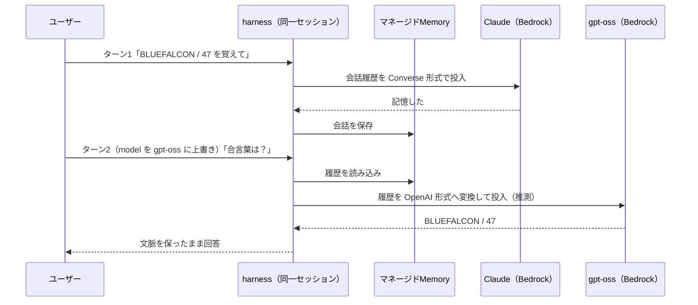

## はじめに

2026年6月17日、AWS は [Amazon Bedrock AgentCore harness の一般提供](https://aws.amazon.com/about-aws/whats-new/2026/06/amazon-bedrock-agentcore-harness-generally-available/) を発表した。harness はエージェントの「オーケストレーションループ」——モデル呼び出し → ツール選択 → 結果反映 → コンテキスト管理 → 失敗回復 → セッション分離——を、コードではなく **設定（config）** として提供するマネージド層である。

ローカルでループを書くのは簡単だが、本番化（並行実行・分離・状態・スケール）で工数が爆発する、というのが AWS の見立てだ。AgentCore Runtime が「ループを自分でコードしてコンテナを ECR に push する」のに対し、harness は `CreateHarness` と `InvokeHarness` の **2 API** だけで、コードを一切書かずにエージェントが数分で立ち上がる（Runtime の中で動くマネージド抽象である）。

**本記事は、us-west-2 で name と実行ロールだけを渡してエージェントを起動し、(1) 「アイデア→初回応答」の実時間、(2) GA で自動生成されるもの、(3) GA で最も強調された差別化——「セッション途中でモデルプロバイダーを切り替えてもコンテキストが失われない」——を実機で確かめた結果を共有する。** 先に結論を言うと、Anthropic の Claude から OpenAI のモデルへ会話の途中で切り替えても、合言葉も連番もそのまま引き継がれた。公式ドキュメントは [AgentCore harness overview](https://docs.aws.amazon.com/bedrock-agentcore/latest/devguide/harness.html) と [Get started](https://docs.aws.amazon.com/bedrock-agentcore/latest/devguide/harness-get-started.html) を参照。

## 検証環境

| 項目 | 値 |
| --- | --- |
| リージョン | us-west-2（harness GA リージョン） |
| 既定モデル | `global.anthropic.claude-sonnet-4-6` |
| 切替先モデル | `openai.gpt-oss-120b-1:0`（Bedrock ネイティブ・APIキー不要） |
| SDK | **boto3 1.43.33** |

ここで最初の落とし穴がある。検証環境にプリインストールされていた AWS CLI 2.34.30 / boto3 1.42.80 には `create-harness` が存在せず（`Found invalid choice 'create-harness'`）、`bedrock-agentcore-control` クライアントにも `CreateHarness` API が無かった。GA 直後の新 API なので、**boto3 を 1.43.x 系へ更新するのが事実上の前提条件**になる。もう一つの小さな罠：`harnessName` は `[a-zA-Z][a-zA-Z0-9_]{0,39}` 制約でハイフン不可。

クロスプロバイダー切替を APIキーなしで再現するため、切替先は Bedrock ネイティブの OpenAI モデル `openai.gpt-oss-120b` を選んだ。OpenAI 直エンドポイントや Gemini を使う場合は AgentCore Identity のトークン保管庫に APIキーを登録する必要がある（これは別途検証範囲外とした）。

再現には他に2つの前提がある——(1) 呼び出し側プリンシパルに harness 系 API（`CreateHarness` / `InvokeHarness` など。各々 `InvokeAgentRuntime` 等も併せて必要）の権限。本検証は管理者権限で実行した。(2) 対象リージョンの Bedrock で両モデル（Claude Sonnet 4.6・gpt-oss-120b）のモデルアクセスを有効化しておくこと。

<details className="my-4 rounded-lg border border-border bg-muted/30 p-4">
<summary className="cursor-pointer font-medium">前提準備（venv・実行ロール作成：ゼロから再現）</summary>

```bash title="Terminal (venv)"
# GA 直後の API は boto3 1.43.x 以降が必要（システムの 1.42.x は create-harness 未対応）
python3 -m venv venv && . venv/bin/activate
pip install -q --upgrade boto3   # => 1.43.33
```

実行ロールは harness（`bedrock-agentcore.amazonaws.com`）が assume できる信頼ポリシーと、Bedrock モデル呼び出し・CloudWatch Logs・X-Ray・ワークロード ID・Memory への最小権限を付与する。

```bash title="Terminal (IAM)"
REGION=us-west-2; ACCOUNT=$(aws sts get-caller-identity --query Account --output text)
ROLE=agentcore-harness-verify-role
cat > trust.json <<JSON
{ "Version":"2012-10-17","Statement":[{"Effect":"Allow",
  "Principal":{"Service":"bedrock-agentcore.amazonaws.com"},"Action":"sts:AssumeRole",
  "Condition":{"StringEquals":{"aws:SourceAccount":"$ACCOUNT"},
    "ArnLike":{"aws:SourceArn":"arn:aws:bedrock-agentcore:$REGION:$ACCOUNT:*"}}}]}
JSON
aws iam create-role --role-name $ROLE --assume-role-policy-document file://trust.json

cat > perms.json <<JSON
{ "Version":"2012-10-17","Statement":[
  {"Sid":"Bedrock","Effect":"Allow",
   "Action":["bedrock:InvokeModel","bedrock:InvokeModelWithResponseStream"],
   "Resource":["arn:aws:bedrock:*::foundation-model/*","arn:aws:bedrock:$REGION:$ACCOUNT:*"]},
  {"Sid":"XRay","Effect":"Allow",
   "Action":["xray:PutTraceSegments","xray:PutTelemetryRecords","xray:GetSamplingRules","xray:GetSamplingTargets"],"Resource":"*"},
  {"Sid":"Logs","Effect":"Allow",
   "Action":["logs:CreateLogGroup","logs:CreateLogStream","logs:PutLogEvents","logs:DescribeLogStreams","logs:DescribeLogGroups"],
   "Resource":"arn:aws:logs:$REGION:$ACCOUNT:log-group:*"},
  {"Sid":"Metrics","Effect":"Allow","Action":"cloudwatch:PutMetricData","Resource":"*",
   "Condition":{"StringEquals":{"cloudwatch:namespace":"bedrock-agentcore"}}},
  {"Sid":"WorkloadIdentity","Effect":"Allow",
   "Action":["bedrock-agentcore:GetWorkloadAccessToken","bedrock-agentcore:GetWorkloadAccessTokenForJWT"],
   "Resource":["arn:aws:bedrock-agentcore:$REGION:$ACCOUNT:workload-identity-directory/default",
     "arn:aws:bedrock-agentcore:$REGION:$ACCOUNT:workload-identity-directory/default/workload-identity/*"]},
  {"Sid":"Memory","Effect":"Allow",
   "Action":["bedrock-agentcore:CreateEvent","bedrock-agentcore:ListEvents","bedrock-agentcore:RetrieveMemoryRecords",
     "bedrock-agentcore:ListMemoryRecords","bedrock-agentcore:GetMemoryRecord","bedrock-agentcore:GetMemory"],
   "Resource":"arn:aws:bedrock-agentcore:$REGION:$ACCOUNT:memory/*"}]}
JSON
aws iam put-role-policy --role-name $ROLE --policy-name harness-verify-perms \
  --policy-document file://perms.json
```

このポリシーは公式の [サンプル実行ロールポリシー](https://docs.aws.amazon.com/bedrock-agentcore/latest/devguide/harness-security.html) を、本検証で使う機能（Bedrock 呼び出し・ログ・トレース・ワークロード ID・マネージド Memory）に絞ったものだ。

</details>

## 検証1: 2 API・ゼロコードで起動

`CreateHarness` に **`harnessName` と `executionRoleArn` だけ**を渡す。モデルもメモリもツールも指定しない。`GetHarness` を `READY` までポーリングし、`InvokeHarness` で初回応答をストリーム受信した。

```python title="Python (scenario1.py)"
ctrl = boto3.client("bedrock-agentcore-control", "us-west-2")
data = boto3.client("bedrock-agentcore", "us-west-2")

h = ctrl.create_harness(harnessName="verifyZeroCode", executionRoleArn=ROLE_ARN)["harness"]
# get_harness を status == "READY" までポーリング（完全版は下の折り畳み参照）

# runtimeSessionId は 33 文字以上が必須
sid = (uuid.uuid4().hex * 2)[:40]
r = data.invoke_harness(harnessArn=h["arn"], runtimeSessionId=sid,
    messages=[{"role": "user", "content": [{"text": "In one sentence, what model are you and who built you?"}]}])
for ev in r["stream"]:
    if "contentBlockDelta" in ev:
        print(ev["contentBlockDelta"]["delta"].get("text", ""), end="")
```

実測値が以下である。

| ステップ | 所要時間 |
| --- | --- |
| `CreateHarness`（CREATING → READY） | **約11.1 秒** |
| 初回 `InvokeHarness`（初トークンまで） | 約3.2 秒 |
| 初回 `InvokeHarness`（応答完了まで） | 約3.7 秒 |

「数分」どころか、**アイデアから初回応答まで15秒未満**で到達した。返ってきた答えは `I'm Claude, a large language model built by Anthropic.`——既定モデルが Claude Sonnet 4.6 であることを実機で確認できた。書いたコードは API 呼び出しだけで、オーケストレーションループは一行も書いていない。

注目すべきは **`GetHarness` が見せた「何も指定していないのに埋まった既定値」** だ。

```text title="Output (GetHarness の自動既定)"
model:        global.anthropic.claude-sonnet-4-6 (apiFormat: converse_stream)
systemPrompt: "You are a helpful assistant."
maxIterations: 75    timeoutSeconds: 3600
truncation:   sliding_window (messagesCount: 150)
memory:       managedMemoryConfiguration → arn:.../memory/harness_verifyZeroCode_...
```

これらは本番運用で本来自分が決める値だ——`maxIterations` はツール使用ループの最大反復回数、`timeoutSeconds` は1呼び出しの実行上限（秒）、`truncation` は会話がコンテキスト窓を超えたとき直近150メッセージを残して古いものを落とす方式。指定しなければ、いずれも妥当な既定で埋まる。

そして GA の新挙動として、**メモリを省略すると実在の Memory リソースが自動プロビジョニング**された。`GetMemory` で叩くと `status: ACTIVE`、戦略は `SEMANTIC`（会話から事実を抽出して検索可能にする）+ `SUMMARIZATION`（会話の要約を逐次作る）、イベント保持30日、ネームスペースは `/actors/{actorId}/facts/` と `/actors/{actorId}/summaries/{sessionId}/`。プレビューでは別途 Memory を作って ARN を渡す必要があったが、GA では「忘れても勝手に用意される」。しかもこれはブラックボックスではなく、ARN を持つ普通の AWS リソースとして直接クエリ・監査できる。

<details className="my-4 rounded-lg border border-border bg-muted/30 p-4">
<summary className="cursor-pointer font-medium">検証1の完全スクリプト（作成・ポーリング・既定値の確認・計測：そのまま実行可能）</summary>

`agentcore-harness-verify-role` を作成済みの状態で実行する。

```python title="Python (scenario1.py)"
import boto3, time, uuid

REGION = "us-west-2"
ACCOUNT = boto3.client("sts").get_caller_identity()["Account"]
ROLE_ARN = f"arn:aws:iam::{ACCOUNT}:role/agentcore-harness-verify-role"
ctrl = boto3.client("bedrock-agentcore-control", REGION)
data = boto3.client("bedrock-agentcore", REGION)

# CreateHarness: harnessName と executionRoleArn だけ（モデル/メモリ/ツールは指定しない）
h = ctrl.create_harness(harnessName="verifyZeroCode", executionRoleArn=ROLE_ARN)["harness"]
hid, harness_arn = h["harnessId"], h["arn"]

# GetHarness を READY までポーリング（作成→READY は createdAt→updatedAt から算出）
while True:
    g = ctrl.get_harness(harnessId=hid)["harness"]
    if g["status"] in ("READY", "CREATE_FAILED"):
        break
    time.sleep(3)
print("create->ready:", (g["updatedAt"] - g["createdAt"]).total_seconds(), "s")
print("model :", g["model"])         # 自動既定: global.anthropic.claude-sonnet-4-6
print("memory:", g["memory"])        # 自動生成された managedMemoryConfiguration の ARN
print("limits:", g["maxIterations"], g["timeoutSeconds"], g["truncation"])

# 初回 InvokeHarness（既定モデル）。runtimeSessionId は 33 文字以上が必須
sid = (uuid.uuid4().hex * 2)[:40]
t = time.time(); first = None; chunks = []
r = data.invoke_harness(harnessArn=harness_arn, runtimeSessionId=sid,
    messages=[{"role": "user", "content": [{"text": "In one sentence, what model are you and who built you?"}]}])
for ev in r["stream"]:
    if "contentBlockDelta" in ev:
        if first is None:
            first = time.time() - t
        chunks.append(ev["contentBlockDelta"]["delta"].get("text", ""))
    elif "metadata" in ev:
        print("usage:", ev["metadata"]["usage"])
print(f"first token {first:.2f}s / full {time.time()-t:.2f}s")
print("".join(chunks))

# 自動生成された Memory リソースを直接確認
mem_id = g["memory"]["managedMemoryConfiguration"]["arn"].split("/")[-1]
m = ctrl.get_memory(memoryId=mem_id)["memory"]
print("memory status:", m["status"], "expiry:", m["eventExpiryDuration"],
      "strategies:", [s["type"] for s in m["strategies"]])
```

</details>

## 検証2: セッション途中のプロバイダー切替とコンテキスト維持

GA で「顧客が最も重要だと言った」とされる差別化が、**同一セッションの途中でモデルプロバイダーを切り替えても会話コンテキストが生き残る**ことだ。なぜこれが非自明か——プロバイダーごとに会話履歴のフォーマットが違う（Anthropic の Converse 形式と OpenAI の Responses/Chat 形式）。ドキュメントによれば harness は毎ターン会話履歴を Memory から読み込んで再投入するので、利用者は過去メッセージを自分で詰め直さなくていい。プロバイダーを切り替えるなら、その履歴を新しいモデルの形式へ変換して渡しているはずだ——この推測が正しいかは、後述のトークン数とペルソナの観測で裏を取る。

2ターンの流れと、セッションをまたいで状態を運ぶ Memory の位置づけを図にするとこうだ。



同一 `runtimeSessionId` で2ターン投げた。ターン1は既定（Claude）に事実を覚えさせ、ターン2では `model` を `openai.gpt-oss-120b` に**上書き**して、ターン1の情報を参照させる。

```python title="Python (scenario2.py)"
sid = (uuid.uuid4().hex * 2)[:40]  # invoke ヘルパーの定義は下の折り畳み参照
# ターン1: 既定の Claude Sonnet 4.6
invoke(sid, "覚えておいて: コードネームは BLUEFALCON、連番は 47。控えたと確認して。")
# ターン2: 同じセッションのまま OpenAI gpt-oss-120b へ切替
invoke(sid, "さっきのコードネームと連番を答えて。あとあなたを作った会社はどこ？",
       model={"bedrockModelConfig": {"modelId": "openai.gpt-oss-120b-1:0"}})
```

結果は明快だった。

```text title="Output"
[Turn1 = Claude]      Got it! Project Codename: BLUEFALCON / Launch Number: 47 ...
[Turn2 = gpt-oss-120b] Your project codename is BLUEFALCON and the launch number is 47.
                       I'm a model built by OpenAI.
```

**プロバイダーを跨いでも合言葉(BLUEFALCON)と連番(47)はそのまま引き継がれた**（観測）。ターン2は「自分は OpenAI 製」とも名乗った。ただし自己申告だけでは切替の証明にならない（理由は後述）ため、上書きが本当に効いているかは独立した対照実験で裏を取った。

クリーンな新規セッションで尋ねると、既定は `I'm Claude, made by Anthropic.` と名乗り、`gpt-oss` 上書きでは「OpenAI が作った」と名乗る、というように応答がはっきり分かれる。さらに存在しない modelId を渡すと Bedrock の `ConverseStream` が `The provided model identifier is invalid` で弾く——ここまでが、上書きが実モデルへ届いていることの確かな証拠だ。

その自己申告が当てにならない例も観測した。最初の試行ではターン1で「あなたは Claude か GPT か」も尋ねており、ターン2の gpt-oss は——実体は OpenAI なのに——「自分は Claude だ」と答えた（観測）。会話履歴に残った「私は Claude」というアシスタント発言を引き継いだものと解釈できる（推測）。これは harness が単なる事実ではなく**会話状態を丸ごと新プロバイダー形式へ再生している**ことの傍証でもある（実際この試行では入力トークン数がターン間で 969 → 481 と変動しており、履歴が毎回作り直されていることと整合する）。

<details className="my-4 rounded-lg border border-border bg-muted/30 p-4">
<summary className="cursor-pointer font-medium">検証2と対照実験の完全スクリプト（invoke ヘルパー・切替・対照：そのまま実行可能）</summary>

検証1で作成した `verifyZeroCode` harness を再利用する。

```python title="Python (scenario2.py)"
import boto3, uuid

REGION = "us-west-2"
ctrl = boto3.client("bedrock-agentcore-control", REGION)
data = boto3.client("bedrock-agentcore", REGION)
harness_arn = [x for x in ctrl.list_harnesses()["harnesses"]
               if x["harnessName"] == "verifyZeroCode"][0]["arn"]

def invoke(session_id, text, model=None):
    kw = dict(harnessArn=harness_arn, runtimeSessionId=session_id,
              messages=[{"role": "user", "content": [{"text": text}]}])
    if model:
        kw["model"] = model
    out = []
    for ev in data.invoke_harness(**kw)["stream"]:
        if "contentBlockDelta" in ev:
            out.append(ev["contentBlockDelta"]["delta"].get("text", ""))
    return "".join(out)

# --- 同一セッションでプロバイダー切替 ---
sid = (uuid.uuid4().hex * 2)[:40]
print("T1:", invoke(sid, "Remember: codename is BLUEFALCON, launch number is 47. Confirm you noted them."))
print("T2:", invoke(sid, "Repeat my codename and launch number from earlier, and say which company built you.",
                    model={"bedrockModelConfig": {"modelId": "openai.gpt-oss-120b-1:0"}}))

# --- 対照実験（毎回クリーンな新規セッション）---
Q = "What model and company made you? One short sentence."
print("default:", invoke((uuid.uuid4().hex * 2)[:40], Q))                  # => Claude / Anthropic
print("gpt-oss:", invoke((uuid.uuid4().hex * 2)[:40], Q,
                         {"bedrockModelConfig": {"modelId": "openai.gpt-oss-120b-1:0"}}))  # => OpenAI
# 存在しない modelId を渡すと、ストリーム反復中に ConverseStream の
# ValidationException（EventStreamError）が送出される
```

</details>

## 比較: harness vs 自前ループ

今回の観測を、自前でループを実装した場合に「書く必要があるもの」と対比する。

| 関心事 | 自前ループ実装 | AgentCore harness |
| --- | --- | --- |
| モデルクライアント | プロバイダー別 SDK を結線 | config の1フィールド |
| プロバイダー途中切替 | 履歴を各社形式へ**変換して再投入**するコード | `InvokeHarness` の `model` 上書き |
| 会話の永続化 | ストア選定・保存/読込を実装 | 既定でマネージド Memory 自動生成 |
| セッション分離 | 並行制御・隔離を自前で | microVM/セッションで既定提供 |
| ストリーミング | イベント整形を実装 | `stream` を読むだけ |

[harness vs Runtime](https://docs.aws.amazon.com/bedrock-agentcore/latest/devguide/harness-vs-runtime.html) のグリッドどおり、これらは harness では「コード不要（✅）」、Runtime では「自分で実装（🔵）」に分かれる。最難所だった**プロバイダー途中切替＋コンテキスト形式変換**を config 化できる点が、harness の核心的な価値だと実感した。

## まとめ

- **アイデア→初回応答は15秒未満、コードはゼロ** — `CreateHarness` は約11秒で READY、初回応答は約3.7秒。既定モデル(Claude Sonnet 4.6)・systemPrompt・実行制限・Memory まで「指定しなければ妥当な既定で埋まる」。
- **GA はメモリを忘れても面倒を見る** — メモリ省略で `SEMANTIC`+`SUMMARIZATION`・30日保持の実在 Memory リソースが自動生成。ブラックボックスではなく ARN で直接扱える。
- **プロバイダー途中切替でコンテキストは壊れない** — Claude → OpenAI gpt-oss を同一セッションで跨いでも合言葉・連番を保持（観測）。ペルソナの引き継ぎとトークン数の変化から、会話状態が各社形式へ作り直されていると見られる（推測）。
- **設定で足りるうちは harness、独自オーケストレーションが要れば export でコードへ** — ドキュメントによれば卒業はアーキテクチャ変更ではなく config→code 翻訳とされる（[Export to code](https://docs.aws.amazon.com/bedrock-agentcore/latest/devguide/harness-export.html)、本記事では未検証）。自前ループの最難所を肩代わりするかで採否を判断するとよい。

## クリーンアップ

<details className="my-4 rounded-lg border border-border bg-muted/30 p-4">
<summary className="cursor-pointer font-medium">リソース削除コマンド（作成と逆順）</summary>

`DeleteHarness` は既定で自動生成された Memory もカスケード削除する（残したい場合は `deleteManagedMemory=false`）。なお `bedrock-agentcore-control` は本文と同じく boto3 で扱う（前述のとおり旧 CLI には harness サブコマンドが無いため）。IAM ロール削除は旧 CLI でも動く。

```python title="Python (cleanup.py)"
ctrl = boto3.client("bedrock-agentcore-control", "us-west-2")
iam = boto3.client("iam")
hid = [h["harnessId"] for h in ctrl.list_harnesses()["harnesses"]
       if h["harnessName"] == "verifyZeroCode"][0]
ctrl.delete_harness(harnessId=hid)  # 自動生成 Memory は既定でカスケード削除
iam.delete_role_policy(RoleName="agentcore-harness-verify-role", PolicyName="harness-verify-perms")
iam.delete_role(RoleName="agentcore-harness-verify-role")
```

</details>
