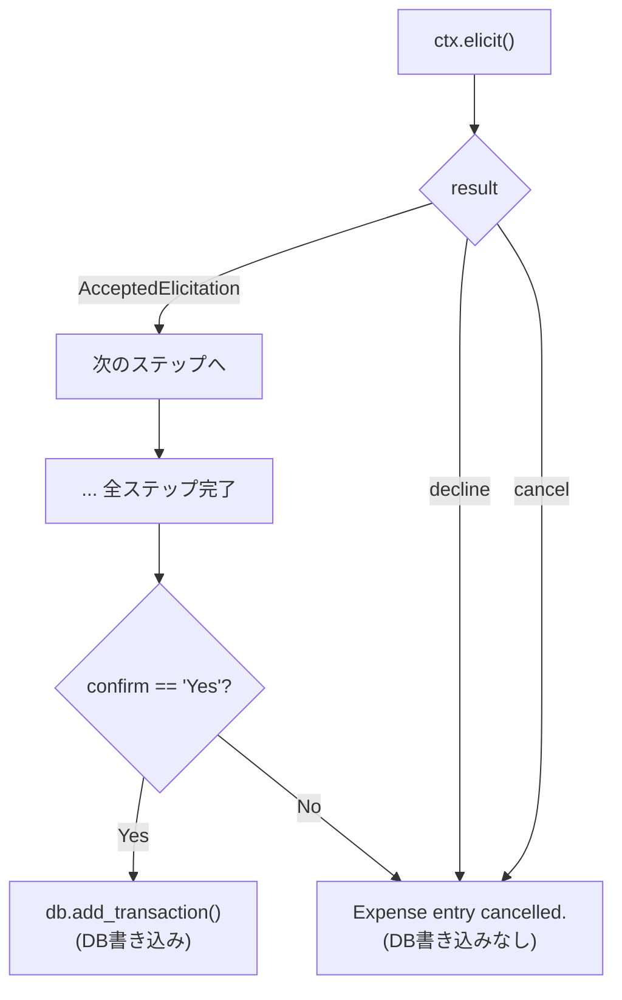

## はじめに

2026年4月9日、AWSは[Stateful MCPクライアント機能に関するブログ記事](https://aws.amazon.com/blogs/machine-learning/introducing-stateful-mcp-client-capabilities-on-amazon-bedrock-agentcore-runtime/)を公開した。Elicitation・Sampling・Progress Notificationsの3機能を、DynamoDB連携の家計簿アプリで実装するサンプルコードが紹介されている。

[前回の記事](/ja/blog/2026/03/11/bedrock-agentcore-runtime-stateful-mcp)では、Travel Plannerサンプルを使って3機能が動くことを確認した。しかし正常系の動作確認だけでは、実戦投入するには情報が足りない。ユーザーが途中で入力を拒否したらどうなるのか？ Samplingが失敗したらツール実行はどうなるのか？ ドキュメントには「サーバーは各ケースを適切に処理すべき」と書かれているだけで、具体的な挙動は示されていない。

この記事では、ブログ記事の家計簿サンプルをベースにDynamoDB連携のStateful MCPサーバーを構築し、正常系フローに加えてエッジケースの実挙動を検証する。公式ドキュメントは[Stateful MCP server features](https://docs.aws.amazon.com/bedrock-agentcore/latest/devguide/mcp-stateful-features.html)を参照。

## 前提条件

- AWS CLIセットアップ済み（`bedrock-agentcore:*`、`dynamodb:*`、`bedrock:InvokeModel`の権限）
- Python 3.10+、FastMCP 3.2+
- 検証リージョン: us-west-2

## 検証環境の構築

ブログ記事のexpense trackerサンプルをベースに、3つのツールを持つMCPサーバーを構築した。各ツールがStateful MCPの1機能に対応する。

| ツール | Stateful MCP機能 | 役割 |
|---|---|---|
| `add_expense_interactive` | Elicitation | 金額・説明・カテゴリ・確認を対話的に収集し、DynamoDBに書き込む |
| `analyze_spending` | Sampling | DynamoDBから支出データを取得し、クライアント側LLMに分析を依頼する |
| `generate_report` | Progress Notifications | 月次レポートを5段階で生成し、各段階の進捗を通知する |

<details className="my-4 rounded-lg border border-border bg-muted/30 p-4">
<summary className="cursor-pointer font-medium">DynamoDBテーブル作成</summary>

```bash title="Terminal"
# トランザクションテーブル
aws dynamodb create-table \
  --table-name mcp-finance-transactions \
  --attribute-definitions \
    AttributeName=user_alias,AttributeType=S \
    AttributeName=transaction_id,AttributeType=S \
  --key-schema \
    AttributeName=user_alias,KeyType=HASH \
    AttributeName=transaction_id,KeyType=RANGE \
  --billing-mode PAY_PER_REQUEST \
  --region us-west-2

# 予算テーブル
aws dynamodb create-table \
  --table-name mcp-finance-budgets \
  --attribute-definitions \
    AttributeName=user_alias,AttributeType=S \
    AttributeName=category,AttributeType=S \
  --key-schema \
    AttributeName=user_alias,KeyType=HASH \
    AttributeName=category,KeyType=RANGE \
  --billing-mode PAY_PER_REQUEST \
  --region us-west-2
```

</details>

<details className="my-4 rounded-lg border border-border bg-muted/30 p-4">
<summary className="cursor-pointer font-medium">DynamoDBユーティリティ（dynamo_utils.py）</summary>

```python title="dynamo_utils.py"
import uuid
from datetime import datetime, timezone
from decimal import Decimal

import boto3
from boto3.dynamodb.conditions import Key


class FinanceDB:
    def __init__(self, region_name: str = "us-west-2"):
        dynamodb = boto3.resource("dynamodb", region_name=region_name)
        self.transactions = dynamodb.Table("mcp-finance-transactions")
        self.budgets = dynamodb.Table("mcp-finance-budgets")

    def add_transaction(self, user_alias, tx_type, amount, description, category):
        tx_id = str(uuid.uuid4())[:8]
        self.transactions.put_item(Item={
            "user_alias": user_alias,
            "transaction_id": tx_id,
            "type": tx_type,
            "amount": Decimal(str(amount)),
            "description": description,
            "category": category,
            "timestamp": datetime.now(timezone.utc).isoformat(),
        })
        return f"Expense of ${abs(amount):.2f} added for {user_alias}"

    def get_transactions(self, user_alias):
        return self.transactions.query(
            KeyConditionExpression=Key("user_alias").eq(user_alias)
        ).get("Items", [])

    def get_budgets(self, user_alias):
        return self.budgets.query(
            KeyConditionExpression=Key("user_alias").eq(user_alias)
        ).get("Items", [])
```

</details>

<details className="my-4 rounded-lg border border-border bg-muted/30 p-4">
<summary className="cursor-pointer font-medium">MCPサーバーコード（finance_server.py）</summary>

```python title="finance_server.py"
import os
from pydantic import BaseModel
from fastmcp import FastMCP, Context
from fastmcp.server.elicitation import AcceptedElicitation
from dynamo_utils import FinanceDB

mcp = FastMCP(name="FinanceMCP")
db = FinanceDB(region_name=os.environ.get("AWS_REGION", "us-west-2"))

class AmountInput(BaseModel):
    amount: float

class DescriptionInput(BaseModel):
    description: str

class CategoryInput(BaseModel):
    category: str

class ConfirmInput(BaseModel):
    confirm: str


@mcp.tool()
async def add_expense_interactive(user_alias: str, ctx: Context) -> str:
    """Interactively add a new expense using elicitation."""
    result = await ctx.elicit("How much did you spend?", AmountInput)
    if not isinstance(result, AcceptedElicitation):
        return "Expense entry cancelled."
    amount = result.data.amount

    result = await ctx.elicit("What was it for?", DescriptionInput)
    if not isinstance(result, AcceptedElicitation):
        return "Expense entry cancelled."
    description = result.data.description

    result = await ctx.elicit(
        "Select a category (food, transport, bills, entertainment, other):",
        CategoryInput,
    )
    if not isinstance(result, AcceptedElicitation):
        return "Expense entry cancelled."
    category = result.data.category

    confirm_msg = (
        f"Confirm: add expense of ${amount:.2f} for {description}"
        f" (category: {category})? Reply Yes or No"
    )
    result = await ctx.elicit(confirm_msg, ConfirmInput)
    if not isinstance(result, AcceptedElicitation) or result.data.confirm != "Yes":
        return "Expense entry cancelled."

    return db.add_transaction(user_alias, "expense", -abs(amount), description, category)


@mcp.tool()
async def analyze_spending(user_alias: str, ctx: Context) -> str:
    """Fetch expenses and ask the client's LLM to analyse them."""
    transactions = db.get_transactions(user_alias)
    if not transactions:
        return f"No transactions found for {user_alias}."

    lines = "\n".join(
        f"- {t['description']} (${abs(float(t['amount'])):.2f}, {t['category']})"
        for t in transactions
    )
    prompt = (
        f"Here are the recent expenses:\n{lines}\n\n"
        f"Give 3 concise, actionable recommendations. Under 120 words."
    )

    ai_analysis = "Analysis unavailable."
    try:
        response = await ctx.sample(messages=prompt, max_tokens=300)
        if hasattr(response, "text") and response.text:
            ai_analysis = response.text
    except Exception:
        pass

    return f"Spending Analysis for {user_alias}:\n\n{ai_analysis}"


@mcp.tool()
async def generate_report(user_alias: str, ctx: Context) -> str:
    """Generate a monthly financial report with progress notifications."""
    total = 5

    await ctx.report_progress(progress=1, total=total)
    transactions = db.get_transactions(user_alias)

    await ctx.report_progress(progress=2, total=total)
    by_category = {}
    for t in transactions:
        cat = t["category"]
        by_category[cat] = by_category.get(cat, 0) + abs(float(t["amount"]))

    await ctx.report_progress(progress=3, total=total)
    budgets = {b["category"]: float(b["monthly_limit"]) for b in db.get_budgets(user_alias)}

    await ctx.report_progress(progress=4, total=total)
    lines = []
    for cat, spent in sorted(by_category.items(), key=lambda x: -x[1]):
        limit = budgets.get(cat)
        if limit:
            pct = (spent / limit) * 100
            status = "OVER" if spent > limit else "OK"
            lines.append(f"  {cat:<15} ${spent:>8.2f} / ${limit:.2f}  [{pct:.0f}%] {status}")
        else:
            lines.append(f"  {cat:<15} ${spent:>8.2f}  (no budget set)")

    await ctx.report_progress(progress=5, total=total)
    total_spent = sum(by_category.values())
    return (
        f"Monthly Report for {user_alias}\n"
        f"{'=' * 50}\n"
        f"  {'Category':<15} {'Spent':>10}   {'Budget':>8}  Status\n"
        f"{'-' * 50}\n"
        + "\n".join(lines)
        + f"\n{'-' * 50}\n"
        f"  {'TOTAL':<15} ${total_spent:>8.2f}\n"
    )


if __name__ == "__main__":
    mcp.run(transport="streamable-http", host="0.0.0.0", port=8000, stateless_http=False)
```

</details>

### サーバーコードのポイント

1つ目は、Elicitationの各ステップで`isinstance(result, AcceptedElicitation)`をチェックしていること。MCP仕様ではElicitationのレスポンスは`accept`（データ提供）、`decline`（明示的拒否）、`cancel`（キャンセル）の3種類が定義されている。このサーバーでは`AcceptedElicitation`以外が返った場合に即座にツール実行を中断する設計にしている。

2つ目は、`analyze_spending`の`ctx.sample()`が`try/except`で囲まれていること。Samplingはクライアント側のLLMに依存するため、クライアントがハンドラーを登録していない場合やLLM呼び出しが失敗した場合に備えて、フォールバックテキスト（`"Analysis unavailable."`）を用意している。

これらのエラーハンドリングが実際にどう動作するかを、以降の検証で確認する。

### セットアップと実行手順

```text title="requirements.txt"
fastmcp>=2.10.0
mcp
boto3
pydantic
```

```bash title="Terminal"
pip install -r requirements.txt
```

上記の3ファイル（`dynamo_utils.py`、`finance_server.py`、`requirements.txt`）を同じディレクトリに配置する。FastMCPの`Client`はサーバーオブジェクトを直接受け取れるため、サーバーを別プロセスで起動する必要はない。以下のテストクライアントで正常系・エッジケースの両方を再現できる。

<details className="my-4 rounded-lg border border-border bg-muted/30 p-4">
<summary className="cursor-pointer font-medium">テストクライアント（test_client.py）</summary>

```python title="test_client.py"
"""Test client — normal flow + edge cases."""
import asyncio
import os

os.environ.setdefault("AWS_DEFAULT_REGION", "us-west-2")

from fastmcp import Client
from fastmcp.client.elicitation import ElicitResult
from mcp.types import CreateMessageResult, TextContent
from finance_server import mcp


async def test_normal_flow():
    """正常系: 経費追加 → 支出分析 → 月次レポート"""
    expenses = [
        [{"amount": 45.50}, {"description": "Lunch at the office"}, {"category": "food"}, {"confirm": "Yes"}],
        [{"amount": 120.00}, {"description": "Electric bill"}, {"category": "bills"}, {"confirm": "Yes"}],
        [{"amount": 15.99}, {"description": "Movie tickets"}, {"category": "entertainment"}, {"confirm": "Yes"}],
        [{"amount": 85.30}, {"description": "Weekly groceries"}, {"category": "food"}, {"confirm": "Yes"}],
    ]
    idx = [0, 0]  # [expense_index, step_index]

    async def elicit_handler(message, response_type, params, context):
        resp = expenses[idx[0]][idx[1]]
        print(f"  Server asks: {message}")
        print(f"  Responding:  {resp}")
        idx[1] += 1
        if idx[1] >= len(expenses[idx[0]]):
            idx[1] = 0
            idx[0] += 1
        return resp

    async def sampling_handler(messages, params, ctx):
        return CreateMessageResult(
            role="assistant",
            content=TextContent(type="text", text="1. Meal prep. 2. Cancel unused subscriptions. 3. Save energy."),
            model="test-model", stopReason="endTurn",
        )

    async def progress_handler(progress, total, message):
        pct = int((progress / total) * 100) if total else 0
        bar = "#" * (pct // 5) + "-" * (20 - pct // 5)
        print(f"  Progress: [{bar}] {pct}% ({int(progress)}/{int(total or 0)})")

    async with Client(mcp, elicitation_handler=elicit_handler,
                      sampling_handler=sampling_handler, progress_handler=progress_handler) as client:
        for i in range(4):
            print(f"\n--- Adding expense {i + 1} ---")
            result = await client.call_tool("add_expense_interactive", {"user_alias": "testuser"})
            print(f"  Result: {result.content[0].text}")

        print("\n--- Analyzing spending ---")
        result = await client.call_tool("analyze_spending", {"user_alias": "testuser"})
        print(f"  Result:\n{result.content[0].text}")

        print("\n--- Generating report ---")
        result = await client.call_tool("generate_report", {"user_alias": "testuser"})
        print(f"  Result:\n{result.content[0].text}")


async def test_decline():
    """エッジケース: 2問目でdecline"""
    call_count = [0]

    async def handler(message, response_type, params, context):
        call_count[0] += 1
        print(f"  Server asks: {message}")
        if call_count[0] == 1:
            print("  Responding: {'amount': 99.99}")
            return {"amount": 99.99}
        print("  Responding: DECLINE")
        return ElicitResult(action="decline", content=None)

    async with Client(mcp, elicitation_handler=handler) as client:
        result = await client.call_tool("add_expense_interactive", {"user_alias": "testuser"})
        print(f"  Result: {result.content[0].text}")


async def test_cancel():
    """エッジケース: 1問目でcancel"""
    async def handler(message, response_type, params, context):
        print(f"  Server asks: {message}")
        print("  Responding: CANCEL")
        return ElicitResult(action="cancel", content=None)

    async with Client(mcp, elicitation_handler=handler) as client:
        result = await client.call_tool("add_expense_interactive", {"user_alias": "testuser"})
        print(f"  Result: {result.content[0].text}")


async def test_confirm_no():
    """エッジケース: 全問回答後にNo"""
    responses = iter([{"amount": 50.0}, {"description": "Test"}, {"category": "other"}, {"confirm": "No"}])

    async def handler(message, response_type, params, context):
        resp = next(responses)
        print(f"  Server asks: {message}")
        print(f"  Responding: {resp}")
        return resp

    async with Client(mcp, elicitation_handler=handler) as client:
        result = await client.call_tool("add_expense_interactive", {"user_alias": "testuser"})
        print(f"  Result: {result.content[0].text}")


async def test_sampling_failure():
    """エッジケース: Samplingハンドラーが例外を投げる"""
    async def handler(messages, params, ctx):
        raise RuntimeError("Simulated LLM failure")

    async with Client(mcp, sampling_handler=handler) as client:
        result = await client.call_tool("analyze_spending", {"user_alias": "testuser"})
        print(f"  Result: {result.content[0].text}")


async def test_no_sampling_handler():
    """エッジケース: Samplingハンドラー未登録"""
    async with Client(mcp) as client:
        result = await client.call_tool("analyze_spending", {"user_alias": "testuser"})
        print(f"  Result: {result.content[0].text}")


async def main():
    for name, fn in [
        ("Normal Flow", test_normal_flow),
        ("Elicitation Decline", test_decline),
        ("Elicitation Cancel", test_cancel),
        ("Confirm No", test_confirm_no),
        ("Sampling Failure", test_sampling_failure),
        ("No Sampling Handler", test_no_sampling_handler),
    ]:
        print(f"\n{'=' * 50}\n  {name}\n{'=' * 50}")
        await fn()


if __name__ == "__main__":
    asyncio.run(main())
```

</details>

```bash title="Terminal"
AWS_REGION=us-west-2 python test_client.py
```

FastMCPの`Client`にサーバーの`mcp`オブジェクトを直接渡すことで、インプロセスでサーバーとクライアントが通信する。HTTP経由のテストが必要な場合は、`finance_server.py`を別ターミナルで起動し、`StreamableHttpTransport(url="http://localhost:8000/mcp")`を使う。

## 検証 1: 正常系フロー

テーブルを空の状態から、経費追加 → 支出分析 → 月次レポートの一連フローを実行した。

### 経費追加（Elicitation）

`add_expense_interactive`を4回呼び出し、各回で4ステップのElicitationが実行された。

```text title="Output"
--- Adding expense 1 ---
  Server asks: How much did you spend?
  Responding:  {'amount': 45.5}
  Server asks: What was it for?
  Responding:  {'description': 'Lunch at the office'}
  Server asks: Select a category (food, transport, bills, entertainment, other):
  Responding:  {'category': 'food'}
  Server asks: Confirm: add expense of $45.50 for Lunch at the office (category: food)? Reply Yes or No
  Responding:  {'confirm': 'Yes'}
  Result: Expense of $45.50 added for testuser
```

4件の経費（$45.50 food、$120.00 bills、$15.99 entertainment、$85.30 food）がすべてDynamoDBに書き込まれた（残り3件も同様のフローのため出力は省略）。Elicitationの各ステップでサーバーがクライアントに`elicitation/create`リクエストを送り、クライアント側の`elicitation_handler`が応答を返す。ツール実行は各`ctx.elicit()`で一時停止し、応答を受け取ると再開する。

### 支出分析（Sampling）

`analyze_spending`はDynamoDBから4件のトランザクションを取得し、プロンプトを構築して`ctx.sample()`でクライアント側LLMに分析を依頼した。

```text title="Output"
--- Analyzing spending ---
  [SAMPLING] Prompt: [SamplingMessage(role='user', content=TextContent(type='text', text='Here are the recent expenses fo...
  Result:
Spending Analysis for testuser:

Total Spending: $266.79

Recommendations:
1. Meal prep at home to reduce food costs by 20-30%.
2. Review entertainment subscriptions and cancel unused services.
3. Use energy-saving measures to lower electricity bills by 10-15%.
```

Prompt行はFastMCPの内部オブジェクト表現で出力されているが、中身は`"Here are the recent expenses...\n- Lunch at the office ($45.50, food)\n..."`というプロンプト文字列だ。サーバーはLLMのAPIキーもモデル選択も持たない。`ctx.sample()`はクライアントに`sampling/createMessage`リクエストを送り、クライアントが自身のLLMで応答を生成して返す。MCPの「ツールとモデルの分離」が実際に機能している。

### 月次レポート（Progress Notifications）

`generate_report`は5段階の処理（トランザクション取得 → カテゴリ集計 → 予算取得 → 比較 → フォーマット）を実行し、各段階で進捗を通知した。

```text title="Output"
--- Generating report ---
  Progress: [####----------------] 20% (1/5)
  Progress: [########------------] 40% (2/5)
  Progress: [############--------] 60% (3/5)
  Progress: [################----] 80% (4/5)
  Progress: [####################] 100% (5/5)  Done!

  Result:
Monthly Report for testuser
==================================================
  Category             Spent     Budget  Status
--------------------------------------------------
  food            $  130.80  (no budget set)
  bills           $  120.00  (no budget set)
  entertainment   $   15.99  (no budget set)
--------------------------------------------------
  TOTAL           $  266.79

  Progress notifications received: 5
```

`ctx.report_progress(progress, total)`はfire-and-forget（応答不要）で、サーバーの処理をブロックしない。クライアント側の`progress_handler`で受信し、プログレスバーとして表示している。5回の通知がすべて到達した。

## 検証 2: エッジケースの挙動

ここからが本題だ。ドキュメントに具体的な挙動が示されていないケースを検証する。テスト方法は、クライアント側の`elicitation_handler`や`sampling_handler`を差し替えて、decline/cancel/例外などの応答をシミュレーションする形で行った。

以下の図は`add_expense_interactive`のElicitationフローと、各エッジケースでの分岐を示している。



ポイントは、DB書き込みが`confirm == "Yes"`の1箇所にしかないことだ。どのタイミングで中断しても、データ整合性は保たれる。

### 2a. Elicitationのdecline — 途中で入力を拒否

1問目（金額）に正常回答した後、2問目（説明）で`decline`を返した。

```text title="Output"
  Server asks: How much did you spend?
  Responding: {'amount': 99.99}
  Server asks: What was it for?
  Responding: DECLINE
  Result: Expense entry cancelled.
```

`decline`を返すと、`ctx.elicit()`は`AcceptedElicitation`ではないオブジェクトを返す。サーバー側の`isinstance`チェックでキャッチされ、即座に`"Expense entry cancelled."`が返った。

重要なのは**DynamoDBへの書き込みが発生しなかった**ことだ。このサーバーの設計では、4ステップすべてのElicitationが完了し、最終確認で`"Yes"`が返った場合にのみ`db.add_transaction()`が呼ばれる。途中でdeclineされた場合、それまでに収集したデータ（この場合は金額$99.99）は破棄される。

### 2a-2. Elicitationのcancel — declineとの違い

1問目で即座に`cancel`を返した。

```text title="Output"
  Server asks: How much did you spend?
  Responding: CANCEL
  Result: Expense entry cancelled.
```

結果は`decline`と同じだ。FastMCPの実装では、`decline`も`cancel`も`AcceptedElicitation`以外のオブジェクトとして返される。サーバー側のコードで`isinstance(result, AcceptedElicitation)`チェックを使っている限り、**declineとcancelは同じハンドリングパスを通る**。

MCP仕様上、`decline`は「ユーザーが明示的に拒否した」、`cancel`は「ユーザーが選択せずに閉じた」という意味的な違いがある。しかしFastMCPの`AcceptedElicitation`パターンでは両者を区別しない。区別が必要な場合は`result.action`を直接チェックする必要がある。

### 2a-3. 確認ステップでの拒否 — 途中データの扱い

4問すべてに回答した上で、最終確認で`"No"`を返した。

```text title="Output"
  Server asks: How much did you spend?
  Responding: {'amount': 50.0}
  Server asks: What was it for?
  Responding: {'description': 'Test item'}
  Server asks: Select a category (food, transport, bills, entertainment, other):
  Responding: {'category': 'other'}
  Server asks: Confirm: add expense of $50.00 for Test item (category: other)? Reply Yes or No
  Responding: {'confirm': 'No'}
  Result: Expense entry cancelled.
```

最終確認で`"No"`を返した場合も、DynamoDBへの書き込みは発生しなかった。これは`decline`/`cancel`とは異なるパスだ。Elicitation自体は`accept`で成功しているが、`result.data.confirm != "Yes"`の条件でキャッチされている。

このパターンは、Elicitationを使った「確認ダイアログ」の実装例として参考になる。データ収集と確認を分離し、確認後にのみ副作用（DB書き込み）を実行する設計だ。

### 2b. Sampling失敗 — ハンドラーが例外を投げた場合

`sampling_handler`が`RuntimeError`を投げるように設定し、`analyze_spending`を呼び出した。

```text title="Output"
  [SAMPLING] Handler raising exception...
  Result: Spending Analysis for testuser:

Analysis unavailable.
  Contains fallback text: True
```

`ctx.sample()`がクライアント側の例外を受け取ると、サーバー側でも例外が発生する。`analyze_spending`の`try/except`でキャッチされ、フォールバックテキスト`"Analysis unavailable."`が返った。**ツール実行自体はエラーにならず、正常レスポンスとして返却された**。

これはSamplingを使うツールの重要な設計パターンだ。Samplingはクライアント側のLLMに依存するため、失敗は常に想定すべきだ。`try/except`でフォールバックを用意しておけば、LLMが使えない場合でもツールの基本機能（この場合はデータ取得）は維持できる。

### 2b-2. Samplingハンドラー未登録

クライアントが`sampling_handler`を登録せずに接続し、`analyze_spending`を呼び出した。

```text title="Output"
  Result: Spending Analysis for testuser:

Analysis unavailable.
```

ハンドラー未登録の場合も、2bと同じフォールバックパスを通った。`ctx.sample()`が例外を投げ、`try/except`でキャッチされる。

MCP仕様では、クライアントは初期化ハンドシェイクで対応するcapabilityを宣言する。FastMCPのドキュメントによると、Samplingハンドラーを登録しないクライアントはsampling capabilityを宣言しない。そのためサーバーは本来`ctx.sample()`を呼ぶべきではないが、今回の検証では呼んだ場合でも例外として処理され、`try/except`で安全にフォールバックできることを確認した。

### エッジケース検証まとめ

| テスト | Elicitation結果 | DB書き込み | ツール応答 |
|---|---|---|---|
| 正常（accept → Yes） | `AcceptedElicitation` | ✅ あり | 成功メッセージ |
| 途中でdecline | 非`AcceptedElicitation` | ❌ なし | キャンセルメッセージ |
| 途中でcancel | 非`AcceptedElicitation` | ❌ なし | キャンセルメッセージ |
| 全問回答後にNo | `AcceptedElicitation`（confirm="No"） | ❌ なし | キャンセルメッセージ |

| テスト | Sampling結果 | ツール応答 |
|---|---|---|
| 正常 | LLM応答テキスト | 分析結果 |
| ハンドラー例外 | `try/except`でキャッチ | フォールバックテキスト |
| ハンドラー未登録 | `try/except`でキャッチ | フォールバックテキスト |

## まとめ

- **Elicitationのdecline/cancelはデータ整合性を壊さない** — `isinstance(result, AcceptedElicitation)`パターンで途中離脱を検出でき、副作用（DB書き込み）の前にツール実行を中断できる。ただしdeclineとcancelの区別はこのパターンでは行われないため、区別が必要な場合は`result.action`を直接チェックする
- **Samplingは常に失敗を想定して設計する** — クライアント側のLLMに依存するため、ハンドラー例外・ハンドラー未登録のいずれでも`try/except`でフォールバックできる。Samplingを「あれば便利だが、なくても動く」オプショナル機能として設計するのが安全だ
- **副作用は確認後の1箇所に集約する** — Elicitationで段階的にデータを収集する場合、DB書き込みなどの副作用は最終確認後にのみ実行する設計が有効だ。途中離脱時のロールバック処理が不要になる
- **Progress Notificationsはfire-and-forgetで信頼性が高い** — 5/5の通知がすべて到達し、サーバーの処理をブロックしなかった。エッジケースの検証対象としては優先度が低い（失敗しても処理に影響しない設計のため）

## クリーンアップ

```bash title="Terminal"
aws dynamodb delete-table --table-name mcp-finance-transactions --region us-west-2
aws dynamodb delete-table --table-name mcp-finance-budgets --region us-west-2
```
