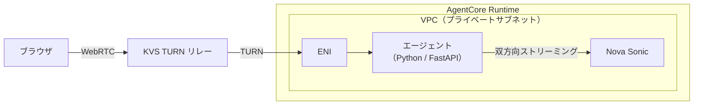

## はじめに

2026年3月20日、Amazon Bedrock AgentCore Runtime に [WebRTC サポートが追加された](https://aws.amazon.com/about-aws/whats-new/2026/03/amazon-bedrock-webrtc/)。従来の WebSocket に加え、UDP ベースの低レイテンシなリアルタイム音声ストリーミングが可能になる。

本記事では、[公式サンプル](https://github.com/awslabs/amazon-bedrock-agentcore-samples/tree/main/01-tutorials/01-AgentCore-runtime/06-bi-directional-streaming-webrtc)をベースに WebRTC 音声エージェントをローカルと AgentCore Runtime の両方で動作させ、得られた知見を共有する。特に、**AgentCore Runtime 環境では TURN only 設定を有効にしないと音声が通らないケースがある**という検証結果は、ドキュメントだけでは気づきにくい重要なポイントだ。

## WebRTC と WebSocket の違い

AgentCore Runtime は2つの双方向ストリーミングプロトコルをサポートしている。

| 項目 | WebSocket | WebRTC |
| --- | --- | --- |
| トランスポート | TCP | UDP（TURN 経由） |
| 最適なユースケース | テキスト＋音声ストリーミング | リアルタイム音声・映像 |
| レイテンシ | 低い | より低い |
| NAT 越え | 不要 | TURN サーバーが必要 |
| ブラウザ対応 | `WebSocket` API | `RTCPeerConnection` API |

音声エージェントのようにレイテンシが重要なユースケースでは、WebRTC の UDP ベースのトランスポートが有利だ。

## アーキテクチャ



- **ブラウザクライアント** — マイク音声をキャプチャし、WebRTC で送信。エージェントの応答音声を再生
- **KVS TURN リレー** — Amazon Kinesis Video Streams のマネージド TURN サーバー。NAT 越えのメディアリレーを提供
- **AgentCore Runtime** — VPC 内のプライベートサブネットでエージェントをホスト
- **エージェント** — WebRTC シグナリングと Nova Sonic への音声ブリッジを担当する FastAPI サーバー
- **Nova Sonic** — Amazon の Speech-to-Speech モデル（`amazon.nova-2-sonic-v1:0`）

VPC が必要な理由は、AgentCore Runtime の PUBLIC ネットワークモードがアウトバウンド UDP をサポートしていないためだ。KVS TURN サーバーへの接続には UDP が必要なので、NAT Gateway 経由でインターネットに出られるプライベートサブネットが必須となる。詳細は [公式チュートリアル](https://docs.aws.amazon.com/bedrock-agentcore/latest/devguide/runtime-webrtc-get-started-kvs.html)を参照。

## 前提条件

- Python 3.12+（`aws-sdk-bedrock-runtime` の要件）
- AWS CLI 設定済み
- Nova Sonic モデルへのアクセス権限（`bedrock:InvokeModelWithBidirectionalStream`）

## ローカル環境での検証

まずローカルで動作確認する。公式サンプルは以下の構成だ。

```text title="プロジェクト構成"
agent/
  bot.py              - FastAPI サーバー、WebRTC シグナリング
  kvs.py              - KVS シグナリングチャネルと TURN 資格情報
  audio.py            - 音声リサンプリングと WebRTC 出力トラック
  nova_sonic.py       - Nova Sonic 双方向ストリーミングセッション
  requirements.txt
  Dockerfile
server/
  index.html          - ブラウザクライアント
  server.py           - 静的ファイルサーバー
```

### セットアップ

```bash title="ターミナル（エージェント起動）"
git clone https://github.com/awslabs/amazon-bedrock-agentcore-samples.git
cd amazon-bedrock-agentcore-samples/01-tutorials/01-AgentCore-runtime/06-bi-directional-streaming-webrtc

cd agent
python3.12 -m venv venv && source venv/bin/activate
pip install -r requirements.txt
export AWS_REGION=us-west-2
export KVS_CHANNEL_NAME=voice-agent-minimal
python bot.py --host 0.0.0.0 --port 8080
```

別のターミナルでブラウザクライアントを起動する。依存パッケージはエージェント側と共通なので、同じ venv を使うのが簡単だ。

```bash title="ターミナル（ブラウザクライアント起動）"
cd server
source ../agent/venv/bin/activate
python server.py  # http://localhost:7860
```

エージェント起動時に KVS シグナリングチャネルが自動作成される。

```text title="出力結果"
Signaling channel: arn:aws:kinesisvideo:us-west-2:123456789012:channel/voice-agent-minimal/...
Uvicorn running on http://0.0.0.0:8080
```

### 動作確認

ブラウザで `http://localhost:7860` を開き、Agent Runtime ARN 欄を空のまま「Connect」をクリックする。ローカルエージェント（`localhost:8080`）に直接接続される。マイクに話しかけると Nova Sonic が音声で応答する。

なお、Codespaces のようなリモート開発環境ではポートフォワーディングが HTTP/WebSocket のみを中継するため、WebRTC のメディアトラフィック（UDP）が通らずローカル検証が機能しない。ローカル検証はブラウザとエージェントが同一マシン上にある環境で行う必要がある。

### 仕組みの解説

動作を確認できたところで、内部の仕組みを整理する。

WebRTC 接続の確立は `/invocations` エンドポイントへの複数回のリクエストで行われる。AgentCore Runtime は単一のエンドポイントしか公開しないため、`action` パラメータで処理を振り分ける設計だ。

```text title="シグナリングフロー"
1. ice_config    → KVS TURN/STUN サーバーの資格情報を取得
2. offer         → ブラウザの SDP Offer を送信、エージェントが Answer を返す
3. ice_candidate → ICE 候補を交換（Trickle ICE）
4. 接続確立      → 音声の双方向ストリーミング開始
```

音声フォーマットの変換もエージェントが担当する。ブラウザの WebRTC は通常 48kHz だが、Nova Sonic は入力 16kHz / 出力 24kHz の PCM を扱う。`audio.py` の `convert_to_16khz()` が入力のリサンプリングを、`OutputTrack` クラスが出力の 20ms フレーム分割を担当する。

| パラメータ | 値 |
| --- | --- |
| 入力サンプルレート | 16kHz（ブラウザ 48kHz → リサンプリング） |
| 出力サンプルレート | 24kHz |
| フォーマット | 16-bit PCM モノラル |
| フレームサイズ | 20ms（480 サンプル） |

## AgentCore Runtime へのデプロイ

ローカルで動作確認できたので、次は AgentCore Runtime にデプロイする。

### 1. VPC の構築

NAT Gateway 付きの VPC を作成する。

```bash title="ターミナル（VPC 構築）"
# VPC 作成
VPC_ID=$(aws ec2 create-vpc --cidr-block 10.0.0.0/16 --region us-west-2 \
  --tag-specifications 'ResourceType=vpc,Tags=[{Key=Name,Value=webrtc-bot-example}]' \
  --query 'Vpc.VpcId' --output text)
aws ec2 modify-vpc-attribute --vpc-id $VPC_ID --enable-dns-hostnames '{"Value": true}' --region us-west-2

# Internet Gateway
IGW=$(aws ec2 create-internet-gateway --region us-west-2 --query 'InternetGateway.InternetGatewayId' --output text)
aws ec2 attach-internet-gateway --internet-gateway-id $IGW --vpc-id $VPC_ID --region us-west-2

# パブリックサブネット + プライベートサブネット
PUBLIC_SUBNET=$(aws ec2 create-subnet --vpc-id $VPC_ID --cidr-block 10.0.1.0/24 \
  --availability-zone us-west-2a --region us-west-2 --query 'Subnet.SubnetId' --output text)
PRIVATE_SUBNET=$(aws ec2 create-subnet --vpc-id $VPC_ID --cidr-block 10.0.2.0/24 \
  --availability-zone us-west-2a --region us-west-2 --query 'Subnet.SubnetId' --output text)

# NAT Gateway（作成完了まで数分かかる）
EIP_ALLOC=$(aws ec2 allocate-address --domain vpc --region us-west-2 --query 'AllocationId' --output text)
NAT_GW=$(aws ec2 create-nat-gateway --subnet-id $PUBLIC_SUBNET --allocation-id $EIP_ALLOC \
  --region us-west-2 --query 'NatGateway.NatGatewayId' --output text)
aws ec2 wait nat-gateway-available --nat-gateway-ids $NAT_GW --region us-west-2
```

<details className="my-4 rounded-lg border border-border bg-muted/30 p-4">
<summary className="cursor-pointer font-medium">ルートテーブルの設定</summary>

```bash title="ターミナル"
# パブリックサブネット → IGW
PUBLIC_RT=$(aws ec2 create-route-table --vpc-id $VPC_ID --region us-west-2 --query 'RouteTable.RouteTableId' --output text)
aws ec2 create-route --route-table-id $PUBLIC_RT --destination-cidr-block 0.0.0.0/0 --gateway-id $IGW --region us-west-2
aws ec2 associate-route-table --route-table-id $PUBLIC_RT --subnet-id $PUBLIC_SUBNET --region us-west-2

# プライベートサブネット → NAT Gateway
PRIVATE_RT=$(aws ec2 create-route-table --vpc-id $VPC_ID --region us-west-2 --query 'RouteTable.RouteTableId' --output text)
aws ec2 create-route --route-table-id $PRIVATE_RT --destination-cidr-block 0.0.0.0/0 --nat-gateway-id $NAT_GW --region us-west-2
aws ec2 associate-route-table --route-table-id $PRIVATE_RT --subnet-id $PRIVATE_SUBNET --region us-west-2

# セキュリティグループ ID を取得
SG_ID=$(aws ec2 describe-security-groups --filters "Name=vpc-id,Values=$VPC_ID" "Name=group-name,Values=default" \
  --region us-west-2 --query 'SecurityGroups[0].GroupId' --output text)
```

</details>

### 2. デプロイ

`agent/` ディレクトリで AgentCore の設定とデプロイを行う。

```bash title="ターミナル"
cd agent
pip install bedrock-agentcore-starter-toolkit

agentcore configure \
  -e bot.py \
  --deployment-type container \
  --disable-memory \
  --vpc \
  --subnets $PRIVATE_SUBNET \
  --security-groups $SG_ID \
  --region us-west-2 \
  --non-interactive

# デプロイ（CodeBuild で ARM64 コンテナをビルド、数分かかる）
agentcore deploy --env KVS_CHANNEL_NAME=voice-agent-minimal --env AWS_REGION=us-west-2
```

デプロイが完了すると Agent ARN とロール名が出力される。ローカルに Docker がなくても、CodeBuild が ARM64 コンテナのビルドを自動で行う。

```text title="出力結果"
Agent ARN: arn:aws:bedrock-agentcore:us-west-2:123456789012:runtime/bot-XXXXXXXXXX
Execution role: AmazonBedrockAgentCoreSDKRuntime-us-west-2-XXXXXXXXXX
```

### 3. IAM ポリシーのアタッチ

自動作成された実行ロールに KVS と Bedrock の権限を追加する。サンプルリポジトリのプロジェクトルート（`agent/` の一つ上）に IAM ポリシーファイルが含まれている。

```bash title="ターミナル"
ROLE_NAME="AmazonBedrockAgentCoreSDKRuntime-us-west-2-XXXXXXXXXX"  # デプロイ出力から取得

cd ..  # プロジェクトルートに移動（kvs-iam-policy.json がある場所）

# kvs-iam-policy.json の ACCOUNT_ID を自分のアカウント ID に置換
sed -i "s/ACCOUNT_ID/$(aws sts get-caller-identity --query Account --output text)/" kvs-iam-policy.json
```

`bedrock-iam-policy.json` は注意が必要だ。Foundation Model の ARN にはアカウント ID が含まれないため、サンプルの `ACCOUNT_ID` プレースホルダーをそのまま置換してはいけない。

```bash title="ターミナル"
# bedrock-iam-policy.json を修正（アカウント ID 部分を空にする）
cat > bedrock-iam-policy.json << 'EOF'
{
    "Version": "2012-10-17",
    "Statement": [
        {
            "Effect": "Allow",
            "Action": "bedrock:InvokeModelWithBidirectionalStream",
            "Resource": "arn:aws:bedrock:us-west-2::foundation-model/amazon.nova-2-sonic-v1:0"
        }
    ]
}
EOF

# ポリシーをアタッチ
aws iam put-role-policy --role-name $ROLE_NAME --policy-name kvs-access \
  --policy-document file://kvs-iam-policy.json
aws iam put-role-policy --role-name $ROLE_NAME --policy-name bedrock-nova-sonic \
  --policy-document file://bedrock-iam-policy.json
```

### 4. 接続テスト

エンドポイントが準備完了になるまで待つ（数分かかる）。

```bash title="ターミナル"
cd agent
agentcore status
# Endpoint: DEFAULT (READY) と表示されるまで待つ
```

ブラウザクライアントを起動する。

```bash title="ターミナル（ブラウザクライアント起動）"
cd ../server
source ../agent/venv/bin/activate
python server.py  # http://localhost:7860
```

ブラウザで `http://localhost:7860` を開き、以下を設定する。

1. 「Agent Runtime ARN」欄にデプロイ出力の ARN を入力
2. AWS 認証情報（Access Key ID / Secret Access Key / Session Token）を入力
3. **「Force TURN only」チェックボックスを有効にする**（推奨。後述の検証結果で詳しく説明する）
4. 「Connect」をクリック
5. マイクへのアクセスを許可して話しかける

ステップ3の TURN only 設定が重要だ。次のセクションでその理由を説明する。

## 検証結果と知見

### TURN only の設定を推奨

今回の検証で最も重要な発見がこれだ。

| 設定 | ICE 接続 | 音声応答 |
| --- | --- | --- |
| デフォルト（STUN + TURN） | `connected` ✓ | なし ✗ |
| Force TURN only | `connected` ✓ | あり ✓ |

デフォルト設定では WebRTC 接続自体は確立される（ICE state: `completed`）が、Nova Sonic が音声を受信できなかった。CloudWatch ログには以下のエラーが記録されていた。

```text title="CloudWatch ログ（デフォルト設定時）"
Receive error: InternalErrorCode=531::Timed out waiting for audio bytes
or interactive content. Please ensure gaps between audio bytes and
interactive content are less than 295 seconds.
```

一方、TURN only 設定時は正常に動作する。

```text title="CloudWatch ログ（TURN only 設定時）"
User: nice to meet you, i am gina hart.
Nova Sonic: Nice to meet you, Gina Hart! I'm here to chat and assist
with any questions or topics you'd like to discuss.
```

原因を考察する。デフォルト設定ではブラウザが STUN で取得した直接接続候補（`srflx`）を優先するが、AgentCore Runtime のエージェントは VPC 内のプライベートサブネットにいるため、直接接続では音声データが到達しない。ICE の接続ネゴシエーション自体は成功するが、実際のメディアパスが機能しないという状態だ。エージェント側のログにも `STUN transaction failed (403 - Forbidden IP)` が記録されていた。

厳密には、ICE 候補の優先順位はブラウザやネットワーク環境に依存するため、すべての環境で同じ挙動になるとは限らない。しかし、AgentCore Runtime のエージェントがプライベートサブネットにいる以上、ブラウザからの直接接続は原理的に到達できない。TURN リレーを経由するしかないため、`iceTransportPolicy: 'relay'` を明示的に設定して TURN 経由の接続のみを許可するのが確実だ。サンプルの「Force TURN only」チェックボックスがこれに該当する。

なお、ブラウザとエージェントが同一マシン上にある場合は直接接続（`host` 候補）で通信できるため、この問題は発生しにくい。

### Barge-in（割り込み）

Nova Sonic は Barge-in をサポートしている。エージェントが応答中にユーザーが話し始めると、応答が中断される。`nova_sonic.py` の `receive_responses` 内で `stopReason: INTERRUPTED` を検出し、`audio_out.clear()` でバッファをクリアする設計だ。

### 切断時のエラー

ブラウザで Disconnect すると、エージェント側で以下のエラーが発生する。

```text title="CloudWatch ログ"
Audio send error:
concurrent.futures._base.InvalidStateError: CANCELLED
Unclosed client session
```

WebRTC 接続が閉じられた後も Nova Sonic ストリームへの送信が試みられるためだ。サンプルコードでは `finally` ブロックで `stream.close()` を呼んでいるが、タイミングによっては `recv_task` のキャンセルが間に合わない。本番環境では、接続状態の監視とグレースフルシャットダウンの実装が必要だろう。

### 対応リージョン

WebRTC サポートは14リージョンで利用可能だ。

us-east-1, us-east-2, us-west-2, ap-south-1, ca-central-1, ap-northeast-2, ap-southeast-1, ap-southeast-2, ap-northeast-1, eu-central-1, eu-west-1, eu-west-2, eu-west-3, eu-north-1

## まとめ

- **TURN only 設定を推奨** — デフォルトの STUN + TURN ではブラウザが到達不可能な直接接続候補を優先し、メディアパスが機能しないケースがある。`iceTransportPolicy: 'relay'` を明示的に設定するのが確実だ。
- **VPC + NAT Gateway が WebRTC の前提条件** — PUBLIC ネットワークモードはアウトバウンド UDP をサポートしないため、KVS TURN サーバーへの接続にはプライベートサブネット + NAT Gateway が必要だ。
- **CodeBuild による ARM64 ビルドでローカル Docker 不要** — `agentcore deploy` はデフォルトで CodeBuild を使い、ARM64 コンテナのビルドからデプロイまでを自動化する。
- **Foundation Model の ARN にアカウント ID は不要** — Bedrock の IAM ポリシーで Foundation Model を指定する際、リソース ARN のアカウント ID 部分は空（`::`）にする。サンプルの `ACCOUNT_ID` プレースホルダーをそのまま置換するとポリシーが機能しない。

## クリーンアップ

検証が終わったら課金を避けるためにリソースを削除する。AgentCore のデプロイと KVS シグナリングチャネルを先に削除し、その後 VPC 関連リソースを削除する。

```bash title="ターミナル"
# AgentCore デプロイの削除
cd agent && agentcore destroy

# KVS シグナリングチャネルの削除
aws kinesisvideo delete-signaling-channel \
  --channel-arn arn:aws:kinesisvideo:us-west-2:ACCOUNT_ID:channel/voice-agent-minimal/... \
  --region us-west-2
```

<details className="my-4 rounded-lg border border-border bg-muted/30 p-4">
<summary className="cursor-pointer font-medium">VPC リソースの削除</summary>

NAT Gateway → EIP → サブネット → IGW → ルートテーブル → VPC の順に削除する。

```bash title="ターミナル"
aws ec2 delete-nat-gateway --nat-gateway-id $NAT_GW --region us-west-2
# NAT Gateway の削除完了を待つ（数分かかる）
aws ec2 wait nat-gateway-deleted --nat-gateway-ids $NAT_GW --region us-west-2 2>/dev/null || sleep 60

aws ec2 release-address --allocation-id $EIP_ALLOC --region us-west-2
aws ec2 disassociate-route-table --association-id $(aws ec2 describe-route-tables --route-table-ids $PUBLIC_RT --region us-west-2 --query 'RouteTables[0].Associations[?!Main].RouteTableAssociationId' --output text) --region us-west-2
aws ec2 disassociate-route-table --association-id $(aws ec2 describe-route-tables --route-table-ids $PRIVATE_RT --region us-west-2 --query 'RouteTables[0].Associations[?!Main].RouteTableAssociationId' --output text) --region us-west-2
aws ec2 delete-route-table --route-table-id $PUBLIC_RT --region us-west-2
aws ec2 delete-route-table --route-table-id $PRIVATE_RT --region us-west-2
aws ec2 delete-subnet --subnet-id $PUBLIC_SUBNET --region us-west-2
aws ec2 delete-subnet --subnet-id $PRIVATE_SUBNET --region us-west-2
aws ec2 detach-internet-gateway --internet-gateway-id $IGW --vpc-id $VPC_ID --region us-west-2
aws ec2 delete-internet-gateway --internet-gateway-id $IGW --region us-west-2
aws ec2 delete-vpc --vpc-id $VPC_ID --region us-west-2
```

</details>
