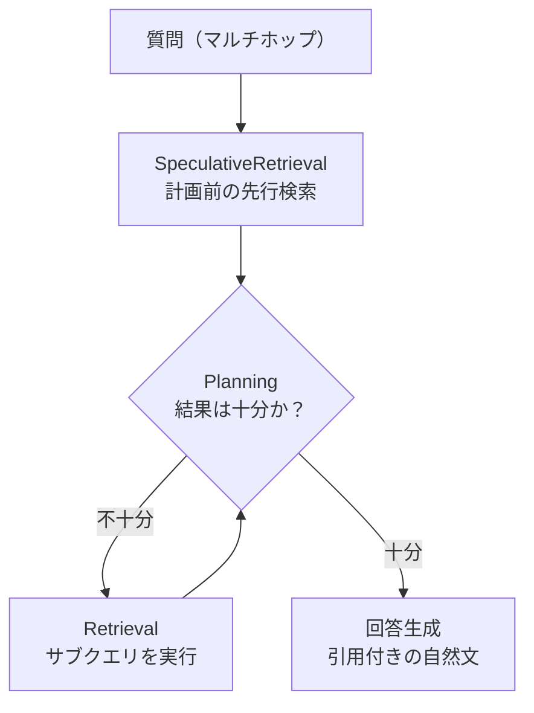

## はじめに

2026年6月17日、AWS は [Amazon Bedrock Managed Knowledge Base の一般提供](https://aws.amazon.com/about-aws/whats-new/2026/06/amazon-bedrock-managed-knowledge-base/) を発表した。ベクトルデータベースも取り込みパイプラインも検索インフラも一切管理せずに、本番品質の RAG をフルマネージドで構築できるサービスである。

従来の Customer-managed Knowledge Base が OpenSearch Serverless などのベクトルストアを自分で用意・運用する必要があったのに対し、Managed KB は埋め込み・リランク・基盤モデルをサービス側が既定で管理する。目玉は3つ——6種のネイティブコネクタ（S3・SharePoint・Confluence・Web Crawler・Google Drive・OneDrive）、Smart Parsing、そして最大の差別化要素である **Agentic Retriever（`AgenticRetrieveStream` API）** だ。ドキュメントによれば、エージェント検索は1つの複合質問をサブクエリへ分解し、反復検索しながら十分性を評価して回答を合成する（実際の挙動は検証2で確かめる）。

**本記事は、東京リージョン（ap-northeast-1）でベクトル DB を一切プロビジョニングせずに Managed KB を構築し、同一のマルチホップ質問を単発 `Retrieve` とエージェント検索の両方で実測した結果を共有する。** 先に結論を述べると、多ホップ精度を決めた最大のレバーはサブクエリ分解そのものではなく、**マネージドリランカーを使うか否か**だった。公式ドキュメントは [Build a managed knowledge base](https://docs.aws.amazon.com/bedrock/latest/userguide/kb-build-managed.html) と [Use agentic retrieval to query a knowledge base](https://docs.aws.amazon.com/bedrock/latest/userguide/kb-test-agentic-retrieve.html) を参照。

## 検証環境

| 項目 | 値 |
| --- | --- |
| リージョン | ap-northeast-1（東京） |
| KB タイプ | MANAGED（マネージド埋め込み・既定） |
| データソース | Amazon S3 コネクタ + Smart Parsing |
| SDK | **boto3 1.43.33** |
| コーパス | 日本語プレーンテキスト3文書 |

ここで最初の落とし穴がある。検証環境にプリインストールされていた AWS CLI 2.34.30 / boto3 1.42.80 では、`CreateKnowledgeBase` の `type` enum に `MANAGED` が存在せず（`VECTOR / KENDRA / SQL` のみ）、`bedrock-agent-runtime` にも `AgenticRetrieveStream` が無かった。GA 直後の新 API なので、**SDK を 1.43.x 系へ更新するのが事実上の前提条件**になる。本記事は boto3 1.43.33 を venv に入れて検証した。

コーパスは、マルチホップを誘発するよう正解を設計時に既知にした合成3文書である。

- `01-org.txt`（組織図）: ML プラットフォームチームの責任者は **田中花子**
- `02-budget.txt`（予算）: ML プラットフォームチームの年間予算は **1,200万円**
- `03-policy.txt`（経費規程）: 年間契約の前払いは**責任者の承認**が必要、上限は**予算の50%**

質問「ML プラットフォームの予算を年間前払いする場合、誰の承認が必要で上限は何円か」は、3文書を横断して初めて「田中花子の承認・上限600万円」と確定する。結果だけ知りたい場合は[検証2](#検証2-単発retrieve-vs-エージェント検索)へスキップできる。

<details className="my-4 rounded-lg border border-border bg-muted/30 p-4">
<summary className="cursor-pointer font-medium">コーパスの3文書（全文・コピーして再現可能）</summary>

`corpus/` ディレクトリに以下の3ファイルを置く。マルチホップを誘発するため、承認者・金額・規程をあえて別ファイルに分散させている。

```text title="corpus/01-org.txt"
社内組織ハンドブック（2026年度版）

# 技術部門のチーム編成

## ML プラットフォームチーム
ML プラットフォームチームは、社内の機械学習基盤の構築と運用を担当する。
ML プラットフォームチームの責任者は田中花子（たなか はなこ）である。
田中は予算承認および契約に関する最終決裁権を持つ。

## データ基盤チーム
データ基盤チームの責任者は鈴木一郎（すずき いちろう）である。

各チームの責任者は、自チームの予算の範囲内で契約・支払い方法を承認する権限を持つ。
```

```text title="corpus/02-budget.txt"
2026年度 クラウドインフラ予算計画書

# チーム別 年間予算

| チーム | 2026年度 クラウドインフラ予算（年額） |
| --- | --- |
| ML プラットフォームチーム | 1,200万円 |
| データ基盤チーム | 800万円 |

ML プラットフォームチームの予算1,200万円には、GPU 学習クラスタの利用料および
推論エンドポイントの運用費が含まれる。
```

```text title="corpus/03-policy.txt"
経費規程（支払い・前払いに関する規定）

# 第3章 年間契約の前払い

## 第12条（前払いの承認）
クラウドサービス等の年間契約を前払い（一括前払い）で行う場合は、
当該費用を負担するチームの責任者の承認を得なければならない。

## 第13条（前払いの上限）
年間契約の前払いに充てることができる金額は、当該チームに割り当てられた
年間予算の50%を上限とする。
```

</details>

<details className="my-4 rounded-lg border border-border bg-muted/30 p-4">
<summary className="cursor-pointer font-medium">環境構築の全手順（変数・venv・S3・IAM・KB・取り込み：ゼロから再現）</summary>

```bash title="Terminal (変数とvenv)"
REGION=ap-northeast-1
ACCOUNT=$(aws sts get-caller-identity --query Account --output text)
BUCKET=bedrock-mkb-verify-$ACCOUNT
ROLE=bedrock-mkb-verify-role

# GA 直後の API は 1.43.x 以降が必要（システムの 1.42.x は MANAGED 型 / AgenticRetrieveStream 未対応）
python3 -m venv kbverify-venv && . kbverify-venv/bin/activate
pip install -q boto3==1.43.33
```

```bash title="Terminal (S3)"
aws s3api create-bucket --bucket $BUCKET \
  --create-bucket-configuration LocationConstraint=$REGION --region $REGION
aws s3 sync ./corpus/ s3://$BUCKET/corpus/
```

サービスロールは Bedrock が assume できるよう信頼ポリシーを設定し、対象バケットの読み取り権限を付与する（`aws:SourceAccount` / `aws:SourceArn` で KB に絞り込む）。

```bash title="Terminal (IAM)"
cat > trust.json <<JSON
{ "Version":"2012-10-17","Statement":[{"Effect":"Allow",
  "Principal":{"Service":"bedrock.amazonaws.com"},"Action":"sts:AssumeRole",
  "Condition":{"StringEquals":{"aws:SourceAccount":"$ACCOUNT"},
    "ArnLike":{"aws:SourceArn":"arn:aws:bedrock:$REGION:$ACCOUNT:knowledge-base/*"}}}]}
JSON
cat > perms.json <<JSON
{ "Version":"2012-10-17","Statement":[
  {"Effect":"Allow","Action":["s3:ListBucket"],"Resource":["arn:aws:s3:::$BUCKET"]},
  {"Effect":"Allow","Action":["s3:GetObject"],"Resource":["arn:aws:s3:::$BUCKET/*"]},
  {"Effect":"Allow","Action":["bedrock:ListFoundationModels","bedrock:InvokeModel"],"Resource":"*"}]}
JSON
aws iam create-role --role-name $ROLE --assume-role-policy-document file://trust.json
aws iam put-role-policy --role-name $ROLE --policy-name mkb-verify-perms \
  --policy-document file://perms.json
```

上記は KB サービスロールの権限。加えて、`AgenticRetrieveStream` を呼び出す側の IAM プリンシパルには `bedrock:AgenticRetrieveStream` / `bedrock:Retrieve` / `bedrock:InvokeModelWithResponseStream` が必要になる（本検証は管理者権限で実行した）。

KB・データソース作成・取り込みは boto3 で行い、`ACTIVE` / `COMPLETE` までポーリングする。

```python title="Python (setup.py)"
import boto3, time
REGION = "ap-northeast-1"
ACCOUNT = boto3.client("sts").get_caller_identity()["Account"]
BUCKET = f"bedrock-mkb-verify-{ACCOUNT}"
ROLE_ARN = f"arn:aws:iam::{ACCOUNT}:role/bedrock-mkb-verify-role"
ba = boto3.client("bedrock-agent", REGION)

kb = ba.create_knowledge_base(
    name="mkb-verify-tokyo", roleArn=ROLE_ARN,
    knowledgeBaseConfiguration={
        "type": "MANAGED",
        "managedKnowledgeBaseConfiguration": {"embeddingModelType": "MANAGED"},
    },
)
kb_id = kb["knowledgeBase"]["knowledgeBaseId"]
while ba.get_knowledge_base(knowledgeBaseId=kb_id)["knowledgeBase"]["status"] != "ACTIVE":
    time.sleep(5)

ds = ba.create_data_source(
    name="s3-corpus", knowledgeBaseId=kb_id, dataDeletionPolicy="DELETE",
    dataSourceConfiguration={
        "type": "MANAGED_KNOWLEDGE_BASE_CONNECTOR",
        "managedKnowledgeBaseConnectorConfiguration": {
            "connectorParameters": {
                "type": "S3", "version": "1",
                "connectionConfiguration": {"bucketName": BUCKET, "bucketOwnerAccountId": ACCOUNT},
                "deletionProtectionConfiguration": {"enableDeletionProtection": False},
            }
        },
    },
    vectorIngestionConfiguration={"parsingConfiguration": {"parsingStrategy": "SMART_PARSING"}},
)
ds_id = ds["dataSource"]["dataSourceId"]

job = ba.start_ingestion_job(knowledgeBaseId=kb_id, dataSourceId=ds_id)["ingestionJob"]["ingestionJobId"]
while True:
    j = ba.get_ingestion_job(knowledgeBaseId=kb_id, dataSourceId=ds_id, ingestionJobId=job)["ingestionJob"]
    if j["status"] in ("COMPLETE", "FAILED"):
        print(j["status"], j.get("statistics"))
        break
    time.sleep(5)
print("KB_ID =", kb_id, " DS_ID =", ds_id)
```

</details>

## 検証1: ゼロインフラでのKB構築と取り込み

KB の作成からデータ取り込みまでを通して計測した。

| ステップ | 所要時間 | 結果 |
| --- | --- | --- |
| KB 作成（CREATING → ACTIVE） | **64.4 秒** | — |
| データソース作成 + 取り込み（3文書） | **160.0 秒** | 3 scanned / 3 indexed / 0 failed |

注目すべきは、**ベクトルストアのプロビジョニング操作が一切無かった**点だ。Customer-managed KB なら OpenSearch Serverless コレクションの作成・インデックス定義・スケーリング設定が必要だが、Managed KB は `type: MANAGED` を指定するだけ。埋め込みモデルの選定すら不要（マネージド既定）で、実際に発行したのは「KB 作成 → データソース作成 → 取り込みジョブ開始」の3 API のみ。ベクトル DB は最後まで一度も意識しなかった。「ゼロインフラ」は誇張ではない。

なお今回のコーパスはプレーンテキストのため、Smart Parsing の真価である多モーダル解析（PDF・画像・音声・動画）の検証範囲外とした。本記事の主眼は、取り込み後の**検索挙動**にある。

## 検証2: 単発Retrieve vs エージェント検索

取り込んだ同一 KB に、同じマルチホップ質問——「**ML プラットフォームの予算を年間前払いする場合、誰の承認が必要で上限は何円か**」——を2方式で投げる。この問いは承認者（組織図）・予算額（予算表）・上限ルール（規程）の3文書を横断しないと答えられない。まず単発 `Retrieve` を、マネージドリランカーの有無で比較した。

```python title="Python"
ar = boto3.client("bedrock-agent-runtime", "ap-northeast-1")
r = ar.retrieve(
    knowledgeBaseId=kb_id,
    retrievalQuery={"text": QUERY},
    retrievalConfiguration={"managedSearchConfiguration": {
        "numberOfResults": 10, "rerankingModelType": "NONE",  # or "MANAGED"
    }},
)
```

結果は対照的だった。`rerankingModelType=NONE` では3文書6チャンクすべてが返るのに対し、`MANAGED` では**最上位1チャンク（経費規程のみ）に絞り込まれた**。

```text title="Output"
rerank=NONE   : 6 chunks  → 01-org.txt, 02-budget.txt, 03-policy.txt
rerank=MANAGED: 1 chunk   → 03-policy.txt のみ
```

観測できた事実は明快だ——`numberOfResults=10` を指定しても MANAGED は1チャンク、NONE は6チャンクを返した。ここから先は推測だが、マネージドリランカーは関連度上位のごく少数だけを残す精度重視の設計と思われ、単一事実のピンポイント検索には向く一方、多ホップ質問では承認者（組織図）や金額（予算）の**支援文書を落としてしまう**。確実に言えるのは、`Retrieve` はチャンクを返すだけで回答を合成しないため、リランカー ON のままでは多ホップに答える術がないという点だ。

次にエージェント検索。`AgenticRetrieveStream` はイベントストリームを返し、トレースで内部の各ステップを観測できる。`maxAgentIteration` は探索余地を確保するため 5 に設定した（小さすぎると反復が早期に打ち切られ、複雑な質問で精度が落ちうる）。

```python title="Python"
resp = ar.agentic_retrieve_stream(
    messages=[{"role": "user", "content": {"text": QUERY}}],
    retrievers=[{"configuration": {"knowledgeBase": {"knowledgeBaseId": kb_id}}}],
    agenticRetrieveConfiguration={
        "foundationModelType": "MANAGED",
        "rerankingModelType": "NONE",   # 検証で切り替え
        "maxAgentIteration": 5,
    },
    generateResponse=True,
)
for ev in resp["stream"]:
    if "traceEvent" in ev:
        a = ev["traceEvent"]["attributes"]
        print(a["step"], a["status"], a["message"])
    elif "responseEvent" in ev:
        print(ev["responseEvent"]["text"], end="")  # 回答が逐次ストリーム
```

トレースのメッセージは英語で返る。rerank=NONE のときは先行検索とプランニングだけで完結した。

```text title="Output (rerank=NONE)"
SpeculativeRetrieval IN_PROGRESS  Starting speculative retrieval for query: ML プラットフォーム...
SpeculativeRetrieval SUCCEEDED    Speculative retrieval completed successfully
Planning             IN_PROGRESS  Agent planning started
Planning             SUCCEEDED    Agent planning completed
```

トレースは `SpeculativeRetrieval`（計画前に走る先行検索）→ `Planning`（質問の分解と十分性評価）→ 必要なら `Retrieval`（サブクエリ実行）→ 回答生成、という順で流れる。



`rerankingModelType` を切り替えると挙動がはっきり変わった。

- **rerank=NONE**: トレースは `Planning=2 / Retrieval=0`、最終結果は3文書すべて。回答は**承認者「田中花子」・予算「1,200万円」・上限「600万円（1,200万×50%）」を完全に正解**した（ここまで事実）。先行検索だけで3文書が揃ったため追加の `Retrieval` が不要だった、と読める（解釈）。
- **rerank=MANAGED**: トレースは `Planning=4 / Retrieval=2`、最終結果は2文書（予算・規程）。回答は金額を復元したが、**承認者名は取りこぼした**（ここまで事実）。組織図が最終結果に含まれなかったのが直接の原因で、リランカーが組織図を絞り落とし続けたためと推測される（解釈）。

エージェント検索の価値は「チャンクではなく引用付きの自然文回答を合成する」点と、「先行検索で足りなければ自分で追加検索する適応性」にある。ただしそれでも、リランカーが文脈を絞りすぎると完全には挽回できない。

<details className="my-4 rounded-lg border border-border bg-muted/30 p-4">
<summary className="cursor-pointer font-medium">計測スクリプト全文（Retrieve と AgenticRetrieveStream・トレース集計）</summary>

`kb_id` をセットアップ出力の値に置き換えて実行する。比較表の数値はこのスクリプトの出力から得た。

```python title="Python (measure.py)"
import boto3, time
REGION, kb_id = "ap-northeast-1", "<your-kb-id>"
ar = boto3.client("bedrock-agent-runtime", REGION)
QUERY = ("ML プラットフォームチームのクラウドインフラ予算を年間前払いする場合、"
         "誰の承認が必要で、前払いできる上限金額は具体的に何円か？")

# --- 単発 Retrieve（リランカー切替）---
for rr in ["NONE", "MANAGED"]:
    t = time.time()
    r = ar.retrieve(knowledgeBaseId=kb_id, retrievalQuery={"text": QUERY},
        retrievalConfiguration={"managedSearchConfiguration":
            {"numberOfResults": 10, "rerankingModelType": rr}})
    docs = {x["location"]["s3Location"]["uri"].split("/")[-1] for x in r["retrievalResults"]}
    print(f"Retrieve {rr}: {time.time()-t:.2f}s chunks={len(r['retrievalResults'])} docs={sorted(docs)}")

# --- AgenticRetrieveStream（リランカー切替・トレース集計）---
for rr in ["MANAGED", "NONE"]:
    t = time.time(); steps = []; ans = []; final = None
    resp = ar.agentic_retrieve_stream(
        messages=[{"role": "user", "content": {"text": QUERY}}],
        retrievers=[{"configuration": {"knowledgeBase":
            {"knowledgeBaseId": kb_id, "retrievalOverrides": {"maxNumberOfResults": 10}}}}],
        agenticRetrieveConfiguration={"foundationModelType": "MANAGED",
            "rerankingModelType": rr, "maxAgentIteration": 5}, generateResponse=True)
    for ev in resp["stream"]:
        if "traceEvent" in ev: steps.append(ev["traceEvent"]["attributes"]["step"])
        elif "responseEvent" in ev: ans.append(ev["responseEvent"]["text"])
        elif "result" in ev: final = ev["result"]
    docs = {r["metadata"].get("_document_title") for r in final["results"]} if final else set()
    print(f"Agentic {rr}: {time.time()-t:.2f}s Planning={steps.count('Planning')} "
          f"Retrieval={steps.count('Retrieval')} Speculative={steps.count('SpeculativeRetrieval')} "
          f"docs={sorted(docs)}")
    print("".join(ans))
```

</details>

## 比較: Retrieve と AgenticRetrieveStream

複数回実行しても安定した代表値を示す。

| 観点 | Retrieve(NONE) | Retrieve(MANAGED) | Agentic(MANAGED) | Agentic(NONE) |
| --- | --- | --- | --- | --- |
| レイテンシ | 約0.5s | 約0.5s | 約8.5–9.8s | 約7.5–7.9s |
| 取得文書 | 3文書 | 1文書 | 2文書 | 3文書 |
| エージェントのステップ（Planning/Retrieval） | なし | なし | Planning4 / Retrieval2 | Planning2 / Retrieval0 |
| 回答生成 | なし(チャンクのみ) | なし | あり(引用4) | あり(引用4) |
| 多ホップ正解 | 素材は揃う | 不能 | 3/4(承認者欠落) | **4/4 完全正解** |

レイテンシはエージェント検索が単発 `Retrieve` の約15倍（実測）。基盤モデルを planning・評価・生成で複数回呼ぶためだ。金額は実測していないが、Managed KB の料金はインデックス済みデータ量と取得回数の従量制であり、エージェント検索ではこれに planning・評価・生成のモデル呼び出し料金が上乗せされる構造のため、FM 呼び出し回数に応じてコストは増えると見られる。「速くて安いが回答は組み立ててくれない `Retrieve`」と「遅くて高いが引用付きで答えを合成するエージェント検索」という対比になる。

## まとめ

- **多ホップ精度の最大のレバーはリランカーの ON/OFF だった（今回の検証範囲）** — マネージドリランカーは最上位の少数に絞り込むため、文書横断の質問では支援文脈を落としやすい。本検証の多ホップ質問では `rerankingModelType=NONE` で広い文脈を保つ方が正解率が高かった（単一事実検索での得手不得手は別途検証が必要）。
- **エージェント検索は「合成」と「適応的な追加検索」が本体** — `Retrieve` はチャンクを返すだけ。エージェント検索は引用付きの回答を生成し、先行検索で不足すれば自分でサブクエリを足す。ただしリランカーが絞りすぎると挽回しきれない。
- **トレースが挙動の説明責任を与える** — `SpeculativeRetrieval → Planning → Retrieval → 生成` の流れと、どこで早期停止したかが可視化される。回答が不完全なとき「どの文書を取りこぼしたか」を後から検証できる。
- **ゼロインフラは本当だが SDK は最新化が前提** — ベクトル DB は一切不要で KB 構築は数分。一方 GA 直後の新 API は boto3 1.43.x 以降でないと呼べない。

## クリーンアップ

<details className="my-4 rounded-lg border border-border bg-muted/30 p-4">
<summary className="cursor-pointer font-medium">リソース削除コマンド（作成と逆順）</summary>

```bash title="Terminal"
# KB（データソースごと削除される）→ S3 → IAM の順
aws bedrock-agent delete-knowledge-base --knowledge-base-id "$KB_ID" --region ap-northeast-1
aws s3 rm s3://bedrock-mkb-verify-$ACCOUNT/ --recursive
aws s3api delete-bucket --bucket bedrock-mkb-verify-$ACCOUNT --region ap-northeast-1
aws iam delete-role-policy --role-name bedrock-mkb-verify-role --policy-name mkb-verify-perms
aws iam delete-role --role-name bedrock-mkb-verify-role
```

</details>
