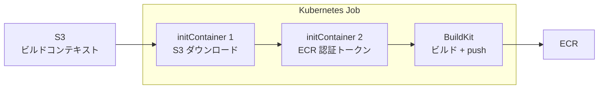

## はじめに

[本編シリーズ](/ja/blog/2026/03/23/agentic-ai-on-eks-workshop)では、EKS 上のコンテナビルドに Kaniko を採用した。Docker デーモン不要で Kubernetes Job として実行でき、Pod Identity で ECR に直接 push できる手軽さが魅力だった。

しかし Kaniko は 2025 年 6 月にアーカイブされた。Google がメンテナンスを終了し、リポジトリは読み取り専用になっている（Chainguard がフォークして維持を継続中）。後継として注目されているのが、Docker/Moby プロジェクトが開発する [BuildKit](https://github.com/moby/buildkit) だ。

本記事では、本編シリーズの Kaniko ビルドを BuildKit に置き換え、EKS Auto Mode 環境での動作を検証した結果を共有する。本編 [Part 1](/ja/blog/2026/03/23/agentic-ai-on-eks-workshop) の事前準備（リポジトリクローン、ECR、S3、Pod Identity）が完了している前提で進める。

## Kaniko と BuildKit の比較

| | Kaniko | BuildKit |
|---|---|---|
| メンテナンス状況 | アーカイブ（2025年6月） | アクティブ（Docker/Moby） |
| ビルドコンテキスト | S3 から直接取得可能 | ローカルファイルシステムのみ |
| ECR 認証 | Pod Identity で自動認証 | `docker-credential-ecr-login` またはトークン手動生成 |
| セキュリティモデル | 非特権で動作 | rootless モード（カーネル要件あり）または privileged |
| キャッシュ | レイヤーキャッシュ（限定的） | レジストリキャッシュ、インラインキャッシュ |
| マルチプラットフォーム | 非対応 | 対応 |
| シークレット管理 | 限定的 | `--secret` フラグで安全に注入可能 |

Kaniko の最大の利点は「S3 から直接ビルドコンテキストを取得し、Pod Identity で ECR に push する」という単一コンテナ完結の構成だった。BuildKit ではこれを `initContainers` で補う必要がある。

## EKS Auto Mode での rootless の壁

BuildKit の公式ドキュメントでは [rootless モード](https://crazymax.dev/buildkit/user-guides/rootless-mode/)が推奨されている。非特権ユーザーとして実行でき、`--oci-worker-no-process-sandbox` フラグと `seccompProfile: Unconfined` の組み合わせで Kubernetes Job として動作する。

しかし EKS Auto Mode で rootless Job を実行すると、以下のエラーで失敗した。

```text title="Output"
[rootlesskit:parent] /proc/sys/user/max_user_namespaces needs to be set to non-zero.
[rootlesskit:parent] error: failed to start the child: fork/exec /proc/self/exe: no space left on device
```

rootless モードは内部で [RootlessKit](https://github.com/rootless-containers/rootlesskit/) を使い、Linux の user namespaces を必要とする。BuildKit の公式ドキュメントでも、RHEL/CentOS 7 では `user.max_user_namespaces` の設定が必要と[記載されている](https://crazymax.dev/buildkit/user-guides/rootless-mode/#rhelcentos-7)。EKS Auto Mode のノードは AWS が管理する EC2 インスタンスであり、カーネルパラメータの変更はできない。`max_user_namespaces` がゼロに設定されているため、rootless モードは動作しなかった。

**解決策は privileged モードで実行すること**だ。privileged モードでは `BUILDKITD_FLAGS` を設定せず（`--oci-worker-no-process-sandbox` は rootless 専用）、`securityContext.privileged: true` を指定する。

```yaml title="YAML"
securityContext:
  privileged: true
```

Kaniko が非特権で動作するのに対し、BuildKit は EKS Auto Mode では privileged が必要になる。これはセキュリティ面でのトレードオフだ。

## 事前準備

本編の Kaniko では `build` namespace に `kaniko` ServiceAccount を作成した。BuildKit でも同様に ServiceAccount と IAM ロールを用意する。

<details className="my-4 rounded-lg border border-border bg-muted/30 p-4">
<summary className="cursor-pointer font-medium">BuildKit 用の事前準備（ServiceAccount、IAM、Pod Identity）</summary>

本編 Part 1 の Kaniko 環境構築と同じ構成だ。ServiceAccount 名を `buildkit` に変更するだけでよい。IAM ポリシーファイル（`/tmp/pod-identity-trust.json`、`/tmp/kaniko-policy.json`）は Part 1 の事前準備で作成したものを使う。セッションが切れている場合は Part 1 の手順で再作成すること。

```bash title="Terminal"
# Kubernetes リソース
kubectl create ns build
kubectl create serviceaccount buildkit -n build

# IAM ロール（ECR push + S3 read）— Kaniko と同じポリシー
aws iam create-role --role-name buildkit-pod-role \
  --assume-role-policy-document file:///tmp/pod-identity-trust.json
aws iam put-role-policy --role-name buildkit-pod-role \
  --policy-name ecr-s3 --policy-document file:///tmp/kaniko-policy.json

# Pod Identity Association
BUILDKIT_ROLE_ARN=$(aws iam get-role --role-name buildkit-pod-role \
  --query 'Role.Arn' --output text)
aws eks create-pod-identity-association \
  --cluster-name $CLUSTER_NAME --region $AWS_REGION \
  --namespace build --service-account buildkit \
  --role-arn $BUILDKIT_ROLE_ARN
```

</details>

ビルドコンテキストの S3 アップロードは本編と同じ手順だ。

```bash title="Terminal"
cd agents/weather/mcp-servers/weather-mcp-server
tar czf /tmp/weather-mcp-context.tar.gz .
aws s3 cp /tmp/weather-mcp-context.tar.gz s3://kaniko-build-${ACCOUNT_ID}/build/
```

## BuildKit Job の構成

Kaniko は S3 からビルドコンテキストを直接取得し、Pod Identity で ECR に自動認証する単一コンテナ構成だった。BuildKit ではこれを 3 段構成で実現する。



1. **initContainer 1（fetch-context）** — S3 からビルドコンテキストをダウンロードし、共有 Volume に展開
2. **initContainer 2（ecr-auth）** — `aws ecr get-login-password` で認証トークンを取得し、`config.json` を生成
3. **メインコンテナ（buildkit）** — `buildctl-daemonless.sh` でビルドし、ECR に push

### 完全な Job YAML

<details className="my-4 rounded-lg border border-border bg-muted/30 p-4">
<summary className="cursor-pointer font-medium">BuildKit Job YAML（Weather MCP Server の例）</summary>

```yaml title="buildkit-weather-mcp.yaml"
apiVersion: batch/v1
kind: Job
metadata:
  name: buildkit-weather-mcp
  namespace: build
spec:
  backoffLimit: 1
  template:
    spec:
      serviceAccountName: buildkit
      restartPolicy: Never
      initContainers:
      - name: fetch-context
        image: amazon/aws-cli:latest
        command: ["sh", "-c"]
        args:
        - |
          yum install -y tar gzip >/dev/null 2>&1
          aws s3 cp s3://${S3_BUCKET}/build/weather-mcp-context.tar.gz /workspace/context.tar.gz
          tar xzf /workspace/context.tar.gz -C /workspace
          rm /workspace/context.tar.gz
        volumeMounts:
        - name: workspace
          mountPath: /workspace
      - name: ecr-auth
        image: amazon/aws-cli:latest
        command: ["sh", "-c"]
        args:
        - |
          TOKEN=$(aws ecr get-login-password --region ${AWS_REGION})
          mkdir -p /docker-config
          AUTH=$(echo -n "AWS:${TOKEN}" | base64 -w0)
          echo "{\"auths\":{\"${ECR_HOST}\":{\"auth\":\"${AUTH}\"}}}" > /docker-config/config.json
        volumeMounts:
        - name: docker-config
          mountPath: /docker-config
      containers:
      - name: buildkit
        image: moby/buildkit:latest
        env:
        - name: DOCKER_CONFIG
          value: /home/user/.docker
        command: ["buildctl-daemonless.sh"]
        args:
        - build
        - --frontend=dockerfile.v0
        - --local=context=/workspace
        - --local=dockerfile=/workspace
        - --output=type=image,name=${ECR_HOST}/agents-on-eks/weather-mcp:latest,push=true
        securityContext:
          privileged: true
        volumeMounts:
        - name: workspace
          mountPath: /workspace
          readOnly: true
        - name: docker-config
          mountPath: /home/user/.docker
          readOnly: true
        - name: buildkitd
          mountPath: /home/user/.local/share/buildkit
      volumes:
      - name: workspace
        emptyDir: {}
      - name: docker-config
        emptyDir: {}
      - name: buildkitd
        emptyDir: {}
```

</details>

YAML を適用してビルドを開始し、完了を待つ。

```bash title="Terminal"
kubectl apply -f buildkit-weather-mcp.yaml
kubectl wait --for=condition=complete \
  job/buildkit-weather-mcp -n build --timeout=600s
```

### Kaniko との Job YAML 比較

Kaniko の Job YAML は 20 行程度で完結する。

```yaml title="Kaniko（参考）"
containers:
- name: kaniko
  image: gcr.io/kaniko-project/executor:latest
  args:
  - "--context=s3://${S3_BUCKET}/build/context.tar.gz"
  - "--destination=${ECR_HOST}/agents-on-eks/weather-mcp:latest"
```

BuildKit は initContainers を含めると 50 行以上になる。S3 取得と ECR 認証を自前で構成する必要があるためだ。ただし、この構成は柔軟性が高い。git clone でコンテキストを取得したり、`--secret` フラグでビルド時のシークレットを安全に注入したりと、Kaniko では難しかった構成が可能になる。

### 注意点

- `amazon/aws-cli` イメージには `tar` コマンドが含まれていない。`yum install -y tar gzip` が必要
- ECR 認証トークンは 12 時間で期限切れになる。長時間ビルドでは再取得が必要
- `buildkitd` Volume（`/home/user/.local/share/buildkit`）は BuildKit のキャッシュとワーカーデータ用。`emptyDir` で十分だが、PersistentVolume を使えばビルド間でキャッシュを共有できる

## 動作確認

BuildKit でビルドしたイメージを使い、本編シリーズと同じ構成（Weather MCP Server + Weather Agent）をデプロイして動作確認した。

<details className="my-4 rounded-lg border border-border bg-muted/30 p-4">
<summary className="cursor-pointer font-medium">デプロイ手順（Part 1 と同一）</summary>

```bash title="Terminal"
helm upgrade weather-mcp manifests/helm/mcp \
  --install -n mcp-servers --create-namespace \
  --set image.repository=${ECR_HOST}/agents-on-eks/weather-mcp \
  --set image.tag=latest

helm upgrade weather-agent manifests/helm/agent \
  --install -n agents --create-namespace \
  -f manifests/helm/agent/mcp-remote.yaml \
  --set image.repository=${ECR_HOST}/agents-on-eks/weather-agent \
  --set image.tag=latest \
  --set env.DISABLE_AUTH=1 \
  --set env.SESSION_STORE_BUCKET_NAME=weather-agent-session-${ACCOUNT_ID} \
  --set serviceAccount.name=weather-agent \
  --set a2a.http_url=http://weather-agent.agents:9000/

kubectl rollout status deployment weather-mcp -n mcp-servers --timeout=180s
kubectl rollout status deployment weather-agent -n agents --timeout=180s
```

</details>

curl で天気予報を取得できることを確認した。

```text title="Output"
Here's the 3-day weather forecast for New York City:

**Today**
- Temperature: 61°F
- Conditions: Mostly cloudy with a chance of rain and slight chance of thunderstorms after 5pm
- Good for outdoor activities: Not ideal

**Tuesday**
- Temperature: 46°F
- Conditions: Sunny
- Good for outdoor activities: ✅ Good!

**Wednesday**
- Temperature: 53°F
- Conditions: Mostly cloudy
- Good for outdoor activities: ✅ Good
```

BuildKit でビルドしたイメージは Kaniko でビルドしたものと同一の動作を確認できた。

## ビルド時間の比較

| コンポーネント | Kaniko | BuildKit | 差分 |
|---|---|---|---|
| Weather MCP Server | 約2分 | 58秒 | **52%短縮** |
| Weather Agent | 約3分 | 2分14秒 | **25%短縮** |
| Travel Agent | 約3分 | 2分19秒 | **23%短縮** |

BuildKit は全コンポーネントで Kaniko より高速だった。特に MCP Server（依存パッケージが少ない）では半分以下の時間で完了した。BuildKit の並行ステージ実行とレイヤーキャッシュの効率が寄与していると考えられる。

## まとめ

- **EKS Auto Mode では BuildKit rootless が動作しない** — `max_user_namespaces=0` のため user namespaces が使えず、privileged モードが必要。Kaniko が非特権で動作するのに対し、セキュリティ面でのトレードオフがある。
- **initContainers による 3 段構成** — S3 ダウンロード → ECR 認証 → ビルドの 3 段構成は Kaniko の単一コンテナより複雑だが、git clone やシークレット注入など柔軟な構成が可能。
- **ビルド時間は 25〜52% 短縮** — BuildKit の並行ステージ実行により、全コンポーネントで Kaniko より高速。レジストリキャッシュを有効にすれば、さらなる短縮が期待できる。

## クリーンアップ

本編 [Part 3 のクリーンアップ](/ja/blog/2026/03/23/agent-ui-and-scaling-on-eks#クリーンアップ)に加え、BuildKit 固有のリソースを削除する。

```bash title="Terminal"
# BuildKit 固有のリソース
kubectl delete jobs --all -n build
kubectl delete ns build

# BuildKit 用 Pod Identity Association と IAM ロール
aws iam delete-role-policy --role-name buildkit-pod-role --policy-name ecr-s3
aws iam delete-role --role-name buildkit-pod-role
```
