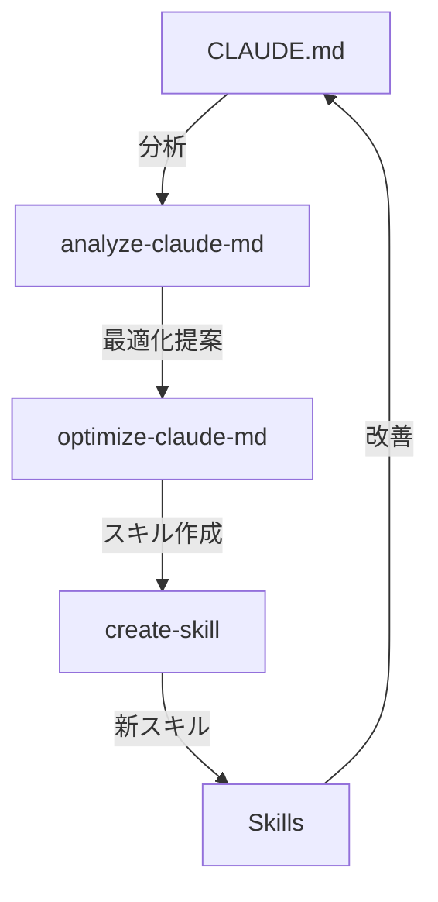

## 課題

前回、[355行のCLAUDE.mdを59行まで削減](/ja/blog/2026/03/08/optimizing-claude-code-with-skills)した話を書いた。しかし、一つ課題が残っていた。この最適化プロセスを**再現可能**にし、**継続的に改善**していくにはどうすればよいか？

前回の記事で「CLAUDE.mdの肥大化」という問題を手動で解決したが、プロジェクトが成長すれば同じ問題が再発する。新しい機能を追加するたびにCLAUDE.mdを見直し、手動でスキルを切り出す — これでは持続可能とは言えない。そこで、この最適化プロセス自体を自動化しようと考えた。答えは「**メタスキル**」— スキルを管理するためのスキルを作ることで、Claude Code自身が自己改善できる仕組みを実現した。

## メタスキルとは何か

メタスキルは、他のスキルやCLAUDE.mdを管理・最適化するためのスキルである。プログラミングでいう「メタプログラミング」のように、**一段上のレベルで動作**する。

通常のスキル（`/post-guide`、`/fix-lint` など）が「具体的な作業を実行する」のに対し、メタスキルは「スキルそのものを作ったり、最適化したりする」。コードを書くコードがメタプログラミングなら、スキルを管理するスキルがメタスキルだ。



この循環により、Claude Codeの設定は継続的に改善されていく。重要なのは、この循環が一方向ではなく**フィードバックループ**を形成していることだ。新しいスキルを作ればCLAUDE.mdがシンプルになり、シンプルになったCLAUDE.mdを分析すれば次の改善点が見つかる。

## 実装した3つのメタスキル

実装したメタスキルは3つで、それぞれ異なる役割を持つ。「分析 → 実行 → 作成」という流れで連携し、1つのパイプラインとして機能する。なお、[前回の記事](/ja/blog/2026/03/08/optimizing-claude-code-with-skills)ではスキルを「ワークフロー型」と「ガイダンス型」の2つに分けたが、ここではスキル作成時のテンプレートとして、目的に応じた4つの型を導入する。

### 1. `/analyze-claude-md` - 現状分析

最初のメタスキルは「現状を把握する」ためのものだ。現在のCLAUDE.mdを読み込み、行数、セクション構成、冗長な箇所を分析して、最適化の提案をレポートとして出力する。このスキルには `disable-model-invocation` を設定していない。読み取り専用で副作用がないため、Claudeが自発的に実行しても問題がないからだ：

```markdown title="SKILL.md (analyze-claude-md)"
---
name: analyze-claude-md
description: Analyze CLAUDE.md and suggest optimizations
---

## Analysis Steps

1. Read current CLAUDE.md
2. Metrics to check
   - Total line count (target: <50-100)
   - Section breakdown
   - Redundancy with code/docs

3. Generate optimization report
   - Recommended extractions to skills
   - Recommended deletions
   - Priority actions
```

このスキルが出力するのは「提案」であって「実行」ではない。何を変更すべきかの判断材料を提供するだけで、実際の変更は人間が確認してから次のステップで行う。この分離が安全性の鍵だ。

実行すると、以下のようなレポートが生成される：

```markdown title="Output"
## CLAUDE.md Analysis Report

### Current State

- Lines: 178
- Sections: 12
- Estimated reduction possible: 65%

### Recommended Extractions to Skills

1. **Testing & Validation** (45 lines)
   - Suggested skill: `/run-tests`
   - Reason: Detailed multi-step procedure

2. **Content Creation** (52 lines)
   - Suggested skill: `/post-guide`
   - Reason: Repeatable workflow
```

### 2. `/optimize-claude-md` - 最適化実行

2つ目のメタスキルは、分析結果に基づいて実際にファイルを変更する。CLAUDE.mdから詳細な手順を抽出し、新しいスキルとして切り出し、CLAUDE.mdを更新する。前回の記事で手動で行った作業を、このスキルが自動化してくれる：

```markdown title="SKILL.md (optimize-claude-md)"
---
name: optimize-claude-md
description: Optimize CLAUDE.md by moving detailed procedures to skills
disable-model-invocation: true
---

## Migration Process

1. Identify candidates for skills
   - Procedures with 5+ steps
   - Content taking 10+ lines
   - Tasks repeated 3+ times

2. Create skill structure
3. Extract content to skills
4. Update CLAUDE.md
```

このスキルは**副作用**（ファイル変更）があるため、`disable-model-invocation: true`を設定している。`/analyze-claude-md` との違いはここだ。分析は自動実行しても安全だが、ファイルの書き換えは人間の確認を経てから実行すべきである。

ここで定義している「5ステップ以上」「10行以上」「3回以上繰り返し」という閾値は、前回の最適化経験から導き出した経験則だ。厳密な数値ではないが、判断の起点として機能する。

### 3. `/create-skill` - スキル作成

3つ目のメタスキルは、新しいスキルを標準化されたテンプレートで作成する。スキルを手動で作ると、人によってディレクトリ構造やfrontmatterの書き方がバラバラになる。このスキルを使えば、チーム全体で一貫した構造のスキルが生成される：

```markdown title="SKILL.md (create-skill)"
---
name: create-skill
description: Create a new Claude Code skill with proper structure
disable-model-invocation: true
---

## Skill Types and Templates

### 1. Workflow Skill (step-by-step procedures)

Examples: /post-guide, /fix-lint, /deploy

### 2. Diagnostic Skill (troubleshooting)

Examples: /debug-build, /analyze-performance

### 3. Knowledge Skill (domain information)

Examples: /api-conventions, /architecture

### 4. Validation Skill (checking and reporting)

Examples: /sync-i18n, /audit-security
```

スキルを4つの型に分類しているのは、作成時に「このスキルはどの型か」を意識させるためだ。型が明確だと、スキルのスコープが定まり、肥大化を防げる。たとえば、Workflow Skillに診断ロジックを混ぜると複雑になるが、Diagnostic Skillとして分離すれば単一責任が保たれる。

## 実際の使用例

3つのメタスキルがどのような場面で使われるかを、具体的なシナリオで示す。

### ケース1: プロジェクト開始時の最適化

新しいプロジェクトを引き継いだとき、あるいは既存プロジェクトのCLAUDE.mdが肥大化したとき。まず分析で現状を把握し、そのまま最適化を実行する。手動で355行を読み込んで判断する必要がなくなる：

```bash title="Terminal"
# 現状分析
/analyze-claude-md

# 出力例：
# "178行を検出。Testing sectionの45行はスキル化可能"

# 最適化実行
/optimize-claude-md

# 結果：
# CLAUDE.md: 178行 → 59行
# 新規スキル: 6個作成
```

### ケース2: 新機能追加時のスキル作成

デプロイ手順やマイグレーション手順など、繰り返し使う手順が生まれたとき。`/create-skill` を使えば、正しい構造のスキルが即座に生成される：

```bash title="Terminal"
# デプロイ手順のスキルを作成
/create-skill deploy-production

# スキルが作成される：
# .claude/skills/deploy-production/SKILL.md

# テスト実行
/deploy-production staging
```

### ケース3: 定期的なメンテナンス

CLAUDE.mdは放っておくと再び膨れ上がる。四半期ごとに分析を実行して健全性をチェックし、不要になったスキルを整理する。コードベースのリファクタリングと同じ考え方だ：

```bash title="Terminal"
# 四半期ごとの最適化チェック
/analyze-claude-md

# 不要になったスキルの削除
rm -rf .claude/skills/deprecated-skill/

# READMEの更新
/update-skills-readme
```

## メタスキルがもたらす効果

ここで一歩引いて、メタスキルが解決する本質的な問題を整理する。これは単に「便利なコマンドが増える」という話ではなく、**CLAUDE.md管理のパラダイムが変わる**ということだ。

### 1. **標準化**

チーム全体で同じプロセスを使用できる。新しいメンバーも`/create-skill`を使えば、適切な構造のスキルを作成できる。「先輩のスキルを見て真似する」という属人的な学習が不要になる。

### 2. **自動化**

手動での最適化作業が不要になる。`/optimize-claude-md`を実行するだけで、ベストプラクティスに従った最適化が行われる。前回の記事で数時間かけた作業が、コマンド1つで完了する。

### 3. **継続的改善**

定期的に`/analyze-claude-md`を実行することで、CLAUDE.mdの肥大化を防ぎ、常に最適な状態を保てる。一度最適化して終わりではなく、プロジェクトの成長に合わせて設定も進化し続ける仕組みだ。

### 4. **知識の蓄積**

メタスキル自体も改善され、組織のベストプラクティスが蓄積されていく。たとえば、`/create-skill` のテンプレートにチーム独自のベストプラクティスを追加すれば、以降作成されるすべてのスキルにその知見が反映される。

## さらなるメタスキルの可能性

3つの基本メタスキルが安定して機能するようになると、次のレベルの自動化が見えてくる。以下は現在検討中の追加メタスキルだ。いずれも「スキルが増えたときの管理コスト」を下げることを目的としている：

```markdown title="Output"
/audit-skills # 使用されていないスキルを検出
/merge-skills # 類似スキルを統合
/version-skills # スキルのバージョン管理
/share-skills # チーム間でスキルを共有
/benchmark-claude-md # 最適化の効果を測定
```

## DevOpsとの類似性

ここまで読んで「これはDevOpsと同じ発想では」と感じた方は正しい。このアプローチは、DevOpsの「Infrastructure as Code」の考え方をAI設定管理に応用したものだ。対応関係を整理すると：

| DevOps           | Claude Code メタスキル   |
| ---------------- | ------------------------ |
| Terraform        | `/optimize-claude-md`    |
| Ansible Playbook | `/create-skill`          |
| Monitoring       | `/analyze-claude-md`     |
| CI/CD            | 自動化された改善サイクル |

Terraformが宣言的にインフラの「あるべき状態」を定義するように、`/optimize-claude-md` はCLAUDE.mdの「あるべき状態」に向けて最適化する。Ansibleがプレイブックで手順を標準化するように、`/create-skill` はスキル作成を標準化する。モニタリングが異常を検知するように、`/analyze-claude-md` は肥大化を検知する。

## 実装のヒント

メタスキルを自分で作る際に意識すべき原則を4つ挙げる。通常のスキルと異なり、メタスキルは他のファイルに影響を与えるため、より慎重な設計が求められる。

### メタスキルを作る際の原則

1. **冪等性**：何度実行しても同じ結果になる。すでに最適化済みのCLAUDE.mdに`/optimize-claude-md`を実行しても、不要な変更が生じないこと
2. **検証可能**：実行前後で効果を測定できる。行数やセクション数など、定量的な指標で改善を確認できること
3. **安全性**：破壊的な変更には確認を求める。`disable-model-invocation: true` の設定を忘れないこと
4. **文書化**：実行内容を明確に記録する。何を変更したかが後から追跡できること

### チームでの活用

メタスキルの真価はチームで共有したときに発揮される。Gitにコミットしておけば、チームメンバー全員が同じ最適化プロセスを使える。個人ごとの微調整は`.local/`サフィックスで分離する：

```bash title="Terminal"
# チーム共通のメタスキルをGit管理
git add .claude/skills/*-claude-md/
git add .claude/skills/create-skill/
git commit -m "feat: Add meta-skills for Claude Code management"

# 個人用カスタマイズはローカルスキルで
mkdir .claude/skills/my-optimizer.local/
```

## まとめ

- **「問題を解く」のではなく「問題を解くプロセスを自動化する」** — CLAUDE.mdの肥大化を手動で直すのは一度きりの改善だが、メタスキルでプロセスを自動化すれば、プロジェクトが成長しても改善が持続する。
- **分析と実行を分離し、副作用を制御する** — `/analyze-claude-md` は読み取り専用で自動実行可能、`/optimize-claude-md` は `disable-model-invocation: true` で人間の確認を経てから実行。この分離が安全性の鍵だ。
- **スキルの型を意識するとスコープが定まる** — Workflow / Diagnostic / Knowledge / Validation の4分類で「このスキルは何をすべきか」を明確にすると、単一責任が保たれ肥大化を防げる。

次回は、これらのメタスキルをチーム全体で活用し、組織レベルでの生産性向上を実現する方法について書く予定である。
