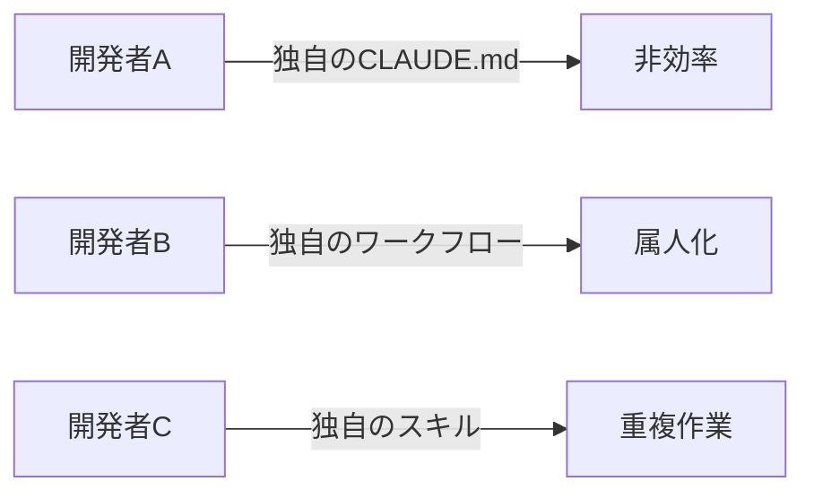
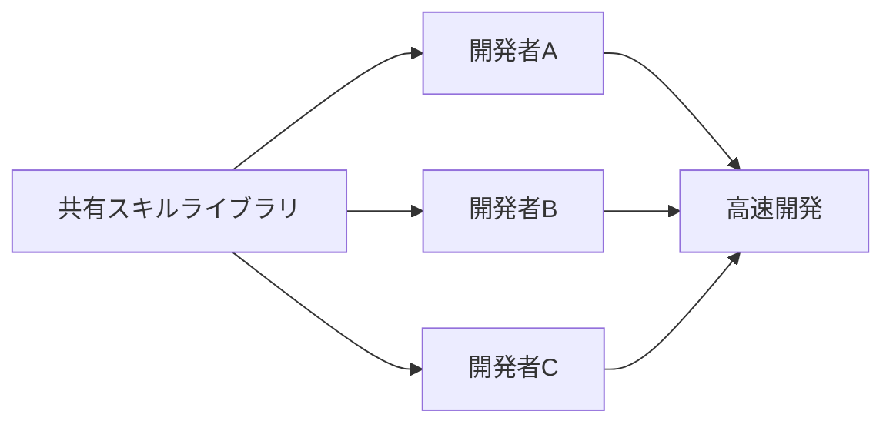
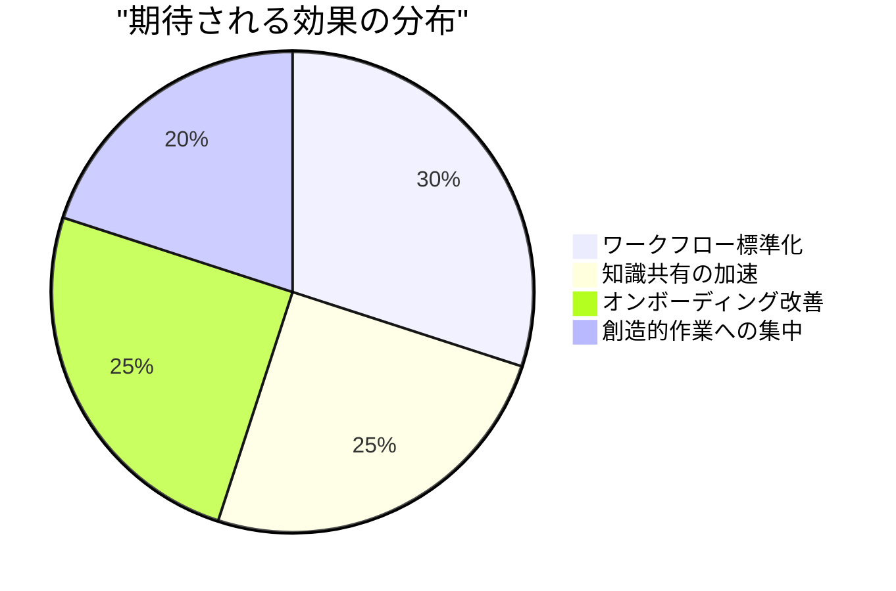
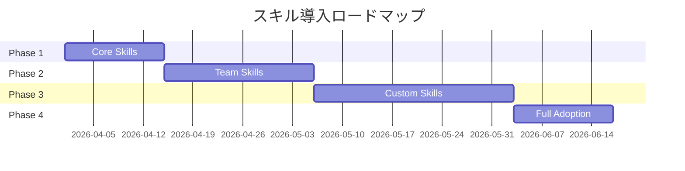

## 課題

[CLAUDE.mdの最適化](/ja/blog/2026/03/08/optimizing-claude-code-with-skills)、[メタスキルの実装](/ja/blog/2026/03/09/claude-code-meta-skills)と進めてきたが、個人レベルの改善をチーム全体に展開しようとすると、根本的に異なる問題に直面する。20人が同じ品質で作業できる仕組みが必要だ。

## なぜチーム展開が必要なのか

個人でClaude Codeの生産性を上げることと、チーム全体で上げることは根本的に異なる。個人最適化は「自分のCLAUDE.mdを整理する」だけで済むが、チーム展開では「20人が同じ品質で作業できる仕組み」を作る必要がある。

[前回の記事](/ja/blog/2026/03/09/claude-code-meta-skills)でDevOpsの「Infrastructure as Code」との類似性に触れたが、チーム展開ではこの考え方がさらに重要になる。個人のCLAUDE.mdを手動で整理するのではなく、スキルとしてコード管理・共有することで、チーム全体の底上げが可能になる。

## チーム開発における課題

### Before：メタスキル導入前



現状、各開発者が独自の設定とワークフローを持ち、知識が共有されていない：

- **CLAUDE.mdの重複**：同じ内容を各自が記述
- **スキルの車輪の再発明**：似たようなスキルを個別に作成
- **ベストプラクティスの欠如**：効率的な方法が共有されない
- **オンボーディングの遅延**：新メンバーが独自に学習

### After：メタスキルによる標準化



メタスキルを共有ライブラリとして整備することで、各開発者が同じスタートラインに立てる。重要なのは、これが「制約」ではなく「土台」であるということだ。共通のコアスキルの上に、チームや個人のカスタマイズを重ねる構造にすることで、標準化と柔軟性を両立させる。

## 組織展開の3ステップ

### ステップ1：共有スキルライブラリの構築

まず、組織全体で使用するスキルライブラリを構築する。ポイントは`_core`（全チーム共通）とチーム別ディレクトリの分離である。npmのスコープパッケージのように、スキルをカテゴリごとに名前空間で管理することで、命名衝突を防ぎつつ発見性を高める：

```bash
# モノレポ構造
organization-skills/
├── .claude/
│   ├── skills/
│   │   ├── _core/           # 全チーム必須スキル
│   │   │   ├── optimize-claude-md/
│   │   │   ├── create-skill/
│   │   │   └── analyze-claude-md/
│   │   ├── frontend/        # フロントエンドチーム用
│   │   ├── backend/         # バックエンドチーム用
│   │   ├── devops/          # DevOpsチーム用
│   │   └── qa/              # QAチーム用
│   └── templates/           # スキルテンプレート
└── docs/                     # ドキュメント
```

### ステップ2：チーム別カスタマイズ

各チームが独自のニーズに合わせてスキルをカスタマイズする。ここで重要なのは、スキルが「チームの暗黙知を形式知に変える手段」であることだ。たとえば、フロントエンドチームの「コンポーネント作成手順」は、普段は先輩エンジニアの頭の中にしかない。これをスキルとして明文化することで、チーム全員が同じ品質で作業できるようになる：

#### フロントエンドチーム

```markdown
# .claude/skills/frontend/create-component/SKILL.md

---

name: create-component
description: Create React component with team standards
disable-model-invocation: true

---

1. Component structure following team conventions
2. TypeScript interface definition
3. Storybook story creation
4. Unit test with Testing Library
5. Accessibility audit
```

#### バックエンドチーム

```markdown
# .claude/skills/backend/create-api/SKILL.md

---

name: create-api
description: Create REST API endpoint with standards
disable-model-invocation: true

---

1. OpenAPI specification update
2. Controller implementation
3. Service layer logic
4. Database migration
5. Integration tests
6. Performance benchmarks
```

### ステップ3：継続的改善プロセス

スキルは作って終わりではない。コードと同様にメンテナンスが必要だ。使われていないスキル、重複するスキル、古くなったスキルが溜まると、かえって混乱の原因になる。そこで、週次でスキルの改善と共有を行うプロセスを確立する予定である：

```bash
# 毎週金曜日の改善サイクル
/analyze-team-skills        # チーム全体のスキル使用状況分析
/identify-duplicates        # 重複スキルの特定
/merge-similar-skills       # 類似スキルの統合
/share-best-practices       # ベストプラクティスの共有
```

## 実装例：スキル共有システム

スキルをチーム間で共有するには、技術的な仕組みが必要だ。ここでは、Gitリポジトリベースの共有システムを設計している。既存のGitワークフロー（PR、レビュー、マージ）をそのまま活用できるため、新しいツールの学習コストがかからないのが利点である。

### 1. 中央リポジトリ

```bash
# スキル中央リポジトリのセットアップ
git clone https://github.com/org/claude-skills-library
cd claude-skills-library

# チームブランチ戦略
git checkout -b team/frontend
git checkout -b team/backend
git checkout -b team/devops
```

### 2. スキル同期スクリプト

中央リポジトリのスキルを各プロジェクトに配布するスクリプトである。`_core`スキルは全プロジェクトに強制配布し、チーム固有スキルは環境変数`$TEAM`で選択的に配布する。これにより、必要なスキルだけが各プロジェクトに届く仕組みになる：

```bash
#!/bin/bash
# sync-skills.sh

# コアスキルを全プロジェクトに同期
rsync -av organization-skills/.claude/skills/_core/ \
    ~/projects/*/.claude/skills/

# チーム固有スキルを選択的に同期
if [ "$TEAM" = "frontend" ]; then
    rsync -av organization-skills/.claude/skills/frontend/ \
        ~/projects/*/.claude/skills/
fi
```

### 3. スキル投稿システム

ボトムアップでスキルが成長する仕組みも重要だ。トップダウンで押し付けるだけでは、現場のニーズに合わないスキルが増えてしまう。以下は、個人が作成したスキルを組織全体に提案するためのワークフローである。OSSのコントリビューションモデルを参考にしている：

```markdown
# .claude/skills/propose-skill/SKILL.md

---

name: propose-skill
description: Propose a new skill to the organization
disable-model-invocation: true

---

1. Create skill in personal branch
2. Test skill with real scenarios
3. Document use cases and benefits
4. Submit PR to organization repository
5. Team review and feedback
6. Merge to appropriate category
```

## 成果測定：KPIと効果

チーム展開で最も重要なのは「効果を測定できること」である。感覚的に「なんとなく便利」では、組織への投資判断ができない。以下では、個人での効果をベースに、チーム展開での目標値を設定している。

### 定量的な目標（仮説）

以下の数値は**実測データではなく、個人での経験をもとにした仮説的な目標値**である。CLAUDE.mdの行数削減のみ個人レベルで実証済みだが、それ以外の項目はチーム展開後に初めて検証可能になる。導入後に実測値と比較し、目標の妥当性を評価する予定だ：

| メトリクス           | 現状     | 目標     | 期待改善率  | 確度 |
| -------------------- | -------- | -------- | ----------- | ---- |
| CLAUDE.md平均行数    | 250行    | 45行     | **82%削減** | 手法は実証済み |
| 新機能開発速度       | 5日/機能 | 3日/機能 | **40%向上** | 仮説 |
| コードレビュー時間   | 2時間/PR | 48分/PR  | **60%削減** | 仮説 |
| バグ発生率           | 12件/週  | 5件/週   | **58%削減** | 仮説 |
| オンボーディング期間 | 3週間    | 1週間    | **66%短縮** | 仮説 |

### 期待される定性的効果



期待される効果：

- 繰り返し作業が自動化され、創造的な作業に集中できる
- チーム間でベストプラクティスが共有され、学びが加速する
- 新人でもすぐに生産的になれる

## 想定ケース：大規模マイグレーション

メタスキルの真価が発揮されるのは、「同じ作業を大量に繰り返す」場面だ。大規模マイグレーションはまさにその典型例で、スキルによる標準化の効果が最も大きくなると考えている。

### 背景

今後予定しているNext.js 15から16への大規模アップグレード（200+コンポーネント）にメタスキルを活用する計画である。従来、このような作業では開発者ごとにアプローチが異なり、品質にばらつきが出ることが課題だった。

### アプローチ

マイグレーション用のスキルを作成し、全開発者が同じ手順で作業する。各ステップが明文化されているため、フレームワークの内部変更に詳しくない開発者でも安全に移行作業を進められる：

```markdown
# .claude/skills/nextjs16-migration/SKILL.md

---

name: nextjs16-migration
description: Migrate pages and components from Next.js 15 to 16
disable-model-invocation: true

---

1. Analyze page/component for Next.js 16 compatibility
2. Update async request APIs (cookies, headers, params)
3. Migrate to new App Router conventions
4. Update tests for changed behaviors
5. Performance profiling
6. Document breaking changes
```

### 期待される効果

- **期間**：従来見積もり6週間 → 目標2週間
- **品質**：スキルによる標準化でバグの大幅削減を期待
- **効率**：20人で並列作業、スキルでアプローチを統一

従来のマイグレーションでは、各開発者がドキュメントを読み、自分なりに解釈して作業していた。スキルを使えば「解釈の余地」を減らし、一貫した品質を担保できる。これは特に、チームの経験レベルにばらつきがある場合に効果的だ。

## チーム導入のベストプラクティス

ここからは、導入時に注意すべきポイントを整理する。技術的な仕組みだけでなく、組織的な運用体制も同様に重要である。

### 1. 段階的導入

いきなり全スキルを導入すると混乱が生じる。まずコアスキル（CLAUDE.md最適化やスキル作成など、メタレベルのスキル）を導入し、チームがスキルの使い方自体に慣れてから、業務固有のスキルを追加していく段階的アプローチを計画している：



### 2. ガバナンス体制

スキルが増えてくると「誰が管理するのか」「勝手に変更されたらどうするのか」という問題が発生する。コードレビューと同様に、スキルにもレビュープロセスを設けることで品質を維持する：

```yaml
# skill-governance.yml
roles:
  skill-owner:
    - Review and approve new skills
    - Maintain quality standards
    - Resolve conflicts

  skill-contributor:
    - Propose new skills
    - Update existing skills
    - Share use cases

process:
  proposal: Pull Request
  review: 2+ approvals required
  merge: Skill owner approval
  deprecation: 30-day notice period
```

### 3. 教育プログラム

ツールを導入しても、使い方を知らなければ意味がない。レベル別のトレーニングを設計し、全員が段階的にスキルを活用できるようにする。特にLevel 1は全員必須とし、「スキルとは何か」の共通理解を作ることが最優先である：

```markdown
## Claude Code スキルトレーニング

### Level 1: Basic (全員必須)

- /optimize-claude-md の使い方
- 基本スキルの実行
- CLAUDE.md の理解

### Level 2: Intermediate (開発者)

- /create-skill でスキル作成
- チームスキルのカスタマイズ
- メタスキルの活用

### Level 3: Advanced (リード開発者)

- スキルアーキテクチャ設計
- パフォーマンス最適化
- 組織全体への展開
```

## 落とし穴と対策

どんな仕組みも、運用していくと想定外の問題が発生する。以下は、個人運用の経験やチーム開発の一般的なパターンから予測される課題と、その対策である。事前に想定しておくことで、問題が発生した際に迅速に対応できる。

### 問題1：スキルの乱立

ボトムアップでスキルを増やせる仕組みの裏返しとして、似たようなスキルが乱立するリスクがある。npmパッケージの増殖と同じ問題だ。

**対策**：定期的な監査と統合

```bash
# 四半期ごとのスキル監査
/audit-all-skills
/find-duplicate-skills
/merge-redundant-skills
/deprecate-unused-skills
```

### 問題2：バージョン管理の複雑化

スキルの更新がチーム全体に影響するため、「いつ、どの変更が入ったか」を追跡できる必要がある。

**対策**：セマンティックバージョニング

```markdown
# スキルのバージョン管理

skills/
├── create-api@1.0.0/ # 安定版
├── create-api@2.0.0-beta/ # ベータ版
└── create-api@deprecated/ # 廃止予定
```

### 問題3：チーム間の不整合

プロジェクトごとにスキルのバージョンがずれると、同じスキル名なのに動作が異なるという混乱が生じる。

**対策**：コアスキルの強制と定期同期

```bash
# 日次同期ジョブ
0 9 * * * /usr/local/bin/sync-core-skills.sh
```

## 将来の展望

### AIネイティブ開発の未来

チーム展開が成功した先には、さらに高度な自動化の可能性がある。現在構想中の次世代機能は、スキルの管理自体をAIに委ねるというものだ：

```markdown
/skill-ai-suggest # AIがコンテキストから必要なスキルを提案
/skill-auto-create # 繰り返しパターンから自動でスキル生成
/skill-performance # スキル実行のパフォーマンス分析
/skill-marketplace # 組織を超えたスキル共有
```

### メトリクス駆動の改善

将来的には、スキルの使用状況をプログラムで分析し、改善のサイクルを自動化することも視野に入れている。どのスキルが最も使われているか、どれだけの時間が節約されているかを定量的に把握できれば、投資対効果の判断がより正確になる：

```python
# skill_analytics.py
def analyze_skill_usage():
    """スキル使用状況の分析"""
    return {
        "most_used": get_top_skills(10),
        "time_saved": calculate_time_savings(),
        "error_reduction": measure_error_rates(),
        "roi": calculate_return_on_investment()
    }
```

## まとめ

- **コアスキルの強制配布とチーム別カスタマイズを分離する** — `_core/` で全チーム共通の品質を担保し、`frontend/` `backend/` でチーム固有のニーズに対応する。この二層構造が標準化と柔軟性を両立させる鍵だ。
- **スキルは「暗黙知を形式知に変える手段」である** — 先輩エンジニアの頭の中にしかないワークフローをスキルとして明文化すると、チーム全員が同じ品質で作業できるようになる。オンボーディングの加速にも直結する。
- **ボトムアップの提案とガバナンスを両立させる** — OSSのコントリビューションモデルを参考に、個人が作成→PR→レビュー→マージという流れでスキルを成長させる。トップダウンだけでは現場のニーズに合わない。
- **効果は仮説として設定し、導入後に実測で検証する** — 定量目標を先に立てておき、運用データと比較することで投資判断の精度が上がる。

---

_シリーズ記事：_

1. _[CLAUDE.md でAIコーディングアシスタントを最大活用する](/ja/blog/2026/03/07/claude-md-ai-coding-assistant-guide)_
2. _[Claude CodeのCLAUDE.mdを83%削減してスキルシステムで効率化した話](/ja/blog/2026/03/08/optimizing-claude-code-with-skills)_
3. _[Claude Codeのメタスキル：スキルを管理するスキルで実現する自己改善サイクル](/ja/blog/2026/03/09/claude-code-meta-skills)_
4. _[Claude Codeメタスキルのチーム展開：組織全体でAI支援開発の生産性を最大化する](/ja/blog/2026/03/10/claude-code-team-productivity)_（本記事）
