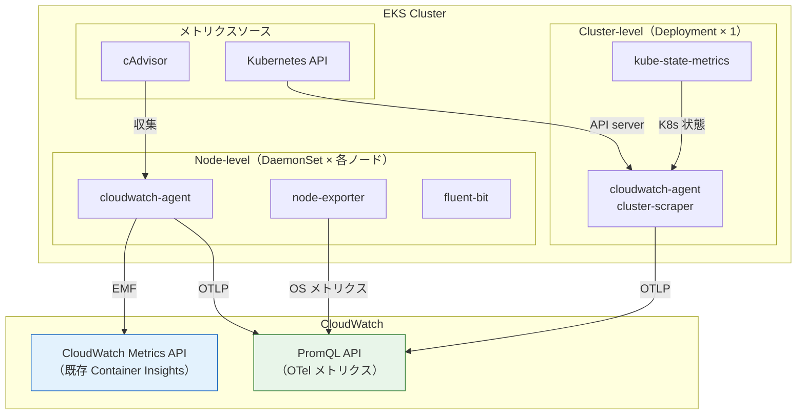

## はじめに

2026年4月2日、AWS は [CloudWatch Container Insights の OpenTelemetry メトリクス対応（Preview）](https://aws.amazon.com/about-aws/whats-new/2026/04/cloudwatch-otel-container-insights-eks/)を発表した。

既存の Container Insights (enhanced) は CloudWatch 独自フォーマットで事前集約したメトリクスを提供する。ディメンションは ClusterName / Namespace / PodName 等の 4-5 個に限られ、カスタム Kubernetes ラベルでのフィルタリングはできない。OTel Container Insights は cAdvisor・Node Exporter・Kube State Metrics 等のオープンソースメトリクスを OTLP で送信し、最大 150 ラベルを付与した状態で PromQL によるクエリ時集約を可能にする。

| 観点 | Container Insights (enhanced) | OTel Container Insights |
|---|---|---|
| メトリクス名 | CloudWatch 独自（`pod_cpu_utilization`） | オープンソース準拠（`container_cpu_usage_seconds_total`） |
| ラベル/ディメンション数 | 4-5 | 最大 150 |
| 集約方式 | 事前集約（cluster/namespace/pod） | クエリ時集約（PromQL） |
| クエリ言語 | CloudWatch Metrics API | PromQL |
| カスタム K8s ラベル | なし | pod/node labels が自動付与 |
| メトリクス取り込み | CloudWatch Logs (EMF) | OTLP（オープン標準） |

本記事では add-on v6.0.1 のインストールから、既存 Container Insights との並行稼働確認、PromQL クエリの実践、PromQL アラームの作成までを検証し、移行判断のための実測データを提供する。公式ドキュメントは [Container Insights with OpenTelemetry metrics for Amazon EKS](https://docs.aws.amazon.com/AmazonCloudWatch/latest/monitoring/container-insights-otel-metrics.html) を参照。

**本記事の内容は 2026年4月時点のパブリックプレビューでの動作に基づいており、GA 時に変更される可能性がある。**

前提条件:

- AWS CLI v2、eksctl
- Python 3 + boto3（PromQL API の呼び出しに使用）
- `eks:*`、`cloudwatch:*`、`iam:*`、`observabilityadmin:*` 権限
- 検証リージョン: us-east-1（Preview 対応リージョン。東京リージョンは未対応）
- Preview 対応リージョン: us-east-1, us-west-2, eu-west-1, ap-southeast-1, ap-southeast-2

セットアップだけ見たい場合は[検証環境のセットアップ](#検証環境のセットアップ)、結果だけ見たい場合は[検証 1](#検証-1-add-on-v601-のインストールと-otel-メトリクス収集の確認)に進んでほしい。

## 検証環境のセットアップ

<details className="my-4 rounded-lg border border-border bg-muted/30 p-4">
<summary className="cursor-pointer font-medium">EKS クラスター作成・add-on インストール・サンプルワークロードのデプロイ手順</summary>

### EKS Auto Mode クラスターの作成

```bash title="Terminal"
eksctl create cluster \
  --name otel-ci-test \
  --region us-east-1 \
  --version 1.35 \
  --enable-auto-mode
```

Auto Mode を選択した理由は、ノードグループ管理が不要で検証環境の構築が最速であること。add-on v6.0.1 の `computeTypes` に `auto` が含まれていることも確認済みである。

### OTel エンリッチメントの有効化

OTel Container Insights のメトリクスを PromQL でクエリするには、[公式ブログ](https://aws.amazon.com/jp/blogs/mt/introducing-opentelemetry-promql-support-in-amazon-cloudwatch/)の手順に従い、アカウントレベルで 2 つのエンリッチメント設定を有効化する。

```bash title="Terminal"
# 1. リソースタグのテレメトリ伝播を有効化（AWS リソースタグを PromQL ラベルとして利用可能にする）
aws observabilityadmin start-telemetry-enrichment --region us-east-1

# 2. OTLP メトリクスの取り込みと OTel エンリッチメントを有効化
aws cloudwatch start-o-tel-enrichment --region us-east-1
```

### CloudWatch Observability add-on v6.0.1 のインストール

Pod Identity 用の IAM ロールを作成し、add-on をインストールする。

```bash title="Terminal"
# Pod Identity 用の信頼ポリシーで IAM ロールを作成
cat <<'EOF' > /tmp/cw-trust-policy.json
{
  "Version": "2012-10-17",
  "Statement": [
    {
      "Effect": "Allow",
      "Principal": {
        "Service": "pods.eks.amazonaws.com"
      },
      "Action": ["sts:AssumeRole", "sts:TagSession"]
    }
  ]
}
EOF

aws iam create-role \
  --role-name otel-ci-test-cw-agent \
  --assume-role-policy-document file:///tmp/cw-trust-policy.json

aws iam attach-role-policy \
  --role-name otel-ci-test-cw-agent \
  --policy-arn arn:aws:iam::aws:policy/CloudWatchAgentServerPolicy
```

```bash title="Terminal"
ACCOUNT_ID=$(aws sts get-caller-identity --query Account --output text)

aws eks create-addon \
  --addon-name amazon-cloudwatch-observability \
  --addon-version v6.0.1-eksbuild.1 \
  --cluster-name otel-ci-test \
  --region us-east-1 \
  --pod-identity-associations \
    "serviceAccount=cloudwatch-agent,roleArn=arn:aws:iam::${ACCOUNT_ID}:role/otel-ci-test-cw-agent"
```

### サンプルワークロードのデプロイ

カスタム Pod ラベル（`app`, `team`, `environment`）を付与した nginx Deployment をデプロイする。これらのラベルが OTel メトリクスに自動付与されるかを後の検証で確認する。

```bash title="Terminal"
kubectl create namespace sample-app

cat <<'EOF' | kubectl apply -f -
apiVersion: apps/v1
kind: Deployment
metadata:
  name: nginx
  namespace: sample-app
  labels:
    app: nginx
    team: platform
    environment: test
spec:
  replicas: 2
  selector:
    matchLabels:
      app: nginx
  template:
    metadata:
      labels:
        app: nginx
        team: platform
        environment: test
    spec:
      containers:
      - name: nginx
        image: nginx:1.27
        ports:
        - containerPort: 80
        resources:
          requests:
            cpu: 100m
            memory: 128Mi
          limits:
            cpu: 200m
            memory: 256Mi
EOF

kubectl expose deployment nginx -n sample-app --port=80 --target-port=80
```

</details>

## 検証 1: add-on v6.0.1 のインストールと OTel メトリクス収集の確認

add-on が ACTIVE になった後、`amazon-cloudwatch` namespace の Pod 構成を確認する。

```bash title="Terminal"
kubectl get pods -n amazon-cloudwatch
```

```text title="Output"
NAME                                                              READY   STATUS
amazon-cloudwatch-observability-controller-manager-69f7556hhh7r   1/1     Running
cloudwatch-agent-cluster-scraper-59d757d8f4-4l8hm                 1/1     Running
cloudwatch-agent-d67d2                                            1/1     Running
cloudwatch-agent-fmnp6                                            1/1     Running
cloudwatch-agent-h24k8                                            1/1     Running
fluent-bit-62txs                                                  1/1     Running
fluent-bit-d4glb                                                  1/1     Running
fluent-bit-z5q2w                                                  1/1     Running
kube-state-metrics-55bc855b4d-mqmmb                               1/1     Running
node-exporter-cjv4d                                               1/1     Running
node-exporter-n5l4p                                               1/1     Running
node-exporter-vl777                                               1/1     Running
```

v6.0 では以下の Pod が自動的にデプロイされる。



- **`cloudwatch-agent` DaemonSet**（3 pods）— 各ノードで cAdvisor メトリクスを収集。OTel メトリクス（OTLP）と既存 Container Insights メトリクス（EMF）の両方を送信する
- **`cloudwatch-agent-cluster-scraper` Deployment**（1 pod）— Kube State Metrics・API server メトリクスを収集
- **`node-exporter` DaemonSet**（3 pods）— 各ノードの OS レベルメトリクスを収集
- **`kube-state-metrics` Deployment**（1 pod）— Kubernetes オブジェクトの状態メトリクスを収集
- **`fluent-bit` DaemonSet**（3 pods）— コンテナログの収集を担当。OTel メトリクスとは直接関係ないため本記事では扱わない

特に `cloudwatch-agent` が DaemonSet（node-level）と Deployment（cluster-level）に自動分離されている点が重要だ。従来の add-on（v5.x 以前）では 1 つの DaemonSet がすべてのメトリクスを収集しており、[ドキュメント](https://docs.aws.amazon.com/AmazonCloudWatch/latest/monitoring/install-CloudWatch-Observability-EKS-addon.html#install-CloudWatch-Observability-EKS-addon-large-clusters)ではリーダー Pod が OOM で落ちる問題が報告されている。v6.0 ではこの分離がデフォルトで行われる。

加えて、`kube-state-metrics` と `node-exporter` が add-on に同梱されている。OTel Container Insights ではこれらのメトリクスソースが必要だが、別途インストールする必要はなく add-on 一つで完結する。

### OTel メトリクスの到達確認

OTel メトリクスは CloudWatch の PromQL 互換 API で確認する。エンドポイントは `https://monitoring.<region>.amazonaws.com/api/v1/query` で、SigV4 認証（サービス名: `monitoring`）が必要である。AWS CLI にはまだ PromQL API が統合されていないため、Python（boto3）で呼び出す。

<details className="my-4 rounded-lg border border-border bg-muted/30 p-4">
<summary className="cursor-pointer font-medium">PromQL API 呼び出し用の Python ヘルパー関数（以降の検証でも使用）</summary>

```python title="promql_helper.py"
import boto3, json
from botocore.auth import SigV4Auth
from botocore.awsrequest import AWSRequest
from urllib.request import urlopen, Request
from urllib.parse import urlencode

REGION = 'us-east-1'

def promql_query(query):
    """CloudWatch PromQL API にクエリを送信し、結果を返す"""
    session = boto3.Session(region_name=REGION)
    credentials = session.get_credentials().get_frozen_credentials()
    url = f"https://monitoring.{REGION}.amazonaws.com/api/v1/query"
    body = urlencode({"query": query})
    req = AWSRequest(method='POST', url=url, data=body,
                     headers={'Content-Type': 'application/x-www-form-urlencoded'})
    SigV4Auth(credentials, 'monitoring', REGION).add_auth(req)
    http_req = Request(url, data=body.encode(), headers=dict(req.headers), method='POST')
    return json.loads(urlopen(http_req).read().decode())
```

</details>

このヘルパー関数を使って、OTel メトリクスの到達を確認する。

```python title="Python"
data = promql_query('{"container_cpu_usage_seconds_total"}')
print(f"Time series: {len(data['data']['result'])}")
```

```text title="Output"
Time series: 45
```

add-on インストールから約 90 秒で 45 の時系列が PromQL API に到達した。利用可能なメトリクス名は 871 個だが、大半は OTel エンリッチメントにより PromQL でクエリ可能になった AWS ベンダーメトリクス（EC2 CPUUtilization、Lambda Invocations 等）である。OTel Container Insights 固有のメトリクス（cAdvisor、Node Exporter、Kube State Metrics 由来）はその一部だ。

## 検証 2: 既存 Container Insights との並行稼働 — 実測ベースのメトリクス・ラベル比較

v6.0.1 をインストールすると、既存の Container Insights (enhanced) と OTel Container Insights の両方が同時にメトリクスを送信する。既存の `ContainerInsights` namespace のメトリクスが引き続き CloudWatch Metrics API で取得でき、同時に OTel メトリクスが PromQL API で取得できることを確認した。同一ワークロード（nginx）に対するメトリクスの構造を比較する。

### 既存 Container Insights (enhanced) のメトリクス

```bash title="Terminal"
aws cloudwatch list-metrics \
  --namespace "ContainerInsights" \
  --metric-name "container_cpu_utilization" \
  --query 'Metrics[?Dimensions[?Name==`Namespace` && Value==`sample-app`]]'
```

同じメトリクスが複数の Dimensions セット（namespace レベル、pod レベル等）で事前集約されて存在する。以下は最も詳細な 5 ディメンションのセットを示す。

```json title="Output"
[
  {
    "MetricName": "container_cpu_utilization",
    "Dimensions": [
      {"Name": "PodName", "Value": "nginx"},
      {"Name": "ContainerName", "Value": "nginx"},
      {"Name": "FullPodName", "Value": "nginx-6744976c6c-ggzsf"},
      {"Name": "ClusterName", "Value": "otel-ci-test"},
      {"Name": "Namespace", "Value": "sample-app"}
    ]
  }
]
```

ディメンションは 5 個。ClusterName、Namespace、PodName、ContainerName、FullPodName のみで、カスタム Pod ラベルは含まれない。

### OTel Container Insights のメトリクス

同じ nginx Pod に対する `container_cpu_usage_seconds_total` のラベルを確認する。

<details className="my-4 rounded-lg border border-border bg-muted/30 p-4">
<summary className="cursor-pointer font-medium">全ラベルを取得する Python コード</summary>

```python title="Python"
data = promql_query(
    '{"container_cpu_usage_seconds_total", '
    '"@resource.k8s.namespace.name"="sample-app", '
    '"@resource.k8s.container.name"="nginx"}'
)
results = data['data']['result']
labels = results[0]['metric']
print(f"Label count: {len(labels)}")
for k, v in sorted(labels.items()):
    print(f"  {k}: {v}")
```

</details>

```text title="Output（72ラベルから抜粋）"
@aws.account: 381492023699
@aws.region: us-east-1
@instrumentation.@name: github.com/google/cadvisor
@resource.cloud.resource_id: arn:aws:eks:us-east-1:381492023699:cluster/otel-ci-test
@resource.k8s.cluster.name: otel-ci-test
@resource.k8s.container.name: nginx
@resource.k8s.deployment.name: nginx
@resource.k8s.namespace.name: sample-app
@resource.k8s.node.name: i-00dc6a76757650d48
@resource.k8s.pod.label.app: nginx
@resource.k8s.pod.label.environment: test
@resource.k8s.pod.label.team: platform
@resource.k8s.pod.name: nginx-6744976c6c-ggzsf
@resource.k8s.workload.name: nginx
@resource.k8s.workload.type: Deployment
@resource.k8s.node.label.eks.amazonaws.com/compute-type: auto
@resource.k8s.node.label.karpenter.sh/capacity-type: on-demand
@resource.k8s.node.label.karpenter.sh/nodepool: general-purpose
@resource.host.type: c6a.large
```

**72 ラベル**が付与されている。特に注目すべきは以下の 3 カテゴリだ。

1. **カスタム Pod ラベル** — `@resource.k8s.pod.label.app`、`@resource.k8s.pod.label.team`、`@resource.k8s.pod.label.environment` が自動付与。Pod の `metadata.labels`（Deployment の `template.metadata.labels`）に設定したラベルがそのまま反映される
2. **ノードラベル** — `@resource.k8s.node.label.karpenter.sh/capacity-type`（on-demand / spot）、`@resource.k8s.node.label.eks.amazonaws.com/compute-type`（auto）等。Auto Mode / Karpenter のノード属性でフィルタ可能
3. **ワークロード情報** — `@resource.k8s.deployment.name`、`@resource.k8s.workload.type` が付与。既存 Container Insights にはなかった情報

### 実測比較表

| 観点 | Container Insights (enhanced) | OTel Container Insights |
|---|---|---|
| メトリクス名 | `container_cpu_utilization` | `container_cpu_usage_seconds_total` |
| ラベル/ディメンション数 | 5 | 72 |
| カスタム Pod ラベル | なし | `@resource.k8s.pod.label.*` で自動付与 |
| ノードラベル | なし | `@resource.k8s.node.label.*` で自動付与 |
| ワークロード情報 | なし | `deployment.name`, `workload.type` |
| インスタンスタイプ | なし | `@resource.host.type` |
| 並行稼働 | — | 欠損・競合なし |

## 検証 3: PromQL クエリ実践 — 既存 Container Insights ではできなかった 3 つのクエリ

以下のクエリは [CloudWatch Query Studio](https://docs.aws.amazon.com/AmazonCloudWatch/latest/monitoring/CloudWatch-PromQL-QueryStudio.html) の PromQL モード、または検証 1 で示した `promql_query()` 関数の引数を差し替えて実行できる。

### クエリ 1: namespace 別 CPU 使用率 — rate() による任意時間窓の計算

既存の Container Insights では `pod_cpu_utilization` が事前集約済みの値として提供される。PromQL の `rate()` を適用して任意の時間窓で再計算することはできない。OTel 版では counter メトリクスに `rate()` を適用できる。

```text title="PromQL"
sum by ("@resource.k8s.namespace.name")(
  rate({"container_cpu_usage_seconds_total",
        "@resource.k8s.cluster.name"="otel-ci-test"}[5m])
)
```

```text title="Output"
@resource.k8s.namespace.name=amazon-cloudwatch => 0.095 cores
@resource.k8s.namespace.name=amazon-guardduty  => 0.021 cores
@resource.k8s.namespace.name=kube-system       => 0.008 cores
@resource.k8s.namespace.name=sample-app        => 0.000 cores
```

4 つの namespace の CPU 使用率を 1 クエリで取得できた。`[5m]` を `[1m]` や `[15m]` に変えれば、スパイクの検出感度を自由に調整できる。

### クエリ 2: カスタム K8s ラベルでフィルタ・集約

既存の Container Insights にはカスタム Pod ラベルがディメンションに含まれないため、`team=platform` のような絞り込みは不可能だった。OTel 版では `@resource.k8s.pod.label.*` で直接フィルタできる。

```text title="PromQL"
sum by ("@resource.k8s.pod.label.app", "@resource.k8s.pod.label.team")(
  rate({"container_cpu_usage_seconds_total",
        "@resource.k8s.pod.label.team"="platform"}[5m])
)
```

```text title="Output"
app=nginx, team=platform => 0.000 cores
```

`team=platform` でフィルタし、`app` と `team` でグルーピングした結果が返った。nginx はアイドル状態のため CPU 使用率は 0 に近いが、負荷をかければ値が変動することを確認済みである。マルチテナント環境でチーム別のリソース使用量を可視化するクエリが、追加のインストルメンテーションなしで書ける。

### クエリ 3: Kube State Metrics — Pod ステータスの可視化

既存の Container Insights では Kube State Metrics が収集対象外だった。OTel 版では `kube_pod_status_phase` 等が自動収集される。

```text title="PromQL"
sum by ("@resource.k8s.namespace.name", phase)(
  {"kube_pod_status_phase",
   "@resource.k8s.cluster.name"="otel-ci-test"}
)
```

```text title="Output（抜粋）"
sample-app,  Running   => 2
sample-app,  Failed    => 0
amazon-cloudwatch, Running   => 12
amazon-guardduty,  Running   => 2
kube-system, Running   => 2
```

namespace × phase の 20 時系列が返った。Deployment のレプリカ数も確認できる。

```text title="PromQL"
{"kube_deployment_status_replicas",
 "@resource.k8s.cluster.name"="otel-ci-test"}
```

```text title="Output"
sample-app/nginx: 2 replicas
amazon-cloudwatch/kube-state-metrics: 1 replicas
amazon-cloudwatch/cloudwatch-agent-cluster-scraper: 1 replicas
kube-system/metrics-server: 2 replicas
```

## 検証 4: PromQL アラーム — カスタムラベルベースの監視

PromQL クエリから CloudWatch Alarm を作成できる。既存の CloudWatch Alarm では不可能だった「カスタムラベルベースのアラーム」が作れるかを検証した。なお、以下の検証では即座に ALARM 状態への遷移を確認するため `PendingPeriod` を 0 に設定している。本番環境ではフラッピング防止のために適切な値（例: 120-300 秒）を設定すべきである。

### 動作したケース: Kube State Metrics

```bash title="Terminal"
aws cloudwatch put-metric-alarm \
  --alarm-name "otel-ci-test-ksm-namespace" \
  --evaluation-criteria '{
    "PromQLCriteria": {
      "Query": "{\"kube_pod_status_phase\", \"@resource.k8s.namespace.name\"=\"sample-app\", phase=\"Running\"} > 0",
      "PendingPeriod": 0,
      "RecoveryPeriod": 60
    }
  }' \
  --evaluation-interval 60 \
  --region us-east-1
```

```text title="Output（数分後）"
State: ALARM
Reason: 3 time series evaluated to ALARM
```

`@resource.k8s.namespace.name` でフィルタした PromQL アラームが正常に ALARM 状態に遷移した。

### 動作しなかったケース: cAdvisor / Node Exporter メトリクス

同じ構文で cAdvisor メトリクスに対するアラームを作成したが、PromQL API では条件を満たす時系列が返るにもかかわらず、アラームは OK のまま遷移しなかった。

```bash title="Terminal"
# PromQL API では 0.078 > 0 で条件を満たしている
aws cloudwatch put-metric-alarm \
  --alarm-name "otel-ci-test-cadvisor-alarm" \
  --evaluation-criteria '{
    "PromQLCriteria": {
      "Query": "{\"container_cpu_usage_seconds_total\", \"@resource.k8s.namespace.name\"=\"sample-app\"} > 0",
      "PendingPeriod": 0,
      "RecoveryPeriod": 60
    }
  }' \
  --evaluation-interval 60 \
  --region us-east-1
```

```text title="Output（10分以上経過後）"
State: OK
Reason: No time series evaluated to ALARM
```

検証の結果、メトリクスソース（pipeline）によってアラームの動作状況が異なることが分かった。

| メトリクスソース | pipeline | アラーム動作 |
|---|---|---|
| Kube State Metrics | kube-state-metrics | ✅ 動作する |
| cAdvisor | cadvisor | ❌ 動作しない |
| Node Exporter | node-exporter | ❌ 動作しない |

Kube State Metrics は `cloudwatch-agent-cluster-scraper`（Deployment）が収集し、cAdvisor と Node Exporter は `cloudwatch-agent`（DaemonSet）が収集する。

事実として確認できたのは以下の 2 点だ。

- PromQL クエリはすべてのメトリクスソースで正常に動作する
- アラーム評価は cluster-scraper 経由のメトリクスでのみ動作し、DaemonSet 経由のメトリクスでは動作しなかった

原因は特定できていない。DaemonSet 経由のメトリクスがアラーム評価に未対応である可能性や、Preview 段階での一時的な制約である可能性がある。

## まとめ — 4 つの判断軸で移行タイミングを整理する

- **PromQL + 150 ラベルの組み合わせが OTel Container Insights の真価** — カスタム Pod ラベル（team, app, environment）やノードラベル（capacity-type, instance-family）でクエリ時に自由に集約できる。既存の Container Insights では 4-5 ディメンションの固定集約しかできなかったが、OTel 版では 72 ラベルを使った柔軟なクエリが可能になる
- **既存 Container Insights との並行稼働は安全** — add-on v6.0.1 をインストールするだけで両方のメトリクスが同時に収集される。メトリクスの欠損や競合はなく、段階的な移行が可能
- **PromQL アラームはメトリクスソースによって動作が異なる** — Kube State Metrics ではカスタムラベルベースのアラームが動作するが、cAdvisor / Node Exporter メトリクスでは検証時点で動作しなかった。CPU やメモリのアラームを PromQL で作りたい場合は GA を待つか、動作状況を再確認する必要がある
- **Preview の制約を理解した上で検証環境から始める** — 対応リージョンが 5 つに限られ、アラームの制約もある。本番環境での利用は GA 後が安全だが、検証・開発環境で PromQL クエリの有用性を評価するには十分な機能が揃っている

| 判断軸 | OTel 版が向いているケース | enhanced 版で十分なケース |
|---|---|---|
| クエリの柔軟性 | カスタムラベルで動的に集約したい | 固定ディメンション（namespace/pod）で十分 |
| 既存ツールとの親和性 | Prometheus/Grafana の PromQL 資産がある | CloudWatch Metrics API に慣れている |
| メトリクスソースの網羅性 | Kube State Metrics や API server メトリクスも欲しい | cAdvisor ベースの CPU/Memory/Network で十分 |
| アラーム要件 | Kube State Metrics ベースのアラームで十分 | CPU/Memory のアラームが必須 |

## クリーンアップ

<details className="my-4 rounded-lg border border-border bg-muted/30 p-4">
<summary className="cursor-pointer font-medium">検証リソースの削除手順</summary>

```bash title="Terminal"
# アラームの削除
aws cloudwatch delete-alarms \
  --alarm-names "otel-ci-test-ksm-namespace" "otel-ci-test-cadvisor-alarm" \
  --region us-east-1

# add-on の削除
aws eks delete-addon \
  --addon-name amazon-cloudwatch-observability \
  --cluster-name otel-ci-test \
  --region us-east-1

# OTel エンリッチメントの無効化（不要な場合）
aws cloudwatch stop-o-tel-enrichment --region us-east-1
aws observabilityadmin stop-telemetry-enrichment --region us-east-1

# IAM ロールの削除
aws iam detach-role-policy \
  --role-name otel-ci-test-cw-agent \
  --policy-arn arn:aws:iam::aws:policy/CloudWatchAgentServerPolicy
aws iam delete-role --role-name otel-ci-test-cw-agent

# EKS クラスターの削除
eksctl delete cluster --name otel-ci-test --region us-east-1
```

</details>
