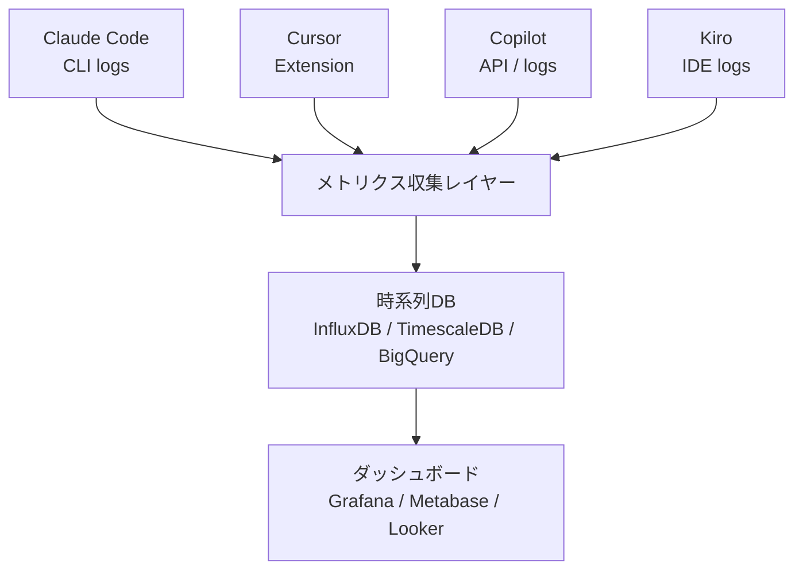

## 課題

コーディングエージェントの導入が組織全体で進むにつれ、「どのツールに統一すべきか」という議論が始まる。しかし、チームごとに技術スタック、開発手法、既存ツールとの親和性が異なる以上、ツール選定は現場が行うべきだ。一方で、組織として投資対効果を判断するには、横断的な可視化が不可欠になる。

本記事では、現場主導のツール選定と組織レベルの可視化を両立させる統合ダッシュボードの設計を考える。

## なぜトップダウンのツール選定は機能しないのか

コーディングエージェントは汎用ツールではない。フロントエンドチームがCursorのマルチファイル編集を重宝する一方で、インフラチームはClaude CodeのCLI統合を好むかもしれない。仕様駆動開発を重視するチームはKiroのSpec機能を活用するだろう。これを一律に統一すると、特定のチームの生産性が落ちる。

現場に選定を委ねるべき理由は3つある。

1. **スキルセットとの親和性** — チームメンバーの経験に合ったツールを選べる
2. **既存ワークフローとの統合** — CI/CD、コードレビュー、IDE設定に自然に組み込めるものを選べる
3. **評価の精度** — 実際に使うチームが評価することで、カタログスペックでは見えない差が分かる

重要なのは「勝手に選ばせる」のではなく「評価基準を共有した上で選定を委ねる」ことだ。組織が提示すべき評価基準は、たとえば「既存CI/CDへの統合容易性」「セキュリティポリシーへの準拠」「コスト上限」「チーム内での採用率目標」といった項目だ。技術的な優劣ではなく、組織として譲れない制約を明確にし、その範囲内での選定を現場に委ねる。

ただし、現場任せにも限界がある。ツールの種類が際限なく増えると、セキュリティレビューの負荷、ライセンス管理の複雑化、チーム間の知見共有の断絶といったコストが無視できなくなる。実用的な目安は「組織内で同時に運用するエージェントは3種類まで」だ。これを超えると、ツール管理のオーバーヘッドが選択の自由から得られる生産性向上を食い潰し始める。新しいエージェントを導入する場合は、既存のいずれかと置き換える形を原則とし、並行運用の期間を区切って評価する運用が現実的だ。

## 追跡すべき4つのメトリクス領域

統合ダッシュボードで追跡すべきメトリクスは、4つの領域に分かれる。

**使用状況** — エージェント別アクティブユーザー数、チーム別セッション数、機能別利用率（補完/チャット/生成）。使用量が多い＝良いとは限らない。過剰依存と未活用の両方を検出する。

**コスト** — エージェント別月間トークン消費量、チーム別コスト、1PRあたりの平均トークンコスト。絶対的なコストではなく成果物あたりのコストで評価することが鍵だ。月額\$5,000でもPRあたり\$1.50なら、手動で書くより安い可能性がある。

なお、ここでのコストはトークン消費やライセンス料といった直接コストだけではない。複数エージェントの運用では、ツールごとのオンボーディング資料の整備、社内サポート体制の維持、セキュリティレビューの実施といった間接コストも発生する。ダッシュボードで直接コストを可視化しつつ、間接コストは四半期レビューで定性的に評価するのが現実的だ。

**生産性** — PR作成頻度の変化、初回レビュー依頼までの時間、エージェント提案の採用率。行数での測定は落とし穴だ。大量のボイラープレートより的確な10行のロジックのほうが価値が高い。採用率のほうが質の指標として信頼性が高い。

**品質** — エージェント生成コードのレビュー修正率、ビルド成功率の変化、バグ発生率の推移。導入前後の比較が重要で、品質が維持されていれば生産性向上分がそのまま純利益になる。

## 「1PRあたりコスト」をどう算出するか

記事の中で最も重要な指標として「1PRあたりコスト」を挙げたが、これを正確に算出するのは見かけほど簡単ではない。エージェントのセッションログとPRを紐づける仕組みが必要だからだ。

最も現実的なアプローチは、**ブランチ名による紐づけ**だ。エージェントのセッションログにはたいていワーキングディレクトリやブランチ情報が含まれる。PRのソースブランチとマッチングすることで、そのPRに関連するエージェントセッションを特定できる。完全な精度は得られないが、チーム単位で集計すれば十分実用的な近似値になる。

さらに複雑なのは、1人の開発者が同一PR内で複数のエージェントを使い分けるケースだ。たとえば、Copilotでインライン補完を受けながら、複雑なリファクタリングはClaude Codeに任せる、という使い方はすでに一般的になりつつある。この場合、コストはPR単位で合算し、エージェント別の内訳も保持する。「このPRにはCopilotで\$0.80、Claude Codeで\$2.50、合計\$3.30かかった」という粒度だ。エージェント単体のコスト効率を見るためには内訳が必要だが、組織全体の投資判断には合計値で十分だ。

## エージェント間で比較できるもの、できないもの

横断ダッシュボードで最も危険なのは、異なるエージェントのメトリクスを単純比較することだ。

**比較可能なメトリクス：** コスト効率（1PRあたりコスト）、採用後の品質変化（バグ率推移）、チーム満足度スコア。これらは「エージェントの種類」ではなく「導入の成果」を測るため、横並びで見る意味がある。

**比較不可能なメトリクス：** コード生成行数、セッション時間、トークン消費量の絶対値。Claude Codeでの1セッションとCursorでの1セッションは、操作モデルが根本的に異なる。CLIベースのClaude Codeは長時間の自律実行が多く、IDEベースのCursorは短い対話の連続になる。同じ「セッション」でも意味が違う。

Kiroはさらに特殊だ。Spec作成→タスク分解→実装という仕様駆動フローを持つため、「Spec完了率」や「タスク達成率」といった独自メトリクスが生産性の指標になる。これを他のエージェントのメトリクスと横並びにしても意味がない。

ダッシュボードの設計では、横断比較パネルには比較可能なメトリクスだけを配置し、エージェント固有のメトリクスはチーム詳細ビューに分離すべきだ。

ここまでで「何を測るか」「何を比較できるか」を整理した。次に、メトリクスを収集する前提として避けて通れないセキュリティの話に移る。

## セキュリティとデータガバナンス

複数エージェントの並行運用では、セキュリティの管理面が単一ツールのときより格段に複雑になる。各エージェントがどのコードをどの外部サービスに送信しているかを把握する必要があるからだ。

最低限、組織として統一すべきポリシーは3つある。

1. **送信範囲の制御** — エージェントに送信されるコードのスコープを定義する。リポジトリ全体がコンテキストに入るのか、開いているファイルだけか。機密情報を含むディレクトリ（`.env`、認証情報、顧客データ関連）を除外するルールを全エージェント共通で設定する
2. **データ保持ポリシーの確認** — エージェントベンダーごとにデータの保持期間と学習への利用有無が異なる。ベンダーのデータポリシーの一覧表を作成し、コンプライアンス部門と共有する
3. **アクセス権限の統一管理** — どの開発者がどのエージェントを利用可能かを一元管理する。特にAPIキーの発行・失効をIT部門が管理できる仕組みが必要だ

これらのポリシーはダッシュボードの前提条件でもある。メトリクスを収集する以前に、各エージェントがセキュリティ基準を満たしているかの評価が先だ。

## メトリクス収集の技術設計

各エージェントはメトリクスの出力形式が異なるため、収集・正規化のレイヤーが鍵になる。



収集レイヤーの責務は、各エージェントのログ/APIからのデータ取得、共通スキーマへの正規化、タイムスタンプ・チーム・プロジェクトのメタデータ付与の3つだ。

### 共通スキーマ

異なるエージェントのデータを統一的に扱うには、共通スキーマが不可欠だ。

```json
{
  "timestamp": "2026-03-09T10:30:00Z",
  "agent": "claude-code",
  "agent_version": "1.2.0",
  "team": "frontend",
  "user_id": "user-123",
  "project": "web-app",
  "branch": "feat/user-profile",
  "event_type": "autonomous",
  "metrics": {
    "tokens_input": 1500,
    "tokens_output": 800,
    "latency_ms": 2300,
    "accepted": true
  },
  "metadata": {
    "cli_command": "implement user profile page",
    "tools_used": ["Read", "Edit", "Bash"]
  }
}
```

ポイントは3つある。まず、各エージェント固有のフィールドを `metadata` に分離し、共通フィールドでフィルタリング・集計を行う設計にすること。上のJSON例では `metrics` が全エージェント共通のフィールド、`metadata` がClaude Code固有の情報（CLIコマンドやツール呼び出し履歴）を格納している。Cursorなら `metadata` に補完のトリガーコンテキスト、Kiroなら関連するSpec IDが入る。次に、`branch` フィールドを含めることで、後からPRとの紐づけを可能にすること。そして、`event_type` を統一すること。これが最も難しい部分で、たとえばCursorの「Tab補完」とCopilotの「インライン補完」は似た機能だが、Claude Codeの「自律的なファイル編集」とは本質的に異なる。補完系を `completion`、対話系を `chat`、自律実行系を `autonomous` に分類するのが現実的だ。

### エージェント別の収集方法と現実的な制約

```text
Claude Code  → CLIログ (~/.claude/logs) + API使用量ダッシュボード
Cursor       → VS Code拡張テレメトリ + Cursorダッシュボード API
Copilot      → GitHub Copilot Metrics API (Organization単位)
Kiro         → IDEログ + Spec/タスク実行ログ
Cline        → VS Code拡張ログ + トークン使用量ログ
```

ここで把握しておくべきは、エージェントごとにデータの取得しやすさが大きく異なるという現実だ。GitHub CopilotはCopilot Metrics APIが最も成熟しており、Organization単位のアクティブユーザー数、言語別利用率、提案採用率などが構造化されたJSONで取得できる。これがダッシュボード構築の最も楽な出発点になる。

一方、Claude CodeはローカルのログファイルとコンソールのAPI使用量から情報を集める必要がある。ログにはセッション内容、トークン数、ツール呼び出し履歴が含まれるが、構造化されたAPIとして提供されているわけではないため、パーサーを自作する必要がある。Cursorも同様に、公式のメトリクスAPIが限定的で、拡張のテレメトリやダッシュボードから手動で情報を取る場面がある。

つまり、Phase 1で「取得できるメトリクスから始める」というのは妥協ではなく戦略だ。Copilotの構造化APIから始めて、他のエージェントは段階的にカバー範囲を広げるアプローチが現実的だ。

## ダッシュボードのビュー構成

ダッシュボードは2層構造にする。

**エグゼクティブビュー** — 組織全体のKPI（月間アクティブユーザー数、月間総コスト、1PRあたりコスト、提案採用率）をカード形式で配置し、エージェント別利用比率の円グラフとチーム別生産性スコアの推移グラフを並べる。経営層が月次で投資判断に使えるレベルの粒度を目指す。

**チーム詳細ビュー** — 各チームが自チームの使用エージェント、メンバー別利用率、週次トークン消費量、品質指標（レビュー修正率・ビルド成功率）を確認できるビュー。ここにはエージェント固有のメトリクス（KiroのSpec完了率、Claude Codeの自律実行成功率など）も含める。複数エージェントを併用しているチームでは、エージェントごとの利用比率と用途の内訳（補完はCopilot、自律実行はClaude Codeなど）を表示し、使い分けのパターンが見えるようにする。

重要なのは、エグゼクティブビューには個人単位のデータを載せないことだ。メトリクスを個人評価に使うと、開発者がツールの利用を避けるようになり、データの信頼性が失われる。

## メトリクスからアクションへ

ダッシュボードは意思決定を支援するためのものであり、眺めるためのものではない。メトリクスの変化が何を意味し、どう対処すべきかの基準を事前に定義しておく必要がある。

**コスト効率の悪化** — あるエージェントの1PRあたりコストが、チーム内の他のエージェントや組織平均の2倍以上に達した場合、利用パターンの調査を行う。原因は多くの場合、不要に長いコンテキストの送信、自律実行の空転（エラーループ）、あるいはそもそもそのタスクにエージェントが不向きであることだ。エージェントの問題ではなく使い方の問題であるケースが多いため、まずチーム内でのプラクティス共有を促す。

**採用率の極端な偏り** — チーム内でエージェントを活用しているメンバーとそうでないメンバーが明確に分かれている場合、ツール自体の問題ではなくオンボーディングの不足が原因であることが多い。ペアプログラミング形式でのエージェント利用体験セッションが効果的だ。

**品質指標の悪化** — 導入後にレビュー修正率やバグ率が上昇傾向を示した場合、エージェント生成コードのレビュープロセスを見直す。よくあるのは、エージェントが生成したコードを十分にレビューせずマージしてしまうパターンだ。「エージェントが書いたから正しい」というバイアスへの対策として、生成コードのレビューチェックリストを導入する。

**利用率の低迷** — 導入から1ヶ月経過しても週次アクティブ率が30%を下回る場合、ツールがチームのワークフローに合っていない可能性がある。このとき、別のエージェントへの切り替えを検討するのが合理的だ。「せっかく導入したから」というサンクコストに引きずられないことが重要で、ダッシュボードのデータがその判断を客観的に裏付けてくれる。

## 導入の進め方

この取り組みの推進主体はプラットフォームチームまたはDevOpsチームが適している。個別チームの生産性施策ではなく、組織横断のデータ基盤構築だからだ。推進主体は各チームのエージェント利用状況をヒアリングし、ダッシュボードの要件を定義する。ただし、ダッシュボードの消費者は経営層と各チームの両方であるため、要件定義の段階で双方の声を拾うことが重要だ。

**Phase 1（2週間）：** 各エージェントの利用可能なメトリクスを棚卸しし、共通スキーマを定義して収集パイプラインを構築する。最初から全メトリクスを取ろうとせず、Copilot Metrics APIのように構造化されたデータソースから着手する。Claude CodeやCursorのログパーサーは次のフェーズで段階的に追加すればよい。

**Phase 2（1週間）：** エグゼクティブビューを先に構築する。経営層の理解と支援を早期に得ることが施策の継続に不可欠だ。その後にチーム詳細ビューを追加する。

**Phase 3（継続）：** 月次レポートの自動生成、チーム間ベストプラクティスの横展開、ROI分析に基づくライセンス最適化を回す。四半期ごとの定性アンケートでダッシュボードに表れない効果（学習促進、設計品質向上、開発者体験）も補完する。特に「どのエージェントをどの用途で使い分けているか」を自由記述で聞くと、定量データでは捉えにくい使い分けパターンの発見につながる。

## まとめ

- **ツール選定は現場に、可視化は組織に** — 現場が最適なツールを選び、組織が横断的にデータを収集・分析する二層構造が、多様性と統制を両立させる鍵だ。
- **比較可能なメトリクスと不可能なメトリクスを分ける** — 1PRあたりコストや品質変化は横断比較できるが、セッション時間やコード生成行数はエージェント間で意味が異なる。混同するとミスリードを生む。
- **成果物あたりのコストで評価する** — ブランチ名でセッションとPRを紐づけ、エージェント別の内訳を保持しつつPR単位で合算する。複数エージェント併用が前提の時代には、この帰属ロジックの設計が肝になる。
- **メトリクスにアクション基準を紐づける** — 数値を眺めるだけのダッシュボードは形骸化する。コスト効率の悪化、採用率の偏り、品質指標の悪化それぞれに対して、いつ・誰が・何をするかを事前に定義しておく。
- **セキュリティポリシーを統一した上で多様性を許容する** — 複数エージェントの並行運用は、データガバナンスの複雑さを伴う。送信範囲、データ保持、アクセス権限の管理を全エージェント共通で整備することが前提条件だ。
- **取得できるデータから始める** — Copilot Metrics APIのように構造化されたソースから着手し、ログパーサーが必要なエージェントは段階的に追加する。完璧を目指すと永遠にダッシュボードが立ち上がらない。
