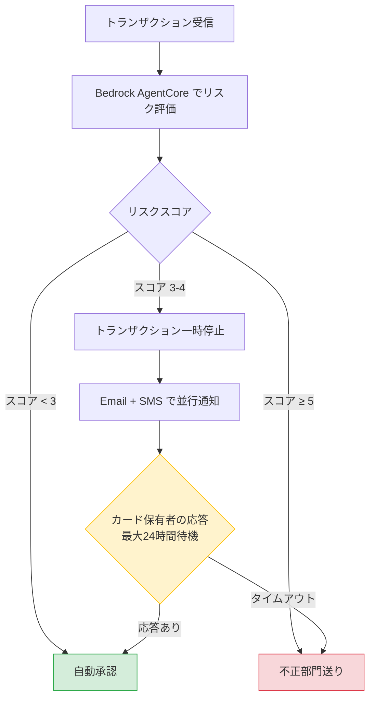

## はじめに

Lambda Durable Functions を金融系ワークフローでどう使えるのか。AWS が公開した[不正検知デモ](https://github.com/aws-samples/sample-lambda-durable-functions/tree/main/Industry%20Solutions/Financial%20Services%20(FSI)/FraudDetection)を実際にデプロイして検証した。このデモは [AWS Compute Blog のベストプラクティス記事](https://aws.amazon.com/blogs/compute/best-practices-for-lambda-durable-functions-using-a-fraud-detection-example/)（2026年3月23日公開）の題材でもある。

本記事は3部構成のシリーズの Part 1 だ。

- **Part 1（本記事）**: デモの全体像と3パターンの基本動作
- **[Part 2](/ja/blog/2026/03/26/lambda-durable-fraud-detection-best-practices)**: 6つのベストプラクティスの実機検証
- **[Part 3](/ja/blog/2026/03/26/lambda-durable-fraud-detection-operations)**: デプロイ・テスト・運用の知見

Durable Functions の基本概念（Step, Wait, Callback, Parallel）は[前回の記事](/ja/blog/2026/03/10/lambda-durable-functions-hands-on)で検証済みなので、本シリーズでは実践的なユースケースに焦点を当てる。

前提条件:

- AWS CLI v2、SAM CLI、Docker、Node.js 24.x
- 検証リージョン: us-east-2（Ohio）

## 不正検知ワークフローの全体像

このデモは、クレジットカードの不正検知を Durable Functions で実装している。Bedrock AgentCore のエージェントがリスクスコアを算出し、スコアに応じて3つのパスに分岐する。



Medium Risk（スコア 3-4）のパスが Durable Functions の真価を発揮する部分だ。24時間のコールバック待ちの間、Lambda のコンピュート課金は発生しない。従来なら SQS + DynamoDB + ポーリング Lambda で実装していた部分が、`waitForCallback` の1行で済む。

## デプロイ

SAM テンプレートで以下のリソースが作成される。

- Lambda 関数（Node.js 24.x、Durable 設定付き）
- Lambda Layer（依存パッケージ）
- Bedrock AgentCore Runtime（リスクスコア算出エージェント）
- IAM ロール（Lambda 用、AgentCore 用）
- S3 バケット（デプロイアーティファクト用）
- ECR リポジトリ（エージェントコンテナ用）

<details className="my-4 rounded-lg border border-border bg-muted/30 p-4">
<summary className="cursor-pointer font-medium">デプロイ手順</summary>

リポジトリをクローンし、デプロイスクリプトを実行する。

```bash title="Terminal"
git clone https://github.com/aws-samples/sample-lambda-durable-functions.git
cd "sample-lambda-durable-functions/Industry Solutions/Financial Services (FSI)/FraudDetection"
chmod +x deploy-sam.sh invoke-function.sh send-callback.sh
```

`deploy-sam.sh` は Docker イメージのビルド、Lambda パッケージの作成、S3 アップロード、SAM デプロイを一括で行う。ただし `tsc` がグローバルにインストールされていない場合はビルドが失敗する。その場合は `FraudDetection-Lambda/` ディレクトリで手動ビルドが必要だ。

```bash title="Terminal（手動ビルドが必要な場合）"
cd FraudDetection-Lambda
npm install
npx tsc  # deploy-sam.sh は tsc を直接呼ぶため失敗する場合がある
```

デプロイ完了後、Lambda 関数の設定を確認する。

```json title="Output（Lambda 設定）"
{
  "FunctionName": "fn-Fraud-Detection",
  "Runtime": "nodejs24.x",
  "Timeout": 120,
  "MemorySize": 128,
  "DurableConfig": {
    "RetentionPeriodInDays": 7,
    "ExecutionTimeout": 90000
  }
}
```

`ExecutionTimeout: 90000`（25時間）は、コールバックの24時間タイムアウトより少し長く設定されている。この設計意図は [Part 2](/ja/blog/2026/03/26/lambda-durable-fraud-detection-best-practices) で解説する。

</details>

検証結果だけ読みたい場合は[検証1](#検証1-low-risk自動承認)まで飛ばしてよい。

## ソースコードのポイント

Lambda 関数のコアロジックは `FraudDetection-Lambda/src/index.ts` にある。`withDurableExecution` でハンドラをラップし、`context.step()` でチェックポイントを作成する構造だ。ここでは検証に必要な2点だけ押さえておく。

1. **スコアに応じた分岐**: `score < 3` → 自動承認、`score >= 5` → 不正部門、`score 3-4` → 並行コールバック待ち
2. **エージェントはモック実装**: Bedrock AgentCore のエージェントは LLM を使わず、金額に基づく重み付きランダムでスコアを返す。6,500ドルは必ずスコア3を返すため、Medium Risk パスの検証に使える

## 検証1: Low Risk（自動承認）

500ドルのトランザクションを送信する。Durable Function の呼び出しには修飾付き ARN（`$LATEST` 付き）が必要だ。

```bash title="Terminal"
aws lambda invoke \
  --function-name "fn-Fraud-Detection:\$LATEST" \
  --invocation-type Event \
  --durable-execution-name "tx-low-risk-001" \
  --cli-binary-format raw-in-base64-out \
  --payload '{"id": 1, "amount": 500, "location": "Tokyo", "vendor": "Amazon.co.jp"}' \
  --region us-east-2 \
  response.json
```

非同期呼び出しのため、結果はレスポンスに含まれない。レスポンスの `DurableExecutionArn` を控えておき、10秒ほど待ってから `get-durable-execution` で確認する。

```bash title="Terminal（結果確認）"
aws lambda get-durable-execution \
  --durable-execution-arn "<DurableExecutionArn>" \
  --region us-east-2
```

```json title="Output（実行結果）"
{
  "DurableExecutionName": "tx-low-risk-001",
  "Status": "SUCCEEDED",
  "Result": {
    "statusCode": 200,
    "body": {
      "transaction_id": 1,
      "amount": 500,
      "fraud_score": 1,
      "result": "authorized"
    }
  }
}
```

スコア1で即座に `authorized`。開始から完了まで約3秒。`fraudCheck` → `authorize-1` の2ステップのみで完了している。

## 検証2: High Risk（不正部門送り）

10,000ドルのトランザクション。エージェントは必ずスコア5を返す。

```bash title="Terminal"
aws lambda invoke \
  --function-name "fn-Fraud-Detection:\$LATEST" \
  --invocation-type Event \
  --durable-execution-name "tx-high-risk-001" \
  --cli-binary-format raw-in-base64-out \
  --payload '{"id": 2, "amount": 10000, "location": "Unknown", "vendor": "Suspicious Store"}' \
  --region us-east-2 \
  response.json
```

同様に `get-durable-execution` で結果を確認する。

```json title="Output（実行結果）"
{
  "DurableExecutionName": "tx-high-risk-001",
  "Status": "SUCCEEDED",
  "Result": {
    "statusCode": 200,
    "body": {
      "transaction_id": 2,
      "amount": 10000,
      "fraud_score": 5,
      "result": "SentToFraudDept"
    }
  }
}
```

スコア5で `SentToFraudDept`。1秒未満で完了。Low Risk と同様、分岐後は1ステップで終了する。

## 検証3: Medium Risk（Human-in-the-loop）

6,500ドルのトランザクション。スコア3が返り、コールバック待ちに入る。

```bash title="Terminal（トランザクション送信）"
aws lambda invoke \
  --function-name "fn-Fraud-Detection:\$LATEST" \
  --invocation-type Event \
  --durable-execution-name "tx-medium-risk-001" \
  --cli-binary-format raw-in-base64-out \
  --payload '{"id": 3, "amount": 6500, "location": "Los Angeles", "vendor": "Electronics Store"}' \
  --region us-east-2 \
  response.json
```

10秒ほど待ってから実行状態を確認する。レスポンスに含まれる `DurableExecutionArn` を使う。

```bash title="Terminal（実行状態の確認）"
aws lambda get-durable-execution \
  --durable-execution-arn "<DurableExecutionArn>" \
  --region us-east-2
```

ステータスが `RUNNING` になっていることを確認する。Durable Functions ではサスペンド中（コールバック待ち）も `RUNNING` として表示される。確認したら、実行履歴を取得してコールバック ID を確認する。

```bash title="Terminal（実行履歴の取得）"
aws lambda get-durable-execution-history \
  --durable-execution-arn "<DurableExecutionArn>" \
  --region us-east-2 \
  --include-execution-data
```

実行履歴を確認すると、ワークフローの進行状況が詳細に追跡できる。

```text title="実行履歴（要約）"
EventId  EventType         Name                    Details
──────────────────────────────────────────────────────────────────
1        ExecutionStarted  tx-medium-risk-001      ExecutionTimeout: 90000
2        StepStarted       fraudCheck
3        StepSucceeded     fraudCheck              Result: 3
4        StepStarted       suspend-3
5        StepSucceeded     suspend-3               Result: true
6        ContextStarted    human-verification      (Parallel)
7        ContextStarted    parallel-branch-0       (ParallelBranch)
8        ContextStarted    SendVerificationEmail   (WaitForCallback)
9        CallbackStarted   (Email callback)        Timeout: 86400s
10       ContextStarted    parallel-branch-1       (ParallelBranch)
11       ContextStarted    SendVerificationSMS     (WaitForCallback)
12       CallbackStarted   (SMS callback)          Timeout: 86400s
17       InvocationCompleted                       Duration: ~730ms
```

`fraudCheck`（スコア3）→ `suspend-3` → `human-verification`（Parallel）と進み、Email と SMS の2つのコールバック待ちに入っている。`InvocationCompleted` は約730ms で、ここまでのアクティブ処理時間だ。この後はサスペンド状態になり、コンピュート課金は発生しない。

コールバック ID は実行履歴の `CallbackStartedDetails.CallbackId` から取得できる。Email のコールバックを送信してワークフローを再開する。

```bash title="Terminal（コールバック送信）"
aws lambda send-durable-execution-callback-success \
  --callback-id "<EMAIL_CALLBACK_ID>" \
  --result '{"status":"approved","channel":"email"}' \
  --cli-binary-format raw-in-base64-out \
  --region us-east-2
```

```json title="Output（最終結果）"
{
  "DurableExecutionName": "tx-medium-risk-001",
  "Status": "SUCCEEDED",
  "Result": {
    "statusCode": 200,
    "body": {
      "transaction_id": 3,
      "amount": 6500,
      "fraud_score": 3,
      "result": "authorized",
      "customerVerificationResult": "TransactionApproved"
    }
  }
}
```

Email コールバック1つで `SUCCEEDED` になった。SMS のコールバックは待たずにワークフローが完了している。これは `minSuccessful: 1` の設定による first-response-wins パターンだ。

## 3パターンの比較

| パターン | 金額 | スコア | 結果 | 所要時間 |
|---|---|---|---|---|
| Low Risk | 500ドル | 1 | authorized | 約3秒 |
| High Risk | 10,000ドル | 5 | SentToFraudDept | 1秒未満 |
| Medium Risk | 6,500ドル | 3 | authorized（コールバック後） | サスペンド時間 + 数秒 |

Low Risk と High Risk は数秒で完了する単純な分岐だ。Medium Risk だけが Durable Functions の本領を発揮する。サスペンド中はコンピュート課金ゼロで、コールバック受信後に数秒で再開・完了する。

## まとめ

- **サスペンド中のコンピュート課金ゼロが最大の価値** — Medium Risk パスでは24時間のコールバック待ちが発生するが、その間の Lambda 課金はゼロだ。従来なら SQS + DynamoDB + ポーリング Lambda で実装していた部分が、`waitForCallback` の1行で済む。
- **実行履歴で全ステップを追跡できる** — `get-durable-execution-history` で各ステップの開始・完了・結果が時系列で確認できる。デバッグや監査に有用だ。
- **エージェントのモック実装はデモとして適切** — 実際の LLM を使わず重み付きランダムでスコアを返すため、検証の再現性が高い。6,500ドルで必ず Medium Risk パスに入れるのは便利だ。

次の [Part 2](/ja/blog/2026/03/26/lambda-durable-fraud-detection-best-practices) では、このデモを使って記事に記載された6つのベストプラクティスを実機検証する。
