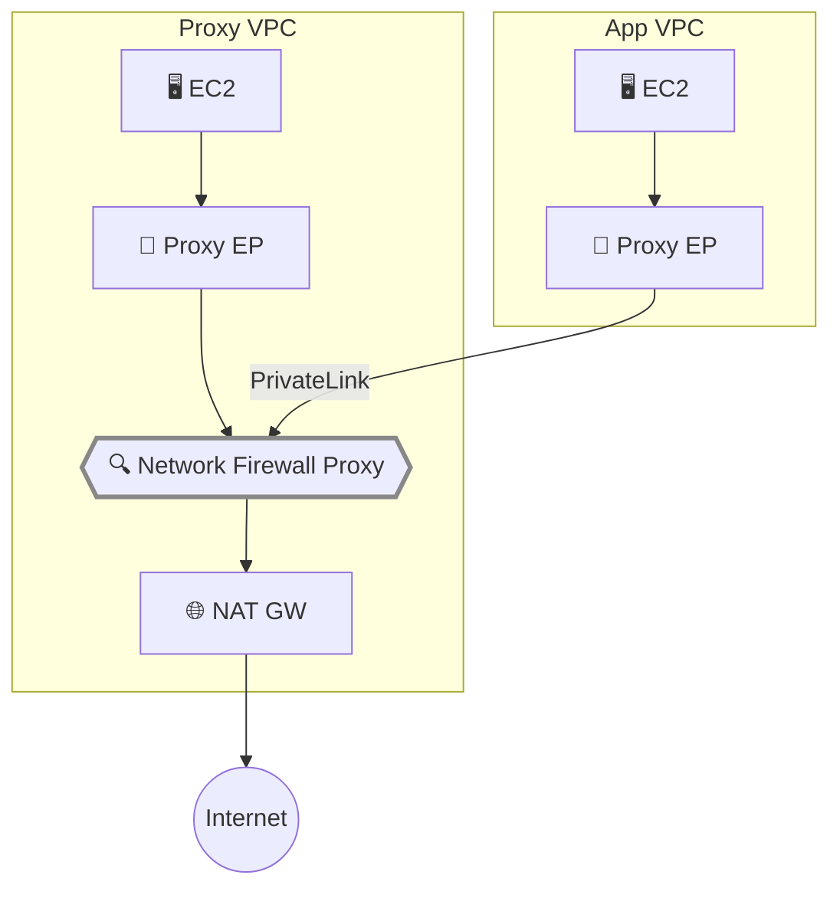

## はじめに

[第1回](/ja/blog/2026/03/26/nfw-proxy-setup-domain-filtering)では単一 VPC 内でのドメインフィルタリング、[第2回](/ja/blog/2026/03/26/nfw-proxy-tls-interception)では TLS インターセプトによる HTTP レイヤーの検査を検証した。実際の運用では複数の VPC からの Egress トラフィックを1つのプロキシで集中管理したいケースが多い。

この記事では、Proxy VPC とは別のアプリケーション VPC から PrivateLink エンドポイント経由でプロキシにアクセスする集中型構成を検証する。VPC ごとに異なるポリシーを適用できるか、ソース識別の制約は何かを確認した。

**Network Firewall Proxy は Public Preview 段階であり、仕様や動作は GA までに変更される可能性がある。本記事の内容は 2026年3月時点の動作に基づいている。**

前提条件:

- [第1回](/ja/blog/2026/03/26/nfw-proxy-setup-domain-filtering)で構築した Proxy 環境
- 追加の VPC を作成する権限

## アーキテクチャ

[公式ドキュメント](https://docs.aws.amazon.com/network-firewall/latest/developerguide/proxy-architecture-overview.html)では3つのアーキテクチャが紹介されている。

| モデル | 構成 | 適用場面 |
|---|---|---|
| **Dedicated VPC** | VPC ごとに Proxy + NAT Gateway を配置 | VPC 間で完全に独立したポリシーが必要な場合 |
| **Centralized（エンドポイント）** | 1つの Proxy VPC + 各 VPC に PrivateLink エンドポイント | ルーティング変更不要、最もシンプル |
| **Centralized（Transit Gateway）** | Transit Gateway 経由で集中 Proxy にルーティング | 既存の TGW/Cloud WAN がある場合 |

今回は **Centralized（エンドポイント）モデル** を検証する。PrivateLink エンドポイントを使うため、各 VPC のルートテーブル変更が不要で、最も導入が容易だ。



## アプリケーション VPC の構築

<details className="my-4 rounded-lg border border-border bg-muted/30 p-4">
<summary className="cursor-pointer font-medium">アプリケーション VPC の作成（VPC + サブネット + EC2）</summary>

```bash title="Terminal"
# アプリケーション VPC
APP_VPC_ID=$(aws ec2 create-vpc --cidr-block 10.2.0.0/16 \
  --tag-specifications 'ResourceType=vpc,Tags=[{Key=Name,Value=nfw-proxy-app-vpc}]' \
  --region us-east-2 --query 'Vpc.VpcId' --output text)

aws ec2 modify-vpc-attribute --vpc-id "$APP_VPC_ID" --enable-dns-support '{"Value": true}' --region us-east-2
aws ec2 modify-vpc-attribute --vpc-id "$APP_VPC_ID" --enable-dns-hostnames '{"Value": true}' --region us-east-2

# プライベートサブネット（NAT Gateway なし — プロキシ経由でのみインターネットにアクセス）
APP_SUBNET=$(aws ec2 create-subnet --vpc-id "$APP_VPC_ID" --cidr-block 10.2.1.0/24 \
  --availability-zone us-east-2a \
  --tag-specifications 'ResourceType=subnet,Tags=[{Key=Name,Value=nfw-proxy-app-private}]' \
  --region us-east-2 --query 'Subnet.SubnetId' --output text)

# SSM エンドポイント（プライベートサブネットからの管理用）
APP_SSM_SG=$(aws ec2 create-security-group --group-name nfw-proxy-app-ssm-sg \
  --description "SSM endpoints for app VPC" --vpc-id "$APP_VPC_ID" \
  --region us-east-2 --query 'GroupId' --output text)
aws ec2 authorize-security-group-ingress --group-id "$APP_SSM_SG" \
  --ip-permissions "[{\"IpProtocol\":\"tcp\",\"FromPort\":443,\"ToPort\":443,\"IpRanges\":[{\"CidrIp\":\"10.2.0.0/16\"}]}]" \
  --region us-east-2 > /dev/null

for svc in ssm ssmmessages ec2messages; do
  aws ec2 create-vpc-endpoint --vpc-id "$APP_VPC_ID" \
    --service-name com.amazonaws.us-east-2.$svc \
    --vpc-endpoint-type Interface --subnet-ids "$APP_SUBNET" \
    --security-group-ids "$APP_SSM_SG" --private-dns-enabled \
    --region us-east-2 > /dev/null
done

# EC2 テストインスタンス
APP_EC2_SG=$(aws ec2 create-security-group --group-name nfw-proxy-app-ec2-sg \
  --description "App VPC test instance" --vpc-id "$APP_VPC_ID" \
  --region us-east-2 --query 'GroupId' --output text)

APP_INSTANCE=$(aws ec2 run-instances --image-id ami-0b0b78dcacbab728f \
  --instance-type t3.micro --subnet-id "$APP_SUBNET" \
  --security-group-ids "$APP_EC2_SG" \
  --iam-instance-profile Name=nfw-proxy-test-profile \
  --tag-specifications 'ResourceType=instance,Tags=[{Key=Name,Value=nfw-proxy-app-client}]' \
  --region us-east-2 --query 'Instances[0].InstanceId' --output text)

echo "App VPC: $APP_VPC_ID, Subnet: $APP_SUBNET, EC2: $APP_INSTANCE"
```

このアプリケーション VPC には NAT Gateway がない。インターネットへのアクセスはプロキシ経由でのみ可能だ。

</details>

## プロキシエンドポイントの作成

アプリケーション VPC からプロキシにアクセスするために、PrivateLink エンドポイントを作成する。Proxy VPC 内のエンドポイントは Proxy 作成時に自動生成されるが、**他の VPC のエンドポイントは手動で作成する必要がある**。

```bash title="Terminal"
# Proxy の VPC Endpoint Service 名を取得
VPCE_SERVICE=$(aws network-firewall describe-proxy --proxy-name nfw-proxy-test \
  --region us-east-2 --query 'Proxy.VpcEndpointServiceName' --output text)
echo "Service: $VPCE_SERVICE"
```

<details className="my-4 rounded-lg border border-border bg-muted/30 p-4">
<summary className="cursor-pointer font-medium">プロキシエンドポイントの作成</summary>

```bash title="Terminal"
# プロキシポート用 SG
PROXY_EP_SG=$(aws ec2 create-security-group --group-name nfw-proxy-app-proxy-ep-sg \
  --description "Proxy endpoint in app VPC" --vpc-id "$APP_VPC_ID" \
  --region us-east-2 --query 'GroupId' --output text)

aws ec2 authorize-security-group-ingress --group-id "$PROXY_EP_SG" \
  --ip-permissions '[
    {"IpProtocol":"tcp","FromPort":1080,"ToPort":1080,"IpRanges":[{"CidrIp":"10.2.0.0/16"}]},
    {"IpProtocol":"tcp","FromPort":443,"ToPort":443,"IpRanges":[{"CidrIp":"10.2.0.0/16"}]}
  ]' --region us-east-2 > /dev/null

# VPC エンドポイント作成（Private DNS 有効）
aws ec2 create-vpc-endpoint \
  --vpc-id "$APP_VPC_ID" \
  --service-name "$VPCE_SERVICE" \
  --vpc-endpoint-type Interface \
  --subnet-ids "$APP_SUBNET" \
  --security-group-ids "$PROXY_EP_SG" \
  --private-dns-enabled \
  --tag-specifications 'ResourceType=vpc-endpoint,Tags=[{Key=Name,Value=nfw-proxy-app-proxy-ep}]' \
  --region us-east-2
```

Private DNS を有効にすると、プロキシの FQDN がアプリケーション VPC 内でローカルのエンドポイント IP に解決される。Proxy VPC と同じ DNS 名をそのまま使える。

</details>

エンドポイントが `available` になるまで約2分待つ。

```bash title="Terminal"
aws ec2 describe-vpc-endpoints --vpc-endpoint-ids vpce-xxx \
  --region us-east-2 --query 'VpcEndpoints[0].State'
```

## 検証 1: クロス VPC アクセス

アプリケーション VPC の EC2 から、Proxy VPC のプロキシ経由でインターネットにアクセスする。

```bash title="Terminal"
export http_proxy=http://<proxy-dns>:1080
export https_proxy=http://<proxy-dns>:1080
export no_proxy=169.254.169.254

# DNS 解決の確認（ローカル VPC 内の IP に解決される）
dig +short <proxy-dns>
# → 10.2.1.203（アプリケーション VPC 内の IP）

# 許可ドメイン
curl -s -o /dev/null -w "%{http_code}\n" --max-time 15 http://example.com/

# 拒否ドメイン
curl -s -o /dev/null -w "%{http_code}\n" --max-time 15 http://google.com/
```

| テスト | 期待 | 結果 |
|---|---|---|
| DNS 解決 | App VPC 内の IP | ✅ `10.2.1.203` |
| `http://example.com/` | ALLOW | ✅ **200** |
| `http://google.com/` | DENY | ✅ **403** |

アプリケーション VPC には NAT Gateway がないが、プロキシエンドポイント経由で Proxy VPC の NAT Gateway を通じてインターネットにアクセスできた。ルートテーブルの変更は一切不要だ。

## 検証 2: SourceVpc による VPC 別ポリシー

VPC ごとに異なるアクセスポリシーを適用できるか検証する。`request:SourceVpc` 条件を使って、アプリケーション VPC からのみ httpbin.org へのアクセスを許可するルールを作成した。

<details className="my-4 rounded-lg border border-border bg-muted/30 p-4">
<summary className="cursor-pointer font-medium">SourceVpc ルールの作成</summary>

```bash title="Terminal"
aws network-firewall create-proxy-rule-group \
  --proxy-rule-group-name multi-vpc-rules \
  --description "Multi-VPC source-based rules" \
  --region us-east-2

aws network-firewall create-proxy-rules \
  --proxy-rule-group-name multi-vpc-rules \
  --rules '{
    "PreDNS": [
      {
        "ProxyRuleName": "allow-from-app-vpc",
        "Description": "Allow httpbin.org from app VPC only",
        "Action": "ALLOW",
        "InsertPosition": 0,
        "Conditions": [
          {"ConditionKey":"request:SourceVpc","ConditionOperator":"StringEquals","ConditionValues":["<app-vpc-id>"]},
          {"ConditionKey":"request:DestinationDomain","ConditionOperator":"StringEquals","ConditionValues":["httpbin.org"]}
        ]
      },
      {
        "ProxyRuleName": "allow-example-all",
        "Description": "Allow example.com from any source",
        "Action": "ALLOW",
        "InsertPosition": 1,
        "Conditions": [
          {"ConditionKey":"request:DestinationDomain","ConditionOperator":"StringEquals","ConditionValues":["example.com"]}
        ]
      }
    ]
  }' --region us-east-2
```

`<app-vpc-id>` はアプリケーション VPC の ID に置き換える。

Proxy Configuration のルールグループを差し替える（第1回と同じ手順）。

```bash title="Terminal"
# 既存のルールグループをデタッチ
TOKEN=$(aws network-firewall describe-proxy-configuration \
  --proxy-configuration-name domain-allowlist-config \
  --query UpdateToken --output text --region us-east-2)

aws network-firewall detach-rule-groups-from-proxy-configuration \
  --proxy-configuration-name domain-allowlist-config \
  --rule-group-names domain-allowlist \
  --update-token "$TOKEN" --region us-east-2

# multi-vpc-rules をアタッチ
TOKEN=$(aws network-firewall describe-proxy-configuration \
  --proxy-configuration-name domain-allowlist-config \
  --query UpdateToken --output text --region us-east-2)

aws network-firewall attach-rule-groups-to-proxy-configuration \
  --proxy-configuration-name domain-allowlist-config \
  --rule-groups '[{"InsertPosition":0,"ProxyRuleGroupName":"multi-vpc-rules"}]' \
  --update-token "$TOKEN" --region us-east-2
```

</details>

```bash title="Terminal (App VPC の EC2 で実行)"
curl -s -o /dev/null -w "%{http_code}\n" --max-time 15 http://httpbin.org/get
curl -s -o /dev/null -w "%{http_code}\n" --max-time 15 http://example.com/
```

```bash title="Terminal (Proxy VPC の EC2 で実行)"
curl -s -o /dev/null -w "%{http_code}\n" --max-time 15 http://httpbin.org/get
curl -s -o /dev/null -w "%{http_code}\n" --max-time 15 http://example.com/
```

| テスト | ソース | ドメイン | 期待 | 結果 |
|---|---|---|---|---|
| App VPC → httpbin.org | App VPC ✅ | httpbin.org ✅ | ALLOW | ✅ **200** |
| App VPC → example.com | any | example.com ✅ | ALLOW | ✅ **200** |
| Proxy VPC → httpbin.org | Proxy VPC ❌ | httpbin.org ✅ | DENY | ✅ **403** |
| Proxy VPC → example.com | any | example.com ✅ | ALLOW | ✅ **200** |

`request:SourceVpc` は PrivateLink エンドポイント経由のクロス VPC アクセスでも正しく識別された。VPC ごとに異なるドメインポリシーを適用できる。

## 検証 3: SourceIp の NAT 制約

PrivateLink エンドポイント経由のアクセスでは、ソース IP がエンドポイントの ENI の IP に NAT される。[公式ブログ](https://aws.amazon.com/blogs/networking-and-content-delivery/securing-egress-architectures-with-network-firewall-proxy/)でも VPC Lattice / NLB 統合時に「source traffic is NATed」と記載されているが、直接の PrivateLink エンドポイント経由でも同様だった。

App VPC EC2 の IP（`10.2.1.52`）を指定した SourceIp ルールを追加して検証する。

<details className="my-4 rounded-lg border border-border bg-muted/30 p-4">
<summary className="cursor-pointer font-medium">SourceIp ルールの追加</summary>

```bash title="Terminal"
aws network-firewall create-proxy-rules \
  --proxy-rule-group-name multi-vpc-rules \
  --rules '{
    "PreDNS": [{
      "ProxyRuleName": "allow-from-app-ip",
      "Description": "Allow google.com from app EC2 IP",
      "Action": "ALLOW",
      "InsertPosition": 2,
      "Conditions": [
        {"ConditionKey":"request:SourceIp","ConditionOperator":"IpAddress","ConditionValues":["<app-ec2-ip>/32"]},
        {"ConditionKey":"request:DestinationDomain","ConditionOperator":"StringEquals","ConditionValues":["google.com"]}
      ]
    }]
  }' --region us-east-2
```

`<app-ec2-ip>` は App VPC EC2 のプライベート IP に置き換える。

</details>

```bash title="Terminal (App VPC の EC2 で実行)"
# 自分の IP を確認
hostname -I
# → 10.2.1.52

# SourceIp ルールにマッチするはずだが...
curl -s -o /dev/null -w "%{http_code}\n" --max-time 15 http://google.com/
# → 403（SourceIp がマッチしない — NAT されている）
```

| 条件キー | クロス VPC（PrivateLink 経由） | 同一 VPC |
|---|---|---|
| `request:SourceVpc` | ✅ 正しく識別（検証済み） | ✅ |
| `request:SourceVpce` | ✅ エンドポイント ID で識別可能（未検証） | ✅ |
| `request:SourceIp` | ❌ NAT されるため元の IP が見えない（検証済み） | ✅ |
| `request:SourceAccount` | ✅ アカウント ID で識別可能（未検証） | ✅ |

クロス VPC 構成でソースを識別するには、`SourceVpc` または `SourceVpce` を使う。`SourceIp` はクロス VPC では使えない。

## まとめ

- **PrivateLink エンドポイントだけでクロス VPC 構成が完成する** — アプリケーション VPC に NAT Gateway もルートテーブル変更も不要。エンドポイントを作成して `http_proxy` を設定するだけで、集中プロキシ経由のインターネットアクセスが実現する
- **SourceVpc で VPC 別ポリシーが実現できる** — PrivateLink 経由でも VPC ID は正しく識別される。開発 VPC と本番 VPC で異なるドメインポリシーを適用するといったユースケースに対応可能
- **SourceIp はクロス VPC では使えない** — PrivateLink エンドポイント経由のトラフィックはエンドポイントの ENI IP に NAT される。IP ベースの制御が必要な場合は同一 VPC 構成にするか、`SourceVpc` / `SourceVpce` で代替する

## クリーンアップ

<details className="my-4 rounded-lg border border-border bg-muted/30 p-4">
<summary className="cursor-pointer font-medium">シリーズ全体のリソース削除コマンド</summary>

```bash title="Terminal"
# === Proxy リソース ===
# Proxy 削除（NAT Gateway からデタッチ）
aws network-firewall delete-proxy --proxy-name nfw-proxy-test \
  --nat-gateway-id nat-xxx --region us-east-2

# Proxy Configuration 削除
aws network-firewall delete-proxy-configuration \
  --proxy-configuration-name domain-allowlist-config --region us-east-2

# ルールグループ削除
for rg in domain-allowlist domain-denylist source-based-control tls-intercept-rules multi-vpc-rules; do
  aws network-firewall delete-proxy-rule-group \
    --proxy-rule-group-name "$rg" --region us-east-2 2>/dev/null
done

# === ACM PCA ===
# PCA ポリシー削除
aws acm-pca delete-policy --resource-arn <ROOT_PCA_ARN> --region us-east-2

# RAM 共有削除
for share_arn in $(aws ram get-resource-shares --resource-owner SELF --region us-east-2 \
  --query 'resourceShares[?status==`ACTIVE`].resourceShareArn' --output text); do
  aws ram delete-resource-share --resource-share-arn "$share_arn" --region us-east-2
done

# PCA を無効化して削除（月額課金を停止）
aws acm-pca update-certificate-authority \
  --certificate-authority-arn <ROOT_PCA_ARN> --status DISABLED --region us-east-2
aws acm-pca delete-certificate-authority \
  --certificate-authority-arn <ROOT_PCA_ARN> \
  --permanent-deletion-time-in-days 7 --region us-east-2
# Subordinate CA も同様に削除

# === アプリケーション VPC ===
aws ec2 terminate-instances --instance-ids <app-instance-id> --region us-east-2
# VPC エンドポイント削除（プロキシ EP + SSM EP）
aws ec2 delete-vpc-endpoints --vpc-endpoint-ids vpce-xxx vpce-xxx vpce-xxx vpce-xxx \
  --region us-east-2
# SG、サブネット、VPC を順に削除
aws ec2 delete-security-group --group-id sg-xxx --region us-east-2
aws ec2 delete-subnet --subnet-id subnet-xxx --region us-east-2
aws ec2 delete-vpc --vpc-id vpc-xxx --region us-east-2

# === Proxy VPC ===
aws ec2 terminate-instances --instance-ids <proxy-instance-id> --region us-east-2
aws ec2 delete-vpc-endpoints --vpc-endpoint-ids vpce-xxx vpce-xxx vpce-xxx vpce-xxx \
  --region us-east-2
aws ec2 delete-nat-gateway --nat-gateway-id nat-xxx --region us-east-2
# NAT Gateway 削除完了を待つ（数分）
aws ec2 release-address --allocation-id eipalloc-xxx --region us-east-2
aws ec2 detach-internet-gateway --internet-gateway-id igw-xxx --vpc-id vpc-xxx --region us-east-2
aws ec2 delete-internet-gateway --internet-gateway-id igw-xxx --region us-east-2
aws ec2 delete-subnet --subnet-id subnet-xxx --region us-east-2
aws ec2 delete-subnet --subnet-id subnet-xxx --region us-east-2
aws ec2 delete-route-table --route-table-id rtb-xxx --region us-east-2
aws ec2 delete-route-table --route-table-id rtb-xxx --region us-east-2
aws ec2 delete-vpc --vpc-id vpc-xxx --region us-east-2

# === IAM ===
aws iam remove-role-from-instance-profile \
  --instance-profile-name nfw-proxy-test-profile --role-name nfw-proxy-test-role
aws iam delete-instance-profile --instance-profile-name nfw-proxy-test-profile
aws iam detach-role-policy --role-name nfw-proxy-test-role \
  --policy-arn arn:aws:iam::aws:policy/AmazonSSMManagedInstanceCore
aws iam delete-role --role-name nfw-proxy-test-role

# === S3（第2回で使用した場合） ===
aws s3 rb s3://nfw-proxy-test-certs-<account-id> --force --region us-east-2
```

Proxy の削除には数分かかる。NAT Gateway の削除も完了を待ってから EIP を解放する。PCA は `delete-certificate-authority` で削除しても7日間の猶予期間がある。

</details>
