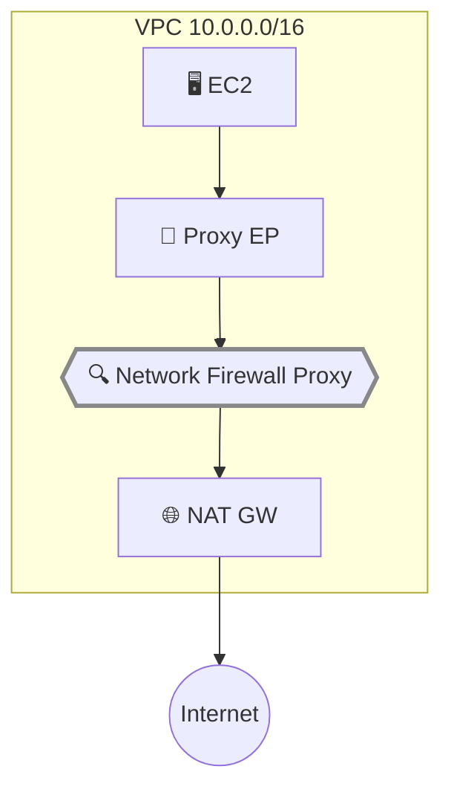

## はじめに

2025年11月、AWS は [Network Firewall Proxy の Public Preview を発表](https://aws.amazon.com/about-aws/whats-new/2025/11/aws-network-firewall-proxy-preview/)した。従来、VPC からの Egress トラフィックをドメインレベルで制御するには、EC2 やコンテナ上に Squid などのプロキシを自前で構築・運用する必要があった。Network Firewall Proxy はこの運用負荷を AWS に委譲し、NAT Gateway に統合されたマネージドプロキシとしてドメインフィルタリングを提供する。

この記事では、実際に us-east-2 リージョンで Network Firewall Proxy をセットアップし、ドメインベースの Egress フィルタリングを検証した結果を共有する。[公式ドキュメント](https://docs.aws.amazon.com/network-firewall/latest/developerguide/network-firewall-proxy-developer-guide.html)も参照してほしい。

**Network Firewall Proxy は Public Preview 段階であり、仕様や動作は GA までに変更される可能性がある。本記事の内容は 2026年3月時点の動作に基づいている。Preview 期間中は us-east-2（Ohio）リージョンのみで利用可能で、料金は無料だ。本番ワークロードへの適用は GA を待つことを推奨する。**

前提条件:

- AWS CLI が設定済み（Network Firewall、EC2、IAM、SSM の権限）
- テストリージョン: us-east-2（Ohio）

検証結果だけ見たい場合は[検証 1: ドメイン許可リスト](#検証-1-ドメイン許可リストallowlist)までスキップできる。

## Network Firewall Proxy の仕組み

従来の Network Firewall はルーティングベースの透過型ファイアウォールだが、Network Firewall Proxy は**明示的プロキシ**として動作する。クライアントは `HTTP_PROXY` / `HTTPS_PROXY` 環境変数でプロキシを指定する。HTTPS の場合は HTTP CONNECT リクエストでトンネルを確立し、HTTP の場合は absolute-form（`GET http://example.com/ HTTP/1.1`）でリクエストを送信する。

トラフィックは3つのフェーズで検査される:

| フェーズ         | タイミング            | 検査可能な属性                                                             |
| ---------------- | --------------------- | -------------------------------------------------------------------------- |
| **PreDNS**       | DNS 解決前            | 宛先ドメイン、ソース IP/VPC/アカウント                                     |
| **PreRequest**   | HTTP リクエスト送信前 | 宛先 IP/ポート、HTTP メソッド、URI パス、ヘッダー（TLS インターセプト時）  |
| **PostResponse** | HTTP レスポンス受信後 | ステータスコード、Content-Type、レスポンスヘッダー（TLS インターセプト時） |

各フェーズで DENY がマッチすると即座にブロックされ、後続フェーズは評価されない。ALLOW は現在のフェーズの評価を終了するが、後続フェーズの評価は継続する。

重要な制約として、**Preview 時点では HTTP/1.1 のみサポート**されている。HTTP/2 や HTTP/3 のトラフィックはドロップまたはタイムアウトになる。

今回の記事では TLS インターセプトなしの構成で PreDNS フェーズの検証を行う。PreRequest / PostResponse フェーズは TLS インターセプトが必要なため、次回の記事で扱う。



## 環境構築

<details className="my-4 rounded-lg border border-border bg-muted/30 p-4">
<summary className="cursor-pointer font-medium">環境構築手順（VPC + NAT Gateway + EC2）</summary>

### VPC とサブネット

```bash title="Terminal"
# VPC 作成（DNS サポート・ホスト名を有効化）
aws ec2 create-vpc --cidr-block 10.0.0.0/16 \
  --tag-specifications 'ResourceType=vpc,Tags=[{Key=Name,Value=nfw-proxy-test}]' \
  --region us-east-2

aws ec2 modify-vpc-attribute --vpc-id vpc-xxx \
  --enable-dns-support '{"Value": true}' --region us-east-2
aws ec2 modify-vpc-attribute --vpc-id vpc-xxx \
  --enable-dns-hostnames '{"Value": true}' --region us-east-2

# パブリックサブネット（NAT Gateway 用）
aws ec2 create-subnet --vpc-id vpc-xxx --cidr-block 10.0.1.0/24 \
  --availability-zone us-east-2a \
  --tag-specifications 'ResourceType=subnet,Tags=[{Key=Name,Value=nfw-proxy-public}]' \
  --region us-east-2

# プライベートサブネット（テスト EC2 用）
aws ec2 create-subnet --vpc-id vpc-xxx --cidr-block 10.0.2.0/24 \
  --availability-zone us-east-2a \
  --tag-specifications 'ResourceType=subnet,Tags=[{Key=Name,Value=nfw-proxy-private}]' \
  --region us-east-2
```

### Internet Gateway と NAT Gateway

```bash title="Terminal"
# IGW
aws ec2 create-internet-gateway \
  --tag-specifications 'ResourceType=internet-gateway,Tags=[{Key=Name,Value=nfw-proxy-igw}]' \
  --region us-east-2
aws ec2 attach-internet-gateway --internet-gateway-id igw-xxx \
  --vpc-id vpc-xxx --region us-east-2

# EIP + NAT Gateway
aws ec2 allocate-address --domain vpc --region us-east-2
aws ec2 create-nat-gateway --subnet-id subnet-public-xxx \
  --allocation-id eipalloc-xxx \
  --tag-specifications 'ResourceType=natgateway,Tags=[{Key=Name,Value=nfw-proxy-natgw}]' \
  --region us-east-2
```

### ルートテーブル

```bash title="Terminal"
# パブリック: 0.0.0.0/0 → IGW
aws ec2 create-route-table --vpc-id vpc-xxx --region us-east-2
aws ec2 create-route --route-table-id rtb-public-xxx \
  --destination-cidr-block 0.0.0.0/0 --gateway-id igw-xxx --region us-east-2
aws ec2 associate-route-table --route-table-id rtb-public-xxx \
  --subnet-id subnet-public-xxx --region us-east-2

# プライベート: 0.0.0.0/0 → NAT Gateway
aws ec2 create-route-table --vpc-id vpc-xxx --region us-east-2
aws ec2 create-route --route-table-id rtb-private-xxx \
  --destination-cidr-block 0.0.0.0/0 --nat-gateway-id nat-xxx --region us-east-2
aws ec2 associate-route-table --route-table-id rtb-private-xxx \
  --subnet-id subnet-private-xxx --region us-east-2
```

### EC2 テストインスタンス（SSM 接続）

```bash title="Terminal"
# IAM ロール（SSM 用）
aws iam create-role --role-name nfw-proxy-test-role \
  --assume-role-policy-document '{"Version":"2012-10-17","Statement":[{"Effect":"Allow","Principal":{"Service":"ec2.amazonaws.com"},"Action":"sts:AssumeRole"}]}'
aws iam attach-role-policy --role-name nfw-proxy-test-role \
  --policy-arn arn:aws:iam::aws:policy/AmazonSSMManagedInstanceCore
aws iam create-instance-profile --instance-profile-name nfw-proxy-test-profile
aws iam add-role-to-instance-profile \
  --instance-profile-name nfw-proxy-test-profile --role-name nfw-proxy-test-role

# SSM VPC エンドポイント（プライベートサブネット用）
for svc in ssm ssmmessages ec2messages; do
  aws ec2 create-vpc-endpoint --vpc-id vpc-xxx \
    --service-name com.amazonaws.us-east-2.$svc \
    --vpc-endpoint-type Interface --subnet-ids subnet-private-xxx \
    --security-group-ids sg-ssm-xxx --private-dns-enabled \
    --region us-east-2
done

# EC2 起動
aws ec2 run-instances --image-id ami-xxx --instance-type t3.micro \
  --subnet-id subnet-private-xxx --security-group-ids sg-xxx \
  --iam-instance-profile Name=nfw-proxy-test-profile \
  --tag-specifications 'ResourceType=instance,Tags=[{Key=Name,Value=nfw-proxy-test-client}]' \
  --region us-east-2
```

</details>

## Proxy のセットアップ

Proxy のセットアップは3ステップで行う: ルールグループ → Proxy Configuration → Proxy 作成。

<details className="my-4 rounded-lg border border-border bg-muted/30 p-4">
<summary className="cursor-pointer font-medium">Step 1: ルールグループの作成（許可ドメインの定義）</summary>

```bash title="Terminal"
# ルールグループ作成
aws network-firewall create-proxy-rule-group \
  --proxy-rule-group-name domain-allowlist \
  --description "Allow specific domains in PreDNS phase" \
  --region us-east-2

# PreDNS ルール追加: amazonaws.com と example.com を許可
aws network-firewall create-proxy-rules \
  --proxy-rule-group-name domain-allowlist \
  --rules '{
    "PreDNS": [
      {
        "ProxyRuleName": "allow-aws-services",
        "Description": "Allow all amazonaws.com subdomains",
        "Action": "ALLOW",
        "InsertPosition": 0,
        "Conditions": [{
          "ConditionKey": "request:DestinationDomain",
          "ConditionOperator": "StringLike",
          "ConditionValues": ["*.amazonaws.com"]
        }]
      },
      {
        "ProxyRuleName": "allow-example-com",
        "Description": "Allow example.com for testing",
        "Action": "ALLOW",
        "InsertPosition": 1,
        "Conditions": [{
          "ConditionKey": "request:DestinationDomain",
          "ConditionOperator": "StringEquals",
          "ConditionValues": ["example.com"]
        }]
      }
    ]
  }' --region us-east-2
```

`InsertPosition` は 0 始まりで連続している必要がある。1 始まりにすると `Insertion position must be continuous` エラーになる。

</details>

<details className="my-4 rounded-lg border border-border bg-muted/30 p-4">
<summary className="cursor-pointer font-medium">Step 2: Proxy Configuration の作成（デフォルトアクション + ルールグループアタッチ）</summary>

デフォルトアクションは PreDNS を `DENY` に設定し、ルールに一致しないドメインはすべてブロックする許可リスト方式にする。

```bash title="Terminal"
# Proxy Configuration 作成
aws network-firewall create-proxy-configuration \
  --proxy-configuration-name domain-allowlist-config \
  --default-rule-phase-actions '{"PreDNS":"DENY","PreREQUEST":"ALLOW","PostRESPONSE":"ALLOW"}' \
  --region us-east-2

# レスポンスから UpdateToken を取得して、ルールグループをアタッチ
# UpdateToken は describe-proxy-configuration でも取得可能
aws network-firewall attach-rule-groups-to-proxy-configuration \
  --proxy-configuration-name domain-allowlist-config \
  --rule-groups '[{"InsertPosition":0,"ProxyRuleGroupName":"domain-allowlist"}]' \
  --update-token "$(aws network-firewall describe-proxy-configuration \
    --proxy-configuration-name domain-allowlist-config \
    --query UpdateToken --output text --region us-east-2)" \
  --region us-east-2
```

</details>

<details className="my-4 rounded-lg border border-border bg-muted/30 p-4">
<summary className="cursor-pointer font-medium">Step 3: Proxy の作成（NAT Gateway へのアタッチ）</summary>

NAT Gateway に Proxy をアタッチする。今回は TLS インターセプトなしで作成する。

```bash title="Terminal"
aws network-firewall create-proxy \
  --proxy-name nfw-proxy-test \
  --nat-gateway-id nat-02760b0725a13ddd4 \
  --proxy-configuration-name domain-allowlist-config \
  --tls-intercept-properties '{"TlsInterceptMode":"DISABLED"}' \
  --region us-east-2
```

`--nat-gateway-id` は自分の環境の NAT Gateway ID に置き換える。

</details>

Proxy の状態が `ATTACHING` から `ATTACHED` になるまで約10分かかった。

```bash title="Terminal"
# 状態確認（ATTACHED になるまで繰り返す）
aws network-firewall describe-proxy --proxy-name nfw-proxy-test \
  --region us-east-2 --query 'Proxy.{State:ProxyState,DNS:PrivateDNSName,Listeners:ListenerProperties}'
```

```json title="Output"
{
  "State": "ATTACHED",
  "DNS": "0212b6c3ff944a0ce.proxy.nfw.us-east-2.amazonaws.com",
  "Listeners": [
    { "Port": 1080, "Type": "HTTP" },
    { "Port": 443, "Type": "HTTPS" }
  ]
}
```

Proxy が ATTACHED になると、**PrivateLink エンドポイントが NAT Gateway と同じサブネットに自動作成**される。この DNS 名とポートがプロキシへのアクセスポイントになる。

### Security Group の落とし穴

ここで最初のハマりポイントがあった。自動作成された VPC エンドポイントは **VPC のデフォルト Security Group** を使用する。デフォルト SG のインバウンドは同じ SG からのトラフィックのみ許可するため、別の SG を持つ EC2 からはプロキシポート（1080/443）に接続できずタイムアウトする。

デフォルト SG にポート 1080 と 443 のインバウンドルールを追加する必要がある。

```bash title="Terminal"
# デフォルト SG の ID を取得
DEFAULT_SG=$(aws ec2 describe-security-groups \
  --filters Name=vpc-id,Values=vpc-xxx Name=group-name,Values=default \
  --query 'SecurityGroups[0].GroupId' --output text --region us-east-2)

# プロキシポートのインバウンドを許可
aws ec2 authorize-security-group-ingress --group-id "$DEFAULT_SG" \
  --ip-permissions '[
    {"IpProtocol":"tcp","FromPort":1080,"ToPort":1080,"IpRanges":[{"CidrIp":"10.0.0.0/16"}]},
    {"IpProtocol":"tcp","FromPort":443,"ToPort":443,"IpRanges":[{"CidrIp":"10.0.0.0/16"}]}
  ]' --region us-east-2
```

## 検証 1: ドメイン許可リスト（Allowlist）

EC2 にプロキシ環境変数を設定して curl でテストする。

```bash title="Terminal"
export http_proxy=http://0212b6c3ff944a0ce.proxy.nfw.us-east-2.amazonaws.com:1080
export https_proxy=http://0212b6c3ff944a0ce.proxy.nfw.us-east-2.amazonaws.com:1080
export no_proxy=169.254.169.254
```

以降の検証ではすべてこの環境変数を設定した状態で実行する。

```bash title="Terminal"
# 許可ドメイン (HTTP)
curl -s -o /dev/null -w "%{http_code}\n" --max-time 15 http://example.com/

# 未許可ドメイン (HTTP)
curl -s -o /dev/null -w "%{http_code}\n" --max-time 15 http://google.com/

# 許可ドメイン (HTTPS)
curl -s -o /dev/null -w "%{http_code}\n" --max-time 15 https://example.com/

# 未許可ドメイン (HTTPS)
curl -s -o /dev/null -w "%{http_code}\n" --max-time 15 https://google.com/
```

| テスト                 | URL                    | 期待  | 結果                                   |
| ---------------------- | ---------------------- | ----- | -------------------------------------- |
| 許可ドメイン (HTTP)    | `http://example.com/`  | ALLOW | ✅ **200 OK**                          |
| 未許可ドメイン (HTTP)  | `http://google.com/`   | DENY  | ✅ **403 Forbidden**                   |
| 許可ドメイン (HTTPS)   | `https://example.com/` | ALLOW | ✅ **CONNECT 200**（トンネル確立成功） |
| 未許可ドメイン (HTTPS) | `https://google.com/`  | DENY  | ✅ **403 Forbidden**（CONNECT 拒否）   |

HTTP の場合、プロキシは `GET http://example.com/ HTTP/1.1` を受け取り、PreDNS フェーズでドメインを評価する。HTTPS の場合は `CONNECT example.com:443` を受け取り、同様に PreDNS で評価した後にトンネルを確立する。TLS インターセプトが無効の場合、プロキシは CONNECT トンネルを中継するだけで、TLS ハンドシェイクはクライアントと宛先サーバー間で直接行われる。

ブロック時のレスポンスは `403 Forbidden` で、ボディは `Forbidden` という10バイトのプレーンテキストだった。

## 検証 2: ドメイン拒否リスト（Denylist）

次に、デフォルト ALLOW + 特定ドメインのみブロックする拒否リスト方式を試す。Proxy Configuration のデフォルトアクションとルールグループを切り替える。

<details className="my-4 rounded-lg border border-border bg-muted/30 p-4">
<summary className="cursor-pointer font-medium">拒否リストへの切り替え手順（ルールグループ作成 → Configuration 更新）</summary>

```bash title="Terminal"
# 拒否リスト用ルールグループ作成
aws network-firewall create-proxy-rule-group \
  --proxy-rule-group-name domain-denylist \
  --description "Deny specific domains in PreDNS phase" \
  --region us-east-2

# ソーシャルメディアブロックルール追加
aws network-firewall create-proxy-rules \
  --proxy-rule-group-name domain-denylist \
  --rules '{
    "PreDNS": [{
      "ProxyRuleName": "block-social-media",
      "Action": "DENY",
      "InsertPosition": 0,
      "Conditions": [{
        "ConditionKey": "request:DestinationDomain",
        "ConditionOperator": "StringLike",
        "ConditionValues": ["*.facebook.com","facebook.com","*.x.com","x.com"]
      }]
    }]
  }' --region us-east-2

# 既存の allowlist ルールグループをデタッチ
TOKEN=$(aws network-firewall describe-proxy-configuration \
  --proxy-configuration-name domain-allowlist-config \
  --query UpdateToken --output text --region us-east-2)

aws network-firewall detach-rule-groups-from-proxy-configuration \
  --proxy-configuration-name domain-allowlist-config \
  --rule-group-names domain-allowlist \
  --update-token "$TOKEN" --region us-east-2

# デフォルトアクションを全 ALLOW に変更
TOKEN=$(aws network-firewall describe-proxy-configuration \
  --proxy-configuration-name domain-allowlist-config \
  --query UpdateToken --output text --region us-east-2)

aws network-firewall update-proxy-configuration \
  --proxy-configuration-name domain-allowlist-config \
  --default-rule-phase-actions '{"PreDNS":"ALLOW","PreREQUEST":"ALLOW","PostRESPONSE":"ALLOW"}' \
  --update-token "$TOKEN" --region us-east-2

# denylist ルールグループをアタッチ
TOKEN=$(aws network-firewall describe-proxy-configuration \
  --proxy-configuration-name domain-allowlist-config \
  --query UpdateToken --output text --region us-east-2)

aws network-firewall attach-rule-groups-to-proxy-configuration \
  --proxy-configuration-name domain-allowlist-config \
  --rule-groups '[{"InsertPosition":0,"ProxyRuleGroupName":"domain-denylist"}]' \
  --update-token "$TOKEN" --region us-east-2
```

ルールグループの差し替えには UpdateToken による楽観的ロックが必要だ。操作のたびに最新の Token を取得する。

</details>

設定変更後、約30秒で反映された。

```bash title="Terminal"
curl -s -o /dev/null -w "%{http_code}\n" --max-time 15 http://example.com/
curl -s -o /dev/null -w "%{http_code}\n" --max-time 15 http://google.com/
curl -s -o /dev/null -w "%{http_code}\n" --max-time 15 http://facebook.com/
curl -s -o /dev/null -w "%{http_code}\n" --max-time 15 https://x.com/
curl -s -o /dev/null -w "%{http_code}\n" --max-time 15 http://www.facebook.com/
```

| テスト               | URL                        | 期待  | 結果                       |
| -------------------- | -------------------------- | ----- | -------------------------- |
| 通常ドメイン         | `http://example.com/`      | ALLOW | ✅ **200 OK**              |
| 通常ドメイン         | `http://google.com/`       | ALLOW | ✅ **301**（リダイレクト） |
| ブロック対象         | `http://facebook.com/`     | DENY  | ✅ **403 Forbidden**       |
| ブロック対象 (HTTPS) | `https://x.com/`           | DENY  | ✅ **CONNECT 拒否**        |
| ワイルドカード       | `http://www.facebook.com/` | DENY  | ✅ **403 Forbidden**       |

`StringLike` オペレーターのワイルドカード（`*.facebook.com`）がサブドメインに正しくマッチすることを確認できた。

## 検証 3: ソースベースのアクセス制御

Network Firewall Proxy は宛先ドメインだけでなく、ソース IP、VPC ID、アカウント ID による制御も可能だ。複数の条件を組み合わせると AND 条件として評価される。

<details className="my-4 rounded-lg border border-border bg-muted/30 p-4">
<summary className="cursor-pointer font-medium">ソースベース制御への切り替え手順</summary>

```bash title="Terminal"
# ソースベース制御用ルールグループ作成
aws network-firewall create-proxy-rule-group \
  --proxy-rule-group-name source-based-control \
  --description "Source-based access control rules" \
  --region us-east-2

# SourceIp + Domain、SourceVpc + Domain の複合ルール
aws network-firewall create-proxy-rules \
  --proxy-rule-group-name source-based-control \
  --rules '{
    "PreDNS": [
      {
        "ProxyRuleName": "allow-from-specific-ip",
        "Action": "ALLOW",
        "InsertPosition": 0,
        "Conditions": [
          {"ConditionKey":"request:SourceIp","ConditionOperator":"IpAddress","ConditionValues":["10.0.2.179/32"]},
          {"ConditionKey":"request:DestinationDomain","ConditionOperator":"StringEquals","ConditionValues":["example.com"]}
        ]
      },
      {
        "ProxyRuleName": "allow-aws-from-vpc",
        "Action": "ALLOW",
        "InsertPosition": 1,
        "Conditions": [
          {"ConditionKey":"request:SourceVpc","ConditionOperator":"StringEquals","ConditionValues":["vpc-08f040ce5dd95110c"]},
          {"ConditionKey":"request:DestinationDomain","ConditionOperator":"StringLike","ConditionValues":["*.amazonaws.com"]}
        ]
      }
    ]
  }' --region us-east-2

# denylist をデタッチ → デフォルト DENY に戻す → source-based-control をアタッチ
TOKEN=$(aws network-firewall describe-proxy-configuration \
  --proxy-configuration-name domain-allowlist-config \
  --query UpdateToken --output text --region us-east-2)

aws network-firewall detach-rule-groups-from-proxy-configuration \
  --proxy-configuration-name domain-allowlist-config \
  --rule-group-names domain-denylist \
  --update-token "$TOKEN" --region us-east-2

TOKEN=$(aws network-firewall describe-proxy-configuration \
  --proxy-configuration-name domain-allowlist-config \
  --query UpdateToken --output text --region us-east-2)

aws network-firewall update-proxy-configuration \
  --proxy-configuration-name domain-allowlist-config \
  --default-rule-phase-actions '{"PreDNS":"DENY","PreREQUEST":"ALLOW","PostRESPONSE":"ALLOW"}' \
  --update-token "$TOKEN" --region us-east-2

TOKEN=$(aws network-firewall describe-proxy-configuration \
  --proxy-configuration-name domain-allowlist-config \
  --query UpdateToken --output text --region us-east-2)

aws network-firewall attach-rule-groups-to-proxy-configuration \
  --proxy-configuration-name domain-allowlist-config \
  --rule-groups '[{"InsertPosition":0,"ProxyRuleGroupName":"source-based-control"}]' \
  --update-token "$TOKEN" --region us-east-2
```

`ConditionValues` の IP アドレスと VPC ID は自分の環境に合わせて変更する。

</details>

```bash title="Terminal"
curl -s -o /dev/null -w "%{http_code}\n" --max-time 15 http://example.com/
curl -s -o /dev/null -w "%{http_code}\n" --max-time 15 http://google.com/
curl -s -o /dev/null -w "%{http_code}\n" --max-time 15 http://sts.us-east-2.amazonaws.com/
```

| テスト                                | 条件マッチ               | 期待  | 結果                                           |
| ------------------------------------- | ------------------------ | ----- | ---------------------------------------------- |
| `http://example.com/`                 | SourceIp ✅ + Domain ✅  | ALLOW | ✅ **200 OK**                                  |
| `http://google.com/`                  | SourceIp ✅ + Domain ❌  | DENY  | ✅ **403 Forbidden**                           |
| `http://sts.us-east-2.amazonaws.com/` | SourceVpc ✅ + Domain ✅ | ALLOW | ✅ **502**（DNS 解決成功、STS は HTTP 非対応） |

条件は AND 評価なので、SourceIp がマッチしても宛先ドメインがマッチしなければブロックされる。IAM ポリシーの条件式と同じ設計思想だ。

## 検証 4: DNS スプーフィング耐性

Network Firewall Proxy は明示的プロキシなので、DNS 解決はプロキシ自身が行う。クライアント側で `/etc/hosts` を改ざんしても、プロキシの動作には影響しない。

```bash title="Terminal"
# クライアントの /etc/hosts を改ざん
sudo sh -c 'echo "1.2.3.4 example.com" >> /etc/hosts'

# ローカルの名前解決を確認
getent hosts example.com
# → 1.2.3.4  example.com（/etc/hosts のエントリが返る）

# プロキシ経由のアクセスは正常に動作
curl -s -o /dev/null -w "%{http_code}" --max-time 15 http://example.com/
# → 200
```

クライアントが `example.com` を `1.2.3.4` に解決しても、プロキシは自身の VPC DNS リゾルバーで `example.com` を解決するため、正しい IP アドレスに接続する。

これは従来の透過型ファイアウォールとの大きな違いだ。透過型ではクライアントが DNS 解決を行い、TLS の SNI にドメイン名を設定する。攻撃者が SNI を偽装すれば、ファイアウォールを迂回できる可能性がある。明示的プロキシではクライアントが DNS 解決をバイパスする余地がそもそもないため、アーキテクチャ上 DNS/SNI スプーフィングに耐性がある。

## まとめ

- **セルフマネージドプロキシの代替として実用的** — Squid 等で実現していたドメインベースの Egress フィルタリングが、マネージドサービスとして数ステップで構築できる。ルールの追加・変更も約30秒で反映される
- **Security Group の設定を忘れずに** — 自動作成される VPC エンドポイントはデフォルト SG を使用する。プロキシポート（1080/443）のインバウンドルールを追加しないとタイムアウトする。これが最初のハマりポイントだった
- **明示的プロキシは DNS スプーフィングに構造的に強い** — プロキシが DNS 解決を代行するため、クライアント側の `/etc/hosts` 改ざんは無視される。透過型ファイアウォールにはないアーキテクチャ上の利点だ
- **ルール設計は IAM ポリシーと同じ感覚** — 条件キー・オペレーター・値の組み合わせで、ソースと宛先を AND 条件で細かく制御できる。IAM に慣れていれば直感的に使える

次回は ACM Private CA を使った TLS インターセプトを有効化し、PreRequest / PostResponse フェーズで HTTP ヘッダーやレスポンスの Content-Type をフィルタリングする検証を行う。今回構築した環境はそのまま次回以降も使用するため、クリーンアップはシリーズ最終回でまとめて実施する。
