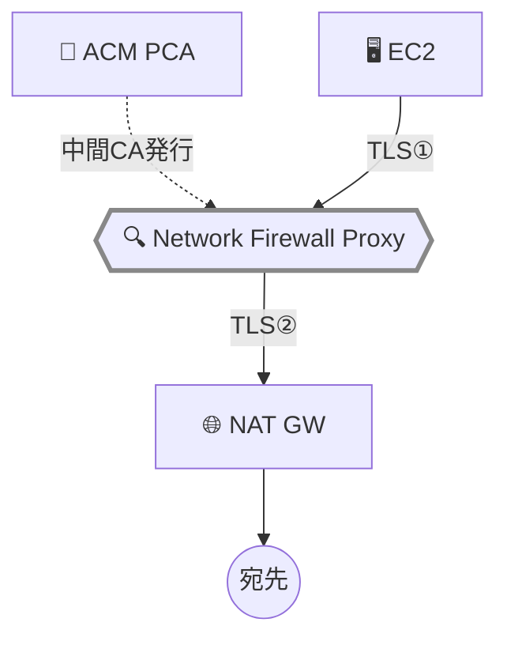

## はじめに

[前回の記事](/ja/blog/2026/03/26/nfw-proxy-setup-domain-filtering)では、Network Firewall Proxy を TLS インターセプトなしでセットアップし、PreDNS フェーズのドメインフィルタリングを検証した。PreDNS だけでもドメインベースの Egress 制御は実現できるが、HTTPS トラフィックの中身（HTTP メソッド、URI パス、レスポンスの Content-Type）を検査するには、プロキシが TLS を終端して復号する必要がある。

この記事では、ACM Private CA を使って TLS インターセプトを有効化し、PreRequest / PostResponse フェーズで HTTPS トラフィックの検査ルールを検証した結果を共有する。PCA 設定で何度も失敗したトラブルシューティングの経験も記録する。

**Network Firewall Proxy は Public Preview 段階であり、仕様や動作は GA までに変更される可能性がある。本記事の内容は 2026年3月時点の動作に基づいている。**

前提条件:

- [前回の記事](/ja/blog/2026/03/26/nfw-proxy-setup-domain-filtering)で構築した環境（VPC、NAT Gateway、Proxy、EC2）
- ACM Private CA の操作権限
- RAM の操作権限

## TLS インターセプトの仕組み

TLS インターセプトが無効の場合、プロキシは CONNECT トンネルを中継するだけで、TLS ハンドシェイクはクライアントと宛先サーバー間で直接行われる。プロキシは暗号化されたペイロードを検査できず、PreRequest / PostResponse フェーズのルールは IP アドレスベースの条件しかマッチしない。

TLS インターセプトを有効にすると、プロキシはクライアントとの TLS セッションを終端し、宛先サーバーとの間に新しい TLS セッションを確立する。プロキシは宛先サーバーの代わりに証明書を生成してクライアントに提示する。この証明書は ACM Private CA が署名するため、クライアントのトラストストアに Root CA 証明書をインストールする必要がある。



- **TLS①**: クライアント ↔ Proxy（Proxy が生成した証明書）
- **TLS②**: Proxy ↔ 宛先（実サーバーの証明書）

## ACM Private CA のセットアップ

以降のコマンドで `ROOT_PCA_ARN` と `PROXY_ARN` を繰り返し使用する。最初に設定しておく。

```bash title="Terminal"
# Proxy ARN を取得（前回作成した Proxy）
PROXY_ARN=$(aws network-firewall describe-proxy --proxy-name nfw-proxy-test \
  --region us-east-2 --query 'Proxy.ProxyArn' --output text)
echo "PROXY_ARN: $PROXY_ARN"
```

<details className="my-4 rounded-lg border border-border bg-muted/30 p-4">
<summary className="cursor-pointer font-medium">Step 1: Root CA の作成と自己署名証明書のインストール</summary>

```bash title="Terminal"
# Root CA 作成
ROOT_PCA_ARN=$(aws acm-pca create-certificate-authority \
  --certificate-authority-configuration '{
    "KeyAlgorithm": "RSA_2048",
    "SigningAlgorithm": "SHA256WITHRSA",
    "Subject": {"CommonName": "NFW Proxy Test Root CA", "Organization": "Test", "Country": "US"}
  }' \
  --certificate-authority-type ROOT \
  --region us-east-2 \
  --query CertificateAuthorityArn --output text)

# CSR 取得 → 自己署名証明書発行 → インポート
aws acm-pca get-certificate-authority-csr \
  --certificate-authority-arn "$ROOT_PCA_ARN" \
  --output text --region us-east-2 > /tmp/root-ca.csr

CERT_ARN=$(aws acm-pca issue-certificate \
  --certificate-authority-arn "$ROOT_PCA_ARN" \
  --csr fileb:///tmp/root-ca.csr \
  --signing-algorithm SHA256WITHRSA \
  --template-arn arn:aws:acm-pca:::template/RootCACertificate/V1 \
  --validity Value=3650,Type=DAYS \
  --region us-east-2 \
  --query CertificateArn --output text)

sleep 5

aws acm-pca get-certificate \
  --certificate-authority-arn "$ROOT_PCA_ARN" \
  --certificate-arn "$CERT_ARN" \
  --output text --region us-east-2 > /tmp/root-ca-cert.pem

aws acm-pca import-certificate-authority-certificate \
  --certificate-authority-arn "$ROOT_PCA_ARN" \
  --certificate fileb:///tmp/root-ca-cert.pem \
  --region us-east-2

# 状態確認（ACTIVE になるまで待つ）
aws acm-pca describe-certificate-authority \
  --certificate-authority-arn "$ROOT_PCA_ARN" \
  --query 'CertificateAuthority.Status' --output text --region us-east-2

echo "ROOT_PCA_ARN: $ROOT_PCA_ARN"
```

以降のステップで `$ROOT_PCA_ARN` を使用する。

</details>

### RAM リソース共有の設定

Proxy が PCA を使って証明書を発行するには、RAM でリソース共有を設定する必要がある。

<details className="my-4 rounded-lg border border-border bg-muted/30 p-4">
<summary className="cursor-pointer font-medium">Step 2: RAM リソース共有の作成</summary>

```bash title="Terminal"

aws ram create-resource-share \
  --name nfw-proxy-pca-share \
  --resource-arns "$ROOT_PCA_ARN" \
  --principals proxy.network-firewall.amazonaws.com \
  --permission-arns "arn:aws:ram::aws:permission/AWSRAMSubordinateCACertificatePathLen0IssuanceCertificateAuthority" \
  --sources "$PROXY_ARN" \
  --region us-east-2
```

RAM 共有を作成すると、PCA に対してリソースポリシーが自動的に設定される。ただし、Preview 環境ではこれだけでは不十分だった。

</details>

### PCA ポリシーの落とし穴（Preview 固有）

ここが最大のハマりポイントだった。RAM 共有で `proxy.network-firewall.amazonaws.com` を設定しただけでは、TLS インターセプトの有効化が `Access denied while generating intermediate CA certificate` で失敗する。

原因を調査したところ、[セキュリティドキュメント](https://docs.aws.amazon.com/network-firewall/latest/developerguide/proxy-security.html#proxy-pca-configuration)のポリシー例では **`preprod.proxy.network-firewall.amazonaws.com`** というサービスプリンシパルが使われていた。Preview 環境では、RAM 共有（非 preprod）と PCA ポリシー（preprod）の**両方**が必要だった。GA ではサービスプリンシパルが統一される可能性が高い。

<details className="my-4 rounded-lg border border-border bg-muted/30 p-4">
<summary className="cursor-pointer font-medium">PCA ポリシーの設定（RAM 自動生成 + preprod プリンシパル追加）</summary>

```bash title="Terminal"
# RAM 共有が自動生成したポリシーに加えて、preprod プリンシパルを追加
cat > /tmp/pca-policy.json << 'EOF'
{
  "Version": "2012-10-17",
  "Statement": [
    {
      "Sid": "ram-read",
      "Effect": "Allow",
      "Principal": {"Service": "proxy.network-firewall.amazonaws.com"},
      "Action": ["acm-pca:DescribeCertificateAuthority","acm-pca:GetCertificate",
                  "acm-pca:GetCertificateAuthorityCertificate","acm-pca:ListPermissions","acm-pca:ListTags"],
      "Resource": "<ROOT_PCA_ARN>",
      "Condition": {"ArnEquals": {"aws:SourceArn": "<PROXY_ARN>"}}
    },
    {
      "Sid": "ram-issue",
      "Effect": "Allow",
      "Principal": {"Service": "proxy.network-firewall.amazonaws.com"},
      "Action": "acm-pca:IssueCertificate",
      "Resource": "<ROOT_PCA_ARN>",
      "Condition": {
        "StringEquals": {"acm-pca:TemplateArn": "arn:aws:acm-pca:::template/SubordinateCACertificate_PathLen0/V1"},
        "ArnEquals": {"aws:SourceArn": "<PROXY_ARN>"}
      }
    },
    {
      "Sid": "preprod-all",
      "Effect": "Allow",
      "Principal": {"Service": "preprod.proxy.network-firewall.amazonaws.com"},
      "Action": ["acm-pca:DescribeCertificateAuthority","acm-pca:GetCertificate",
                  "acm-pca:GetCertificateAuthorityCertificate","acm-pca:IssueCertificate",
                  "acm-pca:ListPermissions","acm-pca:ListTags"],
      "Resource": "<ROOT_PCA_ARN>",
      "Condition": {"ArnEquals": {"aws:SourceArn": "<PROXY_ARN>"}}
    }
  ]
}
EOF

aws acm-pca put-policy \
  --resource-arn "$ROOT_PCA_ARN" \
  --policy file:///tmp/pca-policy.json \
  --region us-east-2
```

`<ROOT_PCA_ARN>` と `<PROXY_ARN>` は自分の環境の値に置き換える。

</details>

この設定で TLS インターセプトの有効化が成功した。

### Proxy の TLS インターセプト有効化

<details className="my-4 rounded-lg border border-border bg-muted/30 p-4">
<summary className="cursor-pointer font-medium">Proxy の更新コマンド</summary>

```bash title="Terminal"
UPDATE_TOKEN=$(aws network-firewall describe-proxy --proxy-name nfw-proxy-test \
  --region us-east-2 --query UpdateToken --output text)

aws network-firewall update-proxy \
  --proxy-name nfw-proxy-test \
  --nat-gateway-id nat-xxx \
  --tls-intercept-properties "PcaArn=$ROOT_PCA_ARN,TlsInterceptMode=ENABLED" \
  --update-token "$UPDATE_TOKEN" \
  --region us-east-2
```

状態が `MODIFYING` → `COMPLETED` になるまで約5分かかった。

```bash title="Terminal"
aws network-firewall describe-proxy --proxy-name nfw-proxy-test \
  --region us-east-2 \
  --query 'Proxy.{State:ProxyState,ModifyState:ProxyModifyState,TLS:TlsInterceptProperties}'
```

```json title="Output"
{
  "State": "ATTACHED",
  "ModifyState": "COMPLETED",
  "TLS": {
    "PcaArn": "arn:aws:acm-pca:us-east-2:<account-id>:certificate-authority/<ca-id>",
    "TlsInterceptMode": "ENABLED"
  }
}
```

</details>

### クライアントへの CA 証明書インストール

クライアントが Proxy の生成する証明書を信頼するために、Root CA 証明書をトラストストアに追加する。EC2 はプライベートサブネットにあるため、SSM 経由で証明書を書き込む。

```bash title="Terminal"
# Root CA 証明書を base64 エンコードして SSM 経由で EC2 に書き込む
ROOT_CERT_B64=$(aws acm-pca get-certificate-authority-certificate \
  --certificate-authority-arn "$ROOT_PCA_ARN" \
  --region us-east-2 --query Certificate --output text | base64 -w0)

aws ssm send-command \
  --instance-ids <instance-id> \
  --document-name "AWS-RunShellScript" \
  --parameters "commands=[
    \"echo '$ROOT_CERT_B64' | base64 -d | sudo tee /etc/pki/ca-trust/source/anchors/nfw-proxy-root-ca.pem > /dev/null\",
    \"sudo update-ca-trust\",
    \"echo 'CA cert installed'\"
  ]" --region us-east-2
```

## 検証 1: HTTP メソッド制限（PreRequest フェーズ）

TLS インターセプト有効時に、HTTP メソッドでフィルタリングできることを確認する。検証には httpbin.org を使用するため、まず PreDNS の許可リストに追加する。

<details className="my-4 rounded-lg border border-border bg-muted/30 p-4">
<summary className="cursor-pointer font-medium">httpbin.org の許可 + PreRequest ルールの作成</summary>

```bash title="Terminal"
# httpbin.org を PreDNS 許可リストに追加
aws network-firewall create-proxy-rules \
  --proxy-rule-group-name domain-allowlist \
  --rules '{
    "PreDNS": [{
      "ProxyRuleName": "allow-httpbin",
      "Action": "ALLOW",
      "InsertPosition": 2,
      "Conditions": [{"ConditionKey":"request:DestinationDomain","ConditionOperator":"StringEquals","ConditionValues":["httpbin.org"]}]
    }]
  }' --region us-east-2

# PreRequest ルールグループ作成
aws network-firewall create-proxy-rule-group \
  --proxy-rule-group-name tls-intercept-rules \
  --description "PreRequest and PostResponse rules" \
  --region us-east-2

aws network-firewall create-proxy-rules \
  --proxy-rule-group-name tls-intercept-rules \
  --rules '{
    "PreREQUEST": [
      {
        "ProxyRuleName": "block-post-method",
        "Description": "Block HTTP POST requests",
        "Action": "DENY",
        "InsertPosition": 0,
        "Conditions": [{
          "ConditionKey": "request:Http:Method",
          "ConditionOperator": "StringEquals",
          "ConditionValues": ["POST"]
        }]
      }
    ]
  }' --region us-east-2

# Proxy Configuration にアタッチ
TOKEN=$(aws network-firewall describe-proxy-configuration \
  --proxy-configuration-name domain-allowlist-config \
  --query UpdateToken --output text --region us-east-2)

aws network-firewall attach-rule-groups-to-proxy-configuration \
  --proxy-configuration-name domain-allowlist-config \
  --rule-groups '[{"InsertPosition":1,"ProxyRuleGroupName":"tls-intercept-rules"}]' \
  --update-token "$TOKEN" --region us-east-2
```

</details>

```bash title="Terminal"
# GET リクエスト（許可）
curl -s -o /dev/null -w "%{http_code}\n" --max-time 15 https://httpbin.org/get

# POST リクエスト（ブロック）
curl -s -o /dev/null -w "%{http_code}\n" --max-time 15 -X POST -d 'test=data' https://httpbin.org/post
```

| テスト | メソッド | 期待 | 結果 |
|---|---|---|---|
| `https://httpbin.org/get` | GET | ALLOW | ✅ **200** |
| `https://httpbin.org/post` | POST | DENY | ✅ **403** |

TLS インターセプトにより、プロキシが復号した HTTP リクエストのメソッドを検査してブロックできることを確認した。

注目すべき点として、**HTTP（非 TLS）の POST リクエストも同様にブロックされた**。HTTP の場合はプロキシが absolute-form のリクエストを直接受け取るため、TLS インターセプトなしでも HTTP ヘッダーの検査が可能だ。

```bash title="Terminal"
# HTTP POST（TLS なしでもブロックされる）
curl -s -o /dev/null -w "%{http_code}\n" --max-time 15 -X POST -d 'test=data' http://httpbin.org/post
# → 403
```

## 検証 2: Content-Type フィルタリング（PostResponse フェーズ）

宛先サーバーからのレスポンスの Content-Type に基づいてフィルタリングする。

<details className="my-4 rounded-lg border border-border bg-muted/30 p-4">
<summary className="cursor-pointer font-medium">PostResponse ルールの追加</summary>

```bash title="Terminal"
aws network-firewall create-proxy-rules \
  --proxy-rule-group-name tls-intercept-rules \
  --rules '{
    "PostRESPONSE": [{
      "ProxyRuleName": "block-binary-content",
      "Description": "Block binary content responses",
      "Action": "DENY",
      "InsertPosition": 0,
      "Conditions": [{
        "ConditionKey": "response:Http:ContentType",
        "ConditionOperator": "StringLike",
        "ConditionValues": ["application/octet-stream*"]
      }]
    }]
  }' --region us-east-2
```

</details>

```bash title="Terminal"
# JSON レスポンス（許可）
curl -s -o /dev/null -w "%{http_code}\n" --max-time 15 https://httpbin.org/get

# バイナリレスポンス（ブロック）
curl -s -o /dev/null -w "%{http_code}\n" --max-time 15 https://httpbin.org/bytes/100
```

| テスト | Content-Type | 期待 | 結果 |
|---|---|---|---|
| `https://httpbin.org/get` | application/json | ALLOW | ✅ **200** |
| `https://httpbin.org/bytes/100` | application/octet-stream | DENY | ✅ **403** |

PostResponse フェーズでは、宛先サーバーからのレスポンスを検査した上でブロックできる。実行ファイルのダウンロード防止などのユースケースに有効だ。

## 検証 3: TLS インターセプトの証明書確認

TLS インターセプト有効時に、プロキシがどのような証明書を提示するか確認する。

```bash title="Terminal"
curl -v -s -o /dev/null --max-time 15 https://httpbin.org/get 2>&1 | grep -E 'subject:|issuer:'
```

```text title="Output"
*   subject: C=US; O=AWS; OU=Network Firewall Proxy; CN=httpbin.org
*   issuer: CN=AWS Network Firewall Proxy
```

プロキシは宛先ドメイン（`httpbin.org`）を CN に持つ証明書を動的に生成し、`AWS Network Firewall Proxy` という中間 CA で署名している。この中間 CA は、セットアップ時に指定した Root CA から自動的に発行されたものだ。

## 検証で発見した制約

### 一部サイトで 502 Bad Gateway

Cloudflare 経由の `example.com` に対して TLS インターセプト有効でアクセスすると、CONNECT トンネルと TLS ハンドシェイクは成功するが、HTTP リクエスト送信後に 502 Bad Gateway が返された。同じドメインに HTTP（非 TLS）でアクセスすると正常に 200 が返る。`httpbin.org` では問題なく動作した。

Preview 時点の制約として、特定の CDN やサーバー構成との互換性に問題がある可能性がある。

### URI パスのマッチング

`request:Http:Uri` の `StringLike` マッチングは**パス全体の先頭から**評価される。`/admin*` というパターンは `/admin` や `/admin/secret` のようにパスが `/admin` で始まる場合にマッチするが、`/anything/admin/secret` にはマッチしなかった。パスの途中にあるパターンをマッチさせるには `*/admin*` のようにワイルドカードを先頭に付ける必要がある。

## まとめ

- **PCA 設定は Preview 最大のハマりポイント** — RAM 共有（`proxy.network-firewall.amazonaws.com`）と PCA ポリシー（`preprod.proxy.network-firewall.amazonaws.com`）の両方が必要。ドキュメント間で不整合があり、試行錯誤が必要だった
- **PreRequest フェーズは HTTP でも機能する** — TLS インターセプトなしでも、HTTP の absolute-form リクエストに対してはメソッドやヘッダーの検査が可能。HTTPS の検査には TLS インターセプトが必須
- **PostResponse で実行ファイルのダウンロードを防止できる** — `response:Http:ContentType` で `application/octet-stream` をブロックすれば、バイナリファイルのダウンロードを組織レベルで制御できる
- **証明書は自動生成される** — Proxy が宛先ドメインごとに証明書を動的生成し、中間 CA で署名する。クライアントには Root CA 証明書のインストールのみ必要

次回はマルチ VPC 構成を検証する。今回構築した環境はそのまま次回以降も使用するため、クリーンアップはシリーズ最終回でまとめて実施する。
