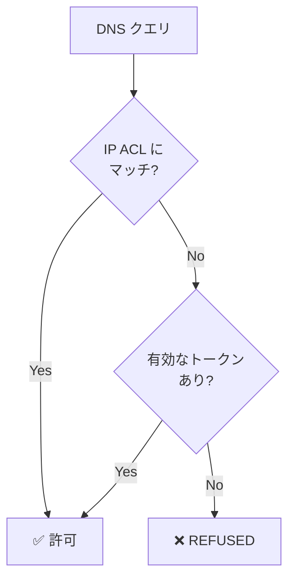

## はじめに

2026年3月9日、AWS は [Amazon Route 53 Global Resolver の一般提供](https://aws.amazon.com/about-aws/whats-new/2026/03/amazon-route-53-global-resolver/)を発表した。2025年12月の re:Invent でプレビューされていた機能が、30 リージョンに拡大して GA となった。

Global Resolver は、インターネット経由でどこからでもアクセスできるエニーキャスト DNS リゾルバーである。既存の VPC Resolver（旧 Route 53 Resolver）が VPC 内部または VPN/Direct Connect 経由でのアクセスに限定されるのに対し、Global Resolver はオンプレミス、ブランチオフィス、リモートクライアントから直接利用できる。DNS フィルタリング（マルウェア、フィッシング、DGA 検出）と暗号化 DNS（DoH/DoT）を備え、分散環境の DNS セキュリティを一元管理できる。

ただし、最小構成（2 リージョン + DNS フィルタリング）で **月額約 \$3,650**（\$5.00/時間 × 730 時間）と、VPC Resolver のエンドポイント 1 つ（約 \$183/月）と単純比較すると約 20 倍のコストになる。ただし VPC Resolver で同等の機能（マルチリージョン + DNS フィルタリング）を実現するには複数エンドポイントと DNS Firewall の追加コストが必要なため、単純な倍率比較は参考値に留まる。30 日間の無料トライアル（2 リージョン + フィルタリング + 10 億クエリ）があるため、本記事の検証もトライアル内で完結する。

本記事では、Global Resolver の作成から IP ACL 認証（Do53）、DNS フィルタリング、トークン認証（DoH）までを CLI で段階的に検証し、各ステップの伝播時間を計測する。読者はこの記事だけで PoC を完了し、自環境への導入可否を判断できる。なお、プライベートホストゾーンの解決は対象外とし、パブリックドメインの解決とフィルタリングに焦点を当てる。

公式ドキュメントは [What is Route 53 Global Resolver?](https://docs.aws.amazon.com/Route53/latest/DeveloperGuide/gr-what-is-global-resolver.html) を参照。

前提条件:

- AWS CLI v2 設定済み（`route53globalresolver:*`、`s3:*`、`logs:*` の権限）
- `jq` コマンドが利用可能（CLI 出力からリソース ID を抽出するため）
- 検証リージョン: us-east-1 + ap-northeast-1（API 操作は us-east-2 が必須）
- `dig`、`curl` コマンドが利用可能

セットアップだけ見たい場合は[検証環境のセットアップ](#検証環境のセットアップ)、結果だけ見たい場合は[検証 1](#検証-1-do53--ip-acl-による基本的な名前解決)に進んでほしい。

## 検証環境のセットアップ

<details className="my-4 rounded-lg border border-border bg-muted/30 p-4">
<summary className="cursor-pointer font-medium">Global Resolver・DNS View・Access Source の作成手順</summary>

以降のコマンドでは、各リソースの ID を変数に格納して後続のステップで参照する。読者の環境では ID が異なるため、出力から取得した値を使うこと。

### Global Resolver の作成

Global Resolver の API 操作はすべて **us-east-2（Ohio）** で行う必要がある。これはサービスの仕様であり、リゾルバーのデプロイ先リージョンとは無関係である。

```bash title="Terminal (Global Resolver 作成)"
REGION="us-east-2"

GR_OUTPUT=$(aws route53globalresolver create-global-resolver \
  --region $REGION \
  --name "gr-verify-blog" \
  --ip-address-type IPV4 \
  --regions us-east-1 ap-northeast-1 \
  --observability-region ap-northeast-1 \
  --tags '{"Project":"blog-verification"}')

GR_ID=$(echo $GR_OUTPUT | jq -r '.id')
DNS_NAME=$(echo $GR_OUTPUT | jq -r '.dnsName' | sed 's/\.$//')
ANYCAST_IP1=$(echo $GR_OUTPUT | jq -r '.ipv4Addresses[0]')
ANYCAST_IP2=$(echo $GR_OUTPUT | jq -r '.ipv4Addresses[1]')

echo "GR_ID: $GR_ID"
echo "DNS_NAME: $DNS_NAME"
echo "Anycast IPs: $ANYCAST_IP1, $ANYCAST_IP2"
```

```text title="Output (筆者の環境)"
GR_ID: gr-2a300beae2d4689
DNS_NAME: 2a300beae2d4689.route53globalresolver.global.on.aws
Anycast IPs: 166.117.74.46, 99.83.153.248
```

作成直後のステータスは `CREATING`。`OPERATIONAL` になるまでポーリングする。

```bash title="Terminal (ステータス確認)"
while true; do
  STATUS=$(aws route53globalresolver get-global-resolver \
    --region $REGION --global-resolver-id $GR_ID \
    --query 'status' --output text)
  echo "$(date +%T) - $STATUS"
  [ "$STATUS" = "OPERATIONAL" ] && break
  sleep 15
done
```

**結果: 作成開始から OPERATIONAL まで約 11 分。**

### DNS View の作成

DNS View は、クライアントグループごとに異なる DNS ポリシー（認証方式、フィルタリングルール、プライベートホストゾーンの紐付け）を適用するための設定単位である。1 つの Global Resolver に複数の DNS View を作成でき、スプリットホライズン DNS を実現できる。今回は検証用に 1 つだけ作成する。

```bash title="Terminal (DNS View 作成)"
DNSV_ID=$(aws route53globalresolver create-dns-view \
  --region $REGION \
  --global-resolver-id $GR_ID \
  --name "view-verify" \
  --query 'id' --output text)

echo "DNSV_ID: $DNSV_ID"
```

**約 1 分で OPERATIONAL。** DNS View は作成時点で有効（`enable-dns-view` は不要）。

### Access Source（IP ACL）の作成

自分のグローバル IP を Do53 プロトコルで許可する。

```bash title="Terminal (Access Source 作成)"
MY_IP=$(curl -s https://checkip.amazonaws.com)

aws route53globalresolver create-access-source \
  --region $REGION \
  --dns-view-id $DNSV_ID \
  --cidr "${MY_IP}/32" \
  --ip-address-type IPV4 \
  --protocol DO53
```

**約 1 分で OPERATIONAL。**

</details>

## 検証 1: Do53 + IP ACL による基本的な名前解決

Global Resolver が返すエニーキャスト IP アドレスに対して、`dig` でパブリックドメインを問い合わせる。エニーキャストとは、同じ IP アドレスを複数のリージョンで共有し、クライアントから最も近いリージョンに自動的にルーティングする技術である。以降のコマンドでは、セットアップで取得した変数（`$ANYCAST_IP1`、`$ANYCAST_IP2`、`$DNS_NAME` 等）を使用する。

```bash title="Terminal"
dig @$ANYCAST_IP1 example.com A +noall +answer +stats
```

```text title="Output (筆者の環境)"
example.com.        187     IN  A   104.18.26.120
example.com.        187     IN  A   104.18.27.120
;; Query time: 12 msec
;; SERVER: 166.117.74.46#53(166.117.74.46) (UDP)
```

12 ミリ秒で応答が返った。もう一方のエニーキャスト IP でも同様に動作する。

```bash title="Terminal"
dig @$ANYCAST_IP2 example.com A +short
```

```text title="Output"
104.18.26.120
104.18.27.120
```

複数のドメインでも確認する。

```bash title="Terminal"
dig @$ANYCAST_IP1 aws.amazon.com A +short
dig @$ANYCAST_IP1 google.com A +short
dig @$ANYCAST_IP1 github.com A +short
```

```text title="Output"
# aws.amazon.com
tp.8e49140c2-frontier.amazon.com.
dr49lng3n1n2s.cloudfront.net.
18.65.168.18
...

# google.com
142.251.23.102
...

# github.com
20.27.177.113
```

すべて正常に解決された。Global Resolver の作成から最初のクエリ成功まで、セットアップ全体で **約 13 分**（Global Resolver 11 分 + DNS View 1 分 + Access Source 1 分）だった。

## 検証 2: DNS フィルタリング（BLOCK ルールと ALERT ルール）

Global Resolver の DNS フィルタリングは、Route 53 Resolver DNS Firewall と同じ仕組みを使う。DNS View にルールを追加し、各ルールにはドメインリスト（カスタムまたは AWS マネージド）とアクション（ALLOW / BLOCK / ALERT）を指定する。ルールは priority の昇順で評価され、最初にマッチしたルールのアクションが適用される。

### カスタムドメインリストによる BLOCK

Managed Domain List の個別ドメインは非公開のため、確実にブロックを再現できるカスタムドメインリストを使う。

<details className="my-4 rounded-lg border border-border bg-muted/30 p-4">
<summary className="cursor-pointer font-medium">カスタムドメインリストの作成手順（BLOCK 用 + ALERT 用）</summary>

ドメインリストの作成とドメインのインポートには S3 経由のファイルアップロードが必要である。

```bash title="Terminal (S3 バケット作成)"
BUCKET_NAME="gr-verify-domains-$(date +%s)"
aws s3 mb s3://$BUCKET_NAME --region us-east-2
```

**BLOCK 用ドメインリスト**

```bash title="Terminal (BLOCK 用ドメインリスト作成)"
# ドメインリスト作成
FDL_BLOCK_ID=$(aws route53globalresolver create-firewall-domain-list \
  --region $REGION \
  --global-resolver-id $GR_ID \
  --name "test-block-list" \
  --query 'id' --output text)

echo "FDL_BLOCK_ID: $FDL_BLOCK_ID"

# OPERATIONAL になるまで待機（約 1 分）
```

```bash title="Terminal (S3 経由でドメインインポート)"
echo -e "blocked-test.example.com\nanother-blocked.example.net" > /tmp/block-domains.txt
aws s3 cp /tmp/block-domains.txt s3://$BUCKET_NAME/block-domains.txt

aws route53globalresolver import-firewall-domains \
  --region $REGION \
  --firewall-domain-list-id $FDL_BLOCK_ID \
  --domain-file-url "s3://${BUCKET_NAME}/block-domains.txt" \
  --operation REPLACE
```

**ALERT 用ドメインリスト**

```bash title="Terminal (ALERT 用ドメインリスト作成)"
FDL_ALERT_ID=$(aws route53globalresolver create-firewall-domain-list \
  --region $REGION \
  --global-resolver-id $GR_ID \
  --name "test-alert-list" \
  --query 'id' --output text)

echo "FDL_ALERT_ID: $FDL_ALERT_ID"

# OPERATIONAL になるまで待機（約 1 分）
```

```bash title="Terminal (S3 経由でドメインインポート)"
echo "alert-test.example.org" > /tmp/alert-domains.txt
aws s3 cp /tmp/alert-domains.txt s3://$BUCKET_NAME/alert-domains.txt

aws route53globalresolver import-firewall-domains \
  --region $REGION \
  --firewall-domain-list-id $FDL_ALERT_ID \
  --domain-file-url "s3://${BUCKET_NAME}/alert-domains.txt" \
  --operation REPLACE
```

</details>

BLOCK ルールを作成する。

```bash title="Terminal (BLOCK ルール作成)"
aws route53globalresolver create-firewall-rule \
  --region $REGION \
  --dns-view-id $DNSV_ID \
  --name "block-custom-domains" \
  --firewall-domain-list-id $FDL_BLOCK_ID \
  --action BLOCK \
  --block-response NXDOMAIN \
  --priority 50
```

ここで注意点がある。[ドキュメントの Firewall ルール設定ガイド](https://docs.aws.amazon.com/Route53/latest/DeveloperGuide/gr-configure-manage-firewall-rules.html)では priority 100-999 を推奨しているが、**実際の上限は 100** である。1000 を指定すると `ServiceQuotaExceededException`（`Priority value 1000 exceeds the maximum allowed value of 100`）が発生する。GA 直後のためドキュメントが未整備の可能性があるが、2026年4月時点ではドキュメントの推奨値と実際の制約が一致していない。

ルール作成直後からブロックが効くかを計測した。

```text title="Output (伝播時間の計測)"
08:56:44 - ルール作成直後  → 応答なし（空）
08:56:59 - 15秒後         → NXDOMAIN ✓
08:57:14 - 30秒後         → NXDOMAIN ✓
```

**ルール作成から約 15 秒でブロックが反映された。** フィルタリングの伝播は非常に速い。

ブロック対象外のドメインは引き続き正常に解決できることも確認する。

```bash title="Terminal"
# ブロック対象外
dig @$ANYCAST_IP1 example.com A +short
# → 104.18.26.120, 104.18.27.120（正常）

# ブロック対象
dig @$ANYCAST_IP1 another-blocked.example.net A +noall +comments
# → status: NXDOMAIN（ブロック）
```

### Managed Domain List による BLOCK

AWS が管理する脅威ドメインリストも利用できる。

```bash title="Terminal"
# 利用可能な THREAT リストを確認
aws route53globalresolver list-managed-firewall-domain-lists \
  --region $REGION \
  --managed-firewall-domain-list-type THREAT
```

```text title="Output (抜粋・整形済み)"
Malware                          (aws-managed-fdl-11)
Botnet/Command and Control       (aws-managed-fdl-12)
Aggregate Threat List            (aws-managed-fdl-14)
Amazon GuardDuty Threat List     (aws-managed-fdl-15)
Phishing                         (aws-managed-fdl-16)
Spam                             (aws-managed-fdl-17)
```

実際の出力は JSON 形式で、各エントリに `id`、`name`、`managedListType` フィールドが含まれる。

Aggregate Threat List で BLOCK ルールを作成する。

```bash title="Terminal"
aws route53globalresolver create-firewall-rule \
  --region $REGION \
  --dns-view-id $DNSV_ID \
  --name "block-aggregate-threats" \
  --firewall-domain-list-id aws-managed-fdl-14 \
  --action BLOCK \
  --block-response NXDOMAIN \
  --priority 40
```

Managed Domain List の個別ドメインは非公開のため、ブロック動作の確認にはカスタムドメインリストを使うのが確実である。

### ALERT ルール

ALERT ルールはクエリを通過させつつ、ログに記録する。監視目的で使う。

```bash title="Terminal"
aws route53globalresolver create-firewall-rule \
  --region $REGION \
  --dns-view-id $DNSV_ID \
  --name "alert-test-domains" \
  --firewall-domain-list-id $FDL_ALERT_ID \
  --action ALERT \
  --priority 60
```

ALERT 対象ドメインへのクエリは正常に解決される。

```bash title="Terminal"
dig @$ANYCAST_IP1 alert-test.example.org A +noall +comments
```

```text title="Output"
;; ->>HEADER<<- opcode: QUERY, status: NOERROR, id: 40497
```

`NOERROR`（正常応答）が返り、ブロックされていない。ログの確認にはクエリログの設定が必要だが、**現時点では CLI にログ設定用のコマンドが存在せず、コンソールからのみ設定可能**である。これは CLI で完結させたい場合の制約となる。

ここまで Do53（平文 DNS）で検証してきたが、Do53 はクエリ内容が平文で送信されるため、リモートクライアントでは DNS クエリ自体が傍受されるリスクがある。次の検証では暗号化 DNS（DoH）に切り替え、フィルタリングが暗号化環境でも同様に機能するかを確認する。

## 検証 3: DoH + トークン認証

### Access Token の作成

DoH でトークン認証を使うには、Access Token を作成する。

```bash title="Terminal"
TOKEN_OUTPUT=$(aws route53globalresolver create-access-token \
  --region $REGION \
  --dns-view-id $DNSV_ID \
  --name "verify-token")

TOKEN=$(echo $TOKEN_OUTPUT | jq -r '.value')
echo "Token: $TOKEN"
```

```text title="Output (筆者の環境)"
Token: AaCf58VoiqQPPYDgYcukS-w31bmqv9nELag6mipESeC0ZAN5Ckqa5wU1zN68sURw
```

**約 1.5 分で OPERATIONAL。** トークンの有効期限はデフォルトで 1 年間。

### DoH クエリの実行

DoH クエリは `curl` で RFC 8484 形式の GET リクエストを送る。**トークンは Authorization ヘッダーではなく、URL パラメータ `?token=<value>` で渡す**。これはドキュメントに記載されているが、一般的な OAuth/Bearer トークンの慣習とは異なるため注意が必要である。

DoH では DNS クエリを[ワイヤフォーマット](https://datatracker.ietf.org/doc/html/rfc1035#section-4.1)で送信する必要がある。以下のヘルパー関数を定義しておくと、任意のドメインに対して DoH クエリを実行できる。

<details className="my-4 rounded-lg border border-border bg-muted/30 p-4">
<summary className="cursor-pointer font-medium">DoH ヘルパー関数の定義</summary>

```bash title="Terminal (ヘルパー関数定義)"
# ドメイン名を DNS ワイヤフォーマットに変換する関数
dns_wire_encode() {
  local domain=$1
  local hex=""
  IFS='.' read -ra labels <<< "$domain"
  for label in "${labels[@]}"; do
    hex+=$(printf '%02x' ${#label})
    hex+=$(echo -n "$label" | xxd -p)
  done
  hex+="00"  # ルートラベル
  echo "$hex"
}

# DoH GET クエリを実行する関数
doh_query() {
  local domain=$1
  local token_param=$2
  local encoded=$(dns_wire_encode "$domain")
  # DNS ヘッダー(12 bytes) + Question(domain + type A + class IN)
  local query_hex="000001000001000000000000${encoded}00010001"
  local dns_b64=$(echo "$query_hex" | xxd -r -p | base64 -w0 | tr '+/' '-_' | tr -d '=')

  if [ -n "$token_param" ]; then
    curl -s -H "Accept: application/dns-message" \
      "https://${DNS_NAME}/dns-query?token=${token_param}&dns=${dns_b64}" \
      -w "\nHTTP Status: %{http_code}"
  else
    curl -s -H "Accept: application/dns-message" \
      "https://${DNS_NAME}/dns-query?dns=${dns_b64}" \
      -w "\nHTTP Status: %{http_code}"
  fi
}
```

</details>

トークン認証の動作を正確に確認するため、DoH プロトコルの IP ACL Access Source がない状態でテストする。セットアップで作成した Access Source は Do53 プロトコル専用であり、DoH には影響しない。そのため、追加の操作なしでトークン認証のテストが可能である（IP ACL が存在するとトークンなしでも通過してしまう問題については後述）。

```bash title="Terminal (DoH クエリ)"
doh_query "example.com" "$TOKEN" -o response.bin
```

```text title="Output"
HTTP Status: 200
```

HTTP 200 で DNS レスポンスが返った。レスポンスのバイナリを確認すると、`8180`（正常応答）で example.com の A レコードが含まれている。

### 無効なトークンの拒否確認

```bash title="Terminal"
# 無効なトークン
doh_query "example.com" "INVALID_TOKEN" -o bad.bin

# トークンなし
doh_query "example.com" "" -o none.bin
```

どちらも HTTP 200 は返るが、DNS レスポンスのフラグは `8105`（**REFUSED**）である。HTTP レベルでは 200 だが、DNS レベルで拒否されるという挙動は、DoH クライアントの実装によってはエラーハンドリングに注意が必要になる可能性がある。

| リクエスト | HTTP Status | DNS フラグ | 結果 |
| --- | --- | --- | --- |
| 有効なトークン | 200 | `8180`（NOERROR） | 名前解決成功 |
| 無効なトークン | 200 | `8105`（REFUSED） | 拒否 |
| トークンなし | 200 | `8105`（REFUSED） | 拒否 |

### DoH 経由の DNS フィルタリング確認

検証 2 で設定した BLOCK ルールが DoH 経由でも機能するか確認する。

```bash title="Terminal"
# ブロック対象ドメイン
doh_query "blocked-test.example.com" "$TOKEN" -o blocked.bin
```

レスポンスの DNS フラグは `8503`（**NXDOMAIN**）。DoH 経由でも DNS フィルタリングは正常に機能する。

| ドメイン | プロトコル | DNS フラグ | 結果 |
| --- | --- | --- | --- |
| example.com | DoH + トークン | `8180`（NOERROR） | 正常解決 |
| blocked-test.example.com | DoH + トークン | `8503`（NXDOMAIN） | ブロック |
| google.com | DoH + トークン | `8180`（NOERROR） | 正常解決 |

### IP ACL とトークン認証の関係

検証中に判明した重要な挙動がある。**IP ACL とトークン認証は OR 条件で評価される**。同じ DNS View に Do53 の IP ACL と DoH のトークンを設定した場合、DoH の IP ACL Access Source が存在すると、トークンなしでも DoH クエリが通過する。



トークン認証を厳密に運用するには、DoH プロトコルの IP ACL Access Source を作成しないか、作成する場合は意図した IP 範囲に限定する必要がある。

## まとめ

### 検証結果の比較

| 観点 | Do53 + IP ACL | DoH + トークン |
| --- | --- | --- |
| 認証方式 | IP/CIDR ベース | トークン（URL パラメータ） |
| 暗号化 | なし | TLS（HTTPS） |
| ポート | 53（UDP） | 443（HTTPS） |
| セットアップ手順数 | 3 ステップ（GR + View + Access Source） | 4 ステップ（+ Token 作成） |
| 初回クエリ成功までの時間 | 約 13 分 | 約 14.5 分（+ Token 1.5 分） |
| リモートクライアント適性 | 固定 IP が必要 | 動的 IP でも利用可能 |
| ファイアウォール通過性 | UDP/53 の開放が必要 | 通常の HTTPS として通過 |
| フィルタリング動作 | NXDOMAIN で即座にブロック | 同様に NXDOMAIN でブロック |

### コスト対効果の判断

Global Resolver の料金体系:

| 構成 | 時間単価 | 月額概算 |
| --- | --- | --- |
| 2 リージョン + フィルタリング | \$5.00/h | **\$3,650** |
| 2 リージョン（フィルタリングなし） | \$4.50/h | \$3,285 |
| 5 リージョン + フィルタリング | \$9.50/h | \$6,935 |
| VPC Resolver エンドポイント 1 つ・2 ENI（参考） | \$0.25/h | \$183 |

Global Resolver が適するケース:
- 多拠点のリモートクライアントに統一的な DNS セキュリティポリシーを適用したい
- VPN インフラの運用コスト（人件費含む）が Global Resolver のコストを上回る
- 固定 IP を持たないリモートワーカーに DNS フィルタリングを適用したい

VPC Resolver で十分なケース:
- 拠点数が少なく、既に VPN/Direct Connect が整備済み
- DNS フィルタリングが VPC 内のワークロードに限定される
- コスト最適化が最優先

30 日間の無料トライアル（2 リージョン + フィルタリング + 10 億クエリ）があるため、まず自環境のクエリ量とフィルタリング要件を把握してから判断するのが合理的である。

### 得られたインサイト

- **伝播は速い、初期構築は遅い** — Firewall ルールの反映は 15 秒以内だが、Global Resolver 自体の作成に約 11 分かかる。運用開始後のルール変更は即座に反映されるため、初期構築後の運用負荷は低いと考えられる。
- **トークンは URL パラメータ** — DoH のトークン認証は `?token=<value>` 形式で渡す。Authorization ヘッダーではないため、DoH クライアントの設定時に注意が必要である。
- **CLI でログ設定ができない** — クエリログの配信先設定はコンソールからのみ可能。CLI で完結させたい IaC 環境では、別途 CloudFormation や Terraform での対応が必要になる。
- **Priority の上限は 100** — ドキュメントの Firewall ルール設定ガイドでは 100-999 を推奨しているが、実際の上限は 100。GA 直後のドキュメント未整備の可能性があるが、ルール設計時は実際の上限に従う必要がある。

## クリーンアップ

<details className="my-4 rounded-lg border border-border bg-muted/30 p-4">
<summary className="cursor-pointer font-medium">リソース削除コマンド</summary>

作成の逆順で削除する。以下のコマンドでは、セットアップ時に取得した変数を使用する。リソース ID は `list-*` コマンドで確認できる。

```bash title="Terminal (リソース ID の確認)"
# Firewall ルール一覧
aws route53globalresolver list-firewall-rules \
  --region $REGION --dns-view-id $DNSV_ID

# Access Token 一覧
aws route53globalresolver list-access-tokens \
  --region $REGION --dns-view-id $DNSV_ID

# Access Source 一覧
aws route53globalresolver list-access-sources \
  --region $REGION --dns-view-id $DNSV_ID
```

```bash title="Terminal (クリーンアップ)"
# Firewall ルール削除（list-firewall-rules で取得した ID を使用）
aws route53globalresolver delete-firewall-rule --region $REGION \
  --firewall-rule-id <BLOCK_RULE_ID> --dns-view-id $DNSV_ID
aws route53globalresolver delete-firewall-rule --region $REGION \
  --firewall-rule-id <MANAGED_BLOCK_RULE_ID> --dns-view-id $DNSV_ID
aws route53globalresolver delete-firewall-rule --region $REGION \
  --firewall-rule-id <ALERT_RULE_ID> --dns-view-id $DNSV_ID

# Access Token 削除
aws route53globalresolver delete-access-token --region $REGION \
  --access-token-id <TOKEN_ID>

# Access Source 削除
aws route53globalresolver delete-access-source --region $REGION \
  --access-source-id <ACCESS_SOURCE_ID>

# ドメインリスト削除
aws route53globalresolver delete-firewall-domain-list --region $REGION \
  --firewall-domain-list-id $FDL_BLOCK_ID
aws route53globalresolver delete-firewall-domain-list --region $REGION \
  --firewall-domain-list-id $FDL_ALERT_ID

# DNS View 削除
aws route53globalresolver delete-dns-view --region $REGION \
  --dns-view-id $DNSV_ID

# Global Resolver 削除
aws route53globalresolver delete-global-resolver --region $REGION \
  --global-resolver-id $GR_ID

# S3 バケット削除
aws s3 rb s3://$BUCKET_NAME --force --region us-east-2
```

</details>
