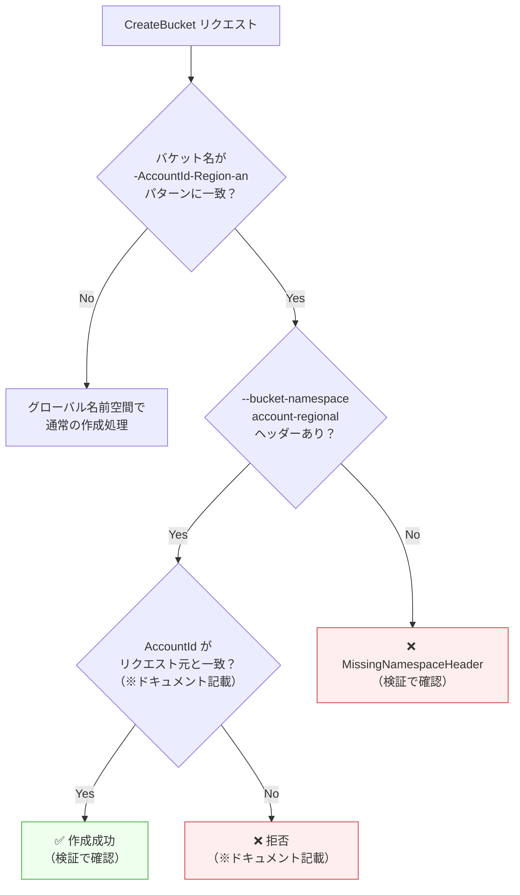

## はじめに

2026年3月12日、AWS は [Amazon S3 汎用バケットのアカウントリージョナル名前空間](https://aws.amazon.com/about-aws/whats-new/2026/03/amazon-s3-account-regional-namespaces/)を発表した。

S3 の汎用バケット名はパーティション内でグローバルに一意である必要がある。そのため「希望する名前が他アカウントに取られている」「削除したバケット名を第三者に再利用される」というリスクが常にあった。新機能では、バケット名にアカウント固有のサフィックスを付与することで、自アカウント専用の名前空間にバケットを作成できる。他アカウントがこのサフィックスを使おうとすると自動的に拒否される。

本記事では、アカウントリージョナルバケットの作成から命名制約の実測、IAM 条件キーによる組織強制まで CLI で検証し、採用判断に必要なデータを提供する。公式ドキュメントは [Namespaces for general purpose buckets](https://docs.aws.amazon.com/AmazonS3/latest/userguide/gpbucketnamespaces.html) を参照。

なお、この機能は Middle East (Bahrain) と Middle East (UAE) を除く全 AWS リージョンで利用可能で、追加費用はかからない。既存のグローバルバケットをアカウントリージョナル名前空間にリネームすることはできないが、新規バケットから段階的に採用できる。

前提条件:

- AWS CLI v2（`s3:*`、`iam:*`、`sts:*` の権限）
- jq（JSON パーサー。検証 3 の `assume-role` で使用）
- 検証リージョン: us-east-1、ap-southeast-1

以降のコマンドでは、次の環境変数を使用する。自身の環境に合わせて設定してほしい。

```bash title="Terminal (環境変数の設定)"
export ACCOUNT_ID=$(aws sts get-caller-identity --query Account --output text)
export REGION="us-east-1"
echo "Account ID: $ACCOUNT_ID"
```

## 検証 1: アカウントリージョナルバケットを作成してみる

アカウントリージョナル名前空間のバケット名は、以下の形式をとる。

```text title="命名規則"
{prefix}-{AccountId}-{Region}-an
```

`prefix` はユーザーが自由に決める部分、`-an` は account-regional namespace の略称サフィックスである。ドキュメントでは「グローバル名前空間の汎用バケットと同じ機能をすべてサポート」と記載されている。実際に確認する。

### バケット作成

`--bucket-namespace account-regional` を指定して作成する。`us-east-1` では `LocationConstraint` が不要なため、最もシンプルなパターンになる。

```bash title="Terminal"
aws s3api create-bucket \
  --bucket "my-ns-test-${ACCOUNT_ID}-${REGION}-an" \
  --bucket-namespace account-regional \
  --region "$REGION"
```

```json title="Output"
{
    "Location": "/my-ns-test-<account-id>-us-east-1-an",
    "BucketArn": "arn:aws:s3:::my-ns-test-<account-id>-us-east-1-an"
}
```

問題なく作成できた。

### オブジェクト操作

PUT / GET / DELETE を試す。

<details className="my-4 rounded-lg border border-border bg-muted/30 p-4">
<summary className="cursor-pointer font-medium">オブジェクト操作コマンド（PUT / GET / DELETE）</summary>

```bash title="Terminal"
BUCKET="my-ns-test-${ACCOUNT_ID}-${REGION}-an"

# テストファイル作成
echo "hello from account-regional namespace" > /tmp/s3-ns-test.txt

# PUT
aws s3api put-object \
  --bucket "$BUCKET" \
  --key test.txt \
  --body /tmp/s3-ns-test.txt \
  --region "$REGION"

# GET
aws s3api get-object \
  --bucket "$BUCKET" \
  --key test.txt \
  /tmp/s3-ns-get.txt \
  --region "$REGION"
cat /tmp/s3-ns-get.txt

# DELETE
aws s3api delete-object \
  --bucket "$BUCKET" \
  --key test.txt \
  --region "$REGION"
```

</details>

すべて正常に完了した。グローバルバケットと操作上の違いはない。

### メタデータ確認

`head-bucket` でバケットのメタデータを確認する。

```bash title="Terminal"
aws s3api head-bucket \
  --bucket "my-ns-test-${ACCOUNT_ID}-${REGION}-an" \
  --region "$REGION"
```

```json title="Output"
{
    "BucketArn": "arn:aws:s3:::my-ns-test-<account-id>-us-east-1-an",
    "BucketRegion": "us-east-1",
    "AccessPointAlias": false
}
```

`BucketArn` と `BucketRegion` は返るが、namespace を示す専用フィールドはない。`ListBuckets` でも同様で、`BucketNamespace` のようなフィールドは存在しなかった。現時点の API レスポンスでは、アカウントリージョナルバケットかどうかはバケット名末尾の `-an` サフィックスで判断する形になる。

作成したバケット名が思ったより長い。prefix に使える文字数はどのくらいか、次の検証で確認する。

## 検証 2: バケット名は何文字使える？リージョン別比較

### サフィックス長の計算

サフィックスは `-{AccountId(12桁)}-{Region}-an` の形式で、長さは `17 + len(Region)` 文字になる。バケット名全体の上限は 63 文字なので、prefix の最大文字数は `63 - 17 - len(Region)` = `46 - len(Region)` で求められる。

代表的なリージョンで比較する。

| リージョン | Region 長 | サフィックス長 | prefix 最大文字数 |
|---|---|---|---|
| us-east-1 | 9 | 26 | 37 |
| us-west-2 | 9 | 26 | 37 |
| eu-west-1 | 9 | 26 | 37 |
| ap-south-1 | 10 | 27 | 36 |
| eu-central-1 | 12 | 29 | 34 |
| ap-northeast-1 | 14 | 31 | 32 |
| ap-southeast-1 | 14 | 31 | 32 |

リージョン名が長いほど prefix に使える文字数が減る。`us-east-1` では 37 文字使えるが、`ap-northeast-1`（東京）では 32 文字まで。5 文字の差は、`my-app-prod-data` のような命名規則を使っている場合に影響しうる。

### 境界値テスト

実際に 63 文字ちょうどと 64 文字（1文字超過）で作成を試みる。`us-east-1` では prefix 最大 37 文字なので、37 文字の prefix で試す。

```bash title="Terminal (prefix 37文字 = 合計63文字 → 成功)"
PREFIX=$(printf 'a%.0s' {1..37})
aws s3api create-bucket \
  --bucket "${PREFIX}-${ACCOUNT_ID}-${REGION}-an" \
  --bucket-namespace account-regional \
  --region "$REGION"
```

63 文字ちょうどで成功。次に 38 文字の prefix（合計 64 文字）を試す。

```bash title="Terminal (prefix 38文字 = 合計64文字 → 失敗)"
PREFIX=$(printf 'a%.0s' {1..38})
aws s3api create-bucket \
  --bucket "${PREFIX}-${ACCOUNT_ID}-${REGION}-an" \
  --bucket-namespace account-regional \
  --region "$REGION"
```

```text title="Output"
An error occurred (InvalidBucketName) when calling the CreateBucket operation:
The specified bucket is not valid.
```

64 文字で `InvalidBucketName` エラー。`ap-southeast-1` でも同様に確認した。

<details className="my-4 rounded-lg border border-border bg-muted/30 p-4">
<summary className="cursor-pointer font-medium">ap-southeast-1 での境界値テスト（prefix 32文字 = 合計63文字）</summary>

```bash title="Terminal"
PREFIX=$(printf 'a%.0s' {1..32})
aws s3api create-bucket \
  --bucket "${PREFIX}-${ACCOUNT_ID}-ap-southeast-1-an" \
  --bucket-namespace account-regional \
  --region ap-southeast-1 \
  --create-bucket-configuration LocationConstraint=ap-southeast-1
```

`us-east-1` 以外のリージョンでは `--create-bucket-configuration LocationConstraint=<region>` が必要な点に注意。

</details>

マルチリージョンで同じ命名規則を使う場合は、最もリージョン名が長いリージョンに合わせて prefix を設計する必要がある。東京リージョン（`ap-northeast-1`）を使うなら、prefix は 32 文字以内に収める。

命名規則を理解しても、チームメンバーが従来通りグローバルバケットを作成してしまう可能性がある。組織全体で統制するにはどうすればよいか。

## 検証 3: 組織全体でアカウントリージョナル名前空間を強制する

`s3:x-amz-bucket-namespace` 条件キーを使った IAM ポリシーで、グローバル名前空間へのバケット作成を拒否できる。

### IAM ポリシーの作成

以下の Deny ポリシーは、`x-amz-bucket-namespace` ヘッダーが `account-regional` でないリクエストを拒否する。

```json title="S3RequireAccountRegionalNamespace ポリシー"
{
  "Version": "2012-10-17",
  "Statement": [
    {
      "Sid": "RequireAccountRegionalBucketCreation",
      "Effect": "Deny",
      "Action": "s3:CreateBucket",
      "Resource": "*",
      "Condition": {
        "StringNotEquals": {
          "s3:x-amz-bucket-namespace": "account-regional"
        }
      }
    }
  ]
}
```

このポリシーを S3 フルアクセス権限を持つテスト用 IAM ロールにアタッチして検証する。IAM の評価ロジックでは明示的な Deny が Allow に常に優先するため、S3FullAccess（Allow）と上記の Deny ポリシーを同時にアタッチすると、グローバルバケットの作成だけが拒否される。

検証には専用の IAM ロールを作成し、`assume-role` で切り替えて使用する。SSO や管理者ロールに直接 Deny ポリシーをアタッチすると、検証後の取り外し忘れで意図しない影響が出るリスクがあるためである。

<details className="my-4 rounded-lg border border-border bg-muted/30 p-4">
<summary className="cursor-pointer font-medium">テスト用 IAM ロールの作成手順</summary>

```bash title="Terminal"
# Deny ポリシーファイルの作成
cat > /tmp/s3-ns-deny-policy.json << 'EOF'
{
  "Version": "2012-10-17",
  "Statement": [
    {
      "Sid": "RequireAccountRegionalBucketCreation",
      "Effect": "Deny",
      "Action": "s3:CreateBucket",
      "Resource": "*",
      "Condition": {
        "StringNotEquals": {
          "s3:x-amz-bucket-namespace": "account-regional"
        }
      }
    }
  ]
}
EOF

# 信頼ポリシーの作成
cat > /tmp/s3-ns-trust-policy.json << EOF
{
  "Version": "2012-10-17",
  "Statement": [
    {
      "Effect": "Allow",
      "Principal": {
        "AWS": "arn:aws:iam::${ACCOUNT_ID}:root"
      },
      "Action": "sts:AssumeRole"
    }
  ]
}
EOF

# ロール作成
aws iam create-role \
  --role-name S3NamespaceTestRole \
  --assume-role-policy-document file:///tmp/s3-ns-trust-policy.json

# S3 フルアクセスをアタッチ
aws iam attach-role-policy \
  --role-name S3NamespaceTestRole \
  --policy-arn arn:aws:iam::aws:policy/AmazonS3FullAccess

# Deny ポリシーを作成・アタッチ
aws iam create-policy \
  --policy-name S3RequireAccountRegionalNamespace \
  --policy-document file:///tmp/s3-ns-deny-policy.json

aws iam attach-role-policy \
  --role-name S3NamespaceTestRole \
  --policy-arn "arn:aws:iam::${ACCOUNT_ID}:policy/S3RequireAccountRegionalNamespace"

# IAM 伝播を待機
echo "IAM ポリシーの伝播を待機中（10秒）..."
sleep 10
```

</details>

### テスト: グローバル名前空間でのバケット作成

テストロールを `assume-role` して、グローバル名前空間でバケットを作成する。

```bash title="Terminal"
# テストロールを assume
CREDS=$(aws sts assume-role \
  --role-arn "arn:aws:iam::${ACCOUNT_ID}:role/S3NamespaceTestRole" \
  --role-session-name ns-test)

export AWS_ACCESS_KEY_ID=$(echo "$CREDS" | jq -r '.Credentials.AccessKeyId')
export AWS_SECRET_ACCESS_KEY=$(echo "$CREDS" | jq -r '.Credentials.SecretAccessKey')
export AWS_SESSION_TOKEN=$(echo "$CREDS" | jq -r '.Credentials.SessionToken')

# グローバル名前空間でバケット作成を試行
aws s3api create-bucket \
  --bucket "my-global-test-$(date +%s)" \
  --region us-east-1
```

```text title="Output"
An error occurred (AccessDenied) when calling the CreateBucket operation:
User: arn:aws:sts::<account-id>:assumed-role/S3NamespaceTestRole/ns-test
is not authorized to perform: s3:CreateBucket on resource:
"arn:aws:s3:::my-global-test-1776004582"
with an explicit deny in an identity-based policy
```

`AccessDenied` で拒否された。エラーメッセージに `explicit deny in an identity-based policy` と明示されるため、原因の特定も容易である。

### テスト: アカウントリージョナル名前空間でのバケット作成

同じロールで、アカウントリージョナル名前空間にバケットを作成する。

```bash title="Terminal"
aws s3api create-bucket \
  --bucket "my-ar-test-${ACCOUNT_ID}-us-east-1-an" \
  --bucket-namespace account-regional \
  --region us-east-1
```

```json title="Output"
{
    "Location": "/my-ar-test-<account-id>-us-east-1-an",
    "BucketArn": "arn:aws:s3:::my-ar-test-<account-id>-us-east-1-an"
}
```

アカウントリージョナル名前空間では問題なく作成できた。IAM ポリシー 1 つで、グローバルバケットの作成を禁止しつつアカウントリージョナルバケットのみ許可できる。

なお、同じ条件キーは SCP（Service Control Policy）や RCP（Resource Control Policy）でも使用可能である。組織全体に適用する場合は SCP が適している。

```bash title="Terminal (assume-role の認証情報をクリア)"
unset AWS_ACCESS_KEY_ID AWS_SECRET_ACCESS_KEY AWS_SESSION_TOKEN
```

IAM ポリシーで組織を統制できることがわかった。では、そもそもアカウントリージョナルの名前パターンは、グローバル名前空間で保護されているのだろうか。

## 発見: グローバル名前空間での名前保護

ここまでの検証で、アカウントリージョナル名前空間のバケットは自アカウントしか作成できないことがわかった。しかし、1つ疑問が残る。アカウントリージョナルの命名パターン（`-{AccountId}-{Region}-an`）に合致する名前を、`--bucket-namespace` ヘッダーなしでグローバル名前空間に作成できてしまうのではないか？ もしできるなら、第三者がグローバル名前空間で同じ名前を先に取ることで、アカウントリージョナルバケットの作成を妨害できる可能性がある。



※ 印の分岐はドキュメントの記載に基づく。今回の検証では他アカウントの AccountId を含むパターンはテストしていない。

実際に試してみる。

```bash title="Terminal"
aws s3api create-bucket \
  --bucket "my-ns-test-${ACCOUNT_ID}-${REGION}-an" \
  --region "$REGION"
```

```text title="Output"
An error occurred (MissingNamespaceHeader) when calling the CreateBucket operation:
The requested bucket is an account-regional namespace bucket,
but your request is missing the required x-amz-bucket-namespace header.
```

`MissingNamespaceHeader` という専用エラーで拒否された。S3 側がバケット名のパターンを検出し、アカウントリージョナル名前空間の名前がグローバル名前空間で作成されることを防いでいる。

別の prefix を使っても同様である。

```bash title="Terminal"
aws s3api create-bucket \
  --bucket "different-prefix-${ACCOUNT_ID}-${REGION}-an" \
  --region "$REGION"
```

```text title="Output"
An error occurred (MissingNamespaceHeader) when calling the CreateBucket operation:
The requested bucket is an account-regional namespace bucket,
but your request is missing the required x-amz-bucket-namespace header.
```

つまり、自アカウントの AccountId を含む `-{AccountId}-{Region}-an` パターンの名前は、`--bucket-namespace` ヘッダーなしではグローバル名前空間で作成できなかった。ドキュメントでは他アカウントの AccountId を含むパターンについても同様に拒否されると記載されており、アカウントリージョナル名前空間の名前が「乗っ取られる」リスクは S3 側で排除されていると考えられる。

## まとめ

- **追加費用なし、全機能互換** — アカウントリージョナルバケットはグローバルバケットと同じ S3 機能をすべてサポートする。操作上の違いは作成時に `--bucket-namespace account-regional` を指定するだけ。採用のハードルは低い。
- **命名設計はリージョン名の長さを考慮する** — prefix に使える文字数はリージョンによって 32〜37 文字と変わる。マルチリージョン運用では、最もリージョン名が長いリージョンに合わせて prefix を設計する。
- **IAM 条件キーで組織強制が可能** — `s3:x-amz-bucket-namespace` 条件キーを使えば、Deny ポリシー 1 つでグローバルバケットの作成を禁止できる。SCP で組織全体に適用すれば、ガバナンスの統一が容易になる。
- **名前の保護は S3 側で実装済み** — アカウントリージョナルの命名パターンに合致する名前は、`--bucket-namespace` ヘッダーなしではグローバル名前空間で作成できない。ドキュメントの記載と今回の検証結果から、名前の乗っ取りリスクは S3 側で排除されていると判断できる。

<details className="my-4 rounded-lg border border-border bg-muted/30 p-4">
<summary className="cursor-pointer font-medium">クリーンアップ</summary>

リソースを作成の逆順で削除する。

```bash title="Terminal"
# 検証 3 で作成したバケット削除
aws s3api delete-bucket \
  --bucket "my-ar-test-${ACCOUNT_ID}-us-east-1-an" \
  --region us-east-1

# 検証 2 で作成したバケット削除
PREFIX37=$(printf 'a%.0s' {1..37})
aws s3api delete-bucket \
  --bucket "${PREFIX37}-${ACCOUNT_ID}-us-east-1-an" \
  --region us-east-1

PREFIX32=$(printf 'a%.0s' {1..32})
aws s3api delete-bucket \
  --bucket "${PREFIX32}-${ACCOUNT_ID}-ap-southeast-1-an" \
  --region ap-southeast-1

# 検証 1 で作成したバケット削除
aws s3api delete-bucket \
  --bucket "my-ns-test-${ACCOUNT_ID}-us-east-1-an" \
  --region us-east-1

# IAM リソース削除
aws iam detach-role-policy --role-name S3NamespaceTestRole \
  --policy-arn arn:aws:iam::aws:policy/AmazonS3FullAccess
aws iam detach-role-policy --role-name S3NamespaceTestRole \
  --policy-arn "arn:aws:iam::${ACCOUNT_ID}:policy/S3RequireAccountRegionalNamespace"
aws iam delete-role --role-name S3NamespaceTestRole
aws iam delete-policy \
  --policy-arn "arn:aws:iam::${ACCOUNT_ID}:policy/S3RequireAccountRegionalNamespace"
```

</details>
